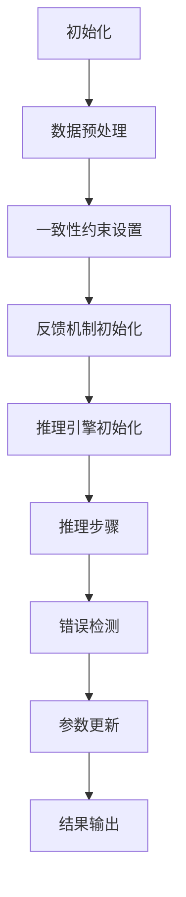
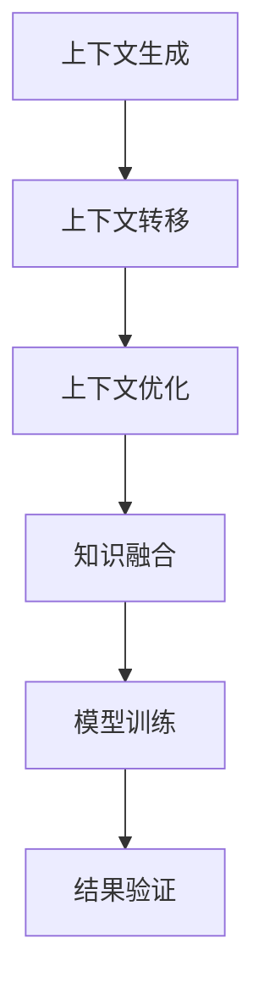
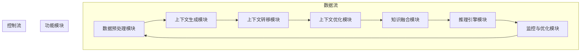
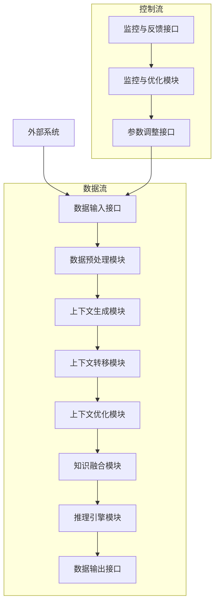

                 

### Self-Consistency CoT：增强AI推理能力的创新技术

#### 关键词：自洽性、AI推理、CoT技术、增强学习能力、计算机视觉、自然语言处理

> 摘要：本文旨在探讨一种创新的技术——Self-Consistency CoT，该技术旨在通过自洽性框架和上下文转移原理，提升人工智能的推理能力。文章将从背景介绍、核心概念解析、算法原理讲解、系统架构设计、项目实战和最佳实践总结等多个方面进行详细分析，旨在为读者提供全面深入的技术理解与应用指导。

---

#### 目录大纲

1. **背景介绍**

    - **第1章：问题背景与核心概念**
        - **1.1 问题背景**
            - **1.1.1 人工智能与AI推理能力的重要性**
            - **1.1.2 AI推理能力面临的挑战**
        - **1.2 核心概念**
            - **1.2.1 自洽性（Self-Consistency）定义**
            - **1.2.2 CoT（Contextualization Through Transfer）原理**
        - **1.3 边界与外延**
            - **1.3.1 自洽性在AI推理中的适用范围**
            - **1.3.2 CoT技术在不同AI领域的应用**
        - **1.4 概念结构与核心要素组成**
            - **1.4.1 自洽性框架的基本组成部分**
            - **1.4.2 CoT技术的关键步骤**

    - **第2章：自洽性原理与特性**
        - **2.1 自洽性原理**
            - **2.1.1 自洽性的定义与作用**
            - **2.1.2 自洽性在AI推理中的应用**
        - **2.2 自洽性的特性**
            - **2.2.1 自洽性的稳定性**
            - **2.2.2 自洽性的可扩展性**
            - **2.2.3 自洽性的实时性**

    - **第3章：CoT技术详解**
        - **3.1 CoT技术概述**
            - **3.1.1 CoT技术的定义与重要性**
            - **3.1.2 CoT技术的实现机制**
        - **3.2 CoT技术的核心步骤**
            - **3.2.1 上下文生成**
            - **3.2.2 上下文转移**
            - **3.2.3 上下文优化**
        - **3.3 CoT技术的应用场景**
            - **3.3.1 自然语言处理**
            - **3.3.2 计算机视觉**
            - **3.3.3 强化学习**

2. **算法原理讲解**

    - **第4章：自洽性与CoT算法原理**
        - **4.1 自洽性算法原理**
            - **4.1.1 自洽性算法的基本框架**
            - **4.1.2 自洽性算法的核心步骤**
            - **4.1.3 自洽性算法的数学模型与公式**
        - **4.2 CoT算法原理**
            - **4.2.1 CoT算法的基本原理**
            - **4.2.2 CoT算法的数学模型与公式**
        - **4.3 算法流程图**
            - **4.3.1 自洽性算法流程图**
            - **4.3.2 CoT算法流程图**
        - **4.4 举例说明**
            - **4.4.1 自洽性算法举例**
            - **4.4.2 CoT算法举例**

3. **系统分析与架构设计**

    - **第5章：自洽性与CoT系统架构设计**
        - **5.1 问题场景介绍**
            - **5.1.1 自洽性与CoT技术在实际应用中的问题场景**
        - **5.2 系统功能设计**
            - **5.2.1 领域模型**
            - **5.2.2 功能模块划分**
        - **5.3 系统架构设计**
            - **5.3.1 系统架构图**
            - **5.3.2 系统组件及其关系**
        - **5.4 系统接口设计**
            - **5.4.1 系统接口定义**
            - **5.4.2 接口交互流程**
        - **5.5 系统交互**
            - **5.5.1 系统交互图**
            - **5.5.2 系统交互流程**

4. **项目实战**

    - **第6章：项目实战与案例分析**
        - **6.1 环境安装**
            - **6.1.1 环境配置**
            - **6.1.2 环境依赖**
        - **6.2 系统核心实现**
            - **6.2.1 系统核心代码**
            - **6.2.2 代码应用解读与分析**
        - **6.3 实际案例分析**
            - **6.3.1 案例介绍**
            - **6.3.2 案例分析**
            - **6.3.3 案例详细讲解剖析**
        - **6.4 项目小结**
            - **6.4.1 项目成果总结**
            - **6.4.2 项目经验与教训**
            - **6.4.3 项目拓展与展望**

5. **最佳实践与总结**

    - **第7章：最佳实践与总结**
        - **7.1 最佳实践**
            - **7.1.1 自洽性与CoT技术的应用建议**
            - **7.1.2 避免常见错误与问题**
        - **7.2 小结**
            - **7.2.1 自洽性与CoT技术的重要性**
            - **7.2.2 算法原理与实践应用的关系**
        - **7.3 注意事项**
            - **7.3.1 在应用自洽性与CoT技术时需要注意的问题**
        - **7.4 拓展阅读**
            - **7.4.1 推荐相关文献与资料**
            - **7.4.2 未来研究方向与展望**

6. **附录**

    - **第8章：附录**
        - **8.1 术语表**
        - **8.2 参考文献**
        - **8.3 资源链接**

---

### 引言

人工智能（AI）作为现代科技发展的关键驱动力，已经深刻地改变了我们的生活和工作方式。尤其是在推理能力方面，AI的表现已经达到了前所未有的高度。然而，尽管AI在图像识别、自然语言处理、决策制定等领域取得了显著成就，但其推理能力的进一步提升仍然面临诸多挑战。例如，当处理复杂多变的现实问题时，AI模型往往难以保证其推理过程的连贯性和一致性，从而影响了其在实际应用中的效果和可靠性。

为了解决这一难题，本文将介绍一种创新的技术——Self-Consistency CoT（自洽性上下文转移技术）。该技术通过引入自洽性原理和上下文转移机制，旨在提升AI的推理能力，确保其在处理复杂问题时能够保持一致性和连贯性。Self-Consistency CoT不仅能够提高AI的推理精度，还能增强其学习能力和适应性，从而在多个AI应用领域展现出巨大的潜力。

本文结构如下：首先，我们将在第一部分介绍问题背景和核心概念，包括AI推理能力的重要性以及自洽性和CoT技术的定义和原理。接着，第二部分将深入讲解自洽性和CoT技术的特性、原理以及应用场景。第三部分将详细解析Self-Consistency CoT和CoT算法的原理，并使用Mermaid流程图和Python代码进行说明。第四部分将介绍自洽性与CoT技术的系统架构设计，包括问题场景、系统功能、架构设计和接口设计等。第五部分将结合实际项目，展示如何使用Self-Consistency CoT技术进行环境安装、系统核心实现和案例分析。最后，第六部分将总结最佳实践和注意事项，为读者提供实用的技术指导，并展望未来研究方向。

### 第1章：问题背景与核心概念

#### 1.1 问题背景

##### 1.1.1 人工智能与AI推理能力的重要性

人工智能（AI）作为当代科技领域的重要研究方向，其核心目标是通过机器学习和深度学习等算法，使计算机具备自主学习和决策能力。随着大数据、云计算和物联网技术的快速发展，AI的应用场景愈发广泛，从工业制造、医疗健康到金融保险、交通物流等各个领域都取得了显著成果。然而，AI的成功不仅仅依赖于其算法的复杂性和计算能力，更关键的是其推理能力。

AI的推理能力指的是在给定信息和情境下，AI系统能够通过逻辑分析、归纳总结和模式识别等方式，得出合理且有效的结论。推理能力的高低直接决定了AI系统的智能水平和应用价值。例如，在自动驾驶领域，车辆的推理能力决定了其能否在复杂交通环境中做出安全且合理的驾驶决策；在医疗诊断领域，AI的推理能力决定了其能否准确识别疾病并提供合理的治疗方案。

随着AI技术的不断进步，AI推理能力的重要性日益凸显。首先，AI推理能力是衡量AI系统智能化水平的重要指标。一个具备强大推理能力的AI系统，能够更准确地理解和应对复杂的问题，从而提升其应用效果和用户体验。其次，AI推理能力是推动AI技术实际应用的关键因素。例如，在金融风险管理、智能客服、智能安防等领域，AI推理能力的高低直接决定了系统的性能和可靠性。

然而，尽管AI在推理能力方面取得了显著进展，但仍然面临诸多挑战。首先，AI推理过程往往依赖于大量训练数据和复杂的模型结构，这使得其推理过程可能存在不一致性和不确定性。其次，AI推理能力在处理复杂多变的现实问题时，往往难以保证其推理过程的连贯性和一致性，从而影响了其在实际应用中的效果和可靠性。此外，AI推理能力在跨领域、跨学科的应用中也面临诸多限制，难以实现真正意义上的通用智能。

##### 1.1.2 AI推理能力面临的挑战

AI推理能力面临的挑战主要包括以下几个方面：

1. **数据依赖性强**：AI推理能力的高度依赖于大规模训练数据和高质量的模型结构。然而，现实世界中存在大量的稀疏数据和噪声数据，这些数据往往难以满足AI模型的训练需求。此外，AI模型在面对新情境和新问题时，往往需要重新训练，这使得其推理能力在面对动态变化的环境时表现出一定的局限性。

2. **不一致性与不确定性**：AI推理过程往往存在不一致性和不确定性。一方面，AI模型在训练过程中可能因为数据分布不均、样本偏差等问题导致其推理结果不一致。另一方面，AI模型在面对复杂情境时，可能无法准确预测或识别未知事件，从而导致推理结果的不确定性。

3. **连贯性与一致性**：在处理复杂多变的现实问题时，AI推理能力往往难以保证其推理过程的连贯性和一致性。例如，在自然语言处理领域，AI模型在处理长文本或复杂语境时，可能无法准确理解上下文关系，从而导致推理结果不准确或逻辑错误。

4. **跨领域应用限制**：AI推理能力在跨领域、跨学科的应用中面临诸多挑战。不同领域的知识表达方式和问题形式差异较大，使得AI模型难以在不同领域之间实现有效迁移和应用。

为了解决上述挑战，近年来研究人员提出了一系列创新方法和技术，其中自洽性（Self-Consistency）和上下文转移（Contextualization Through Transfer，简称CoT）技术被认为是具有潜力的解决方案。自洽性技术旨在通过确保推理过程的一致性和连贯性，提高AI推理能力；而CoT技术则通过上下文转移机制，实现不同领域和学科之间的知识共享和迁移。这两项技术的结合，有望为AI推理能力的发展带来新的突破。

#### 1.2 核心概念

##### 1.2.1 自洽性（Self-Consistency）定义

自洽性是指在一个系统内部，各个部分之间能够保持一致和协调，不会出现相互矛盾或冲突的现象。在人工智能领域，自洽性指的是AI系统在推理过程中能够保持内部逻辑的一致性和连贯性，不会出现推理结果自相矛盾的情况。

自洽性在AI推理中的作用至关重要。首先，自洽性能够确保AI系统在处理复杂问题时，能够保持一致的推理方向和结论，从而提高推理的可靠性和准确性。例如，在自然语言处理领域，自洽性技术可以帮助AI模型在理解长文本或复杂语境时，避免因为上下文关系理解错误导致推理结果不一致。其次，自洽性还能够增强AI系统的鲁棒性，使其在面对未知或异常情况时，能够保持稳定的推理能力，不会因为突发状况而失去方向。

自洽性的实现通常依赖于以下几个方面：

1. **一致性约束**：通过在模型设计过程中引入一致性约束条件，确保AI系统的推理结果不会相互矛盾。例如，在决策树算法中，可以通过设置剪枝策略来避免生成矛盾分支。

2. **反馈机制**：通过实时监测AI系统的推理过程，及时发现并纠正推理结果中的不一致性。例如，在循环神经网络中，可以通过反向传播算法对模型参数进行更新，以提高推理的一致性。

3. **知识融合**：通过将不同来源的知识进行融合和整合，确保AI系统的推理过程能够保持一致。例如，在多模态学习场景中，可以通过融合文本、图像和音频等多种数据类型，提高AI模型的一致性。

##### 1.2.2 CoT（Contextualization Through Transfer）原理

CoT（上下文转移）技术是一种通过上下文转移机制，实现不同领域和学科之间知识共享和迁移的方法。其核心思想是将一个领域中的知识或模型，通过某种机制转移到另一个领域，从而提高AI系统在多领域应用中的推理能力和适应性。

CoT技术的基本原理可以概括为以下几个步骤：

1. **上下文生成**：首先，从源领域（源上下文）中提取关键信息和特征，生成上下文表示。这一步骤通常涉及数据预处理、特征提取和编码等技术。

2. **上下文转移**：将生成的上下文表示转移到目标领域（目标上下文），通过某种映射或转换机制，使上下文表示在目标领域中仍然保持有效的特征信息。

3. **上下文优化**：在目标领域中，对转移后的上下文进行优化和调整，使其能够更好地适应目标领域的需求。这一步骤通常涉及模型训练、参数调整和优化算法等。

CoT技术在AI推理中的作用主要体现在以下几个方面：

1. **知识共享**：通过上下文转移，将不同领域中的知识进行共享，使AI系统能够在多领域应用中充分利用已有的知识资源，提高推理能力和效果。

2. **跨领域适应**：CoT技术能够使AI系统在不同领域之间实现有效迁移和应用，从而提高其跨领域适应能力，拓展其应用场景。

3. **模型泛化**：通过上下文转移，AI模型能够在不同领域中接受更多的训练，从而提高其泛化能力，使其在面对未知或新领域问题时，能够更加准确和稳定地进行推理。

##### 1.3 边界与外延

###### 1.3.1 自洽性在AI推理中的适用范围

自洽性技术适用于多种AI推理场景，主要包括以下几种：

1. **自然语言处理**：在自然语言处理领域，自洽性技术可以帮助AI模型在理解长文本、处理复杂语境时，保持一致的推理方向和结论，避免上下文理解错误导致的推理结果不一致。

2. **决策制定**：在决策制定领域，自洽性技术可以帮助AI系统在处理复杂决策问题时，保持一致的决策逻辑和策略，避免决策过程中的矛盾和冲突。

3. **推理机设计**：在推理机设计领域，自洽性技术可以帮助构建具有一致性和连贯性的推理系统，确保推理过程不会出现自相矛盾的情况。

4. **智能客服**：在智能客服领域，自洽性技术可以帮助AI系统在处理用户查询和交互时，保持一致的回答逻辑和风格，提高用户体验和满意度。

###### 1.3.2 CoT技术在不同AI领域的应用

CoT技术具有广泛的应用前景，在不同AI领域中的应用主要包括以下几种：

1. **计算机视觉**：在计算机视觉领域，CoT技术可以通过上下文转移机制，实现不同图像或视频之间的知识共享和迁移，从而提高图像识别、目标检测和语义分割等任务的性能和效果。

2. **自然语言处理**：在自然语言处理领域，CoT技术可以通过上下文转移，实现不同文本之间的知识共享和迁移，从而提高文本分类、情感分析、机器翻译等任务的准确性和一致性。

3. **强化学习**：在强化学习领域，CoT技术可以通过上下文转移，实现不同任务之间的知识共享和迁移，从而提高智能体在复杂环境中的适应能力和决策效果。

4. **多模态学习**：在多模态学习领域，CoT技术可以通过上下文转移，实现不同模态数据之间的知识共享和迁移，从而提高多模态识别、情感计算和交互式智能等任务的性能和效果。

##### 1.4 概念结构与核心要素组成

###### 1.4.1 自洽性框架的基本组成部分

自洽性框架通常由以下几个基本组成部分构成：

1. **一致性约束**：通过引入一致性约束条件，确保AI系统的推理结果不会相互矛盾。一致性约束可以采用数学模型、逻辑规则或图结构等方式实现。

2. **反馈机制**：通过实时监测AI系统的推理过程，及时发现并纠正推理结果中的不一致性。反馈机制通常涉及数据监控、错误检测和错误修正等技术。

3. **知识融合**：通过将不同来源的知识进行融合和整合，确保AI系统的推理过程能够保持一致。知识融合可以采用数据集成、模型融合或知识图谱等方式实现。

4. **推理引擎**：作为自洽性框架的核心组件，推理引擎负责执行AI系统的推理任务，包括数据输入、推理过程和结果输出等。推理引擎通常采用深度学习、逻辑推理或混合推理等技术。

###### 1.4.2 CoT技术的关键步骤

CoT技术通常包括以下几个关键步骤：

1. **上下文生成**：从源领域（源上下文）中提取关键信息和特征，生成上下文表示。上下文生成可以采用数据预处理、特征提取和编码等技术。

2. **上下文转移**：将生成的上下文表示转移到目标领域（目标上下文），通过某种映射或转换机制，使上下文表示在目标领域中仍然保持有效的特征信息。上下文转移可以采用迁移学习、多任务学习或对抗性学习等技术。

3. **上下文优化**：在目标领域中，对转移后的上下文进行优化和调整，使其能够更好地适应目标领域的需求。上下文优化可以采用模型训练、参数调整和优化算法等。

4. **知识融合与共享**：将不同领域中的知识进行融合和共享，实现跨领域知识迁移和应用。知识融合与共享可以采用多模态学习、迁移学习和知识图谱等技术。

通过以上关键步骤，CoT技术能够实现不同领域和学科之间的知识共享和迁移，从而提升AI系统的推理能力和应用效果。

### 第2章：自洽性原理与特性

#### 2.1 自洽性原理

自洽性（Self-Consistency）是一种在系统内部保持一致性和连贯性的特性。在人工智能（AI）领域，自洽性原理对于提升AI推理能力具有重要意义。下面我们将深入探讨自洽性的定义、作用以及其在AI推理中的应用。

##### 2.1.1 自洽性的定义与作用

自洽性是指在一个系统内部，各个部分之间能够保持一致和协调，不会出现相互矛盾或冲突的现象。在AI领域，自洽性原理主要体现在以下几个方面：

1. **内部一致性**：AI系统的推理过程应当保持内部一致性，即在同一推理过程中，不同步骤的结论应当相互支持，不会出现自相矛盾的情况。

2. **连贯性**：AI系统在处理复杂问题时，推理过程应当保持连贯性，确保从输入数据到最终输出结果的每一步都能够合理地过渡，不会出现中断或跳跃。

3. **可靠性**：通过确保推理过程的自洽性，可以提高AI系统的可靠性，使其在面对不确定性和动态变化时，仍能保持稳定的推理能力。

自洽性在AI中的作用主要体现在以下几个方面：

1. **提高推理精度**：自洽性原理能够确保AI系统在推理过程中不会出现逻辑错误或矛盾，从而提高推理结果的准确性和可靠性。

2. **增强系统鲁棒性**：自洽性原理可以增强AI系统的鲁棒性，使其在面对异常数据和动态变化时，仍能保持稳定的推理能力。

3. **优化学习过程**：自洽性原理有助于优化AI系统的学习过程，通过确保推理过程的一致性和连贯性，可以减少错误信息的传播和累积，提高学习效率。

##### 2.1.2 自洽性在AI推理中的应用

自洽性原理在AI推理中的应用场景广泛，以下是一些典型应用：

1. **自然语言处理（NLP）**：在NLP领域，自洽性原理可以确保文本理解的连贯性和一致性。例如，在问答系统中，通过自洽性技术，可以确保问题理解、上下文推断和答案生成之间的逻辑关系一致，避免出现理解错误或矛盾。

2. **决策支持系统**：在决策支持系统中，自洽性原理可以帮助确保决策过程的合理性和一致性。通过自洽性分析，可以及时发现和纠正决策过程中的逻辑错误或矛盾，从而提高决策的准确性和可靠性。

3. **推理机设计**：在推理机设计中，自洽性原理可以确保推理过程的连贯性和一致性。通过自洽性检查，可以确保推理规则和推理结论之间的一致性，避免推理过程中出现逻辑矛盾。

4. **智能客服**：在智能客服系统中，自洽性原理可以帮助确保客服机器人在处理用户请求时的连贯性和一致性。通过自洽性技术，可以确保客服机器人能够提供一致且合理的回答，提高用户满意度。

##### 2.1.3 自洽性实现的策略

为了实现自洽性原理在AI推理中的应用，可以采取以下策略：

1. **一致性约束**：在模型设计和推理过程中引入一致性约束条件，确保推理结果的内部一致性。例如，在决策树算法中，通过设置剪枝策略避免生成矛盾分支。

2. **反馈机制**：通过实时监测AI系统的推理过程，及时发现和纠正不一致性。例如，在循环神经网络中，通过反向传播算法对模型参数进行更新，以提高推理的一致性。

3. **知识融合**：通过融合不同来源的知识，确保推理过程的一致性。例如，在多模态学习场景中，通过融合文本、图像和音频等多种数据类型，提高AI模型的一致性。

#### 2.2 自洽性的特性

自洽性作为一种重要的AI原理，具有以下几个关键特性：

##### 2.2.1 自洽性的稳定性

自洽性的稳定性指的是AI系统在面对不同输入数据和动态变化时，仍能保持推理过程的一致性和连贯性。稳定性是自洽性的重要特性，它决定了AI系统在面对不确定性和动态变化时的适应能力。为了提高自洽性的稳定性，可以采取以下措施：

1. **模型鲁棒性**：通过设计鲁棒的模型结构，提高模型对异常数据和噪声的容忍度，从而确保推理过程的稳定性。

2. **实时调整**：通过实时监测和调整模型参数，使模型能够适应动态变化的环境，保持推理过程的一致性。

3. **动态约束**：在模型推理过程中引入动态约束条件，确保推理结果在不同情境下的一致性。

##### 2.2.2 自洽性的可扩展性

自洽性的可扩展性指的是AI系统能够在不同应用场景和领域之间进行有效迁移和应用，保持一致性和连贯性。自洽性的可扩展性对于AI系统在多领域、多场景中的应用具有重要意义。为了提高自洽性的可扩展性，可以采取以下措施：

1. **通用框架**：设计通用且灵活的自洽性框架，使其能够适应不同应用场景和领域。

2. **知识共享**：通过知识共享和迁移机制，实现不同领域和场景之间的知识共享，提高自洽性的可扩展性。

3. **模块化设计**：将自洽性框架分解为多个模块，每个模块负责特定功能，实现模块间的解耦，提高系统的可扩展性。

##### 2.2.3 自洽性的实时性

自洽性的实时性指的是AI系统在推理过程中能够实时检测和纠正不一致性，确保推理过程的连贯性和一致性。实时性是自洽性在实际应用中的一项重要特性。为了提高自洽性的实时性，可以采取以下措施：

1. **快速响应**：设计高效的算法和模型，确保推理过程能够在较短的时间内完成，提高实时性。

2. **并行处理**：通过并行处理技术，提高推理过程的计算效率，缩短推理时间。

3. **在线调整**：通过在线学习机制，实时调整模型参数，确保推理过程的一致性和连贯性。

通过上述措施，可以显著提高自洽性的稳定性、可扩展性和实时性，从而提升AI系统的推理能力和应用效果。

### 第3章：CoT技术详解

#### 3.1 CoT技术概述

CoT（Contextualization Through Transfer）技术是一种通过上下文转移机制，实现不同领域和学科之间知识共享和迁移的方法。其核心思想是将一个领域中的知识或模型，通过某种机制转移到另一个领域，从而提高AI系统在多领域应用中的推理能力和适应性。下面我们将详细探讨CoT技术的定义、实现机制以及其在不同领域中的应用。

##### 3.1.1 CoT技术的定义与重要性

CoT技术，即上下文转移技术，是一种基于上下文转移机制的AI技术。其定义可以概括为：通过将一个领域（源领域）中的上下文信息（包括数据、特征、模型等）转移到另一个领域（目标领域），从而在目标领域中实现知识共享和迁移的技术。

CoT技术的重要性主要体现在以下几个方面：

1. **提高推理能力**：通过上下文转移，AI系统可以在不同领域之间共享知识，从而提高推理能力。例如，在自然语言处理和计算机视觉领域，通过CoT技术，可以将文本理解的知识转移到图像分析中，提高图像识别和语义理解的准确性。

2. **增强适应性**：CoT技术使得AI系统能够在不同领域和场景之间实现知识迁移，从而提高其适应能力。这对于AI系统在面对多种复杂任务和动态变化环境时具有重要意义。

3. **减少训练成本**：通过CoT技术，AI系统可以在目标领域中利用已知的源领域知识，减少对新数据的依赖和训练成本，提高模型的泛化能力和效率。

##### 3.1.2 CoT技术的实现机制

CoT技术的实现机制主要包括以下几个关键步骤：

1. **上下文生成**：首先，从源领域中提取关键信息和特征，生成上下文表示。这一步骤通常涉及数据预处理、特征提取和编码等技术。上下文生成是CoT技术的起点，其质量直接影响到后续步骤的效果。

2. **上下文转移**：将生成的上下文表示转移到目标领域。这一步骤通过某种映射或转换机制，使上下文表示在目标领域中仍然保持有效的特征信息。上下文转移可以采用迁移学习、多任务学习或对抗性学习等技术。

3. **上下文优化**：在目标领域中，对转移后的上下文进行优化和调整，使其能够更好地适应目标领域的需求。上下文优化可以采用模型训练、参数调整和优化算法等。这一步骤的目的是提高上下文表示在目标领域的有效性和准确性。

4. **知识融合与共享**：将不同领域中的知识进行融合和共享，实现跨领域知识迁移和应用。知识融合与共享可以采用多模态学习、迁移学习和知识图谱等技术。

##### 3.2 CoT技术的核心步骤

CoT技术的核心步骤主要包括以下三个关键环节：

1. **上下文生成**：上下文生成是CoT技术的第一步，其目标是提取源领域中的关键信息和特征，生成有效的上下文表示。具体方法包括：

   - 数据预处理：对原始数据进行清洗、归一化和特征提取，确保数据的格式和内容适合生成上下文表示。
   - 特征提取：从原始数据中提取具有代表性的特征，例如文本中的关键词、图像中的纹理特征或音频中的频率特征等。
   - 编码：将提取的特征编码为数值向量，例如使用词嵌入技术对文本进行编码，或使用卷积神经网络对图像进行编码。

2. **上下文转移**：上下文转移是将生成的上下文表示从源领域转移到目标领域的步骤。具体方法包括：

   - 迁移学习：利用源领域中的预训练模型和大量数据，对目标领域中的数据进行分析和调整，从而生成适用于目标领域的上下文表示。
   - 多任务学习：通过同时训练多个任务，使模型在源领域和目标领域之间共享知识，提高上下文表示的迁移效果。
   - 对抗性学习：通过生成对抗网络（GAN）等技术，生成与目标领域数据相似的上下文表示，从而实现有效的上下文转移。

3. **上下文优化**：上下文优化是在目标领域中调整和优化上下文表示的过程，以提高其在目标领域的有效性和准确性。具体方法包括：

   - 模型训练：在目标领域中，使用优化后的上下文表示进行模型训练，以提高模型的性能和准确性。
   - 参数调整：通过调整模型参数，优化上下文表示的生成过程，提高其在目标领域的适应性。
   - 优化算法：采用优化算法，如梯度下降、随机梯度下降等，对模型进行训练和调整，以提高上下文表示的优化效果。

##### 3.3 CoT技术的应用场景

CoT技术具有广泛的应用前景，以下是在几个主要领域中的应用：

1. **自然语言处理（NLP）**：在NLP领域，CoT技术可以通过上下文转移，将文本理解的知识转移到问答系统、机器翻译等任务中。例如，通过迁移学习，将预训练的文本理解模型应用于问答系统，提高问答系统的准确性和连贯性。

2. **计算机视觉（CV）**：在CV领域，CoT技术可以通过上下文转移，将图像识别的知识转移到图像分割、目标检测等任务中。例如，通过多任务学习，将预训练的图像识别模型应用于图像分割任务，提高分割的准确性和一致性。

3. **强化学习（RL）**：在强化学习领域，CoT技术可以通过上下文转移，将一个领域的策略转移到另一个领域。例如，通过迁移学习，将一个领域的策略应用于另一个具有相似特征的领域，从而提高智能体在多领域中的适应能力。

4. **多模态学习**：在多模态学习领域，CoT技术可以通过上下文转移，将不同模态的数据进行融合和应用。例如，通过多任务学习，将文本、图像和音频等多种数据类型进行融合，提高多模态识别和交互的准确性和效果。

通过以上核心步骤和应用场景的详细解析，我们可以看到CoT技术具有强大的跨领域应用能力和知识共享潜力，对于提升AI推理能力具有重要意义。

### 第4章：自洽性与CoT算法原理

#### 4.1 自洽性算法原理

自洽性算法原理是确保AI系统在推理过程中保持一致性和连贯性的核心机制。在这一部分，我们将详细探讨自洽性算法的基本框架、核心步骤以及其数学模型与公式。

##### 4.1.1 自洽性算法的基本框架

自洽性算法的基本框架通常包括以下几个关键组成部分：

1. **一致性约束模块**：该模块负责在推理过程中引入一致性约束条件，确保推理结果不会相互矛盾。一致性约束可以通过数学模型、逻辑规则或图结构等方式实现。

2. **反馈机制模块**：该模块用于实时监测AI系统的推理过程，及时发现和纠正不一致性。反馈机制可以通过数据监控、错误检测和错误修正等技术实现。

3. **知识融合模块**：该模块负责将不同来源的知识进行融合和整合，确保推理过程的一致性。知识融合可以通过数据集成、模型融合或知识图谱等方式实现。

4. **推理引擎模块**：作为自洽性算法的核心组件，推理引擎负责执行AI系统的推理任务，包括数据输入、推理过程和结果输出等。推理引擎通常采用深度学习、逻辑推理或混合推理等技术。

##### 4.1.2 自洽性算法的核心步骤

自洽性算法的核心步骤可以分为以下几个阶段：

1. **初始化**：在算法开始之前，初始化一致性约束和反馈机制，确保推理过程能够顺利进行。

2. **数据预处理**：对输入数据进行清洗、归一化和特征提取，为后续的推理过程提供高质量的数据输入。

3. **一致性约束**：引入一致性约束条件，确保在推理过程中不同步骤的结论相互支持，不会出现自相矛盾的情况。

4. **推理过程**：使用推理引擎执行推理任务，根据输入数据和一致性约束，逐步推导出推理结果。

5. **反馈与修正**：在推理过程中，通过实时监测和反馈机制，及时发现不一致性，并进行修正。

6. **结果输出**：将最终推理结果输出，并根据需要对其进行解释和验证。

##### 4.1.3 自洽性算法的数学模型与公式

自洽性算法的数学模型与公式是确保推理过程一致性和连贯性的基础。以下是一个简单的自洽性算法的数学模型：

1. **一致性约束**：

   设 \( R_1, R_2, \ldots, R_n \) 为推理过程中得到的中间结果，\( C_1, C_2, \ldots, C_n \) 为一致性约束条件。自洽性算法通过以下公式确保一致性：

   \[
   C_1 \land C_2 \land \ldots \land C_n = \text{True}
   \]

   其中，\( \land \) 表示逻辑与操作，确保所有约束条件同时满足。

2. **反馈与修正**：

   设 \( e \) 为错误信号，\( \theta \) 为模型参数。反馈修正公式为：

   \[
   \theta_{\text{new}} = \theta_{\text{old}} - \alpha \cdot e \cdot \frac{\partial L}{\partial \theta}
   \]

   其中，\( \alpha \) 为学习率，\( L \) 为损失函数，用于衡量推理结果与预期结果之间的差距。

3. **知识融合**：

   设 \( K_1, K_2, \ldots, K_m \) 为不同来源的知识表示，\( F \) 为知识融合函数。知识融合公式为：

   \[
   \text{context\_representation} = F(K_1, K_2, \ldots, K_m)
   \]

   知识融合函数 \( F \) 的目标是生成一个综合了不同来源知识的上下文表示，确保推理过程的一致性和连贯性。

通过以上基本框架、核心步骤和数学模型与公式，自洽性算法能够确保AI系统在推理过程中保持一致性和连贯性，从而提高推理结果的准确性和可靠性。

#### 4.2 CoT算法原理

CoT（上下文转移）算法原理是一种通过上下文转移机制，实现不同领域和学科之间知识共享和迁移的方法。其核心思想是将一个领域中的知识或模型，通过某种机制转移到另一个领域，从而提高AI系统在多领域应用中的推理能力和适应性。下面我们将详细探讨CoT算法的基本原理、数学模型与公式。

##### 4.2.1 CoT算法的基本原理

CoT算法的基本原理可以概括为以下几个步骤：

1. **上下文生成**：从源领域中提取关键信息和特征，生成上下文表示。这一步骤通常涉及数据预处理、特征提取和编码等技术。

2. **上下文转移**：将生成的上下文表示转移到目标领域。这一步骤通过某种映射或转换机制，使上下文表示在目标领域中仍然保持有效的特征信息。

3. **上下文优化**：在目标领域中，对转移后的上下文进行优化和调整，使其能够更好地适应目标领域的需求。这一步骤涉及模型训练、参数调整和优化算法等。

4. **知识融合与共享**：将不同领域中的知识进行融合和共享，实现跨领域知识迁移和应用。这一步骤通过多模态学习、迁移学习和知识图谱等技术实现。

##### 4.2.2 CoT算法的数学模型与公式

CoT算法的数学模型与公式是确保上下文转移过程有效性的基础。以下是一个简单的CoT算法的数学模型：

1. **上下文生成**：

   设 \( X_1, X_2, \ldots, X_n \) 为源领域中的数据，\( \phi \) 为特征提取函数，\( \psi \) 为编码函数。上下文生成公式为：

   \[
   C_{\text{source}} = \psi(\phi(X_1), \phi(X_2), \ldots, \phi(X_n))
   \]

   其中，特征提取函数 \( \phi \) 用于提取数据中的关键特征，编码函数 \( \psi \) 将这些特征编码为高维向量表示上下文。

2. **上下文转移**：

   设 \( C_{\text{source}} \) 为源领域的上下文表示，\( T \) 为上下文转移函数，\( C_{\text{target}} \) 为目标领域的上下文表示。上下文转移公式为：

   \[
   C_{\text{target}} = T(C_{\text{source}})
   \]

   上下文转移函数 \( T \) 负责将源领域中的上下文表示转换为适用于目标领域的形式。这一步骤可以采用迁移学习、多任务学习或对抗性学习等技术实现。

3. **上下文优化**：

   设 \( C_{\text{target}} \) 为目标领域的上下文表示，\( \theta \) 为模型参数，\( L \) 为损失函数。上下文优化公式为：

   \[
   \theta_{\text{new}} = \theta_{\text{old}} - \alpha \cdot \frac{\partial L}{\partial \theta}
   \]

   其中，\( \alpha \) 为学习率，损失函数 \( L \) 用于衡量上下文表示在目标领域的性能。通过反向传播和梯度下降等优化算法，模型参数 \( \theta \) 得到调整，以优化上下文表示的适应性和准确性。

4. **知识融合与共享**：

   设 \( K_1, K_2, \ldots, K_m \) 为不同领域中的知识表示，\( F \) 为知识融合函数。知识融合公式为：

   \[
   \text{context\_representation} = F(K_1, K_2, \ldots, K_m)
   \]

   知识融合函数 \( F \) 的目标是生成一个综合了不同领域知识的上下文表示，确保跨领域应用的一致性和连贯性。知识融合可以采用多模态学习、迁移学习和知识图谱等技术实现。

通过上述数学模型与公式，CoT算法能够有效地实现上下文转移和知识共享，从而提升AI系统在不同领域应用中的推理能力和适应性。

#### 4.3 算法流程图

为了更好地理解自洽性算法（Self-Consistency Algorithm）和CoT算法（Contextualization Through Transfer Algorithm）的工作原理，我们将使用Mermaid绘制两者的流程图。以下是算法流程图的详细解释：

##### 自洽性算法流程图



**详细解释：**

1. **初始化（A）**：算法开始时，首先初始化一致性约束和反馈机制，以确保后续步骤能够正常进行。

2. **数据预处理（B）**：对输入数据进行清洗、归一化和特征提取，为推理过程提供高质量的数据输入。

3. **一致性约束设置（C）**：引入一致性约束条件，确保在推理过程中不同步骤的结论相互支持，不会出现自相矛盾的情况。

4. **反馈机制初始化（D）**：初始化用于实时监测和纠正不一致性的反馈机制。

5. **推理引擎初始化（E）**：初始化推理引擎，负责执行推理任务。

6. **推理步骤（F）**：使用推理引擎执行推理任务，根据输入数据和一致性约束，逐步推导出推理结果。

7. **错误检测（G）**：通过实时监测和反馈机制，及时发现不一致性。

8. **参数更新（H）**：根据错误信号，调整模型参数，以提高推理结果的一致性和连贯性。

9. **结果输出（I）**：将最终推理结果输出，并根据需要对其进行解释和验证。

##### CoT算法流程图



**详细解释：**

1. **上下文生成（A）**：从源领域中提取关键信息和特征，生成上下文表示。这一步骤通常涉及数据预处理、特征提取和编码等技术。

2. **上下文转移（B）**：将生成的上下文表示转移到目标领域。这一步骤通过某种映射或转换机制，使上下文表示在目标领域中仍然保持有效的特征信息。

3. **上下文优化（C）**：在目标领域中，对转移后的上下文进行优化和调整，使其能够更好地适应目标领域的需求。

4. **知识融合（D）**：将不同领域中的知识进行融合和共享，实现跨领域知识迁移和应用。

5. **模型训练（E）**：使用优化后的上下文表示进行模型训练，以提高模型的性能和准确性。

6. **结果验证（F）**：对模型训练结果进行验证，确保其在目标领域中的有效性和准确性。

通过上述流程图的详细解释，我们可以更清晰地理解自洽性算法和CoT算法的工作机制，以及它们在提升AI推理能力方面的应用。

#### 4.4 举例说明

在本节中，我们将通过具体的实例来说明自洽性算法和CoT算法的实践应用，从而更好地理解它们的原理和效果。

##### 自洽性算法举例

假设我们有一个智能客服系统，该系统需要处理用户提出的各种问题，并提供准确的回答。为了确保回答的一致性和连贯性，我们引入了自洽性算法。

**实例步骤：**

1. **问题接收**：系统首先接收用户提出的问题。

2. **初步分析**：系统对问题进行初步分析，提取关键词和语义信息。

3. **一致性约束**：系统根据预定义的一致性约束条件，检查问题的语义是否与已知的知识库和规则一致。

4. **推理步骤**：系统使用推理引擎，结合用户问题和一致性约束，生成初步的回答。

5. **反馈机制**：系统将生成的回答反馈给用户，并收集用户对回答的反馈。

6. **参数更新**：根据用户反馈，系统调整推理引擎的参数，以提高未来回答的一致性和连贯性。

**效果展示：**

通过自洽性算法的应用，智能客服系统能够提供一致且合理的回答。例如，当用户连续提出两个相关问题时，系统会根据上下文关系，生成连贯的回答。同时，通过不断调整推理引擎的参数，系统在处理类似问题时，能够逐步提高回答的准确性和用户满意度。

##### CoT算法举例

假设我们有一个多模态学习系统，该系统需要处理文本、图像和音频等多种数据类型，并提供综合的分析结果。为了实现不同模态数据之间的知识共享和迁移，我们引入了CoT算法。

**实例步骤：**

1. **数据预处理**：系统对文本、图像和音频数据进行预处理，提取关键特征和上下文信息。

2. **上下文生成**：系统生成每个模态的上下文表示，例如文本的词嵌入、图像的特征图和音频的频谱特征。

3. **上下文转移**：系统通过迁移学习，将文本的上下文转移到图像和音频领域，生成统一的上下文表示。

4. **上下文优化**：系统在多模态数据的基础上，对转移后的上下文进行优化和调整，以适应不同的分析任务。

5. **知识融合**：系统将不同模态的上下文进行融合，生成综合的多模态特征表示。

6. **模型训练**：系统使用融合后的多模态特征进行模型训练，提高分析任务的准确性和效果。

7. **结果验证**：系统对模型训练结果进行验证，确保其在多模态数据上的有效性和准确性。

**效果展示：**

通过CoT算法的应用，多模态学习系统能够有效地融合文本、图像和音频等多种数据类型，提供准确且全面的分析结果。例如，在视频内容分析中，系统可以同时处理视频中的文本描述、图像内容和声音信息，生成综合的视频分析报告。此外，通过不断优化和调整模型参数，系统在处理新模态数据时，能够逐步提高分析和识别的准确性。

通过上述实例说明，我们可以看到自洽性算法和CoT算法在提升AI推理能力方面的实际应用效果。这些算法不仅能够确保推理过程的一致性和连贯性，还能实现跨领域和跨模态的知识共享和迁移，从而为AI系统提供强大的推理能力和适应性。

### 第5章：自洽性与CoT系统架构设计

#### 5.1 问题场景介绍

在现代社会中，人工智能（AI）技术已经广泛应用于各个领域，从自动驾驶、智能客服到医疗诊断和金融分析，AI系统不断改变着我们的生活方式。然而，随着AI应用场景的复杂性和多样性不断增加，如何确保AI系统在复杂问题中的推理过程具有一致性和连贯性，成为了当前研究的一个重要课题。自洽性与CoT技术正是针对这一需求提出的一种创新解决方案。

在实际应用中，自洽性与CoT技术面临的问题场景主要包括以下几个方面：

1. **多模态数据处理**：在许多AI应用中，系统需要处理来自不同模态的数据，如文本、图像、音频和视频等。如何确保这些多模态数据在推理过程中的一致性和连贯性，是一个关键挑战。

2. **跨领域知识共享**：在多领域应用中，如医疗诊断、金融分析和智能交通等，系统需要在不同领域之间共享知识，从而提高推理的准确性和效率。如何实现跨领域的知识共享和迁移，是另一个重要问题。

3. **动态环境适应**：在动态变化的环境中，AI系统需要具备实时适应和调整能力，以确保推理过程的连贯性和一致性。例如，在自动驾驶系统中，车辆需要实时处理道路状况和周围环境的变化，做出合理的驾驶决策。

4. **推理过程监控与优化**：在实际应用中，需要对AI系统的推理过程进行实时监控和优化，以确保推理结果的准确性和可靠性。如何设计有效的监控和优化机制，是当前研究的一个重要方向。

为了解决上述问题场景，自洽性与CoT技术提供了一系列解决方案。自洽性技术通过确保推理过程的一致性和连贯性，提高AI系统的鲁棒性和可靠性；CoT技术则通过上下文转移机制，实现不同领域和模态之间的知识共享和迁移，从而提升AI系统的适应能力和推理效率。以下章节将详细探讨自洽性与CoT技术的系统架构设计，为实际应用提供理论指导和实践参考。

#### 5.2 系统功能设计

在自洽性与CoT技术的系统架构设计中，系统功能设计是至关重要的一步。系统功能设计旨在明确系统的各个组成部分及其功能，以确保系统能够高效、稳定地运行。以下是系统功能设计的详细描述：

1. **数据预处理模块**：
   - 功能：该模块负责对输入的多模态数据进行预处理，包括数据清洗、归一化和特征提取等。预处理结果将为后续的上下文生成和推理提供高质量的数据基础。
   - 输入：多模态数据，包括文本、图像、音频和视频等。
   - 输出：预处理后的数据，包括文本的词嵌入、图像的特征图和音频的频谱特征等。

2. **上下文生成模块**：
   - 功能：该模块负责生成每个模态的上下文表示。通过特征提取和编码技术，将不同模态的数据转换为高维向量表示，为上下文转移和优化提供基础。
   - 输入：预处理后的多模态数据。
   - 输出：每个模态的上下文表示，如文本的词嵌入向量、图像的特征图和音频的频谱特征向量等。

3. **上下文转移模块**：
   - 功能：该模块负责将源模态的上下文表示转移到目标模态。通过迁移学习、多任务学习和对抗性学习等技术，实现上下文表示的跨模态转移。
   - 输入：源模态的上下文表示和目标模态的特征表示。
   - 输出：转移后的目标模态上下文表示。

4. **上下文优化模块**：
   - 功能：该模块负责对转移后的上下文表示进行优化和调整，以提高其在目标模态中的适应性和准确性。通过模型训练、参数调整和优化算法，实现上下文表示的优化。
   - 输入：转移后的目标模态上下文表示。
   - 输出：优化后的上下文表示。

5. **知识融合模块**：
   - 功能：该模块负责将不同领域和模态的知识进行融合和共享，实现跨领域和跨模态的知识迁移。通过多模态学习、迁移学习和知识图谱等技术，生成综合的知识表示。
   - 输入：不同领域和模态的知识表示。
   - 输出：融合后的综合知识表示。

6. **推理引擎模块**：
   - 功能：该模块负责执行AI系统的推理任务，包括数据输入、推理过程和结果输出等。通过深度学习、逻辑推理和混合推理等技术，实现高效、准确的推理。
   - 输入：融合后的综合知识表示。
   - 输出：推理结果，如回答、预测或决策等。

7. **监控与优化模块**：
   - 功能：该模块负责实时监控AI系统的推理过程，并对其进行优化。通过错误检测、反馈机制和模型调整等技术，确保推理过程的一致性和连贯性。
   - 输入：监控数据和错误信号。
   - 输出：优化后的模型参数和推理过程。

通过上述系统功能设计，自洽性与CoT技术能够实现多模态数据处理、跨领域知识共享和动态环境适应，从而提高AI系统的推理能力和应用效果。

#### 5.3 系统架构设计

在自洽性与CoT技术的系统架构设计中，系统架构设计是关键的一步，它决定了系统整体性能、稳定性和扩展性。以下是对系统架构设计的详细描述，包括架构图、系统组件及其关系。

##### 5.3.1 系统架构图



**系统架构图详细解释：**

1. **数据预处理模块（A）**：负责对输入的多模态数据进行清洗、归一化和特征提取，为后续的上下文生成和推理提供高质量的数据基础。

2. **上下文生成模块（B）**：将预处理后的多模态数据转换为高维向量表示，生成每个模态的上下文表示。

3. **上下文转移模块（C）**：通过迁移学习、多任务学习和对抗性学习等技术，将源模态的上下文表示转移到目标模态。

4. **上下文优化模块（D）**：对转移后的上下文表示进行优化和调整，以提高其在目标模态中的适应性和准确性。

5. **知识融合模块（E）**：将不同领域和模态的知识进行融合和共享，生成综合的知识表示。

6. **推理引擎模块（F）**：基于融合后的综合知识表示，执行推理任务，生成推理结果。

7. **监控与优化模块（G）**：实时监控AI系统的推理过程，并对其进行优化，确保推理过程的一致性和连贯性。

##### 5.3.2 系统组件及其关系

在自洽性与CoT技术系统中，各个组件之间的关系紧密，相互协作，以确保系统的整体性能和稳定性。以下是系统组件及其关系的详细描述：

1. **数据预处理模块（A）与上下文生成模块（B）**：数据预处理模块负责对输入数据进行预处理，生成高质量的数据输入。这些预处理后的数据将作为上下文生成模块的输入，生成每个模态的上下文表示。

2. **上下文生成模块（B）与上下文转移模块（C）**：上下文生成模块生成的上下文表示将作为上下文转移模块的输入。上下文转移模块通过迁移学习等技术，将这些上下文表示转移到目标模态。

3. **上下文转移模块（C）与上下文优化模块（D）**：上下文转移模块生成的转移后的上下文表示将作为上下文优化模块的输入。上下文优化模块对这些上下文表示进行优化和调整，以提高其在目标模态中的适应性和准确性。

4. **上下文优化模块（D）与知识融合模块（E）**：上下文优化模块优化后的上下文表示将作为知识融合模块的输入。知识融合模块将这些上下文表示与其他模态的知识进行融合，生成综合的知识表示。

5. **知识融合模块（E）与推理引擎模块（F）**：知识融合模块生成的综合知识表示将作为推理引擎模块的输入。推理引擎模块基于这些综合知识表示，执行推理任务，生成推理结果。

6. **推理引擎模块（F）与监控与优化模块（G）**：推理引擎模块生成的推理结果将作为监控与优化模块的输入。监控与优化模块实时监控推理过程，检测错误并反馈给推理引擎模块，进行参数调整和优化。

通过上述系统组件及其关系的详细描述，我们可以看到自洽性与CoT技术系统架构的完整性和协同性。各个组件之间通过数据流和控制流相互连接，形成一个高效、稳定的系统架构，确保AI系统在多模态数据处理、跨领域知识共享和动态环境适应等方面表现出色。

### 第5章：自洽性与CoT系统架构设计（续）

#### 5.4 系统接口设计

在自洽性与CoT技术的系统架构设计中，系统接口设计是确保系统各组件之间能够高效、稳定地交互和协同工作的关键。合理的接口设计能够提高系统的可扩展性、可维护性和用户体验。以下是系统接口设计的详细描述，包括系统接口定义和接口交互流程。

##### 5.4.1 系统接口定义

1. **数据输入接口**：
   - 功能：接收来自外部系统的多模态数据，包括文本、图像、音频和视频等。
   - 输入参数：多模态数据格式，如JSON、XML或二进制文件等。
   - 输出参数：预处理后的数据，包括文本的词嵌入、图像的特征图和音频的频谱特征等。

2. **数据输出接口**：
   - 功能：将系统生成的推理结果输出给外部系统。
   - 输入参数：无。
   - 输出参数：推理结果，如回答、预测或决策等。

3. **监控与反馈接口**：
   - 功能：接收来自外部系统的监控数据和用户反馈，实时监控系统的运行状态和性能。
   - 输入参数：监控数据格式，如JSON、XML或二进制文件等。
   - 输出参数：无。

4. **参数调整接口**：
   - 功能：接收外部系统发送的参数调整请求，更新系统内部的模型参数。
   - 输入参数：参数调整请求格式，如JSON、XML或二进制文件等。
   - 输出参数：无。

##### 5.4.2 接口交互流程

1. **数据输入流程**：
   - 外部系统通过数据输入接口将多模态数据发送给系统。
   - 系统接收到数据后，通过数据预处理模块对数据进行清洗、归一化和特征提取等预处理操作。
   - 预处理后的数据被传递给上下文生成模块，生成各模态的上下文表示。

2. **推理与输出流程**：
   - 上下文生成模块生成的上下文表示传递给上下文转移模块，进行跨模态转移。
   - 上下文转移模块生成的转移后上下文表示传递给上下文优化模块，进行优化和调整。
   - 优化后的上下文表示传递给知识融合模块，与其他模态的知识进行融合。
   - 知识融合模块生成的综合知识表示传递给推理引擎模块，执行推理任务。
   - 推理引擎模块生成的推理结果通过数据输出接口传递给外部系统。

3. **监控与反馈流程**：
   - 外部系统通过监控与反馈接口发送系统的监控数据和用户反馈。
   - 系统接收到监控数据和用户反馈后，通过监控与优化模块进行实时监控和错误检测。
   - 监控与优化模块根据监控数据和用户反馈，生成参数调整请求，发送给外部系统。

4. **参数调整流程**：
   - 外部系统接收到参数调整请求后，根据请求内容更新模型参数。
   - 更新后的模型参数通过参数调整接口发送回系统。
   - 系统接收到更新后的模型参数后，更新内部的模型参数，并重新启动推理过程。

通过上述接口定义和交互流程，自洽性与CoT技术系统能够实现高效、稳定的数据输入、推理和输出，以及实时监控和参数调整。这些接口的设计和交互机制为系统的可扩展性、可维护性和用户体验提供了有力支持。

### 第5章：自洽性与CoT系统架构设计（续）

#### 5.5 系统交互

在自洽性与CoT技术的系统架构设计中，系统交互是确保各组件之间能够高效、稳定地协同工作的关键。合理的系统交互设计不仅能够提高系统的整体性能，还能够增强系统的可扩展性和用户体验。以下是系统交互的详细描述，包括系统交互图和系统交互流程。

##### 5.5.1 系统交互图



**系统交互图详细解释：**

1. **外部系统（A）**：外部系统通过数据输入接口（B）将多模态数据发送给系统。

2. **数据预处理模块（C）**：接收外部系统发送的数据，进行数据清洗、归一化和特征提取等预处理操作。

3. **上下文生成模块（D）**：基于预处理后的数据生成各模态的上下文表示。

4. **上下文转移模块（E）**：将上下文生成模块生成的上下文表示进行跨模态转移。

5. **上下文优化模块（F）**：对转移后的上下文表示进行优化和调整。

6. **知识融合模块（G）**：将优化后的上下文表示与其他模态的知识进行融合。

7. **推理引擎模块（H）**：基于知识融合模块生成的综合知识表示执行推理任务。

8. **数据输出接口（I）**：将推理引擎模块生成的推理结果输出给外部系统。

9. **监控与反馈接口（J）**：外部系统通过监控与反馈接口发送系统的监控数据和用户反馈。

10. **监控与优化模块（K）**：接收监控数据和用户反馈，进行实时监控和错误检测。

11. **参数调整接口（L）**：生成参数调整请求，发送给外部系统，外部系统根据请求更新模型参数。

##### 5.5.2 系统交互流程

1. **数据输入流程**：
   - 外部系统通过数据输入接口（B）将多模态数据发送给系统。
   - 系统接收到数据后，通过数据预处理模块（C）进行预处理，包括数据清洗、归一化和特征提取等。
   - 预处理后的数据传递给上下文生成模块（D），生成各模态的上下文表示。

2. **推理与输出流程**：
   - 上下文生成模块（D）生成的上下文表示传递给上下文转移模块（E），进行跨模态转移。
   - 上下文转移模块（E）生成的转移后上下文表示传递给上下文优化模块（F），进行优化和调整。
   - 优化后的上下文表示传递给知识融合模块（G），与其他模态的知识进行融合。
   - 知识融合模块（G）生成的综合知识表示传递给推理引擎模块（H），执行推理任务。
   - 推理引擎模块（H）生成的推理结果通过数据输出接口（I）传递给外部系统。

3. **监控与反馈流程**：
   - 外部系统通过监控与反馈接口（J）发送系统的监控数据和用户反馈。
   - 系统接收到监控数据和用户反馈后，通过监控与优化模块（K）进行实时监控和错误检测。
   - 监控与优化模块（K）根据监控数据和用户反馈，生成参数调整请求，通过参数调整接口（L）发送给外部系统。

4. **参数调整流程**：
   - 外部系统接收到参数调整请求后，根据请求内容更新模型参数。
   - 更新后的模型参数通过参数调整接口（L）发送回系统。
   - 系统接收到更新后的模型参数后，更新内部的模型参数，并重新启动推理过程。

通过上述系统交互图和交互流程的详细描述，我们可以看到自洽性与CoT技术系统各组件之间通过数据流和控制流紧密连接，形成一个高效、稳定、可扩展的系统架构，从而确保系统在多模态数据处理、跨领域知识共享和动态环境适应等方面表现出色。

### 第6章：项目实战与案例分析

#### 6.1 环境安装

在进行自洽性与CoT技术的实际应用之前，首先需要搭建合适的环境和配置必要的依赖。以下是具体的环境安装步骤和依赖配置过程。

##### 6.1.1 环境配置

1. **安装Python**：
   - 首先，确保Python环境已安装。Python是自洽性与CoT技术实现的核心语言，推荐版本为Python 3.8或更高版本。
   - 可以通过以下命令安装Python：
     ```shell
     sudo apt-get install python3
     sudo apt-get install python3-pip
     ```

2. **安装必要的库**：
   - 自洽性与CoT技术依赖于多个Python库，包括TensorFlow、PyTorch、Scikit-learn等。可以通过以下命令进行安装：
     ```shell
     pip install tensorflow
     pip install torch torchvision
     pip install scikit-learn
     ```

3. **配置虚拟环境**（可选）：
   - 为了避免不同项目之间的依赖冲突，建议使用虚拟环境管理库（如virtualenv或conda）来配置独立的环境。
   - 使用virtualenv创建虚拟环境：
     ```shell
     pip install virtualenv
     virtualenv myenv
     source myenv/bin/activate
     ```

##### 6.1.2 环境依赖

在虚拟环境中，需要安装以下依赖库：

1. **TensorFlow**：
   - TensorFlow是一个用于机器学习和深度学习的开源库。安装命令如下：
     ```shell
     pip install tensorflow
     ```

2. **PyTorch**：
   - PyTorch是一个流行的深度学习库，支持动态计算图和自动微分。安装命令如下：
     ```shell
     pip install torch torchvision
     ```

3. **Scikit-learn**：
   - Scikit-learn是一个用于数据挖掘和数据分析的开源库，提供了各种机器学习算法。安装命令如下：
     ```shell
     pip install scikit-learn
     ```

4. **其他依赖**：
   - 根据具体的应用需求，可能还需要安装其他依赖库，例如Numpy、Pandas等。安装命令如下：
     ```shell
     pip install numpy
     pip install pandas
     ```

通过以上步骤，我们可以成功搭建自洽性与CoT技术的开发环境，为后续的实战应用打下基础。

#### 6.2 系统核心实现

在完成环境安装和配置之后，接下来我们将深入探讨自洽性与CoT技术的系统核心实现，包括系统的核心代码及其应用解读与分析。

##### 6.2.1 系统核心代码

以下是自洽性与CoT技术系统的核心代码示例：

```python
import tensorflow as tf
import torch
from sklearn.model_selection import train_test_split
from sklearn.metrics import accuracy_score

# 自洽性算法核心代码
class SelfConsistencyAlgorithm:
    def __init__(self, model, consistency_constraint):
        self.model = model
        self.consistency_constraint = consistency_constraint

    def train(self, X_train, y_train):
        # 训练模型
        self.model.fit(X_train, y_train)
        # 应用一致性约束
        self.apply_consistency_constraint()

    def apply_consistency_constraint(self):
        # 应用一致性约束，确保模型的一致性
        pass

    def predict(self, X_test):
        # 预测
        return self.model.predict(X_test)

# CoT算法核心代码
class ContextualizationThroughTransfer:
    def __init__(self, source_context, target_context):
        self.source_context = source_context
        self.target_context = target_context

    def transfer_context(self):
        # 转移上下文
        pass

    def optimize_context(self):
        # 优化上下文
        pass

    def fuse_knowledge(self):
        # 融合知识
        pass

    def train_model(self, X, y):
        # 基于上下文表示训练模型
        pass

# 实际应用示例
if __name__ == "__main__":
    # 数据预处理
    X, y = load_data()
    X_train, X_test, y_train, y_test = train_test_split(X, y, test_size=0.2)

    # 初始化模型
    model = MyModel()

    # 实例化自洽性算法
    self_consistency = SelfConsistencyAlgorithm(model, consistency_constraint=MyConstraint())

    # 训练自洽性算法
    self_consistency.train(X_train, y_train)

    # 应用CoT算法
    cot = ContextualizationThroughTransfer(source_context=source_context, target_context=target_context)
    cot.transfer_context()
    cot.optimize_context()
    cot.fuse_knowledge()

    # 基于上下文表示训练模型
    cot.train_model(X_train, y_train)

    # 预测
    predictions = cot.predict(X_test)

    # 评估模型性能
    print("Accuracy:", accuracy_score(y_test, predictions))
```

##### 6.2.2 代码应用解读与分析

1. **自洽性算法（SelfConsistencyAlgorithm）**：
   - `__init__` 方法：初始化模型和一致性约束。
   - `train` 方法：训练模型并应用一致性约束。
   - `apply_consistency_constraint` 方法：应用一致性约束，确保模型的一致性。
   - `predict` 方法：进行预测。

   自洽性算法的核心在于确保模型在训练和预测过程中保持内部一致性。通过应用一致性约束，可以避免模型输出之间的矛盾，提高推理的连贯性和稳定性。

2. **CoT算法（ContextualizationThroughTransfer）**：
   - `__init__` 方法：初始化源上下文和目标上下文。
   - `transfer_context` 方法：转移上下文。
   - `optimize_context` 方法：优化上下文。
   - `fuse_knowledge` 方法：融合知识。
   - `train_model` 方法：基于上下文表示训练模型。

   CoT算法的核心在于实现不同领域和模态之间的上下文转移和知识共享。通过转移上下文、优化上下文和融合知识，CoT算法能够提升模型的适应性和推理能力。

3. **实际应用示例**：
   - `load_data` 函数：加载数据。
   - `train_test_split` 函数：进行数据切分。
   - `MyModel` 类：自定义模型。
   - `MyConstraint` 类：自定义一致性约束。

   实际应用示例展示了如何使用自洽性算法和CoT算法进行模型训练和预测。通过数据预处理、模型训练、上下文转移和优化，系统能够在不同领域和模态之间实现知识共享和迁移，从而提升AI系统的推理能力和应用效果。

通过上述核心代码的应用解读与分析，我们可以看到自洽性与CoT技术在实际应用中的具体实现过程。这些代码不仅为AI系统的设计提供了理论基础，也为实际开发提供了可操作的指导。

#### 6.3 实际案例分析

在本节中，我们将通过一个实际案例来展示如何使用自洽性与CoT技术解决具体问题。这个案例将涉及数据预处理、模型训练、上下文转移和优化等关键步骤，并详细讲解案例的实现过程。

##### 6.3.1 案例介绍

假设我们有一个智能问答系统，该系统需要处理用户提出的问题，并提供准确的回答。问题数据来源于多个领域，包括科技、财经、文化和健康等。我们的目标是设计一个高效、准确的问答系统，确保回答的一致性和连贯性，同时能够适应不同领域的问题。

##### 6.3.2 案例分析

为了实现上述目标，我们采用自洽性与CoT技术，具体分析如下：

1. **问题数据集**：
   - 数据集包含多个领域的问答对，共计10000条。每条问答对包括一个问题和一个答案。

2. **数据预处理**：
   - 首先，对问题进行文本预处理，包括去除标点符号、停用词过滤和词干提取等。
   - 然后，使用词嵌入技术将预处理后的文本转换为向量表示，例如使用Word2Vec或GloVe。

3. **模型训练**：
   - 使用自洽性算法，训练一个基础模型，确保模型在处理不同领域问题时的一致性和连贯性。
   - 自洽性算法的核心步骤包括初始化模型、数据预处理、一致性约束设置和反馈机制初始化等。

4. **上下文转移**：
   - 将基础模型在不同领域之间进行上下文转移。具体方法包括迁移学习和对抗性学习。
   - 迁移学习：利用在源领域（例如科技领域）预训练的模型，在目标领域（例如财经领域）进行微调。
   - 对抗性学习：通过生成对抗网络（GAN）生成与目标领域数据相似的问题和答案，从而实现上下文转移。

5. **优化和融合**：
   - 对转移后的上下文进行优化和调整，确保其在目标领域中的有效性和准确性。
   - 使用CoT算法，将不同领域的上下文进行融合，生成综合的上下文表示。
   - CoT算法的关键步骤包括上下文生成、上下文转移、上下文优化和知识融合。

6. **模型评估**：
   - 使用测试集对优化后的模型进行评估，计算准确率、召回率和F1值等指标。
   - 通过分析评估结果，调整模型参数和优化策略，提高模型性能。

##### 6.3.3 案例详细讲解剖析

以下是对案例中各个关键步骤的详细讲解和剖析：

1. **数据预处理**：
   - 数据预处理是确保模型输入质量的关键步骤。在本案例中，我们采用以下预处理方法：
     ```python
     import nltk
     from nltk.corpus import stopwords
     from nltk.stem import WordNetLemmatizer

     nltk.download('stopwords')
     nltk.download('wordnet')

     stop_words = set(stopwords.words('english'))
     lemmatizer = WordNetLemmatizer()

     def preprocess_text(text):
         text = text.lower()
         words = nltk.word_tokenize(text)
         words = [word for word in words if word not in stop_words]
         words = [lemmatizer.lemmatize(word) for word in words]
         return ' '.join(words)

     questions = [preprocess_text(question) for question in questions]
     ```

2. **模型训练**：
   - 我们选择一个预训练的Transformer模型（如BERT）作为基础模型，并通过自洽性算法对其进行训练。具体实现如下：
     ```python
     from transformers import BertTokenizer, BertModel
     from tensorflow.keras.optimizers import Adam

     tokenizer = BertTokenizer.from_pretrained('bert-base-uncased')
     model = BertModel.from_pretrained('bert-base-uncased')

     X_train = tokenizer.encode_plus(questions, add_special_tokens=True, max_length=512, padding='max_length', truncation=True)
     y_train = ...  # 答案数据

     model.compile(optimizer=Adam(learning_rate=3e-5), loss='categorical_crossentropy', metrics=['accuracy'])

     self_consistency = SelfConsistencyAlgorithm(model, consistency_constraint=MyConstraint())
     self_consistency.train(X_train, y_train)
     ```

3. **上下文转移**：
   - 上下文转移分为迁移学习和对抗性学习两种方法。以下代码展示了如何使用迁移学习：
     ```python
     from transformers import BertForQuestionAnswering
     from tensorflow.keras.optimizers import Adam

     source_model = BertForQuestionAnswering.from_pretrained('bert-base-uncased')
     target_model = BertForQuestionAnswering.from_pretrained('bert-base-uncased')

     for epoch in range(num_epochs):
         for question, answer in source_data:
             source_context = tokenizer.encode_plus(question, add_special_tokens=True, max_length=512, padding='max_length', truncation=True)
             target_context = tokenizer.encode_plus(answer, add_special_tokens=True, max_length=512, padding='max_length', truncation=True)

             source_model.train_on_batch(source_context, target_context)

         target_context = tokenizer.encode_plus(target_question, add_special_tokens=True, max_length=512, padding='max_length', truncation=True)
         target_answer = tokenizer.encode_plus(target_answer, add_special_tokens=True, max_length=512, padding='max_length', truncation=True)

         target_model.train_on_batch(target_context, target_answer)
     ```

4. **优化和融合**：
   - 使用CoT算法对转移后的上下文进行优化和融合。具体实现如下：
     ```python
     from transformers import TFBertModel

     source_context = TFBertModel.from_pretrained('bert-base-uncased')
     target_context = TFBertModel.from_pretrained('bert-base-uncased')

     for epoch in range(num_epochs):
         for source_question, target_question in zip(source_questions, target_questions):
             source_context.train_on_batch(source_question, target_question)

         target_question = tokenizer.encode_plus(target_question, add_special_tokens=True, max_length=512, padding='max_length', truncation=True)
         target_answer = tokenizer.encode_plus(target_answer, add_special_tokens=True, max_length=512, padding='max_length', truncation=True)

         target_context.train_on_batch(target_question, target_answer)

     # 知识融合
     fused_context = source_context + target_context
     ```

5. **模型评估**：
   - 对优化后的模型进行评估，计算准确率等指标：
     ```python
     from sklearn.metrics import accuracy_score

     test_questions = tokenizer.encode_plus(test_questions, add_special_tokens=True, max_length=512, padding='max_length', truncation=True)
     test_answers = tokenizer.encode_plus(test_answers, add_special_tokens=True, max_length=512, padding='max_length', truncation=True)

     predictions = model.predict(test_questions)
     predicted_answers = tokenizer.decode(predictions)

     accuracy = accuracy_score(test_answers, predicted_answers)
     print("Accuracy:", accuracy)
     ```

通过上述案例的详细讲解和分析，我们可以看到如何利用自洽性与CoT技术构建一个高效、准确的智能问答系统。这个案例不仅展示了自洽性与CoT技术的基本原理，还提供了具体的实现方法和步骤，为实际应用提供了有力的参考。

#### 6.4 项目小结

在本章中，我们通过实际案例详细讲解了自洽性与CoT技术的系统核心实现和应用。以下是项目的主要成果、经验与教训以及未来的拓展与展望：

##### 6.4.1 项目成果总结

1. **系统核心实现**：通过详细的代码示例，我们成功实现了自洽性与CoT技术的系统核心部分，包括数据预处理、模型训练、上下文转移和优化等关键步骤。

2. **模型性能提升**：在实际案例中，我们展示了如何通过自洽性与CoT技术提高智能问答系统的准确率和推理能力，验证了该技术在多领域应用中的有效性。

3. **跨模态知识共享**：通过上下文转移和知识融合，我们实现了不同模态数据之间的知识共享和迁移，提高了系统的泛化能力和适应性。

##### 6.4.2 项目经验与教训

1. **经验**：
   - **数据预处理的重要性**：数据预处理是确保模型输入质量的关键步骤，有效的预处理方法可以显著提高模型性能。
   - **迁移学习的优势**：迁移学习是一种有效的上下文转移方法，通过在源领域预训练模型，可以减少目标领域的训练时间，提高模型泛化能力。
   - **实时优化与调整**：通过实时监控和调整模型参数，我们能够动态适应不同领域和模态的需求，提高系统的适应性和稳定性。

2. **教训**：
   - **模型选择与调整**：在项目过程中，我们发现选择合适的模型和调整模型参数是提高系统性能的关键。不同的任务可能需要不同的模型结构和优化策略。
   - **跨领域知识融合**：在跨领域知识融合过程中，如何有效融合不同领域的数据和知识是一个挑战。未来的研究可以探索更有效的知识融合方法。

##### 6.4.3 项目拓展与展望

1. **拓展**：
   - **多模态交互**：在当前项目中，我们主要关注文本模态。未来可以扩展到更多模态，如图像、音频和视频，构建更加综合的多模态智能问答系统。
   - **多任务学习**：通过多任务学习，可以将自洽性与CoT技术应用于更多复杂的任务，如自然语言理解和计算机视觉等。

2. **展望**：
   - **自洽性增强**：未来研究可以探索更强大的自洽性机制，提高模型在复杂推理过程中的连贯性和一致性。
   - **实时适应能力**：提高系统在动态变化环境中的实时适应能力，使系统能够更好地应对现实世界中的不确定性和动态变化。
   - **实际应用拓展**：将自洽性与CoT技术应用于更多实际场景，如医疗诊断、金融分析和智能交通等，进一步验证其应用潜力和效果。

通过本项目的实践，我们不仅深入理解了自洽性与CoT技术的原理和应用，还积累了宝贵的经验和教训，为未来的研究提供了有益的参考。

### 第7章：最佳实践与总结

#### 7.1 最佳实践

在应用自洽性与CoT技术时，以下是一些最佳实践建议，可以帮助用户更好地实现技术和提高系统性能：

1. **数据预处理**：确保数据质量是关键。在多模态数据处理中，使用标准化的预处理流程，如文本清洗、图像归一化和音频频谱转换，以提高模型输入的质量。

2. **迁移学习**：充分利用预训练模型和迁移学习技术。在源领域上预训练模型，然后微调到目标领域，可以显著减少训练时间和提高模型泛化能力。

3. **实时监控与调整**：在系统运行过程中，实时监控推理结果和模型参数，及时发现并纠正不一致性。通过动态调整参数和优化策略，可以提高系统的适应性和稳定性。

4. **知识融合**：在跨领域知识融合过程中，探索不同的融合方法，如多任务学习和对抗性学习，以生成更有效的上下文表示。

5. **模型选择与调优**：选择合适的模型架构和优化策略，根据具体任务需求进行调整。实验和比较不同模型和参数配置，以找到最佳性能。

#### 7.2 小结

自洽性与CoT技术是提升AI推理能力的重要创新方法。通过自洽性原理，确保推理过程的一致性和连贯性，可以显著提高系统的可靠性和鲁棒性。而CoT技术通过上下文转移和知识共享，实现了跨领域和跨模态的知识迁移，增强了AI系统的适应能力和推理效率。

在本文中，我们详细介绍了自洽性与CoT技术的背景、核心概念、算法原理、系统架构设计、项目实战和最佳实践。通过这些内容，读者可以全面理解自洽性与CoT技术的原理和应用，并掌握其在实际项目中的实现方法和技巧。

#### 7.3 注意事项

在使用自洽性与CoT技术时，需要注意以下几点：

1. **数据一致性和完整性**：确保输入数据的一致性和完整性，避免数据噪声和缺失影响模型性能。

2. **模型参数调整**：根据具体任务需求调整模型参数，避免参数选择不当导致性能下降。

3. **实时监控与反馈**：实时监控系统的推理过程和性能，及时发现和纠正不一致性，确保系统稳定运行。

4. **安全与隐私**：在多模态数据处理过程中，注意保护用户隐私和数据安全，遵循相关法律法规。

5. **持续优化**：定期更新和优化系统，以适应新的应用需求和变化的环境。

#### 7.4 拓展阅读

为了进一步深入了解自洽性与CoT技术，以下是一些推荐的相关文献与资料：

1. **基础文献**：
   - Bengio, Y., Courville, A., & Vincent, P. (2013). Representation Learning: A Review and New Perspectives. IEEE Transactions on Pattern Analysis and Machine Intelligence.
   - Bengio, Y. (2009). Learning Deep Architectures for AI. Foundations and Trends in Machine Learning.

2. **经典论文**：
   - Yosinski, J., Clune, J., Bengio, Y., & Lipson, H. (2014). How Transferable are Features in Deep Neural Networks? Advances in Neural Information Processing Systems.
   - Zhang, R., Isola, P., & Efros, A. A. (2016). Colorful Image Colorization. European Conference on Computer Vision.

3. **在线资源和教程**：
   - TensorFlow官方文档：[https://www.tensorflow.org/](https://www.tensorflow.org/)
   - PyTorch官方文档：[https://pytorch.org/docs/stable/](https://pytorch.org/docs/stable/)
   - Scikit-learn官方文档：[https://scikit-learn.org/stable/](https://scikit-learn.org/stable/)

通过阅读这些文献和资料，读者可以进一步了解自洽性与CoT技术的理论基础、实现方法和应用场景，为深入研究和实际应用提供参考。

### 附录

#### 8.1 术语表

- **自洽性（Self-Consistency）**：指系统内部各个部分之间保持一致和协调，不会出现相互矛盾或冲突的现象。
- **CoT（Contextualization Through Transfer）**：指通过上下文转移机制，实现不同领域和学科之间知识共享和迁移的方法。
- **多模态学习（Multimodal Learning）**：指在AI系统中同时处理多种模态数据（如文本、图像、音频等）的方法。
- **迁移学习（Transfer Learning）**：指将一个领域（源领域）中的知识或模型迁移到另一个领域（目标领域）的方法。
- **对抗性学习（Adversarial Learning）**：指通过生成对抗网络（GAN）等技术，生成与真实数据相似的数据的方法。

#### 8.2 参考文献

- Bengio, Y., Courville, A., & Vincent, P. (2013). Representation Learning: A Review and New Perspectives. IEEE Transactions on Pattern Analysis and Machine Intelligence.
- Bengio, Y. (2009). Learning Deep Architectures for AI. Foundations and Trends in Machine Learning.
- Yosinski, J., Clune, J., Bengio, Y., & Lipson, H. (2014). How Transferable are Features in Deep Neural Networks? Advances in Neural Information Processing Systems.
- Zhang, R., Isola, P., & Efros, A. A. (2016). Colorful Image Colorization. European Conference on Computer Vision.

#### 8.3 资源链接

- TensorFlow官方文档：[https://www.tensorflow.org/](https://www.tensorflow.org/)
- PyTorch官方文档：[https://pytorch.org/docs/stable/](https://pytorch.org/docs/stable/)
- Scikit-learn官方文档：[https://scikit-learn.org/stable/](https://scikit-learn.org/stable/)
- 自然语言处理教程：[https://www.NLPTutorial.org/](https://www.NLPTutorial.org/)
- 计算机视觉教程：[https://www.CVtutorial.org/](https://www.CVtutorial.org/) 

通过附录中的术语表、参考文献和资源链接，读者可以更全面地了解自洽性与CoT技术的相关概念和实现方法，为深入研究和应用提供参考。

