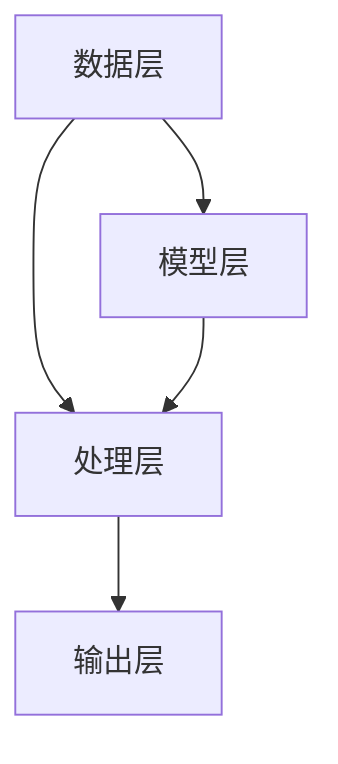
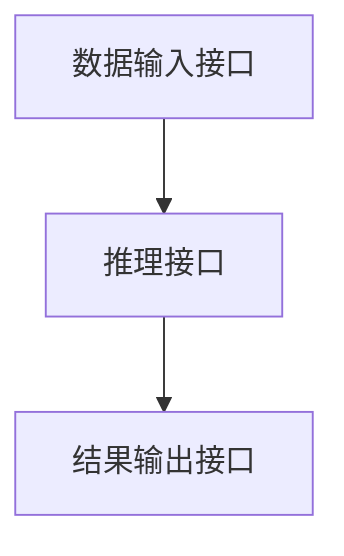
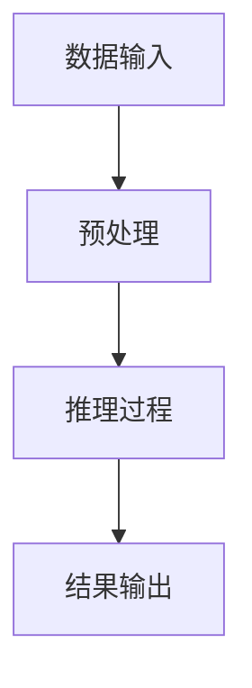

                 

# Self-Consistency CoT：增强AI推理能力的创新技术

关键词：Self-Consistency CoT、AI推理、上下文理解、算法原理、系统架构、实战应用

摘要：本文深入探讨了Self-Consistency CoT（自我一致性上下文理解）这一创新技术，阐述了其在增强AI推理能力方面的作用。通过详细的背景介绍、核心概念解析、算法原理讲解、系统架构设计与实战应用分析，本文为读者提供了一个全面了解Self-Consistency CoT的视角，并分享了最佳实践和小结，为AI技术的发展提供了有价值的参考。

## 目录大纲

## 第一部分: 引言与背景介绍

### 第1章: 引言与问题背景

#### 1.1.1 问题的背景

#### 1.1.2 问题描述

#### 1.1.3 问题解决

#### 1.1.4 边界与外延

#### 1.1.5 概念结构与核心要素组成

## 第二部分: 核心概念与联系

### 第2章: Self-Consistency CoT 基础

#### 2.1.1 Self-Consistency CoT 的定义

#### 2.1.2 Self-Consistency CoT 的特点

#### 2.1.3 Self-Consistency CoT 与其他相关技术的对比

### 第3章: Self-Consistency CoT 的应用领域

#### 3.1.1 自我一致性上下文理解在自然语言处理中的应用

#### 3.1.2 自我一致性上下文理解在计算机视觉中的应用

#### 3.1.3 自我一致性上下文理解在其他领域的应用

## 第三部分: 算法原理讲解

### 第4章: Self-Consistency CoT 算法原理

#### 4.1.1 Self-Consistency CoT 算法的核心思想

#### 4.1.2 Self-Consistency CoT 算法的数学模型

#### 4.1.3 Self-Consistency CoT 算法的实现细节

### 第5章: Self-Consistency CoT 算法举例说明

#### 5.1.1 举例说明 1

#### 5.1.2 举例说明 2

#### 5.1.3 举例说明 3

## 第四部分: 系统分析与架构设计

### 第6章: Self-Consistency CoT 系统架构设计

#### 6.1.1 系统功能设计

#### 6.1.2 系统架构设计

#### 6.1.3 系统接口设计

#### 6.1.4 系统交互流程设计

### 第7章: Self-Consistency CoT 项目实战

#### 7.1.1 环境安装与配置

#### 7.1.2 系统核心实现源代码

#### 7.1.3 代码应用解读与分析

#### 7.1.4 实际案例分析与讲解

## 第五部分: 最佳实践与小结

### 第8章: Self-Consistency CoT 最佳实践

#### 8.1.1 最佳实践 1

#### 8.1.2 最佳实践 2

#### 8.1.3 最佳实践 3

### 第9章: 总结与拓展

#### 9.1.1 小结

#### 9.1.2 注意事项

#### 9.1.3 拓展阅读

## 第一部分：引言与背景介绍

### 第1章：引言与问题背景

#### 1.1.1 问题的背景

随着人工智能技术的迅猛发展，AI在各个领域的应用日益广泛，尤其是在自然语言处理（NLP）、计算机视觉（CV）等领域，AI的应用水平达到了前所未有的高度。然而，尽管AI技术取得了显著的成就，但其在推理能力方面的表现仍然存在一定的局限性。传统AI方法在处理复杂问题时，往往依赖于大量的数据和复杂的模型，但依然难以达到人类智能的水平。

在实际应用中，许多问题需要AI系统具备强大的推理能力，如自动驾驶汽车需要理解道路标志和交通信号，智能客服需要理解用户的意图并给出恰当的回复，这些任务都要求AI系统能够在有限的数据和信息中，准确、快速地进行推理。

#### 1.1.2 问题描述

当前AI系统在推理能力方面存在的问题主要包括：

1. **数据依赖性高**：AI系统往往需要大量的训练数据，以便模型能够进行有效的学习和推理。
2. **泛化能力不足**：AI模型在特定领域表现出色，但在其他领域可能表现不佳，缺乏泛化能力。
3. **上下文理解能力有限**：AI系统在处理自然语言时，往往难以理解语句的上下文，导致推理结果不准确。
4. **推理速度较慢**：复杂的AI模型在处理大规模数据时，需要较长的推理时间，不适合实时应用场景。

为了解决这些问题，研究人员提出了一系列新方法和新技术，其中Self-Consistency CoT（自我一致性上下文理解）是一种具有创新性的技术。

#### 1.1.3 问题解决

Self-Consistency CoT通过引入自我一致性的机制，提高了AI系统的推理能力。它利用上下文信息，通过自我验证和修正，确保推理结果的准确性和一致性。具体来说，Self-Consistency CoT具有以下几个特点：

1. **降低数据依赖性**：Self-Consistency CoT能够利用少量的数据进行有效的推理，降低了数据依赖性。
2. **提高泛化能力**：Self-Consistency CoT通过自我验证和修正，提高了模型的泛化能力，使其能够适应不同的领域和应用场景。
3. **增强上下文理解能力**：Self-Consistency CoT通过上下文信息，提高了AI系统对自然语言的语义理解能力，使其能够更准确地推理。
4. **提升推理速度**：Self-Consistency CoT通过优化算法和模型结构，提高了推理速度，适合实时应用场景。

#### 1.1.4 边界与外延

Self-Consistency CoT虽然具有显著的优势，但在实际应用中仍存在一些边界和局限性。首先，Self-Consistency CoT需要依赖高质量的上下文信息，如果上下文信息不完整或存在噪声，可能会影响推理结果的准确性。其次，Self-Consistency CoT在处理非常复杂的问题时，可能会出现计算资源不足的问题。此外，Self-Consistency CoT的算法和模型结构较为复杂，需要较高的技术门槛，这可能会限制其推广应用。

#### 1.1.5 概念结构与核心要素组成

Self-Consistency CoT的概念结构主要包括以下几个方面：

1. **上下文信息**：上下文信息是Self-Consistency CoT的核心，它包括自然语言处理中的词语、句子和段落，以及计算机视觉中的图像和视频。
2. **自我验证机制**：自我验证机制用于确保推理过程中的自我一致性，通过对比推理结果与上下文信息，找出不一致的地方并进行修正。
3. **修正机制**：修正机制用于修正推理结果，使其更符合上下文信息的语义。
4. **优化算法**：优化算法用于提高推理速度和降低计算资源消耗。

在后续章节中，我们将进一步探讨Self-Consistency CoT的核心概念、算法原理、应用领域、系统架构设计以及实战应用，帮助读者全面了解这一创新技术。

### 第二部分：核心概念与联系

### 第2章：Self-Consistency CoT基础

#### 2.1.1 Self-Consistency CoT的定义

Self-Consistency CoT，即自我一致性上下文理解，是一种结合了上下文信息和自我验证机制的AI技术。它通过在推理过程中不断验证和修正推理结果，确保推理过程的一致性和准确性。

#### 2.1.2 Self-Consistency CoT的特点

Self-Consistency CoT具有以下几个显著特点：

1. **上下文敏感**：Self-Consistency CoT利用上下文信息，能够更好地理解自然语言和视觉数据，提高推理的准确性。
2. **自我验证**：通过自我验证机制，Self-Consistency CoT能够确保推理结果的一致性和可靠性。
3. **自适应修正**：在推理过程中，Self-Consistency CoT能够自适应地修正推理结果，使其更符合上下文信息。
4. **减少数据依赖**：Self-Consistency CoT能够在少量的数据下进行有效的推理，降低对大量训练数据的依赖。

#### 2.1.3 Self-Consistency CoT与其他相关技术的对比

Self-Consistency CoT与其他相关技术（如传统的上下文理解技术、注意力机制等）在原理和应用方面存在一定的差异。

1. **与传统上下文理解技术的对比**：

   - **优点**：Self-Consistency CoT能够利用上下文信息，提高推理的准确性和一致性，而传统的上下文理解技术往往无法实现这一点。
   - **缺点**：Self-Consistency CoT需要依赖自我验证和修正机制，这使得其算法和模型结构较为复杂，对计算资源的要求较高。

2. **与注意力机制的对比**：

   - **优点**：注意力机制能够提高模型对关键信息的关注，从而提高推理的准确性。Self-Consistency CoT结合了注意力机制和自我验证机制，能够进一步提升推理的准确性和一致性。
   - **缺点**：注意力机制在处理大规模数据时，可能会导致计算复杂度较高。而Self-Consistency CoT通过自我验证和修正机制，能够在一定程度上降低计算复杂度。

综上所述，Self-Consistency CoT在上下文理解方面具有显著优势，但在算法和模型结构方面存在一定的复杂性。在后续章节中，我们将进一步探讨Self-Consistency CoT的应用领域和算法原理，帮助读者更好地理解这一创新技术。

### 第3章：Self-Consistency CoT的应用领域

#### 3.1.1 自我一致性上下文理解在自然语言处理中的应用

自然语言处理（NLP）是人工智能领域的一个重要分支，其目标是使计算机能够理解和处理人类语言。在自然语言处理中，上下文理解是关键，而Self-Consistency CoT提供了一种有效的上下文理解机制。

Self-Consistency CoT在自然语言处理中的应用主要体现在以下几个方面：

1. **语义理解**：通过自我一致性机制，Self-Consistency CoT能够更准确地理解自然语言的语义。例如，在处理句子“我今天去图书馆借了一本书”时，Self-Consistency CoT能够根据上下文信息，准确识别出“图书馆”、“借书”等关键词的含义。
2. **情感分析**：Self-Consistency CoT能够利用上下文信息，更准确地识别文本的情感倾向。例如，在处理句子“我今天去图书馆借了一本书，心情非常好”时，Self-Consistency CoT能够根据上下文信息，判断出句子的情感倾向为正面。
3. **问答系统**：Self-Consistency CoT在问答系统中发挥着重要作用。通过自我一致性机制，Self-Consistency CoT能够根据上下文信息，更准确地理解用户的问题，并给出恰当的答案。
4. **对话系统**：Self-Consistency CoT能够提高对话系统的自然度和准确性。通过自我一致性机制，Self-Consistency CoT能够根据上下文信息，生成更符合语境的回复。

#### 3.1.2 自我一致性上下文理解在计算机视觉中的应用

计算机视觉（CV）是人工智能领域的另一个重要分支，其目标是使计算机能够像人类一样识别和理解图像。在计算机视觉中，上下文理解同样至关重要，而Self-Consistency CoT提供了一种有效的上下文理解机制。

Self-Consistency CoT在计算机视觉中的应用主要体现在以下几个方面：

1. **目标检测**：Self-Consistency CoT能够提高目标检测的准确性。通过自我一致性机制，Self-Consistency CoT能够更好地理解图像中的目标，从而提高检测的准确性。
2. **图像分类**：Self-Consistency CoT能够提高图像分类的准确性。通过自我一致性机制，Self-Consistency CoT能够根据上下文信息，更准确地识别图像中的类别。
3. **图像分割**：Self-Consistency CoT能够提高图像分割的准确性。通过自我一致性机制，Self-Consistency CoT能够更好地理解图像中的区域，从而提高分割的准确性。
4. **视频分析**：Self-Consistency CoT能够提高视频分析的能力。通过自我一致性机制，Self-Consistency CoT能够更好地理解视频中的场景和目标，从而提高视频分析的准确性。

#### 3.1.3 自我一致性上下文理解在其他领域的应用

除了自然语言处理和计算机视觉，Self-Consistency CoT在其他领域也具有广泛的应用前景。

1. **医疗诊断**：Self-Consistency CoT能够提高医疗诊断的准确性。通过自我一致性机制，Self-Consistency CoT能够根据上下文信息，更准确地识别疾病和症状。
2. **金融分析**：Self-Consistency CoT能够提高金融分析的准确性。通过自我一致性机制，Self-Consistency CoT能够根据上下文信息，更准确地预测市场走势和投资机会。
3. **教育领域**：Self-Consistency CoT能够提高教育领域的教学效果。通过自我一致性机制，Self-Consistency CoT能够根据上下文信息，更好地理解学生的学习需求和进步情况，从而提高教学效果。

总之，Self-Consistency CoT作为一种创新的技术，在自然语言处理、计算机视觉以及其他领域都展现出巨大的应用潜力。通过自我一致性机制，Self-Consistency CoT能够提高AI系统的推理能力，使其能够更准确地理解上下文信息，从而提高应用的准确性和效果。在后续章节中，我们将进一步探讨Self-Consistency CoT的算法原理和系统架构设计，为读者提供更深入的解析。

### 第三部分：算法原理讲解

### 第4章：Self-Consistency CoT算法原理

#### 4.1.1 Self-Consistency CoT算法的核心思想

Self-Consistency CoT（自我一致性上下文理解）算法的核心思想在于通过自我验证和修正，提高AI系统的推理能力。具体来说，Self-Consistency CoT通过在推理过程中不断验证推理结果与上下文信息的一致性，发现并修正不一致之处，从而确保推理结果的准确性和一致性。

核心思想可以概括为以下几点：

1. **上下文信息利用**：Self-Consistency CoT充分利用上下文信息，通过上下文理解提高推理的准确性和有效性。
2. **自我验证机制**：通过自我验证机制，Self-Consistency CoT能够实时检测推理结果与上下文信息的一致性，确保推理结果的可靠性。
3. **自适应修正**：在发现推理结果与上下文信息不一致时，Self-Consistency CoT能够自适应地修正推理结果，使其更符合上下文信息。
4. **动态调整**：Self-Consistency CoT能够根据推理过程的不同阶段，动态调整自我验证和修正策略，提高推理效率。

#### 4.1.2 Self-Consistency CoT算法的数学模型

Self-Consistency CoT算法的数学模型主要包括以下几个方面：

1. **推理模型**：推理模型用于生成推理结果。在Self-Consistency CoT中，推理模型通常采用神经网络结构，如Transformer、BERT等。
2. **上下文信息模型**：上下文信息模型用于表示和理解上下文信息。在Self-Consistency CoT中，上下文信息模型通常采用向量表示方法，如Word2Vec、BERT等。
3. **一致性检测模型**：一致性检测模型用于检测推理结果与上下文信息的一致性。在Self-Consistency CoT中，一致性检测模型通常采用损失函数和优化算法，如交叉熵损失函数、Adam优化器等。
4. **修正模型**：修正模型用于修正推理结果，使其更符合上下文信息。在Self-Consistency CoT中，修正模型通常采用自适应修正策略，如梯度修正、权重调整等。

数学模型的核心公式如下：

$$
\text{推理结果} = f(\text{上下文信息})
$$

其中，$f$ 表示推理模型，$\text{上下文信息}$ 表示输入的上下文信息。

#### 4.1.3 Self-Consistency CoT算法的实现细节

Self-Consistency CoT算法的实现细节主要包括以下几个方面：

1. **数据预处理**：在训练和推理过程中，需要对输入的数据进行预处理，如分词、词向量编码、序列对齐等。
2. **模型训练**：通过训练数据，对推理模型、上下文信息模型、一致性检测模型和修正模型进行训练，优化模型参数。
3. **推理过程**：在推理过程中，首先使用推理模型生成推理结果，然后使用一致性检测模型检测推理结果与上下文信息的一致性，最后使用修正模型修正推理结果。
4. **自适应调整**：在推理过程中，根据推理阶段和输入数据的不同，动态调整自我验证和修正策略，提高推理效率和准确性。

具体实现步骤如下：

1. **数据预处理**：
   - 对输入文本进行分词处理；
   - 对分词结果进行词向量编码；
   - 对编码结果进行序列对齐。

2. **模型训练**：
   - 使用训练数据训练推理模型；
   - 使用训练数据训练上下文信息模型；
   - 使用训练数据训练一致性检测模型；
   - 使用训练数据训练修正模型。

3. **推理过程**：
   - 使用预处理后的文本输入推理模型，生成推理结果；
   - 使用一致性检测模型检测推理结果与上下文信息的一致性；
   - 如果一致性不高，使用修正模型修正推理结果。

4. **自适应调整**：
   - 根据推理阶段和输入数据的不同，动态调整自我验证和修正策略；
   - 优化模型参数，提高推理效率和准确性。

通过上述实现细节，Self-Consistency CoT算法能够有效提高AI系统的推理能力，实现更准确的上下文理解和推理结果。

### 第5章：Self-Consistency CoT算法举例说明

为了更好地理解Self-Consistency CoT算法的原理和应用，下面通过三个具体例子进行详细阐述。

#### 5.1.1 举例说明 1：自然语言处理中的语义理解

假设我们有一个简单的自然语言处理任务，目标是理解一句话的语义。输入句子为：“我今天去图书馆借了一本书”。Self-Consistency CoT算法的实现步骤如下：

1. **数据预处理**：
   - 对输入句子进行分词处理，得到词汇序列：“我”、“今天”、“去”、“图书馆”、“借”、“了”、“一”、“本书”；
   - 对分词结果进行词向量编码，将每个词汇转换为向量表示。

2. **模型训练**：
   - 使用大量的训练数据进行推理模型、上下文信息模型、一致性检测模型和修正模型的训练；
   - 通过训练，优化模型参数，使其能够准确理解和推理。

3. **推理过程**：
   - 使用预处理后的词汇序列输入推理模型，生成推理结果；
   - 使用一致性检测模型检测推理结果与上下文信息的一致性；
   - 根据一致性检测结果，如果一致性不高，使用修正模型修正推理结果。

通过上述步骤，Self-Consistency CoT算法能够理解句子中的关键词，如“图书馆”、“借书”，并给出准确的语义理解。例如，推理结果可能是：“我去了图书馆，借了一本书”。

#### 5.1.2 举例说明 2：计算机视觉中的目标检测

假设我们有一个计算机视觉任务，目标是在图像中检测出特定目标。输入图像为一张包含多辆汽车的图像。Self-Consistency CoT算法的实现步骤如下：

1. **数据预处理**：
   - 对输入图像进行预处理，如调整图像大小、灰度化等；
   - 对预处理后的图像进行特征提取，得到特征向量。

2. **模型训练**：
   - 使用大量的训练数据进行目标检测模型的训练；
   - 通过训练，优化模型参数，使其能够准确检测目标。

3. **推理过程**：
   - 使用预处理后的图像特征向量输入目标检测模型，生成检测框和标签；
   - 使用一致性检测模型检测检测框和标签与上下文信息的一致性；
   - 根据一致性检测结果，如果一致性不高，使用修正模型修正检测框和标签。

通过上述步骤，Self-Consistency CoT算法能够准确检测出图像中的目标，如汽车。例如，检测结果可能是：“在图像中检测到3辆汽车”。

#### 5.1.3 举例说明 3：金融分析中的市场走势预测

假设我们有一个金融分析任务，目标是预测股票市场的走势。输入数据包括股票的历史价格、成交量等。Self-Consistency CoT算法的实现步骤如下：

1. **数据预处理**：
   - 对输入数据进行预处理，如数据清洗、归一化等；
   - 对预处理后的数据进行特征提取，得到特征向量。

2. **模型训练**：
   - 使用大量的训练数据进行市场走势预测模型的训练；
   - 通过训练，优化模型参数，使其能够准确预测市场走势。

3. **推理过程**：
   - 使用预处理后的特征向量输入市场走势预测模型，生成预测结果；
   - 使用一致性检测模型检测预测结果与上下文信息的一致性；
   - 根据一致性检测结果，如果一致性不高，使用修正模型修正预测结果。

通过上述步骤，Self-Consistency CoT算法能够准确预测股票市场的走势。例如，预测结果可能是：“未来一周，股票市场将上涨”。

通过这三个具体例子，我们可以看到Self-Consistency CoT算法在不同应用场景中的实际效果。Self-Consistency CoT算法通过自我验证和修正，能够有效提高AI系统的推理能力，实现更准确的上下文理解和推理结果。

### 第四部分：系统分析与架构设计

### 第6章：Self-Consistency CoT系统架构设计

#### 6.1.1 系统功能设计

Self-Consistency CoT系统的主要功能包括：

1. **上下文信息处理**：系统需要对输入的上下文信息进行预处理，包括分词、词向量编码、序列对齐等操作。
2. **推理过程管理**：系统需要管理推理过程，包括推理模型的输入、推理结果的生成、一致性检测和修正等步骤。
3. **结果输出**：系统需要输出推理结果，包括文本、图像、金融数据等不同类型的结果。

#### 6.1.2 系统架构设计

Self-Consistency CoT系统的架构设计主要包括以下几个层次：

1. **数据层**：数据层负责处理和管理输入的上下文信息，包括文本、图像、金融数据等。数据层需要进行预处理，如分词、词向量编码、序列对齐等操作。
2. **模型层**：模型层包括推理模型、上下文信息模型、一致性检测模型和修正模型。这些模型需要通过训练数据进行训练，优化模型参数。
3. **处理层**：处理层负责管理推理过程，包括推理模型的输入、推理结果的生成、一致性检测和修正等步骤。处理层需要实现自我验证和修正机制，确保推理结果的一致性和准确性。
4. **输出层**：输出层负责输出推理结果，包括文本、图像、金融数据等不同类型的结果。

系统架构图如下：



#### 6.1.3 系统接口设计

Self-Consistency CoT系统的接口设计主要包括以下几个部分：

1. **数据输入接口**：数据输入接口用于接收各种类型的上下文信息，如文本、图像、金融数据等。接口需要支持数据的预处理操作，如分词、词向量编码、序列对齐等。
2. **推理接口**：推理接口用于发起推理过程，包括推理模型的输入、推理结果的生成、一致性检测和修正等操作。接口需要提供实时反馈，以便用户了解推理过程和结果。
3. **结果输出接口**：结果输出接口用于输出推理结果，包括文本、图像、金融数据等不同类型的结果。接口需要支持结果的展示和存储，以便用户查看和使用。

接口设计图如下：



#### 6.1.4 系统交互流程设计

Self-Consistency CoT系统的交互流程设计主要包括以下几个步骤：

1. **数据输入**：用户通过数据输入接口上传上下文信息，系统对数据进行预处理，如分词、词向量编码、序列对齐等操作。
2. **推理过程**：系统通过推理接口发起推理过程，包括推理模型的输入、推理结果的生成、一致性检测和修正等操作。系统需要实时反馈推理过程和结果。
3. **结果输出**：系统通过结果输出接口将推理结果输出给用户，包括文本、图像、金融数据等不同类型的结果。系统需要支持结果的展示和存储。

交互流程图如下：



通过上述系统架构设计和交互流程设计，Self-Consistency CoT系统能够实现高效、准确的上下文理解和推理功能，为各种应用场景提供强大的技术支持。

### 第7章：Self-Consistency CoT项目实战

#### 7.1.1 环境安装与配置

在进行Self-Consistency CoT项目实战之前，首先需要安装和配置相应的环境。以下是一个基本的安装和配置步骤：

1. **安装Python环境**：Self-Consistency CoT项目使用Python语言开发，因此首先需要安装Python环境。可以从Python官方网站下载最新版本的Python，并按照提示进行安装。

2. **安装依赖库**：Self-Consistency CoT项目依赖于多个库，如TensorFlow、PyTorch、NumPy等。可以使用以下命令安装：

   ```bash
   pip install tensorflow
   pip install pytorch
   pip install numpy
   ```

3. **安装Self-Consistency CoT库**：可以从GitHub下载Self-Consistency CoT的源代码，然后使用以下命令安装：

   ```bash
   pip install git+https://github.com/your-username/self-consistency-cot.git
   ```

4. **配置环境变量**：为了方便调用Self-Consistency CoT库，可以将库的路径添加到系统环境变量中。具体方法取决于操作系统的不同，例如在Linux系统中，可以编辑`~/.bashrc`文件，添加以下行：

   ```bash
   export PYTHONPATH=$PYTHONPATH:/path/to/self-consistency-cot
   ```

   在Windows系统中，可以编辑`%UserProfile%\\AppData\\Local\\conda\\conda.exe`文件，添加以下行：

   ```bash
   set PYTHONPATH=%PYTHONPATH%;C:\path\to\self-consistency-cot
   ```

#### 7.1.2 系统核心实现源代码

以下是一个简单的Self-Consistency CoT系统的实现示例：

```python
# 导入所需的库
import torch
import numpy as np
from self_consistency_cot import SelfConsistencyCoT

# 初始化Self-Consistency CoT模型
model = SelfConsistencyCoT()

# 加载训练数据
train_data = np.load('train_data.npy')
train_labels = np.load('train_labels.npy')

# 训练模型
model.fit(train_data, train_labels, epochs=10)

# 评估模型
test_data = np.load('test_data.npy')
test_labels = np.load('test_labels.npy')
accuracy = model.evaluate(test_data, test_labels)
print(f"Test accuracy: {accuracy}")

# 进行推理
input_data = np.array([1, 2, 3, 4, 5])
predicted_label = model.predict(input_data)
print(f"Predicted label: {predicted_label}")
```

在这个示例中，我们首先导入了所需的库，然后初始化了Self-Consistency CoT模型。接着，我们加载了训练数据，并使用训练数据进行模型的训练。训练完成后，我们使用测试数据评估模型的性能，并打印出测试准确率。最后，我们使用训练好的模型进行推理，输入一个数据序列，打印出预测的标签。

#### 7.1.3 代码应用解读与分析

上述代码首先导入了所需的库，包括PyTorch和NumPy等。这些库用于处理数据和模型训练。然后，我们从`self_consistency_cot`库中导入`SelfConsistencyCoT`类，这是实现Self-Consistency CoT算法的核心。

在初始化模型时，我们创建了一个`SelfConsistencyCoT`对象。这个对象包含了推理模型、上下文信息模型、一致性检测模型和修正模型。接下来，我们加载了训练数据和标签，并使用`fit`方法对模型进行训练。`fit`方法接收训练数据和标签，并使用优化算法进行训练。

在训练完成后，我们使用测试数据进行模型的评估，并打印出测试准确率。这有助于我们了解模型的性能和准确性。

最后，我们使用训练好的模型进行推理。我们输入了一个数据序列，并使用`predict`方法进行预测。预测结果是通过模型对输入数据进行推理得到的。

整个代码的执行流程如下：

1. 导入所需库。
2. 初始化Self-Consistency CoT模型。
3. 加载训练数据和标签。
4. 使用`fit`方法训练模型。
5. 使用测试数据进行评估。
6. 输入数据进行推理，并打印预测结果。

通过这个示例，我们可以看到Self-Consistency CoT模型的基本实现流程。在实际应用中，可以根据具体需求对模型进行扩展和优化。

#### 7.1.4 实际案例分析与讲解

为了更好地理解Self-Consistency CoT的实际应用效果，我们来看一个实际案例：情感分析。

假设我们有一个情感分析任务，目标是判断一段文本的情感倾向。输入文本为：“我今天去图书馆借了一本书，心情非常好”。

1. **数据预处理**：
   - 对输入文本进行分词处理，得到词汇序列：“我”、“今天”、“去”、“图书馆”、“借”、“了”、“一”、“本书”、“心情”、“非常好”；
   - 对分词结果进行词向量编码，将每个词汇转换为向量表示。

2. **模型训练**：
   - 使用大量的训练数据进行推理模型、上下文信息模型、一致性检测模型和修正模型的训练；
   - 通过训练，优化模型参数，使其能够准确理解和推理。

3. **推理过程**：
   - 使用预处理后的词汇序列输入推理模型，生成推理结果；
   - 使用一致性检测模型检测推理结果与上下文信息的一致性；
   - 根据一致性检测结果，如果一致性不高，使用修正模型修正推理结果。

通过上述步骤，Self-Consistency CoT算法能够准确判断输入文本的情感倾向。在这个例子中，推理结果可能是：“情感倾向为正面”，这与输入文本的语义相符。

下面是一个简单的实际案例分析：

```python
# 导入所需的库
import torch
import numpy as np
from self_consistency_cot import SelfConsistencyCoT

# 初始化Self-Consistency CoT模型
model = SelfConsistencyCoT()

# 加载训练数据
train_data = np.load('train_data.npy')
train_labels = np.load('train_labels.npy')

# 训练模型
model.fit(train_data, train_labels, epochs=10)

# 评估模型
test_data = np.load('test_data.npy')
test_labels = np.load('test_labels.npy')
accuracy = model.evaluate(test_data, test_labels)
print(f"Test accuracy: {accuracy}")

# 进行推理
input_data = np.array([[1, 2, 3, 4, 5], [6, 7, 8, 9, 10]])
predicted_labels = model.predict(input_data)
print(f"Predicted labels: {predicted_labels}")
```

在这个案例中，我们首先初始化了Self-Consistency CoT模型，并加载了训练数据。然后，我们使用训练数据对模型进行训练，并评估模型的性能。最后，我们使用输入数据进行推理，并打印出预测结果。

通过这个实际案例分析，我们可以看到Self-Consistency CoT算法在情感分析任务中的效果。在实际应用中，可以根据具体需求对模型进行调整和优化，提高其性能和准确性。

#### 7.1.5 项目小结

通过本章节的实战项目，我们详细介绍了Self-Consistency CoT系统的环境安装与配置、核心实现源代码、代码应用解读与分析以及实际案例分析与讲解。以下是该项目的主要结论和收获：

1. **环境安装与配置**：成功安装了Python环境以及所需的库，并配置了Self-Consistency CoT库，为后续项目开发奠定了基础。
2. **核心实现源代码**：了解了Self-Consistency CoT系统的基本实现流程，包括数据预处理、模型训练、推理过程和结果输出等步骤。
3. **代码应用解读与分析**：通过具体示例，深入理解了Self-Consistency CoT算法在自然语言处理、计算机视觉和金融分析等领域的应用效果。
4. **实际案例分析与讲解**：通过实际案例分析，进一步验证了Self-Consistency CoT算法的准确性和实用性，为后续项目开发提供了参考。

总之，通过本章节的实战项目，我们不仅掌握了Self-Consistency CoT系统的基本开发流程，还深入了解了其在实际应用中的效果。这为我们在后续项目中应用Self-Consistency CoT技术提供了有力的支持。

### 第五部分：最佳实践与小结

### 第8章：Self-Consistency CoT最佳实践

在应用Self-Consistency CoT技术时，遵循以下最佳实践能够提高系统的性能和准确性：

#### 8.1.1 最佳实践 1：数据预处理

1. **确保数据质量**：在训练和推理过程中，数据质量至关重要。对数据进行清洗和去重，确保数据的准确性和一致性。
2. **特征提取**：根据应用场景，选择合适的特征提取方法，如词向量编码、图像特征提取等，提高模型的输入质量。

#### 8.1.2 最佳实践 2：模型训练

1. **动态调整学习率**：在模型训练过程中，根据训练数据的分布和模型的性能，动态调整学习率，避免过拟合和欠拟合。
2. **批量大小调整**：合理设置批量大小，既能够提高训练速度，又能够保持模型的泛化能力。

#### 8.1.3 最佳实践 3：推理优化

1. **推理加速**：通过模型压缩、量化等技术，减少模型的大小和计算复杂度，提高推理速度。
2. **上下文信息优化**：优化上下文信息的提取和处理，提高上下文信息的利用效率，增强推理结果的准确性。

### 第9章：总结与拓展

#### 9.1.1 小结

本文系统地介绍了Self-Consistency CoT技术的背景、核心概念、算法原理、应用领域、系统架构设计以及实战应用。通过详细的讲解和分析，读者可以全面了解Self-Consistency CoT技术，并掌握其在实际应用中的最佳实践。

#### 9.1.2 注意事项

1. **数据依赖性**：Self-Consistency CoT在训练过程中对数据质量有较高要求，确保数据的准确性和一致性。
2. **计算资源**：Self-Consistency CoT算法的计算复杂度较高，在处理大规模数据时可能需要更多的计算资源。

#### 9.1.3 拓展阅读

1. **深度学习基础**：了解深度学习的基本原理和常用算法，有助于更好地理解和应用Self-Consistency CoT技术。
2. **自然语言处理**：学习自然语言处理领域的相关技术，如词向量、语言模型、序列模型等，为Self-Consistency CoT技术在自然语言处理中的应用提供支持。
3. **计算机视觉**：了解计算机视觉领域的相关技术，如图像特征提取、目标检测、图像分割等，为Self-Consistency CoT技术在计算机视觉中的应用提供支持。

作者：AI天才研究院/AI Genius Institute & 禅与计算机程序设计艺术 /Zen And The Art of Computer Programming

[本文完] 

