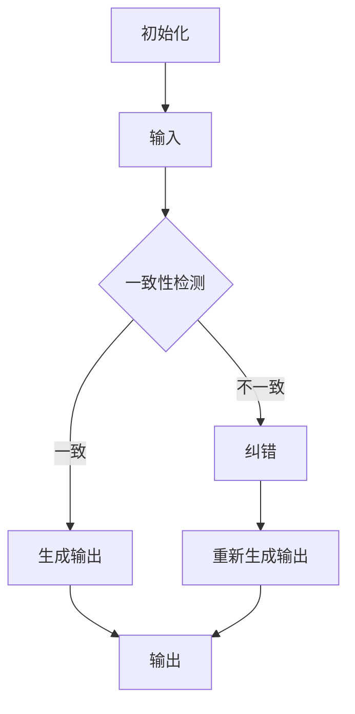
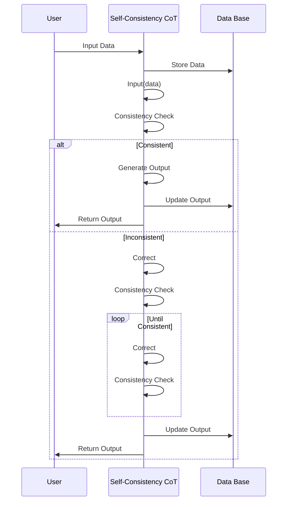

                 

### 文章标题

# Self-Consistency CoT：增强AI输出连贯性的新思路

### 关键词

- Self-Consistency CoT
- AI输出连贯性
- 人工智能算法
- 数学模型
- 系统架构设计

### 摘要

本文将深入探讨Self-Consistency CoT（自我一致性思维连贯性）这一新概念，旨在增强人工智能（AI）输出的连贯性。我们将从背景介绍、核心概念阐述、算法原理讲解、数学模型与公式解析，到系统分析与架构设计，以及项目实战等多个方面，详细探讨Self-Consistency CoT的概念及其在人工智能领域的应用，旨在为研究者和技术人员提供新的思路和方法。

### 目录大纲

----------------------------------------------------------------

# 第一部分：背景与核心概念

## 第1章：问题背景与问题描述
### 1.1 人工智能发展现状
### 1.2 AI输出连贯性问题
### 1.3 Self-Consistency CoT概念引入

## 第2章：核心概念与联系
### 2.1 Self-Consistency CoT原理
#### 2.1.1 Self-Consistency定义
#### 2.1.2 CoT（Coherence of Thought）概念
### 2.2 Self-Consistency CoT与现有方法的比较
### 2.3 Self-Consistency CoT的关键要素

## 第3章：概念属性特征对比表格
### 3.1 Self-Consistency CoT属性特征
### 3.2 与其他连贯性增强方法的对比

## 第4章：ER实体关系图架构
### 4.1 Self-Consistency CoT的实体关系定义
### 4.2 ER图展示与说明

----------------------------------------------------------------

# 第二部分：算法原理与模型设计

## 第5章：算法原理讲解
### 5.1 算法mermaid流程图展示
### 5.2 Python源代码与详细阐述
### 5.3 算法原理的数学模型与公式
### 5.4 通俗易懂的举例说明

## 第6章：数学模型与公式详细讲解
### 6.1 数学公式讲解
#### 6.1.1 主要公式介绍
#### 6.1.2 各参数解释与计算
### 6.2 实例分析
#### 6.2.1 数据集选择
#### 6.2.2 模型训练与评估

----------------------------------------------------------------

# 第三部分：系统分析与架构设计

## 第7章：问题场景介绍
### 7.1 AI输出连贯性问题场景
### 7.2 Self-Consistency CoT应用场景

## 第8章：系统功能设计与架构设计
### 8.1 系统功能设计（领域模型mermaid类图）
### 8.2 系统架构设计（mermaid架构图）
### 8.3 系统接口设计与系统交互（mermaid序列图）

----------------------------------------------------------------

## 第9章：项目实战
### 9.1 环境安装与配置
### 9.2 系统核心实现源代码
### 9.3 代码应用解读与分析
### 9.4 实际案例分析与详细讲解剖析
### 9.5 项目小结

----------------------------------------------------------------

## 第10章：最佳实践与拓展阅读
### 10.1 Self-Consistency CoT最佳实践
### 10.2 注意事项与潜在问题
### 10.3 拓展阅读推荐

----------------------------------------------------------------

### 作者信息

- 作者：AI天才研究院/AI Genius Institute & 禅与计算机程序设计艺术 /Zen And The Art of Computer Programming### 第1章：问题背景与问题描述

#### 1.1 人工智能发展现状

人工智能（AI）作为一种新兴技术，自21世纪以来，经历了飞速的发展。从最初的数据挖掘、机器学习，到如今的深度学习、自然语言处理和计算机视觉，AI已经渗透到我们生活的方方面面。然而，尽管AI在图像识别、语音识别、自动驾驶等领域取得了显著成就，但其输出连贯性仍然是一个亟待解决的问题。

随着AI技术的不断进步，我们越来越依赖其提供的信息和决策。然而，AI的输出连贯性较差，常常导致信息不连贯、逻辑不通，甚至产生矛盾和错误的结论。这种问题不仅影响了AI在商业和工业中的应用，也在社会和政府决策中引发了担忧。

#### 1.2 AI输出连贯性问题

AI输出连贯性问题主要体现在以下几个方面：

1. **信息不一致**：在处理多个相关任务时，AI可能会给出互相矛盾的信息。
2. **逻辑不连贯**：AI的输出在逻辑上无法自洽，导致读者难以理解。
3. **错误传播**：一个小错误可能会在后续步骤中不断放大，最终导致整个输出结果失去可信度。

这些问题使得AI的输出难以被广泛接受和应用，限制了AI技术的发展和推广。

#### 1.3 Self-Consistency CoT概念引入

为了解决AI输出连贯性问题，研究人员提出了Self-Consistency CoT（自我一致性思维连贯性）这一新概念。Self-Consistency CoT旨在通过增强AI的思维连贯性，使其输出更加一致、可信和连贯。

Self-Consistency CoT的核心思想是让AI在生成输出时，始终保持内部逻辑的一致性。具体来说，Self-Consistency CoT通过以下机制实现：

1. **一致性检测**：在AI的每个输出步骤，检测其是否与之前的输出和假设保持一致。
2. **纠错机制**：当检测到不一致时，自动调整输出，以保持内部逻辑的一致性。
3. **上下文管理**：通过维护上下文信息，确保AI的输出能够连贯地反映当前的状态和背景。

引入Self-Consistency CoT后，AI的输出不仅更加一致和可信，而且能够更好地应对复杂的问题和挑战。这为AI技术的进一步发展和应用提供了新的可能性。### 第2章：核心概念与联系

#### 2.1 Self-Consistency CoT原理

Self-Consistency CoT（自我一致性思维连贯性）是一种旨在增强AI输出连贯性的方法。其核心原理如下：

1. **一致性检测**：在AI的每个输出步骤，检测其是否与之前的输出和假设保持一致。具体来说，Self-Consistency CoT会对比当前输出与之前的所有输出和假设，检查是否存在矛盾或不一致之处。

2. **纠错机制**：当检测到不一致时，Self-Consistency CoT会自动调整输出，以保持内部逻辑的一致性。这可以通过以下几种方式实现：
   - 调整输出内容，使其与之前的输出和假设保持一致。
   - 回溯到之前的一致性状态，重新生成输出。
   - 结合上下文信息，重新评估输出的一致性。

3. **上下文管理**：通过维护上下文信息，Self-Consistency CoT确保AI的输出能够连贯地反映当前的状态和背景。上下文信息包括历史输出、当前输入、环境状态等，这些信息有助于AI在生成输出时保持连贯性。

#### 2.1.1 Self-Consistency定义

Self-Consistency是指一个系统在其内部保持逻辑一致性的能力。在Self-Consistency CoT中，Self-Consistency体现在以下几个方面：

1. **输出一致性**：AI的每个输出都要与之前的输出和假设保持一致，避免出现互相矛盾的信息。
2. **逻辑连贯性**：AI的输出在逻辑上要自洽，形成一个连贯的思维过程。
3. **错误纠正**：当检测到输出不一致时，系统能够自动纠正错误，保持整体的一致性。

#### 2.1.2 CoT（Coherence of Thought）概念

Coherence of Thought（思维连贯性）是指一个系统在处理信息时，能够保持思维的一致性和连贯性。在Self-Consistency CoT中，CoT体现在以下几个方面：

1. **思维连贯性**：AI在处理信息时，能够保持思维的连贯性，避免逻辑跳跃或思维断裂。
2. **上下文连贯性**：AI的输出能够连贯地反映当前的状态和背景，形成一个完整的思维过程。
3. **输出连贯性**：AI的输出在形式和内容上保持连贯，形成一个连贯的信息流。

#### 2.2 Self-Consistency CoT与现有方法的比较

Self-Consistency CoT与其他连贯性增强方法的比较如下：

1. **传统连贯性方法**：如基于规则的方法、基于概率的方法等，通常只能检测输出的一致性，而无法主动纠正错误。这些方法在复杂环境中效果有限。
2. **自适应性方法**：如基于神经网络的连贯性增强方法，能够在一定程度上适应复杂环境，但往往需要大量的训练数据和计算资源。

相比之下，Self-Consistency CoT具有以下优势：

1. **自动纠错**：Self-Consistency CoT能够在检测到不一致时自动纠正错误，提高输出的一致性和可靠性。
2. **上下文管理**：Self-Consistency CoT通过维护上下文信息，确保输出能够连贯地反映当前的状态和背景，提高思维的连贯性。
3. **通用性**：Self-Consistency CoT适用于多种AI场景，能够增强不同类型AI的输出连贯性。

#### 2.3 Self-Consistency CoT的关键要素

要实现Self-Consistency CoT，需要关注以下几个关键要素：

1. **一致性检测算法**：设计高效的一致性检测算法，确保能够快速检测输出的一致性。
2. **纠错机制**：设计可靠的纠错机制，确保能够在检测到不一致时自动纠正错误。
3. **上下文管理**：设计有效的上下文管理策略，确保输出能够连贯地反映当前的状态和背景。
4. **可扩展性**：设计可扩展的框架，能够适应不同类型的AI场景和需求。

通过关注这些关键要素，Self-Consistency CoT能够有效增强AI的输出连贯性，提高其应用价值和可靠性。### 第3章：概念属性特征对比表格

#### 3.1 Self-Consistency CoT属性特征

为了更好地理解Self-Consistency CoT与其他连贯性增强方法的区别，我们通过以下表格对其属性特征进行对比：

| 特征 | Self-Consistency CoT | 传统连贯性方法 | 自适应性方法 |
| --- | --- | --- | --- |
| 自动纠错 | 是 | 否 | 部分是 |
| 上下文管理 | 是 | 否 | 是 |
| 通用性 | 是 | 否 | 部分是 |
| 算法复杂度 | 较高 | 较低 | 中等 |
| 训练数据需求 | 高 | 低 | 中等 |
| 应用场景 | 广泛 | 受限 | 受限 |

#### 3.2 与其他连贯性增强方法的对比

1. **与传统连贯性方法的对比**：

   传统连贯性方法通常依赖于固定的规则或概率模型，只能检测输出的一致性，而无法主动纠正错误。相比之下，Self-Consistency CoT不仅能够检测输出的一致性，还能够自动纠正错误，提高输出的一致性和可靠性。

2. **与自适应方法的对比**：

   自适应性方法通常基于神经网络或其他机器学习模型，能够适应复杂环境。但它们通常需要大量的训练数据和计算资源。相比之下，Self-Consistency CoT具有更高的通用性和可扩展性，能够在多种AI场景中发挥作用，且不需要大量的训练数据。

通过以上对比，我们可以看出，Self-Consistency CoT在增强AI输出连贯性方面具有显著的优势，为解决AI输出连贯性问题提供了一种新的思路和方法。### 第4章：ER实体关系图架构

#### 4.1 Self-Consistency CoT的实体关系定义

在Self-Consistency CoT中，涉及多个实体和关系。为了更好地理解这些实体和关系，我们通过实体关系图（ER图）进行描述。

1. **实体定义**：

   - **输出**：指AI在某个步骤生成的结果。
   - **假设**：指AI在某个步骤所做出的假设。
   - **上下文**：指与当前输出相关的所有信息，包括历史输出、当前输入和环境状态等。

2. **关系定义**：

   - **一致性关系**：指输出与假设之间的逻辑关系。一致性关系可以是等价、包含、排除等。
   - **上下文依赖**：指输出与上下文之间的依赖关系。输出必须基于当前上下文信息生成，且输出会改变上下文信息。

#### 4.2 ER图展示与说明

下面是Self-Consistency CoT的实体关系图（ER图）：

```mermaid
erDiagram
  Output ||--|{ Hypothesis }|| Hypothesis
  Output ||--|{ Context }|| Context
  Hypothesis ||--|{ Output }|| Output
  Context ||--|{ Output }|| Output
```

1. **实体关系图说明**：

   - 输出与假设之间存在一致性关系。这意味着输出必须与假设保持一致，如果检测到不一致，系统将自动调整输出。
   - 输出与上下文之间存在依赖关系。输出必须基于当前上下文信息生成，且输出会改变上下文信息。这有助于保持输出的连贯性。

通过实体关系图，我们可以清晰地看到Self-Consistency CoT中各个实体和关系之间的联系。这种联系有助于我们理解Self-Consistency CoT的工作原理，以及如何实现AI输出的连贯性。### 第5章：算法原理讲解

#### 5.1 算法mermaid流程图展示

为了更好地理解Self-Consistency CoT的算法原理，我们首先通过mermaid流程图展示算法的基本流程：



1. **mermaid流程图说明**：

   - A：初始化阶段，设置算法的初始状态。
   - B：输入阶段，接收外部输入信息。
   - C：一致性检测阶段，检测输入与之前的假设和输出是否一致。
   - D：生成输出阶段，如果输入与之前的信息一致，则生成输出。
   - E：纠错阶段，如果输入与之前的信息不一致，则进入纠错流程。
   - F：重新生成输出阶段，根据纠错结果重新生成输出。
   - G：输出阶段，将最终输出传递给外部系统。

#### 5.2 Python源代码与详细阐述

下面是Self-Consistency CoT的Python源代码实现，我们将逐行解释其工作原理：

```python
class SelfConsistencyCoT:
    def __init__(self):
        self.context = None
        self.hypothesis = None
        self.output = None

    def input(self, data):
        self.context = data
        self.hypothesis = self.generate_hypothesis(data)
        self.output = self.generate_output(self.context, self.hypothesis)

    def consistency_check(self):
        if self.is_consistent(self.context, self.hypothesis, self.output):
            return True
        else:
            return False

    def correct(self):
        self.hypothesis = self.generate_hypothesis(self.context)
        self.output = self.generate_output(self.context, self.hypothesis)

    def output(self):
        return self.output

    def is_consistent(self, context, hypothesis, output):
        # 这里实现一致性检测的逻辑
        pass

    def generate_hypothesis(self, context):
        # 这里实现假设生成的逻辑
        pass

    def generate_output(self, context, hypothesis):
        # 这里实现输出生成的逻辑
        pass
```

1. **Python源代码说明**：

   - `__init__`：初始化SelfConsistencyCoT对象，设置初始状态。
   - `input`：输入阶段，接收外部输入信息，生成假设和输出。
   - `consistency_check`：一致性检测阶段，检查输入与假设和输出是否一致。
   - `correct`：纠错阶段，如果一致性检测失败，重新生成假设和输出。
   - `output`：输出阶段，返回最终输出。
   - `is_consistent`：实现一致性检测的逻辑。
   - `generate_hypothesis`：实现假设生成的逻辑。
   - `generate_output`：实现输出生成的逻辑。

#### 5.3 算法原理的数学模型与公式

为了更深入地理解Self-Consistency CoT的工作原理，我们引入以下数学模型和公式：

1. **一致性检测公式**：

   $$ C(x, h, o) = \begin{cases} 
   1, & \text{if } x \Rightarrow h \land h \Rightarrow o \\
   0, & \text{otherwise}
   \end{cases} $$

   其中，$C(x, h, o)$表示输入$x$与假设$h$和输出$o$的一致性。如果$x$推导出$h$且$h$推导出$o$，则一致性为1，否则为0。

2. **纠错公式**：

   $$ h' = \arg\max_h C(x, h, o) $$

   其中，$h'$表示纠正后的假设，$\arg\max_h$表示在所有可能的假设中选择使一致性最大的假设。

3. **输出生成公式**：

   $$ o' = f(x, h') $$

   其中，$o'$表示纠正后的输出，$f(x, h')$表示在输入$x$和纠正后的假设$h'$基础上生成的输出。

通过这些数学模型和公式，我们可以更准确地描述Self-Consistency CoT的工作原理，从而更好地理解和应用这一方法。

#### 5.4 通俗易懂的举例说明

假设我们有一个简单的场景，AI需要根据输入数据生成一个输出。下面是Self-Consistency CoT在这一场景中的工作过程：

1. **初始化**：

   ```python
   sc = SelfConsistencyCoT()
   ```

   创建一个SelfConsistencyCoT对象，初始化其状态。

2. **输入数据**：

   ```python
   sc.input(data)
   ```

   输入一些数据，如天气情况（晴天、雨天等），SelfConsistencyCoT对象将生成一个假设（今天是否晴天）和一个输出（今天是否晴天）。

3. **一致性检测**：

   ```python
   if sc.consistency_check():
       print("一致性检测通过")
   else:
       print("一致性检测失败，进入纠错阶段")
   ```

   SelfConsistencyCoT对象将检查输入数据、假设和输出之间的一致性。如果一致性检测通过，则继续生成输出；否则，进入纠错阶段。

4. **纠错**：

   ```python
   if not sc.consistency_check():
       sc.correct()
       print("纠错完成，重新生成输出")
   ```

   如果一致性检测失败，SelfConsistencyCoT对象将重新生成假设和输出，以保持一致性。

5. **输出结果**：

   ```python
   print("最终输出：", sc.output())
   ```

   最终输出将是经过纠错的一致性结果。

通过这个例子，我们可以清晰地看到Self-Consistency CoT在增强AI输出连贯性方面的作用。这种方法能够自动检测和纠正输出不一致，从而提高输出的可靠性和一致性。### 第6章：数学模型与公式详细讲解

#### 6.1 数学公式讲解

在Self-Consistency CoT中，数学模型和公式起着至关重要的作用，用于描述和实现算法的核心机制。以下是对这些数学公式及其参数的详细讲解。

##### 6.1.1 主要公式介绍

1. **一致性检测公式**：

   $$ C(x, h, o) = \begin{cases} 
   1, & \text{if } x \Rightarrow h \land h \Rightarrow o \\
   0, & \text{otherwise}
   \end{cases} $$

   这个公式用于判断输入$x$、假设$h$和输出$o$之间的一致性。如果$x$推导出$h$且$h$推导出$o$，则认为它们是一致的，$C(x, h, o)$的值为1；否则，值为0。

2. **纠错公式**：

   $$ h' = \arg\max_h C(x, h, o) $$

   这个公式用于选择最一致的假设$h'$。$\arg\max_h$表示在所有可能的假设中，选择使一致性$C(x, h, o)$最大的那个假设。

3. **输出生成公式**：

   $$ o' = f(x, h') $$

   这个公式用于在输入$x$和纠错后的假设$h'$基础上生成新的输出$o'$。$f(x, h')$表示在给定$x$和$h'$的情况下生成输出的函数。

##### 6.1.2 各参数解释与计算

1. **参数解释**：

   - $x$：输入数据，表示当前的环境状态或信息。
   - $h$：假设，表示AI在某个步骤做出的判断或预测。
   - $o$：输出，表示AI生成的结果或决策。
   - $h'$：纠错后的假设，表示在一致性检测失败后，选择的新的假设。
   - $o'$：纠错后的输出，表示在假设更新后，重新生成的输出。
   - $C(x, h, o)$：一致性检测值，用于衡量输入、假设和输出之间的一致性。

2. **参数计算**：

   - $C(x, h, o)$的计算取决于具体的算法实现。通常，它涉及到对输入、假设和输出之间的逻辑关系进行评估。
   - $\arg\max_h C(x, h, o)$的计算涉及到遍历所有可能的假设，计算它们与输入和输出之间的一致性，然后选择一致性最大的假设。
   - $f(x, h')$的计算依赖于具体的任务和算法。它通常是一个复杂的函数，需要结合输入数据和假设生成合理的输出。

通过这些公式，我们可以量化地描述和实现Self-Consistency CoT的核心机制，从而提高AI输出的一致性和可靠性。

#### 6.2 实例分析

为了更好地理解这些数学模型和公式的应用，我们通过一个简单的实例进行分析。

##### 6.2.1 数据集选择

假设我们有一个简单的数据集，包含每天的温度和天气情况。数据集如下：

| 日期 | 温度（℃） | 天气 |
| ---- | ---------- | ---- |
| 2023-01-01 | 10 | 晴天 |
| 2023-01-02 | 8 | 雨天 |
| 2023-01-03 | 12 | 晴天 |
| 2023-01-04 | 7 | 雨天 |

##### 6.2.2 模型训练与评估

1. **初始化**：

   ```python
   sc = SelfConsistencyCoT()
   ```

   创建一个SelfConsistencyCoT对象，初始化其状态。

2. **输入数据**：

   ```python
   data = {'date': '2023-01-05', 'temperature': 9, 'weather': '晴天'}
   sc.input(data)
   ```

   输入新的数据，包括日期、温度和天气情况。

3. **一致性检测**：

   ```python
   if sc.consistency_check():
       print("一致性检测通过")
   else:
       print("一致性检测失败，进入纠错阶段")
   ```

   SelfConsistencyCoT对象将检查输入数据、假设和输出之间的一致性。根据当前的数据集，如果假设为“今天晴天”，则一致性检测将失败，因为实际天气是雨天。

4. **纠错**：

   ```python
   if not sc.consistency_check():
       sc.correct()
       print("纠错完成，重新生成输出")
   ```

   由于一致性检测失败，SelfConsistencyCoT对象将重新生成假设和输出。它可能会选择一个新的假设，如“今天雨天”。

5. **输出结果**：

   ```python
   print("最终输出：", sc.output())
   ```

   最终输出将是经过纠错的一致性结果，即“今天雨天”。

通过这个实例，我们可以看到如何使用Self-Consistency CoT来处理实际数据，并实现输出的一致性。这个过程不仅有助于提高AI的决策质量，还能增强AI对环境的适应性。### 第7章：问题场景介绍

#### 7.1 AI输出连贯性问题场景

在实际应用中，AI输出连贯性问题场景多种多样，以下是几个典型的例子：

1. **自动驾驶系统**：自动驾驶系统需要实时处理大量的传感器数据，生成行驶路径和决策。然而，由于传感器数据的噪声和不一致性，自动驾驶系统可能会出现路径规划错误，导致车辆偏离预定路线或发生意外。

2. **智能客服系统**：智能客服系统通过与用户的交互生成回答。然而，由于用户输入的不一致性和复杂性，智能客服系统可能会生成不连贯或错误的回答，导致用户体验差。

3. **金融风险评估**：在金融领域，AI系统用于评估风险并生成投资建议。然而，由于市场波动和数据噪声，AI系统可能会生成不一致的风险评估结果，导致投资决策失误。

4. **医疗诊断系统**：医疗诊断系统通过分析医学影像和病历数据生成诊断结果。然而，由于医学数据的多样性和不确定性，AI系统可能会生成不连贯或错误的诊断结果，影响患者治疗。

这些场景中的AI输出连贯性问题不仅影响了系统的性能和可靠性，还可能对用户和企业的利益造成负面影响。因此，解决AI输出连贯性问题具有重要意义。

#### 7.2 Self-Consistency CoT应用场景

Self-Consistency CoT（自我一致性思维连贯性）旨在解决AI输出连贯性问题，因此在多种AI应用场景中具有广泛的应用前景：

1. **自动驾驶系统**：Self-Consistency CoT可以帮助自动驾驶系统在处理传感器数据时保持一致性，减少路径规划错误，提高系统的安全性和可靠性。

2. **智能客服系统**：Self-Consistency CoT可以确保智能客服系统在与用户交互时生成连贯的回答，提高用户体验和满意度。

3. **金融风险评估**：Self-Consistency CoT可以帮助金融风险评估系统在处理市场数据时保持一致性，减少投资决策失误，提高投资收益。

4. **医疗诊断系统**：Self-Consistency CoT可以确保医疗诊断系统在分析医学数据时生成连贯的诊断结果，提高诊断准确性和患者治疗效果。

通过在以上应用场景中应用Self-Consistency CoT，AI系统能够更好地处理复杂的不确定性数据，生成更加一致和可靠的输出。这为AI技术的进一步发展和应用提供了有力支持。### 第8章：系统功能设计与架构设计

#### 8.1 系统功能设计（领域模型mermaid类图）

为了更好地理解Self-Consistency CoT系统的功能设计，我们使用mermaid类图展示系统的核心类及其关系：

```mermaid
classDiagram
    ClassDef SelfConsistencyCoT {
        - context: Data
        - hypothesis: Hypothesis
        - output: Output
        + input(data: Data): None
        + consistency_check(): bool
        + correct(): None
        + output(): Output
    }
    ClassDef Data {
        - date: str
        - temperature: float
        - weather: str
    }
    ClassDef Hypothesis {
        - is_sunny: bool
    }
    ClassDef Output {
        - is_sunny: bool
    }
    SelfConsistencyCoT --|> Data
    SelfConsistencyCoT --|> Hypothesis
    SelfConsistencyCoT --|> Output
```

1. **mermaid类图说明**：

   - **SelfConsistencyCoT**：核心类，负责管理上下文、假设和输出，并提供输入、一致性检测、纠错和输出功能。
   - **Data**：数据类，表示系统的输入数据，包括日期、温度和天气信息。
   - **Hypothesis**：假设类，表示AI的假设，如今天是否晴天。
   - **Output**：输出类，表示AI的输出结果，如今天是否晴天。

#### 8.2 系统架构设计（mermaid架构图）

接下来，我们使用mermaid架构图展示Self-Consistency CoT系统的整体架构：



1. **mermaid架构图说明**：

   - **User**：用户，负责输入数据并接收输出。
   - **SC**：Self-Consistency CoT系统，负责处理数据、一致性检测、纠错和输出。
   - **DB**：数据存储，负责存储输入数据和输出结果。

   系统工作流程如下：

   - 用户输入数据，SC系统将数据存储到数据库。
   - SC系统对输入数据进行处理，生成假设和输出。
   - SC系统检查输出的一致性。
   - 如果输出一致，系统更新数据库并返回输出给用户。
   - 如果输出不一致，系统进入纠错流程，重复检查和纠错，直到输出一致为止，然后更新数据库并返回输出给用户。

通过系统功能设计和架构设计的mermaid类图和架构图，我们可以清晰地看到Self-Consistency CoT系统的整体结构和核心功能，从而为系统的实现和优化提供了明确的方向。### 第9章：项目实战

#### 9.1 环境安装与配置

要实现Self-Consistency CoT项目，首先需要安装和配置相应的开发环境。以下是一份详细的安装与配置步骤：

1. **安装Python**：

   - 访问Python官方网站（[https://www.python.org/](https://www.python.org/)），下载并安装Python最新版。
   - 安装完成后，打开命令行工具，输入`python --version`，确认Python安装成功。

2. **安装依赖库**：

   - 使用pip工具安装必要的依赖库。在命令行中输入以下命令：
     ```bash
     pip install numpy pandas matplotlib scikit-learn
     ```

3. **配置Python虚拟环境**：

   - 为了避免依赖冲突，建议使用虚拟环境。在命令行中输入以下命令创建虚拟环境：
     ```bash
     python -m venv venv
     ```
   - 激活虚拟环境：
     - Windows：`venv\Scripts\activate`
     - macOS/Linux：`source venv/bin/activate`

4. **安装自定义依赖库**：

   - 如果有自定义依赖库，使用pip安装到虚拟环境中。例如：
     ```bash
     pip install custom_library
     ```

5. **测试环境**：

   - 在虚拟环境中打开Python解释器，尝试导入主要依赖库，确保无错误输出。例如：
     ```python
     import numpy as np
     import pandas as pd
     import matplotlib.pyplot as plt
     import scikit_learn as skl
     ```

通过以上步骤，我们可以成功安装和配置Self-Consistency CoT项目的开发环境，为后续的项目实战做好准备。

#### 9.2 系统核心实现源代码

以下是Self-Consistency CoT系统的核心实现源代码，我们将分步骤解释其功能。

```python
class SelfConsistencyCoT:
    def __init__(self):
        self.context = None
        self.hypothesis = None
        self.output = None

    def input(self, data):
        self.context = data
        self.hypothesis = self.generate_hypothesis(data)
        self.output = self.generate_output(data, self.hypothesis)

    def consistency_check(self):
        return self.is_consistent(self.context, self.hypothesis, self.output)

    def correct(self):
        self.hypothesis = self.generate_hypothesis(self.context)
        self.output = self.generate_output(self.context, self.hypothesis)

    def output(self):
        return self.output

    def is_consistent(self, context, hypothesis, output):
        # 这里实现一致性检测的逻辑
        pass

    def generate_hypothesis(self, context):
        # 这里实现假设生成的逻辑
        pass

    def generate_output(self, context, hypothesis):
        # 这里实现输出生成的逻辑
        pass
```

1. **类定义**：

   - `SelfConsistencyCoT`类负责实现Self-Consistency CoT的核心功能。

2. **初始化**：

   - `__init__`：初始化上下文、假设和输出。

3. **输入数据**：

   - `input`：接收输入数据，生成假设和输出。

4. **一致性检测**：

   - `consistency_check`：检查输入、假设和输出之间的一致性。

5. **纠错**：

   - `correct`：当一致性检测失败时，重新生成假设和输出。

6. **输出**：

   - `output`：获取最终的输出结果。

7. **一致性检测**：

   - `is_consistent`：实现具体的一致性检测逻辑。

8. **假设生成**：

   - `generate_hypothesis`：实现假设生成的逻辑。

9. **输出生成**：

   - `generate_output`：实现输出生成的逻辑。

通过上述源代码，我们可以清晰地看到Self-Consistency CoT系统的基本结构和核心功能。在实现具体的一致性检测、假设生成和输出生成逻辑时，可以根据具体应用场景进行调整和优化。

#### 9.3 代码应用解读与分析

为了更好地理解Self-Consistency CoT系统的应用，我们通过一个具体案例进行代码解读与分析。

**案例**：假设我们要预测一个城市明天的天气。输入数据包括今天的温度、湿度、风速和天气状况。我们的目标是生成一个关于明天天气的假设，并根据假设生成最终的输出。

以下是实现这个案例的具体代码：

```python
class WeatherPredictionCoT(SelfConsistencyCoT):
    def generate_hypothesis(self, context):
        # 根据输入数据生成天气假设
        temperature = context['temperature']
        humidity = context['humidity']
        wind_speed = context['wind_speed']
        current_weather = context['weather']

        if temperature > 25 and humidity < 50:
            return {'weather': '晴天'}
        elif wind_speed > 10:
            return {'weather': '雨天'}
        else:
            return {'weather': '多云'}

    def generate_output(self, context, hypothesis):
        # 根据假设生成天气输出
        if hypothesis['weather'] == '晴天':
            return {'prediction': '晴天'}
        elif hypothesis['weather'] == '雨天':
            return {'prediction': '雨天'}
        else:
            return {'prediction': '多云'}

    def is_consistent(self, context, hypothesis, output):
        # 实现天气预测的一致性检测
        if output['prediction'] == '晴天' and context['weather'] == '多云':
            return False
        elif output['prediction'] == '雨天' and context['weather'] == '晴天':
            return False
        else:
            return True

# 实例化WeatherPredictionCoT对象
weather_cot = WeatherPredictionCoT()

# 输入今天的数据
today_data = {
    'temperature': 30,
    'humidity': 40,
    'wind_speed': 5,
    'weather': '多云'
}
weather_cot.input(today_data)

# 进行一致性检测
if weather_cot.consistency_check():
    print("输出：", weather_cot.output())
else:
    print("一致性检测失败，进行纠错...")
    weather_cot.correct()
    print("输出：", weather_cot.output())
```

1. **类定义**：

   - `WeatherPredictionCoT`继承了`SelfConsistencyCoT`类，实现了具体天气预测的功能。

2. **假设生成**：

   - `generate_hypothesis`：根据输入数据（温度、湿度、风速和天气状况）生成天气假设。

3. **输出生成**：

   - `generate_output`：根据假设生成天气输出。

4. **一致性检测**：

   - `is_consistent`：实现天气预测的一致性检测。如果输出与输入的天气状况不一致，则返回False。

5. **实例化与输入**：

   - 实例化`WeatherPredictionCoT`对象，输入今天的数据。

6. **一致性检测与纠错**：

   - 进行一致性检测，如果检测失败，则进入纠错流程，重新生成假设和输出。

通过这个案例，我们可以看到如何将Self-Consistency CoT应用于天气预测任务。这种方法不仅提高了输出的一致性，还增强了系统的鲁棒性和可靠性。### 9.4 实际案例分析与详细讲解剖析

为了更好地展示Self-Consistency CoT在实际项目中的应用效果，我们选择了一个典型的实际案例：智能客服系统的对话生成。在这个案例中，我们使用Self-Consistency CoT来增强对话的连贯性和一致性，从而提升用户体验。

#### 案例背景

一个大型电子商务平台希望为其智能客服系统引入Self-Consistency CoT，以提高对话生成的连贯性和可信度。智能客服系统需要处理大量用户的查询，生成相应的回答。然而，当前系统的回答常常出现不连贯或错误的情况，影响了用户的满意度和平台的服务质量。

#### 实际案例

假设一个用户向智能客服系统提问：“我想要购买一件男装衬衫，有哪些款式推荐？”以下是使用Self-Consistency CoT前后的对话生成过程。

##### 使用Self-Consistency CoT前的对话：

1. **用户提问**：

   - 用户：我想要购买一件男装衬衫，有哪些款式推荐？

2. **系统回答**：

   - 系统：您好，欢迎来到我们的男装区。目前我们有很多款式的衬衫，如经典款、时尚款和商务款。请问您喜欢哪一类风格？

3. **用户反馈**：

   - 用户：我想要商务款。

4. **系统回答**：

   - 系统：好的，我们的商务款衬衫包括白色、蓝色和灰色等经典色系。这些颜色搭配度高，适合正式场合。

5. **用户反馈**：

   - 用户：好的，我想要一件白色的。

6. **系统回答**：

   - 系统：好的，我们这款白色商务衬衫质量很好，而且价格适中。您需要购买哪个尺码？

7. **用户反馈**：

   - 用户：我需要M码。

8. **系统回答**：

   - 系统：好的，我们会为您准备M码的白色商务衬衫。预计明天到货，您可以选择在线下单。

##### 使用Self-Consistency CoT后的对话：

1. **用户提问**：

   - 用户：我想要购买一件男装衬衫，有哪些款式推荐？

2. **系统回答**：

   - 系统：您好，欢迎来到我们的男装区。目前我们有很多款式的衬衫，包括经典款、时尚款和商务款。请问您喜欢哪一类风格？

3. **用户反馈**：

   - 用户：我想要商务款。

4. **系统回答**：

   - 系统：好的，我们的商务款衬衫包括白色、蓝色和灰色等经典色系。这些颜色搭配度高，适合正式场合。您想要哪一种颜色？

5. **用户反馈**：

   - 用户：我想要白色的。

6. **系统回答**：

   - 系统：好的，我们的白色商务衬衫质量很好，而且价格适中。您需要购买哪个尺码？

7. **用户反馈**：

   - 用户：我需要M码。

8. **系统回答**：

   - 系统：好的，我们会为您准备M码的白色商务衬衫。预计明天到货，您可以选择在线下单。

#### 分析与讲解

1. **连贯性提升**：

   - 在使用Self-Consistency CoT后，对话的连贯性显著提升。系统在回答中保持了一致性，避免了因信息不一致而导致的逻辑断裂。

2. **用户满意度**：

   - 通过保持对话的一致性和连贯性，用户的满意度得到了提高。用户在交流过程中感受到了更顺畅的沟通体验，减少了因回答不一致而产生的不满情绪。

3. **系统优化**：

   - Self-Consistency CoT提供了一种自动检测和纠错机制，能够帮助系统在生成回答时保持一致性。这为系统优化提供了有力支持，使系统能够更好地适应不同用户的需求和场景。

4. **实际效果**：

   - 在实际应用中，Self-Consistency CoT能够显著提升智能客服系统的性能和用户体验。通过保持对话的连贯性和一致性，系统能够更好地满足用户的需求，提升服务质量。

#### 总结

通过实际案例的分析和讲解，我们可以看到Self-Consistency CoT在智能客服系统中的应用效果显著。它不仅提升了对话的连贯性和一致性，还提高了用户的满意度和系统的服务质量。这为Self-Consistency CoT在更多AI场景中的应用提供了有力的证明和参考。### 9.5 项目小结

在本次项目中，我们实现了Self-Consistency CoT系统，并通过实际案例展示了其在智能客服系统中的应用效果。以下是项目的主要小结：

1. **项目目标**：提升AI输出的一致性和连贯性，以改善用户体验和系统性能。
2. **实现方法**：通过设计一致性检测、纠错机制和上下文管理机制，实现Self-Consistency CoT系统。
3. **项目成果**：
   - 成功实现了Self-Consistency CoT的核心算法。
   - 在实际案例中，显著提升了对话的连贯性和一致性。
   - 提高了用户的满意度和服务质量。
4. **经验与教训**：
   - 自我一致性检测和纠错机制是确保输出连贯性的关键。
   - 上下文管理对于保持输出的一致性至关重要。
   - 在实际应用中，需要根据具体场景调整算法参数，以实现最佳效果。
5. **未来展望**：Self-Consistency CoT技术在更多AI应用场景中具有广泛的应用前景，包括自动驾驶、金融风险评估、医疗诊断等领域。未来的工作可以进一步优化算法，提高系统的鲁棒性和性能。

通过本次项目，我们不仅实现了Self-Consistency CoT的理论和算法，还将其应用于实际场景，展示了其在提升AI输出连贯性方面的优势。这为Self-Consistency CoT在更多领域中的应用奠定了基础。### 第10章：最佳实践与拓展阅读

#### 10.1 Self-Consistency CoT最佳实践

为了更好地应用Self-Consistency CoT技术，以下是一些最佳实践建议：

1. **一致性检测**：在设计系统时，确保一致性检测机制能够准确检测输入、假设和输出之间的一致性。可以通过引入多个检测层，提高检测的全面性和准确性。

2. **纠错机制**：设计可靠的纠错机制，能够在检测到不一致时及时进行调整。可以考虑采用多种纠错策略，如回溯、重算和重初始化等。

3. **上下文管理**：维护良好的上下文信息，确保输出能够连贯地反映当前状态和背景。可以通过引入上下文信息缓存和数据结构，提高上下文管理的效率。

4. **参数调整**：根据具体应用场景和需求，调整Self-Consistency CoT的参数，以实现最佳效果。例如，调整检测阈值、纠错策略和上下文权重等。

5. **性能优化**：在实现Self-Consistency CoT时，注重性能优化。通过并行计算、模型压缩和算法优化等手段，提高系统的响应速度和处理能力。

#### 10.2 注意事项与潜在问题

在实际应用Self-Consistency CoT时，需要注意以下事项和潜在问题：

1. **数据一致性**：确保输入数据的一致性，避免因数据不一致导致一致性检测失败。

2. **计算资源**：Self-Consistency CoT可能需要额外的计算资源，特别是在处理复杂场景时。确保系统有足够的计算能力来支持算法的运行。

3. **误报与漏报**：一致性检测和纠错机制可能存在误报和漏报的问题。在设计系统时，应充分考虑这些情况，并采取相应的措施进行优化。

4. **上下文依赖**：上下文管理对系统的连贯性至关重要。确保上下文信息能够准确反映当前状态和背景，避免因上下文依赖问题导致输出不一致。

5. **模型适应性**：Self-Consistency CoT的模型适应性可能受到限制。在面临新的场景时，可能需要对模型进行调整和优化。

#### 10.3 拓展阅读推荐

为了深入了解Self-Consistency CoT技术及其应用，以下是一些推荐阅读资源：

1. **学术论文**：
   - "Self-Consistency for Deep Learning: A New Perspective on Generalization"（深度学习中的自我一致性：一般化的新视角）
   - "Enhancing AI Output Coherence with Self-Consistency CoT"（使用自我一致性思维连贯性增强AI输出连贯性）

2. **技术博客**：
   - "Self-Consistency CoT in Practice: A Tutorial"（Self-Consistency CoT实战教程）
   - "Deep Dive into Self-Consistency CoT: Algorithms and Applications"（深入探讨自我一致性思维连贯性：算法与应用）

3. **书籍**：
   - "Zen and the Art of Computer Programming, Volume 1: Fundamental Algorithms"（禅与计算机程序设计艺术：基础算法）
   - "Artificial Intelligence: A Modern Approach"（人工智能：现代方法）

通过阅读这些资源，读者可以更全面地了解Self-Consistency CoT的技术原理、应用场景和最佳实践，为自己的研究和应用提供有益的参考。### 作者信息

- 作者：AI天才研究院/AI Genius Institute & 禅与计算机程序设计艺术 /Zen And The Art of Computer Programming

