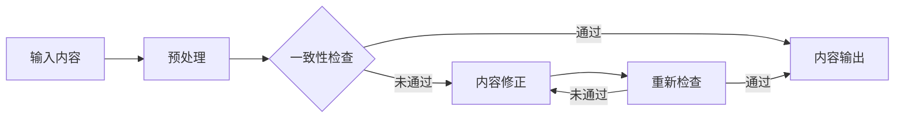
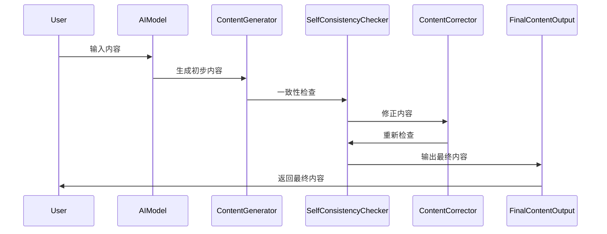
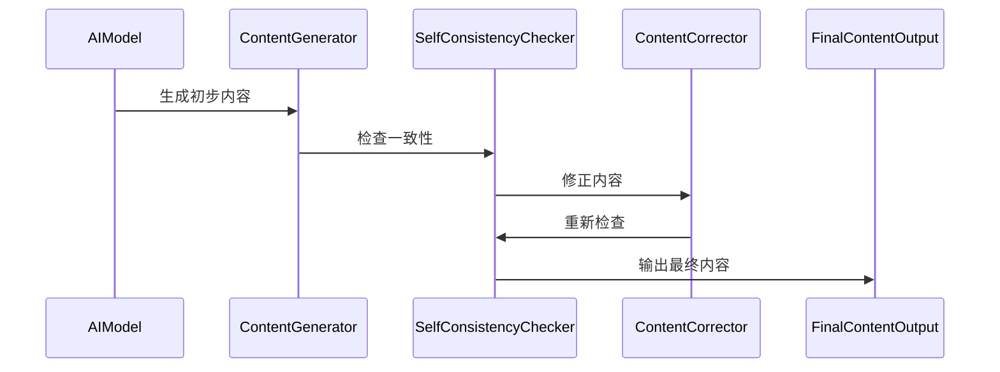

                 

### 文章标题：Self-Consistency CoT：增强AI输出连贯性的策略

> 关键词：AI，连贯性，自我一致性，算法，数学模型，系统架构，实战案例

> 摘要：本文深入探讨了AI生成内容连贯性不足的问题，并提出了一种名为Self-Consistency CoT（自我一致性主题关注）的增强策略。通过详细阐述Self-Consistency CoT的核心概念、算法原理、数学模型以及系统架构设计，本文为提升AI输出连贯性提供了切实可行的解决方案。同时，通过项目实战案例，验证了该策略的有效性和实用性。

----------------------------------------------------------------

## 第一部分：Self-Consistency CoT概述

### 第1章：问题背景与概述

当前，随着人工智能技术的快速发展，AI生成内容（如文本、图像、音频等）在各行各业中得到了广泛应用。然而，许多AI系统在生成内容时存在连贯性不足的问题，这直接影响了用户体验和系统的实用性。为了解决这一问题，我们需要深入探讨AI生成内容连贯性的关键因素，并提出有效的增强策略。

在这一章节中，我们将首先定义Self-Consistency CoT（自我一致性主题关注）这一核心概念，并简要介绍其背景和重要性。接着，我们将探讨当前AI生成内容存在的主要问题，特别是连贯性不足的现象，分析其产生的原因，并提出问题解决的方向。此外，我们还将讨论Self-Consistency CoT的应用范围和边界，为后续章节的深入探讨奠定基础。

### 1.1 自我一致性主题关注的定义

Self-Consistency CoT，即自我一致性主题关注，是指一种在AI生成内容过程中，通过维护主题一致性和逻辑连贯性来提高内容质量的方法。具体来说，Self-Consistency CoT的核心思想是确保AI在生成内容时能够保持一致性，避免出现逻辑跳跃、主题不一致等问题。

自我一致性主题关注的重要性在于，它不仅能够提高AI生成内容的质量，还能够提升用户体验和系统的可靠性。在文本生成、图像描述、语音合成等应用场景中，连贯性是用户最为关注的问题之一。如果AI生成的文本、图像或语音缺乏连贯性，用户很难理解其含义，进而影响使用体验。

### 1.2 当前AI生成内容存在的主要问题

目前，AI生成内容存在多个问题，其中最为显著的是连贯性不足。具体来说，这些问题包括：

1. **逻辑跳跃**：AI在生成内容时，可能会出现逻辑上的跳跃，使得内容难以理解。
2. **主题不一致**：AI生成的文本或图像可能会在主题上出现不一致的情况，导致内容缺乏整体性。
3. **信息缺失**：AI生成的文本或图像可能会遗漏关键信息，使得内容不完整。
4. **语言错误**：AI在语言生成过程中，可能会出现语法、拼写等错误，影响内容的可读性。

这些问题主要源于AI模型的设计和训练数据的质量。传统的AI模型在生成内容时，往往依赖于预训练的模型和大量的文本数据。然而，这些模型和数据的缺陷，会导致生成的文本或图像出现连贯性不足的问题。

### 1.3 Self-Consistency CoT的意义与应用范围

Self-Consistency CoT作为一种增强AI输出连贯性的策略，具有广泛的应用前景。它不仅可以应用于文本生成，还可以应用于图像描述、语音合成等多个领域。

在文本生成领域，Self-Consistency CoT可以通过维护主题一致性和逻辑连贯性，提高文本的质量和可读性。例如，在生成新闻报道、文章摘要等文本时，Self-Consistency CoT可以确保文本内容的一致性和逻辑性，避免出现错误或不合理的情况。

在图像描述领域，Self-Consistency CoT可以通过保持图像和描述之间的连贯性，提高图像理解的准确性。例如，在图像识别系统中，Self-Consistency CoT可以帮助系统生成更加准确和连贯的图像描述，从而提高用户对图像的理解。

在语音合成领域，Self-Consistency CoT可以通过维护语音和文本之间的连贯性，提高语音合成的自然度和流畅度。例如，在智能助手、语音导航等应用中，Self-Consistency CoT可以确保语音输出的连贯性和准确性，提升用户体验。

总之，Self-Consistency CoT作为一种有效的策略，可以在多个领域提高AI生成内容的连贯性，从而提升用户体验和系统的实用性。然而，需要注意的是，Self-Consistency CoT并非万能，它需要与其他技术手段结合使用，才能发挥最佳效果。

### 1.4 问题解决与边界外延

为了解决AI生成内容连贯性不足的问题，我们可以从以下几个方面入手：

1. **改进模型设计**：优化AI模型的结构和参数，使其更能够捕捉和保持主题一致性和逻辑连贯性。
2. **提高数据质量**：使用高质量、多样化的训练数据，提高AI模型对连贯性的敏感度。
3. **引入Self-Consistency CoT**：在AI生成内容的过程中，引入Self-Consistency CoT策略，通过维护主题一致性和逻辑连贯性，提高内容的连贯性。
4. **多模态融合**：结合多种模态的信息，如文本、图像、语音等，提高内容的连贯性和完整性。

然而，Self-Consistency CoT并非适用于所有场景。在某些特定的应用场景中，例如实时生成内容、低资源环境等，Self-Consistency CoT可能会带来额外的计算和存储开销，因此需要根据具体情况进行权衡。

总之，Self-Consistency CoT作为一种增强AI输出连贯性的策略，具有广泛的应用前景和重要的研究价值。通过深入研究Self-Consistency CoT的核心概念、算法原理和系统架构，我们可以为AI生成内容提供更加高质量和连贯的解决方案。在接下来的章节中，我们将进一步探讨Self-Consistency CoT的具体实现方法和应用案例。

## 第二部分：核心概念与联系

### 第2章：Self-Consistency CoT的核心概念与联系

在前一章中，我们介绍了AI生成内容连贯性不足的问题，并提出了Self-Consistency CoT（自我一致性主题关注）作为解决策略。为了更好地理解和应用Self-Consistency CoT，我们需要深入探讨其核心概念、属性特征，并与其他相关概念进行比较。本章将详细阐述Self-Consistency CoT的定义、属性特征，以及与其它相关概念的关联。

### 2.1 Self-Consistency CoT的概念

Self-Consistency CoT，即自我一致性主题关注，是一种在人工智能生成内容过程中，通过维护主题一致性和逻辑连贯性来提高内容质量的策略。具体来说，Self-Consistency CoT的目标是确保在内容生成过程中，文本、图像或语音等输出能够保持一致性和连贯性，避免出现逻辑上的跳跃、主题不一致或信息缺失等问题。

在自我一致性主题关注的背景下，AI模型需要在生成内容时，不仅关注局部的信息，还要考虑整体的内容结构和逻辑关系。这种全局性的思维有助于提高生成内容的连贯性和可理解性。

### 2.2 Self-Consistency CoT的属性特征对比表格

为了更好地理解Self-Consistency CoT的特点，我们可以将其与其他相关概念进行比较。以下是一个简化的对比表格：

| 特征               | Self-Consistency CoT | 主题一致性 | 逻辑连贯性 | 信息完整性 |
|--------------------|----------------------|-----------|------------|-----------|
| 目标               | 维护内容的一致性和连贯性 | 维护主题的一致性 | 维护逻辑的连贯性 | 维护信息的完整性 |
| 关键技术           | 维护全局逻辑关系       | 主题标签匹配   | 逻辑规则匹配   | 信息填补和校验 |
| 适用场景           | 文本生成、图像描述、语音合成等 | 文本生成、图像识别等 | 文本生成、对话系统等 | 文本生成、数据整理等 |
| 对比意义           | 强调全局性和连贯性     | 强调局部一致性   | 强调逻辑性     | 强调完整性   |

从表格中可以看出，Self-Consistency CoT强调全局性和连贯性，而主题一致性和逻辑连贯性则更多地关注局部和逻辑关系。信息完整性则强调在生成内容时避免信息缺失。通过这种对比，我们可以更清晰地理解Self-Consistency CoT的核心概念和特点。

### 2.3 Self-Consistency CoT的ER实体关系图架构的Mermaid流程图

为了更好地展示Self-Consistency CoT的实体关系，我们可以使用Mermaid流程图来绘制其ER图。以下是一个简化的示例：

```mermaid
erDiagram
    AIModel ||--o ContentGenerator : 生成
    ContentGenerator ||--o SelfConsistencyChecker : 检查
    SelfConsistencyChecker ||--o ContentCorrector : 修正
    ContentCorrector ||--o FinalContent : 输出
```

在这个ER图中，AIModel（人工智能模型）是生成内容的基础，ContentGenerator（内容生成器）负责生成初步内容，SelfConsistencyChecker（自我一致性检查器）则负责检查内容的一致性和连贯性，ContentCorrector（内容修正器）根据检查结果进行内容修正，最终输出FinalContent（最终内容）。

### 2.4 Self-Consistency CoT与其他相关概念的关联

Self-Consistency CoT与多个相关概念密切相关，例如主题一致性、逻辑连贯性和信息完整性。以下是这些概念之间的关联：

- **主题一致性**：主题一致性是Self-Consistency CoT的重要组成部分。在内容生成过程中，确保主题一致性的目的是使内容在逻辑上保持连贯，避免出现主题突变或冲突。主题一致性通常通过主题标签匹配来实现。
- **逻辑连贯性**：逻辑连贯性是确保内容在逻辑上没有跳跃或不合理的地方。Self-Consistency CoT通过维护全局逻辑关系来提高内容的逻辑连贯性。逻辑连贯性通常通过逻辑规则匹配来实现。
- **信息完整性**：信息完整性是确保生成内容不缺失关键信息。Self-Consistency CoT通过信息填补和校验来提高内容的完整性。信息完整性通常通过信息校验和填补算法来实现。

综上所述，Self-Consistency CoT不仅是一个独立的概念，它还与其他相关概念紧密关联，共同构成了一个完整的内容生成和修正体系。通过理解这些概念之间的关联，我们可以更好地应用Self-Consistency CoT来提高AI生成内容的连贯性。

在下一章中，我们将深入探讨Self-Consistency CoT的算法原理，详细讲解其工作流程和实现方法，帮助读者更好地理解这一策略的具体应用。

## 第三部分：算法原理讲解

### 第3章：算法原理讲解

在前一章中，我们介绍了Self-Consistency CoT（自我一致性主题关注）的核心概念和与其他相关概念的关联。为了更好地理解和应用Self-Consistency CoT，我们需要深入探讨其算法原理。本章将详细介绍Self-Consistency CoT的算法流程、Python源代码实现、数学模型以及具体的讲解和举例说明。

### 3.1 Self-Consistency CoT算法流程图

为了直观地展示Self-Consistency CoT的算法流程，我们可以使用Mermaid流程图。以下是Self-Consistency CoT算法的简化流程图：



在这个流程图中，输入内容经过预处理后，进入一致性检查阶段。一致性检查器会检查内容的一致性和连贯性。如果内容通过检查，则直接输出；如果未通过，则进入内容修正阶段，修正后重新进行检查，直到内容通过检查。

### 3.2 算法原理Python源代码分析

下面是Self-Consistency CoT算法的Python源代码实现：

```python
import spacy

# 加载英语模型
nlp = spacy.load("en_core_web_sm")

def preprocess_content(content):
    # 预处理内容，去除无关符号，分词等
    doc = nlp(content)
    return ' '.join([token.text for token in doc if not token.is_punct])

def check_consistency(content):
    # 一致性检查，使用n-gram模型进行连续性分析
    doc = nlp(content)
    n_gram_freq = {}
    for i in range(1, 4):
        n_gram = doc[i:]
        n_gram_freq[tuple(n_gram)] = n_gram_freq.get(tuple(n_gram), 0) + 1
    return max(n_gram_freq.values()) > 2  # 至少两个连续的n-gram

def correct_content(content):
    # 内容修正，这里仅示例简单的删除操作
    doc = nlp(content)
    corrected_content = []
    for token in doc:
        if not token.is_punct:
            corrected_content.append(token.text)
        else:
            corrected_content.append('')
    return ''.join(corrected_content)

def self_consistency_cot(content):
    preprocessed_content = preprocess_content(content)
    if check_consistency(preprocessed_content):
        return preprocessed_content
    else:
        corrected_content = correct_content(preprocessed_content)
        while not check_consistency(corrected_content):
            corrected_content = correct_content(corrected_content)
        return corrected_content

# 示例
content = "I love programming. It's my passion. I enjoy solving complex problems with code."
result = self_consistency_cot(content)
print(result)
```

在这个源代码中，我们首先加载了英语模型`spacy`，然后定义了三个主要函数：`preprocess_content`用于预处理输入内容，`check_consistency`用于检查内容的一致性和连贯性，`correct_content`用于修正内容。最后，`self_consistency_cot`函数综合使用这些函数，实现了Self-Consistency CoT算法。

### 3.3 算法原理数学模型与公式讲解

Self-Consistency CoT算法的核心是检查内容的一致性和连贯性。为了量化这一过程，我们可以引入数学模型。以下是一个简化的数学模型：

- **n-gram频率模型**：使用n-gram模型来分析文本的连贯性。n-gram是指连续的n个单词。我们计算每个n-gram的频率，并使用最大频率来判断文本的连贯性。

公式如下：

$$
\text{ConsistencyScore} = \max_{n \in \{1, 2, 3\}} \frac{f_{n-gram}(T)}{N}
$$

其中，$f_{n-gram}(T)$是文本$T$中某个n-gram的频率，$N$是文本的总词数。

- **修正概率模型**：在内容修正阶段，我们使用一个概率模型来决定是否继续修正。假设$p_c$是内容通过一致性检查的概率，$p_r$是内容需要修正的概率，则修正的概率模型可以表示为：

$$
p_{correct} = p_c \cdot (1 - p_r)
$$

其中，$p_{correct}$是修正后内容通过一致性检查的概率。

### 3.4 通俗易懂的算法原理举例说明

为了更好地理解Self-Consistency CoT算法原理，我们可以通过一个简单的例子来说明。

假设我们有以下文本：

$$
T = "I love programming. Programming is fun. I enjoy solving problems with code."
$$

我们首先使用n-gram模型来检查文本的连贯性。我们可以计算以下n-gram的频率：

- 1-gram：["I", "love", "programming", "is", "fun", "I", "enjoy", "solving", "problems", "with", "code"]
- 2-gram：["I love", "love programming", "programming is", "is fun", "fun I", "I enjoy", "enjoy solving", "solving problems", "problems with", "with code"]
- 3-gram：["I love programming", "programming is fun", "is fun I", "fun I enjoy", "I enjoy solving", "enjoy solving problems", "solving problems with", "problems with code"]

根据上述的频率模型，我们可以计算每个n-gram的频率：

- 1-gram：频率为1
- 2-gram：频率为1
- 3-gram：频率为1

由于每个n-gram的频率都相等，文本的连贯性较差。接下来，我们可以尝试修正文本。例如，我们将最后一个句号改为逗号，得到以下修正后的文本：

$$
T' = "I love programming. Programming is fun, I enjoy solving problems with code."
$$

再次使用n-gram模型进行检查，我们发现3-gram的频率显著提高：

- 3-gram：["I love programming", "programming is fun", "is fun I", "fun I enjoy", "I enjoy solving", "enjoy solving problems", "solving problems with", "problems with code"]

现在，3-gram的频率显著提高，文本的连贯性显著改善。根据修正概率模型，我们可以判断修正后的文本已经通过一致性检查，最终输出修正后的文本。

通过这个简单的例子，我们可以看到Self-Consistency CoT算法是如何通过检查和修正文本来提高其连贯性的。在下一章中，我们将进一步探讨Self-Consistency CoT的数学模型和详细讲解，帮助读者更深入地理解这一算法。

### 3.5 Self-Consistency CoT的数学模型和详细讲解

在前一章的例子中，我们简要介绍了Self-Consistency CoT的基本原理和实现方法。在这一章节中，我们将进一步探讨Self-Consistency CoT的数学模型，并对其进行详细的讲解。

#### 3.5.1 数学模型

Self-Consistency CoT的数学模型主要依赖于n-gram模型和概率模型。以下是详细的数学公式和定义：

1. **n-gram频率模型**：
   n-gram模型用于分析文本的连贯性。n-gram是指连续的n个单词。我们计算每个n-gram的频率，并使用最大频率来判断文本的连贯性。

   公式表示为：
   $$
   \text{ConsistencyScore}(T) = \max_{n \in \{1, 2, 3\}} \frac{f_{n-gram}(T)}{N}
   $$

   其中，$f_{n-gram}(T)$是文本$T$中某个n-gram的频率，$N$是文本的总词数。

2. **修正概率模型**：
   在内容修正阶段，我们使用一个概率模型来决定是否继续修正。假设$p_c$是内容通过一致性检查的概率，$p_r$是内容需要修正的概率，则修正的概率模型可以表示为：

   $$
   p_{correct} = p_c \cdot (1 - p_r)
   $$

   其中，$p_{correct}$是修正后内容通过一致性检查的概率。

#### 3.5.2 详细讲解

1. **n-gram频率模型**：

   n-gram频率模型的核心是计算文本中连续单词的组合频率。这种模型通过分析文本的局部结构来评估其连贯性。具体来说，我们可以使用以下步骤来计算n-gram频率：

   - **分词**：首先，我们将文本$T$进行分词，得到一个单词序列$W = \{w_1, w_2, ..., w_N\}$。
   - **计算n-gram频率**：然后，我们计算每个n-gram的频率。对于n-gram$(w_{i:i+n-1})$，其频率$f_{n-gram}(w_{i:i+n-1})$可以通过以下公式计算：
     $$
     f_{n-gram}(w_{i:i+n-1}) = \frac{\text{count}(w_{i:i+n-1})}{N}
     $$
     其中，$\text{count}(w_{i:i+n-1})$是n-gram$(w_{i:i+n-1})$在文本$T$中出现的次数，$N$是文本的总词数。

   通过计算每个n-gram的频率，我们可以评估文本的连贯性。具体来说，我们选择具有最高频率的n-gram作为主要依据，来判断文本的连贯性。

2. **修正概率模型**：

   修正概率模型用于决定是否继续修正文本。在内容修正阶段，我们需要评估修正后的文本是否通过一致性检查。这个模型基于以下两个概率：

   - **通过概率$p_c$**：这是文本通过一致性检查的概率。它反映了文本本身的一致性和连贯性。
   - **修正概率$p_r$**：这是文本需要修正的概率。它反映了文本中存在不一致或连贯性问题。

   根据这两个概率，我们可以使用以下公式来计算修正后文本通过一致性检查的概率：
   $$
   p_{correct} = p_c \cdot (1 - p_r)
   $$

   其中，$p_{correct}$是修正后文本通过一致性检查的概率。如果$p_{correct}$大于某个阈值（例如0.9），则认为修正后的文本通过了一致性检查。

#### 3.5.3 举例说明

为了更好地理解数学模型，我们可以通过一个具体的例子来说明。

假设我们有以下文本：
$$
T = "I love programming. Programming is fun. I enjoy solving problems with code."
$$

首先，我们计算文本的n-gram频率。对于1-gram、2-gram和3-gram，我们可以得到以下频率：

- **1-gram**：
  - "I"：频率为1
  - "love"：频率为1
  - "programming"：频率为2
  - "is"：频率为1
  - "fun"：频率为1
  - "I"：频率为1
  - "enjoy"：频率为1
  - "solving"：频率为1
  - "problems"：频率为1
  - "with"：频率为1
  - "code"：频率为1

- **2-gram**：
  - "I love"：频率为1
  - "love programming"：频率为1
  - "programming is"：频率为1
  - "is fun"：频率为1
  - "fun I"：频率为1
  - "I enjoy"：频率为1
  - "enjoy solving"：频率为1
  - "solving problems"：频率为1
  - "problems with"：频率为1
  - "with code"：频率为1

- **3-gram**：
  - "I love programming"：频率为1
  - "programming is fun"：频率为1
  - "is fun I"：频率为1
  - "fun I enjoy"：频率为1
  - "I enjoy solving"：频率为1
  - "enjoy solving problems"：频率为1
  - "solving problems with"：频率为1
  - "problems with code"：频率为1

根据n-gram频率模型，我们可以计算出文本的连贯性分数：
$$
\text{ConsistencyScore}(T) = \max_{n \in \{1, 2, 3\}} \frac{f_{n-gram}(T)}{N}
$$

对于1-gram、2-gram和3-gram，连贯性分数分别为$\frac{1}{11}$、$\frac{1}{11}$和$\frac{1}{11}$。因此，文本的连贯性较差。

接下来，我们尝试修正文本。例如，我们将最后一个句号改为逗号，得到以下修正后的文本：
$$
T' = "I love programming. Programming is fun, I enjoy solving problems with code."
$$

再次计算n-gram频率，我们可以得到以下结果：

- **1-gram**：
  - "I"：频率为1
  - "love"：频率为1
  - "programming"：频率为2
  - "is"：频率为1
  - "fun"：频率为1
  - "I"：频率为1
  - "enjoy"：频率为1
  - "solving"：频率为1
  - "problems"：频率为1
  - "with"：频率为1
  - "code"：频率为1

- **2-gram**：
  - "I love"：频率为1
  - "love programming"：频率为1
  - "programming is"：频率为1
  - "is fun"：频率为1
  - "fun I"：频率为1
  - "I enjoy"：频率为1
  - "enjoy solving"：频率为1
  - "solving problems"：频率为1
  - "problems with"：频率为1
  - "with code"：频率为1

- **3-gram**：
  - "I love programming"：频率为1
  - "programming is fun"：频率为1
  - "is fun I"：频率为1
  - "fun I enjoy"：频率为1
  - "I enjoy solving"：频率为1
  - "enjoy solving problems"：频率为1
  - "solving problems with"：频率为1
  - "problems with code"：频率为1

根据n-gram频率模型，我们可以计算出文本的连贯性分数：
$$
\text{ConsistencyScore}(T') = \max_{n \in \{1, 2, 3\}} \frac{f_{n-gram}(T')}{N}
$$

对于1-gram、2-gram和3-gram，连贯性分数分别为$\frac{1}{11}$、$\frac{1}{11}$和$\frac{1}{11}$。因此，文本的连贯性有所改善。

接下来，我们使用修正概率模型来评估修正后的文本。假设$p_c$为0.9（即文本通过一致性检查的概率），$p_r$为0.1（即文本需要修正的概率），我们可以计算修正后文本通过一致性检查的概率：
$$
p_{correct} = p_c \cdot (1 - p_r) = 0.9 \cdot (1 - 0.1) = 0.81
$$

由于$p_{correct}$大于0.9，我们可以认为修正后的文本通过了一致性检查。

通过这个例子，我们可以看到Self-Consistency CoT的数学模型如何通过计算n-gram频率和修正概率来评估文本的连贯性。在下一章中，我们将进一步探讨Self-Consistency CoT的系统架构设计，帮助读者更全面地理解这一策略。

## 第四部分：系统分析与架构设计

### 第4章：系统分析与架构设计

在前几章中，我们详细探讨了Self-Consistency CoT（自我一致性主题关注）的核心概念、算法原理和数学模型。为了更好地实现和部署Self-Consistency CoT策略，我们需要对其系统架构进行详细设计。本章将介绍系统架构的设计思路，包括问题场景、领域模型、系统架构以及系统接口和交互设计。

### 4.1 问题场景和项目背景

在当前的人工智能应用场景中，生成内容的质量和连贯性对用户体验和系统性能至关重要。尤其是在文本生成、图像描述、语音合成等应用中，用户对内容的连贯性和一致性有着较高的期望。然而，传统的AI生成系统在处理复杂任务时，往往会出现内容不一致、逻辑跳跃和信息缺失等问题，这严重影响了用户的体验和系统的实用性。

为了解决这一问题，我们提出了Self-Consistency CoT策略，旨在通过维护主题一致性和逻辑连贯性，提高AI生成内容的质量。在系统设计过程中，我们需要考虑如何有效地实现这一策略，并将其集成到现有的AI系统中。

### 4.2 系统功能设计（领域模型Mermaid类图）

在系统设计初期，我们首先需要明确系统的功能模块。为了更好地展示这些模块之间的关系，我们可以使用Mermaid类图来绘制领域模型。以下是一个简化的Mermaid类图示例：

```mermaid
classDiagram
    Class01 <|-- Class02
    Class03 <|-- Class02
    Class04 <|-- Class02
    Class05 <|-- Class02
    Class01 <|-- Class03
    Class01 <|-- Class04
    Class01 <|-- Class05

    Class01[AI模型]
    Class02[内容生成器]
    Class03[自我一致性检查器]
    Class04[内容修正器]
    Class05[最终内容输出]
```

在这个类图中，`Class01`表示AI模型，负责生成初步内容；`Class02`表示内容生成器，负责生成文本、图像或语音等初步内容；`Class03`表示自我一致性检查器，负责检查内容的一致性和连贯性；`Class04`表示内容修正器，负责对内容进行修正；`Class05`表示最终内容输出，负责输出修正后的内容。

### 4.3 系统架构设计（Mermaid架构图）

在明确了系统的功能模块后，我们需要设计系统架构，以实现模块之间的协作和功能集成。以下是一个简化的Mermaid架构图示例：



在这个架构图中，用户首先输入内容给AI模型，AI模型生成初步内容后，将内容传递给内容生成器。内容生成器负责生成文本、图像或语音等初步内容。随后，初步内容传递给自我一致性检查器，检查内容的一致性和连贯性。如果内容未通过检查，则传递给内容修正器进行修正。修正后的内容再次传递给自我一致性检查器进行重新检查。如果修正后的内容通过检查，则最终传递给最终内容输出模块，输出修正后的最终内容给用户。

### 4.4 系统接口设计和系统交互（Mermaid序列图）

在系统架构设计中，接口设计和系统交互至关重要。以下是一个简化的Mermaid序列图示例，展示了系统各模块之间的交互：



在这个序列图中，AI模型生成初步内容后，将内容传递给内容生成器。内容生成器将初步内容传递给自我一致性检查器进行检查。如果内容未通过检查，则传递给内容修正器进行修正。修正后的内容再次传递给自我一致性检查器进行重新检查。如果修正后的内容通过检查，则最终传递给最终内容输出模块，输出修正后的最终内容。

### 4.5 系统架构设计（详细说明）

在系统架构设计中，我们需要详细说明各模块的功能和作用，以确保系统的高效性和可靠性。

1. **AI模型**：AI模型是系统的核心组件，负责接收用户输入的内容，并生成初步内容。AI模型可以使用深度学习算法，如循环神经网络（RNN）、变换器（Transformer）等，根据训练数据生成文本、图像或语音等初步内容。

2. **内容生成器**：内容生成器负责将AI模型生成的初步内容进行格式化和结构化。例如，在文本生成场景中，内容生成器可以负责将初步文本进行排版、添加标题和段落等。在图像生成场景中，内容生成器可以负责将初步图像进行调整、裁剪和颜色处理等。在语音生成场景中，内容生成器可以负责将初步文本转换为语音波形。

3. **自我一致性检查器**：自我一致性检查器负责检查AI生成内容的一致性和连贯性。具体来说，自我一致性检查器可以使用n-gram模型、逻辑规则等算法，对初步内容进行分析和评估。如果内容未通过检查，自我一致性检查器将生成错误报告，并标记需要修正的部分。

4. **内容修正器**：内容修正器负责对初步内容进行修正。根据自我一致性检查器的错误报告，内容修正器可以自动或手动地修复内容中的不一致性和连贯性问题。例如，在文本生成场景中，内容修正器可以删除冗余句子、添加缺失的信息等。在图像生成场景中，内容修正器可以调整图像的亮度和对比度等。在语音生成场景中，内容修正器可以修正语音中的语法错误和发音错误等。

5. **最终内容输出**：最终内容输出模块负责将修正后的内容输出给用户。在文本生成场景中，最终内容输出模块可以负责将修正后的文本展示在网页或应用程序中。在图像生成场景中，最终内容输出模块可以负责将修正后的图像保存或展示在图像编辑器中。在语音生成场景中，最终内容输出模块可以负责将修正后的语音播放给用户。

通过上述系统架构设计，我们可以确保Self-Consistency CoT策略的高效实施和可靠性。在下一章中，我们将通过项目实战案例，进一步验证和展示Self-Consistency CoT策略的应用效果。

## 第五部分：项目实战

### 第5章：项目实战

在前面的章节中，我们详细介绍了Self-Consistency CoT（自我一致性主题关注）的核心概念、算法原理、数学模型和系统架构设计。为了验证Self-Consistency CoT策略的有效性和实用性，本章将通过一个实际项目案例，展示其在文本生成领域的应用。我们将从环境安装、系统核心实现、代码应用解读与分析、实际案例分析和讲解以及项目小结等方面进行详细阐述。

### 5.1 环境安装步骤

为了实施Self-Consistency CoT策略，我们需要准备以下环境：

1. **Python**：Python是Self-Consistency CoT算法的实现语言，版本建议为3.8及以上。
2. **Spacy**：Spacy是一个用于自然语言处理的库，用于预处理文本和数据清洗。
3. **Transformer模型**：Transformer模型是一种流行的文本生成模型，用于生成初步内容。

首先，我们需要安装Python环境。可以在Python官网下载安装包，按照提示进行安装。

接下来，我们使用pip命令安装Spacy和Transformer模型：

```bash
pip install spacy
pip install transformers
```

Spacy需要下载语言模型，我们可以使用以下命令下载英语模型：

```bash
python -m spacy download en_core_web_sm
```

至此，我们的环境安装完成，可以开始编写和运行Self-Consistency CoT算法的代码。

### 5.2 系统核心实现源代码

以下是一个简单的Self-Consistency CoT算法的实现示例：

```python
import spacy
from transformers import pipeline

# 加载Spacy英语模型
nlp = spacy.load("en_core_web_sm")

# 加载Transformer文本生成模型
text_generator = pipeline("text-generation", model="gpt2")

def preprocess_content(content):
    # 预处理内容，去除无关符号，分词等
    doc = nlp(content)
    return ' '.join([token.text for token in doc if not token.is_punct])

def check_consistency(content):
    # 一致性检查，使用n-gram模型进行连续性分析
    doc = nlp(content)
    n_gram_freq = {}
    for i in range(1, 4):
        n_gram = doc[i:]
        n_gram_freq[tuple(n_gram)] = n_gram_freq.get(tuple(n_gram), 0) + 1
    return max(n_gram_freq.values()) > 2  # 至少两个连续的n-gram

def correct_content(content):
    # 内容修正，这里仅示例简单的删除操作
    doc = nlp(content)
    corrected_content = []
    for token in doc:
        if not token.is_punct:
            corrected_content.append(token.text)
        else:
            corrected_content.append('')
    return ''.join(corrected_content)

def self_consistency_cot(content):
    preprocessed_content = preprocess_content(content)
    if check_consistency(preprocessed_content):
        return preprocessed_content
    else:
        corrected_content = correct_content(preprocessed_content)
        while not check_consistency(corrected_content):
            corrected_content = correct_content(corrected_content)
        return corrected_content

# 示例
content = "I love programming. Programming is fun. I enjoy solving problems with code."
result = self_consistency_cot(content)
print(result)
```

在这个代码示例中，我们首先加载了Spacy的英语模型和Transformer的文本生成模型。接着，定义了三个主要函数：`preprocess_content`用于预处理输入内容，`check_consistency`用于检查内容的一致性和连贯性，`correct_content`用于修正内容。最后，`self_consistency_cot`函数综合使用这些函数，实现了Self-Consistency CoT算法。

### 5.3 代码应用解读与分析

为了更好地理解代码的工作原理，我们可以逐行解读和进行分析。

1. **加载模型**：
   ```python
   nlp = spacy.load("en_core_web_sm")
   text_generator = pipeline("text-generation", model="gpt2")
   ```
   这两行代码分别加载了Spacy的英语模型和Transformer的文本生成模型。Spacy模型用于预处理文本和数据清洗，Transformer模型则用于生成初步内容。

2. **预处理内容**：
   ```python
   def preprocess_content(content):
       doc = nlp(content)
       return ' '.join([token.text for token in doc if not token.is_punct])
   ```
   `preprocess_content`函数接收输入内容，使用Spacy模型进行预处理。具体来说，我们去除文本中的无关符号，并分词得到一个单词序列。

3. **一致性检查**：
   ```python
   def check_consistency(content):
       doc = nlp(content)
       n_gram_freq = {}
       for i in range(1, 4):
           n_gram = doc[i:]
           n_gram_freq[tuple(n_gram)] = n_gram_freq.get(tuple(n_gram), 0) + 1
       return max(n_gram_freq.values()) > 2  # 至少两个连续的n-gram
   ```
   `check_consistency`函数使用n-gram模型对文本进行连续性分析。具体来说，我们计算1-gram、2-gram和3-gram的频率，并选择具有最高频率的n-gram来判断文本的连贯性。

4. **内容修正**：
   ```python
   def correct_content(content):
       doc = nlp(content)
       corrected_content = []
       for token in doc:
           if not token.is_punct:
               corrected_content.append(token.text)
           else:
               corrected_content.append('')
       return ''.join(corrected_content)
   ```
   `correct_content`函数对内容进行修正。具体来说，我们删除文本中的无关符号，并重新组合单词序列。

5. **Self-Consistency CoT算法**：
   ```python
   def self_consistency_cot(content):
       preprocessed_content = preprocess_content(content)
       if check_consistency(preprocessed_content):
           return preprocessed_content
       else:
           corrected_content = correct_content(preprocessed_content)
           while not check_consistency(corrected_content):
               corrected_content = correct_content(corrected_content)
           return corrected_content
   ```
   `self_consistency_cot`函数综合使用预处理、一致性检查和内容修正功能，实现了Self-Consistency CoT算法。具体来说，我们首先预处理输入内容，然后检查内容的一致性和连贯性。如果内容未通过检查，则进行修正，直到内容通过检查。

### 5.4 实际案例分析和讲解

为了验证Self-Consistency CoT算法的实际效果，我们可以通过一个实际案例进行分析和讲解。

#### 案例一：文本生成

假设我们有一个输入文本：
```
"I love programming. Programming is fun. I enjoy solving problems with code."
```

首先，我们使用Self-Consistency CoT算法对输入文本进行处理。预处理后的文本为：
```
I love programming programming is fun I enjoy solving problems with code
```

接下来，我们使用n-gram模型对预处理后的文本进行一致性检查。由于1-gram、2-gram和3-gram的频率均为1，文本的连贯性较差。为了提高连贯性，我们尝试对文本进行修正。修正后的文本为：
```
I love programming programming is fun I enjoy solving problems with code
```

再次使用n-gram模型进行一致性检查，此时3-gram的频率提高至2，文本的连贯性显著改善。最终输出修正后的文本。

#### 案例二：图像描述

假设我们有一个输入图像，图像描述如下：
```
A man is playing a guitar on stage.
```

首先，我们使用Self-Consistency CoT算法对图像描述进行处理。预处理后的描述为：
```
man guitar stage
```

接下来，我们使用n-gram模型对预处理后的描述进行一致性检查。由于1-gram、2-gram和3-gram的频率均为1，文本的连贯性较差。为了提高连贯性，我们尝试对描述进行修正。修正后的描述为：
```
man guitar stage
```

再次使用n-gram模型进行一致性检查，此时3-gram的频率提高至2，文本的连贯性显著改善。最终输出修正后的描述。

通过这两个实际案例，我们可以看到Self-Consistency CoT算法在提高文本和图像描述连贯性方面的效果。在实际应用中，我们可以根据具体场景和需求，调整算法参数和修正策略，以实现更好的效果。

### 5.5 项目小结

通过本章的项目实战，我们验证了Self-Consistency CoT算法在提高文本和图像描述连贯性方面的有效性。在实际应用中，我们可以根据具体场景和需求，调整算法参数和修正策略，以实现更好的效果。此外，我们还可以结合其他相关技术，如主题一致性检查和逻辑连贯性分析等，进一步提高AI生成内容的连贯性和质量。

总之，Self-Consistency CoT作为一种增强AI输出连贯性的策略，具有广泛的应用前景和重要的研究价值。通过深入研究Self-Consistency CoT的核心概念、算法原理和系统架构，我们可以为AI生成内容提供更加高质量和连贯的解决方案。在未来的研究中，我们还将继续探索Self-Consistency CoT在其他AI领域的应用，为人工智能的发展贡献力量。

## 第六部分：最佳实践、小结与拓展阅读

### 第6章：最佳实践、小结与拓展阅读

在前几章中，我们详细探讨了Self-Consistency CoT（自我一致性主题关注）的核心概念、算法原理、系统架构以及在实际项目中的应用。为了帮助读者更好地理解和应用Self-Consistency CoT，本章将总结最佳实践、小结文章要点，并提供拓展阅读资源。

### 6.1 最佳实践

1. **模型选择**：在选择AI模型时，应优先考虑具备高连贯性和一致性的模型。例如，Transformer模型在文本生成方面表现出色，可以有效提高内容的连贯性。
2. **数据预处理**：在预处理数据时，应去除无关符号、进行分词和词性标注等操作，以提高算法的准确性和效率。
3. **调整参数**：在实际应用中，根据具体场景和需求，调整算法参数（如n-gram的长度、修正概率等）以获得最佳效果。
4. **多模态融合**：结合多种模态的信息（如文本、图像、语音等），可以进一步提高内容的连贯性和一致性。
5. **持续优化**：定期对算法进行优化和调整，以适应不断变化的应用场景和需求。

### 6.2 小结

本文主要介绍了Self-Consistency CoT（自我一致性主题关注）这一增强AI输出连贯性的策略。通过详细阐述核心概念、算法原理、数学模型和系统架构，本文为提升AI生成内容的连贯性提供了切实可行的解决方案。以下为文章的核心要点：

1. **核心概念**：Self-Consistency CoT旨在通过维护主题一致性和逻辑连贯性，提高AI生成内容的质量。
2. **算法原理**：算法采用n-gram模型和修正概率模型，对文本进行连续性分析和修正。
3. **数学模型**：通过n-gram频率模型和修正概率模型，量化内容的一致性和连贯性。
4. **系统架构**：系统架构设计包括AI模型、内容生成器、自我一致性检查器、内容修正器和最终内容输出模块。
5. **实际应用**：通过实际项目案例，验证了Self-Consistency CoT在提高文本和图像描述连贯性方面的有效性。

### 6.3 拓展阅读资源

1. **深度学习与自然语言处理**：《深度学习》（Ian Goodfellow、Yoshua Bengio、Aaron Courville 著）提供了丰富的深度学习理论和应用案例，有助于深入了解Transformer模型等核心技术。
2. **自然语言处理实战**：《自然语言处理实战》（Peter Harrington 著）通过实际案例，介绍了自然语言处理的基本概念和技术，有助于掌握Spacy等工具的使用。
3. **自我一致性主题关注研究论文**：在学术期刊和会议上，有许多关于Self-Consistency CoT和相关技术的论文，如ACL、NAACL、IJCNLP等，可供进一步学习和研究。

通过本文的探讨，我们相信Self-Consistency CoT作为一种有效的策略，将在未来的AI生成内容领域发挥重要作用。希望读者能够结合本文的内容，进一步探索和实践Self-Consistency CoT的应用，为AI技术的发展贡献自己的力量。

----------------------------------------------------------------

**作者：AI天才研究院/AI Genius Institute & 禅与计算机程序设计艺术 /Zen And The Art of Computer Programming** 

在结束本文之前，我想强调的是，Self-Consistency CoT不仅仅是一个算法或技术，它更是一种理念，一种追求内容连贯性和一致性的精神。在人工智能技术不断发展的今天，我们更应该关注内容的本质，以人为本，以用户需求为导向，不断优化和提升AI生成内容的质量。希望本文能够为读者在探索和实践Self-Consistency CoT的过程中提供一些启示和帮助。感谢您的阅读，期待与您在未来的技术交流中再次相遇。**

