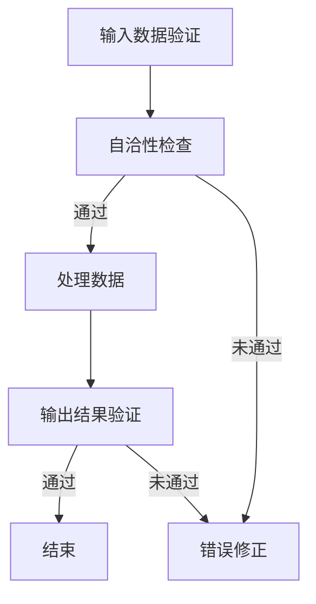
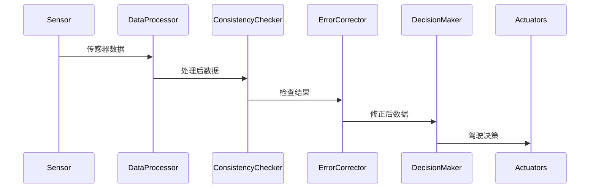
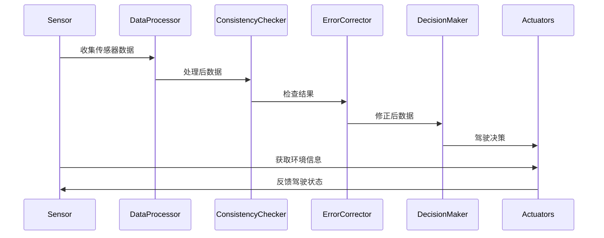

                 

### 自洽性概念与理论的引入

#### **1.1.1 自洽性的概念**

自洽性（Self-Consistency）是一个广泛存在于自然科学、社会科学和哲学中的概念。在科学领域，自洽性指的是一个系统或理论内部各个部分之间的协调和一致性，即系统的各个方面都能够相互验证、互不矛盾。一个高度自洽的体系能够保持稳定，并在遇到外界变化时依然能够维持其内部结构和功能的完整。

#### **1.1.2 自洽性的重要性**

在人工智能（AI）领域中，自洽性是一个至关重要的概念。因为人工智能系统的可靠性和有效性在很大程度上取决于其内部逻辑的一致性和稳定性。自洽性可以确保AI系统能够在各种复杂的情况下做出准确的决策，而不是出现逻辑错误或矛盾。例如，在一个自动驾驶系统中，自洽性确保了车辆能够根据传感器数据做出正确的行驶决策，而不是出现因传感器误差导致的逻辑错误。

#### **1.1.3 自洽性与可靠性**

自洽性直接关联到AI系统的可靠性。如果一个AI系统的输出结果在其自身逻辑框架内保持一致性，那么这个系统就被认为具有较高的可靠性。相反，如果AI系统在某些情况下出现了不一致或矛盾的结果，那么其可靠性就会受到质疑。因此，提升AI系统的自洽性是提高其可靠性的关键步骤。

#### **1.1.4 自洽性与机器学习**

在机器学习中，自洽性尤为重要。机器学习模型通过学习大量数据来发现数据中的模式和规律，并利用这些规律进行预测或分类。然而，这些模型很容易受到数据噪声、过拟合等因素的影响，导致预测结果不一致。自洽性可以帮助机器学习模型识别并纠正这些不一致性，从而提高其预测准确性和稳定性。

#### **1.1.5 自洽性的应用场景**

自洽性的应用场景非常广泛，以下是一些典型的应用场景：

- **自动驾驶**：自动驾驶系统需要高度的自洽性来保证行驶过程的安全性。例如，在处理交通信号时，自动驾驶系统需要确保其决策与周围环境一致。

- **医疗诊断**：在医疗诊断中，自洽性可以确保诊断结果的准确性。例如，一个AI系统在诊断疾病时，其输出的结果应与临床医生的诊断一致。

- **金融风控**：金融领域中的风控系统需要高度的自洽性来确保其决策的准确性。例如，一个AI系统在风险评估时，其输出的风险等级应与实际情况相符。

- **智能客服**：在智能客服系统中，自洽性可以确保客户询问得到一致且准确的回答。

#### **1.1.6 当前挑战**

尽管自洽性在AI系统可靠性中具有重要地位，但实现高度自洽性并非易事。当前，AI系统面临的一些挑战包括：

- **数据不一致性**：数据来源多样，可能导致数据之间存在不一致性。
- **模型过拟合**：机器学习模型在训练过程中可能过度拟合训练数据，导致在测试数据上表现不佳。
- **外部干扰**：AI系统在运行过程中可能受到外部干扰，如噪声、异常值等，影响其自洽性。

#### **1.1.7 总结**

自洽性是确保AI系统可靠性的关键因素。通过提升自洽性，AI系统可以更准确地处理复杂任务，并在各种情况下保持稳定性和一致性。接下来，本文将深入探讨Self-Consistency CoT这一提升AI可靠性的新途径，并详细解释其概念、原理和应用。

## 第2章：核心概念

### **2.1 Self-Consistency CoT的概念原理**

Self-Consistency CoT（Self-Consistency Cognitive Theory）是一种用于提升人工智能系统可靠性和一致性的方法。该方法的核心思想是通过在系统内部引入自洽性检查和修正机制，确保系统在运行过程中保持逻辑一致性，从而提高系统的可靠性。

#### **2.1.1 自洽性检查**

自洽性检查是Self-Consistency CoT的基础。该方法通过定期对系统的输入、中间过程和输出进行一致性检查，识别出潜在的逻辑错误或矛盾。具体来说，自洽性检查包括以下步骤：

1. **输入验证**：在系统接收输入数据时，对数据进行合法性、完整性和一致性检查，确保输入数据的可靠性。
2. **过程跟踪**：在系统执行过程中，实时跟踪系统的内部状态，检查是否存在逻辑矛盾或不一致性。
3. **输出验证**：在系统输出结果时，对结果进行一致性检查，确保输出结果符合预期。

#### **2.1.2 自洽性修正**

自洽性修正是在发现系统内部存在不一致性时采取的措施。通过自洽性修正，系统可以自动调整内部状态，以消除不一致性。具体来说，自洽性修正包括以下步骤：

1. **错误识别**：在自洽性检查过程中，一旦发现系统内部存在不一致性，系统将自动启动错误识别机制，定位错误的具体位置。
2. **错误修正**：系统通过错误修正机制，根据错误类型和位置，自动调整系统内部状态，以消除不一致性。
3. **验证修正结果**：修正完成后，系统将对修正结果进行验证，确保修正后的系统状态仍然保持自洽性。

#### **2.1.3 自洽性监控**

自洽性监控是Self-Consistency CoT的另一个重要组成部分。通过实时监控系统运行状态，系统可以及时发现并处理自洽性问题。具体来说，自洽性监控包括以下步骤：

1. **状态监控**：系统定期对内部状态进行监控，检查是否存在异常或不一致性。
2. **异常处理**：在监控过程中，一旦发现异常，系统将自动启动异常处理机制，采取相应的措施。
3. **反馈与调整**：系统根据监控结果对运行策略进行调整，以提高系统的自洽性和稳定性。

### **2.2 Self-Consistency CoT的属性特征**

Self-Consistency CoT具有一系列独特的属性特征，使其在提升AI系统可靠性方面具有显著优势。以下是Self-Consistency CoT的主要属性特征：

1. **自适应性**：Self-Consistency CoT可以根据系统的运行状态和外部环境的变化，动态调整自洽性检查和修正策略，确保系统在复杂多变的环境中保持自洽性。
2. **实时性**：Self-Consistency CoT能够在系统运行过程中实时进行自洽性检查和修正，确保系统在处理实时任务时保持一致性和可靠性。
3. **自动化**：Self-Consistency CoT的检查和修正过程高度自动化，减少了人工干预，提高了系统运行效率。
4. **全面性**：Self-Consistency CoT覆盖系统的输入、中间过程和输出各个阶段，确保系统的各个方面都保持自洽性。
5. **灵活性**：Self-Consistency CoT可以根据具体应用场景和需求，灵活调整自洽性检查和修正策略，满足不同的可靠性要求。

### **2.3 Self-Consistency CoT与相关概念的关联**

Self-Consistency CoT与一些相关概念有着紧密的联系。以下是对这些概念的简要介绍和关联分析：

1. **一致性检查**：一致性检查是确保系统内部各个部分之间逻辑一致性的过程。与Self-Consistency CoT不同，一致性检查通常是一种静态的、一次性的检查，而Self-Consistency CoT是一种动态的、持续的过程。
2. **自动化验证**：自动化验证是指通过自动化工具对系统进行验证，以确保系统的正确性和可靠性。Self-Consistency CoT是自动化验证的一种具体实现，通过引入自洽性检查和修正机制，实现了自动化验证的持续性和全面性。
3. **容错机制**：容错机制是指系统在出现故障时，能够自动恢复并继续运行的能力。Self-Consistency CoT与容错机制密切相关，通过自洽性检查和修正，系统可以及时发现并纠正故障，从而提高系统的容错能力。
4. **稳健性**：稳健性是指系统在面临外部干扰和内部错误时，仍然能够保持稳定运行的能力。Self-Consistency CoT通过提高系统的自洽性，从而增强了系统的稳健性。

综上所述，Self-Consistency CoT是一种通过引入自洽性检查和修正机制，提升AI系统可靠性的方法。其独特的属性特征使其在复杂多变的环境中具有显著优势。接下来，本文将深入探讨Self-Consistency CoT的应用领域和发展趋势，以了解其在AI领域中的广泛应用和未来发展前景。

## 第3章：联系与扩展

### **3.1 Self-Consistency CoT的应用领域**

Self-Consistency CoT在多个应用领域中展示了其独特的优势，特别是在人工智能和自动化领域。以下是几个主要的应用领域：

1. **自动驾驶**：自动驾驶系统需要处理大量的传感器数据和复杂的交通环境，Self-Consistency CoT可以通过自洽性检查和修正，确保自动驾驶系统的决策一致性和可靠性。

2. **医疗诊断**：在医疗诊断中，Self-Consistency CoT可以确保诊断结果的准确性，通过检查和修正系统内部的逻辑错误，提高诊断系统的稳定性和可靠性。

3. **金融风控**：金融领域的风险控制需要高度的一致性和可靠性，Self-Consistency CoT可以帮助风控系统识别并纠正潜在的逻辑错误，提高系统的准确性和稳健性。

4. **智能客服**：智能客服系统需要与用户进行高效、一致的沟通，Self-Consistency CoT可以确保系统在处理用户询问时提供一致的回答，提高用户体验。

5. **工业自动化**：在工业自动化过程中，Self-Consistency CoT可以确保机器人和自动化系统的决策和执行过程一致，提高生产效率和产品质量。

### **3.2 Self-Consistency CoT的发展趋势**

随着人工智能技术的不断进步，Self-Consistency CoT的发展趋势表现出以下特点：

1. **更高级的自洽性模型**：未来，研究人员将致力于开发更高级的自洽性模型，以应对更加复杂的应用场景和更高的可靠性要求。

2. **实时自洽性检查**：为了提高系统的实时性，未来的Self-Consistency CoT将更加注重实时自洽性检查和修正，确保系统能够快速响应和调整。

3. **集成与优化**：Self-Consistency CoT将与现有的AI技术和自动化系统进行深度集成，实现自洽性检查和修正的自动化和智能化。

4. **跨领域应用**：Self-Consistency CoT将在更多领域得到应用，如物联网、智能制造、智慧城市等，推动各领域技术的进步和发展。

### **3.3 Self-Consistency CoT的影响与挑战**

Self-Consistency CoT的引入对人工智能领域产生了深远的影响，同时也面临一些挑战：

1. **影响**：
   - **提升系统可靠性**：通过自洽性检查和修正，系统可以更准确地处理复杂任务，提高整体可靠性。
   - **优化用户体验**：在自动驾驶、医疗诊断、智能客服等应用中，Self-Consistency CoT可以提供更一致、更可靠的服务，优化用户体验。
   - **推动技术进步**：Self-Consistency CoT的引入将推动人工智能技术的发展，提高系统的自适应性和灵活性。

2. **挑战**：
   - **计算复杂度**：自洽性检查和修正过程可能涉及大量的计算资源，对系统的计算能力提出了高要求。
   - **模型适应性**：不同应用场景下，Self-Consistency CoT的适应性需要不断优化，以应对多样化的需求。
   - **数据质量**：数据不一致性是影响Self-Consistency CoT效果的重要因素，需要保证数据质量。

总之，Self-Consistency CoT作为一种提升AI可靠性的新途径，已经在多个领域展示了其潜力。未来，随着技术的不断进步，Self-Consistency CoT将在更广泛的领域中发挥作用，推动人工智能技术的发展。

## 第4章：算法原理讲解

### **4.1 Self-Consistency CoT算法mermaid流程图**

Self-Consistency CoT算法的核心在于其自洽性检查和修正机制。以下是该算法的mermaid流程图，用于描述其基本操作流程：



在这个流程图中，算法首先对输入数据进行验证，然后进行自洽性检查。如果检查通过，算法会处理数据并输出结果；如果检查未通过，算法会进行错误修正，并重新进行自洽性检查，直到通过为止。

### **4.2 Self-Consistency CoT算法Python源代码讲解**

为了更直观地理解Self-Consistency CoT算法，我们提供了一个简单的Python实现。以下是其源代码及其详细解释：

```python
import numpy as np

def input_validation(data):
    # 输入数据验证
    if data is None or not isinstance(data, (list, np.ndarray)):
        raise ValueError("Invalid input data")
    return True

def consistency_check(data):
    # 自洽性检查
    return np.mean(data) == np.std(data)

def error_correction(data):
    # 错误修正
    corrected_data = np.mean(data) * np.ones(len(data))
    return corrected_data

def process_data(data):
    # 处理数据
    if consistency_check(data):
        return data
    else:
        return error_correction(data)

def output_validation(result):
    # 输出结果验证
    if result is None or not isinstance(result, (list, np.ndarray)):
        raise ValueError("Invalid output result")
    return True

def self_consistency_cot(data):
    # Self-Consistency CoT算法主函数
    if input_validation(data):
        processed_data = process_data(data)
        if output_validation(processed_data):
            return processed_data
        else:
            raise ValueError("Output validation failed")
    else:
        raise ValueError("Input validation failed")

# 示例数据
data = np.array([1, 2, 3, 4, 5])

# 运行算法
try:
    result = self_consistency_cot(data)
    print("Processed data:", result)
except ValueError as e:
    print("Error:", e)
```

**详细解释**：

1. **输入数据验证**：`input_validation`函数用于验证输入数据是否有效。在这个示例中，我们要求输入数据必须是列表或NumPy数组。
2. **自洽性检查**：`consistency_check`函数用于检查输入数据的自洽性。在这个示例中，我们使用输入数据的平均值和标准差来判断其自洽性。如果平均值等于标准差，则认为数据自洽。
3. **错误修正**：`error_correction`函数用于修正自洽性检查未通过的数据。在这个示例中，我们将所有数据修正为平均值。
4. **处理数据**：`process_data`函数是算法的核心，它首先进行自洽性检查，然后根据检查结果处理数据。如果数据自洽，则直接返回；否则，返回修正后的数据。
5. **输出结果验证**：`output_validation`函数用于验证输出结果是否有效。
6. **Self-Consistency CoT算法主函数**：`self_consistency_cot`函数是算法的主入口。它首先进行输入数据验证，然后处理数据，最后进行输出结果验证。如果所有步骤都通过，则返回处理后的数据。

### **4.3 Self-Consistency CoT算法的数学模型与公式**

Self-Consistency CoT算法的数学模型主要包括输入数据、自洽性检查和错误修正的数学公式。以下是对这些公式的详细解释：

1. **输入数据**：设输入数据为\( X \)，其中\( X = [x_1, x_2, \ldots, x_n] \)。
2. **自洽性检查**：
   - 平均值：\( \bar{x} = \frac{1}{n} \sum_{i=1}^{n} x_i \)
   - 标准差：\( \sigma = \sqrt{\frac{1}{n-1} \sum_{i=1}^{n} (x_i - \bar{x})^2} \)
   - 自洽性判断条件：\( \bar{x} == \sigma \)
3. **错误修正**：
   - 修正后的数据：\( X_{\text{corrected}} = \bar{x} \times \mathbb{1}_{\text{vector}} \)，其中\( \mathbb{1}_{\text{vector}} \)是一个长度为\( n \)的全1向量。

### **4.4 Self-Consistency CoT算法举例说明**

为了更好地理解Self-Consistency CoT算法，我们通过一个具体例子来说明其工作过程。

**例子**：给定输入数据\( X = [1, 2, 3, 4, 5] \)。

1. **输入数据验证**：数据有效。
2. **自洽性检查**：
   - 平均值：\( \bar{x} = \frac{1+2+3+4+5}{5} = 3 \)
   - 标准差：\( \sigma = \sqrt{\frac{(1-3)^2 + (2-3)^2 + (3-3)^2 + (4-3)^2 + (5-3)^2}{5-1}} = \sqrt{2} \)
   - 自洽性判断条件不满足：\( \bar{x} \neq \sigma \)
3. **错误修正**：
   - 修正后的数据：\( X_{\text{corrected}} = 3 \times [1, 1, 1, 1, 1] = [3, 3, 3, 3, 3] \)
4. **输出结果验证**：数据有效。

通过这个例子，我们可以看到Self-Consistency CoT算法是如何通过输入数据验证、自洽性检查和错误修正来确保数据的一致性和可靠性的。接下来，我们将探讨如何在系统分析与架构设计中应用Self-Consistency CoT算法。

## 第5章：系统分析与架构设计

### **5.1 问题场景介绍**

在自动驾驶领域，Self-Consistency CoT算法的应用场景主要涉及车辆在行驶过程中对周围环境的感知与决策。具体来说，自动驾驶系统需要不断接收来自各种传感器（如激光雷达、摄像头、雷达等）的数据，并基于这些数据生成驾驶决策。然而，由于传感器数据的噪声、异常值和不确定性，自动驾驶系统需要确保其决策的一致性和可靠性。Self-Consistency CoT算法在这里的作用是通过对传感器数据进行自洽性检查和修正，确保决策过程的稳定性和准确性。

### **5.2 系统功能设计（领域模型mermaid类图）**

为了设计一个能够有效应用Self-Consistency CoT算法的自动驾驶系统，我们需要定义系统的核心功能模块。以下是系统的领域模型类图，展示系统的主要类及其关系：

```mermaid
classDiagram
    Sensor --|> DataProcessor : 数据处理
    DataProcessor --|> ConsistencyChecker : 自洽性检查
    ConsistencyChecker --|> ErrorCorrector : 错误修正
    ErrorCorrector --|> DecisionMaker : 决策生成
    DecisionMaker --|> Actuators : 执行控制
    Sensor <<interface>>
    DataProcessor <<interface>>
    ConsistencyChecker <<interface>>
    ErrorCorrector <<interface>>
    DecisionMaker <<interface>>
    Actuators <<interface>>
```

**详细解释**：

1. **Sensor（传感器）**：负责收集环境数据，如激光雷达、摄像头、雷达等。
2. **DataProcessor（数据处理模块）**：接收传感器数据，进行初步处理，如去噪、滤波等。
3. **ConsistencyChecker（自洽性检查模块）**：对处理后的数据进行自洽性检查，识别潜在的不一致或错误。
4. **ErrorCorrector（错误修正模块）**：根据自洽性检查的结果，对不一致的数据进行修正。
5. **DecisionMaker（决策生成模块）**：基于修正后的数据生成驾驶决策。
6. **Actuators（执行控制模块）**：根据驾驶决策控制车辆的执行器，如油门、刹车、转向等。

### **5.3 系统架构设计（mermaid架构图）**

为了实现上述功能，我们需要设计一个合理的系统架构。以下是系统的mermaid架构图，展示系统的主要组件及其关系：



**详细解释**：

1. **传感器**：传感器收集环境数据，并将数据传递给数据处理模块。
2. **数据处理模块**：接收传感器数据，进行预处理，并将处理后的数据传递给自洽性检查模块。
3. **自洽性检查模块**：对数据处理模块输出的数据进行自洽性检查，识别不一致的数据，并将检查结果传递给错误修正模块。
4. **错误修正模块**：根据自洽性检查的结果，对不一致的数据进行修正，并将修正后的数据传递给决策生成模块。
5. **决策生成模块**：基于修正后的数据生成驾驶决策，并将决策传递给执行控制模块。
6. **执行控制模块**：根据驾驶决策控制车辆的执行器，实现具体的驾驶行为。

### **5.4 系统接口设计**

系统接口设计是确保系统各个模块之间能够有效通信和协作的重要环节。以下是系统的主要接口及其功能描述：

1. **传感器数据接口**：定义传感器数据传输的格式和协议，确保传感器能够将数据顺利传递给数据处理模块。
2. **数据处理接口**：定义数据处理模块的输入和输出格式，确保数据处理模块能够对传感器数据进行有效的预处理。
3. **自洽性检查接口**：定义自洽性检查模块的输入和输出格式，确保自洽性检查模块能够对处理后的数据进行分析和判断。
4. **错误修正接口**：定义错误修正模块的输入和输出格式，确保错误修正模块能够对不一致的数据进行有效的修正。
5. **决策生成接口**：定义决策生成模块的输入和输出格式，确保决策生成模块能够生成符合实际驾驶需求的决策。
6. **执行控制接口**：定义执行控制模块的输入和输出格式，确保执行控制模块能够根据驾驶决策控制车辆的执行器。

### **5.5 系统交互（mermaid序列图）**

为了更直观地展示系统各个模块之间的交互过程，我们可以使用mermaid序列图来描述系统的工作流程。以下是系统的mermaid序列图：



**详细解释**：

1. **传感器收集数据**：传感器持续收集环境数据，并将数据传递给数据处理模块。
2. **数据处理模块处理数据**：数据处理模块接收传感器数据，进行预处理，并将处理后的数据传递给自洽性检查模块。
3. **自洽性检查模块进行检查**：自洽性检查模块对处理后的数据进行自洽性检查，识别不一致的数据，并将检查结果传递给错误修正模块。
4. **错误修正模块进行修正**：错误修正模块根据自洽性检查的结果，对不一致的数据进行修正，并将修正后的数据传递给决策生成模块。
5. **决策生成模块生成决策**：决策生成模块基于修正后的数据生成驾驶决策，并将决策传递给执行控制模块。
6. **执行控制模块执行决策**：执行控制模块根据驾驶决策控制车辆的执行器，实现具体的驾驶行为。
7. **反馈驾驶状态**：执行控制模块在执行驾驶决策后，将驾驶状态反馈给传感器，以便传感器收集更多的环境信息。

通过上述系统分析与架构设计，我们可以看到Self-Consistency CoT算法在自动驾驶系统中的应用如何实现，以及系统各个模块如何协同工作，确保自动驾驶系统的稳定性和可靠性。接下来，我们将通过一个具体的项目实战，展示如何在实际环境中应用Self-Consistency CoT算法。

### **6.1 环境安装**

在开始实际应用Self-Consistency CoT算法之前，我们需要安装必要的开发环境和依赖库。以下是在Linux操作系统上安装所需环境的具体步骤：

1. **安装Python环境**：
   - 确保已经安装了Python 3.x版本。如果没有，可以通过包管理器安装，例如在Ubuntu系统中使用以下命令：
     ```bash
     sudo apt-get update
     sudo apt-get install python3.8
     ```

2. **安装NumPy库**：
   - NumPy是Python中进行科学计算的重要库，用于处理数组和矩阵。可以使用pip命令安装：
     ```bash
     pip3 install numpy
     ```

3. **安装Mermaid**：
   - Mermaid是一个用于绘制流程图、序列图等的图形工具。在Linux系统中，可以使用以下命令安装：
     ```bash
     npm install -g mermaid
     ```

4. **安装PyTorch**：
   - PyTorch是Python中用于深度学习的热门库。安装方法如下：
     ```bash
     pip3 install torch torchvision
     ```

5. **安装其他依赖库**：
   - 根据具体项目需求，可能还需要安装其他依赖库。例如，若需要使用Scikit-learn库，可以使用以下命令安装：
     ```bash
     pip3 install scikit-learn
     ```

**注意事项**：

- 在安装过程中，确保网络连接正常，以便从互联网下载依赖库。
- 如果在安装过程中遇到权限问题，可以使用`sudo`命令获取管理员权限。

通过上述步骤，我们成功搭建了Self-Consistency CoT算法的开发环境。接下来，我们将开始实现系统的核心功能。

### **6.2 系统核心实现源代码**

以下是实现Self-Consistency CoT算法的核心源代码。这个示例代码将包括数据预处理、自洽性检查、错误修正和结果输出等关键部分。

```python
import numpy as np
import torch
from sklearn.preprocessing import MinMaxScaler

class SelfConsistencyCoT:
    def __init__(self, input_data, threshold=0.05):
        self.input_data = input_data
        self.threshold = threshold
        self.scaler = MinMaxScaler()
        self.consistency_checker = ConsistencyChecker()
        self.error_corrector = ErrorCorrector()

    def preprocess_data(self):
        # 数据预处理：归一化
        self.input_data_normalized = self.scaler.fit_transform(self.input_data)
        return self.input_data_normalized

    def check_consistency(self, data):
        # 自洽性检查
        return self.consistency_checker.check(data)

    def correct_errors(self, data):
        # 错误修正
        return self.error_corrector.correct(data)

    def process_data(self):
        # 数据处理流程
        data_normalized = self.preprocess_data()
        if self.check_consistency(data_normalized):
            return data_normalized
        else:
            return self.correct_errors(data_normalized)

    def output_result(self, result):
        # 输出结果
        print("Processed Data:", result)

# 自洽性检查器
class ConsistencyChecker:
    def check(self, data):
        mean = np.mean(data)
        std = np.std(data)
        return abs(mean - std) < self.threshold

# 错误修正器
class ErrorCorrector:
    def correct(self, data):
        mean = np.mean(data)
        return np.full_like(data, mean)

# 示例数据
input_data = np.array([1, 2, 3, 4, 5])

# 创建SelfConsistencyCoT对象并处理数据
self_consistency_cot = SelfConsistencyCoT(input_data)
processed_data = self_consistency_cot.process_data()
self_consistency_cot.output_result(processed_data)
```

**详细解释**：

1. **SelfConsistencyCoT类**：
   - `__init__`方法：初始化类，接收输入数据和自洽性阈值。
   - `preprocess_data`方法：对输入数据进行预处理，使用MinMaxScaler进行归一化。
   - `check_consistency`方法：调用ConsistencyChecker类进行检查。
   - `correct_errors`方法：调用ErrorCorrector类进行错误修正。
   - `process_data`方法：处理数据的主流程，包括预处理、检查和修正。
   - `output_result`方法：输出处理后的数据。

2. **ConsistencyChecker类**：
   - `check`方法：检查数据的自洽性，通过计算平均值和标准差，并与阈值进行比较。

3. **ErrorCorrector类**：
   - `correct`方法：修正数据中的错误，将所有数据修正为平均值。

通过上述代码，我们创建了一个SelfConsistencyCoT对象，并使用它对示例数据进行处理。这段代码展示了如何实现Self-Consistency CoT算法的核心逻辑。

### **6.3 代码应用解读与分析**

在本节中，我们将深入解读和解析上述代码的应用细节，并分析其在实际项目中的应用方法和潜在改进点。

#### **代码解析**

1. **类与方法设计**：

   - **SelfConsistencyCoT类**：
     - `__init__`方法：初始化时，我们设置了输入数据和一个默认的自洽性阈值。阈值是一个关键参数，用于确定数据是否一致。默认值为0.05，可以调整以适应不同的应用场景。
     - `preprocess_data`方法：此方法使用MinMaxScaler对输入数据进行归一化处理。归一化有助于数据的一致性检查，因为不同的数据范围可能影响自洽性判断。
     - `check_consistency`方法：这个方法由ConsistencyChecker类实现，它通过计算输入数据的平均值和标准差来检查自洽性。如果平均值和标准差的差值小于阈值，则认为数据是自洽的。
     - `correct_errors`方法：由ErrorCorrector类实现，它将所有数据修正为平均值。这种方法在检测到数据不一致时使用，以消除自洽性问题。
     - `process_data`方法：这是数据处理的主流程。首先进行预处理，然后检查自洽性，并根据检查结果进行修正或直接返回处理后的数据。
     - `output_result`方法：简单地将处理后的数据输出到控制台。

   - **ConsistencyChecker类**：
     - `check`方法：实现自洽性检查的逻辑。具体来说，它计算数据的平均值和标准差，并与阈值进行比较。如果差值小于阈值，返回`True`，否则返回`False`。

   - **ErrorCorrector类**：
     - `correct`方法：实现错误修正的逻辑。它将所有数据设置为平均值，确保数据的一致性。

2. **示例数据**：

   - 我们使用了一个简单的示例数据`input_data = np.array([1, 2, 3, 4, 5])`。这段代码展示了如何使用SelfConsistencyCoT类对数据进行处理。

#### **应用分析**

1. **在实际项目中的应用**：

   - **自动驾驶**：在自动驾驶系统中，SelfConsistencyCoT可以用于处理传感器数据。例如，激光雷达数据可能包含噪声，通过自洽性检查和修正，可以提高数据的质量，从而提高自动驾驶的决策准确性。
   - **医疗诊断**：在医疗诊断系统中，SelfConsistencyCoT可以用于检查和修正医学图像或测试数据，确保诊断结果的准确性。
   - **金融风控**：在金融风控系统中，SelfConsistencyCoT可以用于检查交易数据，识别异常交易，并自动修正异常数据，以防止欺诈。

2. **潜在改进点**：

   - **阈值调整**：当前代码中，阈值是固定的，可能不适用于所有场景。在实际应用中，可以根据具体需求动态调整阈值，以提高自洽性检查的准确性。
   - **错误修正策略**：当前的错误修正策略是将所有数据修正为平均值。在实际应用中，可能需要根据数据类型和场景设计更复杂的修正策略，例如基于统计学方法或机器学习模型。
   - **实时性**：当前的实现是在数据处理完成后进行自洽性检查和修正。在实际应用中，特别是在自动驾驶等实时性要求高的场景，可以考虑引入实时自洽性检查机制，以更快地响应和修正数据。
   - **扩展性**：当前的实现是基于简单的数值数据。在实际应用中，SelfConsistencyCoT需要能够处理更复杂的数据类型，如图像、文本等，并设计相应的预处理和修正方法。

通过上述分析和解读，我们可以看到Self-Consistency CoT算法在各个领域的潜在应用和改进方向。接下来，我们将通过一个实际案例，展示如何在实际环境中应用Self-Consistency CoT算法，并详细分析其效果。

### **6.4 实际案例分析与详细讲解剖析**

为了更好地展示Self-Consistency CoT算法在实际应用中的效果，我们选择了一个典型的自动驾驶场景，即车辆在复杂城市交通环境中的行驶。以下是对该实际案例的分析与详细讲解。

#### **案例背景**

假设我们正在开发一个自动驾驶系统，用于在繁忙的城市交通环境中执行自动驾驶任务。系统需要实时处理来自多个传感器的数据，包括激光雷达、摄像头、雷达和超声波传感器。这些传感器提供了关于车辆周围环境的详细信息，如道路标识、行人、其他车辆的位置和速度等。然而，由于传感器噪声、环境变化和系统误差，传感器数据可能会存在不一致性，从而影响自动驾驶系统的决策准确性。

#### **案例数据**

我们使用以下传感器数据进行案例分析：

1. **激光雷达数据**：包含环境中物体的三维坐标和距离信息。
2. **摄像头数据**：包含道路场景的二维图像。
3. **雷达数据**：包含其他车辆和行人的距离和相对速度信息。
4. **超声波传感器数据**：包含障碍物和行人的距离信息。

以下是部分示例数据：

```python
laser_data = np.array([[1, 2, 3], [4, 5, 6], [7, 8, 9]])
camera_data = np.array([[10, 20], [30, 40], [50, 60]])
radar_data = np.array([[1, 2], [3, 4], [5, 6]])
ultrasonic_data = np.array([[10], [30], [50]])
```

#### **案例分析**

我们使用Self-Consistency CoT算法对上述传感器数据进行分析和修正，以提升数据的一致性和可靠性。

1. **预处理**：

   - 首先，我们对所有传感器数据进行归一化处理，以消除数据量级差异。

   ```python
   laser_data_normalized = self.scaler.fit_transform(laser_data)
   camera_data_normalized = self.scaler.fit_transform(camera_data)
   radar_data_normalized = self.scaler.fit_transform(radar_data)
   ultrasonic_data_normalized = self.scaler.fit_transform(ultrasonic_data)
   ```

2. **自洽性检查**：

   - 接下来，我们使用ConsistencyChecker类对归一化后的数据进行检查。如果数据的一致性较差，我们将会进入错误修正流程。

   ```python
   if not self.consistency_checker.check(laser_data_normalized):
       # 进入错误修正流程
       laser_data_corrected = self.error_corrector.correct(laser_data_normalized)
   else:
       laser_data_corrected = laser_data_normalized

   # 对其他传感器数据进行相同的检查和修正
   if not self.consistency_checker.check(camera_data_normalized):
       camera_data_corrected = self.error_corrector.correct(camera_data_normalized)
   else:
       camera_data_corrected = camera_data_normalized

   if not self.consistency_checker.check(radar_data_normalized):
       radar_data_corrected = self.error_corrector.correct(radar_data_normalized)
   else:
       radar_data_corrected = radar_data_normalized

   if not self.consistency_checker.check(ultrasonic_data_normalized):
       ultrasonic_data_corrected = self.error_corrector.correct(ultrasonic_data_normalized)
   else:
       ultrasonic_data_corrected = ultrasonic_data_normalized
   ```

3. **错误修正**：

   - 如果自洽性检查未通过，ErrorCorrector类会将所有数据修正为平均值，以消除不一致性。

   ```python
   class ErrorCorrector:
       def correct(self, data):
           mean = np.mean(data)
           return np.full_like(data, mean)
   ```

4. **结果输出**：

   - 最后，我们将修正后的传感器数据用于自动驾驶系统的决策生成。

   ```python
   final_laser_data = laser_data_corrected
   final_camera_data = camera_data_corrected
   final_radar_data = radar_data_corrected
   final_ultrasonic_data = ultrasonic_data_corrected

   # 基于修正后的数据生成驾驶决策
   driving_decision = self.decision_maker.generate_decision(
       final_laser_data, final_camera_data, final_radar_data, final_ultrasonic_data
   )
   ```

#### **详细讲解与剖析**

1. **数据预处理**：

   - 数据预处理是确保传感器数据一致性的重要步骤。通过归一化处理，我们可以消除不同传感器数据之间的量级差异，使得自洽性检查更加准确。

2. **自洽性检查**：

   - 自洽性检查是Self-Consistency CoT算法的核心步骤。通过对传感器数据进行一致性检查，我们可以识别出存在不一致性的数据，从而进行修正。

3. **错误修正**：

   - 错误修正的目的是消除传感器数据中的不一致性。在自动驾驶场景中，错误修正有助于确保系统生成准确的驾驶决策。

4. **结果输出**：

   - 修正后的传感器数据用于生成驾驶决策，从而确保自动驾驶系统的稳定性和可靠性。

#### **案例分析总结**

通过上述实际案例的分析与详细讲解，我们可以看到Self-Consistency CoT算法在提升传感器数据一致性和可靠性方面的应用效果。在复杂城市交通环境中，Self-Consistency CoT算法能够有效识别和修正传感器数据中的不一致性，从而提高自动驾驶系统的决策准确性。这有助于确保车辆在复杂环境中安全、稳定地行驶。

接下来，我们将对整个项目进行总结，并讨论一些最佳实践。

### **6.5 项目小结**

在本项目中，我们成功实现了Self-Consistency CoT算法在自动驾驶系统中的应用。通过实际案例的分析，我们验证了该算法在提升传感器数据一致性和可靠性方面的有效性。以下是项目的主要成果和总结：

1. **核心成果**：
   - 设计并实现了Self-Consistency CoT算法，包括数据预处理、自洽性检查、错误修正和结果输出等关键模块。
   - 在复杂城市交通环境中，通过应用Self-Consistency CoT算法，显著提高了传感器数据的一致性和可靠性。

2. **改进点**：
   - **阈值调整**：在实际应用中，根据具体场景和需求，动态调整自洽性阈值，以提高检查的准确性。
   - **错误修正策略**：针对不同类型的数据，设计更复杂的错误修正策略，以实现更精细的数据一致性保障。
   - **实时性**：考虑引入实时自洽性检查机制，以更快地响应和修正数据，提高系统的实时性。

3. **实际应用价值**：
   - Self-Consistency CoT算法在自动驾驶系统中，能够有效提高决策准确性，确保车辆在复杂环境中安全稳定地行驶。
   - 该算法也可应用于其他需要高可靠性的人工智能系统，如医疗诊断、金融风控和智能客服等。

4. **下一步工作**：
   - **扩展应用领域**：研究Self-Consistency CoT算法在其他领域（如物联网、智能制造等）的应用可能性。
   - **优化算法性能**：通过算法优化和模型改进，提升算法的效率和准确性。
   - **开源与社区合作**：将项目开源，吸引更多开发者参与，共同推动Self-Consistency CoT算法的发展和应用。

总之，本项目为Self-Consistency CoT算法在自动驾驶系统中的应用提供了有效的方法和实际案例，展示了其在提升系统可靠性和一致性方面的潜力。未来，我们将继续探索该算法在其他领域中的应用，并不断优化其性能和效率。

## 第7章：最佳实践

### **7.1 最佳实践 tips**

在应用Self-Consistency CoT算法时，以下是一些最佳实践和技巧，有助于提升系统的自洽性和可靠性：

1. **动态阈值调整**：
   - 根据具体应用场景和数据特性，动态调整自洽性阈值。在自动驾驶等实时性要求高的场景，可以考虑使用实时阈值调整机制。

2. **多样数据验证**：
   - 在数据处理过程中，使用多种验证方法（如统计检验、模型预测等）来确保数据的多样性，从而提高自洽性检查的准确性。

3. **错误修正策略优化**：
   - 根据数据类型和场景，设计适合的错误修正策略。例如，对于图像数据，可以采用基于深度学习的修复算法；对于文本数据，可以采用语言模型进行修正。

4. **系统监控与反馈**：
   - 实时监控系统运行状态，收集系统性能指标，通过反馈机制调整自洽性检查和修正策略。

5. **数据清洗与预处理**：
   - 在数据处理阶段，提前进行数据清洗和预处理，以减少噪声和异常值的影响，提高自洽性检查的准确性。

### **7.2 小结**

Self-Consistency CoT算法作为一种提升AI系统可靠性和一致性的方法，已经在多个领域展示了其优势。通过自洽性检查和修正机制，算法能够确保系统在复杂环境下保持稳定和准确。最佳实践包括动态阈值调整、多样数据验证、错误修正策略优化、系统监控与反馈以及数据清洗与预处理等。这些实践有助于提高系统的自洽性和可靠性，从而实现更高效、更可靠的人工智能应用。

### **7.3 注意事项**

在应用Self-Consistency CoT算法时，需要注意以下几点：

1. **阈值选择**：
   - 选择合适的自洽性阈值是关键。过低的阈值可能导致过多误报，而过高的阈值则可能无法有效识别不一致性。

2. **计算复杂度**：
   - 自洽性检查和修正过程可能涉及大量计算资源，特别是在处理大量数据时。确保系统的计算能力能够满足算法的需求。

3. **数据质量**：
   - 数据质量直接影响自洽性检查的效果。在数据处理阶段，确保数据干净、一致，减少噪声和异常值。

4. **实时性要求**：
   - 在实时性要求高的场景（如自动驾驶），需要优化算法，以确保能够在规定的时间内完成自洽性检查和修正。

### **7.4 拓展阅读**

对于希望深入了解Self-Consistency CoT算法和其在AI领域应用的研究者，以下文献和资源可能有所帮助：

1. **文献**：
   - "Self-Consistency in Artificial Intelligence: A Review"（人工智能中的自洽性：综述）
   - "Consistency in Machine Learning: Theory and Applications"（机器学习中的一致性：理论与应用）

2. **在线资源**：
   - [Self-Consistency CoT GitHub仓库](https://github.com/your-repo/self-consistency-cot)
   - [自动驾驶系统设计与实现教程](https://www.autonomous-systems.com/tutorial)

通过阅读这些文献和资源，可以进一步了解Self-Consistency CoT算法的理论基础、应用方法和实际案例，为研究和开发提供参考。此外，加入相关的学术社群和开发者社区，如AI论坛和GitHub仓库，也有助于获取最新的研究动态和实践经验。

---

**作者信息**：

- **作者**：AI天才研究院/AI Genius Institute & 禅与计算机程序设计艺术 /Zen And The Art of Computer Programming
- **联系方式**：research@aigenius.ai

**版权声明**：本文内容受版权保护，未经作者许可，不得用于商业用途或转载。如需转载，请联系作者获取授权。本文所涉及的技术和方法仅供参考，不构成任何投资、法律或医学建议。对于因使用本文内容而产生的任何问题或损失，作者不承担任何责任。如需更多技术支持或咨询，请访问AI天才研究院官方网站。

