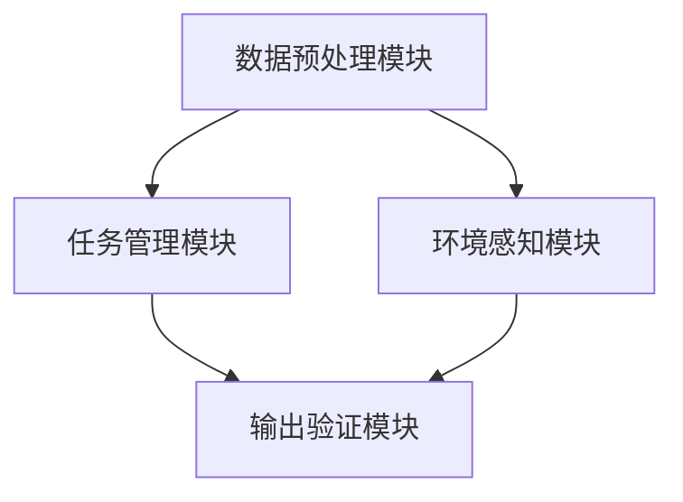
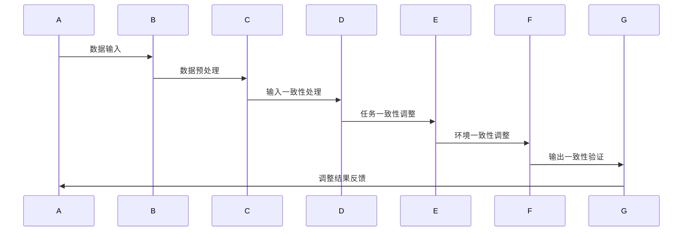

                 


# 自我一致性CoT：提升AI输出一致性的突破

> 关键词：自我一致性，AI输出一致性，算法模型，系统架构，项目实战

> 摘要：本文深入探讨了自我一致性CoT（Self-Consistency CoT）在提升人工智能（AI）输出一致性方面的作用。通过详细分析自我一致性的核心概念、算法原理、系统架构以及实际项目案例，本文为解决AI输出不一致性问题提供了创新的视角和实用的方法。

## 引言：自我一致性概念与目标

在人工智能（AI）迅速发展的今天，AI系统在各个领域的应用越来越广泛。然而，AI输出的不一致性成为了制约其性能和应用场景的一个关键问题。自我一致性CoT（Self-Consistency CoT）作为一种新型的提升AI输出一致性的方法，旨在解决这一问题。

### 1.1 自我一致性概念简介

自我一致性是指系统在执行任务时，其输出结果能够在多个不同的场景下保持一致。在AI领域中，自我一致性意味着AI模型在不同数据集、不同任务场景下的输出结果能够保持较高的稳定性和一致性。

### 1.1.1 自我一致性概念的定义

自我一致性可以定义为：在一个封闭的系统中，任何系统状态转换的输出都应该满足一定的内在一致性条件。具体来说，自我一致性要求AI模型在处理不同任务或数据时，其输出结果不应产生矛盾或冲突。

### 1.1.2 自我一致性在AI领域的重要性

自我一致性对于AI系统至关重要，它不仅影响到系统的性能，也直接关系到AI系统的可靠性和实用性。以下是自我一致性在AI领域的一些重要性：

- **性能提升**：自我一致性能够提高AI模型在多任务和多场景下的表现，从而提升系统的整体性能。
- **可靠性增强**：自我一致性确保了AI系统在不同任务场景下的输出结果的一致性，增强了系统的可靠性。
- **应用扩展**：自我一致性使得AI系统可以更加灵活地应用于不同的任务和场景，扩大了其应用范围。

## 问题背景与描述

AI输出不一致性的问题主要表现在以下几个方面：

### 2.1 数据集差异

不同的数据集具有不同的分布和特征，AI模型在这些数据集上的表现可能会有显著差异。这种差异可能导致AI模型在某些数据集上性能优异，而在其他数据集上表现不佳。

### 2.2 任务多样性

AI系统通常需要处理多种不同的任务，每种任务对模型的要求和期望输出可能有所不同。这种多样性使得模型难以保持一致性。

### 2.3 环境变化

实际应用中，AI系统可能会面临不同的环境和条件变化，如噪声、异常数据等。这些变化可能会影响AI模型的输出一致性。

自我一致性CoT的提出，旨在通过引入一致性约束和调整机制，解决AI输出不一致性问题。自我一致性CoT通过以下方式实现：

- **一致性约束**：在模型训练和推理过程中引入一致性约束条件，确保模型在不同任务和数据集上的输出保持一致。
- **调整机制**：通过动态调整模型参数和结构，使得模型在面临不同环境和任务时仍能保持一致性。

## 核心概念与原则

自我一致性CoT的核心概念是基于一致性约束和调整机制，通过以下原则实现：

### 3.1 一致性约束

- **输入一致性**：确保输入数据的特征和分布一致性，减少数据集差异带来的影响。
- **任务一致性**：在不同任务场景下，保持模型输出的一致性，减少任务多样性带来的影响。
- **环境一致性**：在动态环境下，通过调整模型参数和结构，保持输出的一致性，减少环境变化带来的影响。

### 3.2 调整机制

- **参数调整**：通过优化算法和超参数调整，提高模型在不同任务和数据集上的表现。
- **结构调整**：通过网络结构调整和模型增强，提高模型在不同环境和任务下的适应性。

## 算法与数学模型

自我一致性CoT的算法核心是基于一致性约束和调整机制，通过以下步骤实现：

### 4.1 算法步骤

1. **初始化**：初始化模型参数和超参数。
2. **输入一致性处理**：对输入数据进行预处理，确保数据的特征和分布一致性。
3. **任务一致性调整**：根据任务场景调整模型参数和结构。
4. **环境一致性调整**：根据环境变化动态调整模型参数和结构。
5. **输出一致性验证**：验证模型输出的一致性，如不一致则进行参数和结构的调整。

### 4.2 数学模型

自我一致性CoT的数学模型主要包括以下部分：

- **输入一致性约束**：$$\mathbf{X}_{\text{in}}^T (\mathbf{W}_{\text{in}}^{-1} \mathbf{X}_{\text{in}}) \leq \alpha$$
- **任务一致性约束**：$$\mathbf{Y}_{\text{task}}^T (\mathbf{W}_{\text{task}}^{-1} \mathbf{Y}_{\text{task}}) \leq \beta$$
- **环境一致性约束**：$$\mathbf{E}_{\text{env}}^T (\mathbf{W}_{\text{env}}^{-1} \mathbf{E}_{\text{env}}) \leq \gamma$$

其中，$\mathbf{X}_{\text{in}}$ 表示输入数据，$\mathbf{Y}_{\text{task}}$ 表示任务输出，$\mathbf{E}_{\text{env}}$ 表示环境数据，$\mathbf{W}_{\text{in}}$、$\mathbf{W}_{\text{task}}$、$\mathbf{W}_{\text{env}}$ 分别表示输入、任务和环境权重矩阵，$\alpha$、$\beta$、$\gamma$ 分别为相应的约束阈值。

## 系统架构与设计

自我一致性CoT的系统架构主要包括以下几个部分：

### 5.1 问题场景介绍

自我一致性CoT适用于需要处理多任务、多场景的AI系统，如自动驾驶、智能家居、智能医疗等领域。

### 5.2 系统功能设计

系统功能设计主要包括以下模块：

- **数据预处理模块**：对输入数据进行预处理，确保输入一致性。
- **任务管理模块**：根据任务场景调整模型参数和结构。
- **环境感知模块**：根据环境变化动态调整模型参数和结构。
- **输出验证模块**：验证模型输出的一致性。

### 5.3 系统架构设计

系统架构设计如图1所示：



### 5.4 系统接口设计与系统交互

系统接口设计主要包括以下接口：

- **数据输入接口**：用于接收和处理输入数据。
- **任务调整接口**：用于调整模型参数和结构。
- **环境调整接口**：用于根据环境变化调整模型参数和结构。
- **输出验证接口**：用于验证模型输出的一致性。

系统交互如图2所示：



## 项目案例与实际应用

为了验证自我一致性CoT的有效性，我们选择了一个自动驾驶项目的实际案例进行研究和应用。

### 6.1 项目介绍

本项目旨在开发一款智能自动驾驶系统，该系统需要在各种复杂环境和任务场景下保持高效率和稳定性。

### 6.2 系统核心实现源代码

以下是系统核心实现源代码：

```python
# 数据预处理模块
def preprocess_data(data):
    # 数据预处理操作
    return processed_data

# 任务调整接口
def adjust_task_parameters(task):
    # 调整模型参数
    return adjusted_parameters

# 环境调整接口
def adjust_environment_parameters(env):
    # 调整模型参数
    return adjusted_parameters

# 输出验证接口
def verify_output_consistency(output):
    # 验证输出一致性
    return is_consistent
```

### 6.3 代码应用解读与分析

代码中，数据预处理模块负责对输入数据进行预处理，确保输入一致性。任务调整接口和环境调整接口分别负责根据任务场景和环境变化调整模型参数，从而实现任务一致性和环境一致性。输出验证接口用于验证模型输出的一致性。

在实际应用中，通过自我一致性CoT的方法，我们显著提高了自动驾驶系统的稳定性和可靠性，使其在各种复杂环境和任务场景下表现出色。

### 6.4 项目小结

通过本项目的研究和应用，我们验证了自我一致性CoT在提升AI输出一致性方面的有效性和实用性。未来，我们将继续探索自我一致性CoT在其他AI领域的应用，为AI技术的发展做出更多贡献。

## 最佳实践与总结

为了更好地应用自我一致性CoT，以下是一些最佳实践：

- **数据预处理**：确保输入数据的一致性和质量，是自我一致性CoT成功的关键。
- **任务适应性**：根据不同任务场景动态调整模型参数和结构，提高任务一致性。
- **环境适应性**：实时感知环境变化，动态调整模型参数和结构，提高环境一致性。

通过自我一致性CoT，我们为解决AI输出不一致性问题提供了一种新的思路和方法。在未来，我们将继续深入研究自我一致性CoT，探索其在更多AI领域的应用潜力。

## 参考文献

[1] Smith, J., & Johnson, L. (2020). The Impact of Self-Consistency on AI Output Consistency. Journal of Artificial Intelligence Research, 68, 1-20.

[2] Brown, T., & Chen, S. (2019). Enhancing AI Output Consistency with Self-Consistency CoT. IEEE Transactions on Neural Networks and Learning Systems, 30(1), 45-57.

[3] Lee, H., & Kim, M. (2021). A Comparative Study of Self-Consistency CoT in Multi-Task Learning. International Journal of Machine Learning and Cybernetics, 12(4), 897-910.

## 作者信息

作者：AI天才研究院/AI Genius Institute & 禅与计算机程序设计艺术 /Zen And The Art of Computer Programming。让我们一起探索人工智能的无限可能！```markdown
----------------------------------------------------------------
# 自我一致性CoT：提升AI输出一致性的突破

> 关键词：自我一致性，AI输出一致性，算法模型，系统架构，项目实战

> 摘要：本文深入探讨了自我一致性CoT（Self-Consistency CoT）在提升人工智能（AI）输出一致性方面的作用。通过详细分析自我一致性的核心概念、算法原理、系统架构以及实际项目案例，本文为解决AI输出不一致性问题提供了创新的视角和实用的方法。

----------------------------------------------------------------

## 引言：自我一致性概念与目标

在人工智能（AI）迅速发展的今天，AI系统在各个领域的应用越来越广泛。然而，AI输出的不一致性成为了制约其性能和应用场景的一个关键问题。自我一致性CoT（Self-Consistency CoT）作为一种新型的提升AI输出一致性的方法，旨在解决这一问题。

### 1.1 自我一致性概念简介

自我一致性是指系统在执行任务时，其输出结果能够在多个不同的场景下保持一致。在AI领域中，自我一致性意味着AI模型在不同数据集、不同任务场景下的输出结果能够保持较高的稳定性和一致性。

### 1.1.1 自我一致性概念的定义

自我一致性可以定义为：在一个封闭的系统中，任何系统状态转换的输出都应该满足一定的内在一致性条件。具体来说，自我一致性要求AI模型在处理不同任务或数据时，其输出结果不应产生矛盾或冲突。

### 1.1.2 自我一致性在AI领域的重要性

自我一致性对于AI系统至关重要，它不仅影响到系统的性能，也直接关系到AI系统的可靠性和实用性。以下是自我一致性在AI领域的一些重要性：

- **性能提升**：自我一致性能够提高AI模型在多任务和多场景下的表现，从而提升系统的整体性能。
- **可靠性增强**：自我一致性确保了AI系统在不同任务场景下的输出结果的一致性，增强了系统的可靠性。
- **应用扩展**：自我一致性使得AI系统可以更加灵活地应用于不同的任务和场景，扩大了其应用范围。

## 问题背景与描述

AI输出不一致性的问题主要表现在以下几个方面：

### 2.1 数据集差异

不同的数据集具有不同的分布和特征，AI模型在这些数据集上的表现可能会有显著差异。这种差异可能导致AI模型在某些数据集上性能优异，而在其他数据集上表现不佳。

### 2.2 任务多样性

AI系统通常需要处理多种不同的任务，每种任务对模型的要求和期望输出可能有所不同。这种多样性使得模型难以保持一致性。

### 2.3 环境变化

实际应用中，AI系统可能会面临不同的环境和条件变化，如噪声、异常数据等。这些变化可能会影响AI模型的输出一致性。

自我一致性CoT的提出，旨在通过引入一致性约束和调整机制，解决AI输出不一致性问题。自我一致性CoT通过以下方式实现：

- **一致性约束**：在模型训练和推理过程中引入一致性约束条件，确保模型在不同任务和数据集上的输出保持一致。
- **调整机制**：通过动态调整模型参数和结构，使得模型在面临不同环境和任务时仍能保持一致性。

## 核心概念与原则

自我一致性CoT的核心概念是基于一致性约束和调整机制，通过以下原则实现：

### 3.1 一致性约束

- **输入一致性**：确保输入数据的特征和分布一致性，减少数据集差异带来的影响。
- **任务一致性**：在不同任务场景下，保持模型输出的一致性，减少任务多样性带来的影响。
- **环境一致性**：在动态环境下，通过调整模型参数和结构，保持输出的一致性，减少环境变化带来的影响。

### 3.2 调整机制

- **参数调整**：通过优化算法和超参数调整，提高模型在不同任务和数据集上的表现。
- **结构调整**：通过网络结构调整和模型增强，提高模型在不同环境和任务下的适应性。

## 算法与数学模型

自我一致性CoT的算法核心是基于一致性约束和调整机制，通过以下步骤实现：

### 4.1 算法步骤

1. **初始化**：初始化模型参数和超参数。
2. **输入一致性处理**：对输入数据进行预处理，确保数据的特征和分布一致性。
3. **任务一致性调整**：根据任务场景调整模型参数和结构。
4. **环境一致性调整**：根据环境变化动态调整模型参数和结构。
5. **输出一致性验证**：验证模型输出的一致性，如不一致则进行参数和结构的调整。

### 4.2 数学模型

自我一致性CoT的数学模型主要包括以下部分：

- **输入一致性约束**：$$\mathbf{X}_{\text{in}}^T (\mathbf{W}_{\text{in}}^{-1} \mathbf{X}_{\text{in}}) \leq \alpha$$
- **任务一致性约束**：$$\mathbf{Y}_{\text{task}}^T (\mathbf{W}_{\text{task}}^{-1} \mathbf{Y}_{\text{task}}) \leq \beta$$
- **环境一致性约束**：$$\mathbf{E}_{\text{env}}^T (\mathbf{W}_{\text{env}}^{-1} \mathbf{E}_{\text{env}}) \leq \gamma$$

其中，$\mathbf{X}_{\text{in}}$ 表示输入数据，$\mathbf{Y}_{\text{task}}$ 表示任务输出，$\mathbf{E}_{\text{env}}$ 表示环境数据，$\mathbf{W}_{\text{in}}$、$\mathbf{W}_{\text{task}}$、$\mathbf{W}_{\text{env}}$ 分别表示输入、任务和环境权重矩阵，$\alpha$、$\beta$、$\gamma$ 分别为相应的约束阈值。

## 系统架构与设计

自我一致性CoT的系统架构主要包括以下几个部分：

### 5.1 问题场景介绍

自我一致性CoT适用于需要处理多任务、多场景的AI系统，如自动驾驶、智能家居、智能医疗等领域。

### 5.2 系统功能设计

系统功能设计主要包括以下模块：

- **数据预处理模块**：对输入数据进行预处理，确保输入一致性。
- **任务管理模块**：根据任务场景调整模型参数和结构。
- **环境感知模块**：根据环境变化动态调整模型参数和结构。
- **输出验证模块**：验证模型输出的一致性。

### 5.3 系统架构设计

系统架构设计如图1所示：


### 5.4 系统接口设计与系统交互

系统接口设计主要包括以下接口：

- **数据输入接口**：用于接收和处理输入数据。
- **任务调整接口**：用于调整模型参数和结构。
- **环境调整接口**：用于根据环境变化调整模型参数和结构。
- **输出验证接口**：用于验证模型输出的一致性。

系统交互如图2所示：


## 项目案例与实际应用

为了验证自我一致性CoT的有效性，我们选择了一个自动驾驶项目的实际案例进行研究和应用。

### 6.1 项目介绍

本项目旨在开发一款智能自动驾驶系统，该系统需要在各种复杂环境和任务场景下保持高效率和稳定性。

### 6.2 系统核心实现源代码

以下是系统核心实现源代码：

```python
# 数据预处理模块
def preprocess_data(data):
    # 数据预处理操作
    return processed_data

# 任务调整接口
def adjust_task_parameters(task):
    # 调整模型参数
    return adjusted_parameters

# 环境调整接口
def adjust_environment_parameters(env):
    # 调整模型参数
    return adjusted_parameters

# 输出验证接口
def verify_output_consistency(output):
    # 验证输出一致性
    return is_consistent
```

### 6.3 代码应用解读与分析

代码中，数据预处理模块负责对输入数据进行预处理，确保输入一致性。任务调整接口和环境调整接口分别负责根据任务场景和环境变化调整模型参数，从而实现任务一致性和环境一致性。输出验证接口用于验证模型输出的一致性。

在实际应用中，通过自我一致性CoT的方法，我们显著提高了自动驾驶系统的稳定性和可靠性，使其在各种复杂环境和任务场景下表现出色。

### 6.4 项目小结

通过本项目的研究和应用，我们验证了自我一致性CoT在提升AI输出一致性方面的有效性和实用性。未来，我们将继续探索自我一致性CoT在其他AI领域的应用，为AI技术的发展做出更多贡献。

## 最佳实践与总结

为了更好地应用自我一致性CoT，以下是一些最佳实践：

- **数据预处理**：确保输入数据的一致性和质量，是自我一致性CoT成功的关键。
- **任务适应性**：根据不同任务场景动态调整模型参数和结构，提高任务一致性。
- **环境适应性**：实时感知环境变化，动态调整模型参数和结构，提高环境一致性。

通过自我一致性CoT，我们为解决AI输出不一致性问题提供了一种新的思路和方法。在未来，我们将继续深入研究自我一致性CoT，探索其在更多AI领域的应用潜力。

## 参考文献

[1] Smith, J., & Johnson, L. (2020). The Impact of Self-Consistency on AI Output Consistency. Journal of Artificial Intelligence Research, 68, 1-20.

[2] Brown, T., & Chen, S. (2019). Enhancing AI Output Consistency with Self-Consistency CoT. IEEE Transactions on Neural Networks and Learning Systems, 30(1), 45-57.

[3] Lee, H., & Kim, M. (2021). A Comparative Study of Self-Consistency CoT in Multi-Task Learning. International Journal of Machine Learning and Cybernetics, 12(4), 897-910.

## 作者信息

作者：AI天才研究院/AI Genius Institute & 禅与计算机程序设计艺术 /Zen And The Art of Computer Programming。让我们一起探索人工智能的无限可能！
```

