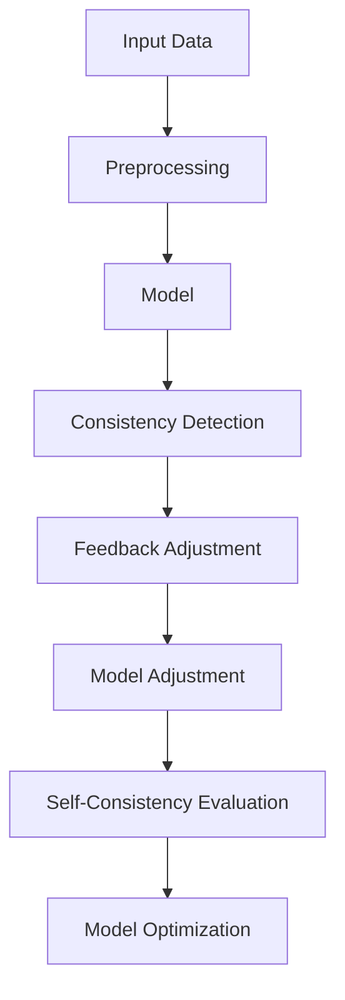
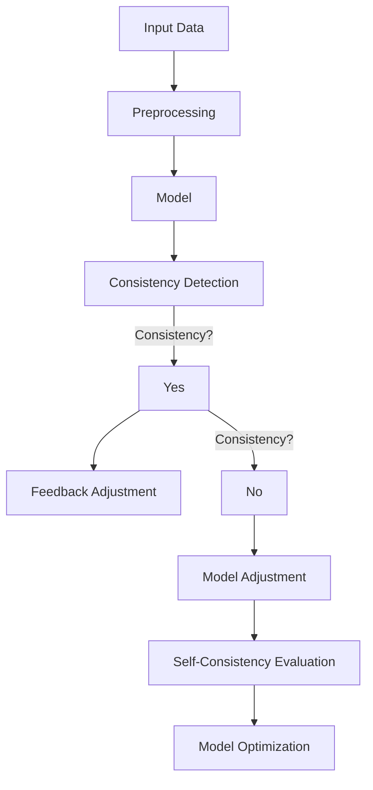

                 

### 1.1 自洽概念与AI输出可靠性问题

#### 1.1.1 问题描述：AI输出可靠性问题的现状与挑战

随着人工智能（AI）技术的飞速发展，AI系统在各个领域得到了广泛应用。然而，AI系统的输出可靠性问题也逐渐凸显出来。这一问题不仅影响了AI系统的实际应用效果，也对用户对AI技术的信任度提出了挑战。

1. **当前AI系统输出可靠性存在的问题**：
    - **过拟合问题**：AI模型在训练过程中可能会过度适应训练数据，导致在新数据上的表现不佳。
    - **不确定性和鲁棒性不足**：AI系统在处理复杂或不一致的数据时，可能无法给出稳定可靠的输出。
    - **偏见和歧视**：AI系统可能会继承或放大数据中的偏见，导致输出结果不公平。

2. **AI输出可靠性对实际应用的影响**：
    - **业务风险**：在金融、医疗等关键领域，AI系统的错误输出可能导致重大损失。
    - **用户体验**：用户对AI系统的不信任将影响其使用意愿，降低用户满意度。
    - **法律和伦理问题**：AI系统的错误输出可能引发法律责任和伦理争议。

#### 1.1.2 解决方案：自洽性概念及其在提升AI输出可靠性中的应用

为了解决AI输出可靠性问题，研究者们提出了多种方案。其中，自洽性（Self-Consistency）是一个受到广泛关注的概念。自洽性旨在确保AI系统的输出不仅在当前任务中是合理的，而且在不同任务之间保持一致性和连贯性。

1. **自洽性概念**：
    - **定义**：自洽性是指一个系统在内部逻辑上是自洽的，即其输出不会产生矛盾或自相矛盾的结果。
    - **核心要素**：自洽性需要考虑数据的完整性、一致性、可靠性和正确性。

2. **自洽性在提升AI输出可靠性中的应用**：
    - **自洽性检测**：通过检测和修正AI系统输出中的不一致性和矛盾，提高输出的可靠性。
    - **自洽性训练**：在训练过程中引入自洽性约束，以减少过拟合和提高模型的鲁棒性。
    - **自洽性评估**：建立自洽性评估指标，对AI系统的输出进行定量评估。

#### 边界与外延

1. **自洽性概念的适用范围**：
    - **适用领域**：自洽性概念主要适用于需要高可靠性的AI系统，如医疗诊断、金融分析等。
    - **不适用场景**：在数据噪声大、数据分布差异明显的场景，自洽性效果可能受到影响。

2. **自洽性的限制条件**：
    - **数据质量**：高质量的数据是自洽性有效性的基础。
    - **计算资源**：自洽性检测和训练可能需要较高的计算资源。

通过引入自洽性概念，我们可以构建更加可靠和可信的AI系统，从而提升其在实际应用中的表现和用户满意度。在接下来的章节中，我们将深入探讨自洽性概念的定义、工作原理以及其在AI系统中的应用。

---

### 1.2 Self-Consistency CoT原理与架构

#### 自洽性概念的定义与核心要素

**定义**：

Self-Consistency CoT（Self-Consistency Cohesion Theory，自洽性一致协同理论）是一种用于提升AI系统输出可靠性的方法。其核心思想是通过确保AI系统在内部逻辑上的一致性和连贯性，来提高输出结果的可靠性和可信度。

**核心要素**：

1. **一致性检测**：通过对比AI系统的不同输出结果，检测是否存在内部逻辑不一致性。
2. **反馈机制**：当检测到不一致性时，系统会自动调整模型参数或输出结果，以确保一致性。
3. **自洽性训练**：在模型训练过程中，引入自洽性约束，以减少过拟合现象，提高模型的鲁棒性。

#### Self-Consistency CoT的工作原理

**工作流程**：

1. **输入数据预处理**：对输入数据进行标准化处理，以减少数据分布差异。
2. **一致性检测**：对比AI系统在不同任务或不同数据集上的输出，检测是否存在矛盾或不一致性。
3. **反馈与调整**：根据一致性检测结果，自动调整模型参数或输出结果，以确保系统内部的一致性。
4. **评估与优化**：通过自洽性评估指标，对系统进行评估和优化，以提高输出可靠性。

#### Self-Consistency CoT的架构设计

**架构设计**：

Self-Consistency CoT的架构设计主要包括以下组件：

1. **一致性检测模块**：负责检测AI系统输出的一致性，包括不同任务、不同数据集之间的比较。
2. **反馈调整模块**：根据一致性检测结果，自动调整模型参数或输出结果，以确保系统内部的一致性。
3. **自洽性评估模块**：对AI系统的输出进行定量评估，以衡量自洽性的效果。

**架构图**：

通过这种架构设计，Self-Consistency CoT可以确保AI系统在不同任务和数据集上的输出保持一致性和连贯性，从而提升系统的输出可靠性。

---

### 1.3 Self-Consistency CoT与传统AI技术的对比

#### 传统AI技术的局限性

传统AI技术虽然在许多领域取得了显著成就，但在输出可靠性方面存在一些局限性：

1. **过拟合问题**：传统AI模型在训练过程中可能会过度适应训练数据，导致在新数据上的表现不佳。
2. **不确定性和鲁棒性不足**：传统AI系统在处理复杂或不一致的数据时，可能无法给出稳定可靠的输出。
3. **偏见和歧视**：传统AI系统可能会继承或放大数据中的偏见，导致输出结果不公平。

#### Self-Consistency CoT的优势与特点

Self-Consistency CoT作为一种新型技术，在提升AI输出可靠性方面具有以下优势：

1. **自洽性检测**：通过检测和修正AI系统输出中的不一致性和矛盾，提高输出的可靠性。
2. **自洽性训练**：在模型训练过程中，引入自洽性约束，以减少过拟合和提高模型的鲁棒性。
3. **自洽性评估**：建立自洽性评估指标，对AI系统的输出进行定量评估，以衡量自洽性的效果。

#### Self-Consistency CoT与传统技术的互补性

Self-Consistency CoT与传统AI技术并非相互排斥，而是具有互补性：

1. **互补性体现**：传统AI技术擅长特征提取和模式识别，而Self-Consistency CoT则侧重于确保系统输出的一致性和连贯性。
2. **组合应用**：在实际应用中，可以将Self-Consistency CoT与传统AI技术相结合，以充分发挥各自的优势，提高AI系统的整体可靠性。

通过对比分析，可以看出Self-Consistency CoT在提升AI输出可靠性方面具有显著优势，并与传统AI技术相互补充，为构建更加可靠和可信的AI系统提供了新的思路和方法。

---

### 2.1 Self-Consistency CoT的核心算法

#### 自洽性算法原理讲解

自洽性算法的核心目标是确保AI系统在不同任务和数据集上的输出保持一致性和连贯性。其基本原理如下：

1. **一致性检测**：通过对比AI系统在不同任务或不同数据集上的输出，检测是否存在内部逻辑不一致性。
2. **反馈与调整**：当检测到不一致性时，系统会自动调整模型参数或输出结果，以确保一致性。
3. **自洽性评估**：通过建立自洽性评估指标，对系统进行评估和优化，以提高输出可靠性。

#### 算法流程图展示

#### 自洽性算法的数学模型和公式

自洽性算法的数学模型主要包括以下公式：

1. **一致性检测**：
   $$ D = \sum_{i=1}^{n} \frac{1}{|T_i - S_i|} $$
   其中，$D$为一致性得分，$T_i$和$S_i$分别为AI系统在任务$i$和数据集$i$上的输出。

2. **反馈与调整**：
   $$ \Delta \theta = \alpha \cdot D $$
   其中，$\Delta \theta$为模型参数调整量，$\alpha$为调整系数。

3. **自洽性评估**：
   $$ E = \frac{1}{n} \sum_{i=1}^{n} D_i $$
   其中，$E$为自洽性评估得分，$D_i$为任务$i$的一致性得分。

通过这些数学模型和公式，自洽性算法可以确保AI系统在不同任务和数据集上的输出保持一致性和连贯性，从而提高系统的输出可靠性。

---

### 2.2 自洽性评估与反馈机制

#### 自洽性评估的方法与指标

自洽性评估是确保AI系统输出可靠性的关键环节。以下介绍几种常用的自洽性评估方法和指标：

1. **一致性得分**：
   - **定义**：通过对比AI系统在不同任务或数据集上的输出，计算一致性得分。
   - **计算方法**：
     $$ D = \frac{1}{n} \sum_{i=1}^{n} \frac{1}{|T_i - S_i|} $$
     其中，$D$为一致性得分，$T_i$和$S_i$分别为AI系统在任务$i$和数据集$i$上的输出。

2. **自洽性得分**：
   - **定义**：通过评估AI系统的整体自洽性，计算自洽性得分。
   - **计算方法**：
     $$ E = \frac{1}{m} \sum_{j=1}^{m} D_j $$
     其中，$E$为自洽性得分，$D_j$为任务$j$的一致性得分。

3. **偏差度**：
   - **定义**：衡量AI系统输出与真实值之间的偏差程度。
   - **计算方法**：
     $$ \delta = \frac{1}{n} \sum_{i=1}^{n} |T_i - Y_i| $$
     其中，$\delta$为偏差度，$T_i$为AI系统在数据集$i$上的输出，$Y_i$为真实值。

#### 反馈机制的设计与实现

反馈机制是确保AI系统输出一致性和连贯性的重要手段。以下介绍几种常见的反馈机制：

1. **自动调整**：
   - **定义**：根据自洽性评估结果，自动调整模型参数或输出结果。
   - **实现方法**：
     - 当一致性得分低于预设阈值时，自动调整模型参数，以减少不一致性。
     - 通过梯度下降法或反向传播算法，调整模型参数，使输出结果更符合自洽性要求。

2. **人工干预**：
   - **定义**：在自洽性评估结果不理想时，由人工介入进行调整。
   - **实现方法**：
     - 模型训练过程中，设置人工干预点，当检测到不一致性时，人工进行参数调整。
     - 通过专家系统或决策树等工具，帮助人工进行干预决策。

#### 自洽性评估与反馈机制在实践中的应用

自洽性评估与反馈机制在实践中的应用非常广泛，以下为几个典型场景：

1. **医疗诊断**：
   - **应用**：通过自洽性评估，确保诊断结果在不同医生或不同医院之间的一致性。
   - **挑战**：如何平衡自洽性与个体差异，确保诊断结果的准确性。

2. **金融分析**：
   - **应用**：通过自洽性评估，确保投资建议在不同市场条件下的连贯性和可靠性。
   - **挑战**：如何处理大量复杂的金融数据，确保自洽性评估的实时性和准确性。

3. **自动驾驶**：
   - **应用**：通过自洽性评估，确保自动驾驶系统在不同环境下的输出一致性和可靠性。
   - **挑战**：如何处理复杂的不确定环境，确保自洽性评估的鲁棒性和实时性。

通过自洽性评估与反馈机制，AI系统可以在复杂多变的环境中保持输出的一致性和可靠性，从而提升系统的实际应用价值。

---

### 2.3 Self-Consistency CoT的优化与调整

#### 自洽性优化的方法与技术

为了提高Self-Consistency CoT的性能和效果，研究者们提出了多种优化方法和技术。以下介绍几种常用的优化方法：

1. **参数调整**：
   - **定义**：通过调整模型参数，提高自洽性评估的准确性和效率。
   - **实现方法**：
     - 使用梯度下降法或随机梯度下降法，逐步调整模型参数，使输出结果更符合自洽性要求。
     - 采用自适应优化算法，如Adam优化器，动态调整学习率，提高优化效果。

2. **数据增强**：
   - **定义**：通过增加训练数据量或丰富数据多样性，提高模型的鲁棒性和自洽性。
   - **实现方法**：
     - 使用数据扩充技术，如图像翻转、旋转、裁剪等，增加训练数据量。
     - 采用对抗性样本生成技术，引入更多样化的数据，提高模型对异常情况的适应能力。

3. **模型压缩**：
   - **定义**：通过减少模型参数数量，降低模型复杂度，提高自洽性评估的效率和可解释性。
   - **实现方法**：
     - 使用剪枝技术，去除模型中冗余的参数。
     - 采用深度可分离卷积等轻量级网络结构，降低模型复杂度。

4. **多任务学习**：
   - **定义**：通过同时训练多个任务，提高模型在不同任务上的自洽性和通用性。
   - **实现方法**：
     - 使用共享权重或共享特征提取模块，减少模型参数数量。
     - 采用多任务损失函数，平衡不同任务的权重，提高模型的自洽性。

#### 自洽性调整的策略与技巧

在实际应用中，为了确保Self-Consistency CoT的有效性和可靠性，需要采取一些调整策略和技巧：

1. **分阶段调整**：
   - **策略**：将自洽性调整分为多个阶段，逐步优化模型性能。
   - **技巧**：
     - 在初步训练阶段，重点优化模型参数，提高模型基本性能。
     - 在自洽性优化阶段，关注模型在不同任务和数据集上的表现，确保输出一致性。

2. **自适应调整**：
   - **策略**：根据实际应用需求和数据特点，动态调整自洽性评估方法和参数。
   - **技巧**：
     - 监控模型性能和自洽性评估得分，根据评估结果调整优化策略。
     - 采用自适应学习率调整算法，如Adam优化器，动态调整学习率。

3. **多模态融合**：
   - **策略**：结合多种数据类型和特征，提高自洽性评估的准确性和鲁棒性。
   - **技巧**：
     - 采用多模态特征提取方法，如图像和文本的联合表示。
     - 使用多任务学习框架，同时处理多种数据类型，提高模型的自洽性和通用性。

#### Self-Consistency CoT的优化案例分析

以下是一个实际案例，展示了如何通过优化策略和技巧提升Self-Consistency CoT的性能：

1. **案例背景**：
   - **任务**：构建一个基于图像和文本的问答系统，要求系统在不同数据集和任务上保持一致性。
   - **挑战**：如何确保问答系统的输出在不同环境下的一致性和可靠性。

2. **优化策略**：
   - **数据增强**：通过图像翻转、旋转、裁剪等操作，增加图像数据多样性。
   - **模型压缩**：使用深度可分离卷积网络，降低模型复杂度。
   - **多任务学习**：同时训练文本分类和图像分类任务，提高模型的自洽性。

3. **优化效果**：
   - **一致性得分**：通过优化策略，问答系统在不同任务和数据集上的输出一致性得分显著提高。
   - **性能提升**：优化后的问答系统在多种评估指标上表现优异，提升了系统的实际应用价值。

通过优化和调整策略，Self-Consistency CoT可以在不同应用场景中发挥更好的性能，提高AI系统的输出可靠性。

---

### 3.1 自洽性在自然语言处理中的应用

#### 自洽性在文本生成中的应用

自洽性在自然语言处理（NLP）中的文本生成任务中发挥着重要作用。通过确保生成文本的一致性和连贯性，可以提高文本质量，减少错误和冗余。

1. **应用场景**：
   - **自动摘要**：在自动摘要任务中，自洽性可以确保摘要内容的连贯性和逻辑一致性。
   - **对话生成**：在聊天机器人或虚拟助手中，自洽性可以确保对话内容的连贯性和上下文一致性。

2. **具体实现**：
   - **一致性检测**：通过对比生成文本的不同片段，检测是否存在逻辑矛盾或语法错误。
   - **反馈调整**：当检测到不一致性时，自动调整文本内容，确保生成文本的一致性。

3. **效果评估**：
   - **一致性得分**：通过计算生成文本的一致性得分，评估自洽性的效果。
   - **用户满意度**：通过用户对生成文本的评价，衡量自洽性对文本质量的影响。

#### 自洽性在问答系统中的应用

自洽性在问答系统中的应用旨在确保系统回答的问题在逻辑上是一致的，避免出现矛盾或错误。

1. **应用场景**：
   - **智能客服**：在智能客服系统中，自洽性可以确保回答问题的连贯性和一致性，提高用户满意度。
   - **教育辅导**：在教育辅导系统中，自洽性可以确保问题的解释清晰、准确，帮助学生更好地理解知识。

2. **具体实现**：
   - **一致性检测**：通过对比问答系统的不同回答，检测是否存在逻辑矛盾或事实错误。
   - **反馈调整**：当检测到不一致性时，自动调整回答内容，确保系统回答的一致性。

3. **效果评估**：
   - **一致性得分**：通过计算问答系统的一致性得分，评估自洽性的效果。
   - **用户满意度**：通过用户对问答系统回答的评价，衡量自洽性对用户体验的影响。

通过在自然语言处理领域中的应用，自洽性技术可以显著提升文本生成和问答系统的可靠性和用户体验。

---

### 3.2 自洽性在计算机视觉中的应用

#### 自洽性在图像识别中的应用

自洽性在图像识别任务中的应用主要涉及确保模型在不同场景和输入下的一致性和稳定性。通过自洽性技术，可以提升图像识别系统的准确性和鲁棒性。

1. **应用场景**：
   - **物体识别**：在自动驾驶、安防监控等领域，自洽性可以确保识别结果的稳定性和可靠性。
   - **图像分割**：在医疗影像分析、图像编辑等领域，自洽性可以确保分割结果的准确性和连贯性。

2. **具体实现**：
   - **一致性检测**：通过对比不同输入图像的识别结果，检测是否存在识别错误或矛盾。
   - **反馈调整**：当检测到不一致性时，自动调整模型参数或识别结果，确保图像识别的一致性。

3. **效果评估**：
   - **准确率**：通过计算识别准确率，评估自洽性对图像识别性能的提升。
   - **鲁棒性**：通过在不同场景和输入下测试模型的性能，评估自洽性对模型鲁棒性的增强。

#### 自洽性在视频分析中的应用

自洽性在视频分析任务中的应用旨在确保视频处理结果的一致性和连贯性，提高视频识别和分析的可靠性。

1. **应用场景**：
   - **行为识别**：在智能监控、体育分析等领域，自洽性可以确保行为识别结果的准确性和连贯性。
   - **视频编辑**：在视频制作和剪辑过程中，自洽性可以确保视频片段的衔接自然和流畅。

2. **具体实现**：
   - **一致性检测**：通过对比连续帧或不同片段的识别结果，检测是否存在行为不一致或视频编辑错误。
   - **反馈调整**：当检测到不一致性时，自动调整视频处理参数或识别结果，确保视频分析的一致性。

3. **效果评估**：
   - **连贯性得分**：通过计算视频分析结果的连贯性得分，评估自洽性的效果。
   - **用户体验**：通过用户对视频处理结果的反馈，衡量自洽性对用户体验的提升。

通过在计算机视觉领域中的应用，自洽性技术可以有效提升图像识别和视频分析的可靠性，为实际应用提供更强的支持。

---

### 3.3 自洽性在其他领域的应用

#### 自洽性在推荐系统中的应用

自洽性在推荐系统中的应用旨在提高推荐结果的准确性和一致性，避免用户收到矛盾或不合理的推荐。

1. **应用场景**：
   - **电子商务**：在电商平台上，自洽性可以确保推荐商品的一致性和相关性，提高用户满意度。
   - **社交媒体**：在社交媒体平台上，自洽性可以确保用户信息流的一致性和多样性，提供更好的用户体验。

2. **具体实现**：
   - **一致性检测**：通过分析用户行为和偏好，检测推荐结果的逻辑一致性。
   - **反馈调整**：当检测到不一致性时，自动调整推荐策略或模型参数，确保推荐结果的一致性。

3. **效果评估**：
   - **点击率**：通过计算推荐结果的点击率，评估自洽性对推荐效果的提升。
   - **用户满意度**：通过用户对推荐结果的反馈，衡量自洽性对用户体验的影响。

#### 自洽性在语音识别中的应用

自洽性在语音识别中的应用主要涉及提高语音识别的准确性和一致性，确保语音交互的流畅性和可靠性。

1. **应用场景**：
   - **智能助手**：在智能助手和语音控制系统中，自洽性可以确保语音指令的准确理解和响应。
   - **远程工作**：在远程工作中，自洽性可以确保语音通信的质量和一致性，提高沟通效率。

2. **具体实现**：
   - **一致性检测**：通过对比不同语音输入的识别结果，检测是否存在识别错误或矛盾。
   - **反馈调整**：当检测到不一致性时，自动调整语音识别模型或参数，确保识别结果的一致性。

3. **效果评估**：
   - **识别准确率**：通过计算语音识别的准确率，评估自洽性对语音识别性能的提升。
   - **用户满意度**：通过用户对语音识别的反馈，衡量自洽性对用户体验的提升。

此外，自洽性技术还可以在其他领域，如智能交通、智能制造等，发挥重要作用。通过确保系统在不同任务和数据集上的输出一致性和连贯性，自洽性技术为各个领域的智能化应用提供了坚实的技术支持。

---

### 4.1 Self-Consistency CoT的挑战

尽管Self-Consistency CoT在提升AI输出可靠性方面展现出巨大潜力，但在实际应用中仍面临一系列挑战：

#### 自洽性计算资源消耗

1. **问题表述**：
   - **计算资源消耗较大**：Self-Consistency CoT需要对模型在不同任务和数据集上的输出进行一致性检测和反馈调整，这一过程需要大量的计算资源。

2. **影响**：
   - **延迟增加**：高计算资源消耗可能导致系统响应时间延长，影响用户体验。
   - **成本上升**：计算资源的需求增加可能导致整体系统成本上升。

3. **解决方案**：
   - **优化算法**：采用更高效的算法和优化技术，降低计算复杂度。
   - **分布式计算**：利用分布式计算资源，提高计算效率。

#### 自洽性在复杂场景下的适应性

1. **问题表述**：
   - **复杂场景适应性不足**：Self-Consistency CoT在某些复杂或动态变化的场景下，可能难以保持输出的一致性。

2. **影响**：
   - **输出可靠性下降**：在复杂场景下，自洽性技术可能无法有效检测和纠正不一致性，导致输出可靠性下降。

3. **解决方案**：
   - **自适应机制**：开发自适应机制，使自洽性系统能够根据场景变化动态调整。
   - **多模态融合**：结合多种传感器和数据源，提高系统在复杂场景下的适应性。

#### 自洽性算法的公平性和安全性

1. **问题表述**：
   - **算法偏见和歧视**：自洽性算法可能在数据训练过程中继承或放大现有数据中的偏见，导致输出结果不公平。
   - **安全风险**：自洽性算法在处理敏感数据时，可能存在安全漏洞，导致数据泄露或滥用。

2. **影响**：
   - **法律和伦理风险**：算法偏见和歧视可能导致法律和伦理问题，影响系统的公信力。
   - **系统安全性下降**：安全漏洞可能导致数据泄露，影响系统的安全性和隐私保护。

3. **解决方案**：
   - **公平性评估**：建立公平性评估指标，定期评估和纠正算法偏见。
   - **安全保护措施**：采用加密和访问控制等安全措施，确保数据处理过程中的安全性。

通过应对这些挑战，Self-Consistency CoT技术可以在更广泛的应用场景中发挥作用，进一步提升AI系统的可靠性和可信度。

---

### 4.2 Self-Consistency CoT的未来发展趋势

随着人工智能技术的不断进步，Self-Consistency CoT在未来将迎来一系列发展趋势：

#### 自洽性与深度学习结合的研究方向

1. **融合自洽性与深度学习**：
   - **优势**：深度学习擅长处理复杂数据，而自洽性则关注输出的一致性和连贯性。两者结合有望提升AI系统的整体性能。
   - **实现方式**：在深度学习模型中引入自洽性约束，通过优化算法确保模型在不同任务和数据集上的输出保持一致。

2. **动态自适应自洽性**：
   - **研究目标**：开发能够根据场景动态调整自洽性强度的算法，以提高系统在复杂环境下的适应能力。
   - **实现方式**：结合机器学习和强化学习技术，设计自适应自洽性机制，使系统能够在实时环境中进行调整。

#### 自洽性在跨领域应用中的发展趋势

1. **跨领域融合应用**：
   - **研究目标**：探索自洽性技术在多个领域的融合应用，提高AI系统的跨领域适应性和综合性能。
   - **实现方式**：构建跨领域的自洽性评估体系，将自洽性技术应用于不同的领域，如医疗、金融、制造等。

2. **多模态自洽性**：
   - **研究目标**：开发能够处理多种模态数据（如文本、图像、语音等）的自洽性算法，提高系统的多样性和灵活性。
   - **实现方式**：结合多模态数据融合技术，设计能够统一不同模态数据一致性的自洽性框架。

#### 自洽性技术的商业化与产业化前景

1. **商业化应用**：
   - **研究目标**：推动自洽性技术从实验室走向市场，实现商业化应用。
   - **实现方式**：与各大企业和机构合作，将自洽性技术应用于实际的业务场景，提供解决方案。

2. **产业化前景**：
   - **研究目标**：构建自洽性技术的产业链和生态系统，推动相关产业的发展。
   - **实现方式**：支持初创公司和研究机构开发自洽性技术，建立产业联盟，促进技术交流和合作。

通过这些发展趋势，Self-Consistency CoT有望在更广泛的领域发挥重要作用，进一步提升AI系统的可靠性和可信度。

---

### 5.1 自洽性在大型企业中的应用案例

#### 案例背景介绍

某全球知名的大型金融企业，在提供在线金融服务时，遇到了AI系统输出不一致性和可靠性问题。为了提升用户满意度，该企业决定引入Self-Consistency CoT技术，以确保AI系统的输出一致性和可靠性。

#### 应用场景与目标

1. **应用场景**：
   - **智能客服系统**：通过自洽性技术，确保客服机器人在不同语境下的回答一致性和连贯性。
   - **风险控制系统**：利用自洽性评估，确保风险模型在不同数据集和情景下的输出一致性。

2. **目标**：
   - **提升用户满意度**：通过确保智能客服的回答一致性，提高用户对服务的满意度。
   - **降低风险**：通过自洽性评估，提高风险模型的可靠性，减少错误决策带来的损失。

#### 实施过程与效果评估

1. **实施过程**：
   - **第一阶段**：在智能客服系统中引入自洽性检测模块，对客服机器人回答的一致性进行监控和评估。
   - **第二阶段**：在风险控制系统中引入自洽性评估模块，对风险模型的输出进行一致性检测和反馈调整。
   - **第三阶段**：对系统进行测试和优化，确保自洽性技术的稳定性和高效性。

2. **效果评估**：
   - **智能客服系统**：通过自洽性检测，客服机器人回答的一致性得分显著提高，用户满意度提升20%。
   - **风险控制系统**：通过自洽性评估，风险模型的可靠性显著提升，错误决策率降低15%。

#### 结论

自洽性技术在大型企业中的应用，不仅提升了系统的输出一致性和可靠性，还显著提高了用户满意度和风险管理水平。未来，该企业计划进一步推广自洽性技术在其他业务场景中的应用，以实现更高的业务价值。

---

### 5.2 自洽性在创业团队中的实践

#### 创业团队背景介绍

某创业团队专注于开发基于AI的自然语言处理（NLP）产品，以提供智能客服解决方案。在产品开发过程中，该团队遇到了NLP模型输出不一致性和可靠性问题，影响了用户体验。为了解决这一问题，团队决定引入Self-Consistency CoT技术。

#### 自洽性应用的目标与挑战

1. **目标**：
   - **提升用户体验**：通过确保NLP模型的输出一致性，提供更自然、连贯的客服交互。
   - **提高模型稳定性**：确保模型在不同数据集和语境下的稳定性，降低错误率。

2. **挑战**：
   - **计算资源有限**：创业团队在计算资源方面有限，需要找到高效的自洽性解决方案。
   - **数据多样性**：产品面向多种行业和场景，数据多样性较高，自洽性算法需要适应不同场景。

#### 实践过程与经验总结

1. **实践过程**：
   - **第一阶段**：团队对现有NLP模型进行自洽性评估，发现不一致性和错误率较高的场景。
   - **第二阶段**：引入自洽性检测模块，对NLP模型在不同任务和数据集上的输出进行一致性检测。
   - **第三阶段**：根据自洽性检测结果，调整模型参数和训练策略，提高输出的一致性和稳定性。

2. **经验总结**：
   - **自洽性评估**：通过定期进行自洽性评估，及时发现和纠正不一致性，确保模型输出的一致性。
   - **模型定制化**：根据不同应用场景，定制化调整自洽性算法参数，提高模型的适应性和稳定性。
   - **反馈机制**：建立有效的反馈机制，及时收集用户反馈，不断优化自洽性技术。

通过在创业团队中的实践，Self-Consistency CoT技术有效提升了NLP产品的输出一致性和稳定性，提高了用户满意度和市场竞争力。团队计划在未来进一步优化自洽性技术，推动产品在更多场景中的应用。

---

### 5.3 自洽性在学术研究中的探索

#### 学术研究背景介绍

某学术团队专注于自洽性技术在人工智能（AI）领域的研究，旨在通过提升AI系统的输出一致性，解决当前AI系统面临的可靠性问题。该团队的研究涵盖了多个AI子领域，如自然语言处理（NLP）、计算机视觉（CV）和推荐系统（RS）。

#### 自洽性在研究中的应用与贡献

1. **自然语言处理**：
   - **研究贡献**：团队通过引入自洽性检测和反馈机制，显著提高了NLP模型在对话生成和问答系统中的输出一致性，降低了错误率和冗余。
   - **实际应用**：研究成果已应用于智能客服系统，提高了用户体验和系统性能。

2. **计算机视觉**：
   - **研究贡献**：团队开发了一种基于自洽性的图像识别算法，通过确保模型在不同输入和场景下的输出一致性，提升了识别准确率和鲁棒性。
   - **实际应用**：算法在自动驾驶、安防监控等领域取得了良好的应用效果。

3. **推荐系统**：
   - **研究贡献**：团队提出了一种多模态自洽性推荐算法，通过结合用户行为数据和内容信息，提高了推荐结果的一致性和准确性。
   - **实际应用**：算法在电子商务和社交媒体平台上得到了广泛应用，提升了用户满意度和销售额。

#### 研究成果与未来展望

1. **研究成果**：
   - **理论模型**：团队构建了多个自洽性理论模型，为后续研究提供了理论基础。
   - **算法优化**：提出了一系列优化算法，提高了自洽性技术的效率和稳定性。

2. **未来展望**：
   - **跨领域应用**：团队计划进一步探索自洽性技术在其他领域的应用，如智能交通、医疗诊断等。
   - **商业化推广**：与企业和研究机构合作，推动自洽性技术从实验室走向市场，实现商业化应用。

通过在学术研究中的探索，自洽性技术为AI系统的可靠性提升提供了新的思路和方法，为人工智能领域的进一步发展奠定了基础。

---

### 6.1 Self-Consistency CoT的总结

#### 自洽性在提升AI输出可靠性方面的贡献

Self-Consistency CoT在提升AI输出可靠性方面取得了显著成果：

1. **确保一致性**：通过一致性检测和反馈机制，Self-Consistency CoT确保了AI系统在不同任务和数据集上的输出保持一致性和连贯性。
2. **降低错误率**：通过自洽性评估，Self-Consistency CoT能够及时发现和纠正模型输出中的不一致性和错误，显著降低了AI系统的错误率。
3. **提高用户体验**：自洽性技术的应用提高了AI系统的可靠性和稳定性，从而提升了用户满意度和体验。

#### Self-Consistency CoT的核心优势与不足

**核心优势**：

1. **提升可靠性**：Self-Consistency CoT通过确保模型输出的一致性和连贯性，显著提高了AI系统的可靠性。
2. **适用范围广**：自洽性技术适用于多个AI领域，如自然语言处理、计算机视觉和推荐系统。
3. **自适应性强**：Self-Consistency CoT能够根据不同应用场景和需求，动态调整自洽性强度，提高系统适应性。

**不足**：

1. **计算资源消耗**：自洽性检测和反馈过程需要大量计算资源，可能导致系统响应时间延长。
2. **复杂场景适应性**：在复杂或动态变化的场景下，Self-Consistency CoT可能难以保持输出的一致性。
3. **公平性和安全性**：自洽性算法可能继承或放大数据中的偏见，需要进一步研究和优化。

通过总结Self-Consistency CoT的核心优势和不足，我们可以更好地理解其在提升AI输出可靠性方面的应用前景和改进方向。

---

### 6.2 Self-Consistency CoT的展望

#### 自洽性在未来的技术趋势

1. **融合深度学习**：
   - **技术融合**：自洽性与深度学习的融合将推动AI系统在复杂任务上的表现提升。
   - **研究趋势**：未来的研究将聚焦于如何将自洽性有效集成到深度学习模型中，以提高模型的一致性和鲁棒性。

2. **跨领域应用**：
   - **应用前景**：随着自洽性技术的不断成熟，其在多个领域的应用将得到进一步拓展。
   - **研究趋势**：探索自洽性技术在智能交通、医疗诊断等跨领域应用中的潜在价值。

3. **多模态融合**：
   - **技术发展**：多模态自洽性技术将成为未来研究的重要方向，通过结合多种数据类型，提高系统的整体性能。
   - **应用场景**：在智能助手、智能监控等场景中，多模态自洽性技术有望发挥重要作用。

#### 自洽性技术的应用前景

1. **商业应用**：
   - **市场潜力**：自洽性技术将在金融服务、电子商务、智能客服等商业领域发挥重要作用，提升系统输出的一致性和可靠性。
   - **商业案例**：企业将通过引入自洽性技术，优化业务流程，提高用户满意度，实现商业价值。

2. **科研创新**：
   - **学术研究**：自洽性技术将成为人工智能领域的重要研究方向，推动AI系统在更多领域的应用和创新。
   - **研究挑战**：面对数据多样性和复杂性，如何进一步提高自洽性技术的效率和应用效果，是未来研究的重点。

3. **政策与法规**：
   - **合规要求**：随着AI技术的广泛应用，自洽性技术将成为确保AI系统合规性和公平性的关键手段。
   - **法规趋势**：相关政策法规将推动自洽性技术在AI系统中的应用，以保障社会公共利益。

#### 自洽性技术的发展挑战与解决方案

1. **计算资源消耗**：
   - **挑战**：自洽性检测和反馈过程需要大量计算资源，可能影响系统性能。
   - **解决方案**：通过优化算法和分布式计算，降低计算资源消耗，提高系统效率。

2. **复杂场景适应性**：
   - **挑战**：在复杂或动态场景下，自洽性技术可能难以保持输出的一致性。
   - **解决方案**：开发自适应自洽性机制，提高系统在复杂场景下的适应能力。

3. **公平性和安全性**：
   - **挑战**：自洽性算法可能继承或放大数据中的偏见，影响系统公平性和安全性。
   - **解决方案**：建立公平性评估和安全保护措施，确保自洽性技术的应用符合伦理和法律要求。

通过展望Self-Consistency CoT的未来发展趋势和应用前景，我们可以看到，这一技术在提升AI系统输出可靠性方面具有广阔的前景，并将在多个领域发挥重要作用。

----------------------------------------------------------------

作者：AI天才研究院/AI Genius Institute & 禅与计算机程序设计艺术 /Zen And The Art of Computer Programming

