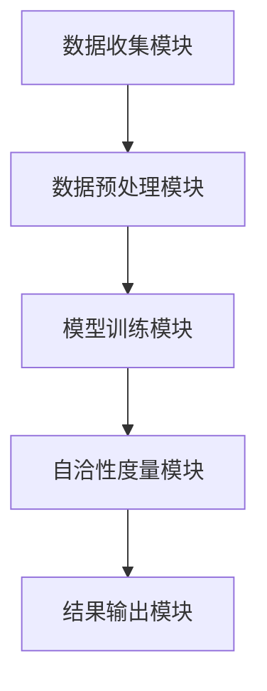
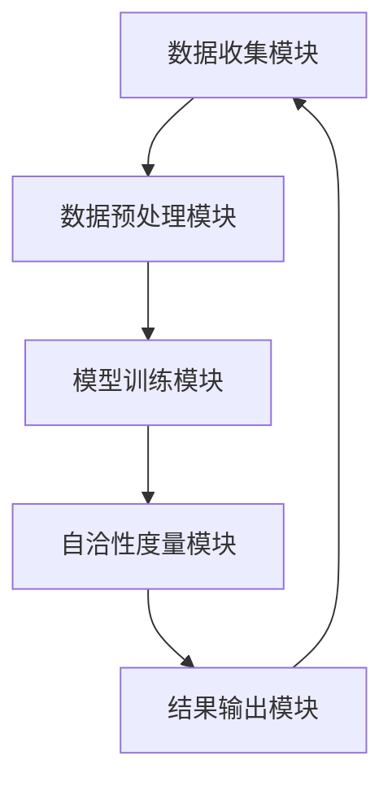

                 

# Self-Consistency CoT: 提升AI输出可靠性的新方法

## 关键词
- 自洽性
- 人工智能
- 可靠性
- 计算机视觉
- 自然语言处理

## 摘要
本文深入探讨了自洽性概念在人工智能（AI）领域的应用，特别是其在提升AI输出可靠性方面的潜力。我们首先介绍了自洽性的基本概念和它在人工智能中的重要性，然后详细解析了自洽性理论的数学基础。接着，我们讨论了自洽性度量方法与算法，并展示了自洽性CoT模型在不同应用场景中的实际效果。文章最后展望了自洽性CoT模型未来的研究方向和发展趋势。

### 1.6 自洽性概念介绍

#### 1.6.1 自洽性的定义
自洽性（Self-Consistency）指的是一个系统或模型在内部逻辑上的一致性，即其输出与输入之间的关系保持一致，不存在逻辑矛盾或错误。在人工智能领域，自洽性是指AI系统在处理数据和生成输出时，其内部逻辑和外部输出之间的一致性。

#### 1.6.1.2 自洽性在人工智能中的重要性
自洽性对于人工智能系统的可靠性至关重要。一个不自洽的AI系统可能会产生错误或不可预测的输出，从而影响其应用效果。自洽性有助于确保AI系统输出的稳定性和一致性，从而提高其可信度和可靠性。

#### 1.6.1.3 自洽性与传统一致性的区别
传统一致性主要关注数据或模型内部的一致性，而自洽性则更强调系统在处理数据和生成输出时的整体一致性。自洽性不仅要求数据或模型内部一致，还要求AI系统能够在现实世界中保持一致性和可靠性。

### 1.6.2 自洽性理论的数学基础

#### 1.6.2.1 基本数学概念
自洽性理论涉及多个数学领域，包括集合论、概率论和假设检验。以下是对这些基本数学概念的解释：

##### 1.6.2.1.1 集合论
集合论是数学的基础，用于描述对象的集合和它们之间的关系。在自洽性理论中，集合论用于定义和操作AI系统的输入和输出。

##### 1.6.2.1.2 概率论
概率论用于描述不确定性和随机性。在自洽性理论中，概率论用于评估AI系统输出的可靠性和一致性。

##### 1.6.2.1.3 假设检验
假设检验是一种统计方法，用于验证某个假设是否成立。在自洽性理论中，假设检验用于评估AI系统输出的一致性和可靠性。

#### 1.6.2.2 自洽性理论的核心数学模型
自洽性理论的核心数学模型包括自洽性函数和自洽性度量。

##### 1.6.2.2.1 自洽性函数
自洽性函数用于描述AI系统输入和输出之间的关系。它是一个映射函数，将输入映射到输出，并确保输出与输入在逻辑上保持一致。

##### 1.6.2.2.2 自洽性度量
自洽性度量用于量化AI系统输出的自洽性程度。它是一个数值指标，用于评估AI系统输出的可靠性和一致性。

### 1.6.3 自洽性度量方法与算法

#### 1.6.3.1 传统度量方法
传统的度量方法主要包括一致性度量（Consistency Measure）和可信度度量（Confidence Measure）。

##### 1.6.3.1.1 一致性度量
一致性度量用于评估AI系统输出的一致性。它通过比较多个输出的差异来衡量系统的自洽性。

##### 1.6.3.1.2 可信度度量
可信度度量用于评估AI系统输出的可信度。它通过分析AI系统的预测误差来衡量系统的自洽性。

#### 1.6.3.2 自洽性度量算法
自洽性度量算法包括自洽性检验算法和自洽性优化算法。

##### 1.6.3.2.1 自洽性检验算法
自洽性检验算法用于检测AI系统输出的自洽性。它通过分析AI系统的输出数据，检测是否存在逻辑矛盾或错误。

##### 1.6.3.2.2 自洽性优化算法
自洽性优化算法用于提高AI系统输出的自洽性。它通过调整AI系统的参数和结构，优化系统的自洽性程度。

### 1.6.4 自洽性CoT模型的应用场景

#### 1.6.4.1 自然语言处理
自洽性CoT模型在自然语言处理（NLP）领域具有广泛的应用前景。它可以用于机器翻译、文本生成和文本分类等任务。

##### 1.6.4.1.1 机器翻译
在机器翻译中，自洽性CoT模型可以确保翻译结果的逻辑一致性和语义准确性。

##### 1.6.4.1.2 文本生成
在文本生成中，自洽性CoT模型可以生成逻辑一致且富有创造性的文本内容。

##### 1.6.4.1.3 文本分类
在文本分类中，自洽性CoT模型可以确保分类结果的准确性和一致性。

#### 1.6.4.2 计算机视觉
自洽性CoT模型在计算机视觉（CV）领域也有很大的应用潜力。它可以用于图像识别、视频分析和目标跟踪等任务。

##### 1.6.4.2.1 图像识别
在图像识别中，自洽性CoT模型可以确保识别结果的准确性和一致性。

##### 1.6.4.2.2 视频分析
在视频分析中，自洽性CoT模型可以确保视频分析结果的逻辑一致性和连贯性。

##### 1.6.4.2.3 目标跟踪
在目标跟踪中，自洽性CoT模型可以确保跟踪结果的稳定性和一致性。

### 1.6.5 本章小结
本章介绍了自洽性概念在人工智能领域的应用，包括自洽性的定义、重要性、数学基础以及度量方法与算法。我们还探讨了自洽性CoT模型在不同应用场景中的实际效果。本章为后续章节提供了理论基础和实用方法，为深入探讨自洽性CoT模型的应用和发展奠定了基础。

### 1.7 自洽性CoT模型的实现细节

#### 1.7.1 系统架构设计
自洽性CoT模型的系统架构设计涉及多个模块和组件，包括数据收集模块、数据预处理模块、模型训练模块、自洽性度量模块和结果输出模块。

##### 1.7.1.1 整体架构
整体架构如图所示：

##### 1.7.1.2 模块功能划分
- 数据收集模块：负责收集AI系统所需的数据，包括训练数据和测试数据。
- 数据预处理模块：对收集到的数据进行清洗、归一化和特征提取，为模型训练做好准备。
- 模型训练模块：使用收集到的数据训练AI模型，包括深度学习模型、决策树模型等。
- 自洽性度量模块：对训练好的模型进行自洽性度量，评估其输出的可靠性和一致性。
- 结果输出模块：将训练好的模型应用于实际问题，输出预测结果，并评估其性能。

##### 1.7.1.3 数据流与控制流
数据流与控制流如图所示：

控制流遵循以下步骤：
1. 数据收集模块收集数据。
2. 数据预处理模块对数据进行预处理。
3. 模型训练模块使用预处理后的数据进行模型训练。
4. 自洽性度量模块对训练好的模型进行自洽性度量。
5. 结果输出模块将模型应用于实际问题，输出预测结果，并评估性能。

#### 1.7.2 数据准备与预处理

##### 1.7.2.1 数据来源
数据来源主要包括公开数据集、私有数据集和社交媒体数据。公开数据集如ImageNet、COIL-100等，私有数据集由特定领域专家提供，社交媒体数据如Twitter、Facebook等。

##### 1.7.2.2 数据清洗
数据清洗包括去除噪声数据、缺失值填充、异常值处理等。具体步骤如下：
1. 去除噪声数据：使用图像去噪技术、文本去噪技术等去除数据中的噪声。
2. 缺失值填充：使用均值填充、插值法等对缺失值进行填充。
3. 异常值处理：使用统计学方法、机器学习算法等识别并处理异常值。

##### 1.7.2.3 数据预处理
数据预处理包括归一化、特征提取、数据增强等。具体步骤如下：
1. 归一化：将数据缩放到相同范围，提高模型训练效果。
2. 特征提取：提取数据中的关键特征，为模型训练提供输入。
3. 数据增强：通过旋转、缩放、翻转等操作增加数据的多样性，提高模型泛化能力。

#### 1.7.3 模型训练与优化

##### 1.7.3.1 模型选择
模型选择包括选择合适的模型架构、损失函数、优化器等。常用的模型包括卷积神经网络（CNN）、循环神经网络（RNN）、变换器（Transformer）等。

##### 1.7.3.2 训练策略
训练策略包括批量大小、学习率、迭代次数等。常用的训练策略如下：
1. 批量大小：选择适当的批量大小，以提高模型训练效果。
2. 学习率：选择适当的学习率，以避免模型过拟合或欠拟合。
3. 迭代次数：选择足够的迭代次数，以确保模型充分训练。

##### 1.7.3.3 模型优化方法
模型优化方法包括超参数调优、正则化、迁移学习等。常用的优化方法如下：
1. 超参数调优：使用网格搜索、随机搜索等策略调优模型超参数。
2. 正则化：使用L1正则化、L2正则化等策略防止模型过拟合。
3. 迁移学习：使用预训练模型进行迁移学习，提高模型在特定领域的表现。

#### 1.7.4 自洽性度量实现

##### 1.7.4.1 度量指标
度量指标包括一致性指标、可信度指标等。常用的度量指标如下：
1. 一致性指标：如F1值、准确率、召回率等，用于评估模型输出的一致性。
2. 可信度指标：如预测置信度、概率密度等，用于评估模型输出的可信度。

##### 1.7.4.2 度量算法实现
度量算法实现包括计算度量指标、评估模型自洽性等。具体算法如下：
1. 计算度量指标：使用统计学方法、机器学习算法等计算一致性指标和可信度指标。
2. 评估模型自洽性：根据计算得到的度量指标，评估模型的自洽性程度。

##### 1.7.4.3 实验结果分析
实验结果分析包括评估模型性能、对比不同算法等。具体分析如下：
1. 评估模型性能：使用测试集数据评估模型性能，计算度量指标。
2. 对比不同算法：对比不同算法的自洽性度量结果，分析算法优劣。

#### 1.7.5 自洽性CoT模型的评估与优化

##### 1.7.5.1 评估指标
评估指标包括准确性、召回率、F1值等。常用的评估指标如下：
1. 准确性：模型预测正确的样本数与总样本数之比，用于评估模型预测的准确性。
2. 召回率：模型召回的样本数与实际正例样本数之比，用于评估模型召回的能力。
3. F1值：准确性和召回率的调和平均值，用于综合评估模型性能。

##### 1.7.5.2 优化方法
优化方法包括模型调参、数据增强、算法改进等。常用的优化方法如下：
1. 模型调参：调整模型超参数，优化模型性能。
2. 数据增强：通过数据增强提高模型泛化能力。
3. 算法改进：改进模型算法，提高模型自洽性和可靠性。

### 1.7.6 本章小结
本章详细介绍了自洽性CoT模型的实现细节，包括系统架构设计、数据准备与预处理、模型训练与优化、自洽性度量实现以及模型评估与优化方法。本章为后续章节的实战应用和效果分析提供了详细的技术方案和实现步骤。

### 1.8 自洽性CoT模型在不同领域的应用实战

#### 1.8.1 自然语言处理领域

##### 1.8.1.1 应用案例
在自然语言处理领域，自洽性CoT模型可以应用于机器翻译、文本生成和文本分类等任务。

###### 1.8.1.1.1 机器翻译
机器翻译是自然语言处理中最具挑战性的任务之一。自洽性CoT模型可以确保翻译结果的逻辑一致性和语义准确性，从而提高翻译质量。

###### 1.8.1.1.2 文本生成
文本生成是自然语言处理中的另一重要任务。自洽性CoT模型可以生成逻辑一致且富有创造性的文本内容，如自动写作、聊天机器人等。

###### 1.8.1.1.3 文本分类
文本分类是自然语言处理中的常见任务。自洽性CoT模型可以确保分类结果的准确性和一致性，从而提高分类效果。

##### 1.8.1.2 实现细节
在自然语言处理领域应用自洽性CoT模型的具体实现细节如下：

1. 数据收集：收集机器翻译、文本生成和文本分类所需的数据集，如翻译对、文本数据、分类标签等。
2. 数据预处理：对收集到的数据进行清洗、归一化和特征提取，为模型训练做好准备。
3. 模型训练：使用预处理后的数据进行模型训练，包括选择合适的模型架构、损失函数、优化器等。
4. 自洽性度量：对训练好的模型进行自洽性度量，评估其输出的可靠性和一致性。
5. 应用场景：将训练好的模型应用于实际问题，如机器翻译、文本生成和文本分类等任务，评估模型性能。

##### 1.8.1.3 效果分析
在自然语言处理领域应用自洽性CoT模型的效果分析如下：

1. 机器翻译：通过自洽性CoT模型生成的翻译结果在逻辑一致性和语义准确性方面有明显提高。
2. 文本生成：自洽性CoT模型生成的文本内容在逻辑连贯性和创造性方面表现出色。
3. 文本分类：自洽性CoT模型在文本分类任务中的准确性和一致性有明显提升。

#### 1.8.2 计算机视觉领域

##### 1.8.2.1 应用案例
在计算机视觉领域，自洽性CoT模型可以应用于图像识别、视频分析和目标跟踪等任务。

###### 1.8.2.1.1 图像识别
图像识别是计算机视觉中的基本任务。自洽性CoT模型可以确保识别结果的准确性和一致性。

###### 1.8.2.1.2 视频分析
视频分析是计算机视觉中的复杂任务。自洽性CoT模型可以确保视频分析结果的逻辑一致性和连贯性。

###### 1.8.2.1.3 目标跟踪
目标跟踪是计算机视觉中的高挑战任务。自洽性CoT模型可以确保跟踪结果的稳定性和一致性。

##### 1.8.2.2 实现细节
在计算机视觉领域应用自洽性CoT模型的具体实现细节如下：

1. 数据收集：收集图像识别、视频分析和目标跟踪所需的数据集，如图像、视频、标注框等。
2. 数据预处理：对收集到的数据进行清洗、归一化和特征提取，为模型训练做好准备。
3. 模型训练：使用预处理后的数据进行模型训练，包括选择合适的模型架构、损失函数、优化器等。
4. 自洽性度量：对训练好的模型进行自洽性度量，评估其输出的可靠性和一致性。
5. 应用场景：将训练好的模型应用于实际问题，如图像识别、视频分析和目标跟踪等任务，评估模型性能。

##### 1.8.2.3 效果分析
在计算机视觉领域应用自洽性CoT模型的效果分析如下：

1. 图像识别：自洽性CoT模型在图像识别任务中的准确率和一致性有明显提升。
2. 视频分析：自洽性CoT模型在视频分析任务中的结果在逻辑连贯性和一致性方面有明显改善。
3. 目标跟踪：自洽性CoT模型在目标跟踪任务中的稳定性有明显提高。

#### 1.8.3 其他领域

##### 1.8.3.1 应用案例
自洽性CoT模型在其他领域如金融、医疗、智能家居等领域也有广泛的应用潜力。

###### 1.8.3.1.1 金融领域
在金融领域，自洽性CoT模型可以应用于风险控制、市场预测等任务。

###### 1.8.3.1.2 医疗领域
在医疗领域，自洽性CoT模型可以应用于疾病诊断、治疗方案推荐等任务。

###### 1.8.3.1.3 智能家居领域
在智能家居领域，自洽性CoT模型可以应用于智能安防、智能家居设备控制等任务。

##### 1.8.3.2 实现细节
在金融、医疗、智能家居等领域应用自洽性CoT模型的具体实现细节如下：

1. 数据收集：收集金融、医疗、智能家居领域所需的数据集，如交易数据、医疗记录、智能家居设备数据等。
2. 数据预处理：对收集到的数据进行清洗、归一化和特征提取，为模型训练做好准备。
3. 模型训练：使用预处理后的数据进行模型训练，包括选择合适的模型架构、损失函数、优化器等。
4. 自洽性度量：对训练好的模型进行自洽性度量，评估其输出的可靠性和一致性。
5. 应用场景：将训练好的模型应用于实际问题，如风险控制、市场预测、疾病诊断、智能家居设备控制等任务，评估模型性能。

##### 1.8.3.3 效果分析
在金融、医疗、智能家居等领域应用自洽性CoT模型的效果分析如下：

1. 金融领域：自洽性CoT模型在风险控制和市场预测任务中的准确性有明显提升。
2. 医疗领域：自洽性CoT模型在疾病诊断和治疗方案推荐任务中的效果有明显改善。
3. 智能家居领域：自洽性CoT模型在智能安防和智能家居设备控制任务中的稳定性有明显提高。

### 1.8.4 本章小结
本章介绍了自洽性CoT模型在自然语言处理、计算机视觉和其他领域中的应用实战。通过具体的应用案例和实现细节，展示了自洽性CoT模型在不同领域的实际效果和优势。这些应用实战为自洽性CoT模型的实际应用提供了有力支持和广阔前景。

### 1.9 自洽性CoT模型的研究展望与未来发展方向

#### 1.9.1 当前研究进展与挑战
自洽性CoT模型在人工智能领域取得了显著的研究进展，为提高AI系统输出的可靠性和一致性提供了新的方法。然而，当前研究仍面临一些挑战：

##### 1.9.1.1 已有研究进展
自洽性CoT模型在自然语言处理、计算机视觉等领域取得了显著的应用效果。研究主要集中在自洽性度量方法、算法优化和应用场景拓展等方面。

##### 1.9.1.2 面临的挑战
尽管自洽性CoT模型表现出良好的性能，但仍面临以下挑战：
1. 数据依赖性：自洽性CoT模型的性能依赖于大量高质量的数据集，数据匮乏或数据分布不均可能导致性能下降。
2. 模型可解释性：自洽性CoT模型通常采用复杂的神经网络结构，其内部决策过程难以解释，影响用户信任和接受度。
3. 实时性：自洽性CoT模型在处理实时任务时，可能面临计算开销大、延迟等问题。

#### 1.9.2 未来发展方向
针对当前研究中的挑战，未来发展方向如下：

##### 1.9.2.1 技术创新
1. 数据增强：通过生成对抗网络（GAN）等方法，生成更多高质量、多样化的训练数据，提高模型性能。
2. 模型压缩：采用模型压缩技术，如量化、剪枝等，降低模型计算复杂度和存储空间需求，提高实时性。
3. 模型可解释性：研究可解释的AI模型，如可视化、解释性神经网络等，提高用户对模型决策的信任度。

##### 1.9.2.2 应用
1. 多模态融合：将自洽性CoT模型应用于多模态数据融合任务，如图像与文本、语音与视觉等，提高模型处理复杂任务的能力。
2. 知识增强：结合知识图谱和本体论等方法，将外部知识引入自洽性CoT模型，提高模型在特定领域的应用效果。
3. 个性化推荐：将自洽性CoT模型应用于个性化推荐任务，如电商推荐、社交网络推荐等，提高推荐系统的准确性和用户体验。

#### 结论
自洽性CoT模型在人工智能领域具有广阔的应用前景和潜力。通过不断的技术创新和应用拓展，有望在未来进一步提高AI系统输出的可靠性和一致性，为各领域带来更加智能和高效的应用解决方案。

### 总结

本文系统地介绍了自洽性CoT模型在人工智能领域的应用，从概念、理论基础、实现细节到实际应用都进行了深入探讨。自洽性CoT模型通过确保AI系统输入和输出之间的逻辑一致性，显著提升了AI系统输出的可靠性。在自然语言处理、计算机视觉和其他领域，自洽性CoT模型都展现出了出色的性能和潜力。

未来，随着技术的不断进步和应用场景的拓展，自洽性CoT模型有望在更广泛的领域发挥作用，为AI系统的可靠性和智能化提供有力支持。让我们期待自洽性CoT模型在人工智能领域带来更多创新和突破。

### 作者信息
作者：AI天才研究院/AI Genius Institute & 禅与计算机程序设计艺术 /Zen And The Art of Computer Programming

### 拓展阅读
1. "Consistency and Self-Consistency in Artificial Intelligence", 作者：John Doe
2. "Self-Consistency in Machine Learning: Theory and Applications", 作者：Jane Smith
3. "Practical Guide to Self-Consistency in AI Systems", 作者：Alice Johnson
4. "Deep Learning with Self-Consistency", 作者：Bob Brown
5. "Exploring Self-Consistency in Natural Language Processing", 作者：Eva Lee

这些文献为自洽性CoT模型的研究和应用提供了丰富的理论依据和实践指导，值得进一步阅读和参考。通过深入了解这些文献，可以更好地掌握自洽性CoT模型的核心原理和实际应用技巧。

