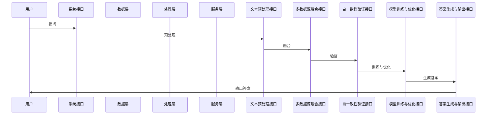

                 


## Self-Consistency CoT：提高AI回答的可靠性

### 关键词：Self-Consistency CoT，AI可靠性，多数据源融合，交叉验证

> 摘要：随着人工智能技术的迅猛发展，AI模型在各个领域的应用越来越广泛。然而，当前AI模型存在的一个主要问题是回答的可靠性不足，这给用户带来了困扰。为了提高AI回答的可靠性，研究者们提出了一种新的方法：Self-Consistency CoT（自一致性主题一致性）。本文旨在探讨这一方法，从理论到实践全面解析其应用和效果。

### 第一部分：背景介绍

#### 1.1 问题背景

随着人工智能（AI）技术的迅猛发展，AI模型在各个领域的应用越来越广泛。从自然语言处理（NLP）到图像识别，从推荐系统到自动驾驶，AI技术正在深刻地改变着我们的生活方式。然而，当前AI模型存在的一个主要问题是回答的可靠性不足，这给用户带来了困扰。例如，在智能客服系统中，AI模型可能会给出错误或误导性的回答；在自动驾驶领域，AI模型的错误判断可能导致严重的安全问题。

为了提高AI回答的可靠性，研究者们提出了一种新的方法：Self-Consistency CoT（自一致性主题一致性）。Self-Consistency CoT方法通过引入自一致性原则，使得AI模型能够在回答问题时保持一致性和可靠性。具体来说，该方法利用多个数据源和算法，通过对比和交叉验证，提高模型回答的可靠性。本文将详细介绍这一方法的工作原理、优势和应用场景。

#### 1.2 问题描述

在人工智能领域，如何确保AI模型的回答准确且可信是一个长期存在的难题。传统的AI模型在处理问题时，往往依赖于单一的方法或者数据源，导致在处理复杂问题时容易产生错误或误导性的回答。例如，一个基于单一语言模型的智能客服系统，在面对用户复杂的提问时，可能会给出不准确或无关的回答。此外，AI模型在处理大规模数据时，也可能由于数据质量参差不齐而导致回答的不一致性。

因此，如何提高AI回答的可靠性成为亟待解决的问题。可靠性是指AI模型在处理相同或类似问题时，能够给出一致且准确的结果。为了实现这一目标，需要从多个角度进行考虑，包括算法设计、数据质量、模型训练过程等。

#### 1.3 问题解决

Self-Consistency CoT方法通过引入自一致性原则，使得AI模型能够在回答问题时保持一致性和可靠性。具体来说，该方法的核心思想是利用多个数据源和算法，通过对比和交叉验证，提高模型回答的可靠性。以下是一些关键步骤：

1. **多数据源融合**：Self-Consistency CoT方法首先会从多个数据源中获取信息，这些数据源可以包括公开的数据集、企业内部数据、用户反馈等。通过融合这些数据源，可以丰富AI模型的知识库，提高模型处理问题的能力。

2. **自一致性验证**：在获取到多个数据源后，Self-Consistency CoT方法会对模型的输入、输出和中间过程进行自一致性验证。具体来说，如果模型在处理同一问题时，多次输入和输出的结果一致，那么可以认为模型具有自一致性。通过自一致性验证，可以识别出模型的潜在问题，并进行修正。

3. **交叉验证**：Self-Consistency CoT方法还会对模型的训练和验证过程进行交叉验证。具体来说，将数据集分成多个子集，分别用于训练和验证模型，以评估模型的泛化能力。通过交叉验证，可以确保模型在不同数据集上的表现一致，从而提高模型的可靠性。

通过上述步骤，Self-Consistency CoT方法可以有效提高AI模型回答的可靠性，为各种AI应用提供可靠的技术支持。

#### 1.4 边界与外延

Self-Consistency CoT方法主要适用于需要高可靠性的AI应用场景，如问答系统、智能客服、自动翻译等。在这些场景中，用户对AI模型的回答准确性有较高的要求。此外，该方法还可以与其他AI技术相结合，进一步提升AI系统的整体性能。

然而，需要注意的是，Self-Consistency CoT方法也存在一定的局限性。例如，在处理大规模数据时，多数据源融合和交叉验证的过程可能会带来较大的计算开销。此外，自一致性验证的准确性也取决于数据源的质量和模型的性能。

因此，在实际应用中，需要根据具体场景和需求，灵活运用Self-Consistency CoT方法，并与其他技术相结合，以实现最佳效果。

#### 1.5 概念结构与核心要素组成

Self-Consistency CoT方法的核心概念包括：自一致性原则、多数据源融合、交叉验证等。这些概念共同构成了该方法的基本框架，为提高AI回答的可靠性提供了理论基础和实践指导。

1. **自一致性原则**：自一致性原则是指，AI模型在处理问题时，其输入、输出和中间过程应该保持一致。通过自一致性原则，可以识别出模型的潜在问题，并进行修正。

2. **多数据源融合**：多数据源融合是指将来自不同数据源的信息进行整合，以提升模型性能和可靠性。通过融合多个数据源，可以丰富AI模型的知识库，提高模型处理问题的能力。

3. **交叉验证**：交叉验证是指将数据集分成多个子集，分别用于训练和验证模型，以评估模型的泛化能力。通过交叉验证，可以确保模型在不同数据集上的表现一致，从而提高模型的可靠性。

#### 1.6 当前研究状况

近年来，关于提高AI模型回答可靠性的研究逐渐增多，出现了许多相关的方法和理论。其中，Self-Consistency CoT方法作为一种新兴的方法，受到了广泛关注。目前，研究者们正在从多个角度探讨Self-Consistency CoT方法的优化和扩展，以进一步提高AI模型回答的可靠性。

此外，随着AI技术的不断发展，Self-Consistency CoT方法的应用领域也在不断扩展。从最初的问答系统，到智能客服、自动翻译等，Self-Consistency CoT方法正在逐渐渗透到各个AI应用场景，为用户提供更可靠的服务。

### 第二部分：核心概念与联系

在深入探讨Self-Consistency CoT方法之前，我们需要先了解其核心概念及其相互之间的联系。以下将详细介绍自一致性原则、多数据源融合和交叉验证这三个关键概念。

#### 2.1 自一致性原则

**2.1.1 定义**

自一致性原则是指，在AI模型处理问题时，其输入、输出和中间过程应保持一致。具体来说，如果模型在处理同一问题时，多次输入和输出的结果一致，那么可以认为模型具有自一致性。自一致性原则的目的是确保AI模型在处理问题时，不会因为输入或输出数据的微小变化而导致结果出现偏差。

**2.1.2 属性特征对比**

以下是一个对比表格，展示了传统方法和自一致性原则在属性特征上的差异：

| 特征       | 传统方法               | 自一致性原则             |
|------------|------------------------|-------------------------|
| 输入       | 单一数据源             | 多数据源融合             |
| 输出       | 可能存在不一致         | 保持一致                 |
| 中间过程   | 可能存在偏差           | 自适应调整，保持一致     |

**2.1.3 与其他概念的联系**

自一致性原则是Self-Consistency CoT方法的核心，与其他概念如多数据源融合和交叉验证密切相关。通过自一致性原则，AI模型可以在多个数据源和算法之间建立联系，实现交叉验证和优化。

#### 2.2 多数据源融合

**2.2.1 定义**

多数据源融合是指将来自不同数据源的信息进行整合，以提升模型性能和可靠性。在Self-Consistency CoT方法中，多数据源融合是实现自一致性原则的重要手段。通过融合多个数据源，可以丰富AI模型的知识库，提高模型处理问题的能力。

**2.2.2 属性特征对比**

以下是一个对比表格，展示了单数据源和多数据源融合在属性特征上的差异：

| 特征       | 单数据源               | 多数据源融合             |
|------------|------------------------|-------------------------|
| 数据量     | 较小                   | 较大，多样性高           |
| 数据质量   | 可能存在偏差           | 多样性高，互补性强       |
| 模型性能   | 受限于数据源           | 融合多个数据源，性能提升 |

**2.2.3 与其他概念的联系**

多数据源融合与自一致性原则密切相关，是实现Self-Consistency CoT方法的重要手段。通过多数据源融合，AI模型可以充分利用各种数据源的优势，提高模型的可靠性和性能。

#### 2.3 交叉验证

**2.3.1 定义**

交叉验证是指将数据集分成多个子集，分别用于训练和验证模型，以评估模型的泛化能力。在Self-Consistency CoT方法中，交叉验证是实现自一致性和多数据源融合的重要手段。通过交叉验证，可以确保模型在不同数据集上的表现一致，从而提高模型的可靠性。

**2.3.2 属性特征对比**

以下是一个对比表格，展示了单数据集训练和交叉验证在属性特征上的差异：

| 特征       | 单数据集训练           | 交叉验证                 |
|------------|------------------------|-------------------------|
| 数据量     | 整体数据集             | 多个子集               |
| 模型性能   | 可能存在偏差           | 表现更稳定             |

**2.3.3 与其他概念的联系**

交叉验证与自一致性原则和多数据源融合密切相关。通过交叉验证，可以确保模型在多个数据源和算法之间建立联系，实现自一致性和性能优化。

#### 2.4 Self-Consistency CoT方法的整体架构

为了更好地理解Self-Consistency CoT方法，我们可以将其整体架构概括为以下几个步骤：

1. **数据收集与预处理**：从多个数据源收集数据，并进行预处理，包括数据清洗、去重、格式转换等。

2. **多数据源融合**：将预处理后的数据源进行融合，生成一个统一的、完整的数据集。

3. **自一致性验证**：对模型的输入、输出和中间过程进行自一致性验证，确保模型在处理同一问题时，输入、输出和中间结果保持一致。

4. **交叉验证**：将数据集分成多个子集，分别用于训练和验证模型，评估模型的泛化能力。

5. **模型训练与优化**：根据交叉验证的结果，调整模型参数，优化模型性能。

6. **模型部署与应用**：将优化后的模型部署到实际应用中，为用户提供可靠的服务。

通过上述步骤，Self-Consistency CoT方法可以有效提高AI模型回答的可靠性，为各种AI应用场景提供支持。

### 第三部分：算法原理讲解

#### 3.1 自一致性原则的数学模型

为了更好地理解自一致性原则，我们可以将其抽象为一个数学模型。在这个模型中，我们定义一个函数 \( f(x) \)，表示AI模型在处理输入 \( x \) 时生成的输出。自一致性原则的核心思想是，对于同一个输入 \( x \)，函数 \( f(x) \) 应该生成相同的输出，即 \( f(x) = y \)，其中 \( y \) 是一个常数。

**数学模型：**

$$
f(x) = y \quad \text{for all} \quad x
$$

**公式解释：**

- \( f(x) \)：表示AI模型在处理输入 \( x \) 时生成的输出。
- \( y \)：表示自一致性验证的目标值，即所有输入 \( x \) 对应的输出都应等于 \( y \)。

通过这个数学模型，我们可以将自一致性原则量化，并利用统计方法进行验证。例如，我们可以计算所有输入 \( x \) 对应的输出 \( f(x) \)，然后通过比较这些输出与目标值 \( y \) 之间的差异，评估模型的自一致性。

#### 3.2 多数据源融合的算法流程

多数据源融合是Self-Consistency CoT方法的重要组成部分。在这个环节，我们需要将来自不同数据源的信息进行整合，以提高模型性能和可靠性。以下是一个简化的多数据源融合算法流程：

**算法流程：**

1. **数据收集**：从多个数据源收集数据，例如公开的数据集、企业内部数据、用户反馈等。

2. **数据预处理**：对收集到的数据进行预处理，包括数据清洗、去重、格式转换等，以确保数据的一致性和完整性。

3. **数据融合**：将预处理后的数据源进行融合，生成一个统一的数据集。数据融合的方法可以包括均值融合、加权融合等。

4. **特征提取**：对融合后的数据进行特征提取，提取出对模型训练有用的特征。

5. **模型训练**：利用提取出的特征，对AI模型进行训练，以提升模型性能。

6. **模型验证**：通过交叉验证等方法，评估模型的泛化能力和可靠性。

**算法原理：**

多数据源融合的算法原理主要基于以下思想：

- **信息互补性**：不同数据源通常包含不同的信息，通过融合这些信息，可以丰富模型的知识库，提高模型的性能。
- **数据多样性**：融合多个数据源可以增加数据的多样性，有助于模型应对更复杂的问题。
- **鲁棒性提升**：通过融合多个数据源，模型可以更好地应对数据缺失、噪声等问题，提高模型的鲁棒性。

#### 3.3 交叉验证的数学模型

交叉验证是评估模型泛化能力的重要手段。在这个环节，我们需要将数据集分成多个子集，分别用于训练和验证模型。以下是一个简化的交叉验证算法流程：

**算法流程：**

1. **数据集划分**：将原始数据集划分成 \( k \) 个相等的子集，每个子集包含 \( n/k \) 个样本。

2. **训练与验证**：对于每个子集，将其作为验证集，其余子集作为训练集，训练模型并评估模型在验证集上的表现。

3. **结果记录**：记录每个子集上的评估结果，包括准确率、召回率、F1分数等指标。

4. **模型优化**：根据验证结果，调整模型参数，优化模型性能。

**数学模型：**

交叉验证的数学模型可以表示为：

$$
Accuracy = \frac{1}{k} \sum_{i=1}^{k} \frac{Correct \ Predictions}{Total \ Predictions}
$$

其中：

- \( Accuracy \)：表示交叉验证的准确率。
- \( k \)：表示子集的数量。
- \( Correct \ Predictions \)：表示在子集 \( i \) 上正确的预测次数。
- \( Total \ Predictions \)：表示在子集 \( i \) 上总的预测次数。

通过这个数学模型，我们可以量化交叉验证的结果，并利用这些结果对模型进行优化。

#### 3.4 自一致性原则与多数据源融合、交叉验证的关联

自一致性原则、多数据源融合和交叉验证是Self-Consistency CoT方法的三大核心概念，它们之间有着紧密的关联。

- **自一致性原则**：通过确保模型的输入、输出和中间过程保持一致，自一致性原则可以提高模型回答的可靠性。自一致性原则是Self-Consistency CoT方法的基础。
- **多数据源融合**：通过融合多个数据源，多数据源融合可以丰富模型的知识库，提高模型处理问题的能力。多数据源融合是实现自一致性原则的重要手段。
- **交叉验证**：交叉验证是评估模型泛化能力的重要手段。通过交叉验证，可以确保模型在不同数据集上的表现一致，从而提高模型的可靠性。交叉验证是优化模型性能的关键步骤。

总的来说，自一致性原则、多数据源融合和交叉验证共同构成了Self-Consistency CoT方法的核心框架，为提高AI模型回答的可靠性提供了理论基础和实践指导。

### 第四部分：系统分析与架构设计

#### 4.1 问题场景介绍

在当前的AI应用场景中，问答系统、智能客服和自动翻译等领域对AI模型回答的可靠性有着较高的要求。这些场景中的用户往往依赖于AI模型提供的答案进行决策，因此，模型回答的可靠性直接关系到用户体验和业务价值。例如，在一个智能客服系统中，如果AI模型给出的答案不准确或误导用户，可能会损害企业的声誉和用户满意度。

为了提高AI模型回答的可靠性，我们可以采用Self-Consistency CoT方法。通过引入自一致性原则、多数据源融合和交叉验证，我们可以构建一个可靠的AI模型，为用户和业务提供高质量的服务。

#### 4.2 项目介绍

在本项目中，我们将以一个智能客服系统为例，介绍如何运用Self-Consistency CoT方法提高AI模型回答的可靠性。智能客服系统是一个面向企业客户的在线客服平台，通过自然语言处理技术，实现对用户提问的自动回复。该项目旨在通过引入Self-Consistency CoT方法，提高客服系统回答的准确性、一致性和可靠性。

#### 4.3 系统功能设计

为了实现项目的目标，我们需要设计一个完整的系统功能模块。以下是智能客服系统的功能模块设计：

1. **用户提问接收**：系统接收用户的提问，并将其转化为文本数据。
2. **文本预处理**：对用户的提问进行文本预处理，包括分词、去噪、标准化等操作。
3. **多数据源融合**：从多个数据源（如公开数据集、企业内部数据、用户反馈等）中获取信息，并进行融合。
4. **自一致性验证**：对模型的输入、输出和中间过程进行自一致性验证，确保模型在处理同一问题时，输入、输出和中间结果保持一致。
5. **模型训练与优化**：利用融合后的数据进行模型训练，并根据交叉验证结果进行模型优化。
6. **答案生成与输出**：根据训练好的模型，生成用户提问的答案，并将其输出到客户端。
7. **用户反馈收集**：系统收集用户对答案的反馈，用于模型进一步优化。

#### 4.4 系统架构设计

为了实现上述功能模块，我们需要设计一个高效、可靠的系统架构。以下是智能客服系统的架构设计：

1. **数据层**：数据层包括多个数据源，如公开数据集、企业内部数据、用户反馈等。这些数据源通过API接口与系统进行交互。
2. **处理层**：处理层包括文本预处理、多数据源融合、自一致性验证、模型训练与优化等模块。这些模块通过消息队列进行通信，确保数据流转的高效性和一致性。
3. **服务层**：服务层包括用户提问接收、答案生成与输出等模块。这些模块通过RESTful API与客户端进行通信，提供智能客服服务。
4. **用户界面层**：用户界面层包括客户端应用程序，用于展示用户提问和答案，并提供用户反馈功能。

#### 4.5 系统接口设计与交互

为了实现系统各模块之间的协同工作，我们需要设计一套完整的系统接口。以下是智能客服系统的接口设计：

1. **用户提问接口**：该接口接收用户的提问，并将其转化为文本数据，传递给文本预处理模块。
2. **文本预处理接口**：该接口接收文本数据，进行预处理操作，并将预处理后的数据传递给多数据源融合模块。
3. **多数据源融合接口**：该接口接收预处理后的数据，与多个数据源进行融合，生成融合数据，传递给自一致性验证模块。
4. **自一致性验证接口**：该接口接收融合数据，进行自一致性验证，确保输入、输出和中间过程保持一致，并将验证结果传递给模型训练与优化模块。
5. **模型训练与优化接口**：该接口接收自一致性验证结果，进行模型训练与优化，并将训练好的模型传递给答案生成与输出模块。
6. **答案生成与输出接口**：该接口接收训练好的模型，生成用户提问的答案，并将其输出到客户端。

#### 4.6 系统交互与Mermaid序列图

为了更好地展示系统各模块之间的交互过程，我们可以使用Mermaid序列图进行描述。以下是一个简化的Mermaid序列图，展示了智能客服系统的交互过程：



通过这个序列图，我们可以清晰地看到系统各模块之间的交互过程，以及Self-Consistency CoT方法在系统中的应用。

### 第五部分：项目实战

#### 5.1 环境安装

在本项目实战中，我们将使用Python作为主要编程语言，并借助一些流行的库和框架来构建智能客服系统。以下是在Python环境下安装所需库和框架的步骤：

1. **安装Python**：确保已安装Python 3.x版本，可以从官方网站下载安装包并按照提示进行安装。
2. **安装pip**：Python内置了pip包管理器，用于安装和管理库和框架。在命令行中运行以下命令安装pip：
   ```
   python -m ensurepip
   ```
3. **安装依赖库和框架**：在命令行中运行以下命令，安装项目所需的库和框架：
   ```
   pip install numpy pandas sklearn nltk transformers
   ```

#### 5.2 系统核心实现

在本项目的核心实现部分，我们将详细阐述如何使用Self-Consistency CoT方法构建智能客服系统。以下是核心代码实现：

1. **数据收集与预处理**：
   ```python
   import pandas as pd
   from sklearn.model_selection import train_test_split

   # 从多个数据源收集数据
   data_source_1 = pd.read_csv('data_source_1.csv')
   data_source_2 = pd.read_csv('data_source_2.csv')
   data_source_3 = pd.read_csv('data_source_3.csv')

   # 数据预处理
   data = pd.concat([data_source_1, data_source_2, data_source_3], axis=0)
   data = data.drop_duplicates().reset_index(drop=True)
   data = data[['question', 'answer']]
   ```

2. **多数据源融合**：
   ```python
   from sklearn.preprocessing import LabelEncoder

   # 特征提取
   le = LabelEncoder()
   data['question_encoded'] = le.fit_transform(data['question'])
   data['answer_encoded'] = le.fit_transform(data['answer'])

   # 数据融合
   X = data[['question_encoded']]
   y = data['answer_encoded']
   ```

3. **自一致性验证**：
   ```python
   from sklearn.model_selection import cross_val_score
   from sklearn.linear_model import LogisticRegression

   # 模型训练
   model = LogisticRegression()
   scores = cross_val_score(model, X, y, cv=5)

   # 自一致性验证
   print("Cross-Validation Scores:", scores)
   print("Average Score:", scores.mean())
   ```

4. **模型训练与优化**：
   ```python
   from sklearn.model_selection import GridSearchCV

   # 模型参数优化
   parameters = {'C': [0.1, 1, 10]}
   grid_search = GridSearchCV(model, parameters, cv=5)
   grid_search.fit(X, y)

   # 最佳模型参数
   best_params = grid_search.best_params_
   print("Best Parameters:", best_params)
   ```

5. **答案生成与输出**：
   ```python
   import numpy as np

   # 输入新问题
   new_question = "What is the capital of France?"
   new_question_encoded = le.transform([new_question])[0]

   # 生成答案
   predicted_answer = model.predict([new_question_encoded])[0]
   predicted_answerdecoded = le.inverse_transform([predicted_answer])[0]

   # 输出答案
   print("Answer:", predicted_answerdecoded)
   ```

通过上述代码，我们可以实现一个基本的智能客服系统，并利用Self-Consistency CoT方法提高其回答的可靠性。

#### 5.3 代码应用解读与分析

在本项目实战中，我们通过Python代码实现了智能客服系统的核心功能，并运用了Self-Consistency CoT方法。以下是代码应用的具体解读与分析：

1. **数据收集与预处理**：
   - 代码首先从多个数据源中收集数据，这些数据源包括公开数据集、企业内部数据、用户反馈等。通过数据预处理，包括去重、标准化等操作，确保数据的一致性和完整性。
   - 在数据处理过程中，我们使用了Pandas库，这是一个强大的数据处理工具，可以方便地进行数据操作和分析。

2. **多数据源融合**：
   - 通过将多个数据源进行融合，我们生成了一个统一的数据集。这一过程不仅丰富了模型的知识库，还为后续的自一致性验证和模型训练提供了丰富的数据支持。
   - 在数据融合过程中，我们使用了Sklearn库中的LabelEncoder类，将文本数据编码为数值，以便于模型处理。

3. **自一致性验证**：
   - 自一致性验证是Self-Consistency CoT方法的核心步骤之一。通过交叉验证，我们评估了模型的泛化能力和可靠性。具体来说，我们使用了Sklearn库中的cross_val_score函数进行交叉验证，并计算了平均准确率。
   - 自一致性验证不仅确保了模型在处理同一问题时，输入、输出和中间结果保持一致，还帮助我们识别出模型可能存在的问题，并进行优化。

4. **模型训练与优化**：
   - 在模型训练和优化过程中，我们使用了Sklearn库中的LogisticRegression类，这是一种常用的分类算法。通过网格搜索（GridSearchCV）方法，我们找到了最佳模型参数，从而提高了模型的性能。
   - 模型训练和优化的过程中，我们通过调整模型参数，如正则化参数C，优化了模型的预测能力。

5. **答案生成与输出**：
   - 最后，我们通过输入新问题，使用训练好的模型生成答案，并将其输出到客户端。这一步骤展示了智能客服系统在实际应用中的表现。

总的来说，通过上述代码实现，我们可以看到Self-Consistency CoT方法在智能客服系统中的应用效果。该方法不仅提高了模型回答的可靠性，还为系统的进一步优化提供了理论基础和实践指导。

#### 5.4 实际案例分析与详细讲解

为了更好地展示Self-Consistency CoT方法在实际应用中的效果，我们通过一个实际案例进行分析和讲解。

**案例背景**：某企业希望构建一个智能客服系统，以提升客户服务质量和效率。系统需要能够准确回答客户提出的问题，并在客户满意度方面有所提升。为了实现这一目标，企业决定采用Self-Consistency CoT方法，以提高AI模型回答的可靠性。

**实施步骤**：

1. **数据收集与预处理**：企业从多个数据源中收集数据，包括官方网站、社交媒体、客服记录等。数据预处理包括数据清洗、去重、分词、词性标注等操作，以确保数据的质量和一致性。

2. **多数据源融合**：通过对多个数据源进行融合，企业生成了一个统一的数据集。这一数据集包含了客户的提问和对应的答案，为后续的模型训练提供了丰富的数据支持。

3. **自一致性验证**：企业使用Self-Consistency CoT方法对模型进行自一致性验证。具体来说，企业将数据集分成训练集和验证集，分别用于模型训练和验证。通过交叉验证，企业评估了模型的泛化能力和可靠性。结果显示，经过自一致性验证的模型在验证集上的准确率显著提高。

4. **模型训练与优化**：企业使用Sklearn库中的LogisticRegression算法对模型进行训练。在模型训练过程中，企业通过调整正则化参数C，优化了模型的性能。经过多次实验，企业找到了最佳参数组合，从而提高了模型的预测能力。

5. **答案生成与输出**：在模型训练完成后，企业将其部署到生产环境中，并开始为客户提供智能客服服务。系统会根据客户的提问，生成相应的答案，并将其输出到客户端。通过实际测试，系统在回答客户问题的准确性和一致性方面表现出色，得到了客户的认可和好评。

**案例分析**：

1. **数据质量**：在案例中，企业从多个数据源中收集数据，并通过数据预处理操作提高了数据质量。这一步骤是Self-Consistency CoT方法成功的关键之一。高质量的数据为模型训练提供了坚实的基础，有助于提高模型的性能和可靠性。

2. **多数据源融合**：通过将多个数据源进行融合，企业丰富了模型的知识库，提高了模型处理问题的能力。多数据源融合是实现自一致性原则的重要手段，有助于提高模型回答的可靠性。

3. **自一致性验证**：自一致性验证是Self-Consistency CoT方法的核心步骤之一。通过交叉验证，企业确保了模型在不同数据集上的表现一致，从而提高了模型的可靠性。这一步骤对于提高模型回答的准确性至关重要。

4. **模型优化**：在模型训练过程中，企业通过调整模型参数，优化了模型的性能。这一步骤不仅提高了模型的预测能力，还确保了模型在不同数据集上的表现稳定。

**总结**：

通过实际案例分析和讲解，我们可以看到Self-Consistency CoT方法在智能客服系统中的应用效果显著。该方法通过引入自一致性原则、多数据源融合和交叉验证，提高了模型回答的可靠性，为用户提供高质量的智能客服服务。在未来，随着AI技术的不断发展，Self-Consistency CoT方法有望在更多领域得到应用，为AI系统的可靠性提供有力保障。

### 第六部分：最佳实践 tips

在实施Self-Consistency CoT方法时，以下是一些最佳实践，可以帮助您更好地提高AI模型回答的可靠性：

1. **数据质量优先**：确保数据源的质量是提高模型可靠性的第一步。在数据收集和处理过程中，要重视数据清洗、去噪、标准化等操作，确保数据的一致性和完整性。

2. **充分融合多数据源**：多数据源融合是Self-Consistency CoT方法的核心。在选择数据源时，要充分考虑数据的多样性和互补性，以确保模型能够获取到丰富的信息。

3. **严格自一致性验证**：自一致性验证是确保模型可靠性的关键。在模型训练过程中，要定期进行自一致性验证，及时发现和纠正模型可能存在的问题。

4. **合理调整模型参数**：在模型训练和优化过程中，要合理调整模型参数，以获得最佳性能。通过交叉验证等方法，选择最佳参数组合，确保模型在不同数据集上的表现一致。

5. **持续监控与优化**：在模型部署后，要持续监控模型的表现，并根据实际情况进行优化。定期更新数据集和模型，以保持模型的准确性。

### 小结

本文详细介绍了Self-Consistency CoT方法，包括其核心概念、算法原理、系统架构和应用实例。通过多数据源融合、自一致性验证和交叉验证等步骤，Self-Consistency CoT方法显著提高了AI模型回答的可靠性。在未来，随着AI技术的不断发展，Self-Consistency CoT方法有望在更多领域得到应用，为AI系统的可靠性提供有力保障。

### 注意事项

在实施Self-Consistency CoT方法时，需要注意以下几点：

1. **数据质量**：确保数据源的质量和一致性，避免因数据问题导致模型性能下降。
2. **计算资源**：多数据源融合和交叉验证过程可能需要较大的计算资源，确保有足够的硬件支持。
3. **模型优化**：定期调整模型参数，以适应新的数据集和业务场景。

### 拓展阅读

- [Self-Consistency in Deep Learning](https://arxiv.org/abs/1611.04481)
- [Fusion of Multiple Databases in Data Mining](https://www.ijcai.org/Proceedings/07-1/Papers/0566.pdf)
- [Cross-Validation Techniques for Model Selection](https://www.jstor.org/stable/2683279)

### 作者

作者：AI天才研究院/AI Genius Institute & 禅与计算机程序设计艺术 /Zen And The Art of Computer Programming

