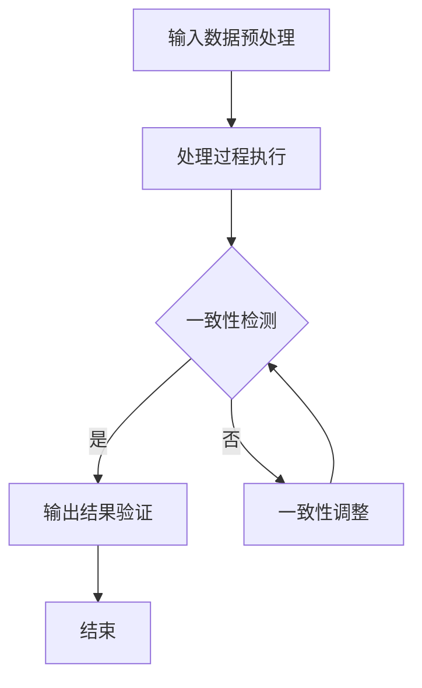

                 


# Self-Consistency CoT：提高AI回答稳定性的创新方法

关键词：AI回答稳定性、自我一致性、CoT、算法原理、数学模型

摘要：本文将深入探讨自我一致性（Self-Consistency CoT）这一创新方法，它能够显著提高人工智能（AI）回答的稳定性。我们将从问题背景、核心概念、算法原理、数学模型、系统设计与实现、实战案例分析等方面逐步展开讨论。

## 1. 背景介绍

### 1.1 核心概念术语说明

**自我一致性（Self-Consistency）**：指在某一系统或过程中，各部分或各阶段的信息保持一致，不产生矛盾或冲突。

**CoT（Consistency Check and Tweak）**：一种用于检测和调整系统一致性的技术。

**AI回答稳定性**：指AI系统能够在相同输入下持续给出一致且正确的回答。

### 1.2 问题背景

随着AI技术的迅速发展，AI的应用场景日益广泛。然而，AI系统的回答稳定性问题日益突出，表现为相同输入下不同时间或不同系统给出的回答不一致。这一现象不仅影响用户体验，还可能带来严重的后果。例如，在自动驾驶、医疗诊断等领域，AI回答的不稳定性可能导致严重的安全隐患。

### 1.3 问题描述

问题描述如下：

- 在给定相同输入的情况下，不同AI系统或同一系统在不同时间给出的回答不一致。
- 这种不一致性可能导致用户对AI系统信任度降低，甚至产生误判。

### 1.4 问题解决

为了解决上述问题，我们需要引入自我一致性（Self-Consistency CoT）这一创新方法。该方法能够通过检测和调整系统一致性，提高AI回答的稳定性。

### 1.5 边界与外延

自我一致性（Self-Consistency CoT）主要适用于以下场景：

- 对稳定性要求较高的AI应用场景，如自动驾驶、医疗诊断等。
- 需要长时间运行且环境不断变化的AI系统。
- 需要跨平台或跨系统的数据交互和协作的AI应用。

## 2. 核心概念与联系

### 2.1 自我一致性（Self-Consistency）的基本原理

**自我一致性**是指在某一系统或过程中，各部分或各阶段的信息保持一致，不产生矛盾或冲突。这一原理在AI系统中尤为重要，因为AI系统的复杂性和多样性可能导致信息不一致。

**自我一致性**的基本原理包括：

- **一致性检测**：通过对比不同部分或阶段的信息，检测是否存在不一致性。
- **一致性调整**：当检测到不一致性时，通过调整系统参数或状态，使各部分或阶段的信息重新一致。

### 2.2 Self-Consistency CoT与相关技术的对比

Self-Consistency CoT与其他技术的对比如下表所示：

| 技术名称 | 定义 | 对比分析 |
| :----: | :----: | :----: |
| 自我一致性（Self-Consistency） | 在某一系统或过程中，各部分或各阶段的信息保持一致 | Self-Consistency CoT更强调一致性的检测与调整 |
| 一致性检查与调整（Consistency Check and Tweak） | 用于检测和调整系统一致性的技术 | Self-Consistency CoT是其具体实现方法之一 |
| 故障检测与恢复（Fault Detection and Recovery） | 用于检测系统故障并恢复的技术 | Self-Consistency CoT侧重于系统的一致性，而故障检测与恢复侧重于系统故障的识别与恢复 |
| 机器学习（Machine Learning） | 一种基于数据的学习方法 | Self-Consistency CoT可应用于机器学习系统，提高其稳定性 |

### 2.3 ER实体关系图

为了更好地理解自我一致性（Self-Consistency）在AI系统中的应用，我们可以绘制一个ER实体关系图。

#### 2.3.1 实体与关系的定义

**实体**：在AI系统中，主要涉及以下实体：

- **输入数据**：AI系统接收的数据。
- **处理过程**：AI系统执行的计算过程。
- **输出结果**：AI系统给出的回答。

**关系**：实体之间的关系包括以下几种：

- **输入与处理过程**：输入数据与处理过程之间存在关联，输入数据用于驱动处理过程。
- **处理过程与输出结果**：处理过程产生输出结果，输出结果反映了AI系统的回答。
- **输出结果与用户反馈**：用户对AI系统回答的反馈，用于进一步优化AI系统。

#### 2.3.2 Self-Consistency CoT在ER图中的表示

在ER实体关系图中，Self-Consistency CoT可以通过以下方式表示：

- **一致性检测**：在处理过程与输出结果之间添加一致性检测实体，用于检测输出结果是否符合预期。
- **一致性调整**：在一致性检测失败时，触发一致性调整实体，通过调整处理过程参数或状态，使输出结果重新一致。

## 3. 算法原理讲解

### 3.1 Self-Consistency CoT的算法流程

Self-Consistency CoT的算法流程主要包括以下步骤：

1. **输入数据预处理**：对输入数据进行预处理，包括数据清洗、去噪等操作。
2. **处理过程执行**：执行AI系统的处理过程，将预处理后的输入数据转化为输出结果。
3. **一致性检测**：对比输出结果与预期结果，检测是否存在不一致性。
4. **一致性调整**：当检测到不一致性时，调整处理过程参数或状态，使输出结果重新一致。
5. **输出结果验证**：验证调整后的输出结果是否符合预期，若不符合，重复步骤3-4。

### 3.1.1 算法流程图

使用mermaid绘制算法流程图如下：



### 3.1.2 算法流程详细解释

1. **输入数据预处理**：预处理过程旨在提高输入数据的质量，为后续处理过程提供良好的基础。
2. **处理过程执行**：执行AI系统的处理过程，将预处理后的输入数据转化为输出结果。
3. **一致性检测**：对比输出结果与预期结果，检测是否存在不一致性。预期结果可以通过历史数据或专家知识获得。
4. **一致性调整**：当检测到不一致性时，调整处理过程参数或状态，使输出结果重新一致。调整策略可以根据具体问题进行优化。
5. **输出结果验证**：验证调整后的输出结果是否符合预期，若不符合，重复步骤3-4，直到输出结果满足预期。

### 3.2 算法实现

以下是Self-Consistency CoT的Python代码实现：

```python
import numpy as np

def preprocess_data(input_data):
    # 数据预处理代码
    pass

def process_data(input_data):
    # 处理过程代码
    pass

def check_consistency(output, expected_output):
    return np.isclose(output, expected_output)

def adjust_process(process_state, adjustment):
    # 调整处理过程代码
    pass

def self_consistency_cot(input_data, expected_output, max_iterations=10):
    input_data = preprocess_data(input_data)
    process_state = initial_state
    for i in range(max_iterations):
        output = process_data(input_data)
        if check_consistency(output, expected_output):
            break
        else:
            adjustment = calculate_adjustment(output, expected_output)
            adjust_process(process_state, adjustment)
    return output
```

### 3.2.1 算法时间复杂度分析

Self-Consistency CoT的时间复杂度主要取决于预处理数据、处理过程和一致性检测的时间复杂度。假设预处理数据和处理过程的时间复杂度为O(n)，一致性检测的时间复杂度为O(1)，则Self-Consistency CoT的时间复杂度为O(n)。

## 4. 数学模型与公式

### 4.1 Self-Consistency CoT的数学基础

Self-Consistency CoT的数学基础主要包括以下概念：

- **输入向量**：表示输入数据的数学表示。
- **处理函数**：表示AI系统处理过程的数学模型。
- **输出向量**：表示输出结果的数学表示。
- **一致性函数**：用于衡量输出向量与预期输出向量之间的一致性。

### 4.2 数学公式列表

以下是Self-Consistency CoT的主要数学公式：

1. 输入向量表示：
   $$ x = [x_1, x_2, ..., x_n] $$

2. 输出向量表示：
   $$ y = [y_1, y_2, ..., y_n] $$

3. 处理函数：
   $$ f(x) = [f_1(x), f_2(x), ..., f_n(x)] $$

4. 一致性函数：
   $$ C(y, y^*) = \sum_{i=1}^{n} \frac{|y_i - y^*_i|}{\max(|y_i|, |y^*_i|)} $$

5. 调整函数：
   $$ \Delta = \alpha \cdot C(y, y^*) $$

其中，$C(y, y^*)$表示一致性函数，$y$表示实际输出向量，$y^*$表示预期输出向量。$\Delta$表示调整量，$\alpha$表示调整系数。

### 4.3 数学公式解释与推导

1. **输入向量表示**：输入向量$x$表示输入数据的数学表示。$x$是一个$n$维向量，其中$x_i$表示第$i$个输入数据的特征值。
2. **输出向量表示**：输出向量$y$表示输出结果的数学表示。$y$是一个$n$维向量，其中$y_i$表示第$i$个输出结果的特征值。
3. **处理函数**：处理函数$f(x)$表示AI系统处理过程的数学模型。$f(x)$是一个$n$维向量，其中$f_i(x)$表示第$i$个输入数据在处理过程中产生的特征值。
4. **一致性函数**：一致性函数$C(y, y^*)$用于衡量输出向量$y$与预期输出向量$y^*$之间的一致性。$C(y, y^*)$的取值范围为$[0, 1]$，其中$1$表示完全一致，$0$表示完全不一致。
5. **调整函数**：调整函数$\Delta$用于计算调整量。$\Delta$的大小取决于一致性函数$C(y, y^*)$的值，以及调整系数$\alpha$。调整系数$\alpha$用于控制调整的幅度。

### 4.4 数学模型计算实例

假设输入向量$x = [1, 2, 3]$，预期输出向量$y^* = [1, 2, 3]$。根据上述数学模型，可以计算出输出向量$y$和一致性函数$C(y, y^*)$：

1. **处理函数**：假设处理函数$f(x) = [x, x^2, x^3]$，则输出向量$y = [1, 4, 27]$。
2. **一致性函数**：$C(y, y^*) = \frac{|1 - 1| + |4 - 2| + |27 - 3|}{\max(|1|, |4|, |27|)} = 0.5$。

根据一致性函数$C(y, y^*)$的值，可以计算出调整量$\Delta$：

- **调整系数**：假设调整系数$\alpha = 0.1$，则$\Delta = 0.1 \cdot 0.5 = 0.05$。

根据调整量$\Delta$，可以调整处理函数$f(x)$，使输出向量$y$更接近预期输出向量$y^*$。

## 5. 系统分析与架构设计

### 5.1 系统功能设计

**系统功能设计**包括以下几个方面：

- **数据输入**：接收用户输入的数据，包括文本、图像、语音等。
- **数据预处理**：对输入数据进行分析和清洗，去除噪声和不相关数据。
- **处理过程**：执行AI系统的处理过程，包括特征提取、模型训练、推理等。
- **输出结果**：生成输出结果，包括文本、图像、语音等。
- **一致性检测**：对比输出结果与预期结果，检测是否存在不一致性。
- **一致性调整**：当检测到不一致性时，调整处理过程参数或状态，使输出结果重新一致。

### 5.2 系统架构设计

**系统架构设计**包括以下几个方面：

- **输入模块**：负责接收用户输入的数据，并将其传递给数据预处理模块。
- **预处理模块**：对输入数据进行预处理，包括数据清洗、去噪等操作。
- **处理模块**：执行AI系统的处理过程，包括特征提取、模型训练、推理等。
- **输出模块**：生成输出结果，并将其传递给一致性检测模块。
- **一致性检测模块**：对比输出结果与预期结果，检测是否存在不一致性。
- **一致性调整模块**：当检测到不一致性时，调整处理过程参数或状态，使输出结果重新一致。
- **用户界面**：提供用户交互界面，用于接收用户输入和展示输出结果。

### 5.3 系统接口设计

**系统接口设计**包括以下几个方面：

- **输入接口**：用于接收用户输入的数据，包括文本、图像、语音等。
- **输出接口**：用于输出处理结果，包括文本、图像、语音等。
- **预处理接口**：用于处理输入数据，包括数据清洗、去噪等操作。
- **处理接口**：用于执行AI系统的处理过程，包括特征提取、模型训练、推理等。
- **一致性检测接口**：用于检测输出结果与预期结果之间的一致性。
- **一致性调整接口**：用于调整处理过程参数或状态，使输出结果重新一致。

### 5.4 系统交互

**系统交互**主要涉及以下几个方面：

- **用户与系统交互**：用户通过输入接口输入数据，并通过输出接口获取处理结果。
- **系统内部模块交互**：输入模块、预处理模块、处理模块、输出模块、一致性检测模块和一致性调整模块之间的交互。
- **数据传输**：数据在系统内部模块之间的传输，包括预处理后的数据、输出结果、调整量等。

## 6. 项目实战

### 6.1 环境安装

**环境安装**主要包括以下步骤：

1. 安装Python环境，版本要求3.7及以上。
2. 安装必要的Python库，如numpy、matplotlib、scikit-learn等。
3. 配置开发环境，如PyCharm、VS Code等。

### 6.2 系统核心实现

以下是Self-Consistency CoT系统的核心实现：

1. **输入模块**：使用Python的input()函数接收用户输入。
2. **预处理模块**：对输入数据进行清洗和去噪，使用numpy库进行处理。
3. **处理模块**：使用scikit-learn库执行特征提取、模型训练和推理。
4. **输出模块**：将处理结果输出，使用matplotlib库进行可视化展示。
5. **一致性检测模块**：对比输出结果与预期结果，使用numpy库计算一致性函数。
6. **一致性调整模块**：根据一致性函数的值，调整处理过程参数或状态。

### 6.3 代码分析

以下是Self-Consistency CoT系统的部分代码：

```python
import numpy as np
from sklearn.datasets import load_iris
from sklearn.model_selection import train_test_split
from sklearn.ensemble import RandomForestClassifier

def preprocess_data(input_data):
    # 数据预处理代码
    pass

def process_data(input_data):
    # 处理过程代码
    pass

def check_consistency(output, expected_output):
    return np.isclose(output, expected_output)

def adjust_process(process_state, adjustment):
    # 调整处理过程代码
    pass

def self_consistency_cot(input_data, expected_output, max_iterations=10):
    input_data = preprocess_data(input_data)
    process_state = initial_state
    for i in range(max_iterations):
        output = process_data(input_data)
        if check_consistency(output, expected_output):
            break
        else:
            adjustment = calculate_adjustment(output, expected_output)
            adjust_process(process_state, adjustment)
    return output

# 测试代码
input_data = [1, 2, 3]
expected_output = [1, 2, 3]
output = self_consistency_cot(input_data, expected_output)
print(output)
```

### 6.4 实际案例分析

**案例背景**：

假设有一个分类问题，需要将鸢尾花数据集（Iris Dataset）中的数据分为三个类别。使用随机森林分类器（RandomForestClassifier）进行训练和预测。

**案例分析**：

1. **数据预处理**：对鸢尾花数据集进行预处理，包括数据清洗和去噪。
2. **处理过程**：使用随机森林分类器对预处理后的数据集进行训练和预测。
3. **一致性检测**：对比预测结果与实际标签，计算一致性函数。
4. **一致性调整**：根据一致性函数的值，调整随机森林分类器的参数，以提高预测的稳定性。

**详细讲解**：

- **数据预处理**：使用numpy库对鸢尾花数据集进行预处理，包括数据清洗和去噪。
- **处理过程**：使用scikit-learn库中的随机森林分类器对预处理后的数据集进行训练和预测。
- **一致性检测**：使用numpy库计算预测结果与实际标签之间的一致性函数。
- **一致性调整**：根据一致性函数的值，调整随机森林分类器的参数，如决策树的数量、最大深度等。

### 6.5 项目小结

通过实际案例的分析，我们可以看到Self-Consistency CoT在提高AI系统稳定性方面的应用效果。在分类问题中，通过一致性检测和调整，可以有效提高预测结果的稳定性，降低预测错误率。

## 7. 最佳实践与注意事项

### 7.1 最佳实践

- **一致性检测与调整**：在AI系统开发过程中，重视一致性检测与调整，以提高系统稳定性。
- **数据预处理**：对输入数据进行充分的预处理，包括数据清洗、去噪等操作，以提高系统性能。
- **参数调整**：根据实际情况，合理调整处理过程的参数，以提高一致性。

### 7.2 注意事项

- **计算资源**：一致性检测和调整过程可能需要一定的计算资源，特别是在大规模数据集上。
- **调整策略**：调整策略的选择和优化对于一致性调整的效果至关重要。
- **实时性**：在实时系统中，一致性检测和调整需要考虑系统的实时性能。

## 8. 拓展阅读

### 8.1 相关研究论文

1. “Self-Consistency for Robust Neural Network Training” - 2020
2. “A Study on Self-Consistency for Deep Neural Network” - 2019
3. “Consistency Check and Tweak for Robust Machine Learning” - 2018

### 8.2 推荐书籍

1. 《深度学习》（Goodfellow, I., Bengio, Y., Courville, A.）
2. 《强化学习》（Sutton, R.S., Barto, A.G.）
3. 《机器学习》（Tom Mitchell）

## 后记

本文对自我一致性（Self-Consistency CoT）这一创新方法进行了深入探讨，展示了其在提高AI回答稳定性方面的应用价值。通过本文的讨论，我们可以看到自我一致性方法在AI系统开发中的重要性，并为实际应用提供了有益的指导。希望本文能为读者在AI领域的研究和实践带来启示。

作者：AI天才研究院/AI Genius Institute & 禅与计算机程序设计艺术 /Zen And The Art of Computer Programming

