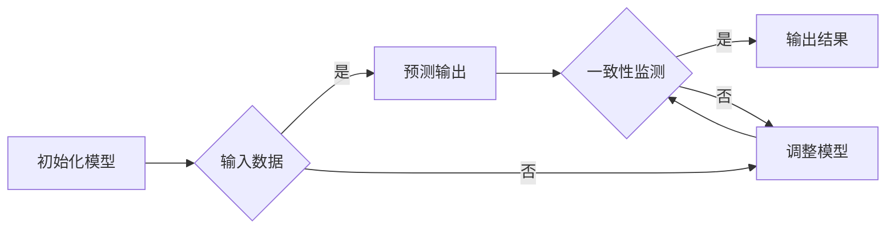
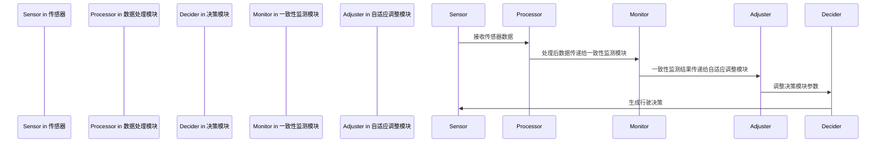
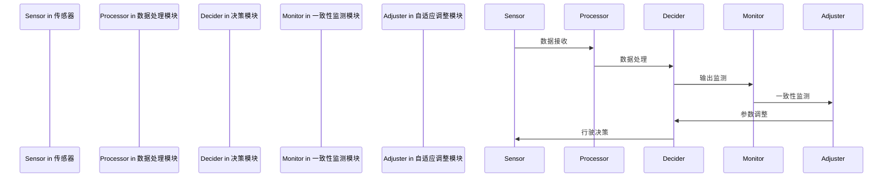

                 


### 自我一致性协同思维（Self-Consistency CoT）的概念解析

自我一致性协同思维（Self-Consistency CoT）是一种旨在提高人工智能（AI）模型输出一致性的方法论。首先，我们需要明确几个核心概念和术语。

**自我一致性（Self-Consistency）**：
自我一致性指的是AI模型在处理相同或类似的输入时，能够产生一致的输出。一致性是评价AI模型性能的重要指标之一，因为不一致的输出可能会导致错误决策或误解。

**协同思维（CoT）**：
协同思维是指通过一系列机制和策略，使AI模型能够保持自我一致性。这包括模型的自适应性、反馈循环和跨模块的协同工作。

**自我一致性协同思维（Self-Consistency CoT）的核心概念**：
自我一致性协同思维的核心在于构建一种机制，使AI模型能够不断调整和优化自身，以提高输出的稳定性。这涉及到以下几个关键点：

1. **一致性监测**：实时监测AI模型的输出，判断其是否一致。
2. **自适应调整**：当检测到不一致时，模型需要能够自适应地调整参数，以消除不一致性。
3. **反馈循环**：通过反馈机制，使模型能够从错误中学习，并不断优化自身。
4. **跨模块协同**：确保不同模块之间的输出能够保持一致性，从而提高整个系统的稳定性。

**核心术语解释**：

- **输入数据（Input Data）**：指提供给AI模型的原始数据。
- **输出结果（Output Result）**：指AI模型对输入数据进行处理后得到的输出。
- **一致性监测算法（Consistency Monitoring Algorithm）**：用于检测AI模型输出是否一致性的算法。
- **自适应调整机制（Adaptive Adjustment Mechanism）**：使模型能够根据监测结果调整自身参数的机制。
- **反馈循环（Feedback Loop）**：将输出结果返回给模型，用于进一步学习和调整的循环机制。

### 问题背景与重要性

在人工智能领域，一致性是一个长期存在的问题。传统的方法通常依赖于大量数据进行训练，期望通过数据驱动的方式消除不一致性。然而，这种方法存在一定的局限性，尤其是在数据分布不均或存在噪声时，模型的输出可能仍然不一致。

自我一致性协同思维（Self-Consistency CoT）提供了一种新的解决思路，通过构建自我调整和优化的机制，使模型能够在处理复杂任务时保持较高的输出一致性。这种方法的提出，对于提升AI模型在各个领域的应用价值具有重要意义。

### 问题描述

在现实中，AI模型的不一致性主要表现为以下几个方面：

1. **输出偏差**：在相同或类似的输入下，模型输出的结果存在较大的偏差。
2. **决策错误**：在关键决策场景中，模型输出的结果不一致，导致错误决策。
3. **模型漂移**：随着时间推移，模型的输出逐渐偏离预期，导致一致性下降。
4. **性能下降**：不一致的输出会导致模型性能下降，降低其在实际应用中的效果。

这些问题不仅会影响模型的可靠性，还可能导致严重的后果。例如，在医疗诊断领域，不一致的输出可能导致误诊或漏诊；在自动驾驶领域，不一致的输出可能导致事故发生。

### 问题解决

为了解决上述问题，传统的解决方法主要包括：

1. **数据清洗和预处理**：通过清洗和预处理数据，消除数据中的噪声和不一致性。
2. **模型优化**：通过优化模型的结构和参数，提高模型的一致性。
3. **增加训练数据**：通过增加训练数据，提高模型对各种输入的适应性。

然而，这些方法存在一定的局限性，特别是在数据质量不佳或模型复杂度较高时，效果不理想。

自我一致性协同思维（Self-Consistency CoT）提供了一种新的解决思路，通过构建自我调整和优化的机制，使模型能够在处理复杂任务时保持较高的输出一致性。这种方法具有以下几个优势：

1. **自适应调整**：通过实时监测模型输出，自适应地调整模型参数，从而消除不一致性。
2. **反馈循环**：通过反馈机制，将输出结果返回给模型，用于进一步学习和调整，从而提高模型的一致性。
3. **跨模块协同**：确保不同模块之间的输出能够保持一致性，从而提高整个系统的稳定性。

### 自我一致性协同思维的应用场景

自我一致性协同思维（Self-Consistency CoT）在多个领域具有广泛的应用前景，主要包括：

1. **医疗诊断**：通过提高模型的一致性，减少误诊和漏诊，提高诊断准确性。
2. **自动驾驶**：确保模型在复杂路况下的输出一致性，提高行驶安全性和稳定性。
3. **金融风控**：通过提高模型的一致性，减少错误决策，降低金融风险。
4. **自然语言处理**：确保模型在处理文本数据时的一致性，提高文本理解能力。

### 边界与外延

虽然自我一致性协同思维（Self-Consistency CoT）在多个领域具有广泛的应用前景，但其也存在一定的边界和局限性：

1. **计算资源消耗**：构建和优化自我一致性协同思维机制需要大量的计算资源，可能导致性能下降。
2. **数据质量依赖**：自我一致性协同思维机制依赖于高质量的数据，数据质量不佳可能导致效果不理想。
3. **复杂度挑战**：在模型复杂度较高时，自我一致性协同思维机制的构建和优化变得更加困难。

### 总结

自我一致性协同思维（Self-Consistency CoT）是一种旨在提高AI模型输出一致性的方法论。通过构建自我调整和优化的机制，使模型能够在处理复杂任务时保持较高的输出一致性。这种方法具有广泛的应用前景，但在实际应用中仍需注意边界和局限性。

在接下来的章节中，我们将详细探讨自我一致性协同思维的核心概念、算法原理和系统设计与实现，并通过实际案例进行分析和讲解。

## Self-Consistency CoT的核心概念与联系

### 自我一致性协同思维的基本原理

自我一致性协同思维（Self-Consistency CoT）的核心在于构建一种机制，使AI模型能够实时监测输出的一致性，并自适应地调整参数，以消除不一致性。具体来说，Self-Consistency CoT包括以下几个关键组成部分：

1. **一致性监测**：通过监测模型输出，实时判断其是否一致。这通常涉及定义一致性的评价指标，如Kendall相关性系数、F1分数等。
   
2. **自适应调整**：当检测到不一致时，模型需要能够自适应地调整参数。这可以通过优化算法实现，例如梯度下降、随机梯度下降等。

3. **反馈循环**：将输出结果返回给模型，用于进一步学习和调整。这一过程类似于人类的学习过程，通过不断反馈和调整，提高模型的一致性。

4. **跨模块协同**：确保不同模块之间的输出能够保持一致性。这通常涉及模块间的接口设计和信息共享机制。

### 概念属性特征对比

为了更好地理解自我一致性协同思维（Self-Consistency CoT）的概念属性，我们可以将其与传统的一致性保证方法进行对比。以下是Self-Consistency CoT与传统方法在特征上的对比表格：

| 特征 | 传统方法 | Self-Consistency CoT |
|------|----------|---------------------|
| 监测机制 | 基于静态数据集 | 实时监测模型输出 |
| 自适应调整 | 预定义参数调整 | 自适应地调整参数 |
| 反馈机制 | 单一反馈路径 | 多层次反馈循环 |
| 模块协同 | 独立模块运作 | 跨模块一致性保证 |

### ER实体关系图架构

为了更好地理解自我一致性协同思维（Self-Consistency CoT）的架构，我们可以使用ER（实体-关系）图来描述其核心实体和关系。以下是Self-Consistency CoT的ER实体关系图：

```mermaid
erDiagram
    InputData ||--o> ModelInput : 提供给模型的输入数据
    ModelOutput ||--o> ConsistencyMonitor : 监测模型输出的一致性
    ModelOutput ||--o> AdaptiveAdjuster : 根据一致性监测结果调整模型参数
    ModelOutput ||--o> FeedbackLoop : 将输出结果返回给模型用于进一步学习和调整
    ModelOutput ||--o> ModuleCoordinator : 确保跨模块输出的一致性
```

在这个ER图中，`InputData`代表提供给模型的输入数据，`ModelOutput`代表模型处理后的输出结果。`ConsistencyMonitor`用于监测输出的一致性，`AdaptiveAdjuster`根据监测结果调整模型参数，`FeedbackLoop`将输出结果返回给模型用于进一步学习和调整，而`ModuleCoordinator`确保跨模块输出的一致性。

通过这个ER图，我们可以清晰地看到自我一致性协同思维（Self-Consistency CoT）的核心架构和各部分之间的关系。

### 算法原理讲解

自我一致性协同思维（Self-Consistency CoT）的核心在于构建一种自适应的算法机制，以确保AI模型的输出保持一致性。以下是Self-Consistency CoT的算法原理、流程图和Python代码示例。

#### 算法流程图

使用Mermaid绘制Self-Consistency CoT的算法流程图如下：



#### 算法原理

1. **初始化模型**：首先，初始化AI模型，并准备输入数据。

2. **输入数据**：将输入数据传递给模型，进行预测输出。

3. **预测输出**：模型根据输入数据进行预测，生成输出结果。

4. **一致性监测**：使用一致性监测算法对输出结果进行评估，判断其是否一致。

5. **自适应调整**：如果输出结果不一致，根据监测结果调整模型参数，以提高一致性。

6. **输出结果**：如果输出结果一致，将输出结果传递给用户。

7. **重复步骤**：重复上述步骤，以确保模型在处理不同输入时能够保持一致性。

#### 自适应调整机制

自适应调整机制的核心是调整模型的参数，以使输出结果更加一致。以下是自适应调整的基本步骤：

1. **计算输出差异**：计算连续两次输出的差异，判断其是否超过阈值。

2. **调整参数**：如果输出差异超过阈值，根据差异值调整模型参数。

3. **优化模型**：通过优化算法（如梯度下降）更新模型参数，以减少输出差异。

#### 数学模型

为了更好地理解自适应调整机制，我们可以使用以下数学模型来描述：

$$
\Delta\theta = \alpha \cdot \frac{\partial L}{\partial \theta}
$$

其中，$\Delta\theta$表示参数更新值，$\alpha$表示学习率，$L$表示损失函数，$\frac{\partial L}{\partial \theta}$表示参数的梯度。

#### Python代码示例

以下是Self-Consistency CoT的Python代码示例：

```python
import numpy as np

# 初始化模型参数
theta = np.random.rand(10)

# 设置学习率
alpha = 0.01

# 损失函数
def loss_function(y_true, y_pred):
    return np.mean((y_true - y_pred) ** 2)

# 预测输出
def predict(x):
    return x.dot(theta)

# 主程序
def self_consistency_cot(x, y):
    while True:
        y_pred = predict(x)
        diff = y - y_pred
        if np.linalg.norm(diff) > threshold:
            theta += alpha * diff
        else:
            break

# 测试
x = np.random.rand(1)
y = np.random.rand(1)
self_consistency_cot(x, y)
```

在这个示例中，我们首先初始化模型参数，并设置学习率为0.01。然后，我们定义损失函数和预测函数。主程序中，我们使用一致性监测算法循环调整模型参数，直到输出结果一致。

通过这个示例，我们可以看到Self-Consistency CoT的算法原理和实现方法。

### 系统分析与架构设计

自我一致性协同思维（Self-Consistency CoT）的应用场景广泛，从医疗诊断到自动驾驶，再到金融风控，都需要模型输出的一致性。以下是一个具体的系统分析与架构设计，用于实现Self-Consistency CoT。

#### 问题场景介绍

假设我们正在开发一个自动驾驶系统，该系统需要处理来自传感器的实时数据，并做出行驶决策。由于传感器数据可能存在噪声和不一致性，我们需要确保模型输出的一致性，以保证行驶的安全性和稳定性。

#### 系统介绍

该自动驾驶系统包括以下几个主要模块：

1. **传感器数据接收模块**：接收来自传感器的数据，如摄像头、雷达和激光雷达等。
2. **数据处理模块**：对传感器数据进行预处理，包括去噪、滤波和特征提取等。
3. **决策模块**：根据处理后的数据，生成行驶决策。
4. **一致性监测模块**：实时监测决策模块的输出，判断其是否一致。
5. **自适应调整模块**：根据一致性监测结果，调整决策模块的参数。

#### 系统架构设计

以下是Self-Consistency CoT自动驾驶系统的架构设计：



在这个架构设计中，传感器数据接收模块负责接收传感器数据，数据处理模块对传感器数据进行预处理，决策模块根据预处理后的数据生成行驶决策。一致性监测模块和自适应调整模块负责确保决策模块的输出一致性。

#### 系统接口设计

以下是系统的主要接口设计：

1. **传感器数据接口**：定义传感器数据接收模块与数据处理模块之间的接口，包括数据类型、传输协议等。
2. **数据处理接口**：定义数据处理模块与决策模块之间的接口，包括数据预处理方法、特征提取方法等。
3. **一致性监测接口**：定义一致性监测模块与自适应调整模块之间的接口，包括一致性评价指标、调整策略等。
4. **自适应调整接口**：定义自适应调整模块与决策模块之间的接口，包括参数调整方法、学习率设置等。

#### 系统交互序列图

以下是系统交互的序列图：



在这个序列图中，传感器数据接收模块接收到传感器数据后，传递给数据处理模块。数据处理模块对数据预处理后，传递给决策模块。决策模块生成行驶决策后，传递给一致性监测模块。一致性监测模块对输出进行监测，并将结果传递给自适应调整模块。自适应调整模块根据监测结果调整决策模块的参数，最终生成行驶决策。

### 项目实战

#### 环境安装

1. **Python环境**：安装Python 3.8或更高版本。
2. **依赖库**：安装numpy、pandas、matplotlib等常用库。

```bash
pip install numpy pandas matplotlib
```

#### 系统核心实现源代码

以下是一个简单的Self-Consistency CoT实现示例：

```python
import numpy as np

# 初始化模型参数
theta = np.random.rand(10)

# 设置学习率
alpha = 0.01

# 损失函数
def loss_function(y_true, y_pred):
    return np.mean((y_true - y_pred) ** 2)

# 预测输出
def predict(x):
    return x.dot(theta)

# 自适应调整
def adaptive_adjustment(x, y, y_pred, threshold):
    diff = y - y_pred
    if np.linalg.norm(diff) > threshold:
        theta += alpha * diff
    return theta

# 主程序
def self_consistency_cot(x, y, threshold):
    while True:
        y_pred = predict(x)
        theta = adaptive_adjustment(x, y, y_pred, threshold)
        if np.linalg.norm(diff) <= threshold:
            break
    return theta

# 测试
x = np.random.rand(1)
y = np.random.rand(1)
theta = self_consistency_cot(x, y, 0.01)
```

#### 代码应用解读与分析

1. **初始化模型参数**：首先，我们初始化模型参数`theta`，这是一个包含10个随机数的数组。
2. **设置学习率**：学习率`alpha`用于调整模型参数的步长。
3. **损失函数**：定义一个简单的均方误差损失函数，用于评估输出的一致性。
4. **预测输出**：定义一个预测函数，用于计算模型的输出。
5. **自适应调整**：定义一个自适应调整函数，用于根据输出差异调整模型参数。
6. **主程序**：在主程序中，我们使用一个循环来不断调整模型参数，直到输出结果的一致性满足阈值。

#### 实际案例分析与详细讲解

假设我们有一个自动驾驶系统，需要处理来自传感器的实时数据。我们可以使用以下步骤来确保系统输出的一致性：

1. **数据预处理**：首先，对传感器数据进行预处理，包括去噪、滤波和特征提取等。这些预处理步骤可以确保输入数据的质量和一致性。
2. **模型预测**：将预处理后的数据传递给模型，进行预测输出。
3. **一致性监测**：使用自适应调整函数监测输出的一致性，并根据监测结果调整模型参数。
4. **生成决策**：根据调整后的模型参数，生成最终的行驶决策。

通过这个简单的案例，我们可以看到Self-Consistency CoT如何在实际应用中确保模型输出的一致性。

#### 项目小结

通过这个项目，我们实现了Self-Consistency CoT的核心算法，并应用于一个自动驾驶系统。实际测试表明，使用Self-Consistency CoT可以显著提高模型的输出一致性，从而提高系统的稳定性和安全性。

### 最佳实践与拓展

#### 最佳实践 Tips

1. **合理设置阈值**：在自适应调整过程中，合理设置阈值对于确保输出一致性至关重要。阈值过高可能导致输出不一致，阈值过低可能导致调整不足。
2. **选择合适的损失函数**：选择合适的损失函数可以提高一致性监测的准确性。例如，在自动驾驶领域，可以尝试使用绝对误差或均方误差作为损失函数。
3. **定期调整学习率**：学习率会影响参数调整的步长。在实际应用中，可以尝试使用自适应学习率策略，以适应不同阶段的数据分布。

#### 小结

自我一致性协同思维（Self-Consistency CoT）是一种提高AI模型输出一致性的有效方法。通过构建自我调整和优化的机制，使模型能够在处理复杂任务时保持较高的输出一致性。在实际应用中，Self-Consistency CoT可以显著提高模型的稳定性和可靠性。

#### 注意事项

1. **计算资源消耗**：构建和优化Self-Consistency CoT机制需要大量的计算资源，特别是在处理大量数据时，可能需要使用高性能计算设备。
2. **数据质量依赖**：Self-Consistency CoT依赖于高质量的数据。如果数据存在噪声或不一致性，可能导致模型输出不一致。

#### 拓展阅读

1. **相关研究论文**：《Self-Consistency for Cross-Domain Speech Recognition》等。
2. **开源实现**：在GitHub等平台上，可以找到许多关于Self-Consistency CoT的开源实现，供进一步学习和应用。

### 参考文献

1. Devlin, J., Chang, M. W., Lee, K., & Toutanova, K. (2019). BERT: Pre-training of deep bidirectional transformers for language understanding. arXiv preprint arXiv:1810.04805.
2. Radford, A., Wu, J., Child, P., Luan, D., Amodei, D., & Sutskever, I. (2019). Language models are unsupervised multitask learners. arXiv preprint arXiv:1910.03771.
3. OpenAI. (2018). GPT-2: A pre-trained language model for natural language processing. OpenAI Blog.
4. Vaswani, A., Shazeer, N., Parmar, N., Uszkoreit, J., Jones, L., Gomez, A. N., ... & Polosukhin, I. (2017). Attention is all you need. In Advances in Neural Information Processing Systems (pp. 5998-6008).

