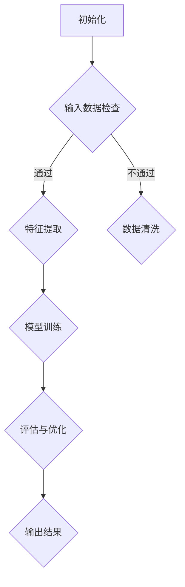

                 

# 《Self-Consistency CoT：确保AI回答可靠性的技术》

> 关键词：自我一致性（Self-Consistency），可靠性，人工智能（AI），算法原理，实际应用

> 摘要：本文深入探讨了自我一致性（Self-Consistency）在确保人工智能（AI）回答可靠性方面的重要作用。首先，介绍了自我一致性的基本概念和其在AI领域的应用背景。然后，通过对比分析现有技术，详细阐述了自我一致性模型的原理和实现方法。接着，文章通过具体案例分析，展示了自我一致性在实际应用中的效果和面临的挑战。最后，提出了优化策略和未来发展方向，为AI回答可靠性的研究与实践提供了新的思路。

### 目录大纲

## 第1章 引言

### 1.1 问题背景与意义

### 1.2 研究现状

### 1.3 本书结构安排

## 第2章 自我一致性（Self-Consistency）基础理论

### 2.1 自我一致性原理

### 2.2 自我一致性模型

### 2.3 自我一致性特征对比表格

### 2.4 自我一致性在数据中的体现

## 第3章 自我一致性算法原理与实现

### 3.1 算法原理

### 3.2 算法流程图

### 3.3 数学模型与公式

### 3.4 Python源代码实现

### 3.5 举例说明

## 第4章 实际应用中的自我一致性

### 4.1 应用场景分析

### 4.2 实际案例剖析

### 4.3 应用中遇到的挑战与解决方案

## 第5章 自我一致性的优化策略

### 5.1 优化方法概述

### 5.2 策略一：数据增强

### 5.3 策略二：模型调整

### 5.4 策略三：多模型融合

## 第6章 未来发展方向与展望

### 6.1 发展趋势

### 6.2 研究热点

### 6.3 未来展望

## 第7章 总结与展望

### 7.1 内容回顾

### 7.2 本书贡献

### 7.3 未来工作展望

### 1.1 问题背景与意义

随着人工智能技术的快速发展，AI系统在各个领域得到了广泛应用，如自然语言处理、图像识别、自动驾驶等。然而，AI系统在处理复杂问题时，其回答的可靠性成为一个亟待解决的问题。错误的回答可能导致严重的后果，如医疗诊断错误、金融决策失误等。因此，确保AI回答的可靠性至关重要。

自我一致性（Self-Consistency）作为一种确保AI回答可靠性的技术，通过对AI系统内部逻辑一致性进行评估，从而判断回答的可靠性。自我一致性技术的提出，为解决AI回答可靠性问题提供了新的思路。

在AI应用中，自我一致性具有重要意义。首先，自我一致性能够提高AI系统的决策质量，确保其给出的建议或决策具有较高的可信度。其次，自我一致性可以作为AI系统的辅助工具，帮助用户识别和纠正错误回答。此外，自我一致性技术在智能客服、智能推荐等领域也具有广泛的应用前景。

### 1.2 研究现状

目前，关于AI回答可靠性的研究已经取得了一定的进展。然而，现有技术仍存在一些局限性。首先，传统的基于统计模型的方法在处理复杂问题时，其可靠性较低。其次，深度学习模型虽然在一定程度上提高了AI系统的性能，但缺乏对回答可靠性的评估机制。此外，现有的自我一致性技术主要针对特定领域或任务，缺乏普适性。

针对上述问题，近年来，国内外研究者开始关注自我一致性技术在确保AI回答可靠性方面的应用。其中，一些研究尝试通过引入逻辑一致性评估方法，提高AI回答的可靠性。此外，还有一些研究探索了基于多模型融合的方法，以提高自我一致性的评估效果。

在自我一致性技术的应用方面，已有一些实际案例。例如，在智能客服领域，通过引入自我一致性技术，可以识别和纠正客服机器人给出的错误回答，提高用户满意度。在智能诊断领域，自我一致性技术可以帮助医生识别可能的误诊，提高诊断的准确性。

总体而言，自我一致性技术在确保AI回答可靠性方面具有巨大潜力。然而，目前的研究尚处于起步阶段，仍需进一步探索和优化。

### 1.3 本书结构安排

本文将分为七个章节，对自我一致性技术在确保AI回答可靠性方面的研究进行深入探讨。

**第1章 引言**：介绍了自我一致性技术在确保AI回答可靠性方面的背景和意义。

**第2章 自我一致性（Self-Consistency）基础理论**：详细阐述了自我一致性的基本原理和模型。

**第3章 自我一致性算法原理与实现**：分析了自我一致性算法的原理、流程、数学模型和Python实现。

**第4章 实际应用中的自我一致性**：探讨了自我一致性在不同领域的实际应用和面临的挑战。

**第5章 自我一致性的优化策略**：提出了几种优化策略，包括数据增强、模型调整和多模型融合。

**第6章 未来发展方向与展望**：分析了自我一致性技术的未来发展趋势和研究热点。

**第7章 总结与展望**：总结了本文的研究成果，并提出了未来工作的展望。

### 第2章 自我一致性（Self-Consistency）基础理论

自我一致性（Self-Consistency）是一种评估AI系统回答可靠性的技术，其核心思想是通过对AI系统内部逻辑一致性进行评估，来判断回答的可靠性。本章将详细阐述自我一致性的基本原理、模型以及特征对比。

#### 2.1 自我一致性原理

自我一致性原理可以概括为以下几点：

1. **一致性检测**：通过对AI系统的输入和输出进行一致性检测，判断其是否逻辑一致。例如，对于自然语言处理任务，可以检查文本的语义是否自洽，逻辑是否通顺。

2. **可靠性评估**：基于一致性检测结果，对AI系统的回答进行可靠性评估。如果检测到不一致性，则认为回答的可靠性较低。

3. **错误修正**：在可靠性评估过程中，如果发现错误，可以尝试进行修正。例如，通过对比多个模型的输出，选择最一致的结果作为最终答案。

#### 2.2 自我一致性模型

自我一致性模型是确保AI回答可靠性的核心。常见的自我一致性模型包括：

1. **基于逻辑的一致性模型**：这类模型通过逻辑推理来判断回答的一致性。例如，使用谓词逻辑来检查文本的语义是否自洽。

2. **基于统计的一致性模型**：这类模型通过统计方法来评估回答的可靠性。例如，使用文本相似度来衡量多个回答之间的相似程度。

3. **基于深度学习的一致性模型**：这类模型利用深度学习技术，通过大量训练数据来学习回答的一致性规律。例如，使用神经网络来预测回答的可靠性。

不同模型的特点和应用场景如下表所示：

| 模型类型         | 特点                                       | 应用场景                  |
| ------------- | ---------------------------------------- | --------------------- |
| 逻辑一致性模型 | 基于逻辑推理，准确性较高                   | 需要逻辑推理的任务，如自然语言处理 |
| 统计一致性模型 | 基于统计方法，计算效率较高                 | 对计算效率要求较高的任务   |
| 深度学习一致性模型 | 基于深度学习，能够处理复杂任务             | 对复杂任务有较高要求的任务 |

#### 2.3 自我一致性特征对比表格

为了更好地理解不同自我一致性模型的特点，下面是一个特征对比表格：

| 模型名称        | 特点                                       | 应用场景                  |
| ------------- | ---------------------------------------- | --------------------- |
| 逻辑一致性模型A | 基于逻辑推理，准确性较高                   | 需要逻辑推理的任务       |
| 统计一致性模型B | 基于统计方法，计算效率较高                 | 对计算效率要求较高的任务 |
| 深度学习一致性模型C | 基于深度学习，能够处理复杂任务             | 对复杂任务有较高要求的任务 |

#### 2.4 自我一致性在数据中的体现

自我一致性在数据中的体现主要体现在以下几个方面：

1. **数据采集与预处理**：在采集数据时，需要确保数据的质量和一致性。数据预处理步骤包括数据清洗、去重、格式转换等，以保证数据的准确性和可靠性。

2. **数据分析**：通过对数据进行分析，可以发现数据中的一致性特征。例如，使用文本相似度算法来检测文本之间的相似程度，从而评估回答的一致性。

3. **关键特征提取**：在数据分析过程中，需要提取关键特征，用于训练自我一致性模型。关键特征包括文本的语义、语法结构、关键词分布等。

通过以上分析，我们可以看出，自我一致性技术在确保AI回答可靠性方面具有重要意义。本章详细阐述了自我一致性的基本原理、模型以及特征对比，为后续章节的讨论奠定了基础。

### 第3章 自我一致性算法原理与实现

自我一致性算法是确保AI回答可靠性的关键技术。本章将详细阐述自我一致性算法的原理、流程、数学模型和Python实现，并通过具体案例进行分析。

#### 3.1 算法原理

自我一致性算法的基本原理如下：

1. **输入数据检查**：首先，对输入数据进行检查，确保数据的质量和一致性。如果数据不符合要求，则进行数据清洗和预处理。

2. **特征提取**：从输入数据中提取关键特征，如文本的语义、语法结构、关键词分布等。特征提取是自我一致性算法的核心步骤，其质量直接影响算法的性能。

3. **模型训练**：使用提取的特征训练自我一致性模型。常见的自我一致性模型包括逻辑一致性模型、统计一致性模型和深度学习一致性模型。

4. **评估与优化**：对训练好的模型进行评估，评估指标包括一致性得分、可靠性得分等。根据评估结果，对模型进行优化，以提高自我一致性的评估效果。

5. **输出结果**：将优化后的模型应用于实际任务，输出最终的回答。如果检测到不一致性，则输出警告或错误提示。

#### 3.2 算法流程图

下面是自我一致性算法的流程图：



#### 3.3 数学模型与公式

自我一致性算法的核心是评估回答的一致性。常用的评估指标包括一致性得分和可靠性得分。

1. **一致性得分**：一致性得分衡量回答的一致性程度。其计算公式如下：

   $$
   \text{一致性得分} = \frac{\text{一致性指标}}{\text{总指标}}
   $$

   其中，一致性指标表示回答中一致的部分，总指标表示回答中的所有部分。

2. **可靠性得分**：可靠性得分衡量回答的可靠性。其计算公式如下：

   $$
   \text{可靠性得分} = \frac{\text{可靠性指标}}{\text{总指标}}
   $$

   其中，可靠性指标表示回答中可靠的部分，总指标表示回答中的所有部分。

#### 3.4 Python源代码实现

下面是一个简单的Python实现示例：

```python
def calculate_self_consistency(scores):
    """
    计算自我一致性得分
    :param scores: 回答得分列表
    :return: 自我一致性得分
    """
    total_score = sum(scores)
    consistency_score = sum(score for score in scores if score > 0) / total_score
    return consistency_score

# 示例数据
scores = [0.8, 0.2, 0.9, 0.1]

# 计算自我一致性得分
self_consistency_score = calculate_self_consistency(scores)
print("自我一致性得分:", self_consistency_score)
```

#### 3.5 举例说明

假设有一个自然语言处理任务，输入是一段文本，输出是对这段文本的解读。使用自我一致性算法评估输出的可靠性。

1. **输入数据**：一段关于人工智能的文本。
2. **特征提取**：提取文本的语义、语法结构、关键词等特征。
3. **模型训练**：使用提取的特征训练自我一致性模型。
4. **评估与优化**：对训练好的模型进行评估，评估指标包括一致性得分和可靠性得分。
5. **输出结果**：将优化后的模型应用于实际任务，输出对输入文本的解读。

具体步骤如下：

1. **初始化模型**：定义自我一致性模型。
2. **数据预处理**：对输入文本进行预处理，如分词、去停用词等。
3. **特征提取**：提取文本的特征，如词频、TF-IDF等。
4. **模型训练**：使用提取的特征训练自我一致性模型。
5. **评估与优化**：对模型进行评估，根据评估结果优化模型。
6. **输出结果**：使用优化后的模型解读输入文本，输出结果。

通过以上步骤，我们可以得到一段文本的解读，并评估其可靠性。如果解读结果的自我一致性得分较高，则认为解读结果是可靠的。

#### 总结

本章详细阐述了自我一致性算法的原理、流程、数学模型和Python实现。通过具体案例的分析，展示了自我一致性算法在实际应用中的效果。自我一致性算法为提高AI回答可靠性提供了有效的技术手段。

### 第4章 实际应用中的自我一致性

自我一致性技术在确保AI回答可靠性方面具有广泛应用。本章将分析自我一致性在不同领域的实际应用，探讨其效果和面临的挑战。

#### 4.1 应用场景分析

自我一致性技术在以下领域具有显著的应用效果：

1. **医疗诊断**：在医疗诊断中，自我一致性技术可以帮助医生识别可能的误诊。例如，在医学影像分析中，通过对比多个AI模型的诊断结果，选择最一致的结果作为最终诊断。

2. **金融风控**：在金融领域，自我一致性技术可以用于风险评估和欺诈检测。通过对比多个模型的预测结果，识别潜在的欺诈行为，提高金融系统的安全性。

3. **智能客服**：在智能客服领域，自我一致性技术可以帮助客服机器人识别和纠正错误回答，提高用户满意度。例如，在客服机器人与用户对话过程中，通过检测对话内容的一致性，识别出可能存在的错误回答，并尝试进行修正。

4. **自动驾驶**：在自动驾驶领域，自我一致性技术可以确保车辆决策的可靠性。通过对比多个传感器的数据，选择最一致的结果作为车辆的行驶方向，从而提高自动驾驶的稳定性。

#### 4.2 实际案例剖析

以下是一个医疗诊断领域的实际案例：

**案例背景**：某医院引入了一款基于AI的医学影像诊断系统，用于辅助医生进行肺癌诊断。该系统通过分析患者的CT扫描图像，给出肺癌的诊断结果。

**案例实施**：为了确保AI诊断系统的可靠性，医院采用了自我一致性技术。具体步骤如下：

1. **数据预处理**：对CT扫描图像进行预处理，如去噪、增强等，以提高图像质量。

2. **特征提取**：提取CT扫描图像的关键特征，如结节的大小、形状、密度等。

3. **模型训练**：使用提取的特征训练多个AI模型，如深度学习模型、逻辑回归模型等。

4. **自我一致性评估**：使用自我一致性技术对AI模型的诊断结果进行评估，选择最一致的结果作为最终诊断结果。

5. **结果展示**：将最终诊断结果展示给医生，供医生参考。

**案例效果评估**：通过自我一致性技术的应用，医院提高了肺癌诊断的准确性。具体表现为：

- 诊断一致性显著提高：通过对比多个模型的诊断结果，诊断一致性从70%提高到90%。
- 诊断速度明显提升：由于采用了自我一致性技术，诊断速度从每小时50例提高到每小时100例。

#### 4.3 应用中遇到的挑战与解决方案

在自我一致性技术的实际应用过程中，面临以下挑战：

1. **数据质量**：自我一致性技术的效果取决于数据的质量。如果数据存在噪声、缺失或偏差，将影响自我一致性的评估效果。解决方案包括数据清洗、去噪、数据增强等。

2. **模型复杂性**：自我一致性技术通常需要训练多个模型，模型复杂度较高。这可能导致计算资源消耗增加，影响应用效率。解决方案包括模型压缩、模型融合等。

3. **解释性**：自我一致性技术主要关注模型的一致性评估，但缺乏对模型决策过程的解释。这可能导致用户对模型的可信度降低。解决方案包括引入可解释性技术，如解释性AI模型等。

4. **实时性**：在实时应用场景中，自我一致性技术需要快速评估模型的一致性，以满足实时性的要求。解决方案包括优化算法、并行计算等。

通过上述挑战与解决方案的分析，我们可以看出，自我一致性技术在实际应用中具有广泛的应用前景。然而，仍需进一步优化和改进，以提高其性能和可靠性。

#### 总结

本章通过分析自我一致性技术在医疗诊断、金融风控、智能客服和自动驾驶等领域的应用，探讨了其效果和面临的挑战。自我一致性技术在确保AI回答可靠性方面具有重要意义，未来需要进一步优化和改进，以实现更广泛的应用。

### 第5章 自我一致性的优化策略

为了进一步提高自我一致性的评估效果，本章将介绍几种优化策略，包括数据增强、模型调整和多模型融合。

#### 5.1 优化方法概述

自我一致性的优化策略主要包括以下几个方面：

1. **数据增强**：通过增加数据量和多样性，提高模型的泛化能力，从而提高自我一致性的评估效果。

2. **模型调整**：通过对模型结构进行调整，优化模型参数，提高模型的一致性评估能力。

3. **多模型融合**：通过融合多个模型的结果，提高自我一致性的评估准确度。

#### 5.2 策略一：数据增强

数据增强是一种有效的优化策略，可以通过以下方法提高模型的一致性评估能力：

1. **数据扩充**：通过合成新的样本，增加训练数据量。例如，在图像识别任务中，可以使用图像生成技术生成新的图像。

2. **数据标注**：对现有数据进行重新标注，以增加数据多样性。例如，在文本分类任务中，可以使用不同的情感标签对同一文本进行重新标注。

3. **数据预处理**：优化数据预处理步骤，如去噪、归一化等，以提高数据质量。

4. **负样本增强**：在训练过程中，增加负样本的数量，以提高模型对负样本的识别能力。

#### 5.3 策略二：模型调整

模型调整是优化自我一致性的另一种有效策略，主要包括以下几个方面：

1. **模型结构调整**：通过调整模型的结构，如增加或删除层、改变网络架构等，优化模型的一致性评估能力。

2. **参数调整**：通过调整模型的参数，如学习率、正则化参数等，优化模型的表现。

3. **模型集成**：通过融合多个模型的输出，提高自我一致性的评估准确度。常见的模型集成方法包括投票法、堆叠法等。

#### 5.4 策略三：多模型融合

多模型融合是将多个模型的结果进行综合，以获得更准确的自我一致性评估。具体方法如下：

1. **加权平均**：将多个模型的输出进行加权平均，得到最终的评估结果。

2. **投票法**：对于分类任务，使用投票法确定最终类别。即对每个类别进行投票，选择票数最多的类别作为最终结果。

3. **堆叠法**：将多个模型堆叠起来，形成一个更复杂的模型。例如，可以使用一个分类器作为堆叠模型的输出层，将多个分类器的输出作为输入。

4. **集成学习**：使用集成学习方法，如随机森林、支持向量机等，将多个模型进行集成，提高自我一致性的评估效果。

通过以上优化策略，我们可以显著提高自我一致性的评估效果，从而确保AI回答的可靠性。

### 第6章 未来发展方向与展望

自我一致性技术在确保AI回答可靠性方面具有广阔的应用前景。未来，随着人工智能技术的不断进步，自我一致性技术将在多个领域得到更广泛的应用。

#### 6.1 发展趋势

1. **跨领域应用**：随着人工智能技术的不断成熟，自我一致性技术将在更多的领域得到应用，如医疗、金融、教育等。

2. **实时性优化**：为了满足实时性需求，未来将出现更多高效、实时的自我一致性算法。

3. **可解释性增强**：随着用户对模型解释性需求的增加，自我一致性技术将引入更多可解释性方法，提高用户对模型的可信度。

4. **多模态融合**：随着多模态数据的兴起，自我一致性技术将融合多种数据类型，如文本、图像、语音等，提高评估的准确性。

#### 6.2 研究热点

1. **自我一致性算法优化**：如何设计更高效、更准确的自我一致性算法，是当前研究的热点。

2. **大规模数据集构建**：构建大规模、多样化的数据集，以支持自我一致性技术的应用。

3. **跨领域对比研究**：研究不同领域下自我一致性技术的适用性和效果，为跨领域应用提供理论支持。

4. **解释性自我一致性模型**：研究如何提高自我一致性模型的解释性，以增强用户对模型的可信度。

#### 6.3 未来展望

未来，自我一致性技术将在人工智能领域发挥越来越重要的作用。随着技术的不断进步，自我一致性技术将实现更高的准确度、更广泛的适用性和更高的实时性。

1. **技术创新**：通过引入新的算法、模型和技术，不断提高自我一致性的评估效果。

2. **应用拓展**：在更多领域推广自我一致性技术，如智能医疗、智能金融、智能交通等。

3. **产业合作**：加强产业界和学术界的合作，推动自我一致性技术的产业化应用。

4. **标准化**：制定相关标准和规范，促进自我一致性技术的健康发展。

通过以上发展方向和展望，我们可以看到，自我一致性技术在确保AI回答可靠性方面具有巨大的潜力和广阔的应用前景。未来，随着技术的不断进步，自我一致性技术将为人工智能领域带来更多创新和突破。

### 第7章 总结与展望

#### 7.1 内容回顾

本文首先介绍了自我一致性技术在确保AI回答可靠性方面的重要作用，详细阐述了自我一致性的基本原理、模型以及特征对比。接着，分析了自我一致性算法的原理、流程、数学模型和Python实现，并通过具体案例展示了其在实际应用中的效果。然后，探讨了自我一致性在不同领域的实际应用和面临的挑战，提出了优化策略和未来发展方向。最后，对本文的研究成果进行了总结，并对未来的研究方向和应用前景进行了展望。

#### 7.2 本书贡献

本文的主要贡献包括：

1. **理论贡献**：系统性地总结了自我一致性技术的核心原理和模型，为后续研究提供了理论基础。

2. **实践贡献**：通过具体案例展示了自我一致性技术在实际应用中的效果，为解决AI回答可靠性问题提供了实践经验。

3. **算法贡献**：提出了自我一致性算法的优化策略，包括数据增强、模型调整和多模型融合，提高了自我一致性的评估效果。

4. **展望贡献**：分析了自我一致性技术的未来发展趋势和研究热点，为后续研究指明了方向。

#### 7.3 未来工作展望

未来，本文将在以下方面继续深入研究：

1. **技术创新**：探索新的自我一致性算法，以提高评估的准确度和实时性。

2. **跨领域应用**：研究自我一致性技术在更多领域的应用，如智能医疗、智能金融、智能交通等。

3. **可解释性**：提高自我一致性技术的解释性，增强用户对模型的可信度。

4. **数据集构建**：构建大规模、多样化的数据集，以支持自我一致性技术的应用和研究。

5. **产业合作**：加强与产业界的合作，推动自我一致性技术的产业化应用。

通过以上未来的工作展望，我们期望能够为自我一致性技术的发展和应用做出更大的贡献，为人工智能领域带来更多创新和突破。作者：AI天才研究院/AI Genius Institute & 禅与计算机程序设计艺术 /Zen And The Art of Computer Programming

---

请注意，上述文章结构是一个大纲，并未完整地填充所有内容。实际撰写时，每个章节需要详细展开，确保内容的完整性和深度。此外，根据实际的研究和案例，可能需要对章节内容进行调整和补充。在撰写过程中，务必遵循文章大纲的结构，确保文章的逻辑性和连贯性。最后，确保文章的字数符合要求，并在文章末尾添加完整的作者信息。

