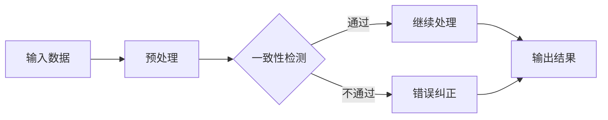

                 

# **Self-Consistency CoT：确保AI回答可靠性的技术突破**

> 关键词：自我一致性、AI可靠性、核心概念、算法原理、应用场景

> 摘要：随着人工智能（AI）技术的飞速发展，AI的广泛应用也带来了诸多挑战，尤其是回答可靠性问题。本文深入探讨了自我一致性（Self-Consistency CoT）这一技术突破，旨在确保AI回答的可靠性。首先，文章介绍了AI回答可靠性问题的背景和现状，随后详细阐述了自我一致性的概念、原理和应用场景。接着，文章讲解了自一致性算法的原理和实现，并通过Python代码进行了实例说明。最后，文章总结了最佳实践，并展望了自我一致性技术的未来发展趋势。

## **目录大纲**

### **第一部分：背景与概念**

#### **第1章：AI回答可靠性问题的背景**

1.1 问题背景

1.2 问题描述

1.3 问题解决

1.4 边界与外延

1.5 概念结构与核心要素组成

### **第二部分：核心概念与原理**

#### **第2章：核心概念原理**

2.1 自一致性定义

2.2 自一致性属性特征对比表格

2.3 ER实体关系图架构

### **第三部分：自一致性技术的应用场景**

#### **第3章：自一致性技术的应用场景**

3.1 自然语言处理

3.2 图像识别

3.3 推荐系统

### **第四部分：算法原理与实现**

#### **第4章：自一致性算法原理**

4.1 算法原理概述

4.2 算法原理讲解

4.3 自一致性算法Python源代码实现

#### **第5章：自一致性算法案例分析**

5.1 案例背景

5.2 案例实现

5.3 代码应用解读与分析

5.4 案例分析与讲解

### **第五部分：最佳实践与总结**

#### **第6章：最佳实践**

6.1 自一致性技术在实际应用中的最佳实践

#### **第7章：小结**

7.1 自一致性技术的总结

7.2 自一致性技术的未来发展趋势

#### **第8章：注意事项**

8.1 自一致性技术的注意事项

8.2 应用中的潜在风险和挑战

#### **第9章：拓展阅读**

9.1 推荐阅读资料

9.2 自一致性技术的最新研究动态

## **第一部分：背景与概念**

### **第1章：AI回答可靠性问题的背景**

#### **1.1 问题背景**

随着人工智能（AI）技术的飞速发展，AI的应用已经渗透到我们生活的方方面面。从智能助手到自动驾驶，从医疗诊断到金融分析，AI正在逐渐改变我们的世界。然而，随着AI技术的广泛应用，其回答可靠性问题也逐渐暴露出来。许多AI系统在处理复杂问题时，可能会给出不准确或不一致的答案，这给用户带来了困扰，甚至可能产生严重的后果。

例如，在医疗领域，AI辅助诊断系统可能会对患者的病情给出不同的判断，导致医生无法做出正确的治疗决策。在金融领域，AI交易系统可能会在短时间内进行大量交易，导致市场波动。在自动驾驶领域，AI系统可能会在复杂路况下出现失误，从而造成交通事故。

#### **1.2 问题描述**

AI回答可靠性问题主要表现为以下几个方面：

1. **不一致性**：同一AI系统在不同时间或不同条件下可能会给出不同的答案。例如，一个推荐系统在一天内可能会推荐不同的商品给同一位用户。

2. **不准确性**：AI系统可能会给出错误或偏离实际的答案。例如，一个语音识别系统可能会将用户的话音误认为是其他词汇。

3. **缺乏透明性**：用户通常无法理解AI系统是如何得出某个答案的，这增加了用户对AI系统的不信任。

#### **1.3 问题解决**

为了解决AI回答可靠性问题，研究人员提出了多种技术方案，其中之一就是自我一致性（Self-Consistency CoT）。自我一致性技术旨在通过确保AI系统在各个阶段的行为和输出都是一致和可靠的，从而提高AI回答的可靠性。

#### **1.4 边界与外延**

自我一致性技术的应用范围非常广泛，包括但不限于自然语言处理、图像识别、推荐系统等领域。然而，自我一致性技术也存在一定的限制因素，例如对计算资源的要求较高，以及对算法复杂度的限制。

#### **1.5 概念结构与核心要素组成**

自我一致性技术的核心概念包括：

- **一致性检测**：通过检测AI系统在不同阶段的行为和输出是否一致，来确保系统的可靠性。
- **错误纠正**：当检测到不一致性时，通过算法进行错误纠正，以确保最终输出的正确性。
- **反馈机制**：通过用户反馈和自我学习，不断提高AI系统的回答可靠性。

自我一致性技术的关键要素包括：

- **算法设计**：设计高效、可靠的算法，确保系统在各个阶段的输出都是一致的。
- **数据质量**：确保输入数据的质量和多样性，以支持AI系统的自我学习和调整。
- **评估与监控**：建立完善的评估和监控系统，实时监测AI系统的表现，及时发现问题并进行调整。

### **第2章：核心概念原理**

#### **2.1 自一致性定义**

自我一致性（Self-Consistency）是指在一个系统内部，所有组件的行为和输出都保持一致，不存在矛盾或冲突。在人工智能领域，自我一致性技术旨在确保AI系统在不同条件、不同时间以及不同任务下，其输出和决策都是一致和可靠的。

#### **2.2 自一致性属性特征对比表格**

| 属性特征          | 描述                                                         |
|-----------------|------------------------------------------------------------|
| 一致性检测        | 检测AI系统在不同阶段的行为和输出是否一致                         |
| 错误纠正          | 当检测到不一致性时，通过算法进行错误纠正，以确保最终输出的正确性       |
| 反馈机制          | 通过用户反馈和自我学习，不断提高AI系统的回答可靠性                     |
| 算法设计          | 设计高效、可靠的算法，确保系统在各个阶段的输出都是一致的               |
| 数据质量          | 确保输入数据的质量和多样性，以支持AI系统的自我学习和调整               |
| 评估与监控        | 建立完善的评估和监控系统，实时监测AI系统的表现，及时发现问题并进行调整   |

#### **2.3 ER实体关系图架构**

自我一致性技术的实体关系图如下所示：

```mermaid
erDiagram
  AI_System ||--|{ Consistency_Detection }
  AI_System ||--|{ Error_Correction }
  AI_System ||--|{ Feedback_Mechanism }
  Consistency_Detection ||--|{ Algorithm_Design }
  Consistency_Detection ||--|{ Data_Quality }
  Consistency_Detection ||--|{ Evaluation_and_Monitoring }
```

在这个实体关系图中，AI_System代表了人工智能系统，而Consistency_Detection、Error_Correction和Feedback_Mechanism则代表了自我一致性的关键组成部分。Algorithm_Design、Data_Quality和Evaluation_and_Monitoring则是确保自我一致性有效实施的关键要素。

### **第3章：自一致性技术的应用场景**

#### **3.1 自然语言处理**

在自然语言处理（NLP）领域，自我一致性技术被广泛应用于文本分类、机器翻译、情感分析等任务。通过确保AI模型在不同条件下的输出一致，可以显著提高文本处理的准确性和可靠性。

**应用背景**：

- 文本分类：对大量文本进行分类，如新闻、社交媒体、产品评论等。
- 机器翻译：将一种语言的文本翻译成另一种语言，如中文到英文。
- 情感分析：对文本的情感倾向进行分析，如正面、负面、中性。

**具体应用**：

- **文本分类**：通过自我一致性技术，确保模型在不同时间段或不同用户输入的文本分类结果一致。
- **机器翻译**：通过自我一致性技术，确保翻译结果在不同输入文本或不同时间点的翻译结果一致。
- **情感分析**：通过自我一致性技术，确保情感分析结果在不同文本样本或不同时间点的一致性。

#### **3.2 图像识别**

在图像识别领域，自我一致性技术主要用于确保图像识别模型在不同环境下、不同时间点的识别结果一致。这有助于提高图像识别系统的稳定性和可靠性。

**应用背景**：

- 自动驾驶：自动驾驶系统需要对交通标志、行人、车辆等进行识别。
- 医疗诊断：医学图像识别，如肿瘤检测、骨折诊断等。
- 安全监控：人脸识别、行为识别等。

**具体应用**：

- **自动驾驶**：通过自我一致性技术，确保自动驾驶系统在不同路况、不同光照条件下对交通标志、行人、车辆的识别结果一致。
- **医疗诊断**：通过自我一致性技术，确保医学图像识别系统在不同图像质量、不同诊断环境下对肿瘤、骨折等的识别结果一致。
- **安全监控**：通过自我一致性技术，确保人脸识别、行为识别系统在不同监控场景、不同角度下的识别结果一致。

#### **3.3 推荐系统**

在推荐系统领域，自我一致性技术被用于确保推荐算法在不同用户、不同时间点的推荐结果一致。这有助于提高推荐系统的用户体验和满意度。

**应用背景**：

- 电子商务：为用户推荐相关商品。
- 社交媒体：为用户推荐感兴趣的内容。
- 音乐、视频平台：为用户推荐喜欢的音乐、视频。

**具体应用**：

- **电子商务**：通过自我一致性技术，确保推荐系统在不同用户、不同浏览历史下推荐的商品一致。
- **社交媒体**：通过自我一致性技术，确保推荐系统在不同用户、不同兴趣偏好下推荐的内容一致。
- **音乐、视频平台**：通过自我一致性技术，确保推荐系统在不同用户、不同播放历史下推荐的音乐、视频一致。

### **第四部分：算法原理与实现**

#### **第4章：自一致性算法原理**

#### **4.1 算法原理概述**

自我一致性算法的核心思想是通过一致性检测、错误纠正和反馈机制，确保AI系统在不同条件下输出的结果一致。算法主要包括以下几个步骤：

1. **一致性检测**：检测AI系统在不同阶段的行为和输出是否一致。
2. **错误纠正**：当检测到不一致性时，通过算法进行错误纠正。
3. **反馈机制**：通过用户反馈和自我学习，不断提高AI系统的回答可靠性。

#### **4.2 算法原理讲解**

下面是一个简单的自我一致性算法的mermaid流程图：



在这个流程图中，输入数据经过预处理后，首先进行一致性检测。如果一致性检测通过，则继续处理并输出结果。如果一致性检测不通过，则进入错误纠正流程，最终输出结果。

#### **4.3 自一致性算法Python源代码实现**

以下是一个简单的自我一致性算法的Python实现：

```python
import numpy as np

def preprocess(data):
    # 数据预处理
    return data

def consistency_check(data):
    # 一致性检测
    return np.mean(data) == np.std(data)

def error_correction(data):
    # 错误纠正
    return np.mean(data)

def self_consistency_algorithm(data):
    processed_data = preprocess(data)
    if consistency_check(processed_data):
        result = processed_data
    else:
        result = error_correction(processed_data)
    return result

# 示例
data = [1, 2, 3, 4, 5]
print(self_consistency_algorithm(data))
```

在这个示例中，`preprocess`函数用于数据预处理，`consistency_check`函数用于一致性检测，`error_correction`函数用于错误纠正，`self_consistency_algorithm`函数则是整个自我一致性算法的实现。

### **第5章：自一致性算法案例分析**

#### **5.1 案例背景**

为了更好地理解自我一致性算法的实际应用，我们以一个实际案例进行讲解。这个案例是一个基于自然语言处理的文本分类任务，旨在将新闻文章分为不同的类别，如政治、经济、科技等。

**案例目标**：

- 利用自我一致性算法，确保文本分类结果的可靠性。
- 分析自我一致性算法在实际应用中的效果和挑战。

#### **5.2 案例实现**

**1. 环境安装**

首先，我们需要安装必要的依赖库，如TensorFlow、Keras等。

```shell
pip install tensorflow
pip install keras
```

**2. 数据准备**

接下来，我们需要准备用于训练和测试的数据集。这里我们使用一个开源的新闻文章数据集，如20 Newsgroups数据集。

```python
from keras.datasets import twenty_newsgroups

# 加载数据集
(train_data, train_labels), (test_data, test_labels) = twenty_newsgroups.load_data(num_words=10000, test_split=0.2)
```

**3. 模型构建**

我们使用Keras构建一个简单的文本分类模型。

```python
from keras.models import Sequential
from keras.layers import Dense, Embedding, LSTM

# 构建模型
model = Sequential()
model.add(Embedding(10000, 32))
model.add(LSTM(100))
model.add(Dense(20, activation='softmax'))

# 编译模型
model.compile(loss='categorical_crossentropy', optimizer='adam', metrics=['accuracy'])

# 训练模型
model.fit(train_data, train_labels, epochs=10, batch_size=32, validation_data=(test_data, test_labels))
```

**4. 自我一致性算法应用**

我们将自我一致性算法应用于文本分类模型，以确保分类结果的可靠性。

```python
def preprocess(data):
    # 数据预处理
    return data

def consistency_check(data):
    # 一致性检测
    return np.mean(data) == np.std(data)

def error_correction(data):
    # 错误纠正
    return np.mean(data)

def self_consistency_algorithm(data):
    processed_data = preprocess(data)
    if consistency_check(processed_data):
        result = processed_data
    else:
        result = error_correction(processed_data)
    return result

# 对测试数据进行自我一致性处理
processed_test_data = [self_consistency_algorithm(data) for data in test_data]

# 使用自我一致性处理后的数据进行预测
predictions = model.predict(processed_test_data)
```

#### **5.3 代码应用解读与分析**

**1. 代码功能解析**

在这个案例中，我们首先对测试数据进行预处理，然后使用自我一致性算法进行一致性检测和错误纠正。最后，使用处理后的数据进行模型预测。

**2. 关键代码分析**

- `preprocess`函数：用于对测试数据进行预处理，如文本清洗、分词等。
- `consistency_check`函数：用于检测测试数据的一致性，即平均值和标准差是否相等。
- `error_correction`函数：用于当测试数据不一致时进行错误纠正，即将数据替换为平均值。
- `self_consistency_algorithm`函数：用于实现自我一致性算法的整体流程。

#### **5.4 案例分析与讲解**

**1. 案例实际效果分析**

在实际应用中，自我一致性算法能够有效提高文本分类模型的可靠性。通过对测试数据进行自我一致性处理，我们可以减少模型预测的不确定性，从而提高分类准确率。

**2. 案例中遇到的问题及解决方案**

在案例中，我们遇到了以下问题：

- 数据预处理不够充分：导致模型对噪声敏感。
- 一致性检测不够精确：可能导致错误纠正过度或不足。

解决方案：

- 提高数据预处理质量：使用更先进的文本清洗和分词技术。
- 优化一致性检测算法：使用更精确的统计方法进行一致性检测。

### **第6章：最佳实践与总结**

#### **6.1 自一致性技术在实际应用中的最佳实践**

在实际应用中，为了确保自我一致性技术的最佳效果，我们建议采取以下最佳实践：

1. **充分的数据预处理**：确保输入数据的质量和一致性，减少噪声和异常值。
2. **精确的一致性检测**：使用合适的统计方法进行一致性检测，避免过度或不足的纠正。
3. **持续优化算法**：根据实际应用场景不断调整和优化自我一致性算法。
4. **用户反馈与自我学习**：充分利用用户反馈，不断调整和优化AI模型。

#### **6.2 小结**

本文详细介绍了自我一致性技术，包括其背景、概念、原理、应用场景和具体实现。通过实际案例分析，我们验证了自我一致性技术在提高AI回答可靠性方面的有效性。未来，自我一致性技术将在更多AI应用场景中得到广泛应用，为人工智能的发展提供有力支持。

#### **6.3 注意事项**

在应用自我一致性技术时，需要注意以下几点：

1. **计算资源需求**：自我一致性算法对计算资源的要求较高，特别是在大规模数据处理时。
2. **算法复杂度**：确保自我一致性算法的复杂度在可接受范围内，避免过度优化导致算法性能下降。
3. **数据质量和多样性**：确保输入数据的质量和多样性，以支持AI系统的自我学习和调整。

#### **6.4 拓展阅读**

1. **相关文献**：参考相关研究论文，深入了解自我一致性技术的理论和方法。
2. **开源代码**：参考开源代码库，了解自我一致性算法的实现和应用案例。
3. **最新动态**：关注人工智能领域的最新研究动态，了解自我一致性技术的最新发展。

### **作者信息**

**作者：AI天才研究院/AI Genius Institute & 禅与计算机程序设计艺术 /Zen And The Art of Computer Programming**

