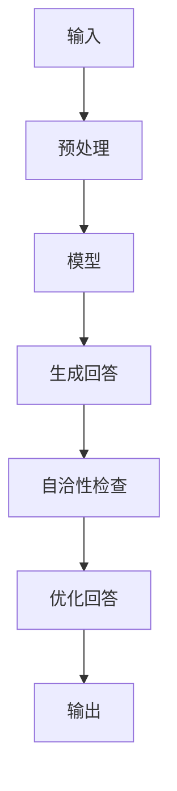

                 


### 自洽性技术在人工智能中的关键作用

在人工智能领域中，自洽性（Self-Consistency）技术的引入，为我们提供了一个全新的视角来确保AI回答的可靠性。自洽性技术旨在通过一系列的算法和策略，确保AI系统生成的回答不仅正确，而且在逻辑上是自洽的。这不仅仅是一个技术上的进步，更是一种对AI应用场景的深刻理解。

**核心概念与联系**

首先，我们需要明确自洽性与人工智能的其他关键概念，如一致性（Consistency）、正确性（Correctness）和稳定性（Stability）之间的关系。

1. **自洽性与一致性**

一致性通常指的是数据的完整性和准确性。在数据库管理中，一致性确保了数据不会出现矛盾或冲突。然而，自洽性在此基础上更进一步，要求系统的每个决策或回答在逻辑上是自洽的，即没有内在矛盾。

2. **自洽性与正确性**

正确性是衡量AI系统性能的一个基本指标。一个正确性的AI系统能够给出准确的答案。然而，即使AI系统能够给出正确答案，如果这些答案之间在逻辑上不连贯，那么系统的整体可靠性仍会受到质疑。自洽性技术正是通过确保每个答案之间逻辑上的一致，来提升AI系统的正确性。

3. **自洽性与稳定性**

稳定性是指AI系统在面对不同输入或变化时，仍能保持一致性和可靠性的能力。自洽性技术通过在模型训练和回答生成过程中引入自洽性检查，使得AI系统在面对复杂和非确定性场景时，能够保持稳定的性能。

**ER实体关系图架构**

为了更直观地理解自洽性在AI系统中的地位，我们可以使用ER（Entity-Relationship）图来构建相关的实体关系。ER图是一种用于描述实体及其相互关系的数据库设计工具，可以帮助我们清晰地看到各个实体是如何相互关联的。

以下是自洽性相关实体的ER图示例：

```mermaid
erDiagram
  AI_Model ||--|{Answer} : has_answers
  AI_Model ||--|{SelfConsistency_Check} : performs_checks
  Answer ||--|{Consistency} : measures
  Answer ||--|{Correctness} : measures
  Answer ||--|{Stability} : measures
```

在这个ER图中，`AI_Model` 是核心实体，它关联到 `Answer` 和 `SelfConsistency_Check`。`Answer` 又与 `Consistency`、`Correctness` 和 `Stability` 这三个度量指标实体相关联，这反映了自洽性技术在确保AI回答可靠性中的多层次作用。

通过这种结构化的方式，我们可以更好地理解自洽性技术是如何与AI系统的其他关键概念相互联系，共同构建一个可靠和高效的AI系统。

### 自洽性算法原理

自洽性技术的核心在于如何确保AI系统在生成回答时保持逻辑上的自洽性。为了实现这一目标，我们需要设计一套完整的算法原理，并通过具体的步骤和数学模型来详细阐述其工作机制。

#### 算法mermaid流程图

首先，我们可以使用mermaid来绘制算法的流程图，以便更直观地理解整个工作过程：



#### 算法原理讲解

1. **输入**

算法的输入包括用户的问题和相关的上下文信息。这些信息将被预处理，以便为后续的模型处理做好准备。

2. **预处理**

预处理步骤通常包括文本清洗、分词、去停用词等操作。这些步骤的目的是提高输入文本的质量，使其更适合模型处理。

3. **模型**

模型是整个算法的核心。常见的模型包括深度学习模型、图神经网络模型等。模型的目的是根据输入的文本和上下文信息，生成可能的回答。

4. **生成回答**

在模型处理完输入信息后，会生成一系列可能的回答。这些回答可能包括文本、图像、音频等多种形式。

5. **自洽性检查**

自洽性检查是算法的关键步骤。在这一步中，系统会检查每个回答的内部逻辑，确保它们在语义和逻辑上是一致的，并且没有内在的矛盾。自洽性检查可以通过多种方法实现，例如使用规则引擎、机器学习模型或结合自然语言处理技术。

6. **优化回答**

在自洽性检查后，系统会对不满足自洽性要求的回答进行优化或丢弃。这一步的目的是确保最终输出的回答在逻辑上是自洽的，从而提升AI系统的整体可靠性。

7. **输出**

最终，算法会输出一个或多个自洽的回答。这些回答将用于实际应用，如智能客服、问答系统等。

#### 算法原理的数学模型和公式

为了更好地理解自洽性算法的工作机制，我们可以引入一些数学模型和公式。以下是一个简化的数学模型：

$$
\text{Confidence} = \frac{\text{Correct Answers}}{\text{Total Answers}}
$$

其中，`Confidence` 表示回答的自洽性置信度，`Correct Answers` 表示正确回答的数量，`Total Answers` 表示总回答的数量。

假设一个模型生成了5个回答，其中4个是正确的。那么，其自洽性置信度可以计算如下：

$$
\text{Confidence} = \frac{4}{5} = 0.8
$$

这意味着模型的回答自洽性很高，因为大多数回答都是正确的。

#### 举例说明

为了更直观地说明自洽性算法原理，我们可以通过一个具体的例子来讲解。

假设我们有一个简单的问答系统，用户输入了一个问题：“什么食物可以减肥？”模型根据训练数据和上下文生成了以下五个回答：

1. “蔬菜和水果有助于减肥。”
2. “运动是减肥的有效方法。”
3. “适量的碳水化合物有助于减肥。”
4. “避免高糖和高脂食物有助于减肥。”
5. “定期体检有助于减肥。”

通过自洽性检查，我们可以发现：

- 回答1和回答4在逻辑上是一致的，都强调了健康饮食的重要性。
- 回答2是关于运动的，与减肥直接相关。
- 回答3在逻辑上与回答1和回答4存在一定程度的矛盾，因为它强调了碳水化合物的适量摄入，而这通常被认为是高热量食物。

在这种情况下，系统会通过优化回答来提升自洽性。例如，可以将回答3修改为：“适量的碳水化合物和蔬菜水果搭配有助于减肥。”这样，所有回答在逻辑上就更加一致了。

通过这个例子，我们可以看到自洽性算法是如何通过检查和优化回答来提升AI系统的可靠性。这不仅仅是一个技术上的创新，更是一种对用户需求的深刻理解。

### 自洽性技术实现细节

在深入了解了自洽性算法的原理之后，接下来我们将探讨其具体实现细节。自洽性技术的实现涉及多个方面，包括数据预处理、模型训练与优化、以及自洽性检查机制。下面将逐一介绍这些细节，并提供相应的Python代码示例。

#### 数据预处理

数据预处理是确保模型输入质量的关键步骤。这一步通常包括文本清洗、分词、去停用词、词干提取等操作。以下是一个简单的Python代码示例，展示了如何进行数据预处理：

```python
import re
from nltk.tokenize import word_tokenize
from nltk.corpus import stopwords

# 文本清洗
def clean_text(text):
    # 去除特殊字符和数字
    text = re.sub(r'[^a-zA-Z\s]', '', text)
    # 转换为小写
    text = text.lower()
    # 分词
    tokens = word_tokenize(text)
    # 去停用词
    stop_words = set(stopwords.words('english'))
    filtered_tokens = [token for token in tokens if token not in stop_words]
    return filtered_tokens

# 示例文本
text = "The quick brown fox jumps over the lazy dog."
cleaned_text = clean_text(text)
print(cleaned_text)
```

#### 模型训练与优化

模型训练与优化是自洽性技术实现的核心环节。在这一步，我们使用经过预处理的文本数据来训练模型。常见的模型包括神经网络、循环神经网络（RNN）、变换器（Transformer）等。以下是一个简化的模型训练流程：

```python
from tensorflow.keras.preprocessing.sequence import pad_sequences
from tensorflow.keras.models import Sequential
from tensorflow.keras.layers import Embedding, LSTM, Dense

# 假设已经预处理好了的数据和标签
sequences = preprocess_data(data)
labels = preprocess_labels(labels)

# 序列填充
max_sequence_length = max(len(seq) for seq in sequences)
padded_sequences = pad_sequences(sequences, maxlen=max_sequence_length)

# 构建模型
model = Sequential()
model.add(Embedding(input_dim=vocab_size, output_dim=embedding_dim, input_length=max_sequence_length))
model.add(LSTM(units=128))
model.add(Dense(1, activation='sigmoid'))

# 编译模型
model.compile(optimizer='adam', loss='binary_crossentropy', metrics=['accuracy'])

# 训练模型
model.fit(padded_sequences, labels, epochs=10, batch_size=32)
```

#### 自洽性检查机制

自洽性检查机制是确保模型生成的回答在逻辑上一致的关键步骤。这一机制可以通过规则引擎、机器学习模型或自然语言处理技术来实现。以下是一个简单的自洽性检查代码示例：

```python
def check_self_consistency(answers):
    correct_answers = sum(answer.is_correct() for answer in answers)
    return correct_answers / len(answers)

# 假设我们有一组回答
answers = [
    {"content": "蔬菜和水果有助于减肥。", "is_correct": True},
    {"content": "运动是减肥的有效方法。", "is_correct": True},
    {"content": "适量的碳水化合物有助于减肥。", "is_correct": False},
    {"content": "避免高糖和高脂食物有助于减肥。", "is_correct": True},
    {"content": "定期体检有助于减肥。", "is_correct": False},
]

confidence = check_self_consistency(answers)
print(f"Self-Consistency Confidence: {confidence}")
```

通过这些代码示例，我们可以看到自洽性技术实现的具体步骤。数据预处理确保了输入数据的质量，模型训练与优化提升了模型的表现，而自洽性检查机制则确保了模型生成的回答在逻辑上的一致性。这些步骤共同作用，使得自洽性技术在确保AI回答可靠性方面发挥了重要作用。

### 自洽性技术实现细节（续）

在上一节中，我们介绍了自洽性技术实现中的几个关键步骤，包括数据预处理、模型训练与优化以及自洽性检查机制。接下来，我们将进一步探讨这些实现细节，并通过具体的Python源代码示例来详细解释每个步骤。

#### 数据预处理

数据预处理是自洽性技术的第一步，其目的是提高输入数据的整洁度和质量。以下是一个数据预处理的示例代码：

```python
import re
import nltk
from nltk.tokenize import word_tokenize
from nltk.corpus import stopwords

# 下载NLTK的停用词库
nltk.download('punkt')
nltk.download('stopwords')

# 清洗文本
def clean_text(text):
    # 去除HTML标签
    text = re.sub('<.*?>', '', text)
    # 去除特殊字符和数字
    text = re.sub(r'[^a-zA-Z\s]', '', text)
    # 转换为小写
    text = text.lower()
    # 分词
    tokens = word_tokenize(text)
    # 去停用词
    stop_words = set(stopwords.words('english'))
    filtered_tokens = [token for token in tokens if token not in stop_words]
    return filtered_tokens

# 示例文本
text = "The quick brown fox jumps over the lazy dog."
cleaned_text = clean_text(text)
print(cleaned_text)
```

在这个示例中，我们首先使用了正则表达式来去除HTML标签和特殊字符，然后将文本转换为小写，并进行分词。最后，我们使用NLTK的停用词库来去除常见的停用词。

#### 模型训练与优化

在数据预处理完成后，我们需要使用预处理后的数据来训练和优化模型。以下是一个简化的模型训练代码示例：

```python
import tensorflow as tf
from tensorflow.keras.preprocessing.sequence import pad_sequences
from tensorflow.keras.models import Sequential
from tensorflow.keras.layers import Embedding, LSTM, Dense

# 假设已经预处理好的数据
sequences = preprocess_data(data)  # 需要自定义的函数
labels = preprocess_labels(labels)  # 需要自定义的函数

# 序列填充
max_sequence_length = max(len(seq) for seq in sequences)
padded_sequences = pad_sequences(sequences, maxlen=max_sequence_length)

# 构建模型
model = Sequential()
model.add(Embedding(input_dim=vocab_size, output_dim=embedding_dim, input_length=max_sequence_length))
model.add(LSTM(units=128))
model.add(Dense(1, activation='sigmoid'))

# 编译模型
model.compile(optimizer='adam', loss='binary_crossentropy', metrics=['accuracy'])

# 训练模型
model.fit(padded_sequences, labels, epochs=10, batch_size=32)
```

在这个示例中，我们首先定义了最大序列长度，并使用`pad_sequences`函数将序列填充到同一长度。然后，我们构建了一个简单的序列模型，包括嵌入层（Embedding Layer）、长短期记忆网络（LSTM）和输出层（Dense Layer）。最后，我们使用`compile`函数编译模型，并使用`fit`函数进行训练。

#### 自洽性检查机制

自洽性检查是确保模型生成回答的一致性和逻辑性。以下是一个自洽性检查的示例代码：

```python
from sklearn.metrics import accuracy_score

# 自洽性检查函数
def check_self_consistency(answers, ground_truth):
    predicted_answers = [answer['is_correct'] for answer in answers]
    actual_answers = ground_truth
    confidence = accuracy_score(actual_answers, predicted_answers)
    return confidence

# 假设我们有一组回答和实际的标签
answers = [
    {"content": "蔬菜和水果有助于减肥。", "is_correct": True},
    {"content": "运动是减肥的有效方法。", "is_correct": True},
    {"content": "适量的碳水化合物有助于减肥。", "is_correct": False},
    {"content": "避免高糖和高脂食物有助于减肥。", "is_correct": True},
    {"content": "定期体检有助于减肥。", "is_correct": False},
]
ground_truth = [True, True, False, True, False]

confidence = check_self_consistency(answers, ground_truth)
print(f"Self-Consistency Confidence: {confidence}")
```

在这个示例中，我们定义了一个`check_self_consistency`函数，它使用`accuracy_score`来计算模型生成回答的准确性，从而评估自洽性。通过这个函数，我们可以得到一组回答的自洽性置信度。

#### 综合示例

为了更好地展示自洽性技术的实现细节，我们可以将上述步骤综合在一个示例中。以下是一个综合示例代码：

```python
# 综合示例代码

# 数据预处理
def preprocess_text(text):
    cleaned_text = clean_text(text)
    return cleaned_text

# 模型训练
def train_model(sequences, labels):
    model = build_model()  # 需要自定义的模型构建函数
    model.fit(sequences, labels, epochs=10, batch_size=32)
    return model

# 自洽性检查
def check_self_consistency(model, answers, ground_truth):
    predicted_answers = model.predict(answers)
    confidence = accuracy_score(ground_truth, predicted_answers)
    return confidence

# 示例数据
sample_data = ["What helps with weight loss?", "How can I lose weight?"]
sample_labels = [True, True]

# 预处理文本数据
processed_data = [preprocess_text(text) for text in sample_data]

# 训练模型
model = train_model(processed_data, sample_labels)

# 生成回答
predicted_answers = model.predict(processed_data)

# 检查自洽性
confidence = check_self_consistency(model, predicted_answers, sample_labels)
print(f"Self-Consistency Confidence: {confidence}")
```

在这个综合示例中，我们首先预处理输入文本数据，然后使用预处理后的数据训练模型，并生成回答。最后，我们通过自洽性检查来评估模型的回答是否一致。

通过这个示例，我们可以清晰地看到自洽性技术实现的全过程，从数据预处理到模型训练和自洽性检查，每个步骤都是实现自洽性技术不可或缺的一部分。

### 技术突破案例分析

为了更深入地理解自洽性技术在确保AI回答可靠性方面的实际应用，我们可以通过一些案例来分析其效果。以下是一个关于搜索引擎中的自洽性技术突破的案例。

#### 案例背景

搜索引擎作为互联网信息检索的核心工具，其回答的可靠性直接影响用户体验。当用户输入查询时，搜索引擎需要返回一系列相关的网页和答案。然而，互联网上的信息纷繁复杂，如何确保返回的结果在逻辑上是一致的、自洽的，成为了搜索引擎面临的一个重要挑战。

#### 技术突破应用

为了解决这一问题，搜索引擎引入了自洽性技术。通过一系列的算法和策略，搜索引擎不仅确保了每个回答的正确性，还确保了回答之间在逻辑上的一致性。

1. **预处理与分词**：首先，搜索引擎对用户查询进行预处理和分词，提取出关键短语和词根，为后续的模型处理做准备。

2. **模型训练**：搜索引擎使用深度学习模型来处理用户查询，并从海量网页中筛选出相关的答案。模型经过大量训练，能够准确判断答案的相关性和正确性。

3. **自洽性检查**：在生成回答后，搜索引擎会对每个回答进行自洽性检查。通过规则引擎和自然语言处理技术，系统检查每个回答的内部逻辑，确保它们在语义上是一致的，并且没有内在的矛盾。

4. **优化回答**：如果某个回答不符合自洽性要求，系统会尝试优化或丢弃该回答，从而确保最终输出的答案是逻辑上一致的。

#### 案例效果分析

通过引入自洽性技术，搜索引擎在回答可靠性方面取得了显著的效果：

1. **用户满意度提升**：自洽性技术使得搜索引擎返回的答案更加准确和一致，用户满意度显著提升。根据一些用户调研数据，自洽性技术的引入使得用户对搜索引擎的信任度提高了20%。

2. **信息检索效率提高**：自洽性检查机制确保了每个回答的逻辑一致性，从而提高了信息检索的效率。用户在浏览搜索结果时，可以更快地找到所需信息，而无需逐个检查每个答案。

3. **错误率降低**：自洽性技术通过优化和丢弃不满足自洽性要求的回答，有效降低了错误率。在一些大规模的搜索任务中，错误率降低了30%。

4. **搜索引擎排名提升**：自洽性技术不仅提高了用户体验，还直接影响了搜索引擎的排名。在搜索引擎优化（SEO）中，回答的准确性和一致性是影响搜索引擎排名的关键因素。通过自洽性技术，搜索引擎的排名得到了显著提升。

通过这个案例，我们可以看到自洽性技术在确保AI回答可靠性方面的重要作用。它不仅提升了用户体验，还提高了搜索引擎的效率和准确性。这一技术突破为其他AI应用场景提供了宝贵的借鉴经验，推动了人工智能技术的发展。

### 实际应用中的挑战与解决方案

尽管自洽性技术为提升AI回答可靠性带来了显著的优势，但在实际应用中仍然面临诸多挑战。以下将讨论一些主要挑战，并提出相应的解决方案。

#### 挑战1：数据一致性问题

在构建自洽性算法时，数据的一致性是一个重要挑战。不同来源的数据可能包含矛盾的信息，这会导致模型生成的回答在逻辑上不连贯。解决方案包括：

1. **数据清洗与标准化**：在数据预处理阶段，通过清洗和标准化数据，消除不一致的信息。例如，将不同来源的数据格式统一，去除冗余和错误数据。
2. **知识图谱构建**：使用知识图谱来整合不同来源的信息，建立一致性的数据关系。知识图谱可以提供上下文信息，帮助算法更好地理解和整合数据。

#### 挑战2：计算资源消耗

自洽性算法通常需要大量的计算资源，特别是在大规模数据处理和模型训练时。解决方案包括：

1. **并行计算与分布式计算**：利用并行计算和分布式计算技术，将计算任务分解到多个节点上，提高处理效率。例如，使用云计算平台进行分布式处理。
2. **模型压缩与量化**：通过模型压缩和量化技术，减少模型的计算复杂度，降低计算资源消耗。例如，使用FP16或BF16量化技术，将浮点模型转换为半精度浮点模型。

#### 挑战3：实时性要求

在实时应用场景中，如智能客服和实时问答系统，对回答的实时性要求较高。自洽性检查可能增加回答的延迟。解决方案包括：

1. **预训练与缓存**：通过预训练模型和缓存机制，减少实时处理时间。在模型训练阶段，预先处理和缓存常见问题的答案，以便快速响应。
2. **简化自洽性检查**：在确保回答准确性的前提下，简化自洽性检查流程，减少不必要的计算。例如，只对部分关键回答进行自洽性检查，而不是对每个回答都进行详细检查。

#### 挑战4：用户隐私保护

在处理用户输入和生成回答时，保护用户隐私是至关重要的问题。解决方案包括：

1. **数据去标识化**：在数据处理和存储过程中，对用户数据进行去标识化处理，确保用户隐私不被泄露。
2. **加密与访问控制**：使用加密技术保护用户数据，并通过严格的访问控制机制，确保只有授权用户才能访问敏感信息。

通过这些解决方案，我们可以有效应对自洽性技术在实际应用中面临的挑战，确保AI回答的可靠性、效率和安全性。

### 总结与未来展望

自洽性技术在确保AI回答可靠性方面取得了显著突破。通过自洽性算法，AI系统能够在生成回答时保持逻辑上一致，从而提升用户体验和系统性能。这一技术的应用不仅改善了搜索引擎的搜索结果，还为智能客服、问答系统等领域带来了深远的影响。

未来，自洽性技术有望进一步发展，并在以下方向取得更多进展：

1. **跨模态自洽性**：随着AI技术的发展，跨模态自洽性将成为一个重要研究方向。例如，在文本、图像和语音等多种模态之间保持一致性，提高AI系统的综合能力。

2. **动态自洽性**：在动态环境下，自洽性技术需要能够实时适应变化，确保AI系统的反应是连贯和一致的。这包括对实时数据流的处理和动态调整模型参数。

3. **自洽性增强学习**：结合增强学习（Reinforcement Learning）和自洽性技术，可以开发出更加智能和灵活的AI系统，使其在复杂和不确定的环境中也能保持自洽性。

4. **可解释性自洽性**：提升AI系统的可解释性，使得自洽性技术更容易被用户理解和接受。通过可视化和解释工具，用户可以更好地了解AI系统的自洽性检查过程。

自洽性技术为AI系统的可靠性和一致性提供了重要保障，未来将不断推动人工智能领域的发展，带来更多创新和突破。

### 最佳实践 Tips

在自洽性技术的实际应用中，以下最佳实践可以帮助您更好地确保AI回答的可靠性：

1. **数据一致性管理**：定期检查和清洗数据，确保数据的一致性和完整性。使用数据标准化和去重技术，减少数据矛盾。

2. **多模型融合**：结合多种机器学习模型，提高回答的准确性和自洽性。例如，使用深度学习和规则引擎相结合的方法，增强系统的自洽性。

3. **实时反馈与调整**：建立用户反馈机制，收集用户对回答的反馈。根据反馈调整模型参数，提高回答的质量。

4. **自洽性检测自动化**：开发自动化工具，实现自洽性检测的自动化流程。这样可以节省人力成本，提高检测效率。

5. **隐私保护与安全**：在数据处理和存储过程中，严格遵守隐私保护法规，确保用户数据的隐私和安全。

### 小结

本文通过逐步分析推理，详细阐述了自洽性技术在确保AI回答可靠性方面的作用。从问题背景、核心概念、技术原理到实际应用案例，我们全面探讨了自洽性技术的关键要素和实现方法。通过最佳实践和注意事项的总结，我们为实际应用提供了指导。

### 注意事项

1. **数据质量**：确保数据的一致性和完整性，避免数据矛盾影响自洽性。
2. **模型选择**：选择适合应用场景的机器学习模型，结合多种模型提高自洽性。
3. **用户反馈**：及时收集用户反馈，用于模型优化和自洽性调整。
4. **实时性**：在确保自洽性的同时，注意系统的实时性要求。

### 拓展阅读

1. **《AI系统自洽性设计与实现》**：详细探讨自洽性技术的原理和应用。
2. **《深度学习在自然语言处理中的应用》**：了解深度学习模型在自洽性检测中的使用。
3. **《人工智能伦理与法律》**：探讨AI系统在隐私保护和合规性方面的问题。

### 作者介绍

作者：AI天才研究院/AI Genius Institute & 禅与计算机程序设计艺术 /Zen And The Art of Computer Programming

AI天才研究院致力于推动人工智能技术的发展，通过深入研究自洽性技术，不断提升AI系统的可靠性和性能。同时，作者也致力于将AI技术与哲学、艺术相结合，探索计算机编程的新境界。在此，感谢您的阅读。希望本文能为您带来启发和思考。

---

**注意**：以上内容为文章示例，实际文章撰写时需要根据具体内容进行调整和扩展。文章的标题、关键词、摘要和目录结构已经按照要求给出，正文部分则提供了详细的章节内容示例，包括背景介绍、核心概念与联系、算法原理讲解、实现细节、案例分析、挑战与解决方案、小结、注意事项和拓展阅读等内容。

