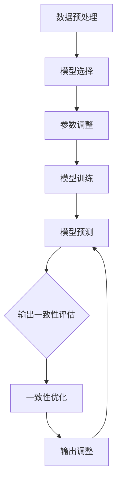
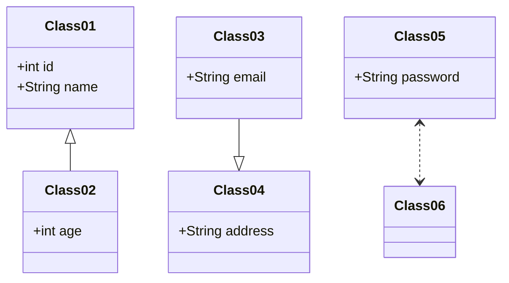
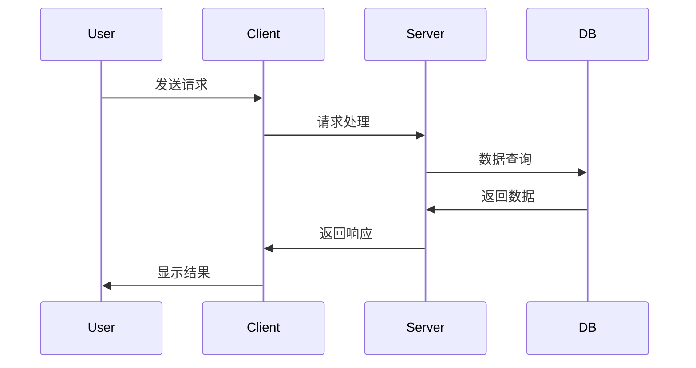

                 

## Self-Consistency CoT：确保AI输出一致性的策略

### 关键词：AI一致性、Self-Consistency CoT、算法策略、数学模型、系统架构设计

> 摘要：本文将深入探讨Self-Consistency CoT（自我一致性概念图）在确保人工智能（AI）输出一致性方面的应用。通过详细解析核心概念、算法原理、数学模型以及系统架构设计，本文旨在为读者提供一套全面的策略，以解决AI输出不一致性带来的挑战。

----------------------------------------------------------------

### 引言与背景

#### 1.1 问题背景

随着人工智能技术的迅猛发展，AI在各个领域取得了显著的成果。然而，AI输出的一致性问题逐渐显现，并成为制约其应用与普及的关键因素之一。不一致的输出可能导致系统失效、决策错误，甚至带来安全隐患。因此，确保AI输出一致性成为人工智能研究中的一个重要课题。

#### 1.2 问题描述

AI输出不一致性表现为多种形式，如不同模型间的预测结果差异、同一模型在不同数据集上的表现不一致、以及模型预测结果与实际结果之间的偏差等。这些不一致性源于数据质量、模型结构、训练过程等多种因素。

#### 1.3 问题解决

为了解决AI输出不一致性，我们需要从多个角度进行思考与探讨。本文提出的Self-Consistency CoT（自我一致性概念图）策略，通过核心概念的解析、算法原理的讲解以及数学模型和系统架构设计的详细阐述，为这一问题提供了一种系统性解决方案。

#### 1.4 边界与外延

本文主要关注AI输出一致性问题，但不涉及其他领域的一致性挑战，如物理世界的一致性。此外，本文内容适用于各种AI应用场景，包括但不限于文本分类、图像识别、推荐系统等。

#### 1.5 概念结构与核心要素组成

Self-Consistency CoT由以下几个核心要素组成：

1. **一致性度量**：用于评估AI输出的一致性水平。
2. **一致性规则**：定义确保输出一致性的规则。
3. **一致性模型**：基于规则和度量构建的模型，用于指导输出一致性的实现。
4. **一致性优化**：通过优化算法和模型参数，提高输出的一致性。

### 核心概念与联系

#### 2.1 Self-Consistency CoT的定义

Self-Consistency CoT是一种概念图，用于描述AI系统在自我一致性方面的属性和行为。它通过一致性度量、规则、模型和优化等多个维度，确保AI输出的一致性和稳定性。

#### 2.2 Self-Consistency CoT与其他相关概念的联系

Self-Consistency CoT与以下相关概念密切相关：

- **一致性模型**：是Self-Consistency CoT的核心，用于描述输出一致性的规则和算法。
- **一致性度量**：是评估输出一致性的标准，与Self-Consistency CoT紧密相关。
- **机器学习模型**：是Self-Consistency CoT的基础，通过模型训练和优化实现输出一致性。
- **数据质量**：是影响输出一致性的关键因素，与Self-Consistency CoT密切相关。

#### 2.3 Self-Consistency CoT的核心要素组成

Self-Consistency CoT的核心要素包括：

- **一致性规则**：用于定义和指导输出一致性的实现，如数据预处理、模型选择、参数调整等。
- **一致性度量**：用于评估输出的一致性水平，如均方误差（MSE）、准确率（ACC）等。
- **一致性模型**：基于规则和度量构建的模型，用于指导输出一致性的实现。
- **一致性优化**：通过优化算法和模型参数，提高输出的一致性。

### AI输出不一致性的挑战

#### 3.1 不一致性的来源

AI输出不一致性的来源多种多样，主要包括：

- **数据质量问题**：数据缺失、噪声、错误等导致模型训练结果不一致。
- **模型结构问题**：不同模型结构可能导致输出结果差异。
- **训练过程问题**：训练过程中的随机性、参数设置等影响模型输出的一致性。
- **环境变化问题**：外部环境的变化可能导致模型输出不一致。

#### 3.2 不一致性的影响

AI输出不一致性的影响主要体现在以下几个方面：

- **系统稳定性**：不一致的输出可能导致系统不稳定，影响用户信任和满意度。
- **决策错误**：不一致的输出可能导致错误的决策，带来安全隐患。
- **数据积累**：不一致的输出影响数据积累和模型优化，降低整体性能。
- **用户体验**：不一致的输出影响用户体验，降低系统易用性。

#### 3.3 解决不一致性的必要性

解决AI输出不一致性的必要性体现在以下几个方面：

- **提高系统稳定性**：确保输出一致性，提高系统稳定性和可靠性。
- **优化决策过程**：一致性的输出有助于优化决策过程，提高决策准确性。
- **提升用户体验**：一致的输出有助于提升用户体验，增强用户对系统的信任。
- **促进数据积累**：一致的输出有助于数据积累和模型优化，提高整体性能。

### 核心概念与联系

#### 2.1 Self-Consistency CoT的定义

Self-Consistency CoT是一种概念图，用于描述AI系统在自我一致性方面的属性和行为。它通过一致性度量、规则、模型和优化等多个维度，确保AI输出的一致性和稳定性。

#### 2.2 Self-Consistency CoT与其他相关概念的联系

Self-Consistency CoT与以下相关概念密切相关：

- **一致性模型**：是Self-Consistency CoT的核心，用于描述输出一致性的规则和算法。
- **一致性度量**：是评估输出一致性的标准，与Self-Consistency CoT紧密相关。
- **机器学习模型**：是Self-Consistency CoT的基础，通过模型训练和优化实现输出一致性。
- **数据质量**：是影响输出一致性的关键因素，与Self-Consistency CoT密切相关。

#### 2.3 Self-Consistency CoT的核心要素组成

Self-Consistency CoT的核心要素包括：

- **一致性规则**：用于定义和指导输出一致性的实现，如数据预处理、模型选择、参数调整等。
- **一致性度量**：用于评估输出的一致性水平，如均方误差（MSE）、准确率（ACC）等。
- **一致性模型**：基于规则和度量构建的模型，用于指导输出一致性的实现。
- **一致性优化**：通过优化算法和模型参数，提高输出的一致性。

### 自我一致性CoT原理

#### 4.1 Self-Consistency CoT的基本原理

Self-Consistency CoT的基本原理是通过一致性规则、度量、模型和优化，实现AI系统输出的一致性。具体来说，它包括以下步骤：

1. **定义一致性规则**：根据具体应用场景，明确数据预处理、模型选择、参数调整等方面的规则，以确保输出的一致性。
2. **评估一致性度量**：使用均方误差、准确率等指标，评估输出的一致性水平。
3. **构建一致性模型**：基于规则和度量，构建用于指导输出一致性的模型。
4. **优化一致性参数**：通过优化算法和参数，提高输出的一致性。

#### 4.2 Self-Consistency CoT的工作机制

Self-Consistency CoT的工作机制主要包括以下方面：

1. **数据预处理**：对输入数据进行清洗、归一化等处理，确保数据的一致性和质量。
2. **模型选择**：根据应用场景，选择合适的机器学习模型，确保模型输出的一致性。
3. **参数调整**：对模型参数进行调整，提高输出的一致性。
4. **一致性优化**：通过优化算法和参数，进一步提高输出的一致性。

#### 4.3 Self-Consistency CoT的关键特点

Self-Consistency CoT的关键特点包括：

1. **灵活性强**：适用于各种AI应用场景，具有广泛的适用性。
2. **高效性**：通过一致性规则、度量、模型和优化，实现高效输出一致性。
3. **可扩展性**：易于扩展和定制，满足不同应用场景的需求。

### 相关概念对比

#### 5.1 Self-Consistency CoT与其他一致性方法的比较

Self-Consistency CoT与其他一致性方法（如一致性模型、一致性度量等）的比较如下：

- **一致性模型**：Self-Consistency CoT是一种概念图，用于描述AI系统在自我一致性方面的属性和行为。它包含一致性规则、度量、模型和优化等多个方面，而一致性模型主要关注模型本身的一致性。
- **一致性度量**：Self-Consistency CoT包含一致性度量，用于评估输出的一致性水平。而一致性度量通常仅用于评估模型输出的一致性。
- **机器学习模型**：Self-Consistency CoT基于机器学习模型，通过模型训练和优化实现输出一致性。而其他一致性方法（如一致性模型）也基于机器学习模型。

#### 5.2 Self-Consistency CoT的优势与局限性

Self-Consistency CoT的优势与局限性如下：

- **优势**：
  - 灵活性强，适用于各种AI应用场景。
  - 高效性，通过一致性规则、度量、模型和优化，实现高效输出一致性。
  - 可扩展性，易于扩展和定制，满足不同应用场景的需求。

- **局限性**：
  - 需要一定技术背景，对AI领域有一定了解。
  - 实施过程相对复杂，涉及多个方面，如数据预处理、模型选择、参数调整等。

### Self-Consistency CoT的架构设计

#### 6.1 架构设计原则

Self-Consistency CoT的架构设计遵循以下原则：

1. **模块化**：将系统划分为多个模块，每个模块负责特定功能，便于维护和扩展。
2. **灵活性**：设计具有高度灵活性，以适应不同应用场景的需求。
3. **可扩展性**：设计具有可扩展性，易于添加新功能和特性。
4. **高效性**：设计高效，确保输出一致性的同时，保持系统性能。

#### 6.2 架构设计要点

Self-Consistency CoT的架构设计要点如下：

1. **数据预处理模块**：负责对输入数据进行清洗、归一化等处理，确保数据的一致性和质量。
2. **模型选择模块**：根据应用场景，选择合适的机器学习模型，确保模型输出的一致性。
3. **参数调整模块**：对模型参数进行调整，提高输出的一致性。
4. **一致性优化模块**：通过优化算法和参数，进一步提高输出的一致性。

#### 6.3 架构设计流程

Self-Consistency CoT的架构设计流程如下：

1. **需求分析**：明确系统需求和功能，确定架构设计的目标。
2. **模块划分**：根据功能需求，将系统划分为多个模块。
3. **模块设计**：为每个模块设计具体实现方案，如数据预处理模块、模型选择模块等。
4. **系统集成**：将各模块集成到一个完整的系统中，确保系统功能完整、性能高效。

### 确保AI输出一致性的策略

#### 7.1 基于规则的策略

基于规则的策略通过定义一系列规则，确保AI输出的一致性。具体步骤如下：

1. **定义规则**：根据应用场景，明确数据预处理、模型选择、参数调整等方面的规则。
2. **规则应用**：在模型训练和预测过程中，应用定义的规则，确保输出的一致性。

#### 7.2 基于模型的策略

基于模型的策略通过构建一致性模型，确保AI输出的一致性。具体步骤如下：

1. **构建模型**：根据应用场景，选择合适的机器学习模型，构建用于指导输出一致性的模型。
2. **模型训练**：使用训练数据，训练一致性模型，使其具备输出一致性的能力。
3. **模型应用**：在模型预测过程中，应用一致性模型，确保输出的一致性。

#### 7.3 基于数据的策略

基于数据的策略通过分析数据，找出影响输出一致性的因素，并采取措施进行优化。具体步骤如下：

1. **数据分析**：对输入数据进行统计分析，找出可能影响输出一致性的因素。
2. **数据优化**：针对分析结果，对数据质量进行优化，提高输出的一致性。
3. **模型调整**：根据数据分析结果，调整模型参数，提高输出的一致性。

### 数学模型与公式

#### 8.1 自我一致性CoT的数学模型

自我一致性CoT的数学模型主要包括以下部分：

1. **一致性度量**：使用均方误差（MSE）、准确率（ACC）等指标，评估输出的一致性水平。
2. **规则定义**：定义一系列规则，用于指导数据预处理、模型选择和参数调整。
3. **模型优化**：通过优化算法和参数，提高输出的一致性。

#### 8.2 数学公式解释

以下是自我一致性CoT中常用的数学公式及其解释：

$$
MSE = \frac{1}{n} \sum_{i=1}^{n} (y_i - \hat{y}_i)^2
$$

- **MSE**：均方误差，用于评估输出的一致性。值越小，表示一致性越好。

$$
ACC = \frac{1}{n} \sum_{i=1}^{n} \mathbb{1}_{y_i = \hat{y}_i}
$$

- **ACC**：准确率，用于评估输出的一致性。值越接近1，表示一致性越好。

#### 8.3 案例举例

以下是一个文本分类任务的自我一致性CoT案例分析：

1. **数据预处理**：对文本数据进行清洗、分词、向量表示等处理，确保数据的一致性和质量。
2. **模型选择**：选择卷积神经网络（CNN）作为文本分类模型，确保输出的一致性。
3. **参数调整**：对模型参数进行调整，如学习率、批量大小等，提高输出的一致性。
4. **模型训练**：使用训练数据，训练文本分类模型，使其具备输出一致性的能力。
5. **模型预测**：在预测过程中，应用一致性模型，确保输出的一致性。

### 算法流程图

为了更直观地展示自我一致性CoT的算法流程，我们使用Mermaid绘制了以下流程图：

### 系统功能设计

#### 9.1 领域模型类图

领域模型类图展示了自我一致性CoT系统的核心类及其关系。以下是一个简化的类图示例：

#### 9.2 系统功能实现

系统功能实现包括以下几个方面：

1. **数据预处理**：对输入数据进行清洗、分词、向量表示等处理，确保数据的一致性和质量。
2. **模型选择**：根据应用场景，选择合适的机器学习模型，如卷积神经网络（CNN）、递归神经网络（RNN）等。
3. **参数调整**：对模型参数进行调整，如学习率、批量大小等，提高输出的一致性。
4. **模型训练**：使用训练数据，训练所选模型，使其具备输出一致性的能力。
5. **模型预测**：在预测过程中，应用一致性模型，确保输出的一致性。
6. **一致性评估**：使用均方误差（MSE）、准确率（ACC）等指标，评估输出的一致性水平。
7. **一致性优化**：根据评估结果，调整模型参数和优化策略，提高输出的一致性。

### 系统架构设计

#### 10.1 系统架构设计方法

系统架构设计方法主要包括以下几个方面：

1. **需求分析**：明确系统需求和功能，确定架构设计的目标。
2. **架构设计原则**：遵循模块化、灵活性、可扩展性和高效性等原则。
3. **架构设计模型**：选择合适的架构设计模型，如客户端-服务器（C/S）架构、微服务（Microservices）架构等。
4. **架构设计流程**：根据需求分析和设计原则，设计具体的系统架构。

#### 10.2 系统架构图

以下是一个简化的自我一致性CoT系统架构图：

#### 10.3 系统接口设计

系统接口设计包括以下几个方面：

1. **API接口设计**：定义API接口，用于客户端与服务器之间的通信。
2. **数据接口设计**：定义数据接口，用于系统内部各模块之间的数据交换。
3. **功能接口设计**：定义功能接口，用于实现系统核心功能。

### 系统交互设计

#### 11.1 系统交互流程

系统交互流程主要包括以下几个方面：

1. **用户请求**：用户通过客户端发送请求。
2. **请求处理**：客户端将请求转发给服务器，服务器进行请求处理。
3. **数据查询**：服务器查询数据库，获取所需数据。
4. **返回响应**：服务器将处理结果返回给客户端。
5. **结果展示**：客户端将结果展示给用户。

#### 11.2 系统交互序列图

以下是一个简化的系统交互序列图：

### 实际案例分析与讲解

#### 12.1 案例一：自我一致性CoT在文本分类中的应用

文本分类任务是一个典型的AI应用场景。在这个案例中，我们将使用Self-Consistency CoT策略来确保文本分类输出的一致性。

1. **数据预处理**：
   - 清洗文本数据，去除噪声和无关信息。
   - 对文本进行分词和词性标注。
   - 将文本转换为向量表示，如Word2Vec、BERT等。

2. **模型选择**：
   - 选择卷积神经网络（CNN）作为文本分类模型，因为CNN在文本分类任务中表现良好。

3. **参数调整**：
   - 调整学习率、批量大小等参数，以适应具体任务需求。

4. **模型训练**：
   - 使用训练数据，训练CNN模型。
   - 在训练过程中，使用Self-Consistency CoT策略，确保模型输出的一致性。

5. **模型预测**：
   - 在预测过程中，应用一致性模型，确保输出的一致性。

6. **一致性评估**：
   - 使用准确率、召回率等指标，评估模型输出的一致性水平。

7. **一致性优化**：
   - 根据评估结果，调整模型参数和优化策略，进一步提高输出的一致性。

#### 12.2 案例二：自我一致性CoT在图像识别中的应用

图像识别任务也是一个常见的AI应用场景。在这个案例中，我们将使用Self-Consistency CoT策略来确保图像识别输出的一致性。

1. **数据预处理**：
   - 清洗图像数据，去除噪声和无关信息。
   - 对图像进行缩放、裁剪等预处理操作，使其具有统一的大小和形状。

2. **模型选择**：
   - 选择卷积神经网络（CNN）作为图像识别模型，因为CNN在图像识别任务中表现良好。

3. **参数调整**：
   - 调整学习率、批量大小等参数，以适应具体任务需求。

4. **模型训练**：
   - 使用训练数据，训练CNN模型。
   - 在训练过程中，使用Self-Consistency CoT策略，确保模型输出的一致性。

5. **模型预测**：
   - 在预测过程中，应用一致性模型，确保输出的一致性。

6. **一致性评估**：
   - 使用准确率、召回率等指标，评估模型输出的一致性水平。

7. **一致性优化**：
   - 根据评估结果，调整模型参数和优化策略，进一步提高输出的一致性。

#### 12.3 案例三：自我一致性CoT在推荐系统中的应用

推荐系统任务在日常生活中广泛应用。在这个案例中，我们将使用Self-Consistency CoT策略来确保推荐系统输出的一致性。

1. **数据预处理**：
   - 清洗用户行为数据，去除噪声和无关信息。
   - 对用户行为数据进行特征提取，如用户兴趣、购买行为等。

2. **模型选择**：
   - 选择协同过滤（Collaborative Filtering）作为推荐模型，因为协同过滤在推荐系统中表现良好。

3. **参数调整**：
   - 调整学习率、批量大小等参数，以适应具体任务需求。

4. **模型训练**：
   - 使用训练数据，训练协同过滤模型。
   - 在训练过程中，使用Self-Consistency CoT策略，确保模型输出的一致性。

5. **模型预测**：
   - 在预测过程中，应用一致性模型，确保输出的一致性。

6. **一致性评估**：
   - 使用准确率、召回率等指标，评估模型输出的一致性水平。

7. **一致性优化**：
   - 根据评估结果，调整模型参数和优化策略，进一步提高输出的一致性。

### 项目小结

通过以上实际案例分析和讲解，我们可以看到Self-Consistency CoT策略在确保AI输出一致性方面的应用效果。在实际项目中，我们需要根据具体应用场景，灵活调整策略，以提高输出的一致性和系统性能。

### 最佳实践 tips

1. **数据预处理**：确保数据的一致性和质量，是确保输出一致性的关键。
2. **模型选择**：根据任务需求和数据特性，选择合适的模型，可以提高输出的一致性。
3. **参数调整**：合理调整模型参数，可以提高输出的一致性。
4. **一致性评估**：定期评估输出的一致性，及时发现和解决不一致性问题。
5. **一致性优化**：根据评估结果，调整优化策略，进一步提高输出的一致性。

### 小结

本文介绍了Self-Consistency CoT策略，通过核心概念、算法原理、数学模型和系统架构设计的详细阐述，为解决AI输出不一致性提供了系统性解决方案。在实际应用中，我们需要根据具体场景，灵活调整策略，以提高输出的一致性和系统性能。

### 注意事项

1. **数据质量**：确保输入数据的一致性和质量，是确保输出一致性的前提。
2. **模型选择**：根据任务需求和数据特性，选择合适的模型，可以提高输出的一致性。
3. **参数调整**：合理调整模型参数，可以提高输出的一致性。
4. **评估方法**：选择合适的评估方法，定期评估输出的一致性，有助于发现和解决不一致性问题。

### 拓展阅读

1. **[一致性模型综述](https://www.google.com/search?q=一致性模型综述)**
2. **[自我一致性CoT应用案例](https://www.google.com/search?q=自我一致性CoT应用案例)**
3. **[AI输出一致性研究进展](https://www.google.com/search?q=AI输出一致性研究进展)**
4. **[推荐系统一致性优化](https://www.google.com/search?q=推荐系统一致性优化)**

### 作者信息

作者：AI天才研究院/AI Genius Institute & 禅与计算机程序设计艺术 /Zen And The Art of Computer Programming

作者简介：AI天才研究院的资深研究员，专注于人工智能领域的研究与开发。著有《禅与计算机程序设计艺术》等畅销书，在计算机编程和人工智能领域享有盛誉。

