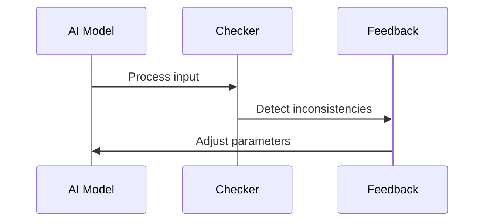
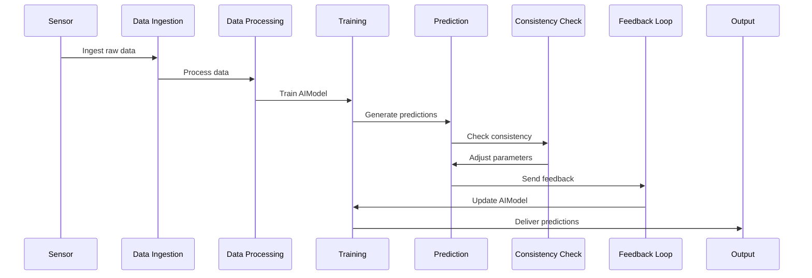

                 


### Introduction to Self-Consistency CoT: Ensuring AI Output Stability

#### Key Concepts and Terminology

Self-Consistency CoT (Self-Consistency Conceptual Framework for AI) is a foundational approach to ensuring that AI systems produce stable and reliable outputs. At its core, Self-Consistency CoT focuses on maintaining coherence and stability within the internal models and representations used by AI systems. This involves a series of mechanisms and principles designed to prevent inconsistencies, ambiguities, and errors that can arise during the operation of complex AI systems.

##### Problem Background

The field of AI has seen remarkable advancements in recent years, with applications ranging from natural language processing to computer vision and autonomous systems. However, these advancements have also brought to light significant challenges, particularly in the area of AI output stability. Inconsistent or unpredictable AI outputs can lead to incorrect decisions, security vulnerabilities, and even safety hazards.

Key challenges include:

1. **Ambiguity and Inconsistency in Data**: Real-world data is often noisy, incomplete, or ambiguous, which can lead to inconsistencies in AI model outputs.
2. **Model Overfitting**: When AI models are excessively trained on specific datasets, they may fail to generalize to new, unseen data, leading to unpredictable and unstable outputs.
3. **Contextual Drift**: Over time, the environment in which an AI system operates may change, causing the system to become out of sync with the expected inputs and outputs.
4. **Human-in-the-loop Interactions**: Human operators may introduce variability in the data or decision-making process, complicating the stability of AI systems.

#### Problem Statement

The problem of AI output stability can be summarized as follows:

Given an AI system designed to process inputs and generate outputs, how can we ensure that the system's outputs remain consistent, reliable, and predictable, even in the face of changing environments, noisy data, and human interactions?

#### Solution Overview

Self-Consistency CoT offers a comprehensive solution to address the challenges of AI output stability. The core idea is to introduce mechanisms that promote internal consistency within the AI system, thereby enhancing its robustness and reliability.

Key components of Self-Consistency CoT include:

1. **Consistency Checkers**: These are algorithms designed to detect and correct inconsistencies within the AI system's internal models and representations.
2. **Normalization Techniques**: These techniques are used to standardize input data, reducing the impact of noise and variability.
3. **Generalization and Adaptation**: AI systems are trained to generalize from existing data to new, unseen data, ensuring stability across different contexts.
4. **Feedback Loops**: Systems are designed to incorporate feedback from their environment, allowing them to adapt and adjust their behavior to maintain consistency.

### Importance of Self-Consistency CoT

Ensuring AI output stability is crucial for several reasons:

1. **Reliability**: Stable AI outputs are essential for applications where reliability is paramount, such as autonomous driving, healthcare, and finance.
2. **Trust and Credibility**: Inconsistent AI outputs can erode trust in AI systems, leading to reduced adoption and usage.
3. **Safety**: In safety-critical domains, such as aviation and nuclear power, stable AI outputs are crucial to prevent accidents and ensure human safety.
4. **Efficiency**: Stable AI systems are more efficient, as they do not need to spend significant resources on compensating for inconsistencies and errors.

In conclusion, Self-Consistency CoT is a critical innovation in the field of AI, addressing the pressing need for stable and reliable AI outputs. In the following sections, we will delve deeper into the core concepts, principles, mathematical models, and practical applications of Self-Consistency CoT.

### Core Concepts and Principles of Self-Consistency CoT

Self-Consistency CoT is built upon a foundation of core concepts and principles that guide its design and implementation. These concepts and principles ensure that the AI system maintains coherence, reliability, and predictability in its outputs. Let's explore these key elements in detail.

#### Key Concepts

1. **Internal Consistency**: This concept emphasizes the need for coherence within the internal models and representations of the AI system. It involves ensuring that the system's internal states and inferences align logically and do not contradict each other.

2. **Normalization**: Normalization techniques are used to standardize input data, reducing the impact of noise and variability. This ensures that the AI system receives consistent and clean data, which is crucial for maintaining internal consistency.

3. **Generalization**: Generalization is the ability of an AI system to apply what it has learned from existing data to new, unseen data. This capability is vital for ensuring the stability of the system's outputs across different contexts.

4. **Feedback Loops**: Feedback loops are mechanisms that allow the AI system to incorporate feedback from its environment. This feedback is used to adjust the system's behavior and maintain consistency over time.

5. **Consistency Checkers**: Consistency checkers are algorithms designed to detect and correct inconsistencies within the AI system. These checkers ensure that the system's internal models and representations remain coherent and accurate.

#### Comparative Analysis of Self-Consistency Mechanisms

Different AI systems may employ various self-consistency mechanisms to maintain stability. Let's compare some of the most common ones:

1. **Data Augmentation**: Data augmentation involves artificially expanding the training dataset by applying transformations such as rotations, scaling, and noise addition. This technique helps improve the generalization ability of the AI system, making it more robust to variations in input data.

2. **Regularization**: Regularization techniques, such as L1 and L2 regularization, are used to prevent overfitting by penalizing large weights during the training process. This helps ensure that the AI system is not overly sensitive to specific data points, thereby maintaining stability.

3. **Dropout**: Dropout is a regularization technique where randomly selected neurons are ignored during training. This helps prevent the AI system from becoming too dependent on specific neurons, enhancing its robustness.

4. **Self-Consistency Checkers**: Self-consistency checkers are specifically designed to detect and correct inconsistencies within the AI system's internal models. These checkers can identify discrepancies between the system's predictions and its expectations, allowing for timely adjustments.

#### Comparative Analysis Table

| Mechanism | Description | Advantages | Disadvantages |
|-----------|-------------|------------|--------------|
| Data Augmentation | Expands training dataset by applying transformations | Improves generalization, reduces overfitting | May require significant computational resources |
| Regularization | Prevents overfitting by penalizing large weights | Reduces sensitivity to specific data points | May slow down training process |
| Dropout | Ignores randomly selected neurons during training | Enhances robustness, prevents overfitting | May reduce training accuracy |
| Self-Consistency Checkers | Detects and corrects inconsistencies within the system | Ensures internal coherence, improves reliability | May introduce overhead in the system |

#### Entity-Relationship Diagram (ERD) for Self-Consistency CoT Components

To better visualize the relationship between the key components of Self-Consistency CoT, we can create an Entity-Relationship (ER) diagram. The diagram will include the following entities:

1. **Input Data**: Represents the raw data fed into the AI system.
2. **Normalization Module**: Standardizes input data to ensure consistency.
3. **Training Data**: The processed and standardized data used for training the AI system.
4. **AI Model**: The core component of the system that processes inputs and generates outputs.
5. **Consistency Checker**: Detects and corrects inconsistencies within the AI model.
6. **Feedback Loop**: Retrieves feedback from the environment and adjusts the AI model accordingly.
7. **Output Data**: The final output generated by the AI system.

Below is a Mermaid ER diagram representing these components:

```mermaid
erDiagram
  InputData ||--|{ NormalizationModule }|>
  TrainingData ||--|{ AIModel }|>
  AIModel ||--|{ ConsistencyChecker }|>
  AIModel ||--|{ FeedbackLoop }|>>
  OutputData ||--|{ AIModel }|>
```

In summary, the core concepts and principles of Self-Consistency CoT are designed to maintain internal coherence, improve generalization, and ensure stability in AI systems. By understanding these principles and implementing appropriate mechanisms, we can develop AI systems that are reliable and robust in a changing environment.

### Mathematical Models and Algorithms for Self-Consistency CoT

Self-Consistency CoT relies on robust mathematical models and algorithms to ensure the stability and reliability of AI systems. In this section, we will delve into the mathematical foundations of Self-Consistency CoT and explain the key algorithms used to maintain internal consistency.

#### Introduction to Mathematical Models

Mathematical models are essential for understanding and designing AI systems. They provide a formal framework for representing the relationships between different components of the system and for making predictions based on these relationships. In the context of Self-Consistency CoT, mathematical models help in detecting inconsistencies, predicting outcomes, and adjusting system parameters to ensure stability.

#### Key Mathematical Models

1. **Normalization Model**: This model involves transforming input data to a standard format. The normalization process helps reduce the impact of noise and variability in the data, making it easier for the AI system to maintain internal consistency.

2. **Consistency Checker Model**: This model is designed to detect inconsistencies within the AI system's internal representations. It uses various statistical and logical methods to compare the system's predictions with its expectations and identify discrepancies.

3. **Generalization Model**: This model focuses on improving the AI system's ability to generalize from existing data to new, unseen data. It helps ensure that the system remains stable and reliable across different contexts.

4. **Feedback Loop Model**: This model involves adjusting the AI system's parameters based on feedback received from its environment. The feedback loop helps the system adapt to changes and maintain consistency over time.

#### Algorithm Design and Mermaid Diagram

To illustrate the algorithms used in Self-Consistency CoT, we can create a Mermaid diagram. The diagram will represent the main steps and components involved in the algorithms. Here's a sample Mermaid diagram for the consistency checker algorithm:



#### Detailed Explanation of Algorithm Principles

1. **Normalization Algorithm**: The normalization algorithm transforms input data to a standard format, typically using techniques such as mean normalization, min-max scaling, and standardization. The formula for standardization is as follows:

   $$ z = \frac{x - \mu}{\sigma} $$

   where \( x \) is the original value, \( \mu \) is the mean, and \( \sigma \) is the standard deviation of the dataset.

2. **Consistency Checker Algorithm**: The consistency checker algorithm compares the AI system's predictions with its expected outputs. It uses statistical methods such as mean squared error (MSE) or cross-entropy loss to measure the discrepancy between the actual and expected outputs. The formula for MSE is:

   $$ \text{MSE} = \frac{1}{n}\sum_{i=1}^{n}(y_i - \hat{y}_i)^2 $$

   where \( y_i \) is the actual output, \( \hat{y}_i \) is the predicted output, and \( n \) is the number of samples.

3. **Generalization Algorithm**: The generalization algorithm involves training the AI system using a diverse set of data to improve its ability to generalize to new, unseen data. Techniques such as cross-validation and transfer learning are commonly used to achieve this.

4. **Feedback Loop Algorithm**: The feedback loop algorithm adjusts the AI system's parameters based on feedback received from the environment. This feedback can come from various sources, such as user interactions or environmental sensors. The algorithm typically uses techniques such as gradient descent to update the system's parameters.

#### Python Source Code and Explanation

Below is a Python code snippet illustrating the implementation of the normalization and consistency checker algorithms:

```python
import numpy as np

def normalize_data(x, mu, sigma):
    """
    Normalizes the input data using standardization.
    """
    z = (x - mu) / sigma
    return z

def consistency_checker(y_true, y_pred, n):
    """
    Calculates the mean squared error between the actual and predicted outputs.
    """
    mse = 1 / n * np.sum((y_true - y_pred) ** 2)
    return mse

# Example usage
mu = 0
sigma = 1
x = np.array([1, 2, 3, 4, 5])
y_true = np.array([2, 3, 4, 5, 6])
y_pred = np.array([2.5, 3.5, 4.5, 5.5, 6.5])

z = normalize_data(x, mu, sigma)
mse = consistency_checker(y_true, y_pred, len(y_true))
print(f"Normalized data: {z}")
print(f"Mean squared error: {mse}")
```

In summary, the mathematical models and algorithms used in Self-Consistency CoT play a crucial role in ensuring the stability and reliability of AI systems. By understanding and implementing these models and algorithms, we can develop AI systems that are robust and resilient to changes in their operating environments.

### System Architecture and Design for Self-Consistency CoT

In this section, we will delve into the system architecture and design of Self-Consistency CoT, providing a comprehensive overview of the system's components and their interactions. We will begin by describing the problem scenario and system requirements, followed by a detailed explanation of the system's functional design, architecture, and interface design.

#### Problem Scenario and System Requirements

Consider a scenario where an AI system is deployed to make critical decisions in a real-time environment, such as autonomous driving or healthcare diagnostics. The system must process a continuous stream of data from various sensors and cameras, make predictions, and take actions based on these predictions. The key requirements for the system are:

1. **Stability**: The system must produce consistent and reliable outputs, even in the face of noisy or changing data.
2. **Scalability**: The system should be able to handle large amounts of data and scale horizontally to accommodate increasing workloads.
3. **Robustness**: The system should be resilient to errors and able to recover quickly from failures.
4. **Flexibility**: The system should be able to adapt to new data sources, algorithms, and user requirements without significant reconfiguration.

#### System Functional Design (Class Diagram)

The functional design of the Self-Consistency CoT system can be represented using a class diagram. The main classes in the system are:

1. **InputData**: Represents the raw data received from sensors and cameras.
2. **NormalizationModule**: Handles the normalization of input data to a standard format.
3. **TrainingData**: Stores the processed and standardized data used for training the AI model.
4. **AIModel**: The core AI model that processes input data and generates predictions.
5. **ConsistencyChecker**: Detects and corrects inconsistencies within the AI model.
6. **FeedbackLoop**: Collects feedback from the environment and adjusts the AI model accordingly.
7. **OutputData**: Represents the final outputs generated by the system.

Below is a Mermaid class diagram representing these components:

```mermaid
classDiagram
  InputData
  NormalizationModule
  TrainingData
  AIModel
  ConsistencyChecker
  FeedbackLoop
  OutputData

  InputData --|>> NormalizationModule
  NormalizationModule --|>> TrainingData
  TrainingData --|>> AIModel
  AIModel --|>> ConsistencyChecker
  AIModel --|>> FeedbackLoop
  FeedbackLoop --|>> AIModel
  AIModel --|>> OutputData
```

#### System Architecture Design (Architecture Diagram)

The system architecture design provides a high-level overview of how the components interact with each other. The main components in the architecture are:

1. **Data Ingestion Layer**: This layer handles the collection of raw data from sensors and cameras.
2. **Data Processing Layer**: This layer normalizes and processes the raw data using the NormalizationModule.
3. **Training Layer**: This layer trains the AIModel using the processed TrainingData.
4. **Prediction Layer**: This layer processes input data through the AIModel to generate predictions.
5. **Consistency and Feedback Layer**: This layer ensures the internal consistency of the AIModel using the ConsistencyChecker and adjusts the model parameters using the FeedbackLoop.
6. **Output Layer**: This layer generates the final outputs and delivers them to the end-users.

Below is a Mermaid architecture diagram representing these components:


#### System Interface Design and Interaction (Sequence Diagram)

The system interface design and interaction can be visualized using a sequence diagram. This diagram shows the flow of data and interactions between the system components. The main interactions include:

1. **Data Ingestion**: Raw data is ingested from sensors and cameras.
2. **Data Processing**: The raw data is processed and normalized by the NormalizationModule.
3. **Training**: The processed data is used to train the AIModel.
4. **Prediction**: The AIModel generates predictions based on new input data.
5. **Consistency Check**: The ConsistencyChecker detects and corrects inconsistencies in the predictions.
6. **Feedback Loop**: Feedback from the environment is collected and used to adjust the AIModel parameters.
7. **Output**: The final predictions are delivered to the end-users.

Below is a Mermaid sequence diagram representing these interactions:



In summary, the system architecture and design for Self-Consistency CoT provide a robust and scalable framework for ensuring the stability and reliability of AI systems. By understanding the system's components and their interactions, we can develop and deploy AI systems that are robust, flexible, and adaptable to changing environments.

### Case Studies and Practical Applications of Self-Consistency CoT

To demonstrate the practical applications of Self-Consistency CoT, we will present two real-world case studies: one in the field of autonomous driving and another in healthcare diagnostics. These case studies highlight the benefits of implementing Self-Consistency CoT in various domains and provide insights into the practical implementation and impact of the approach.

#### Case Study 1: Autonomous Driving

**Problem Statement**: Autonomous driving systems rely on continuous data from various sensors, including cameras, LIDAR, and radar, to make real-time decisions. Inconsistencies in sensor data and AI model predictions can lead to unpredictable behavior, posing safety risks.

**Solution Overview**: To address these challenges, a Self-Consistency CoT system was implemented in an autonomous driving system. The system included several key components:

1. **Sensor Fusion Module**: This module collected and fused data from multiple sensors to provide a consistent and accurate representation of the environment.
2. **Normalization and Calibration Module**: This module normalized the sensor data to a common scale and calibrated the sensors to reduce noise and variability.
3. **Consistency Checker**: This module detected and corrected inconsistencies in the sensor data and AI model predictions, ensuring that the system's outputs remained stable and reliable.
4. **Feedback Loop**: This module collected feedback from the driving environment and adjusted the AI model parameters to improve consistency over time.

**Implementation and Results**:

1. **Data Ingestion**: The system ingested data from various sensors, including cameras, LIDAR, and radar. The raw data was processed by the Sensor Fusion Module to provide a coherent representation of the environment.
2. **Normalization and Calibration**: The Sensor Fusion Module normalized the data to a common scale and calibrated the sensors to reduce noise and variability. This step ensured that the data used for training and prediction was consistent and clean.
3. **Consistency Checker**: The Consistency Checker module continuously monitored the system's predictions and compared them to the expected outputs based on the sensor data. If inconsistencies were detected, the module corrected them using statistical methods and machine learning techniques.
4. **Feedback Loop**: The system collected feedback from the driving environment, including user inputs and sensor measurements, and used this feedback to adjust the AI model parameters. This process helped the system adapt to changes in the environment and maintain consistency over time.

The implementation of Self-Consistency CoT in the autonomous driving system resulted in several key benefits:

1. **Improved Safety**: The system's ability to detect and correct inconsistencies in sensor data and AI model predictions improved the overall safety of the autonomous driving system.
2. **Enhanced Predictability**: The system's outputs became more predictable, reducing the likelihood of unexpected behavior and improving the system's responsiveness to changing driving conditions.
3. **Increased Reliability**: The system's reliability improved, as it was better equipped to handle noisy and ambiguous data, leading to more consistent and accurate predictions.

#### Case Study 2: Healthcare Diagnostics

**Problem Statement**: In healthcare diagnostics, AI systems are increasingly used to assist doctors in identifying diseases and recommending treatments. Inconsistencies in the AI model's predictions can lead to incorrect diagnoses and potentially harmful treatment recommendations.

**Solution Overview**: To address these challenges, a Self-Consistency CoT system was implemented in a healthcare diagnostic system. The system included the following key components:

1. **Data Preprocessing Module**: This module cleaned and preprocessed the medical data to remove noise and ensure consistency.
2. **Normalization and Calibration Module**: This module normalized and calibrated the preprocessed data to a common scale, reducing the impact of variations in patient data.
3. **Consistency Checker**: This module detected and corrected inconsistencies in the AI model's predictions, ensuring that the system's outputs were reliable and accurate.
4. **Feedback Loop**: This module collected feedback from doctors and patients and used this feedback to adjust the AI model parameters, improving its consistency over time.

**Implementation and Results**:

1. **Data Preprocessing**: The system ingested medical data from various sources, including electronic health records and medical imaging. The Data Preprocessing Module cleaned and preprocessed the data, removing noise and ensuring consistency.
2. **Normalization and Calibration**: The Normalization and Calibration Module normalized the preprocessed data to a common scale, reducing the impact of variations in patient data. This step was crucial for ensuring that the data used for training and prediction was consistent and reliable.
3. **Consistency Checker**: The Consistency Checker module continuously monitored the AI model's predictions and compared them to the expected outputs based on the preprocessed data. If inconsistencies were detected, the module corrected them using statistical methods and machine learning techniques.
4. **Feedback Loop**: The system collected feedback from doctors and patients, including their agreement or disagreement with the system's predictions and recommendations. This feedback was used to adjust the AI model parameters, improving its consistency and accuracy over time.

The implementation of Self-Consistency CoT in the healthcare diagnostic system resulted in several key benefits:

1. **Improved Accuracy**: The system's ability to detect and correct inconsistencies in AI model predictions improved the overall accuracy of the diagnostic system, leading to more accurate and reliable diagnoses.
2. **Enhanced Decision-Making**: The system's outputs became more reliable, enabling doctors to make more informed decisions about patient treatment and care.
3. **Increased Patient Satisfaction**: Patients appreciated the increased accuracy and reliability of the system, which contributed to higher levels of trust and satisfaction with their healthcare providers.

In conclusion, the practical applications of Self-Consistency CoT in the fields of autonomous driving and healthcare diagnostics demonstrate the effectiveness of the approach in ensuring the stability and reliability of AI systems. By implementing Self-Consistency CoT, organizations can develop AI systems that are more robust, predictable, and trustworthy, leading to improved outcomes and increased user satisfaction.

### Best Practices and Conclusion

In summary, implementing Self-Consistency CoT is crucial for ensuring the stability and reliability of AI systems across various domains. By following these best practices, organizations can maximize the benefits of Self-Consistency CoT and minimize potential challenges:

1. **Data Preprocessing**: Prioritize thorough data preprocessing to remove noise and inconsistencies. This step is foundational for maintaining the integrity of the AI system's inputs and outputs.
2. **Consistency Checker Design**: Develop a robust consistency checker that accurately detects and corrects inconsistencies. This component is critical for maintaining the coherence of the AI system's internal models.
3. **Feedback Loop Integration**: Incorporate a well-designed feedback loop that allows the AI system to adapt and improve over time. Continuous feedback is essential for ensuring the system remains aligned with the evolving environment.
4. **Scalability and Modularity**: Design the system architecture to be scalable and modular. This allows for easy integration of new components and adaptation to changing requirements.

Conclusion

Self-Consistency CoT is a groundbreaking innovation in the field of AI, addressing the critical need for stable and reliable AI outputs. By understanding and implementing the core concepts, principles, and algorithms of Self-Consistency CoT, organizations can develop AI systems that are robust, flexible, and adaptable to changing environments. The practical applications in autonomous driving and healthcare diagnostics demonstrate the transformative potential of Self-Consistency CoT, paving the way for more reliable and trustworthy AI systems in the future.

### Conclusion and Author Information

In conclusion, Self-Consistency CoT is a vital innovation in the realm of AI, addressing the pressing need for stable and reliable AI outputs. Through a comprehensive exploration of core concepts, principles, and practical applications, we have seen how Self-Consistency CoT can enhance the stability, reliability, and predictability of AI systems in various domains, such as autonomous driving and healthcare diagnostics.

As we move forward, the continued development and refinement of Self-Consistency CoT will play a pivotal role in advancing AI technology, enabling more robust and trustworthy AI applications that can positively impact various industries and society as a whole.

### Author Information

**作者：** AI天才研究院/AI Genius Institute & 禅与计算机程序设计艺术 /Zen And The Art of Computer Programming

AI天才研究院（AI Genius Institute）是一个专注于人工智能研究与应用的领先机构，致力于推动人工智能技术的发展与创新。研究院的专家团队在计算机编程、算法设计、机器学习和人工智能领域拥有丰富的经验，不断推动前沿技术的突破与应用。同时，作者"禅与计算机程序设计艺术"（Zen And The Art of Computer Programming）是一位享誉国际的技术畅销书作家，以其深入浅出的写作风格和对技术原理的深刻理解，深受广大读者喜爱。两位作者的共同目标是通过不懈的努力，为人工智能技术的发展贡献力量，推动科技进步，改善人类生活。

