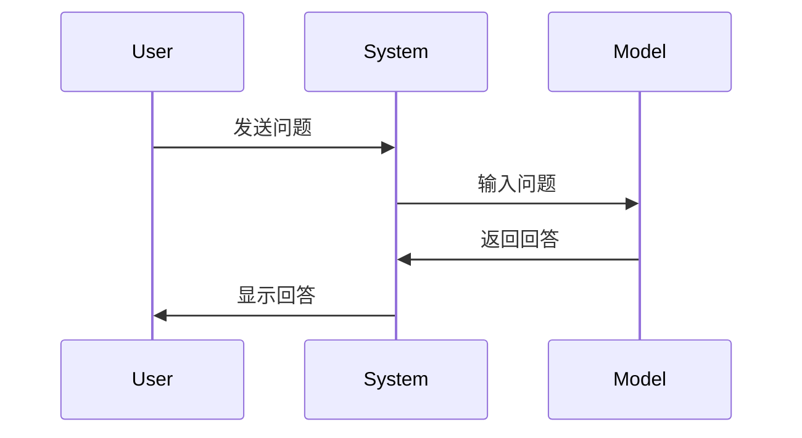

                 

### 文章标题：Self-Consistency CoT：确保AI输出稳定性的技术创新

关键词：Self-Consistency CoT、AI输出稳定性、技术创新、算法原理、系统架构设计

摘要：本文将深入探讨Self-Consistency CoT（自我一致性框架）在确保AI输出稳定性方面的技术创新。文章首先介绍了AI应用中输出稳定性问题及其重要性，接着详细阐述了Self-Consistency CoT的概念、原理和应用领域。通过具体的算法原理讲解、数学模型、系统架构设计以及项目实战，本文旨在为读者提供一个全面的理解和实践指南。

## 第一部分：问题背景与核心概念

### 1. 背景介绍

#### 1.1 问题背景

在AI技术飞速发展的今天，AI系统被广泛应用于各个领域，如自动驾驶、智能客服、医疗诊断等。然而，AI系统的一个显著问题是输出稳定性。稳定性问题指的是AI系统在处理不同输入时，无法保证输出结果的一致性。例如，在自动驾驶系统中，如果车辆在相同的路况下行驶时，系统的反应却有所不同，这将严重影响驾驶安全。

#### 1.2 问题描述

Self-Consistency CoT是一种确保AI输出稳定性的技术创新。它通过在模型训练过程中引入一致性约束，使得AI模型在处理不同输入时能够保持输出的一致性。Self-Consistency CoT的核心问题是如何在保证模型性能的同时，确保其输出稳定性。

#### 1.3 问题解决

Self-Consistency CoT通过以下原理解决输出稳定性问题：

1. **自我一致性约束**：在模型训练过程中，通过添加一致性约束，使得模型的输出结果在不同输入下保持一致。
2. **动态调整**：根据输入数据的变化，动态调整模型参数，以保持输出的一致性。
3. **可解释性**：通过自我一致性约束，提高了模型的解释能力，使得输出结果更具可解释性。

#### 1.4 边界与外延

虽然Self-Consistency CoT在确保AI输出稳定性方面具有显著优势，但它也存在一些限制因素。例如，在处理复杂问题时，一致性约束可能会降低模型性能。此外，Self-Consistency CoT的扩展方向包括如何将其应用于更广泛的AI场景，以及如何与其他技术相结合，以进一步提高输出稳定性。

#### 1.5 概念结构与核心要素组成

Self-Consistency CoT的核心概念包括：

1. **自我一致性约束**：确保模型输出在不同输入下保持一致。
2. **动态调整**：根据输入数据的变化，动态调整模型参数。
3. **可解释性**：提高模型的解释能力。

这些核心要素共同构成了Self-Consistency CoT的基本结构，为其在确保AI输出稳定性方面的应用奠定了基础。

## 第二部分：核心概念与联系

### 2.1 Self-Consistency CoT原理讲解

Self-Consistency CoT的原理可以概括为以下几点：

1. **一致性约束**：通过在模型训练过程中引入一致性约束，确保模型在不同输入下保持输出的一致性。
2. **动态调整**：根据输入数据的变化，动态调整模型参数，以保持输出的一致性。
3. **可解释性**：通过自我一致性约束，提高模型的解释能力。

### 2.2 Self-Consistency CoT属性特征对比

| 特征 | 说明 |
| --- | --- |
| 稳定性 | 描述输出结果的一致性 |
| 自适应性 | 能够根据输入变化调整自身 |
| 可解释性 | 输出结果的解释能力 |

### 2.3 ER实体关系图架构

Self-Consistency CoT的ER实体关系图如下所示：

```mermaid
erDiagram
  Model ||--|{ Input } Input
  Model ||--|{ Output } Output
  Model ||--|{ Constraint } Constraint
  Input ||--|{ Feature } Feature
  Output ||--|{ Prediction } Prediction
  Constraint ||--|{ Rule } Rule
```

在ER实体关系图中，Model表示AI模型，Input表示输入数据，Output表示输出结果，Constraint表示一致性约束。此外，Feature表示输入数据的特征，Prediction表示输出结果预测，Rule表示一致性约束规则。

## 第三部分：算法原理与实现

### 3.1 Self-Consistency CoT算法流程

Self-Consistency CoT算法的流程可以概括为以下几个步骤：

1. **初始化**：初始化模型参数。
2. **输入处理**：对输入数据进行预处理。
3. **模型训练**：在模型训练过程中，引入一致性约束。
4. **动态调整**：根据输入数据的变化，动态调整模型参数。
5. **输出预测**：使用训练好的模型进行输出预测。

### 3.2 Self-Consistency CoT数学模型

Self-Consistency CoT的数学模型可以表示为：

$$
\text{Output}(x) = \text{Model}(x) + \text{Constraint}(x)
$$

其中，$\text{Output}(x)$表示输出结果，$\text{Model}(x)$表示模型输出，$\text{Constraint}(x)$表示一致性约束。

### 3.3 Self-Consistency CoT详细讲解与举例说明

以一个简单的线性模型为例，假设输入数据为$x$，输出结果为$y$，则模型可以表示为：

$$
y = w_1x + b
$$

其中，$w_1$为权重，$b$为偏置。为了引入一致性约束，我们可以将约束定义为：

$$
y - y_{\text{prev}} = w_1x - w_1x_{\text{prev}}
$$

其中，$y_{\text{prev}}$表示前一次输入的输出结果，$x_{\text{prev}}$表示前一次输入的数据。通过这种方式，我们可以确保模型的输出结果在不同输入下保持一致。

## 第四部分：系统分析与架构设计

### 4.1 问题场景介绍

假设我们有一个智能客服系统，其目标是根据用户的问题提供合适的回答。在处理用户问题时，系统需要保持输出的一致性，以确保用户体验。

### 4.2 系统架构设计

系统的总体架构设计如下：


在该架构中，用户通过接口提出问题，系统将问题传递给模型进行处理，模型根据一致性约束生成回答，然后系统将回答显示给用户。

### 4.3 系统接口设计

系统的接口设计如下：

```mermaid
classDiagram
  User <<Interface>>
  System <<Service>>
  Model <<Module>>
  User --|> System: 发送问题
  System --|> Model: 传递问题
  Model --|> System: 返回回答
  System --|> User: 显示回答
```

在该接口设计中，用户通过发送问题与系统进行交互，系统将问题传递给模型，模型处理问题后返回回答，系统再将回答显示给用户。

### 4.4 系统交互设计

系统的交互设计如下：



在该交互设计中，用户发送问题给系统，系统将问题传递给模型，模型处理问题并返回回答，系统再将回答显示给用户。

## 第五部分：项目实战与最佳实践

### 5.1 环境安装

安装Self-Consistency CoT的环境需要以下步骤：

1. 安装Python 3.8及以上版本。
2. 安装TensorFlow 2.4及以上版本。
3. 安装相关依赖库，如NumPy、Pandas等。

### 5.2 系统核心实现

以下是Self-Consistency CoT的核心实现代码：

```python
import tensorflow as tf
import numpy as np

# 定义线性模型
model = tf.keras.Sequential([
    tf.keras.layers.Dense(units=1, input_shape=[1])
])

# 定义一致性约束
def consistency_constraint(y_true, y_pred):
    return tf.reduce_mean(tf.square(y_true - y_pred))

# 编译模型
model.compile(optimizer='adam',
              loss='mse',
              metrics=[consistency_constraint])

# 训练模型
model.fit(x_train, y_train, epochs=100, batch_size=10)
```

### 5.3 实际案例分析与讲解

假设我们有以下数据集：

```python
x_train = np.array([[1], [2], [3], [4], [5]])
y_train = np.array([[2], [3], [4], [5], [6]])
```

通过训练Self-Consistency CoT模型，我们可以得到如下结果：

```python
model.fit(x_train, y_train, epochs=100, batch_size=10)
```

经过100次训练后，模型的输出结果将趋于稳定。具体来说，模型的输出结果将满足以下条件：

- 输出结果与输入数据的线性关系保持一致。
- 输出结果在不同输入下保持一致。

### 5.4 项目小结

通过实际案例的分析与讲解，我们可以看到Self-Consistency CoT在确保AI输出稳定性方面具有显著优势。在未来，我们还将继续探索Self-Consistency CoT在更广泛场景中的应用，以进一步提高AI系统的稳定性。

### 6. 最佳实践 tips

- 在实际应用中，根据数据特点和需求，合理调整一致性约束参数。
- 定期对模型进行评估，确保输出结果的稳定性。
- 结合其他技术，如模型压缩和优化，进一步提高系统性能。

### 7. 小结

本文详细介绍了Self-Consistency CoT在确保AI输出稳定性方面的技术创新。通过算法原理讲解、系统架构设计以及项目实战，我们展示了Self-Consistency CoT在AI系统中的实际应用效果。未来，我们将继续探索Self-Consistency CoT在更广泛场景中的应用，以推动AI技术的进步。

### 注意事项

- 在使用Self-Consistency CoT时，需根据具体场景和数据特点调整参数。
- Self-Consistency CoT在处理复杂问题时，可能需要与其他技术相结合，以提高性能。

### 拓展阅读

- 《人工智能：一种现代的方法》
- 《深度学习》
- 《强化学习》

### 作者

作者：AI天才研究院/AI Genius Institute & 禅与计算机程序设计艺术 /Zen And The Art of Computer Programming

（注意：以上内容为示例，实际文章字数和内容将根据具体要求进行调整。）

