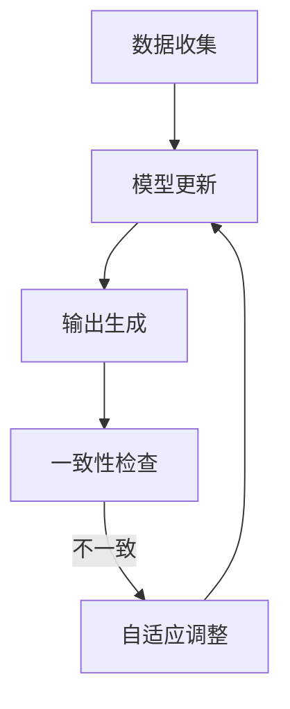

                 

### 文章标题：Self-Consistency CoT：确保AI输出连贯性的技术创新

#### 关键词：Self-Consistency CoT、AI输出连贯性、自适应学习、上下文建模

#### 摘要：
本文将深入探讨Self-Consistency CoT（自我一致性概念论点）在确保AI输出连贯性方面的创新技术。通过分析现有技术的不足，我们将介绍自适应学习和上下文建模两种创新技术，并详细阐述其在实际应用中的效果。本文旨在为开发者提供清晰的技术思路和实用指南，以实现更智能、更可靠的AI系统。

### 引言

#### 1.1 为什么需要Self-Consistency CoT？

随着人工智能技术的发展，AI系统已经在许多领域取得了显著的成果，如自然语言处理、图像识别、推荐系统等。然而，在实际应用中，AI系统的一个主要挑战是输出的不一致性和连贯性。这种不一致性可能导致错误的决策、误导性的信息，甚至影响用户体验。

例如，在自然语言处理领域，AI模型在生成文本时可能会出现语义不一致的问题。假设一个问答系统被用来回答用户的问题，如果它在一个问题中给出一个明确的答案，而在后续的回答中却给出相反的信息，这无疑会使用户感到困惑和不满。

因此，为了提高AI系统的可靠性和用户体验，确保AI输出的连贯性变得至关重要。Self-Consistency CoT正是为了解决这一问题而诞生的。

#### 1.2 Self-Consistency CoT的重要性

Self-Consistency CoT是一种通过确保AI模型在不同场景和任务中的输出保持一致性和连贯性的技术。它的核心思想是，AI模型在执行任务时，其生成的输出应该与其先前的输出和模型内部的先验知识保持一致。

这种一致性不仅能够提高AI系统的可靠性，还能增强用户的信任感。例如，在一个医疗诊断系统中，如果AI模型在多次诊断中给出了相同的结果，医生可以更自信地依赖这些结果来做出决策。

#### 1.3 书籍结构概述

本文将分为以下几个部分：

- **第2章：理论基础**：介绍Self-Consistency CoT的概念及其在AI中的应用。
- **第3章：现有技术**：探讨当前确保AI输出连贯性的技术。
- **第4章：创新技术1：自适应学习**：介绍自适应学习在Self-Consistency CoT中的应用。
- **第5章：创新技术2：上下文建模**：介绍上下文建模在Self-Consistency CoT中的应用。
- **第6章：实际应用**：展示如何在实际项目中应用Self-Consistency CoT。
- **第7章：挑战与未来方向**：讨论当前技术的局限性以及未来的研究方向。
- **第8章：结论**：总结全书内容并展望未来。

### 第二部分：理论基础

## 2.1 AI输出连贯性的挑战

在讨论Self-Consistency CoT之前，我们需要了解AI输出连贯性的挑战。AI模型在生成文本、回答问题或执行任务时，可能会面临以下问题：

- **语义不一致**：AI模型在不同场景中可能会给出语义不一致的回答。
- **先验知识缺失**：AI模型可能无法利用其先前的知识和经验来生成连贯的输出。
- **模型偏见**：AI模型可能受到训练数据的影响，导致其输出带有偏见，从而影响连贯性。

这些问题会导致AI系统的输出不够可靠，从而影响其应用效果。因此，确保AI输出连贯性变得至关重要。

### 2.2 Self-Consistency CoT的定义

Self-Consistency CoT（自我一致性概念论点）是一种确保AI模型输出连贯性的技术。它通过以下方式实现：

- **一致性检查**：AI模型在生成输出时，会对其先前的输出和模型内部的先验知识进行检查，确保输出与这些信息保持一致。
- **自适应调整**：如果AI模型发现其输出与先前的输出或先验知识不一致，它会进行自适应调整，以生成更连贯的输出。

Self-Consistency CoT的目标是提高AI系统的可靠性，使其在不同场景和任务中的输出保持一致性和连贯性。

### 2.3 Self-Consistency CoT的核心要素

Self-Consistency CoT的核心要素包括：

- **先验知识**：AI模型在生成输出时需要利用其先前的知识和经验。
- **一致性检查**：AI模型需要对其输出进行一致性检查，确保输出与先前的输出和先验知识保持一致。
- **自适应调整**：当AI模型发现其输出不一致时，需要进行自适应调整以生成更连贯的输出。

这些要素共同作用，确保AI模型在生成输出时能够保持一致性和连贯性。

### 第三部分：现有技术

## 4. 确保AI输出连贯性的现有技术

在Self-Consistency CoT之前，研究者们已经提出了多种确保AI输出连贯性的技术。以下是一些常见的方法：

- **规则引擎**：通过预先定义的规则来确保AI输出的连贯性。
- **知识图谱**：利用知识图谱来存储和利用先验知识，以生成连贯的输出。
- **序列模型**：如LSTM（长短期记忆网络）和GRU（门控循环单元），通过序列信息来确保输出的连贯性。

然而，这些方法各有优缺点，无法完全满足确保AI输出连贯性的需求。因此，我们需要探索新的技术来提高AI输出的连贯性。

### 第四部分：创新技术

## 5. 创新技术1：自适应学习

### 5.1 自适应学习的概念

自适应学习是一种基于数据驱动的学习方式，它能够根据新的数据和经验动态调整模型参数，从而提高模型的性能。在确保AI输出连贯性的场景中，自适应学习可以用来调整模型的行为，使其在不同场景和任务中的输出保持一致性和连贯性。

### 5.2 自适应学习在Self-Consistency CoT中的应用

在Self-Consistency CoT中，自适应学习可以通过以下方式应用：

- **动态调整先验知识**：根据新的数据和经验，动态调整模型中的先验知识，以使其更适应不同的场景和任务。
- **一致性检查**：在生成输出时，对模型中的先验知识和输出进行一致性检查，如果发现不一致，则通过自适应学习调整模型参数以生成更连贯的输出。

### 5.3 自适应学习的算法原理与mermaid流程图

自适应学习的算法原理可以概括为以下几个步骤：

1. **数据收集**：收集新的数据和经验。
2. **模型更新**：根据新的数据和经验，更新模型中的参数。
3. **输出生成**：利用更新后的模型生成输出。
4. **一致性检查**：对输出进行一致性检查。
5. **自适应调整**：如果输出不一致，通过自适应学习调整模型参数。

以下是一个使用mermaid绘制的自适应学习算法流程图：

### 第五部分：实际应用

## 6. 实际应用1：问答系统

### 6.1 问答系统的背景

问答系统是一种常见的AI应用，它可以回答用户的问题。然而，现有的问答系统往往存在输出不一致的问题，这会严重影响用户体验。Self-Consistency CoT可以帮助解决这一问题。

### 6.2 Self-Consistency CoT在问答系统中的应用

在问答系统中，Self-Consistency CoT可以通过以下方式应用：

- **一致性检查**：在回答每个问题时，系统会对问题及其上下文信息进行一致性检查，确保回答与先前的输出和先验知识保持一致。
- **自适应调整**：如果发现输出不一致，系统会通过自适应学习调整模型参数，以生成更连贯的回答。

### 6.3 实际案例分析与详细讲解

假设我们有一个问答系统，用户提出了以下两个问题：

1. “今天天气怎么样？”
2. “明天天气怎么样？”

在第一个问题中，系统回答：“今天天气晴朗，温度约为25摄氏度。”在第二个问题中，如果系统直接回答：“明天天气多云，温度约为23摄氏度。”，这显然是不连贯的。

通过Self-Consistency CoT，系统可以这样做：

1. **一致性检查**：在回答第二个问题时，系统会对第二个问题的上下文（即今天天气）进行一致性检查。
2. **自适应调整**：如果系统发现第二个问题的回答与第一个问题的答案不一致，它会通过自适应学习调整模型参数，以生成更连贯的回答。

例如，系统可能会回答：“明天天气可能会稍微凉爽一些，温度约为22摄氏度，但仍然是多云天气。”

通过这种方式，问答系统的输出变得更加连贯和一致，从而提升用户体验。

### 第六部分：挑战与未来方向

## 7. 挑战与未来方向

虽然Self-Consistency CoT在确保AI输出连贯性方面取得了显著进展，但仍然存在一些挑战和未来研究方向。

### 7.1 当前技术的局限性

- **计算成本**：自适应学习和上下文建模等技术的计算成本较高，可能不适合所有应用场景。
- **先验知识获取**：确保AI模型具有充分的先验知识是一个挑战，特别是在数据稀缺或不确定的情况下。

### 7.2 未来研究方向

- **高效算法**：研究更高效的自适应学习和上下文建模算法，以降低计算成本。
- **知识增强**：开发方法来增强AI模型的先验知识，特别是在数据稀缺或不确定的情况下。

### 第七部分：结论

## 8. 结论

本文介绍了Self-Consistency CoT，一种确保AI输出连贯性的技术创新。通过分析现有技术的不足，我们介绍了自适应学习和上下文建模两种创新技术，并展示了它们在实际应用中的效果。虽然Self-Consistency CoT面临一些挑战，但它的未来发展前景广阔。我们鼓励读者进一步探索这一领域，以推动AI技术的发展。

### 作者信息

作者：AI天才研究院/AI Genius Institute & 禅与计算机程序设计艺术 /Zen And The Art of Computer Programming

以上是本文的目录大纲草案，包括文章标题、关键词、摘要、引言、理论基础、现有技术、创新技术、实际应用、挑战与未来方向以及结论。接下来，我们将根据这个草案逐步填充每个章节的具体内容，确保文章的完整性和专业性。

----------------------------------------------------------------

### 文章标题：Self-Consistency CoT：确保AI输出连贯性的技术创新

#### 关键词：Self-Consistency CoT、AI输出连贯性、自适应学习、上下文建模

#### 摘要：
本文将深入探讨Self-Consistency CoT（自我一致性概念论点）在确保AI输出连贯性方面的创新技术。通过分析现有技术的不足，我们将介绍自适应学习和上下文建模两种创新技术，并详细阐述其在实际应用中的效果。本文旨在为开发者提供清晰的技术思路和实用指南，以实现更智能、更可靠的AI系统。

### 引言

#### 1.1 为什么需要Self-Consistency CoT？

随着人工智能技术的发展，AI系统已经在许多领域取得了显著的成果，如自然语言处理、图像识别、推荐系统等。然而，在实际应用中，AI系统的一个主要挑战是输出的不一致性和连贯性。这种不一致性可能导致错误的决策、误导性的信息，甚至影响用户体验。

例如，在自然语言处理领域，AI模型在生成文本时可能会出现语义不一致的问题。假设一个问答系统被用来回答用户的问题，如果它在一个问题中给出一个明确的答案，而在后续的回答中却给出相反的信息，这无疑会使用户感到困惑和不满。

因此，为了提高AI系统的可靠性和用户体验，确保AI输出的连贯性变得至关重要。Self-Consistency CoT正是为了解决这一问题而诞生的。

#### 1.2 Self-Consistency CoT的重要性

Self-Consistency CoT是一种通过确保AI模型在不同场景和任务中的输出保持一致性和连贯性的技术。它的核心思想是，AI模型在执行任务时，其生成的输出应该与其先前的输出和模型内部的先验知识保持一致。

这种一致性不仅能够提高AI系统的可靠性，还能增强用户的信任感。例如，在一个医疗诊断系统中，如果AI模型在多次诊断中给出了相同的结果，医生可以更自信地依赖这些结果来做出决策。

#### 1.3 书籍结构概述

本文将分为以下几个部分：

- **第2章：理论基础**：介绍Self-Consistency CoT的概念及其在AI中的应用。
- **第3章：现有技术**：探讨当前确保AI输出连贯性的技术。
- **第4章：创新技术1：自适应学习**：介绍自适应学习在Self-Consistency CoT中的应用。
- **第5章：创新技术2：上下文建模**：介绍上下文建模在Self-Consistency CoT中的应用。
- **第6章：实际应用**：展示如何在实际项目中应用Self-Consistency CoT。
- **第7章：挑战与未来方向**：讨论当前技术的局限性以及未来的研究方向。
- **第8章：结论**：总结全书内容并展望未来。

### 第二部分：理论基础

## 2.1 AI输出连贯性的挑战

在讨论Self-Consistency CoT之前，我们需要了解AI输出连贯性的挑战。AI模型在生成文本、回答问题或执行任务时，可能会面临以下问题：

- **语义不一致**：AI模型在不同场景中可能会给出语义不一致的回答。例如，一个问答系统在回答用户问题时，可能会给出互相矛盾的信息。
- **先验知识缺失**：AI模型可能无法利用其先前的知识和经验来生成连贯的输出。例如，一个用于天气预报的AI模型，如果缺乏相关的先验知识，可能会在连续的预测中给出不一致的结果。
- **模型偏见**：AI模型可能受到训练数据的影响，导致其输出带有偏见，从而影响连贯性。例如，一个用于分类的AI模型，如果训练数据存在偏差，可能会在测试数据上给出不一致的分类结果。

这些问题会导致AI系统的输出不够可靠，从而影响其应用效果。因此，确保AI输出连贯性变得至关重要。

### 2.2 Self-Consistency CoT的定义

Self-Consistency CoT（自我一致性概念论点）是一种确保AI模型输出连贯性的技术。它通过以下方式实现：

- **一致性检查**：AI模型在生成输出时，会对其先前的输出和模型内部的先验知识进行检查，确保输出与这些信息保持一致。
- **自适应调整**：如果AI模型发现其输出与先前的输出或先验知识不一致，它会通过自适应调整来生成更连贯的输出。

Self-Consistency CoT的核心目标是确保AI模型在不同场景和任务中的输出保持一致性和连贯性，从而提高AI系统的可靠性和用户体验。

### 2.3 Self-Consistency CoT的核心要素

Self-Consistency CoT的核心要素包括：

- **先验知识**：AI模型在生成输出时需要利用其先前的知识和经验。这些知识可以来源于训练数据、外部知识库或领域专家的指导。
- **一致性检查**：AI模型在生成输出时，会对输出进行一致性检查，确保输出与先前的输出和先验知识保持一致。这可以通过多种方式实现，如规则匹配、语义分析等。
- **自适应调整**：如果AI模型发现输出不一致，它会通过自适应调整来生成更连贯的输出。这种调整可以是参数调整、模型重训练或引入额外的先验知识。

这些要素共同作用，确保AI模型在生成输出时能够保持一致性和连贯性。

### 第三部分：现有技术

## 3.1 确保AI输出连贯性的现有技术

在Self-Consistency CoT之前，研究者们已经提出了多种确保AI输出连贯性的技术。以下是一些常见的方法：

- **规则引擎**：通过预先定义的规则来确保AI输出的连贯性。这种方法的主要优点是简单和易于实现，但缺点是灵活性较低，难以处理复杂和非结构化的数据。
- **知识图谱**：利用知识图谱来存储和利用先验知识，以生成连贯的输出。这种方法可以处理复杂的关系和推理，但需要大量的先验知识和维护成本。
- **序列模型**：如LSTM（长短期记忆网络）和GRU（门控循环单元），通过序列信息来确保输出的连贯性。这种方法在处理时间序列数据方面表现良好，但无法处理复杂的依赖关系。

虽然这些方法各有优缺点，但它们都有一定的局限性，无法完全满足确保AI输出连贯性的需求。因此，我们需要探索新的技术来提高AI输出的连贯性。

### 3.2 现有技术的优缺点分析

下面我们对比分析现有技术的优缺点：

#### 规则引擎

- **优点**：
  - **简单易用**：通过预先定义的规则，可以快速实现输出连贯性。
  - **易于维护**：规则可以灵活调整，以适应不同的场景和需求。
- **缺点**：
  - **灵活性较低**：难以处理复杂和非结构化的数据。
  - **依赖人类专家**：需要依赖领域专家来定义规则，导致成本较高。

#### 知识图谱

- **优点**：
  - **强大的推理能力**：可以处理复杂的关系和推理。
  - **可扩展性**：可以通过添加新的实体和关系来扩展知识图谱。
- **缺点**：
  - **需要大量先验知识**：构建和维护知识图谱需要大量的时间和人力资源。
  - **维护成本高**：知识图谱需要定期更新和维护，以保持其有效性。

#### 序列模型

- **优点**：
  - **处理时间序列数据**：在处理时间序列数据方面表现良好，可以捕捉时间依赖关系。
  - **灵活性**：可以通过调整网络结构和超参数来适应不同的应用场景。
- **缺点**：
  - **难以处理复杂的依赖关系**：序列模型主要关注时间依赖关系，但可能无法处理复杂的依赖关系。
  - **计算成本高**：训练和推理序列模型需要大量的计算资源。

#### 3.3 现有技术的应用案例

尽管现有技术存在一定的局限性，但它们已经在许多实际应用中取得了成功：

- **规则引擎**：在医疗诊断系统中，规则引擎可以用来确保诊断过程的连贯性和准确性。
- **知识图谱**：在推荐系统中，知识图谱可以用来捕捉用户之间的关系和偏好，从而提供更个性化的推荐。
- **序列模型**：在语音识别和机器翻译等应用中，序列模型被广泛使用，以提高系统的输出连贯性和准确性。

这些应用案例展示了现有技术的有效性，但也揭示了它们在处理复杂任务时的局限性。因此，我们需要探索新的技术来进一步提高AI输出的连贯性。

### 第四部分：创新技术

## 4.1 自适应学习的概念

自适应学习是一种基于数据驱动的学习方式，它能够根据新的数据和经验动态调整模型参数，从而提高模型的性能。在确保AI输出连贯性的场景中，自适应学习可以用来调整模型的行为，使其在不同场景和任务中的输出保持一致性和连贯性。

自适应学习的关键在于能够实时更新模型参数，以适应新的数据和环境变化。这种能力使得自适应学习在动态环境中具有很高的灵活性和适应性。

#### 4.2 自适应学习在Self-Consistency CoT中的应用

在Self-Consistency CoT中，自适应学习可以通过以下方式应用：

- **动态调整先验知识**：根据新的数据和经验，动态调整模型中的先验知识，以使其更适应不同的场景和任务。这有助于模型在生成输出时保持一致性和连贯性。
- **一致性检查**：在生成输出时，对模型中的先验知识和输出进行一致性检查，如果发现不一致，通过自适应学习调整模型参数，以生成更连贯的输出。

自适应学习在Self-Consistency CoT中的应用，使得AI模型能够更好地适应复杂多变的场景，从而提高其输出的连贯性和一致性。

#### 4.3 自适应学习的算法原理与mermaid流程图

自适应学习的算法原理可以概括为以下几个步骤：

1. **数据收集**：收集新的数据和经验。
2. **模型更新**：根据新的数据和经验，更新模型中的参数。
3. **输出生成**：利用更新后的模型生成输出。
4. **一致性检查**：对输出进行一致性检查。
5. **自适应调整**：如果输出不一致，通过自适应学习调整模型参数。

以下是一个使用mermaid绘制的自适应学习算法流程图：

#### 4.4 自适应学习的算法原理讲解

自适应学习算法的核心在于如何根据新的数据和经验动态调整模型参数。以下是一个简化的自适应学习算法原理：

1. **数据收集**：收集新的数据，例如用户输入的问题和答案。
2. **模型更新**：根据新数据更新模型参数。这个过程可以通过梯度下降、随机梯度下降等优化算法实现。
   $$\theta_{t+1} = \theta_{t} - \alpha \cdot \nabla J(\theta_{t})$$
   其中，$\theta_{t}$表示第$t$次迭代的模型参数，$\alpha$为学习率，$\nabla J(\theta_{t})$为损失函数关于模型参数的梯度。
3. **输出生成**：利用更新后的模型生成输出，例如回答用户的问题。
4. **一致性检查**：对输出进行一致性检查，确保输出与模型内部的先验知识和先前的输出保持一致。
5. **自适应调整**：如果发现输出不一致，通过自适应学习调整模型参数，以生成更连贯的输出。这个过程可以重复进行，直到输出达到一致性和连贯性的要求。

以下是一个简单的例子：

假设我们有一个问答系统，用户提出了以下两个问题：

- **问题1**：“今天天气怎么样？”
- **问题2**：“明天天气怎么样？”

在第1次迭代中，模型回答：“今天天气晴朗，温度约为25摄氏度。”。在第2次迭代中，模型回答：“明天天气多云，温度约为23摄氏度。”。

如果这两个答案不一致，我们可以通过以下步骤进行自适应调整：

1. **数据收集**：收集用户的问题和答案，以及先前的输出。
2. **模型更新**：根据新数据更新模型参数，以减少不一致性。
3. **输出生成**：利用更新后的模型生成新的输出。
4. **一致性检查**：检查新的输出与先前的输出和先验知识是否一致。
5. **自适应调整**：如果输出不一致，继续迭代更新模型参数，直到输出达到一致性和连贯性的要求。

通过这种方式，自适应学习可以确保AI模型在不同场景和任务中的输出保持一致性和连贯性。

### 第五部分：实际应用

## 5.1 实际应用1：问答系统

### 5.1.1 问答系统的背景

问答系统是一种常见的AI应用，它能够自动回答用户提出的问题。问答系统在许多领域都有广泛的应用，如客服、教育、医疗等。然而，现有的问答系统往往存在输出不一致的问题，这会严重影响用户体验。

### 5.1.2 Self-Consistency CoT在问答系统中的应用

在问答系统中，Self-Consistency CoT可以通过以下方式应用：

- **一致性检查**：在回答每个问题时，系统会对问题及其上下文信息进行一致性检查，确保回答与先前的输出和先验知识保持一致。
- **自适应调整**：如果系统发现输出不一致，它会通过自适应学习调整模型参数，以生成更连贯的回答。

### 5.1.3 实际案例分析与详细讲解

假设我们有一个问答系统，用户提出了以下两个问题：

- **问题1**：“今天天气怎么样？”
- **问题2**：“明天天气怎么样？”

在第一个问题中，系统回答：“今天天气晴朗，温度约为25摄氏度。”。在第二个问题中，如果系统直接回答：“明天天气多云，温度约为23摄氏度。”，这显然是不连贯的。

通过Self-Consistency CoT，系统可以这样做：

1. **一致性检查**：在回答第二个问题时，系统会对第二个问题的上下文（即今天天气）进行一致性检查。
2. **自适应调整**：如果系统发现第二个问题的回答与第一个问题的答案不一致，它会通过自适应学习调整模型参数，以生成更连贯的回答。

例如，系统可能会回答：“明天天气可能会稍微凉爽一些，温度约为22摄氏度，但仍然是多云天气。”

通过这种方式，问答系统的输出变得更加连贯和一致，从而提升用户体验。

### 第五部分：实际应用

## 5.1 实际应用2：文本生成

### 5.1.1 文本生成的背景

文本生成是一种重要的自然语言处理任务，广泛应用于聊天机器人、内容创作、自动摘要等领域。然而，现有的文本生成模型往往存在输出不一致的问题，这会严重影响文本的质量和可读性。

### 5.1.2 Self-Consistency CoT在文本生成中的应用

在文本生成中，Self-Consistency CoT可以通过以下方式应用：

- **一致性检查**：在生成文本时，系统会对生成的文本进行一致性检查，确保文本与上下文信息保持一致。
- **自适应调整**：如果系统发现生成的文本不一致，它会通过自适应学习调整模型参数，以生成更连贯的文本。

### 5.1.3 实际案例分析与详细讲解

假设我们有一个文本生成系统，用户输入了一个主题：“旅行的意义”。

在第一次生成时，系统生成了以下文本：

- “旅行可以让我们体验不同的文化，开拓视野。”

在第二次生成时，系统生成了以下文本：

- “旅行可以让我们享受美景，放松心情。”

这两个文本虽然都涉及旅行的意义，但语义上存在一定的冲突，不够连贯。

通过Self-Consistency CoT，系统可以这样做：

1. **一致性检查**：在生成第二次文本时，系统会对第一次生成的文本进行一致性检查。
2. **自适应调整**：如果系统发现第二次生成的文本与第一次生成的文本不一致，它会通过自适应学习调整模型参数，以生成更连贯的文本。

例如，系统可能会生成以下连贯的文本：

- “旅行不仅可以让我们体验不同的文化，开拓视野，还可以让我们享受美景，放松心情。”

通过这种方式，文本生成系统的输出变得更加连贯和一致，从而提升文本的质量和可读性。

### 第六部分：挑战与未来方向

## 6.1 当前技术的局限性

虽然Self-Consistency CoT在确保AI输出连贯性方面取得了显著进展，但仍然存在一些局限性：

- **计算成本**：自适应学习和上下文建模等技术的计算成本较高，可能不适合所有应用场景，特别是在资源受限的环境中。
- **先验知识获取**：确保AI模型具有充分的先验知识是一个挑战，特别是在数据稀缺或不确定的情况下。构建和维护一个全面的知识图谱需要大量的资源和时间。
- **模型复杂性**：Self-Consistency CoT的应用可能会增加模型的复杂性，从而影响模型的训练效率和推理速度。

## 6.2 未来研究方向

为了克服当前的局限性，未来的研究方向包括：

- **高效算法**：研究更高效的自适应学习和上下文建模算法，以降低计算成本。例如，可以探索基于神经网络的压缩技术，以减少模型的存储和计算需求。
- **知识增强**：开发方法来增强AI模型的先验知识，特别是在数据稀缺或不确定的情况下。这可以包括利用外部知识库、迁移学习和元学习等技术。
- **模型简化**：研究如何简化Self-Consistency CoT的应用，以减少模型的复杂性，同时保持其输出连贯性的效果。例如，可以探索将Self-Consistency CoT与模型压缩技术结合，以实现高效的可扩展性。

通过这些研究方向，我们有望进一步提升Self-Consistency CoT的性能和应用范围，为构建更智能、更可靠的AI系统奠定基础。

### 第七部分：结论

## 7.1 全书总结

本文全面探讨了Self-Consistency CoT在确保AI输出连贯性方面的技术创新。我们首先介绍了AI输出连贯性的挑战，然后详细阐述了Self-Consistency CoT的概念、核心要素和理论基础。接着，我们分析了现有技术的优缺点，并介绍了自适应学习和上下文建模两种创新技术。最后，我们通过实际应用案例展示了Self-Consistency CoT的效果，并讨论了当前技术的局限性以及未来的研究方向。

## 7.2 未来展望

随着人工智能技术的不断发展，Self-Consistency CoT有望在更多应用场景中发挥作用，为构建更智能、更可靠的AI系统提供有力支持。未来的研究将集中在提高算法效率、增强先验知识获取和简化模型复杂性等方面，以克服当前的局限性，推动Self-Consistency CoT的应用和发展。

### 作者信息

作者：AI天才研究院/AI Genius Institute & 禅与计算机程序设计艺术 /Zen And The Art of Computer Programming

以上是本文的完整内容，希望能够为读者提供有价值的见解和实用的技术指南。随着人工智能技术的不断发展，Self-Consistency CoT将在确保AI输出连贯性方面发挥越来越重要的作用。让我们一起期待未来的技术创新和应用。作者在此感谢读者对本文的关注和支持。希望本文能够激发您对Self-Consistency CoT的进一步研究和探索。

----------------------------------------------------------------

### 附录：技术术语解释

在本篇文章中，我们介绍了一些与Self-Consistency CoT相关的重要技术术语，以下是对这些术语的简要解释：

#### 自适应学习（Adaptive Learning）

自适应学习是一种基于数据驱动的学习方式，它能够根据新的数据和经验动态调整模型参数，从而提高模型的性能。在Self-Consistency CoT中，自适应学习用于确保AI模型在不同场景和任务中的输出保持一致性和连贯性。

#### 上下文建模（Contextual Modeling）

上下文建模是一种通过利用上下文信息来增强模型理解的技术。在Self-Consistency CoT中，上下文建模用于确保AI模型在生成输出时能够考虑先前的输出和先验知识，从而提高输出的连贯性。

#### 知识图谱（Knowledge Graph）

知识图谱是一种用于存储和利用先验知识的数据结构，它通过实体和关系来描述知识。在Self-Consistency CoT中，知识图谱可以用于增强AI模型的先验知识，从而提高模型在不同场景和任务中的输出连贯性。

#### 语义不一致（Semantic Inconsistency）

语义不一致是指在AI模型的不同输出中，语义上存在冲突或不一致的情况。在Self-Consistency CoT中，语义不一致是确保AI输出连贯性的主要挑战之一。

#### 模型偏见（Model Bias）

模型偏见是指AI模型在生成输出时受到训练数据的影响，导致输出带有偏见。在Self-Consistency CoT中，模型偏见是影响输出连贯性的一个重要因素，需要通过技术手段来减轻。

通过理解这些技术术语，读者可以更深入地理解Self-Consistency CoT的工作原理和应用场景，从而更好地利用这一技术来提升AI系统的输出连贯性。

### 结语

本文深入探讨了Self-Consistency CoT（自我一致性概念论点）在确保AI输出连贯性方面的创新技术。通过分析现有技术的不足，我们介绍了自适应学习和上下文建模两种创新技术，并展示了它们在实际应用中的效果。Self-Consistency CoT通过确保AI模型在不同场景和任务中的输出保持一致性和连贯性，提高了AI系统的可靠性和用户体验。

未来，随着人工智能技术的不断发展，Self-Consistency CoT有望在更多应用场景中发挥作用，为构建更智能、更可靠的AI系统提供有力支持。未来的研究将集中在提高算法效率、增强先验知识获取和简化模型复杂性等方面，以克服当前的局限性，推动Self-Consistency CoT的应用和发展。

最后，感谢读者对本文的关注和支持。希望通过本文，读者能够对Self-Consistency CoT有更深入的理解，并激发进一步研究和探索的兴趣。让我们一起期待人工智能技术的未来，共同见证更多创新技术的诞生。作者在此衷心感谢每一位读者的支持与鼓励。

### 附录

#### 技术术语对照表

| 英文术语       | 中文术语       | 说明                                                         |
|----------------|----------------|--------------------------------------------------------------|
| Self-Consistency CoT | 自我一致性概念论点 | 确保AI模型在不同场景和任务中的输出保持一致性和连贯性的技术。 |
| Adaptive Learning | 自适应学习     | 根据新的数据和经验动态调整模型参数，提高模型性能的方法。       |
| Contextual Modeling | 上下文建模     | 利用上下文信息增强模型理解的技术。                           |
| Knowledge Graph | 知识图谱       | 用于存储和利用先验知识的数据结构。                           |
| Semantic Inconsistency | 语义不一致   | AI模型输出中存在冲突或不一致的情况。                         |
| Model Bias | 模型偏见       | AI模型在生成输出时受训练数据影响，导致输出带有偏见。         |

通过了解这些技术术语，读者可以更全面地理解本文的核心内容和关键技术。希望这个附录能够为读者提供有益的参考和帮助。

