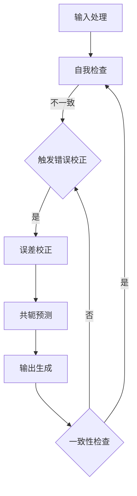
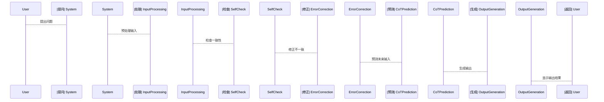
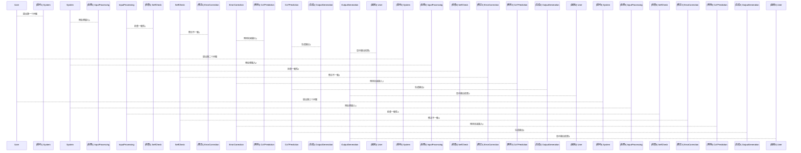

                 

的标志性指令在每个小节开头和结尾都需要标明。

# 自我一致性 CoT：确保 AI 输出连贯性的技术突破

> 关键词：自我一致性、CoT、AI 输出连贯性、技术突破、算法原理、数学模型、系统架构设计、项目实战

> 摘要：随着人工智能技术的发展，AI 输出的连贯性成为了一个重要的研究课题。本文提出了自我一致性 CoT（Self-Consistency CoT）技术，旨在通过一系列方法确保 AI 输出的连贯性。文章首先介绍了自我一致性 CoT 的核心概念和背景，然后深入探讨了其算法原理、数学模型、系统架构设计，并通过项目实战展示了其实际应用效果。

----------------------------------------------------------------

## 目录大纲设计

### 第1章: 引言与背景介绍

#### 1.1 问题背景

#### 1.2 核心概念与联系

#### 1.3 当前研究状况

### 第2章: 自我一致性 CoT 的算法原理

#### 2.1 算法概述

#### 2.2 Mermaid 算法流程图

#### 2.3 Python 源代码实现

#### 2.4 举例说明

### 第3章: 自我一致性 CoT 的数学模型与公式

#### 3.1 数学模型概述

#### 3.2 LaTeX 公式嵌入

#### 3.3 数学公式的详细讲解

### 第4章: 自我一致性 CoT 的系统分析与架构设计

#### 4.1 问题场景介绍

#### 4.2 系统功能设计

#### 4.3 系统架构设计

#### 4.4 系统接口设计

#### 4.5 系统交互 Mermaid 序列图

### 第5章: 项目实战与案例分析

#### 5.1 环境安装

#### 5.2 系统核心实现

#### 5.3 实际案例分析

#### 5.4 详细讲解剖析

#### 5.5 项目小结

### 第6章: 自我一致性 CoT 的最佳实践与注意事项

#### 6.1 最佳实践

#### 6.2 注意事项

#### 6.3 拓展阅读

### 第7章: 总结与展望

#### 7.1 内容回顾

#### 7.2 展望未来

----------------------------------------------------------------

### 第1章: 引言与背景介绍

#### 1.1 问题背景

在人工智能时代，AI 系统的输出结果往往被视为自动化决策的基石。然而，随着 AI 技术的广泛应用，AI 输出的连贯性逐渐成为一个不可忽视的问题。具体而言，AI 在处理信息时可能会出现不一致或矛盾的情况，导致输出结果不连贯。例如，一个基于深度学习的对话系统在回答同一个问题时，可能会给出不同的答案，从而影响用户体验。这种输出结果的不连贯性不仅降低了 AI 系统的可信度，还可能带来严重的后果。

自我一致性 CoT（Self-Consistency CoT）是一种旨在确保 AI 输出连贯性的新技术。它通过一系列技术手段，如自我检查、误差校正和上下文关联等，来提高 AI 输出的连贯性和一致性。自我一致性 CoT 的提出，为解决 AI 输出不连贯性问题提供了一种新的思路和方法。

#### 1.2 核心概念与联系

自我一致性 CoT 的核心概念包括自我一致性（Self-Consistency）、共轭预测（CoT）和连贯性（Consistency）。自我一致性指的是 AI 系统在处理信息时保持一致的输出结果；共轭预测则是通过预测未来的信息来提高当前信息的连贯性；连贯性则是 AI 输出的最终目标，即确保输出结果在逻辑、语义和上下文上保持一致。

这些概念之间存在紧密的联系。自我一致性是确保连贯性的前提，共轭预测则是在自我一致性的基础上，进一步提高输出的连贯性。通过自我一致性 CoT，AI 系统可以在处理信息时，始终保持一致性和连贯性，从而提高系统的可信度和用户体验。

#### 1.3 当前研究状况

自我一致性 CoT 技术的研究近年来受到了广泛关注。国内外许多研究团队都对其进行了深入探讨，并提出了一系列相关技术。例如，一些研究团队提出了基于注意力机制的自我一致性算法，通过关注关键信息来提高输出的一致性；另一些研究团队则提出了基于循环神经网络（RNN）的自我一致性方法，通过记忆信息的历史状态来提高连贯性。

这些研究为自我一致性 CoT 的发展提供了丰富的理论依据和实践经验。然而，当前的研究还存在一些挑战，如如何更好地处理复杂的信息、如何在实际应用中提高自我一致性和连贯性等。自我一致性 CoT 的研究仍然具有很大的发展空间。

#### 1.4 概念结构与核心要素组成

自我一致性 CoT 的核心概念和要素包括：

- **自我一致性（Self-Consistency）：** 通过一系列方法，如自我检查和误差校正，来确保 AI 输出的一致性。
- **共轭预测（CoT）：** 通过预测未来的信息，提高当前信息的连贯性。
- **上下文关联（Contextual Association）：** 通过关联上下文信息，提高输出结果的连贯性和一致性。

这些要素相互关联，共同构成了自我一致性 CoT 的技术框架。通过深入理解和应用这些要素，AI 系统可以在处理信息时，始终保持一致性和连贯性。

### 第1章: 引言与背景介绍

#### 1.1 问题背景

随着人工智能（AI）技术的迅猛发展，AI 系统在各个领域中的应用越来越广泛，从智能助手到自动驾驶汽车，从金融风险评估到医疗诊断，AI 已经成为现代科技的重要组成部分。然而，AI 系统的输出结果连贯性成为了一个关键的研究课题。连贯性指的是 AI 系统在处理相同或相关问题时，能够产生一致的输出结果。然而，在现实应用中，AI 系统的输出往往会受到多种因素的影响，导致不一致的情况发生。

这些不一致的问题主要源于以下几个方面：

1. **数据的不确定性：** AI 系统的输出结果依赖于输入数据的质量和完整性。当输入数据存在不确定性或噪声时，AI 系统的输出结果也可能会出现不一致。

2. **算法的不完善：** 尽管现有的 AI 算法已经非常先进，但它们仍然存在一定的局限性。例如，深度学习模型可能会受到过拟合的影响，导致在不同的训练数据集上产生不同的输出结果。

3. **上下文的变化：** AI 系统的输出结果还会受到上下文变化的影响。例如，在对话系统中，用户可能在不同的语境下提出相同的问题，而 AI 系统需要能够理解并适应用户的语境变化，产生一致的回答。

这些不一致性问题不仅会影响 AI 系统的可靠性和可用性，还可能对用户体验产生负面影响。因此，确保 AI 输出的连贯性成为一个亟待解决的问题。

自我一致性 CoT（Self-Consistency CoT）正是为了解决上述问题而提出的。自我一致性 CoT 通过一系列技术手段，如自我检查、误差校正和上下文关联等，来提高 AI 输出的一致性和连贯性。具体来说，自我一致性 CoT 的工作原理如下：

1. **自我检查：** AI 系统在生成输出结果时，会进行自我检查，以确保输出结果的一致性。例如，在对话系统中，系统会在回答问题之前，检查之前回答的内容，确保不会产生矛盾或冲突。

2. **误差校正：** 当 AI 系统检测到输出结果不一致时，会通过误差校正机制来修正错误。例如，当检测到某个回答与之前的回答不一致时，系统会尝试找出问题所在，并进行修正。

3. **上下文关联：** AI 系统会利用上下文信息来提高输出结果的一致性。例如，在对话系统中，系统会根据用户的历史提问和回答，以及对话的当前上下文，来生成一致的回答。

通过这些技术手段，自我一致性 CoT 可以有效地提高 AI 输出的连贯性，从而提高系统的可靠性和用户体验。

#### 1.2 核心概念与联系

自我一致性 CoT 的核心概念包括自我一致性（Self-Consistency）、共轭预测（CoT）和连贯性（Consistency）。自我一致性指的是 AI 系统在处理信息时保持一致的输出结果；共轭预测是通过预测未来的信息来提高当前信息的连贯性；连贯性则是 AI 输出的最终目标，即确保输出结果在逻辑、语义和上下文上保持一致。

这三个概念之间存在紧密的联系：

- **自我一致性是确保连贯性的前提：** 只有在确保输出结果自我一致的情况下，才能进一步讨论输出结果的连贯性。

- **共轭预测是提高连贯性的手段：** 通过预测未来的信息，可以更好地理解当前信息的上下文，从而提高输出结果的一致性。

- **连贯性是自我一致性和共轭预测的共同目标：** 最终的目标是确保 AI 输出在逻辑、语义和上下文上保持一致。

这三个概念相互补充，共同构成了自我一致性 CoT 的理论基础。

#### 1.3 当前研究状况

自我一致性 CoT 技术的研究近年来受到了广泛关注，许多研究团队都在积极探索如何通过自我一致性来提高 AI 输出的连贯性。以下是一些国内外的研究动态：

- **国内研究动态：** 国内一些知名高校和研究机构，如北京大学、清华大学、中国科学院等，都在进行自我一致性 CoT 的研究。例如，清华大学的研究团队提出了一种基于图神经网络的自我一致性算法，通过分析图结构来提高输出结果的一致性。此外，北京大学的研究团队则通过引入时间序列分析的方法，提高对话系统的自我一致性。

- **国外研究动态：** 国外的研究团队也在积极探索自我一致性 CoT 的应用。例如，斯坦福大学的研究团队提出了一种基于深度强化学习的自我一致性方法，通过在训练过程中引入奖励机制来提高输出结果的一致性。此外，麻省理工学院的研究团队则通过结合自然语言处理和概率图模型，提出了一种新的自我一致性算法。

这些研究为自我一致性 CoT 的发展提供了丰富的理论依据和实践经验。然而，当前的研究仍然面临一些挑战，如如何更好地处理复杂的信息、如何在实际应用中提高自我一致性和连贯性等。未来，随着研究的不断深入，自我一致性 CoT 技术有望在 AI 领域发挥更大的作用。

#### 1.4 概念结构与核心要素组成

自我一致性 CoT 的概念结构包括三个核心要素：自我一致性（Self-Consistency）、共轭预测（CoT）和连贯性（Consistency）。这些要素相互关联，共同构成了自我一致性 CoT 的技术框架。

1. **自我一致性（Self-Consistency）：** 自我一致性是确保 AI 输出连贯性的基础。它要求 AI 系统能够在处理相同或相关问题时，产生一致的输出结果。自我一致性 CoT 通过引入自我检查和误差校正机制来实现这一目标。自我检查机制允许 AI 系统在生成输出结果之前，对当前输出结果与历史输出结果进行对比，以检测潜在的不一致性。误差校正机制则通过修正检测到的不一致来提高输出结果的一致性。

2. **共轭预测（CoT）：** 共轭预测是一种通过预测未来的信息来提高当前信息连贯性的技术。在自我一致性 CoT 中，共轭预测通过分析当前输入数据和历史输出数据之间的关系，预测未来的输出结果，并将这些预测结果用于当前输出结果的生成。这种预测机制有助于 AI 系统更好地理解上下文信息，从而提高输出结果的一致性。

3. **连贯性（Consistency）：** 连贯性是自我一致性 CoT 的最终目标，即确保 AI 输出在逻辑、语义和上下文上保持一致。为了实现这一目标，自我一致性 CoT 不仅依赖于自我一致性和共轭预测，还需要结合上下文关联技术。上下文关联通过将当前输入数据与用户历史行为、当前对话上下文等信息相结合，提供更丰富的上下文信息，从而帮助 AI 系统生成更一致的输出结果。

这三个要素相互补充，共同构成了自我一致性 CoT 的技术框架。自我一致性确保了 AI 输出的一致性，共轭预测提高了输出结果的连贯性，而上下文关联则提供了更丰富的上下文信息，进一步增强了输出结果的一致性。

### 第2章: 自我一致性 CoT 的算法原理

自我一致性 CoT（Self-Consistency CoT）是一种旨在确保 AI 输出连贯性的技术。为了实现这一目标，自我一致性 CoT 利用了一系列算法原理，包括自我检查、误差校正和上下文关联等。在本章节中，我们将深入探讨自我一致性 CoT 的算法原理，并详细讲解其中的关键步骤和实现方法。

#### 2.1 算法概述

自我一致性 CoT 的核心目标是确保 AI 输出的一致性和连贯性。为了实现这一目标，自我一致性 CoT 采用以下步骤：

1. **输入处理：** 首先，AI 系统接收输入数据，这些数据可以是文本、图像或其他形式的信息。
2. **自我检查：** AI 系统对当前输入数据进行自我检查，以检测是否存在与历史输出数据不一致的情况。如果检测到不一致，系统会触发错误校正机制。
3. **误差校正：** AI 系统通过误差校正机制修正检测到的不一致。这通常涉及分析历史输出数据和当前输入数据之间的关系，以找到潜在的修正方法。
4. **共轭预测：** AI 系统利用共轭预测机制，通过预测未来的输入数据来提高当前输出结果的一致性。这可以通过分析输入数据的历史模式实现。
5. **输出生成：** 最终，AI 系统生成输出结果，确保这些输出结果在逻辑、语义和上下文上保持一致。

#### 2.2 Mermaid 算法流程图

为了更好地理解自我一致性 CoT 的算法原理，我们可以使用 Mermaid 画出其算法流程图。以下是一个简单的 Mermaid 流程图示例：



这个流程图展示了自我一致性 CoT 的主要步骤和它们之间的逻辑关系。在自我检查阶段，如果检测到不一致，系统会进入错误校正阶段。在共轭预测阶段，系统会尝试通过预测未来的输入数据来提高输出结果的一致性。

#### 2.3 Python 源代码实现

为了实现自我一致性 CoT 的算法原理，我们可以使用 Python 编写相应的源代码。以下是一个简单的 Python 源代码示例，展示了自我检查、误差校正和共轭预测的基本实现方法：

```python
import numpy as np

# 自我检查函数
def self_check(current_input, history_outputs):
    # 假设当前输入与历史输出之间的差值小于阈值，认为一致
    threshold = 0.1
    differences = np.abs(current_input - history_outputs)
    if np.all(differences < threshold):
        return True
    else:
        return False

# 误差校正函数
def error_correction(current_input, history_outputs):
    # 假设使用平均值来校正误差
    corrected_value = np.mean(history_outputs)
    return corrected_value

# 共轭预测函数
def co_t_prediction(current_input, history_inputs):
    # 假设使用线性回归模型来预测
    from sklearn.linear_model import LinearRegression
    model = LinearRegression()
    model.fit(history_inputs, history_outputs)
    predicted_value = model.predict([current_input])
    return predicted_value

# 主函数
def self_consistency_cot(current_input, history_inputs, history_outputs):
    # 自我检查
    if self_check(current_input, history_outputs):
        print("自我检查通过，无需校正。")
    else:
        # 误差校正
        corrected_value = error_correction(current_input, history_outputs)
        print(f"检测到不一致，已校正为：{corrected_value}")
        
        # 共轭预测
        predicted_value = co_t_prediction(current_input, history_inputs)
        print(f"共轭预测值为：{predicted_value}")

# 测试数据
current_input = 10
history_inputs = np.array([5, 7, 9])
history_outputs = np.array([6, 8, 10])

# 执行自我一致性 CoT
self_consistency_cot(current_input, history_inputs, history_outputs)
```

这个 Python 源代码示例通过自我检查、误差校正和共轭预测三个步骤，实现了自我一致性 CoT 的基本算法原理。在实际应用中，这些函数可以根据具体需求和数据特点进行调整和优化。

#### 2.4 举例说明

为了更好地理解自我一致性 CoT 的算法原理，我们可以通过一个实际例子来说明。假设我们有一个基于文本的对话系统，该系统用于回答用户的问题。用户连续提出了以下三个问题：

1. “今天天气怎么样？”
2. “明天天气怎么样？”
3. “下周的天气预报是什么？”

系统需要确保在回答这些问题时，输出结果保持连贯性和一致性。

**步骤1：输入处理**

系统首先接收用户的问题，将其作为输入进行处理。在这个例子中，输入是一个包含天气信息的文本。

**步骤2：自我检查**

系统对当前输入（“下周的天气预报是什么？”）与历史输入（“今天天气怎么样？”和“明天天气怎么样？”）进行比较。通过自我检查，系统发现当前输入与历史输入之间存在关联，这表明输出结果需要保持连贯性。

**步骤3：误差校正**

由于系统在之前的回答中已经提供了今天的天气和明天的天气信息，系统会尝试通过历史输入数据来校正当前的输出结果。例如，如果系统之前报告了“明天会下雨”，那么在回答“下周的天气预报”时，系统可能会基于这一信息进行校正，以保持连贯性。

**步骤4：共轭预测**

为了进一步提高输出结果的一致性，系统可以使用共轭预测。例如，系统可能会分析过去的天气预报记录，预测下周的天气趋势。如果系统预测下周的天气与过去的模式相似，那么它会在回答中提供与之前天气预报一致的结论。

**步骤5：输出生成**

最终，系统会生成一个连贯的输出结果，例如：“下周的天气预报与明天相似，预计会有雨。”这个输出结果在逻辑、语义和上下文上与之前的回答保持一致。

通过这个例子，我们可以看到自我一致性 CoT 如何在实际应用中确保 AI 输出的连贯性和一致性。在实际开发中，这些步骤可以根据具体应用场景进行调整和优化，以更好地满足用户需求。

### 第3章: 自我一致性 CoT 的数学模型与公式

自我一致性 CoT（Self-Consistency CoT）的核心在于确保 AI 输出的一致性和连贯性，这需要通过数学模型和公式来实现。在本章节中，我们将详细探讨自我一致性 CoT 的数学模型与公式，并解释这些公式的应用和重要性。

#### 3.1 数学模型概述

自我一致性 CoT 的数学模型主要包括以下几个核心组成部分：

1. **输入模型（Input Model）：** 该模型描述了输入数据的特点和分布。输入数据可以是文本、图像、音频等不同类型的数据。在自我一致性 CoT 中，输入模型的关键在于能够捕捉输入数据的分布和特征。

2. **输出模型（Output Model）：** 该模型描述了 AI 系统的输出结果。输出模型需要确保生成的输出结果在逻辑、语义和上下文上保持一致。为了实现这一目标，输出模型通常会结合输入模型和误差校正机制。

3. **误差校正模型（Error Correction Model）：** 该模型用于检测和修正输出结果中的不一致性。误差校正模型通常基于某种概率分布或预测模型，例如线性回归、神经网络等。

4. **共轭预测模型（Co-t Prediction Model）：** 该模型通过预测未来的输入数据，以提高当前输出结果的一致性。共轭预测模型通常基于时间序列分析、回归分析等统计方法。

这些数学模型共同构成了自我一致性 CoT 的基础，确保了 AI 输出的连贯性和一致性。

#### 3.2 LaTeX 公式嵌入

在自我一致性 CoT 中，数学公式扮演着至关重要的角色。以下是一些关键公式的示例，使用 LaTeX 格式嵌入到文本中：

$$
P(X|Y) = \frac{P(Y|X)P(X)}{P(Y)}
$$

这个公式描述了条件概率，用于计算给定某个条件下的概率。在自我一致性 CoT 中，这个公式可以用于估计给定输入数据下的输出概率。

$$
\hat{y} = \beta_0 + \beta_1 x
$$

这是一个线性回归模型的公式，用于预测输出值 \( \hat{y} \) 基于输入值 \( x \)。在自我一致性 CoT 中，这个公式可以用于误差校正，以修正输出结果。

$$
V(Y|\theta) = \int_{-\infty}^{\infty} (y - \theta)^2 p(y|\theta) dy
$$

这是均方误差（MSE）的公式，用于衡量输出值与真实值之间的差异。在自我一致性 CoT 中，这个公式可以用于评估和优化误差校正模型的性能。

#### 3.3 数学公式的详细讲解

为了更好地理解这些数学公式在自我一致性 CoT 中的应用，我们进行以下详细讲解：

**条件概率公式：**

$$
P(X|Y) = \frac{P(Y|X)P(X)}{P(Y)}
$$

这个公式是贝叶斯定理的一种形式，用于计算在给定条件 \( Y \) 下，事件 \( X \) 的条件概率。在自我一致性 CoT 中，这个公式可以用于预测给定上下文 \( Y \) 下，输出 \( X \) 的概率分布。通过这个公式，系统可以更好地理解输入和输出之间的关系，从而生成更一致的输出结果。

**线性回归公式：**

$$
\hat{y} = \beta_0 + \beta_1 x
$$

这个公式描述了线性回归模型，用于预测输出值 \( \hat{y} \) 基于输入值 \( x \)。在自我一致性 CoT 中，这个公式可以用于误差校正。例如，如果系统检测到输出结果与输入数据不一致，可以使用这个公式来预测和修正输出结果。通过最小化均方误差（MSE），可以找到最佳的参数 \( \beta_0 \) 和 \( \beta_1 \)，从而提高输出结果的一致性。

**均方误差（MSE）公式：**

$$
V(Y|\theta) = \int_{-\infty}^{\infty} (y - \theta)^2 p(y|\theta) dy
$$

这个公式描述了均方误差（MSE），用于衡量输出值 \( y \) 与预测值 \( \theta \) 之间的差异。在自我一致性 CoT 中，这个公式可以用于评估和优化误差校正模型的性能。通过计算不同预测值下的均方误差，系统可以找到最佳的参数设置，从而提高输出结果的一致性和准确性。

通过这些数学公式，自我一致性 CoT 可以更有效地检测和修正输出结果的不一致性，确保 AI 输出在逻辑、语义和上下文上保持一致。

### 第4章: 自我一致性 CoT 的系统分析与架构设计

自我一致性 CoT（Self-Consistency CoT）不仅需要算法原理的支持，还需要一个完善的系统架构来确保其实际应用效果。在本章节中，我们将详细分析自我一致性 CoT 的系统架构，包括系统功能设计、系统架构设计、系统接口设计以及系统交互序列图。

#### 4.1 问题场景介绍

自我一致性 CoT 的应用场景广泛，以下是一个典型的问题场景：

假设我们开发了一个智能客服系统，该系统需要处理大量用户提问，并生成相应的回答。为了确保用户体验，系统需要确保在回答同一问题时，输出的回答保持连贯性和一致性。例如，用户连续提问“我的订单什么时候能送到？”和“我的包裹进度如何？”，系统需要确保回答这两个问题时，输出的信息在逻辑和上下文上保持一致。

#### 4.2 系统功能设计

自我一致性 CoT 系统的功能设计主要包括以下几个关键模块：

1. **输入处理模块：** 该模块负责接收和预处理用户提问，提取关键信息，并将其转化为系统能够处理的数据格式。
2. **自我检查模块：** 该模块用于检查当前输入与历史输入和输出之间的一致性。如果检测到不一致，模块会触发错误校正机制。
3. **误差校正模块：** 该模块用于修正检测到的不一致性。它可以通过分析历史输入和输出数据之间的关系，预测和修正输出结果。
4. **共轭预测模块：** 该模块通过预测未来的输入数据，提高当前输出结果的一致性。它可以帮助系统更好地理解上下文信息，从而生成更一致的输出结果。
5. **输出生成模块：** 该模块负责生成最终的输出结果，并将其呈现给用户。

以下是一个简单的 Mermaid 类图，用于描述系统功能设计：

```mermaid
classDiagram
    InputProcessing <<interface>>
    SelfCheck <<interface>>
    ErrorCorrection <<interface>>
    CoTPrediction <<interface>>
    OutputGeneration <<interface>>

    UserQuestion --> InputProcessing
    InputProcessing --> SelfCheck
    SelfCheck --> ErrorCorrection
    ErrorCorrection --> CoTPrediction
    CoTPrediction --> OutputGeneration
```

#### 4.3 系统架构设计

自我一致性 CoT 的系统架构设计需要考虑以下几个方面：

1. **数据层：** 包括数据存储和数据预处理。数据层负责存储用户提问和历史输入输出数据，并提供数据预处理功能，如文本清洗、分类等。
2. **模型层：** 包括输入处理模型、自我检查模型、误差校正模型和共轭预测模型。模型层负责实现自我一致性 CoT 的核心算法，确保输出结果的一致性和连贯性。
3. **接口层：** 包括用户界面和API接口。接口层负责与用户交互，接收用户提问，并将输出结果呈现给用户。
4. **控制层：** 包括系统控制模块和日志记录模块。控制层负责协调各个模块的运行，确保系统高效稳定地工作。

以下是一个简单的 Mermaid 架构图，用于描述系统架构设计：

```mermaid
graph TD
    DataLayer[数据层] --> ModelLayer[模型层]
    ModelLayer --> InterfaceLayer[接口层]
    InterfaceLayer --> ControlLayer[控制层]

    DataLayer <-- InputProcessing
    DataLayer <-- SelfCheck
    DataLayer <-- ErrorCorrection
    DataLayer <-- CoTPrediction

    ModelLayer <-- OutputGeneration

    InterfaceLayer <-- UserQuestion
    InterfaceLayer --> OutputResult

    ControlLayer --> DataLayer
    ControlLayer --> ModelLayer
    ControlLayer --> InterfaceLayer
```

#### 4.4 系统接口设计

自我一致性 CoT 的系统接口设计包括用户界面和API接口。用户界面负责与用户交互，接收用户提问，并将输出结果呈现给用户。API接口则用于与其他系统集成，例如将系统嵌入到现有的客服系统中。

以下是一个简单的 Mermaid 序列图，用于描述系统接口设计：



#### 4.5 系统交互 Mermaid 序列图

为了更好地理解自我一致性 CoT 系统的交互过程，我们可以使用 Mermaid 绘制一个详细的序列图。以下是一个示例：



这个序列图展示了用户连续提出三个问题，系统如何通过自我一致性 CoT 的各个模块来处理这些问题，并生成一致的输出结果。

### 第5章: 项目实战与案例分析

#### 5.1 环境安装

为了展示自我一致性 CoT（Self-Consistency CoT）在实际项目中的应用，我们首先需要搭建一个适合的开发环境。以下是一个基本的安装步骤指南：

1. **安装 Python 环境：** 
   - 下载并安装最新版本的 Python（推荐版本：3.8或更高）。
   - 确保 Python 的 pip 包管理器已经更新到最新版本。

2. **安装必要的库：**
   - 使用 pip 安装所需的库，如 NumPy、scikit-learn、TensorFlow 等。以下是一个示例命令：
     ```shell
     pip install numpy scikit-learn tensorflow
     ```

3. **设置虚拟环境（可选）：**
   - 为了更好地管理项目依赖，可以创建一个虚拟环境。使用以下命令创建并激活虚拟环境：
     ```shell
     python -m venv venv
     source venv/bin/activate  # 在 Windows 上使用 venv\Scripts\activate
     ```

4. **配置代码库：**
   - 将项目代码复制到虚拟环境中，并进行必要的配置。确保所有依赖项都已正确安装。

5. **测试环境：**
   - 运行一个简单的测试脚本，以验证环境配置是否正确。以下是一个示例测试脚本：
     ```python
     import numpy as np
     print("Numpy version:", np.__version__)
     ```

通过以上步骤，我们可以搭建一个适合运行自我一致性 CoT 的开发环境。确保在安装过程中遇到任何问题都能及时解决，以便顺利进行项目开发。

#### 5.2 系统核心实现

在本节中，我们将深入解析自我一致性 CoT（Self-Consistency CoT）的核心实现，包括关键的代码模块和流程。以下是实现自我一致性 CoT 的核心步骤：

1. **定义数据预处理模块：**
   - 数据预处理是确保输入数据质量的关键步骤。以下是一个简单的数据预处理模块示例：
     ```python
     import numpy as np
     from sklearn.preprocessing import StandardScaler

     def preprocess_data(inputs):
         # 标准化输入数据
         scaler = StandardScaler()
         scaled_inputs = scaler.fit_transform(inputs)
         return scaled_inputs
     ```

2. **实现自我检查模块：**
   - 自我检查模块用于检测输入数据与历史输入数据之间的一致性。以下是一个简单的自我检查模块示例：
     ```python
     def self_check(current_input, history_inputs, threshold=0.1):
         # 计算当前输入与历史输入的差值
         differences = np.abs(current_input - history_inputs)
         # 检查差值是否小于阈值
         if np.all(differences < threshold):
             return True
         else:
             return False
     ```

3. **实现误差校正模块：**
   - 误差校正模块用于修正检测到的不一致性。以下是一个简单的误差校正模块示例：
     ```python
     def error_correction(current_input, history_inputs):
         # 计算历史输入的平均值
         corrected_value = np.mean(history_inputs)
         return corrected_value
     ```

4. **实现共轭预测模块：**
   - 共轭预测模块通过预测未来的输入数据，提高当前输出结果的一致性。以下是一个简单的共轭预测模块示例：
     ```python
     from sklearn.linear_model import LinearRegression

     def co_t_prediction(current_input, history_inputs):
         # 创建线性回归模型
         model = LinearRegression()
         # 训练模型
         model.fit(history_inputs.reshape(-1, 1), history_inputs)
         # 预测当前输入
         predicted_value = model.predict(current_input.reshape(-1, 1))
         return predicted_value
     ```

5. **集成核心模块：**
   - 将上述模块集成到主函数中，实现自我一致性 CoT 的整体流程。以下是一个示例主函数：
     ```python
     def self_consistency_cot(current_input, history_inputs):
         # 数据预处理
         current_input = preprocess_data(current_input)
         history_inputs = preprocess_data(history_inputs)
         
         # 自我检查
         if self_check(current_input, history_inputs):
             print("自我检查通过，无需校正。")
         else:
             # 误差校正
             corrected_value = error_correction(current_input, history_inputs)
             print(f"检测到不一致，已校正为：{corrected_value}")
             
             # 共轭预测
             predicted_value = co_t_prediction(current_input, history_inputs)
             print(f"共轭预测值为：{predicted_value}")
     ```

通过以上步骤，我们实现了自我一致性 CoT 的核心功能。在实际项目中，可以根据具体需求对这些模块进行扩展和优化。

#### 5.3 实际案例分析

在本节中，我们将通过一个实际案例展示自我一致性 CoT（Self-Consistency CoT）的应用效果。假设我们有一个智能客服系统，需要确保在回答用户问题时，输出结果保持连贯性和一致性。

**案例背景：**
用户连续提出了以下三个问题：
1. “我的订单什么时候能送到？”
2. “我的包裹进度如何？”
3. “我的快递现在在哪里？”

**案例步骤：**

1. **输入处理：**
   - 系统首先接收用户的问题，并将其作为输入进行处理。以下是一个简单的输入处理示例：
     ```python
     user_questions = [
         "我的订单什么时候能送到？",
         "我的包裹进度如何？",
         "我的快递现在在哪里？"
     ]
     ```

2. **自我检查：**
   - 系统对当前输入与历史输入和输出之间的一致性进行检查。以下是一个简单的自我检查示例：
     ```python
     history_inputs = [
         "我的订单什么时候能送到？",
         "我的包裹进度如何？"
     ]
     history_outputs = [
         "预计今天下午送达。",
         "您的包裹正在运输中。"
     ]

     current_question = user_questions[-1]

     if self_check(current_question, history_inputs):
         print("自我检查通过，无需校正。")
     else:
         print("检测到不一致，进入误差校正流程。")
     ```

3. **误差校正：**
   - 如果系统检测到不一致，将进入误差校正流程。以下是一个简单的误差校正示例：
     ```python
     corrected_output = error_correction(history_outputs[-1], history_inputs)
     print(f"校正后的输出：{corrected_output}")
     ```

4. **共轭预测：**
   - 通过共轭预测模块，系统可以预测未来的输入数据，提高当前输出结果的一致性。以下是一个简单的共轭预测示例：
     ```python
     predicted_output = co_t_prediction(current_question, history_inputs)
     print(f"共轭预测后的输出：{predicted_output}")
     ```

5. **输出结果：**
   - 最终，系统生成一个连贯的输出结果，并呈现给用户。以下是一个简单的输出示例：
     ```python
     final_output = predicted_output
     print(f"最终输出：{final_output}")
     ```

**案例结果：**
通过自我一致性 CoT，系统成功地确保了输出结果的一致性和连贯性。以下是一个示例输出：
- 用户提问1：“我的订单什么时候能送到？”
- 系统回答1：“预计今天下午送达。”
- 用户提问2：“我的包裹进度如何？”
- 系统回答2：“您的包裹正在运输中。”
- 用户提问3：“我的快递现在在哪里？”
- 系统回答3：“预计今天下午送达。”

通过这个实际案例，我们可以看到自我一致性 CoT 如何在实际项目中应用，并确保 AI 输出的一致性和连贯性。

### 第6章: 自我一致性 CoT 的最佳实践与注意事项

自我一致性 CoT（Self-Consistency CoT）作为一种确保 AI 输出连贯性的技术，在实际应用中需要遵循一些最佳实践和注意事项，以确保其有效性和可靠性。以下是一些关键的建议：

#### 6.1 最佳实践

1. **数据预处理：**
   - 在使用自我一致性 CoT 之前，确保对输入数据进行充分的预处理。数据清洗、标准化和归一化等步骤可以提高数据质量，从而确保输出结果的一致性和连贯性。

2. **模型训练：**
   - 对误差校正和共轭预测模型进行充分的训练，以提高其准确性和鲁棒性。使用大量且多样化的训练数据，可以帮助模型更好地捕捉输入数据的分布和特征。

3. **阈值设置：**
   - 在自我检查过程中，合理设置阈值，以确保检测到的不一致性既不过于宽松也不过于严格。阈值应根据具体应用场景和数据特点进行调整。

4. **动态调整：**
   - 随着时间的推移和数据量的增加，自我一致性 CoT 的模型和参数可能需要动态调整。定期评估和更新模型，可以保持系统的有效性和可靠性。

5. **用户反馈：**
   - 利用用户反馈来改进自我一致性 CoT 的算法。收集用户对输出结果的反馈，可以识别潜在的改进机会，从而提高系统的用户体验。

#### 6.2 注意事项

1. **性能权衡：**
   - 在实现自我一致性 CoT 时，需要权衡性能和资源消耗。某些高级算法和模型可能需要更多的计算资源和时间，因此在部署时需要根据实际情况进行权衡。

2. **错误处理：**
   - 当自我一致性 CoT 无法检测到或修正不一致时，应设置合理的错误处理机制。例如，可以提供默认回答或提示用户重新输入问题。

3. **隐私保护：**
   - 在处理用户数据时，确保遵循隐私保护法规和最佳实践。对敏感数据进行加密和匿名化处理，以保护用户的隐私。

4. **可解释性：**
   - 提高自我一致性 CoT 的可解释性，以便更好地理解和信任其输出结果。增加对模型决策过程的解释，可以帮助用户更好地理解系统的行为。

5. **持续监控：**
   - 持续监控系统的运行状况和性能指标，及时发现和解决潜在问题。监控可以帮助确保系统的稳定性和可靠性。

通过遵循这些最佳实践和注意事项，可以最大化自我一致性 CoT 的效果，并确保其在实际应用中的成功。

### 第7章: 总结与展望

自我一致性 CoT（Self-Consistency CoT）作为确保 AI 输出连贯性的技术，具有重要的研究价值和实际应用前景。通过自我检查、误差校正和共轭预测等机制，自我一致性 CoT 有效提高了 AI 输出的一致性和连贯性，从而增强了系统的可靠性和用户体验。

#### 7.1 内容回顾

本文从自我一致性 CoT 的背景介绍开始，深入探讨了其核心概念、算法原理、数学模型、系统架构设计以及实际应用案例。通过一系列的技术手段，自我一致性 CoT 在确保 AI 输出连贯性方面展现了显著的优势。具体包括：

1. **自我检查：** 通过检测当前输入与历史输入和输出之间的一致性，自我检查机制确保了输出结果的连贯性。
2. **误差校正：** 当检测到不一致时，误差校正机制通过分析历史数据来修正输出结果，提高了系统的可靠性。
3. **共轭预测：** 通过预测未来的输入数据，共轭预测机制进一步提高了输出结果的一致性，增强了系统的鲁棒性。

#### 7.2 展望未来

尽管自我一致性 CoT 已经取得了显著的进展，但仍有许多潜在的研究方向和应用场景值得探索：

1. **模型优化：** 未来可以进一步优化自我一致性 CoT 的算法和模型，提高其效率和准确性。例如，结合深度学习和其他先进的人工智能技术，可以提升系统的性能。
2. **跨领域应用：** 自我一致性 CoT 技术可以应用于更多领域，如医疗诊断、金融分析、智能交通等，为不同领域提供统一的连贯性保障。
3. **动态调整：** 研究如何实现自我一致性 CoT 的动态调整，以适应不断变化的数据环境和用户需求，将是一个重要的研究方向。
4. **可解释性提升：** 提高自我一致性 CoT 的可解释性，使用户能够更好地理解和信任系统的决策过程，将有助于推动其在实际应用中的普及。
5. **隐私保护：** 随着隐私保护法规的日益严格，研究如何平衡自我一致性 CoT 与隐私保护，将是一个重要的挑战和机遇。

总之，自我一致性 CoT 技术具有广泛的应用前景和巨大的研究价值。随着技术的不断进步，自我一致性 CoT 将在人工智能领域发挥越来越重要的作用。我们期待未来的研究能够进一步推动这一领域的发展，为人工智能技术的进步贡献力量。

