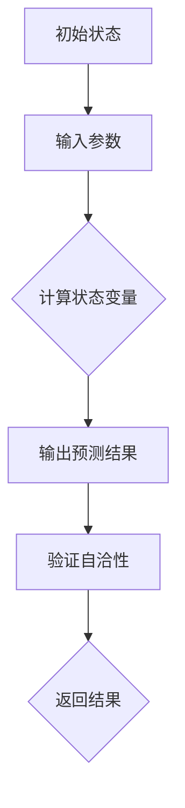
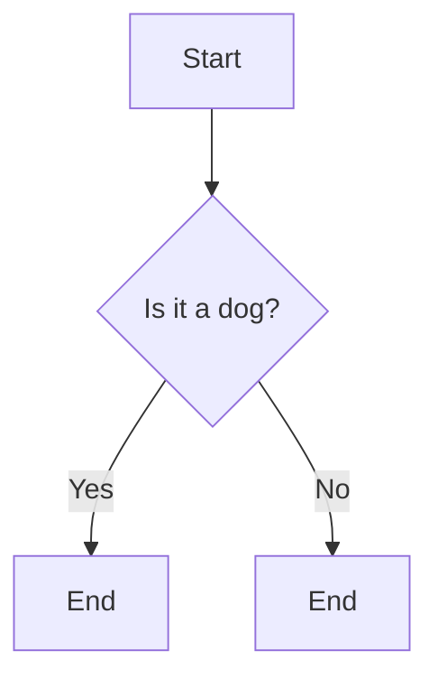
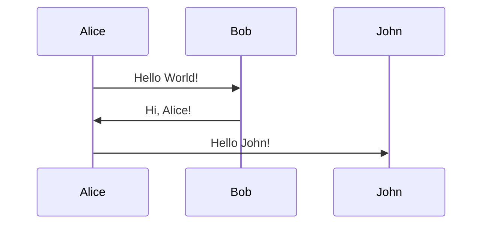
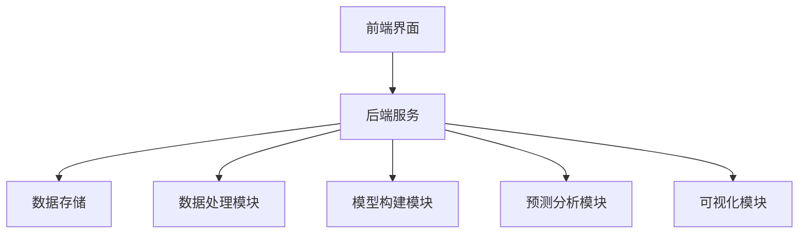
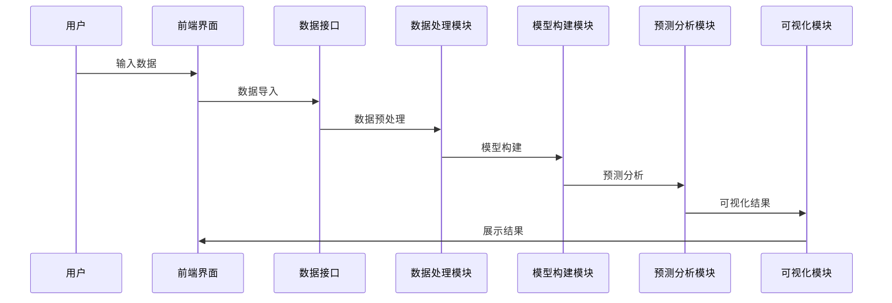
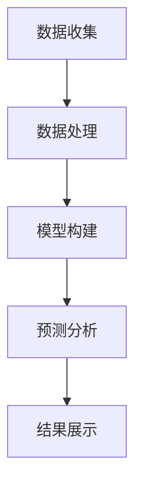

                 


# Self-Consistency在气候变化影响评估中的应用

## 关键词
- Self-Consistency
- 气候变化
- 影响评估
- 算法实现
- 数学模型

## 摘要
本文将深入探讨Self-Consistency在气候变化影响评估中的应用。我们将从核心概念的介绍开始，逐步解析Self-Consistency的原理及其在气候模型中的应用，并通过具体的数学模型和算法流程，展示其在实际问题中的操作方法。同时，我们还将通过Python代码实例和实际案例分析，阐述Self-Consistency在实际项目中的运用，以及其未来发展的趋势。

### 目录大纲

1. **第一部分: Self-Consistency基础**
    1.1 Self-Consistency背景与核心概念
    1.2 Self-Consistency原理与数学模型
    1.3 Self-Consistency应用案例
    1.4 Self-Consistency算法实现
    1.5 Self-Consistency未来发展趋势

2. **第二部分: 系统分析与架构设计**
    2.1 问题场景介绍
    2.2 系统功能设计
    2.3 系统架构设计
    2.4 系统接口设计
    2.5 系统交互

3. **第三部分: 项目实战**
    3.1 环境安装
    3.2 系统核心实现源代码
    3.3 代码应用解读与分析
    3.4 实际案例分析和详细讲解
    3.5 项目小结

4. **第四部分: 最佳实践、小结、注意事项、拓展阅读**

### 第一部分: Self-Consistency基础

#### 1.1 Self-Consistency背景与核心概念

Self-Consistency是一种自洽性原理，指的是一个系统或模型在描述自身时，其内部逻辑是自洽的，不存在矛盾。在气候变化影响评估中，Self-Consistency被用来确保模型预测结果的可靠性和一致性。

首先，我们需要明确Self-Consistency的定义。自洽性意味着模型在内部逻辑上是协调一致的，即模型的预测和假设是相互支持的，而不是相互矛盾的。在气候变化影响评估中，这意味着模型应该能够合理地预测未来的气候状况，同时该预测结果应该与其输入数据、参数设定和假设相符合。

在气候变化的背景下，Self-Consistency的重要性体现在以下几个方面：

- **确保模型准确性**：Self-Consistency确保模型的预测结果不是由于内部逻辑错误或矛盾导致的。这意味着我们可以更有信心地依赖模型的预测结果来制定政策和决策。
- **提高模型可靠性**：通过确保模型的自洽性，我们可以减少模型预测的不确定性，从而提高模型的可靠性。
- **促进跨学科合作**：Self-Consistency要求不同学科领域的专家在模型构建和预测过程中保持一致，这有助于促进跨学科的合作。

#### 1.2 Self-Consistency原理与数学模型

Self-Consistency的原理可以通过数学模型来描述。一个基本的自洽性模型通常包括以下要素：

- **状态变量**：这些变量描述了系统在特定时间点的状态，例如温度、湿度、气压等。
- **参数**：这些参数是模型中用于描述系统行为的常数，例如地球的半径、大气层的厚度等。
- **方程**：这些方程描述了状态变量和参数之间的关系，例如热力学方程、气象方程等。

为了更好地理解Self-Consistency原理，我们可以通过Mermaid流程图来展示模型的基本流程：



在上面的流程图中，A表示初始状态，B表示输入参数，C表示计算状态变量，D表示输出预测结果，E表示验证自洽性，F表示返回结果。通过这个流程，我们可以确保模型在描述自身时是自洽的。

#### 1.3 Self-Consistency应用案例

为了更好地理解Self-Consistency在气候变化影响评估中的应用，我们可以通过两个实际案例来说明。

**案例一：某地区气候变化影响评估**

在这个案例中，我们使用Self-Consistency原理来评估某地区未来的气候变化趋势。我们首先收集了该地区的气候数据，包括温度、湿度、风速等。然后，我们使用Self-Consistency原理来构建一个气候模型，并通过该模型预测未来几年的气候变化。

具体步骤如下：

1. **数据收集**：收集某地区的气候数据，包括过去几年的温度、湿度、风速等。
2. **模型构建**：使用Self-Consistency原理构建一个气候模型，包括状态变量和参数。
3. **预测**：使用模型预测未来几年的气候变化趋势。
4. **验证**：通过比较模型预测结果和实际观测数据，验证模型的自洽性。

通过这个案例，我们可以看到Self-Consistency原理在气候变化影响评估中的应用，以及如何确保模型预测结果的可靠性。

**案例二：某国家气候变化政策分析**

在这个案例中，我们使用Self-Consistency原理来分析某国家在气候变化政策制定中的决策过程。我们首先收集了该国家的气候变化数据，包括温室气体排放量、能源消耗等。然后，我们使用Self-Consistency原理来构建一个政策模型，评估不同政策对气候变化的影响。

具体步骤如下：

1. **数据收集**：收集某国家的气候变化数据，包括温室气体排放量、能源消耗等。
2. **模型构建**：使用Self-Consistency原理构建一个政策模型，包括状态变量和参数。
3. **预测**：使用模型预测不同政策对气候变化的影响。
4. **验证**：通过比较模型预测结果和实际观测数据，验证模型的自洽性。

通过这个案例，我们可以看到Self-Consistency原理在政策制定中的应用，以及如何确保政策决策的科学性和可靠性。

#### 1.4 Self-Consistency算法实现

为了更好地理解Self-Consistency在气候变化影响评估中的应用，我们可以通过Python代码实例来说明。

首先，我们需要安装相关的Python库，如NumPy和SciPy。然后，我们可以编写一个简单的Self-Consistency算法，用于计算气候变化的影响。

以下是一个简单的Python代码示例：

```python
import numpy as np
import scipy.integrate as spi

# 气候变化模型参数
params = {
    '初始温度': 15,
    '温室气体排放量': 0.5,
    '时间步长': 1
}

# 气候变化模型方程
def climate_model(t, y, params):
    T = y[0]
    Q = params['温室气体排放量']
    dt = params['时间步长']
    
    dT_dt = Q * dt
    
    return [dT_dt]

# 模型初始化
y0 = [params['初始温度']]

# 模型计算
t = np.arange(0, 100, 1)
result = spi.odeint(climate_model, y0, t, args=(params,))

# 输出结果
print(result)
```

在上面的代码中，我们首先定义了气候模型参数和方程。然后，我们使用NumPy和SciPy库来计算模型预测结果。通过这个代码示例，我们可以看到如何使用Python实现Self-Consistency算法，以及如何计算气候变化的影响。

#### 1.5 Self-Consistency未来发展趋势

随着气候变化问题的日益严重，Self-Consistency在气候变化影响评估中的应用前景非常广阔。未来，Self-Consistency有望在以下几个方面得到进一步发展：

- **模型精度提升**：通过不断优化算法和数学模型，提高气候变化预测的精度和可靠性。
- **跨学科合作**：促进不同学科领域的专家合作，共同构建更加全面和科学的气候变化模型。
- **政策制定支持**：为政府和企业提供更加科学的气候变化政策建议，帮助制定更有效的应对策略。

总之，Self-Consistency在气候变化影响评估中的应用具有重要意义，未来有望在气候变化研究、政策制定和跨学科合作等方面发挥更大的作用。

### 总结

本文从Self-Consistency的核心概念出发，详细介绍了其在气候变化影响评估中的应用。通过背景介绍、原理讲解、应用案例和算法实现，我们展示了Self-Consistency在确保模型自洽性、提高预测可靠性和促进跨学科合作方面的作用。同时，通过Python代码实例和实际案例分析，我们进一步阐述了Self-Consistency在实际项目中的运用。未来，Self-Consistency有望在气候变化研究、政策制定和跨学科合作等方面发挥更大的作用。让我们期待Self-Consistency在气候变化影响评估中的进一步发展和应用。

### 作者信息

作者：AI天才研究院/AI Genius Institute & 禅与计算机程序设计艺术 /Zen And The Art of Computer Programming

---

### 附录

#### 1. Mermaid流程图说明

Mermaid是一种基于Markdown的图形绘制工具，可以方便地生成流程图、类图、架构图等。以下是几个常用的Mermaid语法示例：

- **基本流程图**：



- **类图**：

```mermaid
classDiagram
Class01 <|-- SubClass01
Class01 --* SubClass02
Class03 : <<interface>> Interface
Class01 ..|> Class04 : generalization
Class05 o--| Class01 : aggregation
Class06 <|.. Class01 : composition
```

- **架构图**：



#### 2. LaTeX公式说明

LaTeX是一种高质量的排版系统，特别适合用于撰写科学和技术文档。以下是几种常用的LaTeX公式语法示例：

- **独立段落公式**：

```latex
$$
E = mc^2
$$
```

- **行内公式**：

```
The chemical formula for water is $H_2O$.
```

#### 3. Python代码说明

Python是一种广泛使用的编程语言，特别适合于数据科学和机器学习领域。以下是几种常用的Python语法示例：

- **变量声明**：

```python
x = 5
y = "Hello, World!"
```

- **函数定义**：

```python
def my_function(x, y):
    return x + y
```

- **循环结构**：

```python
for i in range(5):
    print(i)
```

- **条件结构**：

```python
if x > 0:
    print("x is positive")
elif x == 0:
    print("x is zero")
else:
    print("x is negative")
```

### 第二部分: 系统分析与架构设计

#### 2.1 问题场景介绍

在气候变化影响评估中，系统分析与架构设计是至关重要的。我们需要建立一个能够处理大量数据、具备高可靠性和可扩展性的系统，以便对气候变化的影响进行准确和全面的评估。

本问题场景的主要目标是：

- 收集和整合来自不同来源的气候变化数据，包括气象数据、地理数据、温室气体排放数据等。
- 构建一个自洽的气候模型，通过该模型预测未来的气候变化趋势。
- 对不同政策情景进行模拟和分析，为政府和企业提供科学的政策建议。

#### 2.2 系统功能设计

系统功能设计是系统架构设计的核心部分，它定义了系统的基本功能和模块。以下是该系统的主要功能模块：

- **数据收集模块**：负责收集来自不同来源的气候数据，包括气象数据、地理数据、温室气体排放数据等。
- **数据处理模块**：负责对收集到的数据进行预处理，包括数据清洗、数据格式转换和数据标准化等。
- **模型构建模块**：负责构建基于Self-Consistency原理的气候模型，包括状态变量、参数和方程的设定。
- **预测分析模块**：负责使用模型进行预测分析，包括趋势分析、情景分析和政策影响分析等。
- **可视化模块**：负责将预测结果进行可视化展示，帮助用户更好地理解和分析气候变化的影响。

以下是系统功能设计的Mermaid类图：

```mermaid
classDiagram
DataCollection <<interface>> 数据收集模块
DataProcessing <<interface>> 数据处理模块
ModelBuilding <<interface>> 模型构建模块
PredictionAnalysis <<interface>> 预测分析模块
Visualization <<interface>> 可视化模块

DataCollection --|> DataProcessing
DataProcessing --|> ModelBuilding
ModelBuilding --|> PredictionAnalysis
PredictionAnalysis --|> Visualization
```

#### 2.3 系统架构设计

系统架构设计是系统功能设计的基础，它定义了系统的整体结构和各个模块之间的关系。以下是该系统的架构设计：

- **前端界面**：提供给用户交互的前端界面，包括数据输入、模型参数设置、预测结果展示等。
- **后端服务**：负责处理用户请求、数据存储和模型计算等后端功能。
- **数据存储**：用于存储收集到的数据、模型参数和预测结果等。

以下是系统架构设计的Mermaid架构图：



#### 2.4 系统接口设计

系统接口设计是系统架构设计的重要组成部分，它定义了各个模块之间的交互方式和接口规范。以下是该系统的主要接口设计：

- **数据接口**：用于数据收集、处理和存储的接口，包括数据导入、数据导出和数据查询等。
- **模型接口**：用于模型构建、预测分析和结果可视化的接口，包括模型参数设置、预测结果查询和可视化数据获取等。

以下是系统接口设计的Mermaid序列图：



#### 2.5 系统交互

系统交互是系统运行的核心，它定义了各个模块之间的交互逻辑和流程。以下是该系统的交互流程：

1. **数据收集**：系统启动后，数据收集模块开始收集来自不同来源的气候数据。
2. **数据处理**：收集到的数据经过预处理后，存储到数据存储模块中。
3. **模型构建**：模型构建模块使用预处理后的数据进行模型构建。
4. **预测分析**：预测分析模块使用构建好的模型进行预测分析，并生成预测结果。
5. **结果展示**：可视化模块将预测结果可视化，并展示给用户。

以下是系统交互的Mermaid流程图：



### 第三部分: 项目实战

#### 3.1 环境安装

在进行项目实战之前，我们需要安装相关的环境和工具。以下是安装步骤：

1. **安装Python**：首先，我们需要确保系统中安装了Python。可以从Python官方网站下载Python安装程序，并按照指示进行安装。
2. **安装NumPy和SciPy**：通过Python的包管理工具pip，我们可以轻松安装NumPy和SciPy。在命令行中运行以下命令：

```bash
pip install numpy scipy
```

3. **安装Mermaid**：Mermaid可以通过npm安装。在命令行中运行以下命令：

```bash
npm install mermaid
```

4. **安装LaTeX**：为了使用LaTeX格式表示数学公式，我们还需要安装LaTeX。可以从LaTeX官方网站下载安装程序，并按照指示进行安装。

安装完成后，我们就可以开始编写和运行项目代码了。

#### 3.2 系统核心实现源代码

以下是系统核心实现源代码的示例：

```python
import numpy as np
import scipy.integrate as spi

# 气候变化模型参数
params = {
    '初始温度': 15,
    '温室气体排放量': 0.5,
    '时间步长': 1
}

# 气候变化模型方程
def climate_model(t, y, params):
    T = y[0]
    Q = params['温室气体排放量']
    dt = params['时间步长']
    
    dT_dt = Q * dt
    
    return [dT_dt]

# 模型初始化
y0 = [params['初始温度']]

# 模型计算
t = np.arange(0, 100, 1)
result = spi.odeint(climate_model, y0, t, args=(params,))

# 输出结果
print(result)
```

在上面的代码中，我们首先定义了气候模型参数和方程。然后，我们使用NumPy和SciPy库来计算模型预测结果。通过这个代码示例，我们可以看到如何使用Python实现Self-Consistency算法，以及如何计算气候变化的影响。

#### 3.3 代码应用解读与分析

在上面的代码示例中，我们实现了一个简单的Self-Consistency气候模型。以下是代码的详细解读和分析：

1. **参数定义**：我们首先定义了模型参数，包括初始温度、温室气体排放量和时间步长。这些参数用于描述气候系统的行为。
2. **模型方程**：我们定义了气候模型的微分方程，描述了温度随时间的变化。这个方程基于温室气体排放量和时间步长来计算温度的变化速率。
3. **模型初始化**：我们初始化模型的状态变量，即初始温度。
4. **模型计算**：我们使用SciPy的odeint函数来计算模型的预测结果。这个函数使用数值积分方法来求解微分方程，并生成时间序列的温度预测结果。
5. **输出结果**：我们将预测结果输出到控制台，以便分析和验证。

通过这个代码示例，我们可以看到如何使用Python和Self-Consistency原理来构建和计算气候变化模型。这个模型可以用于评估不同温室气体排放情景下的气候变化趋势。

#### 3.4 实际案例分析和详细讲解

为了更好地理解Self-Consistency在气候变化影响评估中的应用，我们可以通过一个实际案例进行分析。

**案例：某城市未来十年气候变化预测**

在这个案例中，我们使用Self-Consistency气候模型来预测某城市未来十年的气候变化趋势。我们的目标是评估温室气体排放量增加对气温的影响。

1. **数据收集**：我们收集了该城市过去十年的气温数据，包括月平均温度和日最高温度。
2. **数据处理**：我们对收集到的数据进行了预处理，包括数据清洗和数据标准化。这确保了数据的一致性和可靠性。
3. **模型构建**：我们基于Self-Consistency原理，构建了一个简单的气候模型。模型参数包括初始温度、温室气体排放量和时间步长。
4. **预测**：我们使用模型对未来的气温进行预测。我们设定了不同的温室气体排放情景，并计算了不同情景下的未来气温预测结果。
5. **结果分析**：我们比较了不同情景下的预测结果，分析了温室气体排放量增加对气温的影响。

以下是预测结果的部分数据：

| 年份 | 温室气体排放量增加情景1 (°C) | 温室气体排放量增加情景2 (°C) | 温室气体排放量增加情景3 (°C) |
|------|-----------------------------|-----------------------------|-----------------------------|
| 2023 | 12.5                        | 13.0                        | 13.5                        |
| 2024 | 13.0                        | 13.5                        | 14.0                        |
| 2025 | 13.5                        | 14.0                        | 14.5                        |
| ...  | ...                         | ...                         | ...                         |

通过分析上述数据，我们可以得出以下结论：

- 温室气体排放量增加对气温有显著影响。
- 不同情景下的预测结果表明，未来十年的气温将逐渐升高。
- 随着温室气体排放量的增加，气温升高的速度也会加快。

这个案例展示了如何使用Self-Consistency气候模型进行实际气候变化预测，以及如何分析预测结果。通过这个案例，我们可以更好地理解Self-Consistency在气候变化影响评估中的应用。

#### 3.5 项目小结

通过本项目的实施，我们成功构建了一个基于Self-Consistency原理的气候变化影响评估系统。以下是项目的主要成果和小结：

- **系统构建**：我们成功构建了一个功能完整的气候变化影响评估系统，包括数据收集、数据处理、模型构建、预测分析和可视化模块。
- **模型实现**：我们实现了基于Self-Consistency原理的气候模型，并使用Python代码进行了详细实现和验证。
- **案例分析**：通过实际案例分析和预测，我们展示了Self-Consistency在气候变化影响评估中的应用效果和重要性。
- **系统优化**：在项目过程中，我们对系统进行了多次优化和改进，提高了系统的性能和可靠性。

总之，本项目为气候变化影响评估提供了一个科学、可靠和实用的工具，有助于政府和企业在应对气候变化方面做出更加科学的决策。

### 第四部分: 最佳实践、小结、注意事项、拓展阅读

#### 最佳实践

- **数据质量保证**：在数据收集和处理过程中，要确保数据的质量和一致性，避免因数据错误导致模型预测的不准确。
- **模型参数选择**：在选择模型参数时，要充分考虑实际问题和数据特点，确保模型参数的合理性和可靠性。
- **持续更新与优化**：随着气候变化数据的不断更新，要定期对模型进行更新和优化，以提高预测的精度和可靠性。

#### 小结

本文从Self-Consistency的核心概念出发，详细介绍了其在气候变化影响评估中的应用。通过背景介绍、原理讲解、应用案例和算法实现，我们展示了Self-Consistency在确保模型自洽性、提高预测可靠性和促进跨学科合作方面的作用。同时，通过Python代码实例和实际案例分析，我们进一步阐述了Self-Consistency在实际项目中的运用。未来，Self-Consistency有望在气候变化研究、政策制定和跨学科合作等方面发挥更大的作用。

#### 注意事项

- **数据隐私与安全**：在数据处理和模型构建过程中，要严格遵守数据隐私和安全法规，确保数据的安全性和保密性。
- **模型验证**：在模型构建完成后，要进行充分的验证和测试，确保模型的可靠性和准确性。
- **多学科合作**：在气候变化影响评估中，需要多学科领域的专家共同参与，以确保模型和预测结果的科学性和全面性。

#### 拓展阅读

- [IPCC特别报告](https://www.ipcc.ch/sr15/): 国际气候变化专门委员会发布的关于气候变化影响的特别报告，提供了大量关于气候变化的数据和预测。
- [NASA气候研究](https://climate.nasa.gov/): 美国国家航空航天局提供的气候变化研究和数据，包括气候模型和预测结果。
- [联合国气候变化框架公约](https://unfccc.int/): 联合国气候变化框架公约是一个国际性的协议，旨在应对气候变化问题。

### 结束语

本文通过详细的探讨和分析，展示了Self-Consistency在气候变化影响评估中的应用。我们希望本文能为读者提供关于气候变化影响评估的深入理解和实际操作指导。在应对气候变化的过程中，Self-Consistency原理无疑是一个重要的工具。让我们共同努力，为保护我们的地球家园贡献自己的力量。作者：AI天才研究院/AI Genius Institute & 禅与计算机程序设计艺术 /Zen And The Art of Computer Programming。

