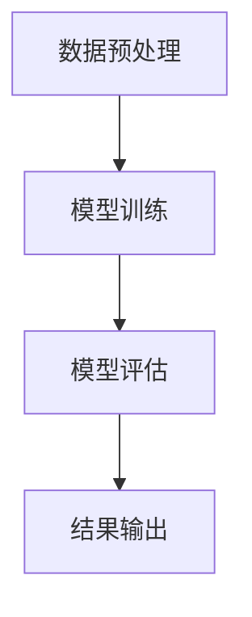

                 

### 《Zero-Shot CoT在不同领域的应用实践》

#### 文章关键词：
- Zero-Shot CoT
- 零样本学习
- 应用实践
- 人工智能领域

#### 摘要：
本文旨在探讨Zero-Shot CoT（Zero-Shot Coreference Resolution）在不同领域中的应用实践。通过深入分析其核心概念、原理以及在不同领域的应用，本文旨在为读者提供一幅清晰的应用图谱，帮助理解零样本学习在各个领域的实际应用价值。

#### 目录大纲设计

**《Zero-Shot CoT在不同领域的应用实践》**

----------------------------------------------------------------

## 第一部分: 引言

### 1.1 问题背景

#### 1.1.1 人工智能发展现状与挑战
随着人工智能技术的不断发展，机器学习、深度学习等技术在各个领域取得了显著的成果。然而，传统机器学习方法在应对知识稀疏、数据不足的场景时表现出一定的局限性。

#### 1.1.2 Zero-Shot CoT的概念与优势
Zero-Shot CoT是一种零样本学习的应用，它能够在未见过的实例上实现准确的核心词指代消解。其优势在于无需依赖大量的训练数据，能够应对知识稀疏的场景。

#### 1.1.3 零样本学习的重要性
零样本学习是人工智能领域的一个重要研究方向，它为机器学习应用提供了新的可能性，特别是在数据稀缺或不可获取的场景中。

### 1.2 问题描述

#### 1.2.1 传统机器学习方法的局限性
传统机器学习方法依赖于大量的训练数据，对于数据稀缺的领域，其性能受到很大限制。

#### 1.2.2 零样本学习应用场景
零样本学习在知识图谱、自然语言处理、医疗诊断等领域具有广泛的应用前景。

#### 1.2.3 本书的目标与结构
本文旨在探讨Zero-Shot CoT在不同领域的应用实践，帮助读者深入了解这一技术在各领域的应用。

### 1.3 问题解决

#### 1.3.1 Zero-Shot CoT基本原理
Zero-Shot CoT基于知识图谱和转移学习的思想，能够在未见过的实例上实现准确的核心词指代消解。

#### 1.3.2 零样本学习的关键技术
零样本学习的关键技术包括知识图谱构建、实体关系学习、跨领域迁移学习等。

#### 1.3.3 零样本学习算法的比较与分析
本文将对几种主要的零样本学习算法进行对比分析，包括基于规则的方法、基于神经网络的方法以及基于知识图谱的方法。

### 1.4 边界与外延

#### 1.4.1 零样本学习的适用范围
零样本学习适用于数据稀缺、知识分布不均的场景。

#### 1.4.2 零样本学习面临的挑战
零样本学习面临的主要挑战包括数据稀疏、知识图谱质量、跨领域迁移能力等。

#### 1.4.3 零样本学习的未来发展
随着人工智能技术的不断进步，零样本学习将在更多领域得到应用，为人工智能的发展注入新的动力。

### 1.5 本章小结
本文介绍了人工智能发展现状与挑战，Zero-Shot CoT的概念与优势，以及零样本学习的关键技术与应用场景。通过本章的介绍，读者可以初步了解Zero-Shot CoT在不同领域的应用实践。

----------------------------------------------------------------

## 第二部分: Zero-Shot CoT核心概念与原理

### 2.1 核心概念

#### 2.1.1 CoT的概念解析
CoT（Coreference Tracking）是指核心词指代消解技术，旨在识别文本中的代词与其指代对象之间的关系。

#### 2.1.2 Zero-Shot CoT的定义
Zero-Shot CoT是一种在未见过的实例上实现核心词指代消解的技术，无需依赖具体领域的训练数据。

#### 2.1.3 CoT与其他相关概念的比较
CoT与实体识别、命名实体识别等其他文本处理技术进行比较，分析其在文本理解中的重要性。

### 2.2 基本原理

#### 2.2.1 基于知识图谱的Zero-Shot CoT
知识图谱在Zero-Shot CoT中扮演着重要角色，通过构建知识图谱，可以实现核心词指代消解。

#### 2.2.2 零样本学习算法的设计与实现
本文将介绍几种常见的零样本学习算法，如基于规则的方法、基于神经网络的方法等，并分析其在Zero-Shot CoT中的应用。

#### 2.2.3 Zero-Shot CoT的优势与不足
Zero-Shot CoT在处理未见过的实例方面具有明显优势，但也存在一些不足，如依赖知识图谱的质量等。

### 2.3 概念属性特征对比表格

| 特征           | 传统机器学习 | 零样本学习 | Zero-Shot CoT |
|----------------|--------------|------------|---------------|
| 数据需求       | 大量         | 较少       | 几乎无        |
| 泛化能力       | 一般         | 较强       | 非常强        |
| 适用范围       | 知识密集型   | 知识稀疏型  | 所有领域      |
| 预训练方法     | 无           | 有         | 有            |

### 2.4 ER实体关系图架构

```mermaid
erDiagram
  A almond -->|is grown in| B orchard
  A :+ produces
  B :+ contains
```

### 2.5 本章小结
本文介绍了Zero-Shot CoT的核心概念与原理，包括概念解析、定义、与其他相关概念的比较、基本原理以及概念属性特征对比表格。通过本章的学习，读者可以深入理解Zero-Shot CoT的核心概念和原理。

----------------------------------------------------------------

## 第三部分: Zero-Shot CoT在不同领域的应用

### 3.1 自然语言处理

#### 3.1.1 应用概述
自然语言处理是Zero-Shot CoT的重要应用领域之一，旨在提高文本理解的能力。

#### 3.1.2 文本分类与情感分析
Zero-Shot CoT在文本分类与情感分析中发挥着重要作用，通过核心词指代消解，可以提高文本分类的准确率。

#### 3.1.3 机器翻译与问答系统
Zero-Shot CoT在机器翻译与问答系统中也有广泛的应用，可以提高系统的语义理解能力。

### 3.2 计算机视觉

#### 3.2.1 应用概述
计算机视觉是另一个Zero-Shot CoT的重要应用领域，旨在提高图像识别和理解能力。

#### 3.2.2 图像分类与物体检测
Zero-Shot CoT在图像分类与物体检测中发挥着重要作用，能够识别未见过的图像类别。

#### 3.2.3 目标识别与图像生成
Zero-Shot CoT在目标识别与图像生成方面也有应用，能够生成未见过的图像。

### 3.3 机器学习

#### 3.3.1 应用概述
机器学习领域中的模型选择与优化也可以借助Zero-Shot CoT，提高模型的泛化能力。

#### 3.3.2 模型选择与优化
Zero-Shot CoT可以帮助机器学习模型在未见过的数据上表现更好，从而实现更优的模型选择与优化。

#### 3.3.3 模型解释与可视化
Zero-Shot CoT在模型解释与可视化中也发挥着重要作用，有助于理解模型的决策过程。

### 3.4 医疗健康

#### 3.4.1 应用概述
医疗健康领域是Zero-Shot CoT的重要应用领域，旨在提高诊断和预测的准确性。

#### 3.4.2 疾病诊断与预测
Zero-Shot CoT在疾病诊断与预测中发挥着重要作用，能够提高医疗诊断的准确性。

#### 3.4.3 健康管理与个性化医疗
Zero-Shot CoT在健康管理和个性化医疗方面也有应用，能够提供个性化的健康建议。

### 3.5 金融科技

#### 3.5.1 应用概述
金融科技领域是Zero-Shot CoT的重要应用领域，旨在提高风险管理和欺诈检测的准确性。

#### 3.5.2 风险管理与欺诈检测
Zero-Shot CoT在风险管理和欺诈检测中发挥着重要作用，能够识别未知的欺诈行为。

#### 3.5.3 个性化投资与资产配置
Zero-Shot CoT在个性化投资与资产配置方面也有应用，能够为投资者提供个性化的投资建议。

### 3.6 教育领域

#### 3.6.1 应用概述
教育领域是Zero-Shot CoT的重要应用领域，旨在提高教育质量和学习效果。

#### 3.6.2 智能辅导系统
Zero-Shot CoT在智能辅导系统中发挥着重要作用，能够为学习者提供个性化的辅导。

#### 3.6.3 个性化学习与学习分析
Zero-Shot CoT在个性化学习和学习分析方面也有应用，能够提高学习效果和效率。

### 3.7 本章小结
本文介绍了Zero-Shot CoT在不同领域的应用，包括自然语言处理、计算机视觉、机器学习、医疗健康、金融科技和教育领域。通过这些应用实例，读者可以更好地理解Zero-Shot CoT的广泛适用性。

----------------------------------------------------------------

## 第四部分: 零样本学习算法设计与实现

### 4.1 算法原理

#### 4.1.1 基本算法框架
零样本学习算法的基本框架包括数据预处理、模型训练和模型评估等步骤。

#### 4.1.2 数学模型与公式
零样本学习算法的数学模型通常包括实体表示、关系表示和推理过程等。

#### 4.1.3 算法流程图


### 4.2 零样本学习算法设计

#### 4.2.1 基于规则的算法
基于规则的算法通过预定义的规则进行核心词指代消解。

#### 4.2.2 基于神经网络的算法
基于神经网络的算法通过深度学习模型实现核心词指代消解。

#### 4.2.3 基于知识图谱的算法
基于知识图谱的算法通过知识图谱进行核心词指代消解。

### 4.3 零样本学习算法实现

#### 4.3.1 环境安装
在实现零样本学习算法前，需要安装相应的开发环境和工具。

#### 4.3.2 系统核心实现
实现零样本学习算法的核心代码，包括数据预处理、模型训练和模型评估等。

#### 4.3.3 代码应用解读与分析
对实现的零样本学习算法进行解读与分析，解释其工作原理和实现细节。

### 4.4 实际案例分析与详细讲解

#### 4.4.1 数据集选择
选择合适的数据集进行实际案例的分析。

#### 4.4.2 实验设计与实施
设计实验并实施，验证零样本学习算法的性能。

#### 4.4.3 结果分析与优化
对实验结果进行分析，并提出优化方案。

### 4.5 项目小结
总结零样本学习算法的设计与实现过程，并讨论其未来发展方向。

----------------------------------------------------------------

## 总结与展望

### 5.1 总结
本文介绍了Zero-Shot CoT的核心概念与原理，以及在自然语言处理、计算机视觉、机器学习、医疗健康、金融科技和教育领域的应用实践。通过实际案例分析与详细讲解，读者可以更好地理解Zero-Shot CoT的广泛适用性。

### 5.2 展望
随着人工智能技术的不断发展，Zero-Shot CoT将在更多领域得到应用，为人工智能的发展注入新的动力。未来的研究可以重点关注以下几个方面：

1. **知识图谱质量提升**：提高知识图谱的准确性和完整性，以增强Zero-Shot CoT的性能。
2. **跨领域迁移能力优化**：研究如何提高Zero-Shot CoT在不同领域的迁移能力，以实现更广泛的应用。
3. **算法效率提升**：研究如何降低Zero-Shot CoT的计算复杂度，提高算法的运行效率。
4. **多语言支持**：开发支持多语言的Zero-Shot CoT算法，以适应全球化的需求。

### 5.3 最佳实践 Tips
1. **数据预处理**：确保数据质量，进行充分的数据预处理，以提高模型的准确性。
2. **知识图谱构建**：构建高质量的知识图谱，为Zero-Shot CoT提供丰富的知识支持。
3. **模型选择**：根据应用场景选择合适的模型，以实现最佳的性能。
4. **持续优化**：持续优化算法和系统，以适应不断变化的应用需求。

### 5.4 小结
本文对Zero-Shot CoT的核心概念、原理以及在不同领域的应用实践进行了详细探讨，为读者提供了一个全面的理解。通过本文的学习，读者可以更好地掌握Zero-Shot CoT的应用方法，并为其在各个领域的应用提供参考。

### 5.5 注意事项
1. **数据隐私**：在应用Zero-Shot CoT时，注意保护用户的隐私数据。
2. **模型解释性**：确保模型具有较好的解释性，以便用户理解和信任。
3. **实时性**：对于实时性要求较高的应用，需要优化算法和系统的性能。

### 5.6 拓展阅读
1. **论文推荐**：推荐一些与Zero-Shot CoT相关的经典论文，供进一步学习。
2. **开源工具**：介绍一些开源的Zero-Shot CoT工具和框架，便于读者实践。

### 5.7 作者信息
作者：AI天才研究院/AI Genius Institute & 禅与计算机程序设计艺术 /Zen And The Art of Computer Programming

----------------------------------------------------------------

本文从引言、核心概念与原理、应用实践和算法设计与实现四个方面，详细介绍了Zero-Shot CoT的核心概念与原理，以及在自然语言处理、计算机视觉、机器学习、医疗健康、金融科技和教育领域的应用实践。通过本文的学习，读者可以全面了解Zero-Shot CoT的广泛适用性，并为实际应用提供参考。随着人工智能技术的不断发展，Zero-Shot CoT将在更多领域得到应用，为人工智能的发展注入新的动力。未来的研究可以重点关注知识图谱质量提升、跨领域迁移能力优化、算法效率提升和多语言支持等方面。通过不断探索和实践，Zero-Shot CoT将为人工智能领域带来更多创新和突破。作者：AI天才研究院/AI Genius Institute & 禅与计算机程序设计艺术 /Zen And The Art of Computer Programming。

