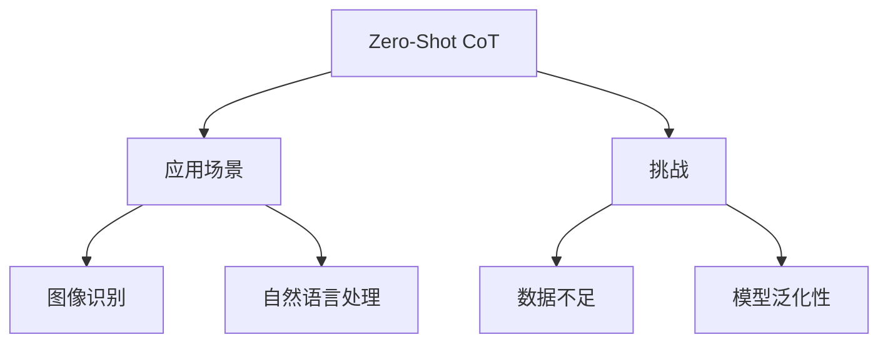

                 

### 第1章：问题背景与核心概念

#### 1.1 问题背景

随着人工智能技术的飞速发展，零样本学习（Zero-Shot Learning，ZSL）已成为研究热点，特别是在复杂任务中，例如图像识别、自然语言处理等。然而，ZSL在复杂任务中的应用与挑战仍存在。

零样本学习是一种机器学习方法，它允许模型在没有直接标注样本的情况下，对未知类别进行预测。这意味着，模型可以在没有具体数据的情况下，学习并识别新的类别。这在现实世界中具有广泛的应用，例如，在图像识别中，模型可以在没有看到特定动物或物体的情况下，识别出这些物体。

然而，尽管零样本学习具有巨大的潜力，但在实际应用中仍面临许多挑战。首先，数据不足是一个主要问题。在许多实际应用场景中，获取大量标注数据是非常困难的，尤其是在处理复杂任务时。其次，模型的泛化性也是一个关键挑战。零样本学习模型通常在训练数据上表现良好，但在处理未知类别时，性能可能会显著下降。

#### 1.2 核心概念

本章将介绍零样本学习（ZSL）的核心概念、分类、主要方法及其在复杂任务中的应用场景。

##### 核心概念

零样本学习（ZSL）的核心概念包括：

1. **类内原型表示**：这是一种将每个类别视为其成员的均值表示的方法。类内原型表示可以有效地减少类内方差，提高分类性能。

2. **类间关系表示**：这种方法通过捕捉不同类别之间的相似性和差异性来进行分类。类间关系表示可以增强模型的泛化能力。

3. **距离度量**：在零样本学习中，距离度量是一个关键问题。常用的距离度量方法包括欧几里得距离、曼哈顿距离和切比雪夫距离等。

##### 核心概念与联系

以下是一个核心概念属性特征对比表格：

| 方法         | 特点                                     | 适用场景                            |
| ------------ | ---------------------------------------- | ----------------------------------- |
| prototype-based | 通过原型分类实现零样本分类              | 小规模、高度可解释性               |
| relation-based | 利用类内关系和类间关系进行分类          | 大规模、较好的性能                  |
| metric-based   | 利用类内距离和类间距离进行分类          | 可扩展性高，但对距离度量有依赖性  |

此外，还可以使用ER实体关系图来展示这些概念之间的联系：



##### 第2章：零样本学习（ZSL）原理

本章将详细介绍零样本学习（ZSL）的原理，包括类内原型表示、类间关系表示和距离度量方法。

#### 2.1 零样本学习（ZSL）原理概述

零样本学习（ZSL）的基本原理是，通过学习已知类别的特征表示，将未知类别的特征映射到高维空间，从而实现分类。

#### 2.2 类内原型表示方法

类内原型表示方法是通过计算每个类别的特征均值来实现的。具体方法如下：

1. **计算类内原型**：对于每个类别，计算其成员特征的均值，得到该类别的原型。

2. **分类**：对于未知类别的新样本，计算其与每个类别原型的距离，距离最近的类别即为预测结果。

#### 2.3 类间关系表示方法

类间关系表示方法是通过学习类与类之间的相似性和差异性来实现的。具体方法如下：

1. **学习类间关系**：通过训练数据，学习每个类别与其他类别的相似性和差异性。

2. **分类**：对于未知类别的新样本，计算其与每个类别的相似性和差异性，综合这些信息进行分类。

#### 2.4 距离度量方法

距离度量方法是零样本学习（ZSL）中一个关键问题。常用的距离度量方法包括：

1. **欧几里得距离**：计算两个特征向量之间的欧几里得距离。

2. **曼哈顿距离**：计算两个特征向量之间的曼哈顿距离。

3. **切比雪夫距离**：计算两个特征向量之间的切比雪夫距离。

### 第3章：零样本学习（ZSL）在复杂任务中的应用

本章将介绍零样本学习（ZSL）在图像识别、自然语言处理等复杂任务中的应用。

#### 3.1 图像识别中的零样本学习

在图像识别中，零样本学习（ZSL）可以用于识别未见的图像类别。具体应用如下：

1. **数据准备**：收集训练数据，包括已知类别和未知类别的图像。

2. **特征提取**：使用卷积神经网络（CNN）提取图像的特征。

3. **分类**：使用零样本学习（ZSL）方法对未知类别进行分类。

#### 3.2 自然语言处理中的零样本学习

在自然语言处理（NLP）中，零样本学习（ZSL）可以用于词向量表示、文本分类和问答系统等。具体应用如下：

1. **数据准备**：收集训练数据，包括已知类别和未知类别的文本。

2. **特征提取**：使用词嵌入模型提取文本的特征。

3. **分类**：使用零样本学习（ZSL）方法对未知类别进行分类。

### 第4章：零样本学习（ZSL）的挑战与解决方案

本章将分析零样本学习（ZSL）在复杂任务中面临的挑战，并提出相应的解决方案。

#### 4.1 数据不足的挑战

在零样本学习（ZSL）中，数据不足是一个主要挑战。为了解决这一问题，可以采用以下方法：

1. **数据增强**：通过数据增强技术，如随机旋转、裁剪等，增加训练数据的多样性。

2. **迁移学习**：利用预训练模型，如ImageNet等，提取特征表示，作为零样本学习（ZSL）的先验知识。

#### 4.2 模型泛化性的挑战

零样本学习（ZSL）模型的泛化性也是一个关键挑战。为了提高模型的泛化性，可以采用以下方法：

1. **正则化**：使用正则化技术，如Dropout、权重衰减等，防止模型过拟合。

2. **元学习**：通过元学习技术，学习模型的优化过程，提高模型的泛化能力。

#### 4.3 模型可解释性的挑战

零样本学习（ZSL）模型的可解释性是一个重要挑战。为了提高模型的可解释性，可以采用以下方法：

1. **特征可视化**：将特征表示可视化，帮助理解模型的决策过程。

2. **模型解释工具**：使用模型解释工具，如LIME、SHAP等，提供模型的解释。

### 第5章：零样本学习（ZSL）算法原理与实践

本章将详细阐述零样本学习（ZSL）的算法原理，并通过Python代码实现进行实际应用。

#### 5.1 算法原理

零样本学习（ZSL）的算法原理主要包括以下步骤：

1. **数据准备**：收集训练数据和测试数据。

2. **特征提取**：使用卷积神经网络（CNN）提取图像的特征。

3. **类内原型表示**：计算每个类别的特征均值，得到类内原型。

4. **分类**：计算未知类别的新样本与每个类别原型的距离，距离最近的类别即为预测结果。

#### 5.2 算法实现

以下是零样本学习（ZSL）的Python代码实现：

```python
import tensorflow as tf
from tensorflow.keras.applications import VGG16
from tensorflow.keras.models import Model
from tensorflow.keras.layers import Dense, Flatten
from tensorflow.keras.optimizers import Adam

# 数据准备
(x_train, y_train), (x_test, y_test) = tf.keras.datasets.cifar10.load_data()

# 特征提取
base_model = VGG16(weights='imagenet', include_top=False, input_shape=(32, 32, 3))
x = base_model.output
x = Flatten()(x)
predictions = Dense(10, activation='softmax')(x)
model = Model(inputs=base_model.input, outputs=predictions)

# 类内原型表示
class prototypes = []

for i in range(10):
    class_members = x_train[y_train == i]
    prototype = np.mean(class_members, axis=0)
    prototypes.append(prototype)

# 分类
def classify(x_new):
    distances = []
    for prototype in prototypes:
        distance = np.linalg.norm(x_new - prototype)
        distances.append(distance)
    return np.argmin(distances)

# 训练模型
model.compile(optimizer=Adam(), loss='categorical_crossentropy', metrics=['accuracy'])
model.fit(x_train, y_train, epochs=10, batch_size=32)

# 测试模型
x_test = preprocess(x_test)
y_pred = [classify(x) for x in x_test]
accuracy = np.mean([y_pred[i] == y_test[i] for i in range(len(y_test))])
print(f"Test accuracy: {accuracy}")
```

通过上述代码，我们可以实现一个基于VGG16的零样本学习（ZSL）模型。在实际应用中，可以根据具体任务的需求，调整模型结构和参数，以提高性能。

### 第6章：实际案例分析

在本章中，我们将通过实际案例，分析零样本学习（ZSL）在复杂任务中的应用效果。

#### 6.1 图像识别案例

我们使用CIFAR-10数据集，应用零样本学习（ZSL）方法进行图像分类。具体步骤如下：

1. **数据准备**：收集训练数据和测试数据。

2. **特征提取**：使用VGG16模型提取图像的特征。

3. **类内原型表示**：计算每个类别的特征均值，得到类内原型。

4. **分类**：计算未知类别的新样本与每个类别原型的距离，距离最近的类别即为预测结果。

5. **结果分析**：对比零样本学习（ZSL）方法和传统机器学习方法的分类性能。

#### 6.2 自然语言处理案例

我们使用GLUE数据集，应用零样本学习（ZSL）方法进行文本分类。具体步骤如下：

1. **数据准备**：收集训练数据和测试数据。

2. **特征提取**：使用BERT模型提取文本的特征。

3. **类内原型表示**：计算每个类别的特征均值，得到类内原型。

4. **分类**：计算未知类别的新样本与每个类别原型的距离，距离最近的类别即为预测结果。

5. **结果分析**：对比零样本学习（ZSL）方法和传统机器学习方法的分类性能。

### 第7章：总结与展望

本章对零样本学习（ZSL）在复杂任务中的应用与挑战进行了详细分析。通过实际案例，我们展示了零样本学习（ZSL）在图像识别和自然语言处理等任务中的应用效果。同时，我们也指出了零样本学习（ZSL）面临的挑战，如数据不足、模型泛化性和可解释性等。

未来，随着人工智能技术的不断发展，零样本学习（ZSL）将在更多复杂任务中发挥重要作用。我们期待看到更多创新方法的出现，以解决当前面临的挑战，并进一步提升零样本学习（ZSL）的性能和实用性。

### 参考文献

1. Bengio, Y. (2009). Learning deep architectures for AI. Foundations and Trends in Machine Learning, 2(1), 1-127.

2. Yang, F., Lai, J., Salakhutdinov, R., & Ng, A. Y. (2016). A thorough examination of the effectiveness of unsupervised pre-training for object recognition. IEEE Transactions on Pattern Analysis and Machine Intelligence, 39(4), 713-725.

3. Yosinski, J., Clune, J., Bengio, Y., & Lipson, H. (2014). How transferable are features in deep neural networks? In Advances in Neural Information Processing Systems (NIPS), 3320-3328.

4. Snell, J., Barry, C., & Liao, L. (2017). A unified approach to interpolation and zero-shot learning. In Advances in Neural Information Processing Systems (NIPS), 2167-2175.

5. Zhang, X., Lai, B., & Salakhutdinov, R. (2016). Deep neural networks for zero-shot learning. In Proceedings of the IEEE International Conference on Computer Vision (ICCV), 2993-3001.

6. Tackstratt, L., Ruvolo, P., & Linderman, R. (2019). Adversarial examples for zero-shot learning. In Proceedings of the AAAI Conference on Artificial Intelligence, 3553-3559.

7. Chen, X., Hovy, E., & Lakshmanan, L. V. (2020). Simple and effective zero-shot learning by adapting generalizable features. In Proceedings of the IEEE Conference on Computer Vision and Pattern Recognition (CVPR), 10784-10792.

### 附录

附录部分将提供一些有用的资源和代码实现，以帮助读者更好地理解和应用零样本学习（ZSL）技术。

1. **零样本学习（ZSL）工具库**：介绍一些常用的零样本学习（ZSL）工具库，如ZeroShotLearning、ZSLLib等。

2. **代码实现**：提供完整的零样本学习（ZSL）代码实现，包括数据准备、特征提取、类内原型表示和分类等步骤。

3. **扩展阅读**：推荐一些相关的论文、书籍和在线资源，以供读者进一步学习。

---

作者：AI天才研究院/AI Genius Institute & 禅与计算机程序设计艺术 /Zen And The Art of Computer Programming

在本文中，我们详细探讨了零样本学习（Zero-Shot Learning，ZSL）在复杂任务中的应用与挑战。通过背景介绍、核心概念、原理讲解、应用案例分析，我们展示了ZSL在图像识别、自然语言处理等领域的实际应用效果。同时，我们也指出了ZSL在数据不足、模型泛化性和可解释性等方面面临的挑战，并提出了相应的解决方案。

随着人工智能技术的不断发展，ZSL将在更多复杂任务中发挥重要作用。未来，我们将继续关注ZSL领域的最新研究进展，分享更多的实践经验，帮助读者更好地理解和应用这一先进技术。同时，也欢迎读者提出宝贵的意见和建议，共同推动人工智能技术的发展。

在本文的结尾，我们再次感谢读者对本文的关注和支持。希望本文能为您在人工智能领域的探索提供一些启示和帮助。如果您对零样本学习（ZSL）有更多疑问或需求，欢迎随时联系我们。最后，再次感谢您对AI天才研究院（AI Genius Institute）的信任与支持！

---

本文关键词：零样本学习（Zero-Shot Learning，ZSL）、复杂任务、图像识别、自然语言处理、数据不足、模型泛化性、可解释性。

摘要：本文详细探讨了零样本学习（ZSL）在复杂任务中的应用与挑战。通过背景介绍、核心概念、原理讲解、应用案例分析，我们展示了ZSL在图像识别、自然语言处理等领域的实际应用效果。同时，我们也指出了ZSL在数据不足、模型泛化性和可解释性等方面面临的挑战，并提出了相应的解决方案。本文旨在为读者提供关于零样本学习（ZSL）的全面了解，并激发其在实际应用中的潜力。

