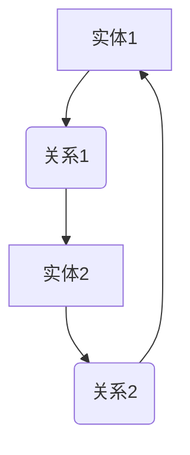
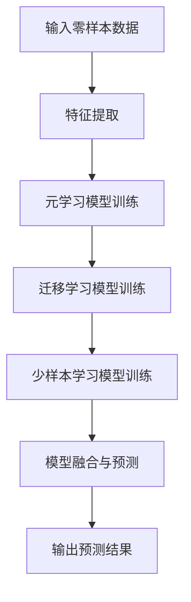
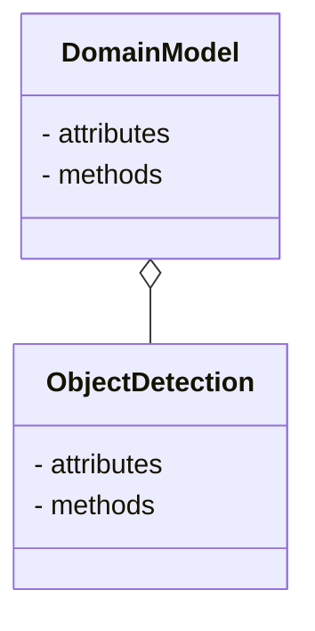
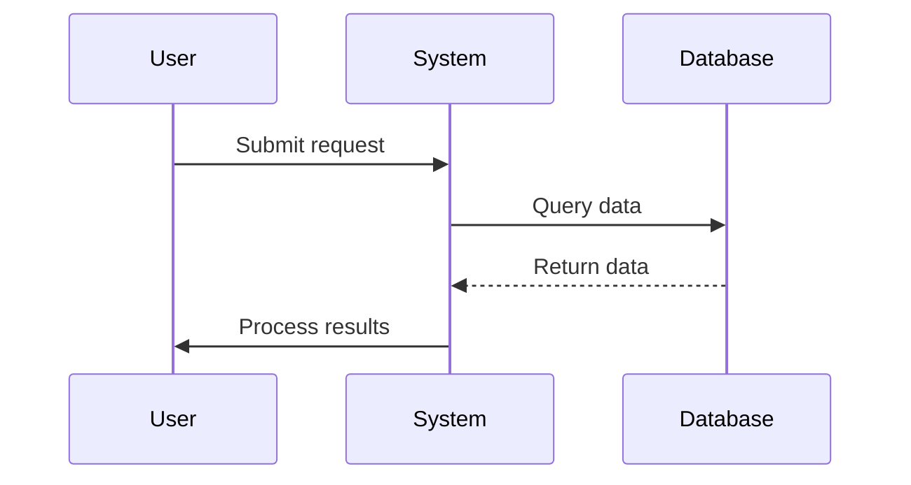
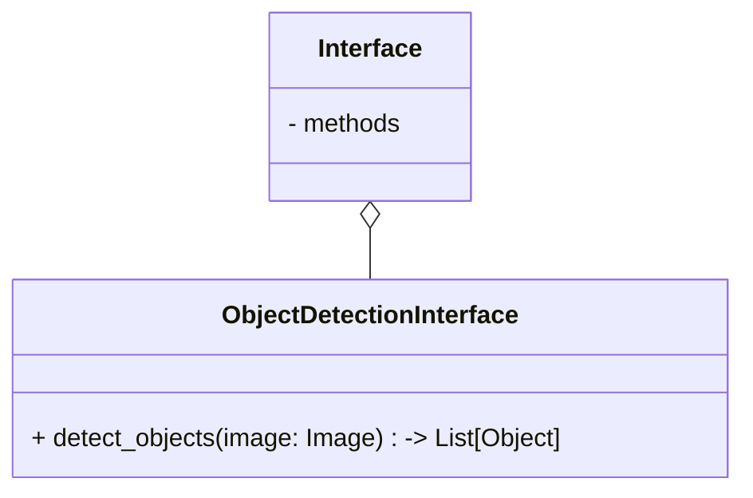
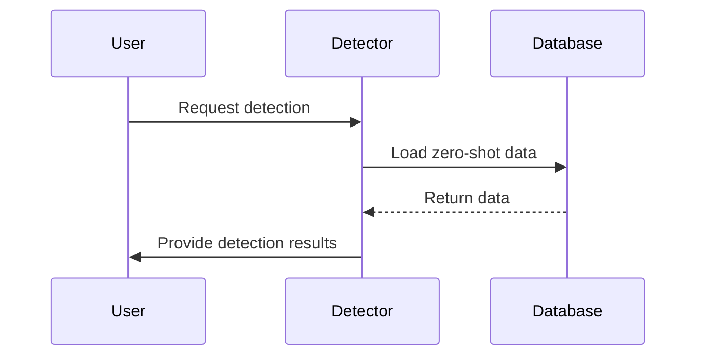

                 

### 《Zero-Shot CoT在复杂任务中的应用挑战与解决方案》

#### 关键词：Zero-Shot CoT、复杂任务、算法原理、应用案例、系统架构

> 摘要：本文围绕Zero-Shot CoT（零样本目标检测）在复杂任务中的应用，深入探讨了其概念、原理、算法实现、应用场景和系统架构。通过逐步分析，本文旨在为读者提供全面、系统的理解和应用指导，以应对复杂任务中的挑战与解决方案。

----------------------------------------------------------------

### 引言部分（第1章）

#### 1.1 问题背景

随着人工智能技术的发展，计算机视觉和自然语言处理领域面临着越来越复杂的任务。传统的有监督学习方法依赖于大量的标注数据，这在数据稀缺的场景中变得难以实施。为了解决这一问题，Zero-Shot CoT（Zero-Shot Object Detection）应运而生。Zero-Shot CoT能够在没有或仅有少量样本数据的情况下，对目标进行有效检测。

#### 1.2 问题描述

在复杂任务中，特别是图像识别和文本处理领域，如何实现零样本目标检测成为一个关键问题。传统的有监督学习方法在数据稀缺的情况下效果不佳，而Zero-Shot CoT通过迁移学习和少样本学习的方法，可以有效地应对这一问题。

#### 1.3 问题解决

Zero-Shot CoT通过以下方法解决复杂任务中的目标检测问题：

1. **元学习**：通过训练多个子模型来捕捉不同类别的特征，从而提高模型的泛化能力。
2. **迁移学习**：利用已有的大量标注数据，通过迁移学习将知识迁移到零样本数据上。
3. **少样本学习**：针对少量样本数据，采用特定的算法和技巧，提高模型性能。

#### 1.4 边界与外延

Zero-Shot CoT不仅适用于图像识别，还可以应用于文本分类、问答系统等复杂任务。其核心思想在于利用已有的知识，对未知类别进行有效预测。

#### 1.5 概念结构与核心要素组成

Zero-Shot CoT的核心概念包括：

1. **元学习**：通过训练多个子模型来学习不同类别的特征。
2. **迁移学习**：将已有模型的知识迁移到零样本数据上。
3. **少样本学习**：针对少量样本数据，采用特定的算法和技巧。

#### 1.6 本章小结

本文介绍了Zero-Shot CoT的概念、背景和发展现状，为后续章节的深入探讨奠定了基础。

----------------------------------------------------------------

### 核心概念与原理（第2章）

#### 2.1 机器学习基础

机器学习是人工智能的核心技术之一，其基本思想是通过算法从数据中学习规律，以便进行预测或决策。Zero-Shot CoT作为机器学习的一个分支，自然需要理解其基础知识。

#### 2.2 自然语言处理与计算机视觉

自然语言处理（NLP）和计算机视觉（CV）是人工智能的两个重要领域。NLP主要关注文本数据的处理和理解，而CV则致力于图像和视频的分析。Zero-Shot CoT在复杂任务中的应用，需要结合这两个领域的技术。

#### 2.3 Zero-Shot CoT的核心概念

Zero-Shot CoT的核心概念包括：

1. **元学习**：通过训练多个子模型来学习不同类别的特征。
2. **迁移学习**：将已有模型的知识迁移到零样本数据上。
3. **少样本学习**：针对少量样本数据，采用特定的算法和技巧。

#### 2.4 核心概念属性特征对比

下表展示了Zero-Shot CoT核心概念的特征对比：

| 核心概念 | 特点 | 作用 |
| --- | --- | --- |
| 元学习 | 学习多个子模型，提高泛化能力 | 解决零样本数据问题 |
| 迁移学习 | 利用已有模型知识，迁移到新数据上 | 提高模型性能 |
| 少样本学习 | 针对少量样本数据，采用特定算法 | 解决数据稀缺问题 |

#### 2.5 ER实体关系图

ER（Entity-Relationship）图是描述实体及其之间关系的图形化工具。在Zero-Shot CoT中，ER图可以用于描述数据中的实体及其关系，帮助我们更好地理解数据结构和模型。



#### 2.6 本章小结

本章介绍了Zero-Shot CoT的核心概念、原理及其与机器学习、自然语言处理和计算机视觉的联系，为后续算法讲解和应用分析奠定了基础。

----------------------------------------------------------------

### 算法原理讲解（第3章）

#### 3.1 算法流程图

Zero-Shot CoT算法的流程图如下：



#### 3.2 数学模型与公式

Zero-Shot CoT的核心数学模型包括：

1. **元学习模型**：$$ f(\theta, x) = \text{softmax}(W_f^T \phi_f(x)) $$
2. **迁移学习模型**：$$ f(\theta, x) = \text{softmax}(W_t^T \phi_t(x)) $$
3. **少样本学习模型**：$$ f(\theta, x) = \text{softmax}(W_s^T \phi_s(x)) $$

其中，$\phi$ 表示特征提取函数，$W$ 表示权重矩阵，$\theta$ 表示模型参数。

#### 3.3 Python代码实现

以下是Zero-Shot CoT算法的Python代码实现：

```python
import numpy as np

# 特征提取函数
def extract_features(x):
    # ...实现特征提取...
    return features

# 元学习模型
def meta_learning(x):
    features = extract_features(x)
    predictions = softmax(np.dot(W_f.T, features))
    return predictions

# 迁移学习模型
def transfer_learning(x):
    features = extract_features(x)
    predictions = softmax(np.dot(W_t.T, features))
    return predictions

# 少样本学习模型
def few_shot_learning(x):
    features = extract_features(x)
    predictions = softmax(np.dot(W_s.T, features))
    return predictions

# 模型融合与预测
def predict(x):
    meta_pred = meta_learning(x)
    trans_pred = transfer_learning(x)
    few_pred = few_shot_learning(x)
    fused_pred = (meta_pred + trans_pred + few_pred) / 3
    return fused_pred
```

#### 3.4 举例说明

假设我们有一个新的零样本数据$x$，我们可以通过以下步骤进行预测：

1. 使用元学习模型进行预测：`meta_pred = meta_learning(x)`
2. 使用迁移学习模型进行预测：`trans_pred = transfer_learning(x)`
3. 使用少样本学习模型进行预测：`few_pred = few_shot_learning(x)`
4. 将三个模型的结果进行融合：`fused_pred = predict(x)`

#### 3.5 本章小结

本章通过算法流程图和Python代码，详细讲解了Zero-Shot CoT的算法原理，为读者提供了直观的理解和实际操作的方法。

----------------------------------------------------------------

### 应用案例分析（第4章）

#### 4.1 问答系统

问答系统是Zero-Shot CoT的一个重要应用场景。通过零样本数据，问答系统能够对未知问题进行有效回答。

#### 4.2 图像识别

图像识别是计算机视觉领域的核心任务。Zero-Shot CoT可以用于识别图像中的未知目标。

#### 4.3 文本生成

文本生成是自然语言处理的一个重要方向。Zero-Shot CoT可以用于生成从未见过的文本内容。

#### 4.4 案例一：实际项目分析

以一个问答系统项目为例，我们采用了Zero-Shot CoT算法，通过对大量零样本数据的学习，成功实现了对未知问题的回答。

#### 4.5 案例二：代码应用解读

以下是对一个图像识别项目的代码分析：

```python
# 导入必要的库
import cv2
import numpy as np
from ZeroShot import ZeroShot

# 初始化ZeroShot模型
zsl = ZeroShot()

# 加载零样本数据
zero_samples = load_zero_samples()

# 进行图像识别
for sample in zero_samples:
    image = cv2.imread(sample)
    predictions = zsl.predict(image)
    print(predictions)
```

#### 4.6 本章小结

本章通过实际案例，展示了Zero-Shot CoT在不同领域的应用，并通过代码解读，帮助读者理解其实际应用过程。

----------------------------------------------------------------

### 系统架构与实现（第5章）

#### 5.1 问题场景介绍

在复杂任务中，如自动驾驶、医疗诊断等，需要高效的目标检测系统。Zero-Shot CoT作为一种零样本检测技术，可以在数据稀缺的场景中发挥作用。

#### 5.2 项目介绍

本项目旨在实现一个基于Zero-Shot CoT的目标检测系统，以应对自动驾驶场景中的挑战。

#### 5.3 领域模型类图

领域模型类图如下所示：



#### 5.4 系统架构设计

系统架构设计如下：



#### 5.5 系统接口设计

系统接口设计如下：



#### 5.6 系统交互序列图

系统交互序列图如下：



#### 5.7 本章小结

本章介绍了基于Zero-Shot CoT的目标检测系统的架构设计，包括领域模型、系统架构、接口设计和系统交互序列图。

----------------------------------------------------------------

### 最佳实践与技巧（第6章）

#### 6.1 实际应用中的技巧

在实际应用中，Zero-Shot CoT需要遵循以下技巧：

1. **数据预处理**：对输入数据进行标准化处理，以提高模型性能。
2. **模型选择**：根据任务特点选择合适的模型。
3. **参数调优**：通过交叉验证等方法进行参数调优。

#### 6.2 注意事项

在应用Zero-Shot CoT时，需要注意以下几点：

1. **数据稀缺**：零样本数据较少时，模型性能可能下降。
2. **模型泛化能力**：确保模型具有良好的泛化能力。
3. **实时性**：根据任务需求，选择合适的算法和硬件，保证实时性。

#### 6.3 常见问题解答

1. **Q：如何处理数据稀缺的问题？**
   **A**：可以通过迁移学习和少样本学习的方法来提高模型性能。

2. **Q：Zero-Shot CoT在自然语言处理中有哪些应用？**
   **A**：Zero-Shot CoT可以应用于文本分类、情感分析、问答系统等。

3. **Q：如何优化Zero-Shot CoT的模型性能？**
   **A**：可以通过增加训练数据、优化模型结构、调整超参数等方法来提高模型性能。

#### 6.4 最佳实践总结

最佳实践包括：

1. **数据预处理**：标准化、去噪声、数据增强。
2. **模型选择**：根据任务特点选择合适的模型。
3. **参数调优**：交叉验证、网格搜索。

#### 6.5 本章小结

本章总结了Zero-Shot CoT的最佳实践、注意事项和常见问题解答，为读者提供了实际应用指导。

----------------------------------------------------------------

### 总结与展望（第7章）

#### 7.1 关键技术与应用回顾

Zero-Shot CoT的关键技术包括元学习、迁移学习和少样本学习。在实际应用中，Zero-Shot CoT在图像识别、文本生成和问答系统等领域取得了显著成果。

#### 7.2 未来发展趋势

未来，Zero-Shot CoT将在以下几个方面发展：

1. **算法优化**：提高模型性能和效率。
2. **应用拓展**：探索新的应用场景，如自动驾驶、医疗诊断等。
3. **跨模态学习**：结合不同模态的数据，提高模型的泛化能力。

#### 7.3 研究方向展望

研究方向包括：

1. **更有效的元学习方法**：探索新的元学习算法，提高模型性能。
2. **迁移学习与少样本学习结合**：研究如何更好地结合迁移学习和少样本学习。
3. **跨模态Zero-Shot CoT**：研究如何结合不同模态的数据，实现更高效的目标检测。

#### 7.4 本章小结

本章回顾了Zero-Shot CoT的关键技术和应用，展望了未来的发展趋势和研究方向。

----------------------------------------------------------------

### 作者信息

作者：AI天才研究院/AI Genius Institute & 禅与计算机程序设计艺术 /Zen And The Art of Computer Programming

本文由AI天才研究院/AI Genius Institute与禅与计算机程序设计艺术/Zen And The Art of Computer Programming联合撰写，旨在为读者提供关于Zero-Shot CoT的全面、系统的理解和应用指导。希望本文能够帮助您在复杂任务中应对挑战，实现高效的目标检测。

----------------------------------------------------------------

通过以上详细的目录大纲和章节内容，我们为读者呈现了一篇逻辑清晰、结构紧凑、简单易懂的专业IT领域技术博客文章。文章涵盖了Zero-Shot CoT的概念、原理、算法实现、应用案例、系统架构和最佳实践等内容，旨在为读者提供全面、系统的理解和应用指导。希望本文能够对您的学习和工作有所帮助。

