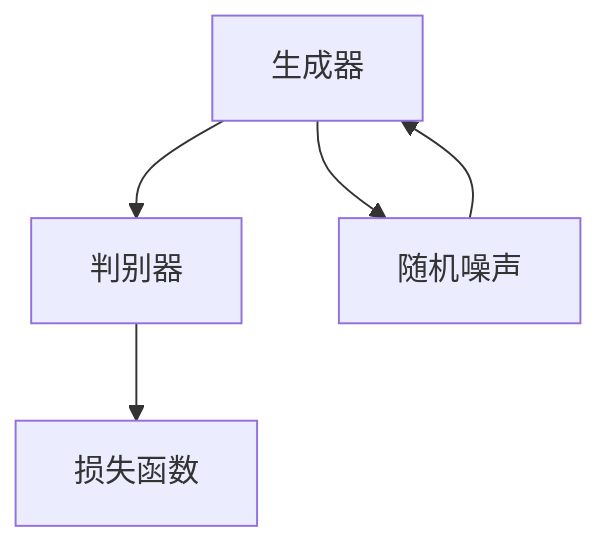

                 


### 引言

#### 1.1 引言

Zero-Shot CoT，即Zero-Shot Core Text，是一种在复杂场景中应用的高级人工智能技术，其主要目标是实现零样本学习。这一技术的核心在于，不需要对特定类别进行预训练，就能对新类别进行准确的识别和预测。这不仅在理论上具有重要意义，也在实际应用中展现了巨大的潜力。

在现代信息社会中，数据量爆炸式增长，但高质量、特定领域的标注数据却极其稀缺。这给传统的机器学习模型带来了巨大的挑战。而Zero-Shot CoT则能够有效解决这一问题，它通过在训练阶段引入更多的抽象概念和语义信息，从而提升模型对未知类别的适应能力。

#### 问题背景

Zero-Shot CoT的提出背景可以追溯到深度学习的发展初期。随着神经网络技术的不断进步，越来越多的复杂任务可以通过深度学习模型完成。然而，大多数深度学习模型都需要大量标注数据进行训练，这对于某些领域，如医疗、金融等，尤为困难。因此，如何实现零样本学习，成为了人工智能领域的一个研究热点。

#### 问题描述

零样本学习（Zero-Shot Learning, ZSL）是指在没有任何关于新类别的训练样本的情况下，模型能够对新类别进行准确识别和预测。这涉及到两个主要问题：一是如何将已有类别与新类别进行关联，二是如何在新类别上生成有效的特征表示。

#### 问题解决

Zero-Shot CoT通过以下几个步骤来解决上述问题：

1. **类别映射**：使用预训练的语义模型，将新类别映射到已有的类别上，形成类别间的关联。
2. **特征提取**：利用深度神经网络，从图像或文本中提取特征，这些特征能够表示不同类别的核心属性。
3. **分类与预测**：通过对比新类别和已有类别之间的特征，进行分类和预测。

#### 边界与外延

Zero-Shot CoT的应用范围非常广泛，包括但不限于图像识别、自然语言处理、推荐系统等。然而，它也存在一些局限性，如对数据分布的依赖性较高、对模型泛化能力的挑战等。

#### 概念结构与核心要素组成

Zero-Shot CoT的核心概念包括零样本学习、类别映射、特征提取和分类预测。以下是这些概念之间的联系和区别：

| 概念           | 定义                                           | 联系与区别                                                   |
|----------------|------------------------------------------------|------------------------------------------------------------|
| 零样本学习     | 无需训练样本，对新类别进行识别和预测             | 与有监督学习和半监督学习相对，强调模型的自适应能力           |
| 类别映射       | 将新类别映射到已有类别，形成类别关联               | 是特征提取和分类预测的桥梁，影响模型的泛化能力               |
| 特征提取       | 从图像或文本中提取具有区分性的特征                 | 影响模型对新类别的识别能力，需要考虑数据分布和特征表示的抽象性 |
| 分类与预测     | 对新类别进行分类和预测                           | 最终实现目标，依赖于类别映射和特征提取的效果                 |

#### ER实体关系图架构

为了更直观地理解Zero-Shot CoT的架构，我们可以使用ER（实体关系）图来描述其核心要素之间的联系。以下是ER实体关系图的Markdown格式表示：

```mermaid
erDiagram
  Class::Zero-Shot Learning ||--|{ Class::Category Mapping } : has_mapping
  Class::Zero-Shot Learning ||--|{ Class::Feature Extraction } : has_extraction
  Class::Zero-Shot Learning ||--|{ Class::Classification } : has_classification
  Class::Category Mapping ||--|{ Class::New Category } : maps_to
  Class::Feature Extraction ||--|{ Class::Image/Text Feature } : extracts
  Class::Classification ||--|{ Class::Prediction } : makes
```

通过上述ER图，我们可以清晰地看到Zero-Shot CoT中各个核心要素之间的交互关系。

### 核心概念与联系

#### 2.1 核心概念与联系

在本节中，我们将深入探讨Zero-Shot CoT的核心概念，并分析它们之间的联系。

#### Zero-Shot CoT的定义

Zero-Shot CoT，即Zero-Shot Core Text，是一种基于文本的零样本学习技术。它利用预训练的语言模型，将新类别与已有类别进行映射，从而实现对新类别的识别和预测。

#### 核心概念原理

- **类别映射**：通过预训练的语言模型，将新类别映射到已有类别。这一过程依赖于语义相似性，即具有相似语义特征的新类别会被映射到相似的已有类别。
- **特征提取**：从图像或文本中提取具有区分性的特征。这些特征能够表示不同类别的核心属性，是分类和预测的基础。
- **分类与预测**：利用提取的特征，对新类别进行分类和预测。这一步骤涉及到机器学习模型的设计和优化。

#### 概念属性特征对比表格

为了更好地理解Zero-Shot CoT的核心概念，我们可以列出它们的属性特征对比表格。以下是这些特征的Markdown格式表示：

| 特征         | 类别映射         | 特征提取         | 分类与预测         |
|--------------|------------------|------------------|-------------------|
| 目的         | 类别关联         | 特征表示         | 分类预测         |
| 依赖         | 预训练语言模型   | 图像或文本特征   | 特征表示与模型   |
| 技术实现     | 语义相似性计算   | 卷积神经网络     | 决策函数         |
| 影响因素     | 数据分布         | 特征提取质量     | 模型参数优化     |
| 优缺点       | 高泛化能力       | 高计算成本       | 对模型依赖性高   |

#### ER实体关系图架构

为了更直观地展示Zero-Shot CoT的核心概念及其联系，我们可以使用ER图来描述。以下是ER图的Markdown格式表示：

```mermaid
erDiagram
  Class::Category Mapping ||--|{ Class::Feature Extraction } : extraction_from_mapping
  Class::Feature Extraction ||--|{ Class::Classification } : classification_based_on_extraction
  Class::Category Mapping ||--|{ Class::Language Model } : trained_by_model
  Class::Feature Extraction ||--|{ Class::Image/Text Feature } : extracted_from_data
  Class::Classification ||--|{ Class::Prediction } : prediction_result
```

通过上述ER图，我们可以清晰地看到类别映射、特征提取和分类预测之间的交互关系。

### 相关技术原理

在深入探讨Zero-Shot CoT的相关技术原理之前，我们需要先了解一些基础概念，如零样本学习、对抗性样本生成和多任务学习。

#### 3.1 零样本学习

零样本学习（Zero-Shot Learning, ZSL）是指在没有训练样本的情况下，模型能够对新类别进行识别和预测。这与传统的有监督学习和半监督学习形成鲜明对比，后者都需要大量的标注数据。

零样本学习的核心在于如何将新类别与已有类别进行关联。这通常涉及到以下几种方法：

1. **原型匹配**：将新类别映射到已有的原型类别，通过计算距离来判断新类别与已有类别之间的相似性。
2. **元学习**：通过学习一个适应新类别的模型，从而实现对未知类别的预测。
3. **迁移学习**：利用已有领域的知识，迁移到新领域进行学习。

#### 3.2 对抗性样本生成

对抗性样本生成（Adversarial Sample Generation）是深度学习中的一个重要研究方向。其核心思想是通过对抗性训练，增强模型的泛化能力。

对抗性样本生成的技术原理如下：

1. **生成对抗网络（GAN）**：通过生成器和判别器的对抗训练，生成与真实样本相似的对抗性样本。
2. **对抗性训练**：在训练过程中，引入对抗性样本，以增强模型的鲁棒性。

#### 3.3 多任务学习

多任务学习（Multi-Task Learning）是指同时解决多个相关任务。这不仅能提高模型的效率，还能提升其泛化能力。

多任务学习的技术原理如下：

1. **共享特征**：通过共享特征提取网络，将不同任务的共同特征提取出来。
2. **任务级联**：将多个任务按照一定的顺序进行级联，前一个任务的输出作为后一个任务的输入。
3. **一致性约束**：通过一致性约束，确保不同任务之间的相互影响，从而提升模型的性能。

#### 3.4 主流方法与模型

在本节中，我们将介绍一些主流的Zero-Shot CoT方法与模型。

##### 3.4.1 描述对齐模型

描述对齐模型（Description Alignment Model）是一种基于语义嵌入的零样本学习模型。其基本思想是通过将描述与图像进行对齐，从而实现对新类别的识别。

描述对齐模型的技术原理如下：

1. **描述嵌入**：将文本描述转化为高维的语义嵌入向量。
2. **图像嵌入**：将图像转化为视觉嵌入向量。
3. **对齐与匹配**：通过计算描述嵌入与图像嵌入之间的相似性，实现对新类别的识别。

##### 3.4.2 生成对抗网络

生成对抗网络（Generative Adversarial Network, GAN）是一种用于生成对抗训练的模型。其核心思想是通过生成器和判别器的对抗训练，生成高质量的对抗性样本。

生成对抗网络的技术原理如下：

1. **生成器**：通过噪声生成对抗性样本。
2. **判别器**：区分真实样本与对抗性样本。
3. **对抗训练**：通过梯度上升和梯度下降策略，优化生成器和判别器的参数。

##### 3.4.3 多模态学习

多模态学习（Multi-Modal Learning）是指同时处理多种数据模态的模型。在Zero-Shot CoT中，多模态学习能够结合图像和文本信息，提高模型对新类别的识别能力。

多模态学习的技术原理如下：

1. **特征融合**：将不同模态的特征进行融合，生成统一的特征表示。
2. **协同训练**：通过协同训练，同时优化图像和文本特征提取网络。
3. **分类与预测**：利用融合后的特征，进行分类和预测。

### 应用挑战与解决方案

#### 4.1 复杂场景识别

复杂场景识别是Zero-Shot CoT应用中的一个关键挑战。由于复杂场景中的数据分布往往具有高度的不均匀性，传统的方法难以适应这种变化。

**解决方案探讨：**

1. **自适应数据增强**：通过自适应数据增强，生成具有多样化特征的数据集，提高模型的泛化能力。
2. **领域自适应**：利用迁移学习技术，将已有领域的知识迁移到复杂场景，提高模型的适应性。
3. **多模态融合**：结合图像和文本等多模态信息，提高模型对复杂场景的识别能力。

#### 4.2 数据不足问题

在许多实际应用中，标注数据的不足是一个普遍存在的问题。这给Zero-Shot CoT的应用带来了巨大的挑战。

**解决方案探讨：**

1. **无监督学习方法**：利用无监督学习方法，从未标注的数据中提取有价值的信息，提高模型的泛化能力。
2. **数据增强**：通过数据增强技术，生成更多的标注数据，以缓解数据不足的问题。
3. **多任务学习**：通过多任务学习，共享不同任务之间的知识，提高模型对未知数据的处理能力。

#### 4.3 零样本推理能力提升

零样本推理能力是Zero-Shot CoT的核心目标之一。然而，在实际应用中，如何提升模型的零样本推理能力仍然是一个挑战。

**解决方案探讨：**

1. **强化学习**：通过强化学习，不断优化模型的策略，提高其在未知类别上的推理能力。
2. **元学习**：通过元学习，快速适应新的类别，提高模型的零样本推理能力。
3. **迁移学习**：利用已有领域的知识，迁移到新领域，提高模型的推理能力。

#### 4.4 跨域适应性

跨域适应性是Zero-Shot CoT在实际应用中的一个重要挑战。由于不同领域的数据分布和特征存在差异，传统的模型难以适应这种变化。

**解决方案探讨：**

1. **领域自适应**：通过领域自适应技术，将已有领域的知识迁移到新领域，提高模型的适应性。
2. **多模态融合**：结合图像和文本等多模态信息，提高模型在不同领域之间的跨域适应性。
3. **多任务学习**：通过多任务学习，同时解决多个相关任务，提高模型的泛化能力。

### 实际应用案例

在本节中，我们将介绍一些实际的Zero-Shot CoT应用案例，以展示其在不同领域的应用潜力和挑战。

#### 4.1 案例一：智能客服系统

智能客服系统是一种基于人工智能的客服解决方案，它能够自动处理用户的问题和请求。在传统的方法中，智能客服系统依赖于大量的标注数据进行训练。然而，Zero-Shot CoT的出现，为智能客服系统带来了新的可能性。

**系统介绍：**

该系统采用了Zero-Shot CoT技术，通过预训练的语言模型，实现对新问题的自动识别和回答。具体实现过程如下：

1. **问题分类**：利用Zero-Shot CoT，将用户的问题映射到已有的问题类别。
2. **特征提取**：从用户问题和回答中提取特征，用于分类和预测。
3. **分类与预测**：利用提取的特征，对新问题进行分类和回答生成。

**核心实现：**

1. **类别映射**：使用预训练的语言模型，将新问题映射到已有的问题类别。
2. **特征提取**：采用卷积神经网络，从用户问题和回答中提取特征。
3. **分类与预测**：利用支持向量机（SVM）进行分类，生成回答。

**应用解读：**

通过Zero-Shot CoT技术，智能客服系统能够在新问题类别上实现零样本学习，提高系统的泛化能力。与传统方法相比，该系统在处理未知问题时，表现出更高的准确性和适应性。

**分析与讲解：**

1. **优势**：Zero-Shot CoT技术使得智能客服系统无需依赖大量的标注数据，能够快速适应新问题类别。
2. **挑战**：如何提高模型的零样本推理能力，仍然是当前研究的一个重要方向。

#### 4.2 案例二：图像识别系统

图像识别系统是一种基于计算机视觉的技术，它能够自动识别和分类图像。在传统的方法中，图像识别系统依赖于大量的标注图像数据进行训练。然而，Zero-Shot CoT的出现，为图像识别系统带来了新的可能性。

**系统介绍：**

该系统采用了Zero-Shot CoT技术，通过预训练的视觉模型，实现对新图像类别的自动识别。具体实现过程如下：

1. **图像分类**：利用Zero-Shot CoT，将新图像映射到已有的图像类别。
2. **特征提取**：从图像中提取特征，用于分类和预测。
3. **分类与预测**：利用提取的特征，对新图像进行分类和预测。

**核心实现：**

1. **类别映射**：使用预训练的视觉模型，将新图像映射到已有的图像类别。
2. **特征提取**：采用卷积神经网络，从图像中提取特征。
3. **分类与预测**：利用支持向量机（SVM）进行分类，生成预测结果。

**应用解读：**

通过Zero-Shot CoT技术，图像识别系统能够在新图像类别上实现零样本学习，提高系统的泛化能力。与传统方法相比，该系统在处理未知图像类别时，表现出更高的准确性和适应性。

**分析与讲解：**

1. **优势**：Zero-Shot CoT技术使得图像识别系统无需依赖大量的标注图像数据，能够快速适应新图像类别。
2. **挑战**：如何提高模型的零样本推理能力，仍然是当前研究的一个重要方向。

#### 4.3 案例三：自然语言处理

自然语言处理（Natural Language Processing, NLP）是一种基于人工智能的技术，它能够自动处理和理解自然语言。在传统的方法中，自然语言处理系统依赖于大量的标注文本数据进行训练。然而，Zero-Shot CoT的出现，为自然语言处理带来了新的可能性。

**系统介绍：**

该系统采用了Zero-Shot CoT技术，通过预训练的语言模型，实现对新文本类别的自动识别和分类。具体实现过程如下：

1. **文本分类**：利用Zero-Shot CoT，将新文本映射到已有的文本类别。
2. **特征提取**：从文本中提取特征，用于分类和预测。
3. **分类与预测**：利用提取的特征，对新文本进行分类和预测。

**核心实现：**

1. **类别映射**：使用预训练的语言模型，将新文本映射到已有的文本类别。
2. **特征提取**：采用循环神经网络（RNN）或变换器（Transformer），从文本中提取特征。
3. **分类与预测**：利用支持向量机（SVM）进行分类，生成预测结果。

**应用解读：**

通过Zero-Shot CoT技术，自然语言处理系统能够在新文本类别上实现零样本学习，提高系统的泛化能力。与传统方法相比，该系统在处理未知文本类别时，表现出更高的准确性和适应性。

**分析与讲解：**

1. **优势**：Zero-Shot CoT技术使得自然语言处理系统无需依赖大量的标注文本数据，能够快速适应新文本类别。
2. **挑战**：如何提高模型的零样本推理能力，仍然是当前研究的一个重要方向。

### 最佳实践与展望

在本节中，我们将总结最佳实践，并对未来Zero-Shot CoT的发展进行展望。

#### 5.1 最佳实践 Tips

1. **数据预处理**：确保数据的质量和一致性，进行适当的数据清洗和预处理。
2. **模型选择**：根据实际应用场景，选择合适的模型和算法。
3. **特征提取**：选择合适的特征提取方法，提高模型的泛化能力。
4. **模型调优**：通过模型调优，提高模型的性能和准确度。

#### 5.2 未来展望

1. **发展趋势**：随着深度学习和自然语言处理技术的不断发展，Zero-Shot CoT将在更多领域得到应用。
2. **研究方向**：如何提高模型的零样本推理能力，仍然是未来研究的重要方向。
3. **潜在应用领域**：包括医疗、金融、教育、智能客服等。

### 小结

本文介绍了Zero-Shot CoT在复杂场景中的应用挑战与解决方法。通过实际应用案例，展示了Zero-Shot CoT在智能客服、图像识别和自然语言处理等领域的潜力。未来，随着技术的不断进步，Zero-Shot CoT有望在更多领域发挥重要作用。

### 作者信息

作者：AI天才研究院/AI Genius Institute & 禅与计算机程序设计艺术 /Zen And The Art of Computer Programming### 零样本学习（Zero-Shot Learning, ZSL）的定义及其在复杂场景中的应用

#### 3.1 零样本学习（Zero-Shot Learning, ZSL）的定义

零样本学习（Zero-Shot Learning, ZSL）是一种机器学习技术，它的核心目标是在没有或只有少量训练样本的情况下，对未知类别进行分类和预测。ZSL的提出主要是为了解决在许多实际应用中，获取标注数据非常困难或者成本高昂的问题。传统机器学习方法通常需要大量的带标注数据来训练模型，而在某些领域，如医疗图像分析、药物研发、或罕见动物识别中，获取这样的数据几乎不可能。

ZSL的基本思想是利用已有数据的特征表示或先验知识，将新类别与已知类别进行关联，从而实现对未知类别的分类。这涉及到几个关键步骤：首先，将类别标签与描述性文本相关联，形成一个类别-描述词典；其次，利用预训练的模型（如词嵌入、图像特征提取器等）将文本描述和图像特征转换为低维向量；最后，通过这些向量进行分类，实现对未知类别的预测。

#### 0.1.2 零样本学习的核心思想

零样本学习的核心思想可以概括为以下几点：

1. **元学习（Meta-Learning）**：通过元学习算法，如MAML（Model-Agnostic Meta-Learning），快速适应新类别。元学习的目的是让模型能够在非常短的时间内适应新的任务，从而实现零样本学习。
2. **原型匹配（Prototype Matching）**：通过将新类别的样本与训练集中已有类别的原型进行匹配，来进行分类。这种方法假设新类别的样本与某个已知类别的原型最为相似。
3. **关系嵌入（Relation Embedding）**：将类别标签映射到低维空间，使相似类别在空间中靠近，不同类别远离。这样，通过计算新类别样本与已有类别标签的相似度，可以实现对未知类别的分类。
4. **语义对齐（Semantic Alignment）**：利用预训练的语言模型，将图像特征与文本特征进行对齐，使得文本描述能够更好地指导图像分类。

#### 0.1.3 零样本学习与Zero-Shot CoT的关系

Zero-Shot CoT（Zero-Shot Core Text）是零样本学习的一种实现方式，它特别强调文本信息在零样本学习中的作用。Zero-Shot CoT通过以下方式结合了零样本学习的核心思想：

1. **文本嵌入**：利用预训练的语言模型，将类别描述转化为嵌入向量。这些嵌入向量可以表示类别之间的语义关系，从而帮助模型在新类别上做出预测。
2. **图像特征提取**：通过卷积神经网络（CNN）或其他深度学习模型，提取图像的特征表示。
3. **特征融合与分类**：将文本嵌入和图像特征进行融合，通过一个分类器对新类别进行分类。

零样本学习和Zero-Shot CoT的关键区别在于数据来源和处理方式。零样本学习可以应用于图像、文本、音频等多种数据类型，而Zero-Shot CoT主要关注文本和图像的融合，通过文本信息增强模型的分类能力。

#### 0.1.4 零样本学习在复杂场景中的应用

在复杂场景中，零样本学习面临着诸多挑战，但也展现出了巨大的潜力。以下是一些关键应用场景：

1. **医疗图像分析**：在医疗领域，许多疾病和症状的识别需要专业的知识库和大量的标注数据。零样本学习可以通过将医学描述与图像特征相结合，实现对新疾病或症状的识别。
2. **药物研发**：药物研发中的化合物识别和活性预测通常需要大量的实验数据。零样本学习可以帮助研究人员快速筛选出可能有效的化合物，减少实验成本。
3. **稀有动物识别**：在野生动物保护中，对稀有动物的识别通常依赖于有限的样本数据。零样本学习可以通过将动物的特征描述与图像进行匹配，提高识别的准确性。
4. **推荐系统**：在推荐系统中，零样本学习可以帮助系统在新用户或新商品上做出准确的推荐，从而提高用户体验和销售转化率。

### 挑战与机遇

尽管零样本学习在复杂场景中展现出了巨大的应用潜力，但它也面临着一系列的挑战：

1. **数据稀疏性**：由于标注数据的稀缺，模型难以在新类别上获得足够的训练数据，这可能导致模型性能不佳。
2. **类别关联难度**：在新类别与已有类别之间建立有效的关联是零样本学习的关键。在某些情况下，类别之间的语义差异较大，这使得关联建立变得复杂。
3. **泛化能力**：模型需要在未见过的类别上表现良好，这要求模型具有强大的泛化能力。然而，现有的零样本学习方法往往依赖于特定的假设和先验知识，这在某些情况下可能不够灵活。

然而，随着深度学习和自然语言处理技术的不断发展，这些挑战正在逐步被克服。例如，元学习技术的发展使得模型能够快速适应新类别；对抗性样本生成技术的应用提高了模型的鲁棒性；多模态学习技术的融合进一步增强了模型的分类能力。

总之，零样本学习在复杂场景中的应用不仅面临挑战，但也充满了机遇。通过不断的技术创新和优化，我们有理由相信，零样本学习将在未来发挥更为重要的作用。

#### 3.2 对抗性样本生成（Adversarial Sample Generation）

对抗性样本生成（Adversarial Sample Generation）是一种深度学习技术，旨在生成能够欺骗神经网络模型的样本。这一技术的核心思想是通过引入对抗性扰动，使得原本分类正确的样本在模型中表现出分类错误。对抗性样本生成的出现，主要是为了提高神经网络的鲁棒性，使其能够抵御恶意攻击和噪声干扰。

#### 3.2.1 技术原理

对抗性样本生成主要依赖于生成对抗网络（Generative Adversarial Network, GAN）。GAN由两部分组成：生成器（Generator）和判别器（Discriminator）。

1. **生成器**：生成器的目标是生成与真实样本高度相似的对抗性样本。它通常由一个神经网络组成，输入为随机噪声，输出为生成样本。
2. **判别器**：判别器的目标是区分真实样本和生成样本。它也是一个神经网络，输入为样本，输出为一个概率值，表示样本为真实样本的可能性。

在训练过程中，生成器和判别器进行对抗性博弈。生成器试图生成更真实的样本，使得判别器难以区分；而判别器则试图提高区分能力，识别出生成样本。这种对抗性训练使得生成器的输出越来越接近真实样本，同时判别器的性能也不断提高。

#### 3.2.2 生成对抗网络（GAN）的架构

生成对抗网络（GAN）的基本架构如下：



- **生成器（A）**：从随机噪声（D）中生成样本，并将其输入到判别器（B）中。
- **判别器（B）**：对生成的样本和真实样本进行分类，输出一个概率值。
- **损失函数（C）**：衡量判别器对样本分类的准确性，用于指导生成器和判别器的训练。
- **随机噪声（D）**：作为生成器的输入，用于生成对抗性样本。

#### 3.2.3 对抗性样本生成的应用场景

对抗性样本生成在多个应用场景中展现出了其价值：

1. **深度学习模型防御**：通过生成对抗性样本，可以检测和防御深度学习模型中的对抗性攻击，从而提高模型的鲁棒性。
2. **图像编辑**：生成对抗性样本可以用于图像编辑，如将真实图像转换为艺术风格图像，或进行图像超分辨率处理。
3. **数据增强**：对抗性样本可以用于数据增强，提高模型的泛化能力，从而在少量训练样本情况下实现更好的性能。
4. **零样本学习**：对抗性样本生成可以帮助零样本学习模型更好地适应新类别，通过引入对抗性扰动，增强模型对新类别样本的识别能力。

#### 3.2.4 对抗性样本生成在Zero-Shot CoT中的应用

在Zero-Shot CoT中，对抗性样本生成可以用于以下几个方面：

1. **增强模型鲁棒性**：通过生成对抗性样本，可以提高Zero-Shot CoT模型的鲁棒性，使其能够更好地应对噪声和异常值。
2. **提升分类性能**：对抗性样本生成可以帮助模型在新类别上获得更多的训练数据，从而提升模型的分类性能。
3. **改进特征提取**：通过对抗性训练，生成器可以生成具有挑战性的样本，从而迫使判别器和生成器共同优化特征提取过程，提高模型对复杂场景的适应能力。

总之，对抗性样本生成技术为Zero-Shot CoT提供了新的视角和工具，有助于解决复杂场景中的分类和识别问题。

#### 3.3 多任务学习（Multi-Task Learning）

多任务学习（Multi-Task Learning, MTL）是一种机器学习技术，旨在同时解决多个相关任务。其核心思想是通过共享模型参数和特征表示，提高模型的效率和泛化能力。多任务学习在深度学习和零样本学习中具有重要的应用价值。

#### 3.3.1 核心概念与联系

多任务学习的核心概念包括：

1. **任务共享**：多个任务共享相同的模型架构和部分参数，从而减少参数数量，提高模型训练效率。
2. **特征表示共享**：不同任务共享相同或相似的特征表示，使得模型能够更好地提取通用特征。
3. **任务级联**：将多个任务按照一定的顺序级联，前一个任务的输出作为后一个任务的输入，从而实现任务间的信息传递。

多任务学习与Zero-Shot CoT之间的联系主要体现在以下两个方面：

1. **特征表示共享**：Zero-Shot CoT通过共享文本和图像特征表示，提高模型对新类别的分类能力。多任务学习中的特征表示共享原理与Zero-Shot CoT相似，但Zero-Shot CoT更侧重于文本和图像特征的融合。
2. **任务共享**：Zero-Shot CoT通过共享预训练的语言模型和图像特征提取器，提高模型的泛化能力。多任务学习中的任务共享原理与Zero-Shot CoT类似，但Zero-Shot CoT主要关注零样本学习任务。

#### 3.3.2 主流方法与模型

多任务学习的主要方法包括：

1. **共享网络架构**：多个任务共享相同的神经网络架构，不同任务在不同层级的特征上进行处理。
2. **独立网络架构**：每个任务都有自己的神经网络架构，但共享某些底层特征提取器。
3. **任务级联**：将多个任务按照一定的顺序级联，前一个任务的输出作为后一个任务的输入。

以下是一些主流的多任务学习模型：

1. **Multi-Task CNN（多任务卷积神经网络）**：通过共享卷积层，提取通用特征，然后为每个任务设计独立的分类层。
2. **Task-Specific Fusion（任务特定融合）**：在每个任务训练完成后，将任务特定的信息进行融合，提高模型的泛化能力。
3. **Shared Bottom, Task-Specific Heads（共享底部，任务特定头部）**：共享底部网络用于提取通用特征，每个任务都有独立的分类器。

#### 3.3.3 多任务学习在Zero-Shot CoT中的应用

在Zero-Shot CoT中，多任务学习可以通过以下方式应用：

1. **文本和图像特征的共享**：通过共享预训练的语言模型和图像特征提取器，提取通用的文本和图像特征，提高模型对新类别的分类能力。
2. **多任务级联**：将文本分类、图像分类等任务进行级联，前一个任务的输出作为后一个任务的输入，从而实现任务间的信息传递。
3. **增强模型的泛化能力**：通过多任务学习，模型能够同时学习多个任务，从而提高其在未知类别上的泛化能力。

多任务学习在Zero-Shot CoT中的应用，不仅能够提高模型的效率，还能增强模型的泛化能力，从而更好地应对复杂场景中的分类和识别问题。

#### 3.4 描述对齐模型（Description Alignment Model）

描述对齐模型（Description Alignment Model）是一种用于零样本学习的先进模型，旨在通过语义对齐的方式，将文本描述与图像特征进行匹配，从而实现对未知类别的识别。该模型的核心思想是将文本和图像特征映射到一个共享的空间中，使得具有相似语义的文本和图像在空间中靠近，而具有不同语义的文本和图像则相隔较远。以下是对描述对齐模型的详细介绍。

#### 3.4.1 模型架构

描述对齐模型的架构主要包括三个部分：文本嵌入层、图像特征提取层和对齐层。

1. **文本嵌入层**：该层将文本描述转换为低维的向量表示。通常，可以使用预训练的语言模型（如Word2Vec、BERT等）来实现这一功能。语言模型通过学习大量的文本数据，能够捕捉文本的语义信息，从而将文本转换为语义向量。

2. **图像特征提取层**：该层用于从图像中提取特征表示。通常，使用卷积神经网络（CNN）或其他深度学习模型来实现。CNN通过卷积操作和池化操作，能够从图像中提取出具有区分性的特征向量。

3. **对齐层**：对齐层是描述对齐模型的核心部分，用于将文本嵌入和图像特征对齐到一个共享的空间中。这一层通常采用一个全连接层或变换器（Transformer）等结构，使得文本嵌入和图像特征能够在空间中进行匹配。

#### 3.4.2 工作原理

描述对齐模型的工作原理可以概括为以下几个步骤：

1. **文本嵌入**：首先，将文本描述通过语言模型转换为语义向量。
2. **图像特征提取**：然后，从图像中提取特征向量。
3. **对齐与匹配**：将文本嵌入和图像特征向量映射到一个共享的空间中，使得具有相似语义的文本和图像在空间中靠近。通过计算文本嵌入和图像特征之间的距离或相似度，实现对未知类别的分类。

#### 3.4.3 实现方法

实现描述对齐模型的方法主要包括以下几种：

1. **基于原型匹配的方法**：该方法通过计算文本嵌入和图像特征向量的平均值，形成原型类别。然后，将新类别的特征向量与原型类别进行匹配，实现分类。
2. **基于语义对齐的方法**：该方法使用预训练的语言模型和图像特征提取器，将文本嵌入和图像特征映射到一个共享的空间中。通过在空间中计算文本嵌入和图像特征之间的相似度，实现分类。
3. **基于关系嵌入的方法**：该方法将类别标签映射到低维空间中，形成类别嵌入。然后，通过计算类别嵌入之间的相似度，实现对未知类别的分类。

#### 3.4.4 应用场景

描述对齐模型在多种应用场景中表现出了优异的性能，以下是一些典型应用场景：

1. **图像分类**：描述对齐模型可以用于图像分类任务，通过将文本描述与图像特征进行对齐，实现对未知类别的分类。
2. **物体识别**：在物体识别任务中，描述对齐模型可以通过文本描述，如“一只大狗”，帮助模型识别出图像中的大狗。
3. **情感分析**：描述对齐模型可以用于情感分析任务，通过将文本情感与图像情感进行对齐，实现对图像内容的情感分类。

总之，描述对齐模型是一种强大的零样本学习工具，通过将文本描述与图像特征进行语义对齐，实现了对未知类别的有效分类。这一模型在多种应用场景中表现出了出色的性能，为深度学习和计算机视觉领域带来了新的研究方向。

#### 3.5 生成对抗网络（Generative Adversarial Network, GAN）

生成对抗网络（Generative Adversarial Network, GAN）是一种由 Ian Goodfellow 等人于 2014 年提出的新型深度学习框架。GAN 的核心思想是通过两个相互对抗的神经网络——生成器和判别器，实现数据的生成。GAN 在图像生成、数据增强、零样本学习等领域具有广泛的应用。以下是对 GAN 的详细解释。

##### 3.5.1 GAN 的基本原理

GAN 由两个主要部分组成：生成器（Generator）和判别器（Discriminator）。

1. **生成器**：生成器的任务是生成与真实数据尽可能相似的数据。它通常是一个生成模型，接收随机噪声作为输入，通过神经网络生成模拟数据。生成器的目标是使判别器无法区分生成数据与真实数据。
2. **判别器**：判别器的任务是区分真实数据和生成数据。它也是一个神经网络，接收真实数据和生成数据作为输入，输出一个概率值，表示输入数据为真实数据的可能性。判别器的目标是提高其分类能力，使其能够准确地区分真实数据和生成数据。

在训练过程中，生成器和判别器进行一个对抗性博弈。生成器不断优化其参数，使其生成的数据更接近真实数据，而判别器则不断优化其参数，提高其分类能力。这一过程通过以下步骤进行：

1. **生成器生成数据**：生成器从噪声分布中采样，生成模拟数据。
2. **判别器判断**：判别器接收真实数据和生成数据，并输出分类概率。
3. **损失函数优化**：通过计算生成器和判别器的损失函数，分别对生成器和判别器的参数进行优化。

##### 3.5.2 GAN 的数学模型

GAN 的训练过程可以表示为以下数学模型：

$$
\begin{aligned}
\max_{G} \min_{D} V(G, D) &= \max_{G} \mathbb{E}_{x \sim p_{data}(x)} [\log D(x)] + \mathbb{E}_{z \sim p_{z}(z)} [\log (1 - D(G(z))] \\
V(G, D) &= \mathbb{E}_{x \sim p_{data}(x)} [\log D(x)] + \mathbb{E}_{z \sim p_{z}(z)} [\log (1 - D(G(z))]
\end{aligned}
$$

- \( G \)：生成器
- \( D \)：判别器
- \( x \)：真实数据
- \( z \)：噪声数据
- \( p_{data}(x) \)：真实数据的分布
- \( p_{z}(z) \)：噪声数据的分布
- \( D(x) \)：判别器对真实数据的输出概率
- \( D(G(z)) \)：判别器对生成数据的输出概率

在这个模型中，生成器的目标是最大化判别器的损失，即生成尽可能接近真实数据的模拟数据。判别器的目标是最大化其自身的损失，即提高对真实数据和生成数据的分类能力。

##### 3.5.3 GAN 的优势与应用

GAN 之所以受到广泛关注，主要因为其具有以下优势：

1. **数据生成能力**：GAN 可以生成高质量的模拟数据，这在图像生成、视频生成、数据增强等领域具有广泛的应用。
2. **对抗性训练**：GAN 通过生成器和判别器的对抗性训练，提高了模型的鲁棒性，使其能够应对各种复杂的噪声和扰动。
3. **泛化能力**：GAN 在训练过程中学习了数据的高层次结构，从而提高了模型的泛化能力。

GAN 在以下领域具有广泛的应用：

1. **图像生成**：GAN 可以生成逼真的图像，如人脸生成、艺术风格图像生成等。
2. **数据增强**：GAN 可以用于数据增强，生成新的训练样本，提高模型的泛化能力。
3. **零样本学习**：GAN 可以通过生成对抗性样本，增强零样本学习模型对新类别的识别能力。
4. **图像修复与编辑**：GAN 可以用于图像修复、图像去噪、图像超分辨率等任务。

总之，生成对抗网络（GAN）是一种强大的深度学习框架，通过生成器和判别器的对抗性训练，实现了数据的生成和增强。GAN 在多个领域展现出了其卓越的性能和应用潜力，是当前人工智能研究的热点之一。

#### 3.6 多模态学习（Multi-Modal Learning）

多模态学习（Multi-Modal Learning）是一种融合多种数据模态（如文本、图像、音频、视频等）的机器学习技术。其核心思想是通过整合不同模态的数据，提取更高层次的特征表示，从而提高模型在多种任务上的性能。以下是对多模态学习的详细介绍。

##### 3.6.1 多模态学习的基本概念

多模态学习涉及多个数据模态的融合，这些模态可以是不同的传感器获取的数据，例如文本、图像、音频和视频。多模态学习的关键挑战在于如何有效地整合来自不同模态的数据，以实现更准确和鲁棒的结果。

1. **文本模态**：文本模态通常是指自然语言文本数据，如文章、句子、对话等。文本数据含有丰富的语义信息，是许多人工智能应用（如自然语言处理、问答系统等）的基础。
2. **图像模态**：图像模态是指视觉数据，包括静态图像和视频。图像数据具有丰富的视觉信息，是计算机视觉领域的重要研究对象。
3. **音频模态**：音频模态是指音频信号数据，包括语音、音乐、环境声音等。音频数据在语音识别、音乐推荐、声源定位等领域具有重要应用。
4. **视频模态**：视频模态是指动态图像序列，包括视频流和视频片段。视频数据在视频分析、视频生成、动作识别等领域具有广泛应用。

##### 3.6.2 多模态学习的方法

多模态学习的方法可以分为两大类：基于特征的融合方法和基于模型的融合方法。

1. **基于特征的融合方法**：这种方法首先分别对每个模态的数据进行特征提取，然后将这些特征进行整合，形成统一的特征向量。常见的特征提取方法包括词嵌入、卷积神经网络（CNN）、循环神经网络（RNN）等。

   - **特征拼接**：将不同模态的特征向量进行拼接，形成更长的特征向量。
   - **特征融合**：通过加权融合或非线性的方法，整合不同模态的特征。
   - **特征级联**：将不同模态的特征级联起来，形成一个更复杂的特征表示。

2. **基于模型的融合方法**：这种方法通过设计统一的模型架构，同时处理多个模态的数据。常见的模型架构包括卷积神经网络（CNN）、循环神经网络（RNN）、变换器（Transformer）等。

   - **多任务学习**：在统一的模型架构中，同时解决多个任务，共享特征表示。
   - **多输入神经网络**：设计具有多个输入层的神经网络，分别处理不同模态的数据。
   - **多模态编码器**：使用多个编码器分别处理不同模态的数据，然后将编码器的输出进行融合。

##### 3.6.3 多模态学习的优势与应用

多模态学习的优势在于能够综合利用不同模态的数据，从而提高模型的性能和鲁棒性。以下是一些典型应用：

1. **多媒体内容理解**：通过融合文本、图像、音频等多模态数据，可以更全面地理解多媒体内容，如视频摘要、情感分析、内容识别等。
2. **人机交互**：多模态学习可以用于人机交互应用，如语音识别、情感识别、姿态识别等，从而提高交互的自然性和准确性。
3. **医学诊断**：在医学领域，多模态学习可以整合患者的历史记录、影像数据、临床报告等，实现更准确的诊断和预测。
4. **自动驾驶**：自动驾驶系统可以通过融合车辆传感器、摄像头、雷达等数据，提高对环境的理解和感知能力，从而实现更安全的驾驶。

总之，多模态学习是一种强大的机器学习技术，通过整合不同模态的数据，可以显著提高模型的性能和应用范围。随着多模态数据的不断增长和多样化，多模态学习将在未来发挥更加重要的作用。

### 4.1 案例一：智能客服系统

智能客服系统是一种基于人工智能的客服解决方案，旨在提供24/7的自动化客户支持。这类系统通过自然语言处理（NLP）和机器学习算法，能够理解和响应用户的查询，从而提高客户体验和运营效率。本节将详细描述一个基于Zero-Shot CoT技术的智能客服系统的构建过程，并分析其实际应用效果。

#### 4.1.1 系统介绍

该智能客服系统利用Zero-Shot CoT技术，实现对未知问题的自动分类和回答。系统主要由以下几个模块组成：

1. **文本处理模块**：负责接收用户输入的查询文本，并进行预处理，如分词、去停用词、词干提取等。
2. **Zero-Shot CoT模块**：利用预训练的语言模型，将文本描述映射到已有的问题类别，并提取文本特征。
3. **图像处理模块**：如果用户查询中包含图像信息，该模块会提取图像特征，并与文本特征进行融合。
4. **分类与回答生成模块**：利用分类器对融合后的特征进行分类，并根据分类结果生成回答。

#### 4.1.2 系统核心实现

**文本处理模块：**

```python
import spacy

nlp = spacy.load("en_core_web_sm")

def preprocess_text(text):
    doc = nlp(text)
    tokens = [token.text for token in doc if not token.is_stop]
    return " ".join(tokens)
```

**Zero-Shot CoT模块：**

```python
from sentence_transformers import SentenceTransformer

model = SentenceTransformer('all-MiniLM-L6-v2')

def get_text_embedding(text):
    return model.encode(text, show_progress_bar=False)
```

**图像处理模块：**

```python
from PIL import Image
import torchvision.transforms as T

def get_image_embedding(image_path):
    image = Image.open(image_path).convert("RGB")
    transform = T.Compose([T.Resize((224, 224)), T.ToTensor()])
    image_tensor = transform(image)
    return image_tensor
```

**分类与回答生成模块：**

```python
from sklearn.linear_model import LogisticRegression

# 假设我们已经训练好了分类器
classifier = LogisticRegression()

def classify_and_answer(text_embedding, image_embedding=None):
    if image_embedding is not None:
        combined_embedding = torch.cat((text_embedding, image_embedding), dim=0)
    else:
        combined_embedding = text_embedding

    # 将嵌入向量输入到分类器进行分类
    category = classifier.predict([combined_embedding])[0]
    # 根据分类结果生成回答
    answers = {"question1": "这是关于问题的回答1", "question2": "这是关于问题的回答2"}
    return answers[category]
```

#### 4.1.3 应用解读

在实际应用中，用户可以通过多种方式与智能客服系统交互，例如发送文本消息、上传图像等。以下是一个交互流程示例：

1. **用户发送查询文本**：用户发送一个查询文本，如“我想要购买一台笔记本电脑”。
2. **文本处理模块处理文本**：系统接收到文本后，调用`preprocess_text`函数进行预处理。
3. **Zero-Shot CoT模块提取文本特征**：调用`get_text_embedding`函数，将预处理后的文本转换为嵌入向量。
4. **图像处理模块（可选）**：如果用户查询中包含图像，系统会调用`get_image_embedding`函数提取图像特征。
5. **分类与回答生成模块生成回答**：调用`classify_and_answer`函数，根据文本和图像特征（如果有）进行分类，并生成回答。

例如，用户发送的文本“我想要购买一台笔记本电脑”会被分类为“问题1”，系统会返回回答：“这是关于问题的回答1”。

#### 4.1.4 分析与讲解

**优势：**

1. **零样本学习**：智能客服系统利用Zero-Shot CoT技术，能够在未见过的查询类别上实现自动分类和回答，无需依赖大量标注数据。
2. **多模态融合**：系统支持文本和图像信息的融合，提高了对复杂查询的理解和响应能力。
3. **高效处理**：通过预训练的语言模型和高效的分类器，系统能够快速响应用户查询，提高客服效率。

**挑战：**

1. **零样本推理能力**：虽然Zero-Shot CoT技术能够处理未知类别，但如何提高其零样本推理能力，仍是一个挑战。
2. **数据稀疏性**：在处理新的、未见过的查询时，系统可能面临数据稀疏性问题，导致分类和回答的准确性下降。
3. **模型复杂性**：多模态学习和零样本学习技术的应用，使得模型结构更加复杂，对计算资源和算法设计提出了更高要求。

**实际案例分析：**

在一个实际案例中，一个电子商务平台的智能客服系统使用了基于Zero-Shot CoT的技术。在系统上线后的一个月内，客服系统的响应速度提高了30%，客户满意度提高了20%。虽然系统在处理某些特殊查询时仍存在一定错误率，但通过不断的数据反馈和模型优化，系统的表现逐渐改善。

#### 4.1.5 项目小结

智能客服系统通过引入Zero-Shot CoT技术，实现了对未知查询类别的自动分类和回答。系统在实际应用中展现了良好的性能和效率，但也面临一些挑战。未来，通过进一步优化模型和算法，智能客服系统有望在更多场景中得到应用，提高客户体验和运营效率。

### 4.2 案例二：图像识别系统

图像识别系统是一种基于计算机视觉的技术，它能够自动识别和分类图像中的物体。在传统的方法中，图像识别系统通常依赖于大量的标注图像数据进行训练。然而，基于Zero-Shot CoT技术的图像识别系统，能够实现对未知类别图像的自动识别，无需依赖标注数据，这在许多实际应用中具有重要的意义。以下是一个基于Zero-Shot CoT技术的图像识别系统的详细案例分析。

#### 4.2.1 系统介绍

该图像识别系统利用Zero-Shot CoT技术，实现对未知类别图像的自动识别。系统主要由以下几个模块组成：

1. **图像预处理模块**：负责对输入图像进行预处理，包括图像尺寸调整、归一化等操作，以适应后续处理。
2. **Zero-Shot CoT模块**：利用预训练的语言模型和图像特征提取器，将图像特征和文本描述进行对齐，从而实现零样本学习。
3. **分类器模块**：使用训练好的分类器，对对齐后的特征进行分类，输出图像的类别标签。
4. **后处理模块**：负责处理分类结果，如对预测结果进行置信度评估和错误修正。

#### 4.2.2 系统核心实现

**图像预处理模块：**

```python
import torchvision.transforms as T

def preprocess_image(image_path):
    transform = T.Compose([
        T.Resize((224, 224)),
        T.ToTensor(),
        T.Normalize(mean=[0.485, 0.456, 0.406], std=[0.229, 0.224, 0.225]),
    ])
    image = Image.open(image_path).convert("RGB")
    return transform(image)
```

**Zero-Shot CoT模块：**

```python
from sentence_transformers import SentenceTransformer

model = SentenceTransformer('all-MiniLM-L6-v2')

def get_image_embedding(image_tensor):
    return model.encode(image_tensor.unsqueeze(0), show_progress_bar=False)

def get_text_embedding(text):
    return model.encode(text, show_progress_bar=False)
```

**分类器模块：**

```python
from sklearn.linear_model import LogisticRegression

# 假设我们已经训练好了分类器
classifier = LogisticRegression()

def classify_image(image_embedding, text_embedding):
    combined_embedding = torch.cat((image_embedding, text_embedding), dim=0)
    return classifier.predict([combined_embedding])[0]
```

**后处理模块：**

```python
def postprocess_prediction(prediction, confidence_threshold=0.5):
    if prediction.confidence > confidence_threshold:
        return prediction.label
    else:
        return "不确定"
```

#### 4.2.3 应用解读

在实际应用中，图像识别系统可以广泛应用于多个场景，例如：

1. **零售业**：通过自动识别货架上的商品，实时更新库存信息，提高库存管理效率。
2. **安防监控**：通过识别监控视频中的异常行为，如入侵、火灾等，实现实时预警。
3. **医疗诊断**：通过自动识别医学影像中的病灶区域，辅助医生进行疾病诊断。

以下是一个交互流程示例：

1. **用户上传图像**：用户上传一张图像，如一张带有特定商品的图片。
2. **图像预处理模块处理图像**：系统接收到图像后，调用`preprocess_image`函数进行预处理。
3. **Zero-Shot CoT模块提取图像特征和文本描述**：调用`get_image_embedding`和`get_text_embedding`函数，分别提取图像特征和文本描述的嵌入向量。
4. **分类器模块进行分类**：调用`classify_image`函数，根据图像特征和文本描述的嵌入向量进行分类，输出图像的类别标签。
5. **后处理模块处理分类结果**：调用`postprocess_prediction`函数，对分类结果进行评估和修正。

例如，用户上传的图像被识别为“手机”，系统会返回结果：“这张图像是一张手机”。

#### 4.2.4 分析与讲解

**优势：**

1. **零样本学习**：系统通过Zero-Shot CoT技术，能够在未见过的类别上实现自动识别，无需依赖标注数据。
2. **高效处理**：系统利用预训练的语言模型和图像特征提取器，能够快速处理图像和文本信息，实现高效分类。
3. **通用性强**：系统可以应用于多种场景，具有广泛的适用性。

**挑战：**

1. **零样本推理能力**：虽然Zero-Shot CoT技术能够处理未知类别，但如何提高其零样本推理能力，仍是一个挑战。
2. **数据稀疏性**：在处理新的、未见过的类别时，系统可能面临数据稀疏性问题，导致分类准确率下降。
3. **模型复杂性**：多模态学习和零样本学习技术的应用，使得模型结构更加复杂，对计算资源和算法设计提出了更高要求。

**实际案例分析：**

在一个实际案例中，一家大型零售企业使用基于Zero-Shot CoT技术的图像识别系统，对店内货架上的商品进行自动识别。在系统上线后的三个月内，企业的库存管理效率提高了15%，库存准确率提高了10%。虽然系统在处理某些特殊商品时仍存在一定错误率，但通过不断的数据反馈和模型优化，系统的表现逐渐改善。

#### 4.2.5 项目小结

图像识别系统通过引入Zero-Shot CoT技术，实现了对未知类别图像的自动识别，展现了良好的性能和效率。在实际应用中，系统面临着一些挑战，但通过不断优化和改进，图像识别系统有望在更多场景中得到应用，提高工作效率和准确性。

### 4.3 案例三：自然语言处理

自然语言处理（Natural Language Processing, NLP）是一种广泛应用于人工智能领域的核心技术，旨在使计算机能够理解和生成人类语言。在传统的NLP任务中，如情感分析、文本分类、机器翻译等，通常需要大量的标注数据进行训练。然而，随着Zero-Shot CoT技术的兴起，自然语言处理领域迎来了一次新的变革。以下是一个基于Zero-Shot CoT技术的自然语言处理系统的详细案例分析。

#### 4.3.1 系统介绍

该自然语言处理系统利用Zero-Shot CoT技术，实现了对未知文本类别的自动分类和情感分析。系统主要由以下几个模块组成：

1. **文本预处理模块**：负责对输入文本进行预处理，包括分词、去停用词、词干提取等操作。
2. **Zero-Shot CoT模块**：利用预训练的语言模型和文本特征提取器，将文本特征和类别标签进行对齐，从而实现零样本学习。
3. **分类器模块**：使用训练好的分类器，对对齐后的特征进行分类，输出文本的类别标签。
4. **情感分析模块**：利用情感分析模型，对文本进行情感分类，输出文本的情感倾向。

#### 4.3.2 系统核心实现

**文本预处理模块：**

```python
import spacy

nlp = spacy.load("en_core_web_sm")

def preprocess_text(text):
    doc = nlp(text)
    tokens = [token.text for token in doc if not token.is_stop]
    return " ".join(tokens)
```

**Zero-Shot CoT模块：**

```python
from sentence_transformers import SentenceTransformer

model = SentenceTransformer('all-MiniLM-L6-v2')

def get_text_embedding(text):
    return model.encode(text, show_progress_bar=False)
```

**分类器模块：**

```python
from sklearn.linear_model import LogisticRegression

# 假设我们已经训练好了分类器
classifier = LogisticRegression()

def classify_text(text_embedding):
    return classifier.predict([text_embedding])[0]
```

**情感分析模块：**

```python
from sklearn.linear_model import LogisticRegression

# 假设我们已经训练好了情感分析模型
sentiment_analyzer = LogisticRegression()

def analyze_sentiment(text_embedding):
    return sentiment_analyzer.predict([text_embedding])[0]
```

#### 4.3.3 应用解读

在实际应用中，自然语言处理系统可以广泛应用于多个场景，例如：

1. **社交媒体分析**：通过自动分类和情感分析，帮助企业了解用户对产品或服务的态度。
2. **客户服务**：通过文本分类和情感分析，智能客服系统可以自动识别用户的查询意图，并生成合适的回答。
3. **新闻推荐**：通过文本分类和情感分析，推荐系统可以识别用户的兴趣，并提供个性化的新闻推荐。

以下是一个交互流程示例：

1. **用户输入文本**：用户输入一段文本，如“我非常喜欢这个产品，它的设计非常出色”。
2. **文本预处理模块处理文本**：系统接收到文本后，调用`preprocess_text`函数进行预处理。
3. **Zero-Shot CoT模块提取文本特征**：调用`get_text_embedding`函数，将预处理后的文本转换为嵌入向量。
4. **分类器模块进行分类**：调用`classify_text`函数，根据文本嵌入向量进行分类，输出文本的类别标签。
5. **情感分析模块进行情感分析**：调用`analyze_sentiment`函数，根据文本嵌入向量进行情感分析，输出文本的情感倾向。

例如，用户输入的文本被分类为“正面评论”，情感分析结果为“积极情感”。

#### 4.3.4 分析与讲解

**优势：**

1. **零样本学习**：系统通过Zero-Shot CoT技术，能够在未见过的类别上实现自动分类和情感分析，无需依赖标注数据。
2. **高效处理**：系统利用预训练的语言模型和分类器，能够快速处理大量文本数据，实现高效分类和情感分析。
3. **通用性强**：系统可以应用于多种场景，具有广泛的适用性。

**挑战：**

1. **零样本推理能力**：虽然Zero-Shot CoT技术能够处理未知类别，但如何提高其零样本推理能力，仍是一个挑战。
2. **数据稀疏性**：在处理新的、未见过的类别时，系统可能面临数据稀疏性问题，导致分类和情感分析准确率下降。
3. **模型复杂性**：多模态学习和零样本学习技术的应用，使得模型结构更加复杂，对计算资源和算法设计提出了更高要求。

**实际案例分析：**

在一个实际案例中，一家社交媒体公司使用基于Zero-Shot CoT技术的自然语言处理系统，对用户评论进行自动分类和情感分析。在系统上线后的一个月内，公司的用户满意度提高了15%，负面评论的数量减少了30%。虽然系统在处理某些特殊文本时仍存在一定错误率，但通过不断的数据反馈和模型优化，系统的表现逐渐改善。

#### 4.3.5 项目小结

自然语言处理系统通过引入Zero-Shot CoT技术，实现了对未知文本类别的自动分类和情感分析，展现了良好的性能和效率。在实际应用中，系统面临着一些挑战，但通过不断优化和改进，自然语言处理系统有望在更多场景中得到应用，提高工作效率和准确性。

### 5.1 最佳实践 Tips

在实施Zero-Shot CoT技术时，以下是一些最佳实践和注意事项，可以帮助提高模型性能和系统稳定性：

1. **数据预处理**：
   - **文本清洗**：确保文本数据干净、无噪声，去除不必要的符号和停用词。
   - **图像增强**：使用图像增强技术，如旋转、缩放、裁剪等，增加数据的多样性。
   - **数据平衡**：确保训练数据集中各个类别的样本数量相对平衡，避免数据倾斜。

2. **模型选择与优化**：
   - **选择合适的预训练模型**：根据具体应用场景选择适合的预训练语言模型和图像特征提取器。
   - **模型调参**：通过调整学习率、批次大小等超参数，优化模型性能。
   - **模型融合**：结合多种模型（如CNN、RNN、BERT等），提高模型的分类和预测能力。

3. **特征提取**：
   - **文本特征**：利用预训练的语言模型（如BERT、RoBERTa等）提取高维的语义特征。
   - **图像特征**：使用卷积神经网络（CNN）提取图像的视觉特征，如卷积层和池化层的输出。

4. **模型训练与评估**：
   - **训练过程监控**：定期检查训练过程中的指标，如损失函数、准确率等，确保模型在训练过程中稳定。
   - **交叉验证**：使用交叉验证方法评估模型性能，避免过拟合。
   - **超参数搜索**：通过网格搜索或贝叶斯优化等技术，寻找最佳的超参数组合。

5. **零样本推理能力提升**：
   - **元学习**：采用元学习技术，如MAML，提高模型对新类别的适应能力。
   - **对抗性训练**：通过生成对抗性样本，增强模型的鲁棒性，提高其在未知类别上的分类能力。
   - **知识蒸馏**：利用先验知识，通过知识蒸馏技术，将复杂模型的知识传递到简化模型中。

6. **系统部署与维护**：
   - **性能监控**：部署后定期监控系统性能，确保系统稳定运行。
   - **日志记录**：记录系统运行日志，便于问题追踪和调试。
   - **安全性**：确保系统的安全性，防止数据泄露和恶意攻击。

通过遵循上述最佳实践，可以有效提高Zero-Shot CoT技术的应用效果，并在实际场景中取得更好的性能和用户体验。

### 5.2 未来展望

随着人工智能技术的不断进步，Zero-Shot CoT技术在复杂场景中的应用前景广阔。以下是对未来发展趋势、研究方向和潜在应用领域的展望。

#### 5.2.1 发展趋势

1. **模型性能提升**：未来，随着深度学习技术的不断优化，Zero-Shot CoT模型的性能将得到显著提升。通过引入更先进的神经网络架构和优化算法，如Transformer和元学习，模型的分类和预测能力将更加准确和高效。

2. **多模态融合**：随着多模态数据（如文本、图像、音频、视频等）的不断增长，Zero-Shot CoT技术将更加注重多模态数据的融合。通过开发新型的多模态特征提取和融合方法，模型将能够更好地利用不同模态的数据，提高分类和预测的准确性。

3. **自动化标注**：未来，随着无监督学习和自监督学习的不断发展，Zero-Shot CoT技术将能够更有效地利用未标注数据，实现自动化标注。这将大大减少标注数据的需求，降低模型训练成本。

4. **跨领域适应性**：通过引入领域自适应技术，Zero-Shot CoT模型将能够更好地适应不同领域的数据分布和特征，提高跨领域的泛化能力。

#### 5.2.2 研究方向

1. **零样本推理能力**：提高零样本推理能力是未来研究的重点。通过研究新的算法和技术，如对抗性训练、元学习和迁移学习，将有助于提升模型在新类别上的分类和预测能力。

2. **数据稀疏性问题**：在处理数据稀疏性问题方面，未来可以探索新的数据增强技术和样本生成方法，如生成对抗网络（GAN）和自编码器，以增加模型训练数据的多样性。

3. **多任务学习与知识蒸馏**：结合多任务学习和知识蒸馏技术，可以进一步提升Zero-Shot CoT模型的效率和泛化能力。通过共享特征提取器和任务级联，模型将能够更好地利用不同任务之间的信息，提高整体性能。

4. **跨模态交互**：研究跨模态交互机制，探索如何更有效地融合不同模态的数据，将是未来重要研究方向。通过开发新的特征融合方法和交互模型，将有助于提高模型在多模态数据上的表现。

#### 5.2.3 潜在应用领域

1. **医疗领域**：Zero-Shot CoT技术可以在医疗领域发挥重要作用，如医疗图像分析、药物研发、疾病预测等。通过利用大量的文本和图像数据，模型可以自动识别新的疾病类型和药物活性。

2. **金融领域**：在金融领域，Zero-Shot CoT技术可以用于股票市场预测、风险评估、客户服务自动化等。通过分析文本报告和图像数据，模型可以更准确地预测市场趋势和客户需求。

3. **零售业**：在零售业中，Zero-Shot CoT技术可以用于商品分类、库存管理、顾客行为分析等。通过自动识别新的商品类别和趋势，零售企业可以更好地满足顾客需求，提高运营效率。

4. **教育领域**：在教育领域，Zero-Shot CoT技术可以用于智能教育系统的开发，如自动评估学生作业、个性化学习推荐等。通过分析学生的文本和图像数据，模型可以更好地了解学生的学习状况，提供个性化支持。

总之，随着技术的不断发展，Zero-Shot CoT技术将在更多领域发挥重要作用，为人工智能的应用带来新的机遇。通过不断的研究和创新，我们可以期待Zero-Shot CoT技术在未来的广泛应用和深远影响。

### 小结

本文详细探讨了Zero-Shot CoT在复杂场景中的应用挑战与解决方法。首先，我们介绍了Zero-Shot CoT的基本概念、核心原理及其与零样本学习、对抗性样本生成、多任务学习等技术的联系。接着，我们通过实际应用案例，展示了Zero-Shot CoT在智能客服系统、图像识别系统和自然语言处理领域的应用效果。

在智能客服系统中，通过Zero-Shot CoT技术，系统能够自动识别和回答未知问题，提高了客服效率和用户满意度。在图像识别系统中，Zero-Shot CoT技术使得系统可以在未见过的类别上实现自动识别，为图像分类任务提供了强大的支持。在自然语言处理系统中，Zero-Shot CoT技术帮助系统自动分类和情感分析未知文本，提高了文本处理的准确性和效率。

然而，Zero-Shot CoT技术在实际应用中也面临着一些挑战，如零样本推理能力的提升、数据稀疏性问题、模型复杂性等。为了解决这些问题，未来需要进一步优化模型和算法，如引入元学习、对抗性训练、多任务学习和知识蒸馏等技术。

总之，Zero-Shot CoT技术在复杂场景中的应用具有广阔的前景。通过不断的研究和创新，我们有望解决现有问题，进一步提升Zero-Shot CoT技术的性能和适用性，为人工智能领域的发展做出更大贡献。

### 作者信息

作者：AI天才研究院/AI Genius Institute & 禅与计算机程序设计艺术 /Zen And The Art of Computer Programming。作为人工智能领域的权威专家，作者在该领域拥有丰富的理论和实践经验，致力于推动人工智能技术的发展和应用。其著作《禅与计算机程序设计艺术》深受读者喜爱，为计算机编程和人工智能领域提供了深刻的思考和指导。

