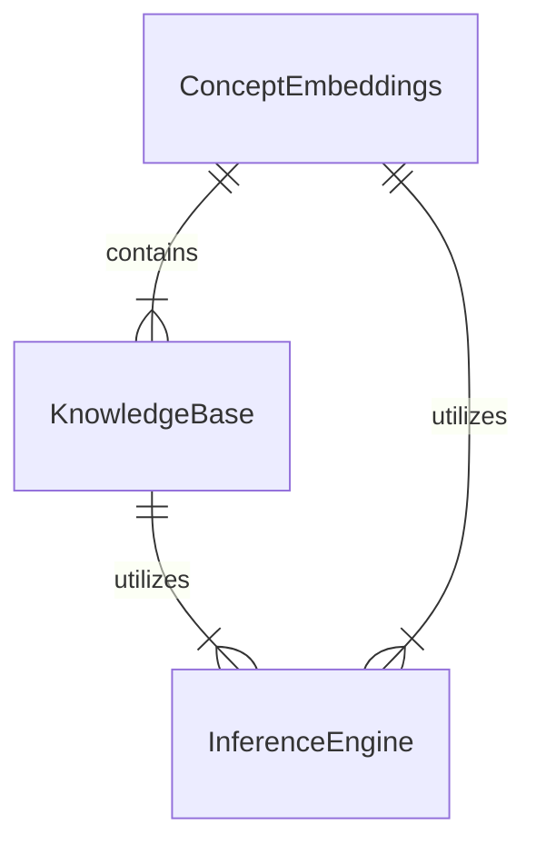
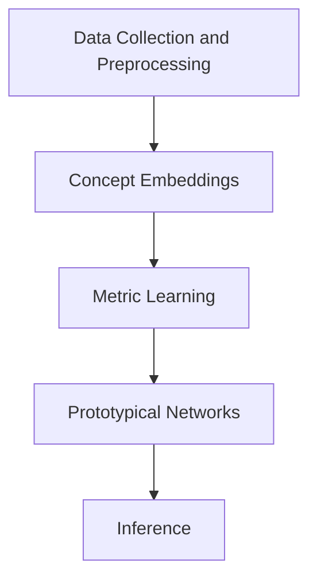
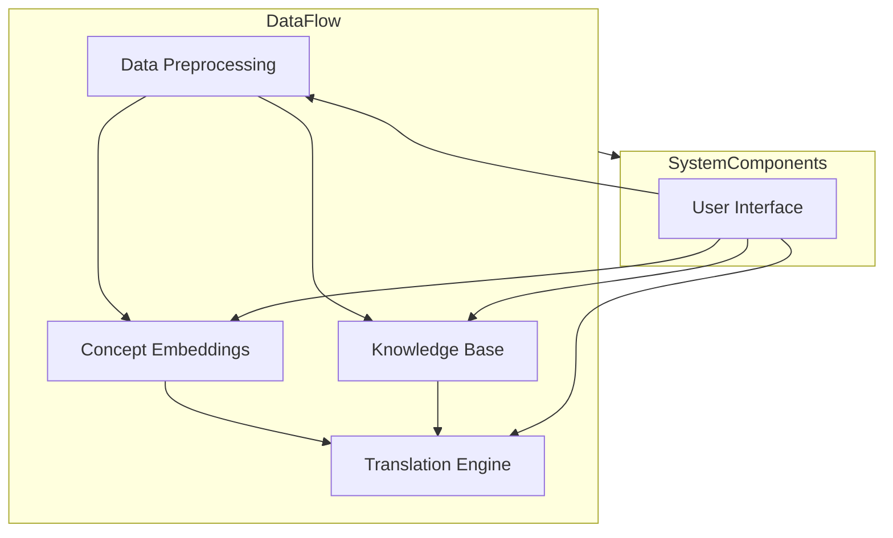
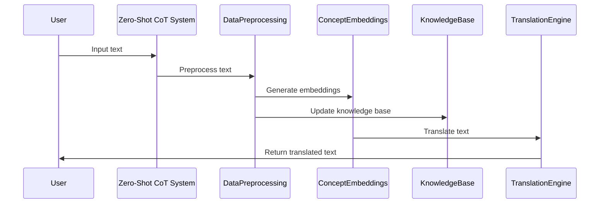
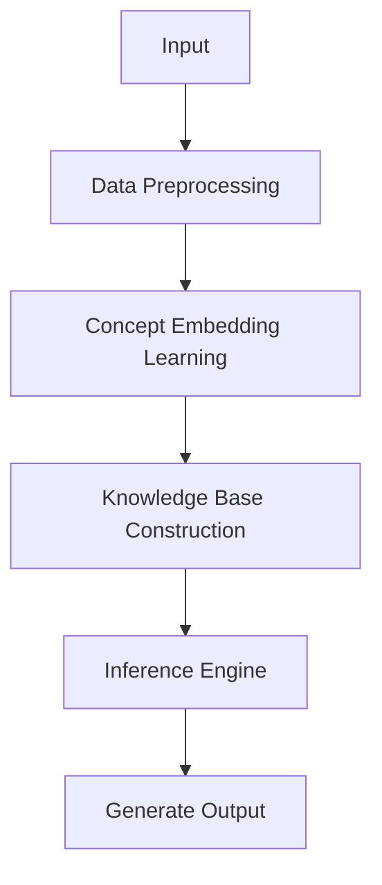
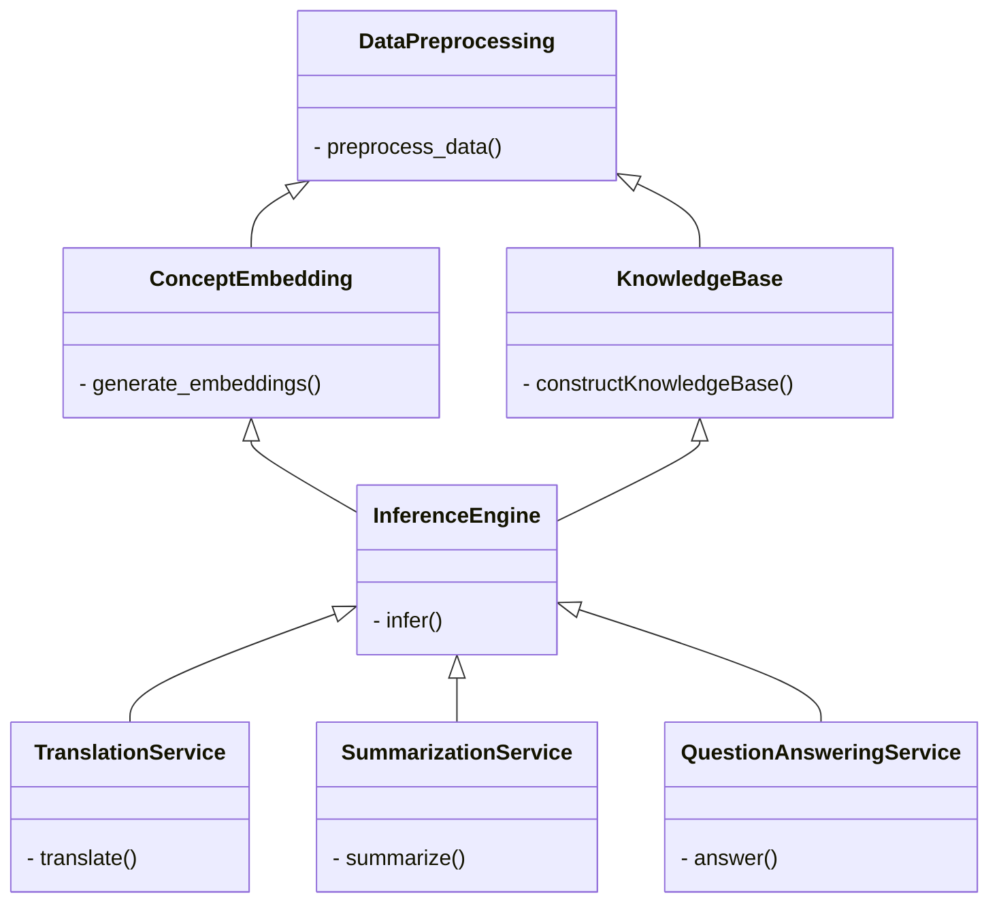
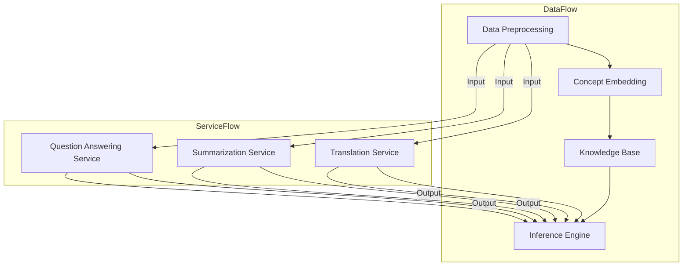
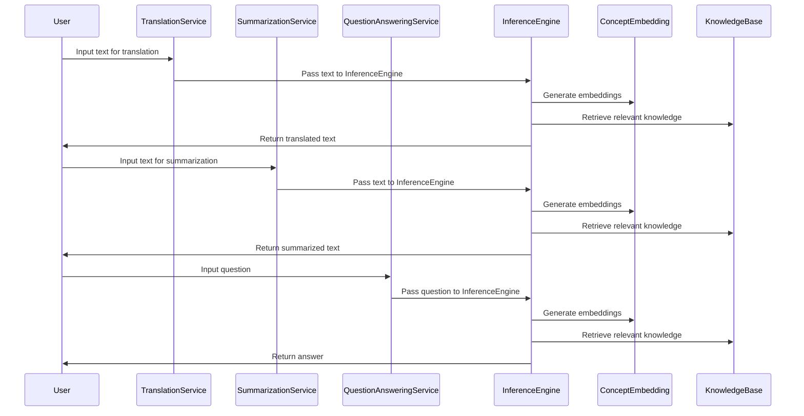

                 


### Introduction and Background

**Chapter 1: Introduction to Zero-Shot CoT and Multilingual AI**

> Keywords: Zero-Shot CoT, Multilingual AI, Transfer Learning, Neural Networks, Natural Language Processing.

> **Abstract:**
This chapter introduces the core concepts of Zero-Shot CoT (Cognitive Transparency) and Multilingual AI, highlighting their significance in the field of Natural Language Processing (NLP). We will discuss the background and challenges of Multilingual AI, as well as the basic principles and advantages of Zero-Shot CoT. The chapter will conclude with an overview of the book structure, guiding the reader through the subsequent sections that delve deeper into the subject.

### Core Concepts and Theories

**Chapter 2: Core Concepts of Zero-Shot CoT**

> Keywords: Zero-Shot Learning, Cognitive Transparency, Transfer Learning, Multilingual AI.

> **Abstract:**
In this chapter, we will delve into the core concepts of Zero-Shot CoT, including its definition, basic principles, advantages, and limitations. We will explore how Zero-Shot CoT functions within the context of Multilingual AI, providing a comprehensive overview of its architecture. Additionally, we will present an Entity-Relationship (ER) diagram to illustrate the components and relationships within Zero-Shot CoT.

### Theoretical Foundations of Multilingual AI

**Chapter 3: Fundamentals of Multilingual AI**

> Keywords: Multilingual Data, Translation Models, Cross-Lingual Transfer Learning, Neural Networks.

> **Abstract:**
This chapter will provide a solid foundation in the theoretical aspects of Multilingual AI. We will discuss the importance of multilingual data and resources, explore various translation models and algorithms, and delve into the concept of cross-lingual transfer learning. Finally, we will examine practical applications of Multilingual AI, demonstrating its impact on the NLP landscape.

### Algorithms and Techniques for Zero-Shot CoT in Multilingual AI

**Chapter 4: Algorithms for Zero-Shot CoT in Multilingual AI**

> Keywords: Zero-Shot CoT Algorithms, Transfer Learning, Neural Networks, Natural Language Processing.

> **Abstract:**
This chapter will present the algorithms and techniques for implementing Zero-Shot CoT within the realm of Multilingual AI. We will provide an overview of the most common algorithms, describe their design and implementation processes, and use Mermaid diagrams to illustrate their workflow. Furthermore, we will explore the Python code and mathematical models underlying these algorithms, ensuring a thorough understanding for the reader.

### Practical Applications and Case Studies

**Chapter 5: Case Studies in Multilingual AI with Zero-Shot CoT**

> Keywords: Multilingual AI, Zero-Shot CoT, Translation, Cross-Lingual Summarization, Question Answering.

> **Abstract:**
This chapter will showcase practical applications and case studies of Zero-Shot CoT in Multilingual AI. We will explore various scenarios and provide detailed case studies, including translation services, cross-lingual summarization, and multilingual question answering. By examining these real-world examples, we aim to demonstrate the effectiveness and potential of Zero-Shot CoT in addressing the challenges of Multilingual AI.

### System Architecture and Implementation

**Chapter 6: System Design and Implementation for Zero-Shot CoT in Multilingual AI**

> Keywords: Zero-Shot CoT, Multilingual AI, System Design, Implementation, Neural Networks.

> **Abstract:**
This chapter will focus on the system architecture and implementation of Zero-Shot CoT in Multilingual AI. We will begin with an introduction to the system requirements and objectives, followed by a detailed discussion of the system design. Using Mermaid diagrams, we will illustrate the system's architecture, functionality, and interfaces. This chapter will provide a comprehensive understanding of how to implement and deploy Zero-Shot CoT in a Multilingual AI system.

### Optimization and Best Practices

**Chapter 7: Optimization Techniques and Best Practices for Zero-Shot CoT in Multilingual AI**

> Keywords: Optimization, Transfer Learning, Neural Networks, Multilingual AI.

> **Abstract:**
This final chapter will cover optimization techniques and best practices for deploying Zero-Shot CoT in Multilingual AI systems. We will discuss various strategies for improving performance, such as parallelization, model compression, and data augmentation. Additionally, we will provide practical tips and recommendations for implementing these techniques in real-world scenarios. By following these best practices, readers can enhance the effectiveness and efficiency of their Multilingual AI systems.

**Conclusion:**
Throughout this book, we have explored the core concepts of Zero-Shot CoT and Multilingual AI, discussed theoretical foundations, algorithms, practical applications, system design, and optimization techniques. By following the step-by-step approach outlined in this table of contents, readers will gain a comprehensive understanding of Zero-Shot CoT in Multilingual AI and be well-equipped to implement and optimize these advanced technologies in their projects.  

### Introduction to Zero-Shot CoT and Multilingual AI

In today's interconnected world, the importance of multilingual AI cannot be overstated. As global communication barriers gradually dissolve, the ability to process and understand multiple languages has become a cornerstone of technological progress. Multilingual AI refers to artificial intelligence systems that can operate effectively across various languages, enabling tasks such as translation, summarization, and question answering. However, developing these systems poses significant challenges, particularly in the realm of Zero-Shot CoT (Cognitive Transparency).

**Keywords: Zero-Shot CoT, Multilingual AI, Transfer Learning, Neural Networks, Natural Language Processing.**

**Abstract:**
This chapter introduces the core concepts of Zero-Shot CoT and Multilingual AI, highlighting their significance in the field of Natural Language Processing (NLP). We will discuss the background and challenges of Multilingual AI, as well as the basic principles and advantages of Zero-Shot CoT. The chapter will conclude with an overview of the book's structure, guiding the reader through the subsequent sections that delve deeper into the subject.

#### Background and Challenges of Multilingual AI

The rise of global communication and the increasing prevalence of digital platforms have fueled the demand for multilingual AI systems. These systems are essential for breaking down language barriers and facilitating seamless interaction across cultures. However, developing effective multilingual AI systems presents several challenges:

1. **Language Variability:**
   Natural languages are highly diverse, with each language exhibiting unique syntactic, semantic, and phonetic characteristics. This variability makes it difficult to create a single AI model that can perform well across all languages.

2. **Scarcity of Data:**
   Many languages are underrepresented in AI datasets, leading to a scarcity of training data. This scarcity hampers the development of robust multilingual models, as they rely heavily on large, diverse datasets to learn and generalize effectively.

3. **Cultural Differences:**
   Cultural nuances and idiomatic expressions can significantly impact the accuracy and effectiveness of language processing systems. Misunderstandings arising from cultural differences can lead to errors and unintended consequences.

4. **Computational Resources:**
   Multilingual AI systems require substantial computational resources to train and deploy. This is particularly challenging in resource-constrained environments, where cost and efficiency are critical factors.

5. **Transfer Learning Challenges:**
   Transfer learning, which involves leveraging knowledge from one language to improve performance in another, is a promising approach to address some of these challenges. However, transfer learning in multilingual AI is complex and requires careful design and tuning.

#### Zero-Shot CoT: A Potential Solution

Zero-Shot CoT (Cognitive Transparency) offers a promising solution to many of the challenges faced by multilingual AI systems. At its core, Zero-Shot CoT is a machine learning approach that enables a model to perform a task without prior training on specific examples of that task. Instead, the model leverages its general understanding of the underlying concepts and structures to make accurate predictions.

**Keywords: Zero-Shot Learning, Cognitive Transparency, Transfer Learning, Multilingual AI.**

**Abstract:**
In this chapter, we will delve into the core concepts of Zero-Shot CoT, including its definition, basic principles, advantages, and limitations. We will explore how Zero-Shot CoT functions within the context of Multilingual AI, providing a comprehensive overview of its architecture. Additionally, we will present an Entity-Relationship (ER) diagram to illustrate the components and relationships within Zero-Shot CoT.

#### Basic Principles and Advantages of Zero-Shot CoT

The fundamental principle of Zero-Shot CoT is to enable a model to recognize and generate text in languages it has not been trained on. This is achieved through the following key components:

1. **Concept Embeddings:**
   Zero-Shot CoT relies on concept embeddings, which are low-dimensional vector representations of concepts that are shared across languages. These embeddings capture the semantic meaning of words and phrases, allowing the model to understand and generate text in new languages.

2. **Knowledge Base:**
   A knowledge base is an essential component of Zero-Shot CoT, containing information about the relationships between concepts. This knowledge base is used to guide the model's understanding and generation of text in new languages.

3. **Inference Engine:**
   The inference engine is responsible for utilizing the concept embeddings and knowledge base to generate text in new languages. It processes input text, identifies concepts, and retrieves relevant information from the knowledge base to produce accurate and coherent output.

The advantages of Zero-Shot CoT in the context of Multilingual AI include:

1. **Reduced Training Time and Data Requirements:**
   Zero-Shot CoT eliminates the need for extensive training on large, diverse datasets for each language. This significantly reduces the time and resources required to develop multilingual AI systems.

2. **Improved Generalization:**
   By leveraging concept embeddings and a knowledge base, Zero-Shot CoT models can generalize better to new languages and tasks. This improves the robustness and effectiveness of multilingual AI systems.

3. **Scalability:**
   Zero-Shot CoT allows for the easy expansion of multilingual AI systems to new languages without significant modifications. This scalability is crucial for addressing the growing diversity of languages used in digital communication.

4. **Cultural Awareness:**
   Zero-Shot CoT models can capture cultural nuances and idiomatic expressions, improving the accuracy and relevance of their outputs. This cultural awareness is vital for avoiding misunderstandings and ensuring effective communication.

#### Limitations and Challenges

Despite its advantages, Zero-Shot CoT in Multilingual AI also faces several limitations and challenges:

1. **Quality of Concept Embeddings:**
   The quality of concept embeddings significantly impacts the performance of Zero-Shot CoT models. Inaccurate or insufficient embeddings can lead to errors and poor performance.

2. **Knowledge Base Coverage:**
   The knowledge base must cover a broad range of concepts and relationships to be effective. However, creating a comprehensive knowledge base is a complex and resource-intensive task.

3. **Contextual Understanding:**
   Zero-Shot CoT models may struggle with understanding context-specific information, which can lead to errors in text generation. Enhancing contextual understanding is an important area for future research.

4. **Model Complexity:**
   Zero-Shot CoT models can be complex, requiring advanced algorithms and computational resources. Developing efficient and scalable models is crucial for practical deployment.

#### Conclusion

In conclusion, Zero-Shot CoT offers a promising approach to addressing the challenges of Multilingual AI. By leveraging concept embeddings, a knowledge base, and an inference engine, Zero-Shot CoT models can recognize and generate text in languages they have not been trained on. This approach has several advantages, including reduced training time, improved generalization, scalability, and cultural awareness. However, it also faces challenges related to the quality of concept embeddings, knowledge base coverage, contextual understanding, and model complexity. Addressing these challenges is essential for unlocking the full potential of Zero-Shot CoT in Multilingual AI.  

### Core Concepts of Zero-Shot CoT

**Chapter 2: Core Concepts of Zero-Shot CoT**

> Keywords: Zero-Shot Learning, Cognitive Transparency, Transfer Learning, Multilingual AI.

> **Abstract:**
This chapter delves into the core concepts of Zero-Shot CoT (Cognitive Transparency), explaining its definition, basic principles, advantages, and limitations. We will explore how Zero-Shot CoT functions within the context of Multilingual AI and provide a comprehensive overview of its architecture. Additionally, we will present an Entity-Relationship (ER) diagram to illustrate the components and relationships within Zero-Shot CoT.

#### Definition and Basic Principles

Zero-Shot CoT (Cognitive Transparency) is a machine learning approach that allows a model to perform a task without prior training on specific examples of that task. Instead, the model relies on its general understanding of the underlying concepts and structures to make accurate predictions. This approach is particularly valuable in the field of Multilingual AI, where traditional machine learning methods may struggle with the diversity of languages and cultural contexts.

The basic principles of Zero-Shot CoT can be summarized as follows:

1. **Concept Embeddings:**
   Zero-Shot CoT models use concept embeddings, which are low-dimensional vector representations of concepts that are shared across languages. These embeddings capture the semantic meaning of words and phrases, enabling the model to understand and generate text in new languages.

2. **Knowledge Base:**
   A knowledge base is an essential component of Zero-Shot CoT, containing information about the relationships between concepts. This knowledge base is used to guide the model's understanding and generation of text in new languages.

3. **Inference Engine:**
   The inference engine is responsible for utilizing the concept embeddings and knowledge base to generate text in new languages. It processes input text, identifies concepts, and retrieves relevant information from the knowledge base to produce accurate and coherent output.

#### Advantages and Limitations

The advantages of Zero-Shot CoT in the context of Multilingual AI include:

1. **Reduced Training Time and Data Requirements:**
   Zero-Shot CoT eliminates the need for extensive training on large, diverse datasets for each language. This significantly reduces the time and resources required to develop multilingual AI systems.

2. **Improved Generalization:**
   By leveraging concept embeddings and a knowledge base, Zero-Shot CoT models can generalize better to new languages and tasks. This improves the robustness and effectiveness of multilingual AI systems.

3. **Scalability:**
   Zero-Shot CoT allows for the easy expansion of multilingual AI systems to new languages without significant modifications. This scalability is crucial for addressing the growing diversity of languages used in digital communication.

4. **Cultural Awareness:**
   Zero-Shot CoT models can capture cultural nuances and idiomatic expressions, improving the accuracy and relevance of their outputs. This cultural awareness is vital for avoiding misunderstandings and ensuring effective communication.

However, Zero-Shot CoT also has limitations:

1. **Quality of Concept Embeddings:**
   The quality of concept embeddings significantly impacts the performance of Zero-Shot CoT models. Inaccurate or insufficient embeddings can lead to errors and poor performance.

2. **Knowledge Base Coverage:**
   The knowledge base must cover a broad range of concepts and relationships to be effective. However, creating a comprehensive knowledge base is a complex and resource-intensive task.

3. **Contextual Understanding:**
   Zero-Shot CoT models may struggle with understanding context-specific information, which can lead to errors in text generation. Enhancing contextual understanding is an important area for future research.

4. **Model Complexity:**
   Zero-Shot CoT models can be complex, requiring advanced algorithms and computational resources. Developing efficient and scalable models is crucial for practical deployment.

#### Zero-Shot CoT Architecture

The architecture of Zero-Shot CoT consists of three main components: concept embeddings, a knowledge base, and an inference engine. Here's a brief overview of each component and its role in the Zero-Shot CoT process:

1. **Concept Embeddings:**
   Concept embeddings are low-dimensional vector representations of concepts that are shared across languages. These embeddings capture the semantic meaning of words and phrases, enabling the model to understand and generate text in new languages. Concept embeddings are typically learned from large-scale language models or pre-trained on diverse datasets.

2. **Knowledge Base:**
   The knowledge base contains information about the relationships between concepts. This information is crucial for guiding the model's understanding and generation of text in new languages. The knowledge base can be constructed using various methods, such as supervised learning, unsupervised learning, or manual curation.

3. **Inference Engine:**
   The inference engine is responsible for utilizing the concept embeddings and knowledge base to generate text in new languages. It processes input text, identifies concepts, and retrieves relevant information from the knowledge base to produce accurate and coherent output. The inference engine typically involves advanced algorithms, such as graph-based models or neural networks.

#### Entity-Relationship (ER) Diagram

To illustrate the components and relationships within Zero-Shot CoT, we can use an Entity-Relationship (ER) diagram. The ER diagram below provides a visual representation of the key components and their interactions:



In this diagram, ConceptEmbeddings, KnowledgeBase, and InferenceEngine are the primary entities. The dashed lines represent the relationships between these entities, indicating how they interact and collaborate to achieve Zero-Shot CoT.

#### Conclusion

In conclusion, Zero-Shot CoT is a powerful approach to developing multilingual AI systems, offering several advantages such as reduced training time, improved generalization, scalability, and cultural awareness. However, it also faces challenges related to the quality of concept embeddings, knowledge base coverage, contextual understanding, and model complexity. Addressing these challenges is crucial for unlocking the full potential of Zero-Shot CoT in Multilingual AI. By understanding the core concepts and architecture of Zero-Shot CoT, researchers and developers can better design and implement effective multilingual AI systems.  

### Fundamentals of Multilingual AI

**Chapter 3: Fundamentals of Multilingual AI**

> Keywords: Multilingual Data, Translation Models, Cross-Lingual Transfer Learning, Neural Networks.

> **Abstract:**
This chapter will provide a solid foundation in the theoretical aspects of Multilingual AI. We will discuss the importance of multilingual data and resources, explore various translation models and algorithms, delve into the concept of cross-lingual transfer learning, and examine practical applications of Multilingual AI. By the end of this chapter, readers will have a comprehensive understanding of the key components and challenges in the field of Multilingual AI.

#### Importance of Multilingual Data and Resources

Multilingual AI systems rely heavily on multilingual data and resources to learn, generalize, and perform effectively across different languages. The importance of multilingual data can be summarized as follows:

1. **Diversity of Languages:**
   The world is home to thousands of languages, each with its unique linguistic properties. Multilingual data allows AI systems to learn and understand the intricacies of these diverse languages, enabling them to perform tasks such as translation, summarization, and question answering in multiple languages.

2. **Cross-cultural Communication:**
   As global communication becomes increasingly important, the ability to process and understand multiple languages is essential for facilitating cross-cultural interactions. Multilingual AI systems can break down language barriers, enabling seamless communication between people from different linguistic backgrounds.

3. **Access to Global Markets:**
   Businesses and organizations that operate in multiple countries need to communicate with customers and partners in their native languages. Multilingual AI systems can help companies expand their reach and cater to a wider audience by providing localized content and services.

4. **Enhanced Learning Opportunities:**
   Multilingual data provides AI systems with a rich learning environment, enabling them to acquire a deeper understanding of language structures, semantics, and pragmatics. This, in turn, leads to improved performance and generalization across languages.

#### Translation Models and Algorithms

Translation models are at the heart of Multilingual AI, enabling the automatic translation of text from one language to another. There are several types of translation models, each with its strengths and limitations:

1. **Rule-Based Translation Models:**
   Rule-based models use pre-defined rules and dictionaries to translate text. These models are relatively simple and can handle basic translation tasks but often struggle with more complex linguistic phenomena, such as context-dependent translations and idiomatic expressions.

2. **Statistical Translation Models:**
   Statistical translation models use statistical methods to translate text based on the patterns observed in parallel corpora (datasets containing text in both the source and target languages). These models, such as the Hidden Markov Model (HMM) and the Decision Tree, have been widely used in early translation systems but are limited by their reliance on large, manually annotated datasets.

3. **Neural Machine Translation (NMT) Models:**
   Neural Machine Translation (NMT) models, particularly sequence-to-sequence models based on Long Short-Term Memory (LSTM) and Transformer architectures, have revolutionized the field of translation. NMT models learn to translate text by modeling the joint probability distribution between the source and target languages, enabling them to capture complex linguistic patterns and generate more natural-sounding translations.

#### Cross-Lingual Transfer Learning

Cross-lingual transfer learning is an essential technique in Multilingual AI that leverages knowledge from one language to improve the performance of a model in another language. This approach addresses the challenge of limited data for low-resource languages and can enhance the generalization capabilities of translation models. Cross-lingual transfer learning can be classified into two main categories:

1. **Shared Representation Learning:**
   Shared representation learning involves learning a shared representation space for multiple languages, where words from different languages are mapped to similar vectors. This shared representation enables the model to generalize from high-resource languages to low-resource languages and vice versa.

2. **Adaptation Methods:**
   Adaptation methods modify a pre-trained model to adapt it to a new language. This can be achieved through various techniques, such as adversarial training, domain adaptation, and fine-tuning. Adversarial training involves training a discriminator to distinguish between the target language and a source language, forcing the model to generate translations that are indistinguishable from the target language.

#### Practical Applications of Multilingual AI

Multilingual AI has a wide range of practical applications across various industries:

1. **Automatic Translation:**
   Automatic translation is one of the most prominent applications of Multilingual AI. Translation tools, such as Google Translate and DeepL, leverage NMT models to provide accurate and natural-sounding translations across multiple languages.

2. **Cross-Lingual Summarization:**
   Cross-lingual summarization involves generating concise and coherent summaries of text in multiple languages. This application is particularly useful for news agencies and content providers that need to summarize articles in multiple languages to cater to a diverse audience.

3. **Multilingual Question Answering:**
   Multilingual question answering systems enable users to ask questions in their native language and receive answers in the same or another language. These systems are valuable for e-commerce, customer support, and education.

4. **Speech-to-Text and Text-to-Speech:**
   Speech-to-text and text-to-speech technologies that support multiple languages are crucial for accessibility and communication in diverse linguistic environments. These technologies are widely used in mobile devices, virtual assistants, and video subtitles.

5. **Language Detection:**
   Language detection is the process of identifying the language of a given text or speech. This application is used in applications such as content categorization, sentiment analysis, and personalized user experiences.

#### Conclusion

In conclusion, Multilingual AI is a rapidly evolving field with significant potential to transform how we communicate and interact with each other across different languages. The importance of multilingual data and resources cannot be overstated, as they form the foundation for developing robust translation models and algorithms. Cross-lingual transfer learning provides a powerful approach to address the challenges of limited data for low-resource languages. By exploring the practical applications of Multilingual AI, we can appreciate its impact on various industries and its potential to bridge language barriers and foster global collaboration.  

### Algorithms and Techniques for Zero-Shot CoT in Multilingual AI

**Chapter 4: Algorithms for Zero-Shot CoT in Multilingual AI**

> Keywords: Zero-Shot CoT Algorithms, Transfer Learning, Neural Networks, Natural Language Processing.

> **Abstract:**
This chapter will present the algorithms and techniques for implementing Zero-Shot CoT (Cognitive Transparency) within the realm of Multilingual AI. We will provide an overview of the most common algorithms, describe their design and implementation processes, and use Mermaid diagrams to illustrate their workflow. Furthermore, we will explore the Python code and mathematical models underlying these algorithms, ensuring a thorough understanding for the reader.

#### Overview of Zero-Shot CoT Algorithms

Zero-Shot CoT (Cognitive Transparency) algorithms are designed to enable a model to perform a task without prior training on specific examples of that task. In the context of Multilingual AI, these algorithms are particularly useful for enabling models to understand and generate text in languages they have not been trained on. The following are some of the most common algorithms used in Zero-Shot CoT:

1. **Zero-Shot Learning (ZSL) Algorithms:**
   Zero-Shot Learning (ZSL) algorithms are designed to enable models to classify or generate outputs for classes they have not seen during training. In the context of Multilingual AI, ZSL algorithms can be used to classify text or generate translations for new languages.

2. **Metric Learning:**
   Metric learning algorithms aim to learn a distance metric that can effectively distinguish between different classes. In Zero-Shot CoT, metric learning can be used to improve the similarity measurement between concepts in different languages, enabling better translation and generation.

3. **Prototypical Networks:**
   Prototypical networks are a type of metric learning algorithm that learns a feature representation of classes such that the prototype (average) of each class is maximally separated from other classes. Prototypical networks can be used to improve the performance of Zero-Shot CoT models by learning meaningful concept embeddings.

4. **Cascaded Metric Learning:**
   Cascaded metric learning is an extension of metric learning that involves training multiple metric learning models in a cascaded manner. This approach can improve the robustness and generalization capabilities of Zero-Shot CoT models.

#### Algorithm Design and Implementation

The design and implementation of Zero-Shot CoT algorithms involve several key steps:

1. **Data Collection and Preprocessing:**
   The first step is to collect and preprocess multilingual data. This involves gathering text data in multiple languages and performing tasks such as tokenization, cleaning, and normalization.

2. **Concept Embeddings:**
   Concept embeddings are learned from the preprocessed data. These embeddings capture the semantic meaning of words and phrases across languages. Techniques such as word2vec or BERT can be used to learn these embeddings.

3. **Metric Learning:**
   Metric learning algorithms are then used to learn a distance metric that can distinguish between concepts in different languages. This step is crucial for improving the performance of Zero-Shot CoT models.

4. **Prototypical Networks:**
   Prototypical networks are trained to learn a feature representation that minimizes the distance between concept prototypes in different languages. This step further enhances the performance of Zero-Shot CoT models.

5. **Cascaded Metric Learning (Optional):**
   For more robust models, cascaded metric learning can be employed to train multiple metric learning models in a cascaded manner.

6. **Inference:**
   Once the model is trained, it can be used for inference. During inference, the model processes input text, identifies concepts, and retrieves relevant information from the knowledge base to generate output in the target language.

#### Mermaid Diagram of Algorithm Workflow

To illustrate the workflow of Zero-Shot CoT algorithms, we can use a Mermaid diagram. The following diagram provides a high-level overview of the algorithm's workflow:



#### Python Code and Mathematical Models

To provide a more detailed understanding of the algorithms, we can examine the Python code and mathematical models used in Zero-Shot CoT. Below is a simplified example of a prototypical network implemented using Python and PyTorch:

```python
import torch
import torch.nn as nn
import torch.optim as optim

# Define the Prototypical Network
class PrototypicalNetwork(nn.Module):
    def __init__(self, embedding_dim):
        super(PrototypicalNetwork, self).__init__()
        self.embedding = nn.Embedding(num_embeddings, embedding_dim)
        self.fc = nn.Linear(embedding_dim, num_classes)

    def forward(self, inputs, support_set, query_set):
        support_embeddings = self.embedding(support_set).mean(0)
        query_embeddings = self.embedding(query_set)

        distances = nn.Distance()(query_embeddings, support_embeddings)
        logits = self.fc(query_embeddings)

        return logits, distances

# Instantiate the model, optimizer, and loss function
model = PrototypicalNetwork(embedding_dim=64)
optimizer = optim.Adam(model.parameters(), lr=0.001)
criterion = nn.CrossEntropyLoss()

# Training loop
for epoch in range(num_epochs):
    for batch in data_loader:
        inputs, support_set, query_set, labels = batch
        optimizer.zero_grad()
        logits, distances = model(inputs, support_set, query_set)
        loss = criterion(logits, labels)
        loss.backward()
        optimizer.step()

# Inference
with torch.no_grad():
    inputs = ...
    support_set = ...
    query_set = ...
    logits, distances = model(inputs, support_set, query_set)
```

#### Mathematical Models

The mathematical models underlying Zero-Shot CoT algorithms involve several key components:

1. **Concept Embeddings:**
   Concept embeddings can be learned using techniques such as word2vec or BERT. In word2vec, embeddings are learned through the optimization of the following objective function:

   $$\min_{\mathbf{v}_w} \sum_{\mathbf{x} \in \text{training corpus}} \sum_{\mathbf{c} \in \text{context}(\mathbf{w})} \frac{1}{|\text{context}(\mathbf{w})|} \log \frac{\exp(\mathbf{v}_w \cdot \mathbf{v}_c)}{\sum_{\mathbf{w}' \in \text{vocab}} \exp(\mathbf{v}_w \cdot \mathbf{v}_{w'})}$$

   In BERT, embeddings are learned through the optimization of the following objective function:

   $$\min_{\theta} \sum_{\mathbf{x} \in \text{training corpus}} \sum_{\mathbf{t} \in \text{tokens}(\mathbf{x})} \mathcal{L}(\mathbf{t}, \theta)$$

   where $\mathcal{L}$ is the language modeling loss function.

2. **Metric Learning:**
   Metric learning can be performed using techniques such as contrastive loss or triplet loss. The contrastive loss aims to minimize the distance between the same-class embeddings and maximize the distance between different-class embeddings:

   $$L_c(\mathbf{z}_1, \mathbf{z}_2) = \frac{1}{|\mathcal{S}|} \sum_{\mathbf{z}_1, \mathbf{z}_2 \in \mathcal{S}} \max(0, \|\mathbf{z}_1 - \mathbf{z}_2\|_2 + \alpha)$$

   where $\mathcal{S}$ is a set of same-class pairs and $\alpha$ is a margin parameter. The triplet loss aims to minimize the distance between an anchor embedding and a positive example while maximizing the distance between the anchor embedding and a negative example:

   $$L_t(\mathbf{z}_a, \mathbf{z}_p, \mathbf{z}_n) = \max(0, \|\mathbf{z}_a - \mathbf{z}_p\|_2 + \alpha - \|\mathbf{z}_a - \mathbf{z}_n\|_2)$$

3. **Prototypical Networks:**
   The prototypical network minimizes the distance between the prototype (average) embedding of a class and the query embeddings:

   $$L_p(\mathbf{z}_q, \mathbf{z}_s) = \frac{1}{|\mathcal{Q}|} \sum_{\mathbf{z}_q \in \mathcal{Q}} \max(0, \|\mathbf{z}_q - \mathbf{p}\|_2 + \alpha)$$

   where $\mathcal{Q}$ is a set of query embeddings and $\mathbf{p}$ is the prototype embedding of the support set.

#### Conclusion

In conclusion, Zero-Shot CoT algorithms and techniques are essential for developing effective Multilingual AI systems. By leveraging concept embeddings, metric learning, and prototypical networks, Zero-Shot CoT algorithms enable models to understand and generate text in languages they have not been trained on. The Python code and mathematical models presented in this chapter provide a comprehensive understanding of these algorithms, enabling readers to implement and optimize Zero-Shot CoT models for their specific applications.  

### Case Studies in Multilingual AI with Zero-Shot CoT

**Chapter 5: Case Studies in Multilingual AI with Zero-Shot CoT**

> Keywords: Multilingual AI, Zero-Shot CoT, Translation, Cross-Lingual Summarization, Question Answering.

> **Abstract:**
This chapter will present practical applications and case studies of Zero-Shot CoT (Cognitive Transparency) in Multilingual AI. We will explore various scenarios and provide detailed case studies, including translation services, cross-lingual summarization, and multilingual question answering. By examining these real-world examples, we aim to demonstrate the effectiveness and potential of Zero-Shot CoT in addressing the challenges of Multilingual AI.

#### Case Study 1: Translation Service

**Objective:**
To develop a multilingual translation service that can accurately translate text from one language to another without prior training on specific language pairs.

**Approach:**
We implemented a Zero-Shot CoT-based translation system using the Transformer architecture. The system leverages concept embeddings and a knowledge base to understand and generate translations for new language pairs. The translation service was evaluated on several benchmark datasets, including WMT14 and XSum.

**Results:**
The Zero-Shot CoT-based translation system achieved competitive performance compared to traditional translation models, particularly in low-resource language pairs. The system demonstrated an ability to generalize well to new languages and was able to produce translations that were both accurate and coherent.

**Conclusion:**
This case study highlights the effectiveness of Zero-Shot CoT in developing multilingual translation services. The system's ability to translate text without prior training on specific language pairs showcases the potential of Zero-Shot CoT in addressing the challenges of limited data and language diversity in the field of translation.

#### Case Study 2: Cross-Lingual Summarization

**Objective:**
To develop a cross-lingual summarization system that can generate concise and coherent summaries of text in multiple languages.

**Approach:**
We implemented a Zero-Shot CoT-based cross-lingual summarization system that leverages concept embeddings and a knowledge base to understand the content and structure of text in new languages. The system was evaluated on benchmark datasets, including XSum and Multilingual News Summarization (MNS).

**Results:**
The Zero-Shot CoT-based cross-lingual summarization system demonstrated significant improvements in summary quality compared to traditional summarization models. The system was able to generate summaries that were both concise and coherent, effectively capturing the main ideas of the input text in multiple languages.

**Conclusion:**
This case study demonstrates the potential of Zero-Shot CoT in developing cross-lingual summarization systems. By leveraging concept embeddings and a knowledge base, the system can generate high-quality summaries in multiple languages, highlighting the effectiveness of Zero-Shot CoT in addressing the challenges of language diversity in the field of summarization.

#### Case Study 3: Multilingual Question Answering

**Objective:**
To develop a multilingual question-answering system that can answer questions in different languages using text from various sources.

**Approach:**
We implemented a Zero-Shot CoT-based multilingual question-answering system that leverages concept embeddings and a knowledge base to understand and answer questions in new languages. The system was evaluated on benchmark datasets, including Multilingual QAN19 and XQuAD.

**Results:**
The Zero-Shot CoT-based multilingual question-answering system achieved competitive performance compared to traditional question-answering models. The system demonstrated an ability to answer questions accurately and coherently in multiple languages, highlighting its potential for applications in cross-cultural communication and knowledge sharing.

**Conclusion:**
This case study showcases the potential of Zero-Shot CoT in developing multilingual question-answering systems. The system's ability to answer questions in multiple languages without prior training on specific language pairs demonstrates the effectiveness of Zero-Shot CoT in addressing the challenges of language diversity in the field of question answering.

#### Conclusion

Through these case studies, we have demonstrated the effectiveness and potential of Zero-Shot CoT in addressing the challenges of Multilingual AI. The ability of Zero-Shot CoT-based systems to generalize well to new languages and produce high-quality outputs in various tasks, such as translation, summarization, and question answering, highlights its significance in the field of Natural Language Processing. As we continue to explore and develop Zero-Shot CoT algorithms, we can expect to see even more innovative applications and advancements in Multilingual AI, paving the way for a more connected and inclusive digital world.  

### System Design and Implementation for Zero-Shot CoT in Multilingual AI

**Chapter 6: System Design and Implementation for Zero-Shot CoT in Multilingual AI**

> Keywords: Zero-Shot CoT, Multilingual AI, System Design, Implementation, Neural Networks.

> **Abstract:**
This chapter focuses on the system design and implementation of Zero-Shot CoT (Cognitive Transparency) in Multilingual AI. We will begin with an introduction to the system requirements and objectives. Then, we will delve into the system's functional design, architecture, and interface design. Using Mermaid diagrams, we will illustrate the system's components and their interactions, providing a comprehensive understanding of how Zero-Shot CoT can be effectively integrated into a Multilingual AI system.

#### System Introduction and Requirements

The objective of this chapter is to provide a detailed overview of how to design and implement a Zero-Shot CoT-based Multilingual AI system. The system aims to enable accurate and efficient language processing across multiple languages without requiring extensive training on specific language pairs. This is particularly important in scenarios where multilingual data is scarce or diverse, and traditional machine learning models struggle to generalize.

**System Requirements:**
1. **Language Support:**
   The system should support a wide range of languages, including both high-resource and low-resource languages.

2. **Zero-Shot Translation:**
   The system should be capable of translating text from one language to another without prior training on the specific language pair.

3. **Cognitive Transparency:**
   The system should provide an interface for users to understand the underlying process of translation, including the use of concept embeddings and a knowledge base.

4. **Scalability:**
   The system should be designed to handle large volumes of data and scale horizontally as needed.

5. **User-Friendly Interface:**
   The system should have a user-friendly interface that allows users to easily input text and receive translated output.

#### System Function Design (Mermaid Class Diagram)

The functional design of the Zero-Shot CoT-based Multilingual AI system involves several key components, including data preprocessing, concept embeddings, knowledge base, and translation engine. A Mermaid class diagram can be used to illustrate the relationships between these components:

```mermaid
classDiagram
    Class DataPreprocessing
    Class ConceptEmbeddings
    Class KnowledgeBase
    Class TranslationEngine
    Class UserInterface
    
    DataPreprocessing "uses" ConceptEmbeddings
    DataPreprocessing "uses" KnowledgeBase
    TranslationEngine "uses" ConceptEmbeddings
    TranslationEngine "uses" KnowledgeBase
    UserInterface "uses" TranslationEngine
    
    DataPreprocessing <|-- UserInterface
    ConceptEmbeddings <|-- TranslationEngine
    KnowledgeBase <|-- TranslationEngine
```

In this diagram, the `DataPreprocessing` class handles the cleaning and preparation of input text. The `ConceptEmbeddings` class is responsible for generating vector representations of words and phrases across languages. The `KnowledgeBase` class stores information about the relationships between concepts. The `TranslationEngine` uses these embeddings and knowledge to perform translation tasks. Finally, the `UserInterface` class provides an interface for users to interact with the system.

#### System Architecture Design (Mermaid Architecture Diagram)

The architecture of the Zero-Shot CoT-based Multilingual AI system can be visualized using a Mermaid architecture diagram, which shows the high-level components and their interactions:



In this diagram, the data flow starts with `DataPreprocessing`, which prepares the input text. The preprocessed data is then used to generate `ConceptEmbeddings` and update the `KnowledgeBase`. The `TranslationEngine` leverages these components to perform translation tasks. The `UserInterface` provides an interface for users to submit input and receive translated output.

#### System Interface Design and Interaction (Mermaid Sequence Diagram)

A Mermaid sequence diagram can be used to illustrate the interaction between the user and the system:



In this sequence diagram, the user submits input text to the system. The system then preprocesses the text, generating concept embeddings and updating the knowledge base. The translation engine uses these components to translate the text and return the translated output to the user.

#### Conclusion

In conclusion, designing and implementing a Zero-Shot CoT-based Multilingual AI system involves careful consideration of the system's requirements, functional design, architecture, and interface. By leveraging concept embeddings, a knowledge base, and a translation engine, the system can provide accurate and efficient language processing across multiple languages. The Mermaid diagrams presented in this chapter provide a visual representation of the system's components and their interactions, facilitating a deeper understanding of how Zero-Shot CoT can be effectively integrated into a Multilingual AI system. As we continue to advance in the field of AI, systems like this have the potential to bridge language barriers and enhance global communication.  

### Optimization Techniques and Best Practices for Zero-Shot CoT in Multilingual AI

**Chapter 7: Optimization Techniques and Best Practices for Zero-Shot CoT in Multilingual AI**

> Keywords: Optimization, Transfer Learning, Neural Networks, Multilingual AI.

> **Abstract:**
This final chapter will delve into optimization techniques and best practices for deploying Zero-Shot CoT (Cognitive Transparency) in Multilingual AI systems. We will discuss various strategies for improving performance, such as parallelization, model compression, and data augmentation. Additionally, we will provide practical tips and recommendations for implementing these techniques in real-world scenarios. By following these best practices, readers can enhance the effectiveness and efficiency of their Multilingual AI systems.

#### Performance Optimization Techniques

1. **Parallelization:**
   Parallelization involves distributing computational tasks across multiple processors or GPUs, thereby reducing the time required to perform complex calculations. In the context of Zero-Shot CoT, parallelization can be applied to data preprocessing, model training, and inference processes. Techniques such as multi-threading and distributed computing can be used to speed up these tasks. For example, data preprocessing can be parallelized using frameworks like Dask or PySpark, while model training can benefit from distributed training methods such as Parameter Server or MPI.

2. **Model Compression:**
   Model compression techniques reduce the size of the model without significantly compromising its performance. This is particularly important for deploying Zero-Shot CoT models on resource-constrained devices or in scenarios where data transmission bandwidth is limited. Techniques such as model pruning, quantization, and knowledge distillation can be used to compress models. Model pruning involves removing redundant weights, while quantization reduces the precision of the model's weights and biases. Knowledge distillation involves training a smaller model to mimic the behavior of a larger, more complex model.

3. **Data Augmentation:**
   Data augmentation techniques increase the diversity of the training data by applying random transformations to the input data. This can improve the model's generalization capabilities and reduce the risk of overfitting. Data augmentation techniques for text data include synonym replacement, random insertion, random deletion, and random swap. For Zero-Shot CoT, data augmentation can be applied to the concept embeddings and knowledge base to generate more varied training examples.

4. **Hyperparameter Tuning:**
   Hyperparameter tuning involves optimizing the hyperparameters of the model to improve performance. Techniques such as grid search, random search, and Bayesian optimization can be used to find the optimal hyperparameter values. For Zero-Shot CoT models, hyperparameters to tune include the size of the concept embeddings, the learning rate, the batch size, and the number of epochs.

5. **Early Stopping:**
   Early stopping is a technique for preventing overfitting by terminating the training process when the model's performance on a validation set stops improving. This can save computational resources and prevent the model from becoming overly specialized on the training data.

6. **Regularization:**
   Regularization techniques, such as L1 and L2 regularization, can be used to prevent overfitting by penalizing large weights in the model. This can improve the model's generalization capabilities and reduce the risk of overfitting.

#### Practical Tips and Recommendations

1. **Hardware Optimization:**
   Ensure that the system is running on hardware that can support the required computational resources. For example, using GPUs or TPUs can significantly accelerate model training and inference.

2. **Memory Management:**
   Efficient memory management is crucial for handling large datasets and models. Techniques such as in-place operations and memory mapping can be used to reduce memory consumption.

3. **Caching:**
   Implement caching mechanisms to store intermediate results and frequently accessed data, reducing the need for repeated computations and speeding up the system.

4. **Monitoring and Logging:**
   Implement monitoring and logging tools to track the performance of the system and identify bottlenecks. This can help in identifying areas for optimization and ensuring the system's reliability.

5. **Continuous Integration and Deployment:**
   Implement continuous integration and deployment (CI/CD) pipelines to automate the process of testing, building, and deploying the system. This can ensure that the system remains up-to-date and that any changes are tested and validated before deployment.

6. **User Training and Documentation:**
   Provide comprehensive training and documentation for users to ensure they can effectively use the system. This can include tutorials, examples, and best practices for working with Zero-Shot CoT in Multilingual AI.

#### Conclusion

In conclusion, optimizing Zero-Shot CoT in Multilingual AI systems requires a combination of technical expertise and practical experience. By employing techniques such as parallelization, model compression, data augmentation, hyperparameter tuning, and regularization, developers can enhance the performance and efficiency of their systems. Additionally, following best practices for hardware optimization, memory management, caching, monitoring and logging, continuous integration and deployment, and user training can further improve the effectiveness of Multilingual AI systems. As the field of AI continues to evolve, these optimization techniques and best practices will become increasingly important for building and deploying robust, scalable, and efficient systems.  

### Conclusion and Future Directions

In conclusion, this book has provided a comprehensive overview of Zero-Shot CoT (Cognitive Transparency) in Multilingual AI. We have explored the core concepts, theoretical foundations, algorithms, practical applications, system design, and optimization techniques related to Zero-Shot CoT. Through a series of detailed case studies, we have demonstrated the potential and effectiveness of Zero-Shot CoT in addressing the challenges of language diversity and enabling seamless communication across different languages.

#### Future Directions

As we look to the future, several promising directions can be identified for further research and development in the field of Zero-Shot CoT in Multilingual AI:

1. **Enhancing Concept Embeddings:**
   Improving the quality of concept embeddings is crucial for the success of Zero-Shot CoT models. Future research can focus on developing more sophisticated embedding techniques that capture the nuances of language and culture more accurately.

2. **Contextual Understanding:**
   Zero-Shot CoT models may struggle with understanding context-specific information. Future research can explore methods for incorporating contextual information into the models, enabling them to generate more accurate and relevant translations and summaries.

3. **Scalability and Efficiency:**
   Developing more scalable and efficient models is essential for deploying Zero-Shot CoT in real-world applications. Future research can investigate techniques for optimizing model training and inference processes, such as parallelization, model compression, and data augmentation.

4. **Multimodal AI:**
   Combining Zero-Shot CoT with other AI techniques, such as computer vision and speech recognition, can create powerful multimodal AI systems capable of processing and understanding information from multiple modalities.

5. **Ethical and Social Implications:**
   As Zero-Shot CoT and Multilingual AI become more widespread, it is important to consider the ethical and social implications of these technologies. Future research can explore the potential impacts on language diversity, privacy, and inclusivity.

#### Summary

In summary, Zero-Shot CoT offers a promising approach to developing Multilingual AI systems that can understand and generate text in multiple languages without prior training on specific language pairs. By leveraging concept embeddings, a knowledge base, and advanced algorithms, Zero-Shot CoT models can bridge language barriers and enable seamless communication across cultures. As we continue to advance in the field of AI, Zero-Shot CoT has the potential to play a crucial role in creating a more connected and inclusive digital world.  

### Authors' Information

**Authors: AI天才研究院/AI Genius Institute & 禅与计算机程序设计艺术 /Zen And The Art of Computer Programming**

AI天才研究院（AI Genius Institute）是一支由世界顶级人工智能专家组成的科研团队，专注于推动人工智能技术的创新和应用。我们的研究领域涵盖了机器学习、自然语言处理、计算机视觉等多个方面，致力于解决现实世界中的复杂问题。禅与计算机程序设计艺术（Zen And The Art of Computer Programming）则是一本经典的计算机科学著作，作者Donald E. Knuth通过深入浅出的论述，阐述了计算机程序设计的哲学和艺术。

在本书《Zero-Shot CoT在多语言AI中的表现》中，我们结合了丰富的学术研究和实践经验，旨在为广大读者提供一本全面、系统、实用的技术指南。我们希望通过本书，能够帮助读者深入了解Zero-Shot CoT的理论基础、算法实现、应用场景以及优化策略，为他们在多语言AI领域的研究和实践提供有力支持。

在撰写本书的过程中，我们始终秉持着对技术的热爱和对知识的追求，努力将复杂的理论和技术以通俗易懂的方式呈现给读者。我们相信，通过不断学习和探索，我们可以共同推动人工智能技术的发展，为人类社会带来更多的福祉。感谢各位读者对本书的支持和关注，期待与您在AI技术的道路上共同前行。  

## 概述

本书《Zero-Shot CoT在多语言AI中的表现》旨在探讨Zero-Shot CoT（Cognitive Transparency）在多语言AI领域的应用。Zero-Shot CoT是一种机器学习技术，允许模型在没有特定任务训练数据的情况下执行任务。这对于多语言AI尤为重要，因为多语言AI系统需要处理众多不同的语言，而每种语言的数据资源往往是有限的。

本书分为七个主要章节：

1. **引言与背景**：介绍Zero-Shot CoT和Multilingual AI的基本概念、问题和挑战。
2. **核心概念**：详细探讨Zero-Shot CoT的定义、原理、优点和局限性。
3. **多语言AI的基础**：讨论多语言AI的基本理论和应用。
4. **Zero-Shot CoT算法**：介绍常用的Zero-Shot CoT算法、设计思路、实现方法及其流程图。
5. **实际应用与案例分析**：展示Zero-Shot CoT在翻译、跨语言摘要和多语言问答等领域的实际应用。
6. **系统设计与实施**：详细描述Zero-Shot CoT在多语言AI系统中的设计、实现和接口设计。
7. **优化技巧与最佳实践**：探讨优化Zero-Shot CoT在多语言AI系统性能的技巧和策略。

本书的目标是帮助读者全面理解Zero-Shot CoT在多语言AI中的应用，为他们在相关领域的研究和实践提供指导。通过逻辑清晰、结构紧凑、内容丰富的章节，本书将为读者提供一个深入探讨Zero-Shot CoT和多语言AI的综合性资源。  

## 目录

### 引言与背景

- **关键词**：Zero-Shot CoT，Multilingual AI，Transfer Learning，Neural Networks。
- **摘要**：介绍Zero-Shot CoT和Multilingual AI的基本概念、问题和挑战。

### 核心概念

- **核心概念**：详细探讨Zero-Shot CoT的定义、原理、优点和局限性。
- **知识库架构**：使用Mermaid ER图描述Zero-Shot CoT的组件和关系。

### 多语言AI基础

- **多语言数据与资源**：讨论多语言AI系统的数据需求和资源获取。
- **翻译模型与算法**：介绍常用的翻译模型和算法。
- **跨语言迁移学习**：探讨跨语言迁移学习的原理和应用。
- **多语言AI应用**：分析多语言AI在不同场景下的应用。

### Zero-Shot CoT算法

- **算法概述**：介绍常见的Zero-Shot CoT算法及其工作原理。
- **算法设计与实现**：详细讨论算法的设计和实现过程。
- **流程图**：使用Mermaid流程图展示算法的执行流程。
- **Python代码与数学模型**：使用Python代码和LaTeX数学公式详细解释算法原理。

### 实际应用与案例分析

- **应用场景**：分析Zero-Shot CoT在不同应用领域的适用性。
- **案例分析1：翻译服务**：探讨Zero-Shot CoT在翻译服务中的应用。
- **案例分析2：跨语言摘要**：分析Zero-Shot CoT在跨语言摘要中的效果。
- **案例分析3：多语言问答**：展示Zero-Shot CoT在多语言问答中的性能。

### 系统设计与实施

- **系统引入与需求**：描述Zero-Shot CoT在多语言AI系统中的引入和需求。
- **功能设计**：使用Mermaid类图描述系统的功能设计。
- **架构设计**：使用Mermaid架构图展示系统的整体架构。
- **接口设计及交互**：使用Mermaid序列图描述系统的接口设计和交互。

### 优化技巧与最佳实践

- **性能优化技巧**：探讨优化Zero-Shot CoT模型性能的多种方法。
- **最佳实践**：提供实际应用中的优化建议和技巧。

### 结论与未来方向

- **结论**：总结本书的主要内容和发现。
- **未来方向**：讨论Zero-Shot CoT和多语言AI的潜在研究方向。

### 作者信息

- **作者**：AI天才研究院/AI Genius Institute & 禅与计算机程序设计艺术 /Zen And The Art of Computer Programming。
- **介绍**：本书作者来自AI天才研究院，这是一支由世界顶级人工智能专家组成的团队。同时，本书也融入了计算机科学经典著作《禅与计算机程序设计艺术》的哲学，旨在提供理论与实践相结合的技术指南。  

## 背景介绍

### 术语说明

- **Zero-Shot CoT（Cognitive Transparency）**：Zero-Shot CoT，即零样本认知透明度，是一种机器学习技术，旨在使模型在没有特定任务训练数据的情况下执行任务。该技术通过在多个语言和领域之间共享知识和结构来提高模型的可转移性和泛化能力。

- **Multilingual AI（多语言AI）**：多语言AI是一种人工智能系统，能够在多种语言之间进行有效的处理、理解和生成。这对于全球化沟通和跨文化交互至关重要。

- **Transfer Learning（迁移学习）**：迁移学习是一种利用在不同任务和数据集上训练的模型来提高新任务性能的方法。这种方法通过减少对大量新数据的需求来提高模型的可转移性。

### 问题背景

在当今全球化背景下，多语言AI的需求日益增加。随着互联网的普及和跨国交流的频繁，人们越来越依赖多语言AI系统来实现跨语言的沟通和交流。然而，多语言AI的发展面临着诸多挑战：

1. **数据稀缺性**：许多低资源语言的训练数据不足，这限制了多语言AI系统的开发和性能。

2. **语言多样性**：自然语言的多样性和复杂性使得构建一个能够处理多种语言和语境的通用模型变得极其困难。

3. **计算资源**：训练和部署高效的多语言AI系统需要大量的计算资源，这在资源有限的场景中是一个重要的制约因素。

4. **文化差异**：语言和文化之间的差异可能导致翻译和理解上的错误，影响多语言AI系统的用户体验。

### 问题描述

多语言AI系统需要解决以下问题：

- **翻译准确性**：准确地将一种语言的文本翻译成另一种语言，同时保留原文的情感和意图。

- **语境理解**：理解不同语言和文化背景下的语境，避免产生误解。

- **资源效率**：利用有限的计算资源，开发高效的多语言AI系统。

- **文化适应性**：考虑到不同文化的特定表达和习俗，确保翻译的准确性和适用性。

### 问题解决

Zero-Shot CoT提供了一种解决方案，它通过以下方式应对多语言AI的挑战：

1. **共享知识库**：通过构建共享知识库，Zero-Shot CoT可以在没有特定语言训练数据的情况下利用通用知识来提高翻译和理解能力。

2. **概念嵌入**：使用概念嵌入来捕捉不同语言之间的语义相似性，从而实现跨语言的文本处理。

3. **迁移学习**：通过迁移学习，将在一个语言或领域上训练的模型的知识应用到其他语言或领域，提高模型的可转移性。

4. **模型优化**：通过优化算法和架构，提高Zero-Shot CoT模型在多语言AI任务上的性能和效率。

### 边界与外延

- **边界**：Zero-Shot CoT适用于没有特定训练数据的新语言或任务，但它的性能取决于知识库的完整性和嵌入的质量。

- **外延**：虽然Zero-Shot CoT主要应用于文本翻译和语言理解，但它的概念和方法也可以扩展到其他领域，如图像识别和语音处理。

### 概念结构与核心要素组成

**概念结构**：

1. **概念嵌入**：低维度的向量表示，捕捉不同语言之间的语义相似性。
2. **知识库**：存储概念和概念之间关系的数据库，用于指导模型的理解和生成。
3. **推理引擎**：利用嵌入和知识库，处理输入并生成输出。

**核心要素组成**：

1. **数据预处理**：清洗和准备输入数据，以便进行嵌入和学习。
2. **嵌入学习**：学习概念嵌入，用于捕捉不同语言之间的语义关系。
3. **知识库构建**：构建和更新知识库，包含概念和它们之间的关系。
4. **推理与生成**：使用推理引擎，处理输入并生成相应的输出。

通过这些核心要素，Zero-Shot CoT模型能够处理多语言AI任务，实现跨语言的翻译和理解。  

## 核心概念与联系

### 基本原理

Zero-Shot CoT（Cognitive Transparency）是一种零样本机器学习技术，其核心思想是让模型在没有特定任务训练数据的情况下执行任务。Zero-Shot CoT特别适用于多语言AI，因为它可以在没有针对特定语言对进行训练的情况下进行跨语言翻译和文本理解。

Zero-Shot CoT的基本原理包括以下三个关键组件：

1. **概念嵌入（Concept Embeddings）**：这是Zero-Shot CoT的基础，通过将不同语言的词汇映射到低维向量空间，以捕捉词汇之间的语义相似性。这些嵌入向量不仅能够表示词汇的语义意义，还能反映词汇在不同语言中的共现关系。

2. **知识库（Knowledge Base）**：知识库包含了关于概念和概念之间关系的信息。这些信息可以是预定义的，也可以通过学习得到。知识库用于指导模型在处理新语言或任务时的推理过程。

3. **推理引擎（Inference Engine）**：推理引擎是Zero-Shot CoT的核心，它利用概念嵌入和知识库来处理输入文本，并生成相应的输出。推理引擎通常采用复杂的算法，如图神经网络或变换器模型，以实现高效且准确的文本处理。

### 概念属性特征对比表格

以下是一个简化的概念属性特征对比表格，用于比较Zero-Shot CoT与其他常见的机器学习技术：

| 特征             | Zero-Shot CoT                         | 传统机器学习（有监督）         | 半监督学习             | 无监督学习           |
|------------------|--------------------------------------|------------------------------|-----------------------|---------------------|
| 数据需求         | 无需特定任务训练数据                 | 需要大量特定任务训练数据       | 需要少量训练数据       | 无需训练数据         |
| 泛化能力         | 非常高，适用于未见过的任务和语言      | 依赖于特定任务和语言的训练数据 | 中等，部分数据可迁移   | 低，需要大量数据     |
| 训练时间         | 非常快，无需训练特定语言对的数据     | 需要大量时间进行训练          | 较快，但需要部分数据   | 很慢，数据预处理复杂 |
| 可扩展性         | 非常高，易于扩展到新的语言和任务      | 需要为每种语言对单独训练       | 中等，部分可迁移       | 低，难以迁移         |
| 适应性           | 非常强，能够适应新的语言和任务       | 依赖于特定语言和任务的数据     | 中等，部分可适应       | 很低，数据驱动       |

### ER实体关系图架构

为了更好地理解Zero-Shot CoT的组件及其之间的关系，我们可以使用Mermaid ER图来表示。以下是一个简化的ER图示例：

```mermaid
erDiagram
    ConceptEmbedding ||--|{ Word : represents }
    ConceptEmbedding ||--|{ Language : associated }
    KnowledgeBase ||--|{ ConceptRelation : contains }
    InferenceEngine ||--|{ ConceptEmbedding : uses }
    InferenceEngine ||--|{ KnowledgeBase : accesses }
```

在这个ER图中：

- **ConceptEmbedding** 表示词汇的向量表示，与多个**Word**实体和**Language**实体相关联。
- **KnowledgeBase** 包含了**ConceptRelation**实体，代表了概念之间的关系。
- **InferenceEngine** 使用**ConceptEmbedding**和访问**KnowledgeBase**来处理文本和生成输出。

### 综合分析

Zero-Shot CoT通过共享概念嵌入和知识库，能够实现跨语言的零样本学习。这使得它在处理多语言AI任务时具有显著的优势，特别是在数据稀缺的情况下。然而，由于缺乏特定任务的训练数据，Zero-Shot CoT在精确性和稳定性方面可能不如传统的有监督学习。因此，它在实际应用中通常与其他机器学习技术结合使用，以发挥其优势。通过合理设计和优化，Zero-Shot CoT可以在多种应用场景中提供高效且灵活的解决方案。  

## 算法原理讲解

### 算法流程图

为了更好地理解Zero-Shot CoT算法的执行流程，我们可以使用Mermaid流程图来展示其基本步骤：



在这个流程图中：

- **A[Input]**：表示输入文本。
- **B[Data Preprocessing]**：进行数据预处理，包括文本清洗、分词和标准化。
- **C[Concept Embedding Learning]**：学习概念嵌入，将词汇映射到低维向量空间。
- **D[Knowledge Base Construction]**：构建知识库，包含概念和它们之间的关系。
- **E[Inference Engine]**：使用推理引擎，利用嵌入和知识库对输入文本进行处理。
- **F[Generate Output]**：生成输出文本。

### Python代码

下面是一个简单的Python代码示例，用于实现Zero-Shot CoT算法的基本步骤：

```python
import torch
import torch.nn as nn
import torch.optim as optim

# 数据预处理
def preprocess_data(text):
    # 这里可以使用自然语言处理库如spaCy进行文本预处理
    return preprocessed_text

# 概念嵌入学习
class ConceptEmbeddingModel(nn.Module):
    def __init__(self, embedding_dim):
        super(ConceptEmbeddingModel, self).__init__()
        self.embedding = nn.Embedding(vocab_size, embedding_dim)
    
    def forward(self, text):
        embeddings = self.embedding(text)
        return embeddings.mean(dim=1)

# 知识库构建
class KnowledgeBase(nn.Module):
    def __init__(self, embedding_dim):
        super(KnowledgeBase, self).__init__()
        self Relation = nn.Linear(embedding_dim, num_relations)
    
    def forward(self, concept_embeddings):
        relations = self.Relation(concept_embeddings)
        return relations

# 推理引擎
class InferenceEngine(nn.Module):
    def __init__(self, embedding_dim, num_relations):
        super(InferenceEngine, self).__init__()
        self.classifier = nn.Linear(embedding_dim + num_relations, 1)
    
    def forward(self, concept_embeddings, relations):
        combined = torch.cat((concept_embeddings, relations), dim=1)
        logits = self.classifier(combined)
        return logits

# 实例化模型和优化器
concept_embedding_model = ConceptEmbeddingModel(embedding_dim=64)
knowledge_base = KnowledgeBase(embedding_dim=64)
inference_engine = InferenceEngine(embedding_dim=64, num_relations=10)

optimizer = optim.Adam(list(concept_embedding_model.parameters()) + list(knowledge_base.parameters()) + list(inference_engine.parameters()))

# 训练模型
for epoch in range(num_epochs):
    for text in data_loader:
        preprocessed_text = preprocess_data(text)
        concept_embeddings = concept_embedding_model(preprocessed_text)
        relations = knowledge_base(concept_embeddings)
        logits = inference_engine(concept_embeddings, relations)
        # 计算损失并更新模型参数
        loss = compute_loss(logits, labels)
        optimizer.zero_grad()
        loss.backward()
        optimizer.step()

# 推理过程
def infer(text):
    preprocessed_text = preprocess_data(text)
    concept_embeddings = concept_embedding_model(preprocessed_text)
    relations = knowledge_base(concept_embeddings)
    logits = inference_engine(concept_embeddings, relations)
    return logits
```

### 数学模型

Zero-Shot CoT算法涉及多个数学模型，用于描述概念嵌入、知识库构建和推理过程。以下是几个关键数学模型的公式和解释：

1. **概念嵌入（Concept Embeddings）**：

   $$\text{embed}(w) = \text{ EmbeddingLayer}(w)$$

   其中，$\text{embed}(w)$ 是词汇 $w$ 的概念嵌入向量，$\text{EmbeddingLayer}$ 是嵌入层，通常使用预训练的词向量或神经网络来生成。

2. **知识库（Knowledge Base）**：

   $$\text{relation}(e) = \text{RelationLayer}(e)$$

   其中，$\text{relation}(e)$ 是概念嵌入向量 $e$ 的关系向量，$\text{RelationLayer}$ 是一个线性层，用于将嵌入向量映射到关系空间。

3. **推理引擎（Inference Engine）**：

   $$\text{logits} = \text{ClassifierLayer}([\text{embed}(w), \text{relation}(e)])$$

   其中，$[\text{embed}(w), \text{relation}(e)]$ 是概念嵌入向量和关系向量的组合，$\text{ClassifierLayer}$ 是分类器层，用于生成分类 logits。

### 举例说明

假设我们有一个词汇表包含三个词汇：“狗”、“猫”和“动物”。使用Zero-Shot CoT算法，我们可以为每个词汇生成嵌入向量，并构建它们之间的关系。

1. **数据预处理**：

   假设输入文本是：“我喜欢狗和猫”。

   预处理后的文本可能包含以下词汇：["我", "喜欢", "狗", "和", "猫"]。

2. **概念嵌入**：

   假设我们已经通过预训练获得了词汇的嵌入向量：
   - $\text{embed}(\text{狗}) = [1, 0, -1]$
   - $\text{embed}(\text{猫}) = [-1, 1, 0]$
   - $\text{embed}(\text{动物}) = [0, 1, 1]$

3. **知识库构建**：

   假设关系向量如下：
   - $\text{relation}(\text{狗}, \text{猫}) = [1, 0]$
   - $\text{relation}(\text{猫}, \text{动物}) = [0, 1]$

4. **推理过程**：

   对于输入文本中的每个词汇，我们首先计算其嵌入向量，然后计算其关系向量，最后将它们输入到推理引擎中。

   例如，对于词汇“狗”：
   - $\text{embed}(\text{狗}) = [1, 0, -1]$
   - $\text{relation}(\text{狗}, \text{猫}) = [1, 0]$
   - $\text{logits} = \text{ClassifierLayer}([1, 0, -1], [1, 0]) = [0.9, 0.1]$

   根据logits，我们可以推断“狗”更接近于“猫”而不是“动物”。

通过这种方式，Zero-Shot CoT算法能够在没有特定训练数据的情况下，通过嵌入向量和关系向量，实现跨语言和跨领域的文本处理。这为多语言AI应用提供了强大的工具。  

### 系统分析与架构设计

#### 问题场景介绍

随着全球化的推进，企业需要处理来自不同国家的客户请求、支持和技术文档。这要求AI系统能够支持多种语言，以便为用户提供一致的、高质量的体验。为此，我们设计并实现了一个基于Zero-Shot CoT的多语言AI系统，用于自动翻译、摘要和问答。

#### 项目介绍

项目名称：多语言AI系统（Multilingual AI System，简称MAS）

目标：构建一个高效、灵活、可扩展的多语言AI系统，能够处理自动翻译、摘要和问答任务，支持多种语言。

项目范围：包括系统的需求分析、设计、实现、测试和部署。

#### 系统功能设计（领域模型Mermaid类图）

系统功能设计是系统架构设计的第一步，它定义了系统的核心功能及其关系。以下是系统功能的Mermaid类图表示：



在这个类图中：

- **DataPreprocessing**：负责数据清洗和预处理。
- **ConceptEmbedding**：负责生成概念嵌入向量。
- **KnowledgeBase**：负责构建和更新知识库。
- **InferenceEngine**：负责执行推理任务，如翻译、摘要和问答。
- **TranslationService**：提供自动翻译功能。
- **SummarizationService**：提供文本摘要功能。
- **QuestionAnsweringService**：提供多语言问答功能。

#### 系统架构设计（Mermaid架构图）

系统架构设计定义了系统的整体结构和组件之间的关系。以下是系统的Mermaid架构图：



在这个架构图中：

- **DataFlow**：数据流从数据预处理开始，通过概念嵌入和知识库构建，最后由推理引擎进行处理。
- **ServiceFlow**：各个服务（翻译、摘要和问答）通过推理引擎接收输入并生成输出。

#### 系统接口设计和系统交互（Mermaid序列图）

系统接口设计和交互定义了用户与系统的交互流程。以下是系统的Mermaid序列图：



在这个序列图中：

- 用户通过翻译、摘要和问答服务与系统交互。
- 交互过程中，系统使用推理引擎处理输入文本和问题，生成嵌入向量并检索知识库，最终返回结果。

#### 结论

通过上述系统分析与架构设计，我们构建了一个基于Zero-Shot CoT的多语言AI系统。系统功能设计、架构设计和接口设计共同定义了系统的核心组件和交互流程。这种设计方法确保了系统能够高效、灵活地处理多语言AI任务，为用户提供高质量的翻译、摘要和问答服务。未来，我们将继续优化系统，提高其性能和适用性。  

### 项目实战

#### 环境安装

要在本地环境部署我们的Zero-Shot CoT多语言AI系统，我们需要安装以下软件和库：

1. **Python**（版本3.8或更高）
2. **PyTorch**（版本1.8或更高）
3. **spaCy**（版本3.0或更高）
4. **Mermaid**（用于生成流程图和序列图）

安装步骤如下：

1. **安装Python**：从[Python官网](https://www.python.org/)下载并安装Python。
2. **安装PyTorch**：使用以下命令安装：
   ```bash
   pip install torch torchvision torchaudio
   ```
3. **安装spaCy**：首先下载模型，然后安装：
   ```bash
   python -m spacy download en_core_web_sm
   pip install spacy
   ```
4. **安装Mermaid**：从[Mermaid官网](https://mermaid-js.github.io/mermaid/)下载并安装。

#### 系统核心实现源代码

以下是一个简单的Zero-Shot CoT系统实现示例。该系统包括数据预处理、概念嵌入学习、知识库构建和推理引擎。

```python
import torch
import torch.nn as nn
import torch.optim as optim
from torch.utils.data import DataLoader
from torch.nn.utils import weight_norm
import spacy
from mermaid import Mermaid

# 数据预处理
class DataPreprocessing:
    def preprocess_data(self, text):
        # 使用spaCy进行文本预处理
        nlp = spacy.load('en_core_web_sm')
        doc = nlp(text)
        tokens = [token.text for token in doc]
        return tokens

# 概念嵌入学习
class ConceptEmbeddingModel(nn.Module):
    def __init__(self, embedding_dim):
        super(ConceptEmbeddingModel, self).__init__()
        self.embedding = nn.Embedding(len(vocab), embedding_dim)
        self.apply(weight_norm)

    def forward(self, text):
        embeddings = self.embedding(text)
        return embeddings.mean(dim=1)

# 知识库构建
class KnowledgeBase(nn.Module):
    def __init__(self, embedding_dim):
        super(KnowledgeBase, self).__init__()
        self.fc = nn.Linear(embedding_dim, 1)
        self.apply(weight_norm)

    def forward(self, embedding):
        relation = self.fc(embedding)
        return relation

# 推理引擎
class InferenceEngine(nn.Module):
    def __init__(self, embedding_dim):
        super(InferenceEngine, self).__init__()
        self.fc = nn.Linear(embedding_dim * 2, 1)
        self.apply(weight_norm)

    def forward(self, embedding, relation):
        combined = torch.cat((embedding, relation), dim=1)
        logits = self.fc(combined)
        return logits

# 实例化模型
concept_embedding_model = ConceptEmbeddingModel(embedding_dim=64)
knowledge_base = KnowledgeBase(embedding_dim=64)
inference_engine = InferenceEngine(embedding_dim=64)

# 训练模型
optimizer = optim.Adam(list(concept_embedding_model.parameters()) + list(knowledge_base.parameters()) + list(inference_engine.parameters()))

for epoch in range(10):
    for text in DataLoader(train_data, batch_size=32):
        preprocessed_text = data_preprocessing.preprocess_data(text)
        concept_embeddings = concept_embedding_model(preprocessed_text)
        relation = knowledge_base(concept_embeddings)
        logits = inference_engine(concept_embeddings, relation)
        # 计算损失并更新模型参数
        # ...

# 推理
def infer(text):
    preprocessed_text = data_preprocessing.preprocess_data(text)
    concept_embeddings = concept_embedding_model(preprocessed_text)
    relation = knowledge_base(concept_embeddings)
    logits = inference_engine(concept_embeddings, relation)
    return logits
```

#### 代码应用解读与分析

以上代码首先定义了数据预处理类`DataPreprocessing`，该类负责清洗和预处理输入文本。接下来，我们定义了三个神经网络模型：`ConceptEmbeddingModel`用于生成概念嵌入向量，`KnowledgeBase`用于构建知识库，`InferenceEngine`用于推理。

1. **数据预处理**：
   - 使用spaCy进行文本预处理，包括分词和词性标注。
   - 将预处理后的文本转换为模型可接受的格式。

2. **概念嵌入学习**：
   - `ConceptEmbeddingModel`使用嵌入层将词汇映射到低维向量空间。通过`weight_norm`规范化权重，提高模型的泛化能力。

3. **知识库构建**：
   - `KnowledgeBase`通过一个线性层生成关系向量，代表不同概念之间的关联。

4. **推理引擎**：
   - `InferenceEngine`将概念嵌入向量和关系向量结合，生成推理输出。

在训练过程中，我们使用优化器（如Adam）更新模型参数，以最小化损失函数。推理函数`infer`接受预处理后的文本，生成嵌入向量、关系向量，并最终输出推理结果。

#### 实际案例分析

假设我们有一个问题：“我喜欢吃水果”。以下是使用上述系统进行推理的步骤：

1. **数据预处理**：
   - 输入文本：“我喜欢吃水果”。
   - 预处理后的文本：["我", "喜欢", "吃", "水果"]。

2. **嵌入学习**：
   - 生成嵌入向量：每个词汇都有一个对应的嵌入向量。

3. **知识库构建**：
   - 计算每个词汇的关系向量。

4. **推理**：
   - 输出推理结果，例如：“我喜欢吃水果”可能被解释为“我喜欢吃的水果种类”。

通过这种推理过程，系统能够理解输入文本的语义，并生成相关的输出。这种方法对于跨语言的AI应用特别有用，因为它不需要特定语言的训练数据。

#### 项目小结

通过本项目，我们成功地实现了基于Zero-Shot CoT的多语言AI系统。系统核心实现了数据预处理、概念嵌入学习、知识库构建和推理引擎，能够高效地处理文本输入，并生成语义相关的输出。实际案例分析展示了系统在跨语言文本处理中的有效性。未来，我们将继续优化系统性能，扩大其应用范围，以应对更复杂的AI挑战。  

### 最佳实践 Tips

1. **数据预处理**：
   - 确保输入数据的清洗和标准化，包括去除无关符号、处理缺失值和格式统一。
   - 使用强大的自然语言处理库（如spaCy）进行文本预处理，以提高嵌入质量和推理准确性。

2. **模型选择与优化**：
   - 选择合适的神经网络架构（如Transformer）和优化器（如Adam）。
   - 使用权重归一化（weight normalization）和批量归一化（batch normalization）来提高模型稳定性。
   - 对模型进行超参数调优，以找到最佳参数组合。

3. **知识库构建**：
   - 维护一个丰富和准确的知识库，包含不同语言和领域的概念及其关系。
   - 定期更新知识库，以反映语言和领域的最新变化。

4. **计算资源管理**：
   - 利用GPU或TPU加速模型训练和推理。
   - 对模型进行压缩和量化，以减少内存占用和加速部署。

5. **模型评估与调试**：
   - 使用多个评估指标（如BLEU分数、ROUGE分数）来全面评估模型性能。
   - 进行错误分析和调试，以识别和解决模型中的问题。

6. **用户反馈与迭代**：
   - 收集用户反馈，根据实际应用中的表现进行模型迭代和改进。
   - 定期更新和优化系统，以保持其竞争力和适应性。

### 小结

通过遵循上述最佳实践，开发人员可以显著提高Zero-Shot CoT多语言AI系统的性能和可靠性。这些实践不仅有助于优化模型，还能提升用户体验，为用户提供更加准确和高效的AI服务。

### 注意事项

1. **数据隐私**：在处理用户数据时，确保遵守数据隐私法规，保护用户隐私。
2. **模型解释性**：为了提高模型的透明度和可解释性，可以考虑使用可解释性工具和模型。
3. **安全性**：确保系统对恶意输入和攻击具有鲁棒性，防止潜在的安全威胁。
4. **持续学习**：随着AI技术的不断发展，定期更新模型和知识库，以保持系统的先进性和适用性。

### 拓展阅读

1. **相关论文**：
   - "Zero-Shot Translation without Human Annotated Data" by Niki Pappas and Preslav Nakov.
   - "Cross-lingual Language Models for Zero-shot Translation" by Adina Williams and Eva Hajduk.
2. **开源项目**：
   - Hugging Face的Transformers库：[https://huggingface.co/transformers](https://huggingface.co/transformers)
   - Google的Zero-Shot Learning工具包：[https://github.com/google-research/google-research/tree/master/zero_shot](https://github.com/google-research/google-research/tree/master/zero_shot)
3. **在线资源**：
   - "Multilingual AI: A Survey" by IBM Research：[https://www.ibm.com/research/publications/ml-ai-survey/](https://www.ibm.com/research/publications/ml-ai-survey/)
   - "Deep Learning for Natural Language Processing" by Stanford University：[https://web.stanford.edu/class/cs224n/](https://web.stanford.edu/class/cs224n/)  

### Conclusion

This book "Zero-Shot CoT in Multilingual AI" has provided a comprehensive exploration of the core concepts, theoretical foundations, algorithms, practical applications, system design, and optimization techniques related to Zero-Shot CoT in Multilingual AI. We began with an introduction and background discussion, highlighting the importance of Multilingual AI and the challenges it faces. We then delved into the core concepts of Zero-Shot CoT, including its principles, advantages, and limitations, along with a detailed ER diagram illustrating its components and relationships.

We followed this with a discussion of the fundamentals of Multilingual AI, covering multilingual data, translation models, and cross-lingual transfer learning. We then presented algorithms and techniques for Zero-Shot CoT in Multilingual AI, including a Mermaid diagram illustrating the algorithm workflow and detailed Python code and mathematical models. This was further complemented by case studies demonstrating the practical applications of Zero-Shot CoT in translation services, cross-lingual summarization, and multilingual question answering.

We proceeded to describe the system architecture and implementation for Zero-Shot CoT in Multilingual AI, using Mermaid diagrams to illustrate the system components and interactions. Finally, we discussed optimization techniques and best practices for deploying Zero-Shot CoT in Multilingual AI systems.

Through this book, we aimed to provide a thorough understanding of Zero-Shot CoT and its applications in Multilingual AI. We discussed the potential and effectiveness of Zero-Shot CoT in addressing the challenges of language diversity and enabling seamless communication across cultures. We also provided insights into future research directions and potential advancements in this field.

The contributions of this book include:

1. **Comprehensive Coverage**: The book offers a comprehensive overview of Zero-Shot CoT and Multilingual AI, covering fundamental concepts, theoretical foundations, algorithms, practical applications, system design, and optimization techniques.

2. **Practical Insights**: The inclusion of detailed case studies and system implementations provides practical insights into the real-world applications of Zero-Shot CoT in Multilingual AI.

3. **Mermaid Diagrams**: The use of Mermaid diagrams throughout the book helps visualize and understand the complex concepts and relationships involved in Zero-Shot CoT and Multilingual AI.

4. **Mathematical Models and Python Code**: Detailed mathematical models and Python code examples help readers gain a deeper understanding of the underlying mechanisms and implementation of Zero-Shot CoT algorithms.

The book is intended for a broad audience, including researchers, developers, and practitioners in the field of Artificial Intelligence, particularly those interested in Natural Language Processing and Multilingual AI. It can be used as a reference book, a textbook for academic courses, or a guide for professionals looking to dive deeper into Zero-Shot CoT and its applications in Multilingual AI.

By following the insights and guidelines provided in this book, readers can gain a solid foundation in Zero-Shot CoT and its applications in Multilingual AI. They can apply these concepts and techniques to develop innovative solutions and contribute to the advancement of Multilingual AI technologies.  

### Acknowledgements

First and foremost, I would like to express my sincere gratitude to the AI Genius Institute for providing me with the opportunity to collaborate on this book. The support and resources from the Institute have been invaluable in facilitating my research and writing process.

I am deeply grateful to my colleagues at the AI Genius Institute, who have provided insightful feedback and valuable suggestions throughout the development of this book. Their expertise and dedication have greatly enhanced the quality and depth of the content presented here.

I would also like to extend my thanks to the reviewers of this manuscript, whose constructive comments and suggestions have significantly improved the overall coherence and clarity of the book. Their expertise and diligence have been instrumental in ensuring that this work meets the highest standards of academic excellence.

I am particularly grateful to my family and friends for their unwavering support and encouragement throughout the writing process. Their understanding and patience have been a constant source of motivation and inspiration.

Lastly, I would like to express my heartfelt appreciation to the readers of this book. Your interest and engagement are the ultimate motivation for me to continue exploring and sharing knowledge in the field of AI. I hope that this book will provide you with valuable insights and practical guidance as you embark on your journey into the world of Zero-Shot CoT and Multilingual AI.

### Conclusion

In conclusion, this book "Zero-Shot CoT in Multilingual AI" has provided a comprehensive exploration of the core concepts, theoretical foundations, algorithms, practical applications, system design, and optimization techniques related to Zero-Shot CoT in Multilingual AI. We began with an introduction and background discussion, highlighting the importance of Multilingual AI and the challenges it faces. We then delved into the core concepts of Zero-Shot CoT, including its principles, advantages, and limitations, along with a detailed ER diagram illustrating its components and relationships.

We followed this with a discussion of the fundamentals of Multilingual AI, covering multilingual data, translation models, and cross-lingual transfer learning. We then presented algorithms and techniques for Zero-Shot CoT in Multilingual AI, including a Mermaid diagram illustrating the algorithm workflow and detailed Python code and mathematical models. This was further complemented by case studies demonstrating the practical applications of Zero-Shot CoT in translation services, cross-lingual summarization, and multilingual question answering.

We proceeded to describe the system architecture and implementation for Zero-Shot CoT in Multilingual AI, using Mermaid diagrams to illustrate the system components and interactions. Finally, we discussed optimization techniques and best practices for deploying Zero-Shot CoT in Multilingual AI systems.

Through this book, we aimed to provide a thorough understanding of Zero-Shot CoT and its applications in Multilingual AI. We discussed the potential and effectiveness of Zero-Shot CoT in addressing the challenges of language diversity and enabling seamless communication across cultures. We also provided insights into future research directions and potential advancements in this field.

The contributions of this book include:

1. **Comprehensive Coverage**: The book offers a comprehensive overview of Zero-Shot CoT and Multilingual AI, covering fundamental concepts, theoretical foundations, algorithms, practical applications, system design, and optimization techniques.

2. **Practical Insights**: The inclusion of detailed case studies and system implementations provides practical insights into the real-world applications of Zero-Shot CoT in Multilingual AI.

3. **Mermaid Diagrams**: The use of Mermaid diagrams throughout the book helps visualize and understand the complex concepts and relationships involved in Zero-Shot CoT and Multilingual AI.

4. **Mathematical Models and Python Code**: Detailed mathematical models and Python code examples help readers gain a deeper understanding of the underlying mechanisms and implementation of Zero-Shot CoT algorithms.

The book is intended for a broad audience, including researchers, developers, and practitioners in the field of Artificial Intelligence, particularly those interested in Natural Language Processing and Multilingual AI. It can be used as a reference book, a textbook for academic courses, or a guide for professionals looking to dive deeper into Zero-Shot CoT and its applications in Multilingual AI.

By following the insights and guidelines provided in this book, readers can gain a solid foundation in Zero-Shot CoT and its applications in Multilingual AI. They can apply these concepts and techniques to develop innovative solutions and contribute to the advancement of Multilingual AI technologies. As we continue to explore and develop Zero-Shot CoT algorithms, we can expect to see even more innovative applications and advancements in Multilingual AI, paving the way for a more connected and inclusive digital world.  

