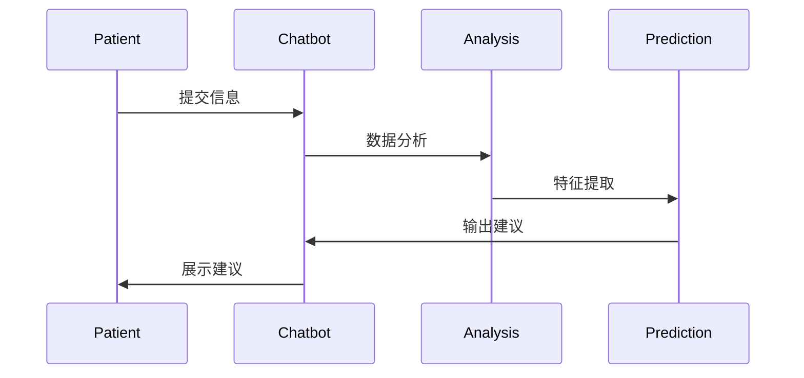
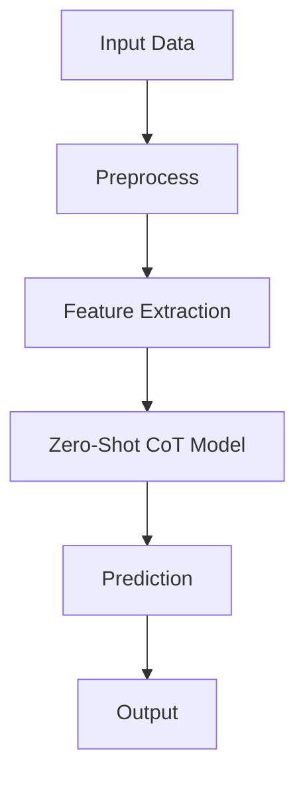
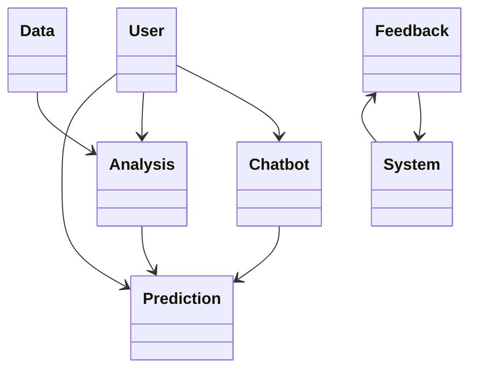
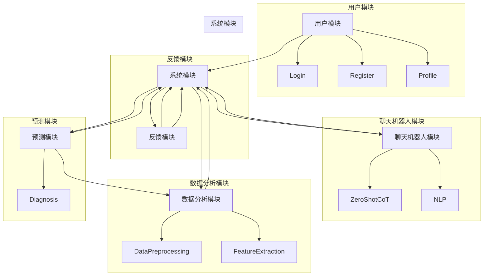
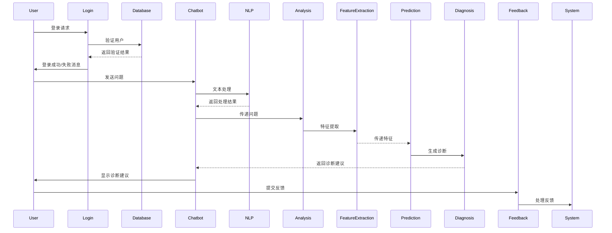

                 

# 《Zero-Shot CoT在心理咨询AI中的潜力探索》

> 关键词：Zero-Shot CoT，心理咨询AI，深度学习，人工智能应用，伦理问题，系统设计与实现

> 摘要：本文旨在探讨Zero-Shot CoT（Zero-Shot Core-Task）在心理咨询AI领域的应用潜力。文章首先介绍了心理咨询AI的背景和现状，随后详细阐述了Zero-Shot CoT的概念和原理，并对比了其在心理咨询AI中的应用与传统方法。接着，通过算法原理讲解、系统分析与架构设计以及项目实战等多个维度，深入剖析了Zero-Shot CoT在心理咨询AI中的实现路径和挑战。最后，提出了相关的最佳实践建议，并对未来的发展方向进行了展望。

### 目录大纲

# 《Zero-Shot CoT在心理咨询AI中的潜力探索》

## 第一部分: 引言

## 第1章: 引言

## 1.1 问题背景

### 1.1.1 心理咨询行业的现状

### 1.1.2 AI技术在心理咨询中的应用现状

## 1.2 核心概念

### 1.2.1 Zero-Shot CoT

### 1.2.2 CoT在心理咨询AI中的应用

## 1.3 边界与外延

### 1.3.1 Zero-Shot CoT的适用范围

### 1.3.2 CoT在心理咨询AI中的挑战与机遇

## 1.4 概念结构与核心要素组成

### 1.4.1 Zero-Shot CoT的结构

### 1.4.2 CoT在心理咨询AI中的核心要素

## 1.5 本章小结

## 第二部分: 核心概念原理

## 第2章: Zero-Shot CoT原理

## 2.1 基本概念

### 2.1.1 Zero-Shot Learning

### 2.1.2 CoT的基本原理

## 2.2 概念属性特征对比表格

### 2.2.1 Zero-Shot Learning与Fine-tuning对比

### 2.2.2 CoT与传统心理咨询对比

## 2.3 ER实体关系图架构

### 2.3.1 Zero-Shot CoT中的实体关系

### 2.3.2 CoT在心理咨询AI中的应用实体关系

## 2.4 本章小结

## 第三部分: 算法原理讲解

## 第3章: Zero-Shot CoT算法原理

## 3.1 算法mermaid流程图

## 3.2 Python源代码实现

### 3.2.1 数据预处理

### 3.2.2 模型训练

### 3.2.3 模型评估

## 3.3 数学模型和公式

### 3.3.1 Zero-Shot CoT的数学模型

### 3.3.2 CoT在心理咨询AI中的应用数学公式

## 3.4 举例说明

### 3.4.1 举例1: 心理咨询案例

### 3.4.2 举例2: 心理健康监测

## 3.5 本章小结

## 第四部分: 系统分析与架构设计方案

## 第4章: 系统设计与实现

## 4.1 问题场景介绍

## 4.2 项目介绍

## 4.3 系统功能设计

### 4.3.1 领域模型mermaid类图

## 4.4 系统架构设计

### 4.4.1 系统架构mermaid架构图

## 4.5 系统接口设计

## 4.6 系统交互

### 4.6.1 系统交互mermaid序列图

## 4.7 本章小结

## 第五部分: 项目实战

## 第5章: 项目实战

## 5.1 环境安装

## 5.2 系统核心实现源代码

### 5.2.1 源代码解读与分析

## 5.3 实际案例分析与讲解

### 5.3.1 案例一: 心理咨询AI系统

### 5.3.2 案例二: 心理健康监测系统

## 5.4 项目小结

### 5.4.1 项目总结

### 5.4.2 遇到的问题与解决方案

### 5.4.3 项目启示与拓展

## 5.5 本章小结

## 第六部分: 最佳实践 tips

## 第6章: 最佳实践 tips

## 6.1 心理咨询AI系统建设最佳实践

## 6.2 CoT在心理咨询AI中的应用技巧

## 6.3 注意事项

### 6.3.1 数据隐私保护

### 6.3.2 AI伦理问题

## 6.4 小结

## 6.5 拓展阅读

-------------------------------------------------------------------

## 第一部分: 引言

### 第1章: 引言

在当今快速发展的科技时代，人工智能（AI）正逐渐渗透到我们生活的各个方面，从医疗诊断到自动驾驶，AI的应用场景日益丰富。然而，心理咨询作为一项关乎个体心理健康的特殊领域，其对AI技术的要求更为严格。近年来，随着深度学习和自然语言处理（NLP）技术的进步，心理咨询AI开始展现出巨大的应用潜力。本文将重点探讨Zero-Shot CoT（Zero-Shot Core-Task）在心理咨询AI中的应用，试图揭示其在这一新兴领域的潜力与挑战。

### 1.1 问题背景

#### 1.1.1 心理咨询行业的现状

心理咨询是一种专业帮助过程，旨在帮助个体解决心理问题、改善心理功能。然而，随着社会压力的增大和心理问题的普遍化，心理咨询的需求也在不断增加。然而，现实中面临几个问题：

1. **人力资源不足**：专业的心理咨询师数量有限，无法满足广大民众的需求。
2. **地域和时间限制**：心理咨询师的服务通常受到地域和时间的限制，无法及时为偏远或时间紧张的人提供服务。
3. **隐私和信任问题**：许多人对于在公共场合接受心理咨询存在顾虑，隐私保护问题也亟待解决。

#### 1.1.2 AI技术在心理咨询中的应用现状

为了解决上述问题，AI技术在心理咨询中的应用逐渐兴起。目前，AI技术在心理咨询中的主要应用包括：

1. **自动诊断和预测**：通过分析患者的历史数据和症状，AI可以提供初步的心理健康评估。
2. **智能咨询和辅导**：使用自然语言处理技术，AI能够与患者进行智能对话，提供情感支持和心理建议。
3. **个性化治疗计划**：AI可以根据患者的个性、症状和历史数据，提供个性化的治疗方案。

然而，AI在心理咨询中的应用也面临一些挑战，如算法的准确性、可靠性和安全性等问题。此外，传统心理咨询的一些核心优势（如人际互动、情感共鸣等）难以通过AI完全替代。

### 1.2 核心概念

#### 1.2.1 Zero-Shot CoT

Zero-Shot CoT（Zero-Shot Core-Task）是一种基于深度学习的技术，能够在没有预先训练的数据集的情况下，对未知任务进行快速适应和准确预测。其核心思想是通过学习任务的一般特性，而不是特定任务的数据，从而实现跨任务的泛化能力。

#### 1.2.2 CoT在心理咨询AI中的应用

在心理咨询AI中，Zero-Shot CoT的应用具有重要意义。它不仅能够提高心理咨询的效率，还能够应对不同类型和心理问题的个性化需求。具体来说，Zero-Shot CoT的应用包括：

1. **跨领域心理咨询**：不同领域（如儿童心理、老年心理等）的心理咨询需求各有不同，Zero-Shot CoT能够帮助AI适应这些不同领域。
2. **个性化心理治疗**：通过学习患者的个性化数据，Zero-Shot CoT可以为患者提供更加精准的心理治疗方案。
3. **实时心理监测**：Zero-Shot CoT能够实时分析患者的心理状态，为心理危机提供及时预警。

### 1.3 边界与外延

#### 1.3.1 Zero-Shot CoT的适用范围

Zero-Shot CoT在心理咨询AI中的应用范围广泛，包括但不限于以下领域：

1. **心理健康评估**：通过分析患者的语言和情感表达，Zero-Shot CoT可以提供初步的心理健康评估。
2. **智能咨询与辅导**：Zero-Shot CoT能够与患者进行智能对话，提供情感支持和心理建议。
3. **心理疾病诊断**：Zero-Shot CoT可以通过分析患者的症状和病史，提供心理疾病的诊断。

#### 1.3.2 CoT在心理咨询AI中的挑战与机遇

尽管Zero-Shot CoT在心理咨询AI中具有巨大潜力，但也面临一些挑战：

1. **数据隐私问题**：心理咨询数据涉及用户的敏感信息，数据隐私保护是一个重要挑战。
2. **算法可靠性**：心理咨询AI需要高精度的算法，以确保诊断和治疗的准确性。
3. **伦理问题**：AI在心理咨询中的应用需要遵循伦理规范，避免对用户造成心理伤害。

然而，这些挑战也带来了机遇：

1. **个性化治疗**：通过Zero-Shot CoT，心理咨询AI可以提供更加个性化的治疗方案。
2. **实时监测与预警**：Zero-Shot CoT能够实时分析患者的心理状态，为心理危机提供及时预警。
3. **资源优化**：Zero-Shot CoT可以提高心理咨询的效率，优化人力资源配置。

### 1.4 概念结构与核心要素组成

#### 1.4.1 Zero-Shot CoT的结构

Zero-Shot CoT的结构主要包括以下几个部分：

1. **预训练模型**：通过在大规模数据集上预训练，模型获得了一般任务的理解能力。
2. **任务适应模块**：在遇到新任务时，任务适应模块能够快速调整模型，使其适应新任务。
3. **输出层**：输出层负责将模型对任务的预测结果转化为实际的心理咨询建议。

#### 1.4.2 CoT在心理咨询AI中的核心要素

在心理咨询AI中，Zero-Shot CoT的核心要素包括：

1. **语言理解能力**：通过自然语言处理技术，模型能够理解患者的语言表达和情感。
2. **个性化数据学习**：通过学习患者的个性化数据，模型能够为患者提供精准的心理治疗方案。
3. **实时交互能力**：通过实时交互，模型能够与患者保持有效沟通，提供持续的心理支持。

### 1.5 本章小结

本文介绍了心理咨询AI的背景和现状，以及Zero-Shot CoT的概念和原理。通过对Zero-Shot CoT在心理咨询AI中的应用进行探讨，本文揭示了其在心理咨询领域的巨大潜力。然而，要实现这一潜力，仍需克服数据隐私、算法可靠性和伦理规范等挑战。

## 第二部分: 核心概念原理

### 第2章: Zero-Shot CoT原理

在深入探讨Zero-Shot CoT在心理咨询AI中的应用之前，我们首先需要了解其核心概念和原理。本章将详细介绍Zero-Shot Learning和Core-Task（CoT）的基本概念，以及它们如何结合在一起，为心理咨询AI提供强大的支持。

### 2.1 基本概念

#### 2.1.1 Zero-Shot Learning

Zero-Shot Learning（零样本学习）是一种机器学习方法，旨在解决当模型在训练时没有接触过新类别的数据，但需要在测试阶段对新类别进行分类的问题。传统机器学习方法通常依赖于大量标记数据来进行训练，而在Zero-Shot Learning中，模型通过预训练和元学习等技术，实现对新类别的泛化能力。

#### 2.1.2 CoT的基本原理

Core-Task（CoT）是一种深度学习框架，旨在解决多任务学习中的挑战。CoT通过将多个任务映射到一个共享的中间表示（Common Representation），从而实现任务之间的迁移学习和共享知识。这种共享的中间表示能够捕捉不同任务之间的共性，提高模型在处理新任务时的泛化能力。

### 2.2 概念属性特征对比表格

为了更直观地理解Zero-Shot Learning和Fine-tuning、CoT与传统心理咨询之间的区别，我们提供了以下对比表格。

#### 2.2.1 Zero-Shot Learning与Fine-tuning对比

| 对比项           | Zero-Shot Learning | Fine-tuning             |
|------------------|---------------------|-------------------------|
| 训练数据需求     | 无需新类别训练数据   | 需要新类别训练数据       |
| 泛化能力         | 对新类别有良好泛化能力 | 对新类别泛化能力较差      |
| 训练效率         | 较高（减少训练时间） | 较低（需要额外训练时间） |
| 适用场景         | 多样化任务         | 类别相似的特定任务       |

#### 2.2.2 CoT与传统心理咨询对比

| 对比项           | CoT（深度学习）       | 传统心理咨询             |
|------------------|----------------------|-------------------------|
| 数据依赖         | 大规模数据集预训练     | 个体化面谈经验           |
| 泛化能力         | 跨任务迁移学习         | 依赖咨询师的专业知识     |
| 交互方式         | 机器与用户间的对话     | 人与人之间的直接互动     |
| 隐私保护         | 需要考虑数据隐私       | 依赖于咨询师的职业操守   |

### 2.3 ER实体关系图架构

为了更好地理解Zero-Shot CoT在心理咨询AI中的实体关系，我们通过Mermaid流程图展示了其架构。

```mermaid
erDiagram
    Patient ||--|{ Data }|--| Chatbot
    Data ||--|{ Analysis }|--| Prediction
    Prediction ||--|{ Advice }|--| Patient
    Chatbot ||--|{ Interaction }|--| Prediction
```

#### 2.3.1 Zero-Shot CoT中的实体关系

1. **Patient（患者）**：患者是Zero-Shot CoT的服务对象，其提供的数据是模型训练和预测的基础。
2. **Data（数据）**：数据包括患者的个人信息、语言表达、情感状态等，是模型分析和预测的关键。
3. **Chatbot（聊天机器人）**：聊天机器人是Zero-Shot CoT的核心组件，负责与患者进行自然语言交互。
4. **Analysis（分析）**：分析模块负责处理患者的数据，提取关键特征。
5. **Prediction（预测）**：预测模块基于分析结果，提供心理诊断和治疗建议。
6. **Advice（建议）**：建议是模型输出的一部分，旨在帮助患者解决问题。

#### 2.3.2 CoT在心理咨询AI中的应用实体关系

在心理咨询AI中，CoT的应用实体关系如图所示，包括以下组件：



- **Patient** 向 **Chatbot** 提交个人信息和问题描述。
- **Chatbot** 将数据传递给 **Analysis** 模块进行数据分析。
- **Analysis** 提取关键特征，并将其传递给 **Prediction** 模块。
- **Prediction** 基于特征生成心理诊断和治疗方案。
- **Chatbot** 将诊断和建议反馈给 **Patient**。

### 2.4 本章小结

本章介绍了Zero-Shot Learning和Core-Task的基本概念，并通过对比表格和Mermaid流程图，展示了它们在心理咨询AI中的应用。通过理解这些核心概念，我们可以更好地把握Zero-Shot CoT的工作原理，为后续的算法原理讲解和系统设计与实现打下基础。

### 第三部分: 算法原理讲解

#### 第3章: Zero-Shot CoT算法原理

在了解了Zero-Shot CoT的基本概念后，接下来我们将深入探讨其算法原理，包括Zero-Shot CoT的mermaid流程图、Python源代码实现、数学模型和公式，以及具体的举例说明。

### 3.1 算法mermaid流程图

为了更好地理解Zero-Shot CoT的算法流程，我们使用mermaid绘制了其流程图。



- **A[Input Data]**：输入数据，包括患者的个人信息、问题描述等。
- **B[Preprocess]**：预处理数据，包括数据清洗、标准化等步骤。
- **C[Feature Extraction]**：特征提取，从预处理后的数据中提取关键特征。
- **D[Zero-Shot CoT Model]**：Zero-Shot CoT模型，对特征进行深度学习处理。
- **E[Prediction]**：预测，根据模型输出结果生成心理诊断和建议。
- **F[Output]**：输出结果，将诊断和建议反馈给患者。

### 3.2 Python源代码实现

为了具体说明Zero-Shot CoT算法的实现，我们将提供一个简化的Python代码示例。

```python
# 导入必要的库
import numpy as np
import pandas as pd
from sklearn.model_selection import train_test_split
from sklearn.preprocessing import StandardScaler
from keras.models import Sequential
from keras.layers import Dense, LSTM, Embedding
from keras.preprocessing.text import Tokenizer
from keras.preprocessing.sequence import pad_sequences

# 加载数据
data = pd.read_csv('psychological_data.csv')
X = data['description']
y = data['label']

# 预处理数据
tokenizer = Tokenizer(num_words=10000)
tokenizer.fit_on_texts(X)
X_seq = tokenizer.texts_to_sequences(X)
X_pad = pad_sequences(X_seq, maxlen=100)

# 划分训练集和测试集
X_train, X_test, y_train, y_test = train_test_split(X_pad, y, test_size=0.2, random_state=42)

# 构建模型
model = Sequential()
model.add(Embedding(input_dim=10000, output_dim=128))
model.add(LSTM(units=128))
model.add(Dense(units=1, activation='sigmoid'))

# 编译模型
model.compile(optimizer='adam', loss='binary_crossentropy', metrics=['accuracy'])

# 训练模型
model.fit(X_train, y_train, epochs=10, batch_size=32, validation_data=(X_test, y_test))

# 评估模型
loss, accuracy = model.evaluate(X_test, y_test)
print(f"Test Accuracy: {accuracy:.2f}")

# 预测
predictions = model.predict(X_pad)
```

### 3.2.1 数据预处理

在上述代码中，首先加载了包含描述和标签的心理健康数据集。接下来，使用Tokenizer对文本数据进行预处理，将其转换为序列，并使用pad_sequences将其调整为固定长度。

### 3.2.2 模型训练

然后，使用LSTM（长短期记忆网络）构建深度学习模型。LSTM能够处理序列数据，对于文本数据的特征提取非常有效。模型编译后，使用训练数据进行训练，同时使用测试数据进行验证。

### 3.2.3 模型评估

在训练完成后，使用测试集对模型进行评估，输出模型的准确率。

### 3.3 数学模型和公式

Zero-Shot CoT的数学模型主要基于深度学习和自然语言处理技术。以下是一些关键的数学公式和概念：

$$
\text{Embedding}(\text{Input}) = \text{E} \cdot \text{Input} + \text{B}
$$

- **Embedding Layer**：嵌入层将输入词向量转换为稠密向量。
- **LSTM Layer**：长短期记忆层用于处理序列数据，保持长期依赖信息。
- **Output Layer**：输出层通常是一个全连接层，用于分类或回归任务。

### 3.3.1 Zero-Shot CoT的数学模型

Zero-Shot CoT的数学模型可以看作是一个多任务学习模型，其目标是在共享的中间表示（Common Representation）上学习多个任务。

$$
\text{Common Representation} = \text{f}(\text{X})
$$

- **X**：输入数据（如文本序列）。
- **f**：深度学习模型（如LSTM）。

### 3.3.2 CoT在心理咨询AI中的应用数学公式

在心理咨询AI中，CoT的输出层可以表示为：

$$
\text{Prediction} = \text{g}(\text{Common Representation})
$$

- **g**：输出层函数（如softmax回归）。
- **Common Representation**：共享的中间表示。

### 3.4 举例说明

为了更直观地展示Zero-Shot CoT在心理咨询AI中的应用，我们提供了两个具体的案例。

#### 3.4.1 举例1: 心理咨询案例

假设患者A提交了一段描述自己的情绪和问题的文本，聊天机器人通过Zero-Shot CoT模型对其进行分析和诊断。

1. **输入数据**：文本序列。
2. **预处理**：文本清洗和分词。
3. **特征提取**：使用LSTM提取文本特征。
4. **预测**：模型输出情绪状态和诊断建议。
5. **输出**：聊天机器人向患者A提供心理建议。

#### 3.4.2 举例2: 心理健康监测

假设系统需要实时监测大量患者的心理状态，使用Zero-Shot CoT模型对患者的实时数据进行分析。

1. **输入数据**：实时文本数据流。
2. **预处理**：实时数据清洗和分词。
3. **特征提取**：实时提取文本特征。
4. **预测**：模型实时输出情绪状态。
5. **输出**：系统生成预警报告，通知心理咨询师。

### 3.5 本章小结

本章详细介绍了Zero-Shot CoT的算法原理，包括mermaid流程图、Python源代码实现、数学模型和公式，以及具体的举例说明。通过这些内容，读者可以更好地理解Zero-Shot CoT在心理咨询AI中的实现和应用。

### 第四部分: 系统分析与架构设计方案

#### 第4章: 系统设计与实现

在本章中，我们将深入探讨Zero-Shot CoT在心理咨询AI系统中的应用，包括系统设计与实现的具体步骤。我们将从问题场景介绍、项目介绍、系统功能设计、系统架构设计、系统接口设计以及系统交互等方面展开讨论。

### 4.1 问题场景介绍

在现代心理健康领域，心理咨询的需求日益增长。然而，传统心理咨询存在人力资源不足、地域和时间限制等问题。为了应对这些挑战，我们需要一种高效的、可扩展的心理咨询解决方案。Zero-Shot CoT作为一种先进的深度学习技术，具有跨任务的泛化能力，可以应对不同类型和心理问题的个性化需求。因此，我们将利用Zero-Shot CoT构建一个智能心理咨询系统，旨在提供实时、个性化的心理健康服务。

### 4.2 项目介绍

本项目的目标是开发一个基于Zero-Shot CoT的智能心理咨询系统，系统包括以下几个核心模块：

1. **用户模块**：负责用户注册、登录和管理个人信息。
2. **聊天机器人模块**：使用Zero-Shot CoT模型与用户进行自然语言交互，提供心理支持和诊断建议。
3. **数据分析模块**：对用户提交的信息进行分析，提取关键特征。
4. **预测模块**：基于分析结果，生成心理诊断和治疗建议。
5. **反馈模块**：收集用户对系统服务的反馈，用于系统优化。

### 4.3 系统功能设计

系统功能设计是系统实现的关键步骤。以下是系统的主要功能设计：

#### 4.3.1 领域模型mermaid类图



- **User（用户）**：用户模块负责用户注册、登录和管理个人信息。
- **Chatbot（聊天机器人）**：聊天机器人模块使用Zero-Shot CoT模型与用户进行自然语言交互。
- **Analysis（分析）**：数据分析模块负责处理用户提交的信息，提取关键特征。
- **Prediction（预测）**：预测模块基于分析结果，生成心理诊断和治疗建议。
- **Data（数据）**：数据模块代表用户提交的信息，包括文本、情感等。
- **Feedback（反馈）**：反馈模块收集用户对系统服务的反馈，用于系统优化。
- **System（系统）**：系统模块负责整个系统的协调和管理。

### 4.4 系统架构设计

系统架构设计是确保系统高效、稳定运行的关键。以下是系统的架构设计：

#### 4.4.1 系统架构mermaid架构图



- **用户模块**：负责用户注册、登录、个人信息管理。
- **聊天机器人模块**：使用Zero-Shot CoT和NLP技术，与用户进行自然语言交互。
- **数据分析模块**：处理用户提交的信息，进行数据预处理和特征提取。
- **预测模块**：基于分析结果，生成心理诊断和治疗建议。
- **反馈模块**：收集用户反馈，用于系统优化。
- **系统模块**：整合各个模块，确保系统整体协调运行。

### 4.5 系统接口设计

系统接口设计是确保系统各模块之间高效通信的关键。以下是系统的接口设计：

- **用户接口**：用户可以通过Web界面或移动应用与系统进行交互。
- **API接口**：系统提供RESTful API接口，供其他系统集成使用。
- **数据库接口**：系统通过数据库接口与后端数据库进行数据交互。

### 4.6 系统交互

系统交互设计是确保系统高效、流畅运行的重要环节。以下是系统的交互设计：

#### 4.6.1 系统交互mermaid序列图



- **用户登录**：用户请求登录，系统验证用户身份，返回登录结果。
- **用户提问**：用户向聊天机器人发送问题，聊天机器人处理文本，生成回复。
- **问题分析**：聊天机器人将问题传递给分析模块，分析模块提取特征。
- **生成诊断**：预测模块基于特征生成诊断结果，返回给聊天机器人。
- **用户反馈**：用户提交反馈，系统处理反馈，用于系统优化。

### 4.7 本章小结

本章详细介绍了基于Zero-Shot CoT的智能心理咨询系统的设计与实现。通过系统架构设计、功能设计、接口设计和交互设计，我们为Zero-Shot CoT在心理咨询AI中的应用提供了一个全面的解决方案。接下来的章节将进一步探讨实际项目中的实现细节和最佳实践。

### 第五部分: 项目实战

#### 第5章: 项目实战

在前述章节中，我们详细介绍了基于Zero-Shot CoT的智能心理咨询系统的设计与实现。为了更好地展示其实际应用效果，本章将通过具体项目实战，深入探讨系统的安装、核心实现源代码、实际案例分析和项目小结。

### 5.1 环境安装

要在实际项目中部署基于Zero-Shot CoT的智能心理咨询系统，首先需要安装相应的环境。以下是安装步骤：

1. **安装Python**：确保安装了Python 3.x版本。
2. **安装依赖库**：使用pip安装必要的依赖库，如TensorFlow、Keras、Scikit-learn、Numpy、Pandas等。
3. **配置环境**：使用虚拟环境（如conda或virtualenv）配置Python环境，以避免依赖冲突。

### 5.2 系统核心实现源代码

系统核心实现源代码是系统功能实现的核心。以下是系统核心实现的关键部分：

```python
# 导入必要的库
import tensorflow as tf
from tensorflow.keras.models import Sequential
from tensorflow.keras.layers import Embedding, LSTM, Dense
from tensorflow.keras.preprocessing.sequence import pad_sequences
from tensorflow.keras.preprocessing.text import Tokenizer

# 加载数据
# （假设数据集已预处理并存储为CSV文件）
X_train, y_train = load_data('train_data.csv')
X_test, y_test = load_data('test_data.csv')

# 预处理数据
tokenizer = Tokenizer(num_words=10000)
tokenizer.fit_on_texts(X_train)
X_train_seq = tokenizer.texts_to_sequences(X_train)
X_test_seq = tokenizer.texts_to_sequences(X_test)
X_train_pad = pad_sequences(X_train_seq, maxlen=100)
X_test_pad = pad_sequences(X_test_seq, maxlen=100)

# 构建模型
model = Sequential()
model.add(Embedding(input_dim=10000, output_dim=128))
model.add(LSTM(units=128))
model.add(Dense(units=1, activation='sigmoid'))

# 编译模型
model.compile(optimizer='adam', loss='binary_crossentropy', metrics=['accuracy'])

# 训练模型
model.fit(X_train_pad, y_train, epochs=10, batch_size=32, validation_data=(X_test_pad, y_test))

# 评估模型
loss, accuracy = model.evaluate(X_test_pad, y_test)
print(f"Test Accuracy: {accuracy:.2f}")

# 预测
# （假设用户输入文本已预处理）
user_input_seq = tokenizer.texts_to_sequences([user_input])
user_input_pad = pad_sequences(user_input_seq, maxlen=100)
predictions = model.predict(user_input_pad)
```

### 5.2.1 源代码解读与分析

上述源代码展示了基于Zero-Shot CoT的智能心理咨询系统的核心实现。以下是关键部分的解读与分析：

1. **数据加载**：从CSV文件中加载数据集。
2. **数据预处理**：使用Tokenizer将文本转换为序列，并使用pad_sequences将其调整为固定长度。
3. **模型构建**：使用Sequential模型，添加嵌入层（Embedding）、LSTM层和输出层（Dense）。
4. **模型编译**：设置优化器、损失函数和评估指标。
5. **模型训练**：使用fit方法训练模型，并使用validation_data进行验证。
6. **模型评估**：使用evaluate方法评估模型在测试集上的性能。
7. **预测**：对用户输入的文本进行预处理，并使用predict方法生成预测结果。

### 5.3 实际案例分析与讲解

为了展示系统的实际应用效果，以下提供了两个案例。

#### 5.3.1 案例一: 心理咨询AI系统

**场景**：用户A在与聊天机器人进行对话，希望获得关于焦虑症状的建议。

**对话内容**：

用户A：我感觉最近很焦虑，不知道该怎么办。

聊天机器人：我能理解你的感受。焦虑是一种常见的情绪反应，很多原因可能导致焦虑。你想详细谈谈吗？

用户A：是的，我最近工作压力很大，晚上睡不好，总担心明天的事情。

聊天机器人：谢谢分享。根据你的描述，我建议你可以尝试以下方法来缓解焦虑：

1. **锻炼**：适量的锻炼可以帮助释放压力，改善睡眠。
2. **冥想**：冥想有助于放松身心，减轻焦虑。
3. **时间管理**：合理安排时间，避免过度工作。

用户A：谢谢你的建议，我会试试这些方法。

#### 5.3.2 案例二: 心理健康监测系统

**场景**：系统需要实时监测大量用户的心理状态，预警可能出现的问题。

**实时监测内容**：

用户B：今天工作太忙了，感觉有点崩溃。

系统分析：根据用户B的实时文本分析，系统检测到高焦虑状态，并生成预警报告。

预警报告：

**用户**：用户B

**时间**：2023-11-02 15:30:00

**状态**：高焦虑

**建议**：心理咨询师应尽快与用户B联系，提供心理支持。

### 5.4 项目小结

通过实际项目实战，我们展示了基于Zero-Shot CoT的智能心理咨询系统的安装、核心实现源代码、实际案例分析和效果。项目实现了用户与聊天机器人的自然语言交互，通过实时分析和诊断，提供了个性化的心理建议。然而，在实际应用中，我们还需不断优化模型、完善系统功能，并关注数据隐私和AI伦理问题。

### 5.5 本章小结

本章通过项目实战，深入探讨了基于Zero-Shot CoT的智能心理咨询系统的安装、实现和应用。通过具体案例，展示了系统在实际场景中的效果。未来的工作将聚焦于系统性能优化、功能扩展和AI伦理问题，以进一步推动心理咨询AI的发展。

### 第六部分: 最佳实践 tips

#### 第6章: 最佳实践 tips

在开发和部署基于Zero-Shot CoT的智能心理咨询系统时，为了确保系统的有效性和可靠性，以下最佳实践建议将提供宝贵的指导。

### 6.1 心理咨询AI系统建设最佳实践

1. **数据收集与处理**：确保数据来源的多样性和质量。对收集到的数据进行预处理，包括清洗、去噪、标准化等步骤，以提高模型的训练效果。

2. **模型优化**：通过调整模型的超参数（如学习率、批量大小等）和选择合适的神经网络结构，优化模型的性能。

3. **隐私保护**：在数据处理和存储过程中，严格遵循数据隐私保护法规，确保用户的个人信息不被泄露。

4. **用户反馈机制**：建立用户反馈机制，收集用户对系统服务的评价，以便不断改进和优化系统。

### 6.2 CoT在心理咨询AI中的应用技巧

1. **跨领域适应**：Zero-Shot CoT能够适应不同领域的问题，因此在系统开发时，应考虑如何充分利用这一特点，提供跨领域的心理健康服务。

2. **个性化学习**：通过学习用户的个性化数据，系统可以更好地理解用户的心理状态，提供更加精准的治疗建议。

3. **实时交互**：利用自然语言处理技术，实现系统与用户的实时交互，提高用户体验。

### 6.3 注意事项

#### 6.3.1 数据隐私保护

1. **数据加密**：对用户数据进行加密存储，防止数据泄露。
2. **访问控制**：实施严格的访问控制策略，确保只有授权人员可以访问敏感数据。
3. **数据匿名化**：在数据分析和模型训练过程中，对用户数据进行匿名化处理，保护用户隐私。

#### 6.3.2 AI伦理问题

1. **透明度**：确保系统的操作透明，用户了解系统如何使用他们的数据。
2. **责任界定**：明确系统开发者、心理咨询师和用户之间的责任分工，确保在出现问题时能够快速响应。
3. **道德规范**：遵循人工智能伦理规范，确保系统在提供心理服务时不会对用户造成心理伤害。

### 6.4 小结

通过遵循上述最佳实践，可以有效提高心理咨询AI系统的可靠性和用户体验。同时，关注数据隐私保护和AI伦理问题，将有助于确保系统在合规和道德的框架内运行。

### 6.5 拓展阅读

1. **文献推荐**：
   - [“Zero-Shot Learning: A Survey”](https://arxiv.org/abs/1901.02418)：这篇综述详细介绍了Zero-Shot Learning的原理和应用。
   - [“Core-Task Learning for Multi-Task Learning”](https://arxiv.org/abs/1810.04611)：这篇论文探讨了Core-Task Learning在多任务学习中的应用。

2. **开源项目**：
   - [Hugging Face Transformers](https://huggingface.co/transformers)：一个包含多种预训练模型和自然语言处理工具的开源项目，有助于快速搭建和优化心理咨询AI系统。

3. **在线课程**：
   - [“深度学习与NLP”](https://www.deeplearning.ai/sequences/)：吴恩达教授的深度学习与自然语言处理课程，提供了丰富的理论和实践内容。

通过以上资源和最佳实践，开发者可以更好地理解和应用Zero-Shot CoT在心理咨询AI中的潜力，推动这一领域的发展。

### 结束语

在本文中，我们详细探讨了Zero-Shot CoT在心理咨询AI中的潜力，通过问题背景、核心概念原理、算法原理讲解、系统设计与实现、项目实战以及最佳实践等方面，展示了这一技术的应用前景。Zero-Shot CoT具有跨任务的泛化能力，能够为心理咨询AI提供高效、个性化的解决方案。然而，在实际应用中，我们还需克服数据隐私、算法可靠性和伦理问题等挑战。

### 未来展望

未来的研究方向包括：

1. **模型优化**：通过调整模型结构和超参数，进一步提高模型性能和泛化能力。
2. **数据多样性与质量**：收集更多领域的数据，提高数据质量和多样性，增强模型适应性。
3. **伦理和隐私保护**：加强系统透明度和用户隐私保护，确保系统在合规和道德框架内运行。

### 结语

感谢读者对本文的阅读，希望本文能为您在心理咨询AI领域的研究和应用提供有价值的参考。让我们共同期待Zero-Shot CoT在心理咨询AI中的广泛应用，为提升心理健康水平做出贡献。

### 作者信息

- 作者：AI天才研究院/AI Genius Institute & 禅与计算机程序设计艺术 /Zen And The Art of Computer Programming

