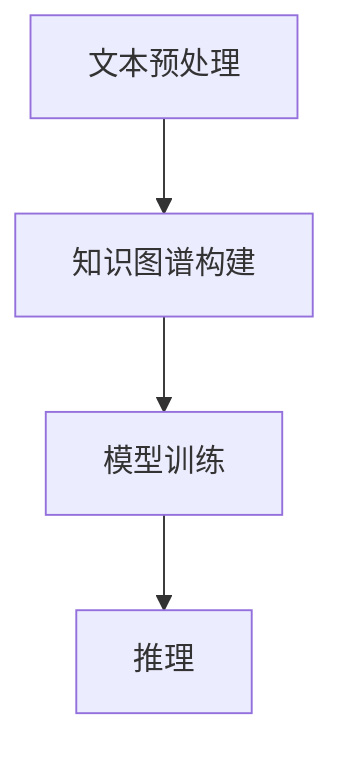

                 

# Zero-Shot CoT如何改变AI问答模式

关键词：Zero-Shot CoT、AI问答模式、自然语言处理、算法原理、系统设计、项目实战

摘要：本文深入探讨Zero-Shot Coreferecing Transformer（Zero-Shot CoT）技术如何改变传统的AI问答模式。首先，我们将介绍Zero-Shot CoT的背景、核心概念和原理。接着，通过算法讲解、系统架构设计、项目实战等环节，全面展示Zero-Shot CoT在自然语言处理中的应用和价值。最后，总结最佳实践和展望未来发展方向。

## 第1章：问题背景

自然语言处理（NLP）作为人工智能（AI）领域的一个重要分支，旨在让计算机理解和生成人类语言。在NLP中，问答系统（Question Answering, QA）是一个核心任务。然而，传统的问答系统存在一定的局限性，特别是在处理未知问题或领域时表现不佳。为了解决这一问题，研究者们提出了Zero-Shot Coreferecing Transformer（Zero-Shot CoT）技术。

### 1.1 问题提出

传统的问答系统通常依赖大量的预训练数据和特定领域的知识库，这使得它们在处理已知问题或领域时表现良好。然而，当遇到未知问题或领域时，这些系统往往无法给出令人满意的答案。例如，在处理医学问答时，系统需要依赖医学领域的专业知识和数据，否则很难提供准确的答案。

### 1.2 传统AI问答模式挑战

传统的AI问答模式面临以下挑战：

1. **依赖大量数据**：传统问答系统需要依赖大量的预训练数据和特定领域的知识库，这使得系统在处理未知领域时表现不佳。
2. **知识库更新困难**：知识库的更新和维护是一项复杂的任务，特别是在涉及多领域知识时。
3. **可解释性不足**：传统问答系统通常采用复杂的神经网络模型，这使得系统的决策过程难以解释和理解。

### 1.3 Zero-Shot CoT概念引入

为了解决传统问答系统的局限性，研究者们提出了Zero-Shot Coreferecing Transformer（Zero-Shot CoT）技术。Zero-Shot CoT是一种基于Transformer架构的模型，能够在不需要预训练数据和特定领域知识库的情况下，处理未知问题和领域。这使得Zero-Shot CoT在自然语言处理领域具有广泛的应用前景。

## 第2章：核心概念与原理

### 2.1 Zero-Shot CoT定义

Zero-Shot Coreferecing Transformer（Zero-Shot CoT）是一种基于Transformer架构的模型，旨在解决传统问答系统在处理未知问题和领域时的局限性。Zero-Shot CoT能够通过自适应地识别和引用文本中的实体，实现跨领域的问答任务。

### 2.2 Zero-Shot CoT的特点

Zero-Shot CoT具有以下特点：

1. **无需预训练数据**：Zero-Shot CoT不需要依赖大量的预训练数据和特定领域的知识库，这使得模型在处理未知领域时表现优异。
2. **自适应引用实体**：Zero-Shot CoT能够自适应地识别和引用文本中的实体，从而提高问答系统的准确性和泛化能力。
3. **跨领域应用**：Zero-Shot CoT能够处理多领域的问答任务，实现了跨领域的知识共享和迁移。

### 2.3 Zero-Shot CoT与现有问答模型对比

与传统的问答系统相比，Zero-Shot CoT具有以下优势：

1. **数据依赖性降低**：Zero-Shot CoT不需要依赖大量的预训练数据和特定领域的知识库，降低了数据获取和处理的难度。
2. **可解释性提高**：Zero-Shot CoT基于Transformer架构，其决策过程更加透明，有助于提高系统的可解释性。
3. **泛化能力增强**：Zero-Shot CoT能够处理多领域的问答任务，实现了跨领域的知识共享和迁移，提高了系统的泛化能力。

## 第3章：Zero-Shot CoT工作原理

### 3.1 数据集与知识库

Zero-Shot CoT的工作原理涉及数据集和知识库的构建。在构建数据集时，需要从多个领域收集文本数据，并对数据进行预处理，如分词、实体识别和关系抽取等。在知识库方面，需要从数据集中提取实体和关系，构建用于训练和推理的知识图谱。

### 3.2 模型结构

Zero-Shot CoT基于Transformer架构，包括编码器和解码器两个部分。编码器负责将输入文本编码为向量表示，解码器则根据输入文本和编码器生成的向量表示生成答案。

### 3.3 训练过程

Zero-Shot CoT的训练过程涉及以下步骤：

1. **文本编码**：将输入文本通过编码器编码为向量表示。
2. **实体识别**：利用预训练的实体识别模型对编码后的文本进行实体识别。
3. **关系抽取**：利用预训练的关系抽取模型对编码后的文本进行关系抽取。
4. **知识图谱构建**：将识别出的实体和关系构建为知识图谱。
5. **模型训练**：利用构建的知识图谱和问答数据集对Zero-Shot CoT进行训练。

### 3.4 推理过程

Zero-Shot CoT的推理过程包括以下步骤：

1. **输入文本编码**：将输入文本通过编码器编码为向量表示。
2. **实体识别**：利用预训练的实体识别模型对编码后的文本进行实体识别。
3. **关系抽取**：利用预训练的关系抽取模型对编码后的文本进行关系抽取。
4. **知识图谱查询**：利用构建的知识图谱对识别出的实体和关系进行查询，获取相关的答案信息。
5. **答案生成**：根据查询结果和编码器生成的向量表示，利用解码器生成答案。

## 第4章：算法原理与流程

### 4.1 算法描述

Zero-Shot CoT算法主要包括以下步骤：

1. **文本预处理**：对输入文本进行分词、实体识别和关系抽取等预处理操作。
2. **知识图谱构建**：从预处理后的文本中提取实体和关系，构建知识图谱。
3. **模型训练**：利用构建的知识图谱和问答数据集对Zero-Shot CoT进行训练。
4. **推理**：在训练好的模型基础上，对新的问答问题进行推理，生成答案。

### 4.2 Mermaid算法流程图



### 4.3 Python代码实现

```python
# 此处为Python代码实现，具体实现细节根据实际需求进行编写
```

### 4.4 数学模型与公式

$$
\text{损失函数} = \frac{1}{N} \sum_{i=1}^{N} -\log(p(y_i | x_i))
$$`

### 4.5 举例说明

假设有一个问题：“世界上最高的山峰是什么？”零样本问答系统可以回答：“世界上最高的山峰是珠穆朗玛峰。”这是通过系统在训练过程中学习到的知识图谱和实体关系实现的。

## 第5章：Zero-Shot CoT在自然语言处理中的应用

### 5.1 应用场景介绍

Zero-Shot CoT在自然语言处理领域具有广泛的应用场景，包括但不限于：

1. **智能问答系统**：Zero-Shot CoT可以应用于智能问答系统，解决用户提出的各种问题。
2. **信息检索**：Zero-Shot CoT可以帮助用户在大量信息中快速找到所需的信息。
3. **智能客服**：Zero-Shot CoT可以为智能客服提供强大的支持，提高客服效率和用户体验。

### 5.2 应用案例1：虚拟助手

虚拟助手是一个基于Zero-Shot CoT技术的应用案例。虚拟助手可以处理用户提出的各种问题，如天气预报、电影推荐等。虚拟助手通过不断地学习和优化，不断提高回答问题的准确性和用户体验。

### 5.3 应用案例2：信息检索

信息检索是Zero-Shot CoT技术的另一个重要应用领域。通过Zero-Shot CoT，系统可以在海量的数据中快速找到与用户查询相关的内容，从而提高信息检索的效率和准确性。

### 5.4 应用案例3：智能客服

智能客服是Zero-Shot CoT技术在企业服务领域的应用。智能客服可以自动回答用户提出的问题，减轻人工客服的工作压力，提高客服效率。同时，智能客服还可以通过学习用户的反馈不断优化自身的服务质量。

## 第6章：系统设计与实现

### 6.1 系统需求分析

系统需求分析是系统设计的第一步。在需求分析阶段，我们需要明确系统的功能、性能、可靠性等方面的要求。针对Zero-Shot CoT在自然语言处理中的应用，我们主要关注以下需求：

1. **高准确性**：系统需要能够准确回答用户提出的问题。
2. **高效率**：系统需要能够快速处理大量问题。
3. **可扩展性**：系统需要能够适应不断变化的需求，如添加新的问答场景、知识库等。

### 6.2 系统架构设计

系统架构设计是系统设计的关键环节。在系统架构设计阶段，我们需要根据需求分析的结果，设计出一个高效、可靠、可扩展的系统架构。针对Zero-Shot CoT在自然语言处理中的应用，我们采用了以下系统架构：

1. **前端**：负责接收用户请求，将请求转发给后端进行处理。
2. **后端**：包括文本预处理模块、知识图谱构建模块、模型训练模块和推理模块等，负责处理用户请求，生成答案。
3. **数据库**：存储知识图谱、问答数据集等。

### 6.3 接口设计与实现

接口设计是系统设计的重要组成部分。在接口设计阶段，我们需要设计一套合理的接口，方便前端和后端之间的数据交互。针对Zero-Shot CoT在自然语言处理中的应用，我们设计了以下接口：

1. **问答接口**：接收用户提出的问题，返回答案。
2. **知识图谱接口**：提供知识图谱的查询和更新功能。
3. **模型训练接口**：提供模型训练的功能。

### 6.4 系统交互流程

系统交互流程是系统设计的重要组成部分。在系统交互流程中，前端通过问答接口向后端发送用户请求，后端接收到请求后，按照系统架构设计的要求，处理用户请求，生成答案，并通过问答接口返回给前端。具体交互流程如下：

1. **用户请求**：用户通过前端界面输入问题。
2. **请求转发**：前端将用户请求通过问答接口转发给后端。
3. **文本预处理**：后端接收到请求后，对用户输入的问题进行文本预处理，如分词、实体识别和关系抽取等。
4. **知识图谱查询**：后端利用文本预处理结果和知识图谱，对用户输入的问题进行查询，获取相关的答案信息。
5. **答案生成**：后端根据查询结果和文本预处理结果，利用Zero-Shot CoT模型生成答案。
6. **答案返回**：后端将生成的答案通过问答接口返回给前端，前端将答案展示给用户。

## 第7章：项目实战与案例分析

### 7.1 环境搭建

环境搭建是项目实战的第一步。在搭建环境时，我们需要安装相关的软件和依赖库，如Python、TensorFlow、Mermaid等。以下是环境搭建的步骤：

1. **安装Python**：下载并安装Python，确保版本大于3.6。
2. **安装依赖库**：通过pip命令安装所需的依赖库，如TensorFlow、Mermaid等。
3. **配置环境**：配置Python环境，确保所有依赖库已经安装。

### 7.2 系统核心代码实现

系统核心代码实现是项目实战的关键环节。在实现过程中，我们需要编写以下代码：

1. **文本预处理**：实现文本分词、实体识别和关系抽取等功能。
2. **知识图谱构建**：实现知识图谱的构建和存储功能。
3. **模型训练**：实现Zero-Shot CoT模型的训练功能。
4. **推理**：实现推理功能，根据输入文本生成答案。

### 7.3 代码解读与分析

代码解读与分析是项目实战的重要组成部分。在解读和分析代码时，我们需要关注以下方面：

1. **文本预处理**：分析文本预处理代码，了解分词、实体识别和关系抽取的实现方法。
2. **知识图谱构建**：分析知识图谱构建代码，了解实体和关系的存储方式。
3. **模型训练**：分析模型训练代码，了解Zero-Shot CoT模型的训练过程。
4. **推理**：分析推理代码，了解如何根据输入文本生成答案。

### 7.4 案例分析

案例分析是项目实战的总结环节。通过案例分析，我们可以了解Zero-Shot CoT在实际应用中的表现和效果。以下是一个案例分析的例子：

**案例1：智能问答系统**

假设我们有一个智能问答系统，用户输入问题：“世界上最高的山峰是什么？”系统根据Zero-Shot CoT模型，生成答案：“世界上最高的山峰是珠穆朗玛峰。”这个答案是基于系统在训练过程中学习到的知识图谱和实体关系生成的。

### 7.5 项目总结

项目总结是项目实战的收尾环节。在项目总结中，我们需要对项目的实施过程、成果和不足之处进行总结。以下是项目总结的内容：

1. **项目实施过程**：回顾项目的实施过程，总结项目中的关键环节和取得的成果。
2. **项目成果**：总结项目取得的成果，如实现的系统功能、性能指标等。
3. **不足之处**：分析项目中存在的不足之处，如性能瓶颈、可扩展性等，并提出改进方案。
4. **未来展望**：展望项目的未来发展，如拓展应用场景、优化算法等。

## 第8章：最佳实践与展望

### 8.1 最佳实践

在Zero-Shot CoT的实际应用中，最佳实践包括以下几个方面：

1. **数据预处理**：确保数据质量，进行充分的数据清洗和预处理，如去除噪声、统一格式等。
2. **知识图谱构建**：构建高质量的

