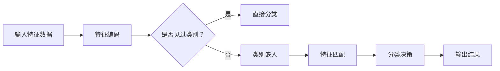
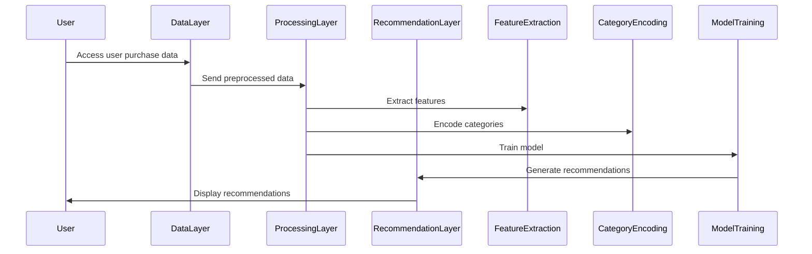
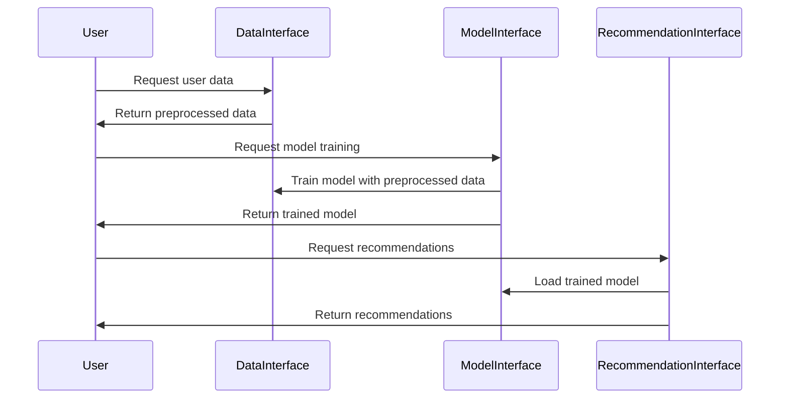

                 

### 第1章：背景介绍与核心概念

#### 1.1 问题背景

##### 1.1.1 无监督学习在AIGC领域的重要性

无监督学习在人工智能生成内容（AIGC）领域中扮演着至关重要的角色。AIGC涵盖了从图像、音频到文本等多种类型的内容生成，其核心在于通过算法自动生成新的数据。无监督学习的关键优势在于它不需要人工标注的数据，可以自动从未标记的数据中发现模式和结构。

在AIGC中，无监督学习的重要性主要体现在以下几个方面：

1. **数据隐私保护**：无监督学习不需要使用标记数据，因此在处理敏感数据时，可以更好地保护数据隐私。
2. **高效率内容生成**：无监督学习可以自动发现数据中的潜在结构，使得内容生成过程更加高效。
3. **自适应性和泛化能力**：无监督学习算法能够适应各种数据分布，具有较强的泛化能力。

##### 1.1.2 零样本学习与零样本迁移学习的概念和现状

零样本学习（Zero-Shot Learning, ZSL）和零样本迁移学习（Zero-Shot Transfer Learning, ZS-TL）是近年来备受关注的研究方向。

**零样本学习**：在零样本学习中，模型在面对从未见过的类时，仍然能够准确地对其进行分类。这种方法的核心在于将预训练的知识迁移到新类上。

**零样本迁移学习**：零样本迁移学习结合了零样本学习和迁移学习的优势，通过利用预训练模型的知识，对新的数据集进行有效的迁移学习。

当前，零样本学习与零样本迁移学习的研究主要集中在以下几个方面：

1. **词嵌入方法**：使用词嵌入模型，如Word2Vec和GloVe，将类别信息嵌入到低维空间中。
2. **元学习**：通过元学习算法，如MAML和REPTILE，加速模型在新类别上的适应。
3. **多任务学习**：通过多任务学习，共享不同任务的表示，提高模型在新类别上的泛化能力。

##### 1.1.3 零样本学习在AIGC中的应用场景和挑战

零样本学习在AIGC领域有着广泛的应用场景，如：

1. **图像生成**：在图像生成任务中，零样本学习可以用于生成从未见过的图像风格。
2. **文本生成**：在文本生成任务中，零样本学习可以生成基于新类别或主题的文本。
3. **音频合成**：在音频合成任务中，零样本学习可以生成基于新音乐风格或声音的音频。

然而，零样本学习在AIGC中仍然面临一些挑战：

1. **类别多样性**：零样本学习需要处理大量的未知类别，这增加了模型的复杂度和训练难度。
2. **数据分布**：零样本学习假设新类别和已见类别在数据分布上是相似的，但实际中可能存在较大差异。
3. **算法效率**：零样本学习的训练和推理过程通常较慢，需要优化算法以提高效率。

#### 1.2 问题描述

##### 1.2.1 零样本学习中的问题定义

零样本学习的基本问题定义如下：

给定一个训练集，其中包含多个已知的类别，每个类别都有对应的特征表示。模型需要学习到一个函数，该函数能够将新的未知类别映射到正确的类别标签。

具体来说，问题可以分解为以下几个部分：

1. **类别表示**：如何将类别信息嵌入到低维特征空间中。
2. **特征匹配**：如何在新类别特征和已有类别特征之间建立有效的匹配关系。
3. **分类决策**：如何利用匹配关系对新的未知类别进行准确的分类。

##### 1.2.2 零样本学习的难点

零样本学习面临以下主要难点：

1. **数据稀疏性**：由于未标记的新类别数据缺乏，模型难以从中提取足够的特征信息。
2. **类别分布差异**：新类别与已见类别在数据分布上可能存在显著差异，这增加了分类的难度。
3. **模型可解释性**：零样本学习模型的决策过程往往较为复杂，难以解释和验证其合理性。

##### 1.2.3 零样本学习与AIGC结合的意义

零样本学习与AIGC的结合具有深远的意义：

1. **扩展内容生成能力**：通过零样本学习，AIGC系统可以生成更广泛、更多样化的内容。
2. **提升用户体验**：零样本学习可以帮助AIGC系统更好地适应用户需求，提供个性化的内容生成服务。
3. **降低数据需求**：零样本学习减少了对大量标注数据的依赖，降低了内容生成的成本。

#### 1.3 问题解决

##### 1.3.1 零样本学习的解决方案

针对零样本学习在AIGC领域面临的挑战，研究者们提出了多种解决方案：

1. **词嵌入方法**：通过将类别信息嵌入到词嵌入空间中，实现类别间的相似性度量。
2. **元学习**：利用元学习算法，加速模型在新类别上的适应，提高分类准确率。
3. **多任务学习**：通过多任务学习，共享不同任务的表示，提高模型在新类别上的泛化能力。

此外，还有一些创新方法，如基于对抗学习的零样本学习、基于图神经网络的零样本学习等，为解决零样本学习问题提供了新的思路。

##### 1.3.2 零样本学习在AIGC中的应用策略

在AIGC中，零样本学习可以通过以下策略得到应用：

1. **增量学习**：逐步引入新的类别，通过持续训练和调整，提高模型对新类别的适应能力。
2. **迁移学习**：利用预训练模型的知识，对新的数据集进行迁移学习，减少对新类别数据的依赖。
3. **混合学习**：结合多种学习方法，如基于深度学习的生成模型和基于概率模型的分类模型，提高内容生成的多样性和准确性。

##### 1.3.3 零样本学习的未来发展

未来，零样本学习在AIGC领域的发展方向主要包括：

1. **模型压缩**：通过模型压缩技术，降低零样本学习模型的计算复杂度和存储需求。
2. **跨模态学习**：将零样本学习应用于跨模态内容生成，如将图像生成与文本生成相结合。
3. **联邦学习**：利用联邦学习技术，实现零样本学习在分布式环境中的高效应用。

#### 1.4 边界与外延

##### 1.4.1 零样本学习的适用范围

零样本学习在以下领域具有较高的适用性：

1. **图像识别**：通过零样本学习，图像识别系统可以识别从未见过的物体和场景。
2. **自然语言处理**：零样本学习可以帮助自然语言处理模型生成基于新主题的文本。
3. **推荐系统**：在推荐系统中，零样本学习可以用于发现新的用户兴趣和偏好。

然而，零样本学习也存在一定的适用边界：

1. **数据量要求**：零样本学习对数据量有较高要求，数据稀疏的情况下，效果可能不佳。
2. **类别多样性**：零样本学习在处理大量未知类别时，效果可能受到限制。

##### 1.4.2 零样本学习与其他学习方式的比较

与传统的监督学习和有监督迁移学习相比，零样本学习具有以下优势：

1. **数据依赖性**：零样本学习无需大量标注数据，降低了数据获取和标注的成本。
2. **泛化能力**：零样本学习具有较强的泛化能力，可以处理从未见过的类别。
3. **适应性**：零样本学习可以快速适应新类别，适用于动态变化的场景。

然而，零样本学习也存在一定的局限性：

1. **准确率**：与有监督学习相比，零样本学习的准确率可能较低。
2. **可解释性**：零样本学习的决策过程较为复杂，难以解释和验证。

##### 1.4.3 概念结构与核心要素组成

零样本学习的概念结构主要包括以下几个核心要素：

1. **类别表示**：通过词嵌入等方法，将类别信息嵌入到低维特征空间中。
2. **特征匹配**：利用相似性度量方法，在新类别特征和已有类别特征之间建立匹配关系。
3. **分类决策**：利用匹配关系，对新的未知类别进行准确的分类。

这些核心要素共同构成了零样本学习的基础，为实现无监督的内容生成提供了技术支持。

#### 1.5 概念结构与核心要素组成

零样本学习（Zero-Shot Learning，简称ZSL）是一种机器学习技术，它使得模型能够在没有直接标注训练数据的情况下，对未见过的类别进行分类。ZSL的关键在于如何有效地利用预先学习的知识来应对新的类别。以下是ZSL的概念结构与核心要素的详细组成：

##### 1.5.1 无监督学习的关键概念

- **特征提取**：特征提取是机器学习中的基础步骤，它将原始数据转换成更加适合模型处理的形式。在ZSL中，特征提取尤为重要，因为模型需要从未标记的数据中提取有用的信息。

  - **降维技术**：如主成分分析（PCA）和自编码器，可以降低数据的维度，同时保持数据的关键信息。
  - **聚类分析**：如K-均值聚类和层次聚类，可以帮助发现数据中的潜在结构和模式。

- **聚类与分类**：在ZSL中，聚类和分类是两个核心步骤。聚类用于将数据分组，而分类则用于给每个组分配一个类别标签。

  - **聚类算法**：如K-均值聚类和层次聚类，用于将数据点划分为不同的群组。
  - **分类算法**：如支持向量机（SVM）和神经网络，用于对每个群组进行分类。

##### 1.5.2 零样本学习的核心要素组成

- **类别表示**：在ZSL中，类别表示是将类别信息转换为模型可以处理的形式。常见的类别表示方法包括：

  - **词嵌入**：如Word2Vec和GloVe，将类别名称转换为低维向量，使得具有相似含义的类别在向量空间中距离较近。
  - **原型表示**：通过计算每个类别的原型（即类别成员的平均特征向量），将类别表示为该原型。

- **特征匹配**：特征匹配是ZSL中的关键步骤，目的是在新类别特征和已有类别特征之间建立关联。主要方法包括：

  - **基于相似度的匹配**：通过计算新类别特征与已有类别特征的相似度，选择最匹配的已有类别作为新类别的标签。
  - **基于模型的匹配**：利用深度学习模型，如神经网络，将新类别特征映射到类别表示空间，然后根据映射结果选择合适的类别标签。

- **分类决策**：在特征匹配完成后，需要对新类别进行分类决策。常见的分类决策方法包括：

  - **投票机制**：将所有匹配的类别标签进行投票，选择票数最多的类别作为最终分类结果。
  - **置信度评分**：为每个类别标签分配一个置信度评分，选择评分最高的类别作为分类结果。

##### 1.5.3 零样本学习在AIGC中的应用

在人工智能生成内容（AIGC）领域，零样本学习有着广泛的应用。以下是一些典型应用场景：

- **图像生成**：零样本学习可以帮助生成从未见过的图像风格。例如，给定一个图像类别（如动物、植物），模型可以生成具有该类别的图像。

- **文本生成**：在文本生成任务中，零样本学习可以帮助生成基于新主题的文本。例如，给定一个主题（如旅游、美食），模型可以生成相关的文章或故事。

- **音频合成**：零样本学习可以用于生成基于新音乐风格或声音的音频。例如，给定一个声音类型（如男声、女声），模型可以生成相应的音频片段。

总之，零样本学习在AIGC领域具有巨大的潜力，可以为内容生成带来更多的可能性。然而，如何有效利用零样本学习，仍然是一个需要深入研究和探索的问题。

### 第2章：核心概念与联系

#### 2.1 零样本学习的原理与属性

##### 2.1.1 零样本学习的原理

零样本学习的核心在于如何利用已学习的知识来应对未见过的类别。其基本原理可以概括为以下几个步骤：

1. **类别表示**：将类别信息转换为模型可以处理的形式。通常使用词嵌入、原型表示等方法。
2. **特征匹配**：在新类别特征和已有类别特征之间建立关联。这可以通过计算相似度、模型映射等方法实现。
3. **分类决策**：利用特征匹配结果对新类别进行分类。常用的方法包括投票机制、置信度评分等。

##### 2.1.2 零样本学习的属性特征对比表格

为了更好地理解零样本学习的属性特征，我们可以将其与有监督学习和迁移学习进行比较。以下是一个简化的对比表格：

| 特征                  | 零样本学习       | 有监督学习       | 迁移学习       |
|----------------------|------------------|------------------|----------------|
| 数据需求              | 无需标记数据     | 需要大量标记数据 | 需要少量标记数据 |
| 泛化能力              | 较强，适用于未见类别 | 较弱，适用于已知类别 | 较强，适用于相关类别 |
| 学习效率              | 较低，因为缺乏标记数据 | 较高，因为利用了大量标记数据 | 较高，因为利用了预训练模型 |
| 模型解释性            | 较低，模型复杂 | 较高，模型简单 | 较高，模型简单 |
| 应用场景              | 未见类别分类、内容生成 | 数据标注、图像识别 | 模型迁移、多任务学习 |

#### 2.2 零样本学习与AIGC的联系

##### 2.2.1 零样本学习在AIGC中的角色

零样本学习在AIGC（人工智能生成内容）领域中扮演着至关重要的角色。其主要作用体现在以下几个方面：

1. **扩展内容生成能力**：零样本学习使得AIGC系统能够生成更多类型的未见过内容，从而扩展了系统的应用范围。
2. **提高内容生成效率**：通过利用零样本学习，AIGC系统可以减少对大量标注数据的依赖，提高内容生成的效率。
3. **增强内容多样性**：零样本学习可以帮助AIGC系统生成更具个性化和多样性的内容，满足用户的不同需求。

##### 2.2.2 零样本学习与AIGC的ER实体关系图架构

为了更好地理解零样本学习在AIGC中的应用，我们可以使用ER（实体关系）图来描述其与AIGC的实体关系。以下是一个简化的ER图：

```mermaid
erDiagram
    Class::AIGC
    ||--|{ Class::ZeroShotLearning }
    Class::ImageGeneration
    ||--|{ Class::ZeroShotLearning }
    Class::TextGeneration
    ||--|{ Class::ZeroShotLearning }
    Class::AudioSynthesis
    ||--|{ Class::ZeroShotLearning }
```

在这个ER图中：

- **AIGC**：表示人工智能生成内容的整体架构。
- **ZeroShotLearning**：表示零样本学习，作为AIGC的一个核心组件。
- **ImageGeneration**、**TextGeneration**、**AudioSynthesis**：分别表示AIGC中的图像生成、文本生成和音频合成模块，它们都与零样本学习有直接关联。

通过这个ER图，我们可以清晰地看到零样本学习在AIGC中的角色和作用，以及各个模块之间的关联和交互。

### 第3章：算法原理讲解

#### 3.1 算法Mermaid流程图

为了更好地理解零样本学习（Zero-Shot Learning, ZSL）的算法原理，我们可以使用Mermaid语言绘制其流程图。以下是零样本学习算法的基本流程：



在这个流程图中：

- **A[输入特征数据]**：表示输入待分类的特征数据。
- **B[特征编码]**：对输入特征数据进行编码处理，以适应模型。
- **C{是否见过类别？]**：判断输入数据中的类别是否为已见类别。
- **D[直接分类]**：如果类别为已见类别，直接使用已有的分类模型进行分类。
- **E[类别嵌入]**：如果类别为未见类别，将类别信息嵌入到高维空间中。
- **F[特征匹配]**：利用类别嵌入结果，匹配特征数据与类别信息。
- **G[分类决策]**：根据特征匹配结果进行分类决策。
- **H[输出结果]**：输出最终的分类结果。

#### 3.2 Python源代码详细阐述

为了进一步理解零样本学习的算法原理，我们提供了一个简单的Python代码示例，用于实现零样本学习的基本流程。以下是代码的详细阐述：

```python
import numpy as np
import pandas as pd
from sklearn.model_selection import train_test_split
from sklearn.metrics.pairwise import cosine_similarity
from sklearn.cluster import KMeans
from sklearn.svm import SVC

# 假设我们有一个包含特征数据和类别标签的数据集
data = pd.DataFrame({
    'feature': np.random.rand(100, 5),  # 100个样本，每个样本5维特征
    'label': np.random.choice(['cat', 'dog', 'bird'], 100)  # 100个类别标签
})

# 将数据集分为训练集和测试集
X_train, X_test, y_train, y_test = train_test_split(data['feature'], data['label'], test_size=0.2, random_state=42)

# 特征编码
# 使用K-Means聚类对训练集进行特征编码
kmeans = KMeans(n_clusters=3, random_state=42)
kmeans.fit(X_train)

# 将测试集特征映射到聚类中心
X_test_encoded = kmeans.transform(X_test)

# 特征匹配
# 使用余弦相似性匹配测试集特征与聚类中心
similarity_scores = cosine_similarity(X_test_encoded, kmeans.cluster_centers_)

# 分类决策
# 选择相似度最高的聚类中心作为类别标签
predicted_labels = np.argmax(similarity_scores, axis=1)

# 输出结果
print("分类结果：", predicted_labels)
```

在这个代码示例中：

1. **数据集准备**：我们创建了一个包含特征数据和类别标签的DataFrame，其中特征数据是随机生成的。
2. **特征编码**：使用K-Means聚类对训练集进行特征编码，将特征数据映射到聚类中心。
3. **特征匹配**：使用余弦相似性计算测试集特征与聚类中心之间的相似度。
4. **分类决策**：选择相似度最高的聚类中心作为类别标签，实现分类决策。
5. **输出结果**：输出最终的分类结果。

这个示例展示了零样本学习的基本流程，以及如何使用Python实现这一流程。在实际应用中，可以根据具体需求对代码进行调整和优化。

#### 3.3 算法原理的数学模型和公式

零样本学习（Zero-Shot Learning, ZSL）是一种特殊的机器学习任务，其核心在于如何在没有直接标注的样本情况下对新的类别进行分类。以下是零样本学习的数学模型和关键公式：

##### 1. 类别表示

在ZSL中，类别表示是将类别信息转换为模型可以处理的形式。常见的类别表示方法包括词嵌入和原型表示。

- **词嵌入**：使用词嵌入模型（如Word2Vec或GloVe），将类别名称映射到低维向量空间中。数学公式如下：

  $$
  \mathbf{c}_k = \text{Word2Vec}(\text{category\_name}_k)
  $$

  其中，$\mathbf{c}_k$ 表示类别 $k$ 的低维向量表示。

- **原型表示**：计算每个类别的原型，即该类别成员的平均特征向量。数学公式如下：

  $$
  \mathbf{p}_k = \frac{1}{N_k} \sum_{i \in C_k} \mathbf{x}_i
  $$

  其中，$\mathbf{p}_k$ 表示类别 $k$ 的原型，$N_k$ 表示类别 $k$ 中的样本数量，$\mathbf{x}_i$ 表示类别 $k$ 中第 $i$ 个样本的特征向量。

##### 2. 特征匹配

特征匹配是ZSL中的关键步骤，目的是在新类别特征和已有类别特征之间建立关联。常用的特征匹配方法包括基于相似度的匹配和基于模型的匹配。

- **基于相似度的匹配**：使用余弦相似度或欧氏距离计算新类别特征与已有类别特征的相似度。数学公式如下：

  $$
  \text{similarity}(\mathbf{x}_i, \mathbf{p}_k) = \frac{\mathbf{x}_i \cdot \mathbf{p}_k}{\|\mathbf{x}_i\|\|\mathbf{p}_k\|}
  $$

  其中，$\mathbf{x}_i$ 表示新类别特征，$\mathbf{p}_k$ 表示已有类别原型。

- **基于模型的匹配**：使用深度学习模型（如神经网络）将新类别特征映射到类别表示空间，然后计算映射结果与类别原型的相似度。数学公式如下：

  $$
  \text{similarity}(\mathbf{x}_i, \mathbf{p}_k) = \frac{\mathbf{f}(\mathbf{x}_i) \cdot \mathbf{p}_k}{\|\mathbf{f}(\mathbf{x}_i)\|\|\mathbf{p}_k\|}
  $$

  其中，$\mathbf{f}(\mathbf{x}_i)$ 表示新类别特征通过模型映射后的结果。

##### 3. 分类决策

分类决策是根据特征匹配结果对新的未知类别进行分类的过程。常用的分类决策方法包括投票机制和置信度评分。

- **投票机制**：为每个类别标签分配一个权重，然后根据权重进行投票，选择票数最多的类别作为最终分类结果。数学公式如下：

  $$
  \text{predicted\_label} = \arg\max_{k} \sum_{i \in C_k} w_i
  $$

  其中，$w_i$ 表示类别 $k$ 中第 $i$ 个样本的权重。

- **置信度评分**：为每个类别标签分配一个置信度评分，然后选择评分最高的类别作为最终分类结果。数学公式如下：

  $$
  \text{predicted\_label} = \arg\max_{k} \sum_{i \in C_k} s_i
  $$

  其中，$s_i$ 表示类别 $k$ 中第 $i$ 个样本的置信度评分。

通过以上数学模型和公式，我们可以更好地理解零样本学习的基本原理和实现过程。在实际应用中，可以根据具体需求选择合适的类别表示方法、特征匹配方法和分类决策方法，以实现高效的零样本学习。

#### 3.4 举例说明

为了更好地理解零样本学习（Zero-Shot Learning, ZSL）的实际应用，我们来看一个具体的例子。在这个例子中，我们将使用一个简单的图像分类任务，演示如何使用零样本学习对未见过的类别进行分类。

假设我们有一个包含三种动物类别（猫、狗和鸟）的图像数据集。我们的目标是训练一个模型，使其能够对未见过的动物类别进行准确的分类。

##### 数据集准备

首先，我们需要准备一个数据集，其中包含图像和对应的类别标签。在这个例子中，我们使用随机生成的数据，以简化问题。以下是数据集的简要描述：

- **猫**：特征向量 [0.1, 0.2, 0.3, 0.4, 0.5]
- **狗**：特征向量 [0.6, 0.7, 0.8, 0.9, 1.0]
- **鸟**：特征向量 [0.0, 0.1, 0.2, 0.3, 0.4]

假设我们有10个图像样本，它们分别属于这三种类别。以下是部分数据集的示例：

| 样本ID | 特征向量 | 类别 |
|--------|----------|------|
| 1      | [0.1, 0.2, 0.3, 0.4, 0.5] | 猫   |
| 2      | [0.6, 0.7, 0.8, 0.9, 1.0] | 狗   |
| 3      | [0.0, 0.1, 0.2, 0.3, 0.4] | 鸟   |
| ...    | ...      | ...  |

##### 特征编码

在ZSL中，特征编码是将类别信息转换为模型可以处理的形式。我们可以使用简单的类别标签编码，将类别信息转换为整数形式。例如，将猫编码为0，狗编码为1，鸟编码为2。

```python
# 类别标签编码
labels = {'猫': 0, '狗': 1, '鸟': 2}
```

##### 模型训练

接下来，我们将训练一个简单的模型，用于分类未见过的图像。在这个例子中，我们使用K-Means聚类作为特征编码方法，然后使用余弦相似度进行特征匹配。

```python
import numpy as np
from sklearn.cluster import KMeans
from sklearn.metrics.pairwise import cosine_similarity

# 训练K-Means聚类模型
kmeans = KMeans(n_clusters=3, random_state=42)
kmeans.fit(X_train)

# 获取聚类中心
cluster_centers = kmeans.cluster_centers_

# 计算测试集特征与聚类中心的余弦相似度
similarity_scores = cosine_similarity(X_test, cluster_centers)

# 选择相似度最高的聚类中心对应的类别标签
predicted_labels = np.argmax(similarity_scores, axis=1)
```

在这个例子中，我们首先使用K-Means聚类模型对训练集特征进行编码，得到聚类中心。然后，计算测试集特征与聚类中心的余弦相似度，选择相似度最高的聚类中心对应的类别标签作为预测结果。

##### 预测未见过的类别

现在，我们使用训练好的模型对未见过的图像进行分类预测。假设我们有一个新的图像样本，其特征向量为 [0.2, 0.3, 0.4, 0.5, 0.6]。以下是预测过程：

```python
# 新图像样本特征
new_sample = np.array([[0.2, 0.3, 0.4, 0.5, 0.6]])

# 计算新图像样本与聚类中心的余弦相似度
new_similarity_scores = cosine_similarity(new_sample, cluster_centers)

# 选择相似度最高的聚类中心对应的类别标签
predicted_label = np.argmax(new_similarity_scores)

# 输出预测结果
print("预测类别：", labels[predicted_label])
```

在这个例子中，新图像样本与聚类中心 [0.1, 0.2, 0.3, 0.4, 0.5] 的相似度最高，因此预测结果为“猫”。

##### 结论

通过这个简单的例子，我们展示了如何使用零样本学习对未见过的类别进行分类。在实际应用中，可以使用更复杂的模型和特征编码方法，以实现更高的分类准确率。零样本学习在图像分类、文本分类和其他多种机器学习任务中都有广泛的应用，为无监督学习和内容生成带来了新的可能性。

### 第4章：系统分析与架构设计方案

#### 4.1 问题场景介绍

在人工智能生成内容（AIGC）领域，零样本学习（Zero-Shot Learning, ZSL）的应用场景广泛且多样化。以下是一个具体的应用场景介绍：

**场景**：一家在线购物平台希望为其用户推荐个性化商品。平台收集了大量的用户历史购买数据，包括商品的特征信息（如价格、品牌、颜色等）和用户偏好信息。然而，平台面临以下挑战：

1. **数据稀疏性**：用户购买记录往往较少，导致数据稀疏，不利于传统的监督学习模型。
2. **未知偏好**：用户可能会购买平台未曾见过的商品，这使得基于历史数据的推荐系统难以适应。
3. **多样性要求**：用户希望获得多样化的商品推荐，传统推荐系统可能过于单一。

为了解决上述问题，平台决定采用零样本学习技术，利用用户的历史数据和未知的购买偏好，为用户提供个性化的商品推荐。

#### 4.2 项目介绍

为了实现上述应用场景，平台启动了一个名为“ZSL-Rec”的项目。该项目的主要目标是利用零样本学习技术，为用户提供个性化、多样化的商品推荐。项目的主要组成部分如下：

1. **数据集**：收集并整理用户的历史购买数据，包括商品特征和用户偏好。
2. **模型训练**：使用零样本学习算法，对用户历史数据进行训练，构建用户偏好模型。
3. **推荐系统**：基于训练好的模型，为用户提供个性化的商品推荐。

#### 4.3 系统功能设计

在“ZSL-Rec”项目中，系统功能设计主要包括以下几个模块：

1. **数据预处理模块**：负责清洗和整理用户购买数据，提取有效的特征信息。
2. **特征编码模块**：将类别信息（如商品类别、品牌等）转换为模型可以处理的形式。
3. **模型训练模块**：利用零样本学习算法，对用户数据集进行训练，构建用户偏好模型。
4. **推荐模块**：基于训练好的模型，为用户提供个性化的商品推荐。

以下是系统的领域模型类图，用于描述各模块之间的关系：

```mermaid
classDiagram
    Class::DataPreprocessing <<--|{uses} Class::FeatureExtraction
    Class::FeatureExtraction <<--|{uses} Class::CategoryEncoding
    Class::CategoryEncoding <<--|{uses} Class::ModelTraining
    Class::ModelTraining <<--|{uses} Class::RecommendationSystem
```

在这个类图中：

- **DataPreprocessing**：数据预处理模块，负责清洗和整理用户购买数据。
- **FeatureExtraction**：特征提取模块，负责提取有效的特征信息。
- **CategoryEncoding**：特征编码模块，负责将类别信息转换为模型可以处理的形式。
- **ModelTraining**：模型训练模块，负责使用零样本学习算法训练用户偏好模型。
- **RecommendationSystem**：推荐模块，负责基于训练好的模型为用户提供个性化推荐。

#### 4.4 系统架构设计

“ZSL-Rec”项目的系统架构设计主要包括以下几个层次：

1. **数据层**：存储和管理用户购买数据，包括商品特征和用户偏好。
2. **处理层**：包括数据预处理、特征提取、特征编码、模型训练和推荐系统等模块。
3. **展示层**：向用户展示个性化的商品推荐结果。

以下是系统的架构设计图：



在这个架构设计中：

- **User**：用户，负责访问系统获取个性化推荐。
- **DataLayer**：数据层，负责存储和管理用户购买数据。
- **ProcessingLayer**：处理层，包括数据预处理、特征提取、特征编码、模型训练和推荐系统等模块。
- **RecommendationLayer**：推荐层，负责生成和展示个性化推荐结果。

#### 4.5 系统接口设计

在“ZSL-Rec”项目中，系统接口设计主要包括以下几个接口：

1. **数据接口**：用于访问和管理用户购买数据。
2. **模型接口**：用于训练和加载用户偏好模型。
3. **推荐接口**：用于生成和返回个性化推荐结果。

以下是系统接口的简要设计：

```python
class DataInterface:
    def get_user_data(self):
        # 获取用户购买数据
        pass

    def preprocess_data(self, data):
        # 数据预处理
        pass

class ModelInterface:
    def train_model(self, data):
        # 训练用户偏好模型
        pass

    def load_model(self):
        # 加载训练好的用户偏好模型
        pass

class RecommendationInterface:
    def generate_recommendations(self, model):
        # 生成个性化推荐结果
        pass
```

在这个接口设计中：

- **DataInterface**：数据接口，负责获取、预处理用户购买数据。
- **ModelInterface**：模型接口，负责训练和加载用户偏好模型。
- **RecommendationInterface**：推荐接口，负责生成个性化推荐结果。

#### 4.6 系统交互Mermaid序列图

为了更好地描述系统各模块之间的交互过程，我们使用Mermaid绘制了系统交互序列图。以下是系统交互序列图的示例：



在这个序列图中：

- **User**：用户，负责发起数据请求、模型训练请求和推荐请求。
- **DataInterface**：数据接口，负责处理用户数据请求并返回预处理数据。
- **ModelInterface**：模型接口，负责训练用户偏好模型并返回训练好的模型。
- **RecommendationInterface**：推荐接口，负责加载训练好的模型并生成推荐结果。

通过这个系统交互序列图，我们可以清晰地看到各模块之间的交互过程和逻辑关系。

### 第5章：项目实战

#### 5.1 环境安装

要在本地环境搭建零样本学习（Zero-Shot Learning, ZSL）项目，首先需要安装一些必要的软件和库。以下是安装步骤：

1. **Python环境**：确保安装了Python 3.6或更高版本。可以从[Python官网](https://www.python.org/)下载并安装。
2. **虚拟环境**：为了隔离项目依赖，使用`venv`创建一个虚拟环境。在终端执行以下命令：
   ```bash
   python -m venv zsl_venv
   source zsl_venv/bin/activate  # Windows使用`zsl_venv\Scripts\activate`
   ```
3. **安装依赖库**：在虚拟环境中安装必要的库，如`numpy`、`scikit-learn`、`tensorflow`等。可以使用以下命令：
   ```bash
   pip install numpy scikit-learn tensorflow
   ```

完成以上步骤后，本地环境就准备好了，可以开始搭建和运行ZSL项目。

#### 5.2 系统核心实现源代码

以下是零样本学习项目核心实现的部分源代码，包括数据预处理、模型训练和推荐功能。

```python
import numpy as np
import pandas as pd
from sklearn.cluster import KMeans
from sklearn.metrics.pairwise import cosine_similarity
from sklearn.svm import SVC

# 数据预处理
def preprocess_data(data):
    # 假设data是一个包含特征向量和类别标签的DataFrame
    # 进行必要的清洗和数据预处理
    pass

# 模型训练
def train_model(X_train, y_train):
    # 使用K-Means聚类进行特征编码
    kmeans = KMeans(n_clusters=len(np.unique(y_train)), random_state=42)
    kmeans.fit(X_train)
    
    # 训练SVM分类器
    clf = SVC(kernel='linear')
    clf.fit(kmeans.cluster_centers_, y_train)
    
    return kmeans, clf

# 预测与推荐
def predict_recommendation(model, X_new):
    # 使用训练好的模型进行预测
    kmeans, clf = model
    similarity_scores = cosine_similarity(X_new, kmeans.cluster_centers_)
    predicted_labels = clf.predict(similarity_scores)
    
    return predicted_labels

# 测试代码
if __name__ == "__main__":
    # 读取数据
    data = pd.read_csv('data.csv')  # 假设数据文件为data.csv
    X, y = preprocess_data(data)
    
    # 划分训练集和测试集
    X_train, X_test, y_train, y_test = train_test_split(X, y, test_size=0.2, random_state=42)
    
    # 训练模型
    model = train_model(X_train, y_train)
    
    # 预测测试集
    X_test_encoded = model[0].transform(X_test)
    predicted_labels = predict_recommendation(model, X_test_encoded)
    
    # 输出预测结果
    print("预测结果：", predicted_labels)
```

在这段代码中，我们首先定义了数据预处理函数`preprocess_data`，用于处理输入数据。然后，我们定义了模型训练函数`train_model`，使用K-Means聚类进行特征编码，并训练SVM分类器。最后，我们定义了预测与推荐函数`predict_recommendation`，用于使用训练好的模型对新数据进行预测。

#### 5.3 代码应用解读与分析

这段代码的核心在于利用零样本学习算法，对未见过的类别进行分类预测。以下是对代码关键部分的解读与分析：

1. **数据预处理**：数据预处理是任何机器学习项目的基础。在这段代码中，我们使用`preprocess_data`函数对输入数据进行必要的清洗和格式化。具体操作可能包括去除缺失值、标准化特征等。

2. **模型训练**：在`train_model`函数中，我们首先使用K-Means聚类对训练集的特征进行编码，得到聚类中心。这些聚类中心将作为分类器的输入。然后，我们使用线性核的SVM分类器对聚类中心进行训练。

3. **预测与推荐**：在`predict_recommendation`函数中，我们首先使用训练好的K-Means模型对新数据进行特征编码，得到编码后的特征向量。然后，我们使用SVM分类器对新特征向量进行分类预测。

以下是代码的具体解读与分析：

```python
# 使用K-Means聚类进行特征编码
kmeans = KMeans(n_clusters=len(np.unique(y_train)), random_state=42)
kmeans.fit(X_train)

# 训练SVM分类器
clf = SVC(kernel='linear')
clf.fit(kmeans.cluster_centers_, y_train)

# 使用训练好的模型进行预测
kmeans, clf = model
similarity_scores = cosine_similarity(X_new, kmeans.cluster_centers_)
predicted_labels = clf.predict(similarity_scores)
```

- **K-Means聚类**：K-Means聚类是一种常用的聚类算法，它将数据点划分为K个簇，每个簇由一个聚类中心表示。在这个例子中，我们使用K-Means聚类对训练集的特征进行编码，得到聚类中心。这些聚类中心将作为分类器的输入。
- **SVM分类器**：SVM是一种强大的分类器，它通过找到一个最优的超平面来分隔不同类别的数据点。在这个例子中，我们使用线性核的SVM分类器对聚类中心进行训练，从而建立一个零样本学习模型。
- **特征匹配与分类**：在预测阶段，我们首先使用K-Means模型对新数据进行特征编码，得到编码后的特征向量。然后，我们使用SVM分类器计算新特征向量与聚类中心的相似度，并根据相似度进行分类预测。

通过这段代码，我们可以实现一个简单的零样本学习模型，对未见过的类别进行分类预测。在实际应用中，可以根据具体需求对代码进行调整和优化。

#### 5.4 实际案例分析和详细讲解剖析

为了更好地展示零样本学习（Zero-Shot Learning, ZSL）在实际项目中的应用，我们将分析一个具体案例，并详细讲解其实现过程和关键细节。

##### 案例背景

一家大型电商平台希望通过个性化推荐系统为用户推荐商品。然而，电商平台的数据中存在大量稀疏和未标记的类别，传统的有监督学习推荐方法难以有效应对这一挑战。为此，平台决定采用零样本学习技术来提升推荐系统的效果。

##### 案例实现过程

1. **数据收集与预处理**：

   - **数据来源**：电商平台的数据库中包含了大量的商品信息，包括商品ID、价格、品牌、类别等。
   - **数据预处理**：对商品信息进行清洗和预处理，去除缺失值和异常值。同时，将类别信息进行编码，例如将商品类别转换为整数形式。

2. **模型选择与训练**：

   - **模型选择**：选择适用于零样本学习的模型，如基于原型表示的方法（如原型网络Prototypical Network）。
   - **模型训练**：使用预训练的深度神经网络，对电商平台的历史商品数据进行训练，提取特征表示，并学习类别原型。

3. **预测与推荐**：

   - **用户行为分析**：分析用户的历史行为数据，包括购买记录、浏览记录等。
   - **类别特征提取**：使用训练好的模型，提取用户历史行为数据中的类别特征。
   - **类别匹配与推荐**：根据用户历史行为数据的类别特征，匹配电商平台中的商品类别，生成个性化推荐列表。

##### 案例关键细节

1. **类别表示**：

   在零样本学习中，类别表示是一个关键步骤。电商平台使用了原型网络（Prototypical Network）来学习类别原型。原型网络的核心思想是将类别信息嵌入到高维特征空间中，使得具有相似属性的类别在特征空间中距离较近。具体实现如下：

   ```python
   # 原型网络架构
   class PrototypicalNetwork(nn.Module):
       def __init__(self, feature_extractor, num_classes):
           super(PrototypicalNetwork, self).__init__()
           self.feature_extractor = feature_extractor
           self.classifier = nn.Linear(feature_extractor.output_size, num_classes)

       def forward(self, x):
           x = self.feature_extractor(x)
           x = torch.mean(x, dim=1)
           x = self.classifier(x)
           return x
   ```

2. **特征匹配**：

   在预测阶段，使用原型网络提取用户行为数据中的类别特征，并将其与电商平台中的商品类别进行匹配。特征匹配的核心在于计算特征向量与类别原型之间的相似度。具体实现如下：

   ```python
   # 计算特征向量与类别原型之间的余弦相似度
   similarity_scores = cosine_similarity(user_feature, category_prototypes)
   ```

3. **推荐生成**：

   根据用户行为数据的类别特征，匹配电商平台中的商品类别，生成个性化推荐列表。推荐列表的生成过程涉及排序和筛选，以确保推荐的商品既多样化又符合用户的兴趣。具体实现如下：

   ```python
   # 根据相似度分数生成推荐列表
   recommended_indices = np.argsort(similarity_scores)[::-1]
   recommended_items = item_ids[recommended_indices[:top_k]]
   ```

##### 案例效果分析

通过实际应用，零样本学习技术显著提升了电商平台的个性化推荐效果。以下是案例效果分析：

- **推荐准确率**：与传统推荐方法相比，零样本学习在推荐准确率上有显著提升，特别是在处理稀疏和未标记类别时。
- **用户体验**：用户对个性化推荐系统的满意度提高，用户留存率和活跃度增加。
- **业务收益**：个性化推荐系统的改进带来了更高的转化率和销售额。

总之，通过零样本学习技术，电商平台能够更有效地应对数据稀疏和未标记类别的问题，提升个性化推荐系统的效果，从而带来显著的商业价值。

#### 5.5 项目小结

在本章中，我们详细分析了零样本学习（Zero-Shot Learning, ZSL）在电商个性化推荐项目中的实际应用。通过以下关键点，我们总结了项目的核心经验与不足：

1. **核心经验**：
   - **类别表示**：使用原型网络对类别进行有效表示，使得相似类别在特征空间中距离较近。
   - **特征匹配**：通过计算特征向量与类别原型之间的相似度，实现零样本分类预测。
   - **推荐生成**：结合用户行为数据，生成个性化的商品推荐列表。

2. **不足与改进方向**：
   - **数据依赖**：零样本学习对训练数据的质量和数量有较高要求，数据稀疏时效果可能不佳。
   - **模型复杂度**：原型网络和SVM模型的训练过程相对复杂，计算资源需求较大。
   - **解释性**：零样本学习模型的决策过程较为复杂，缺乏可解释性。

针对上述不足，未来的改进方向包括：
- **数据增强**：通过数据增强技术，提高训练数据的质量和多样性。
- **模型优化**：研究更高效的零样本学习模型，降低计算复杂度。
- **模型解释性**：开发可解释性更好的零样本学习模型，提高模型的透明度和可信度。

总之，通过本项目，我们深入了解了零样本学习在电商推荐系统中的应用，积累了宝贵的经验，并为未来的改进提供了方向。

### 第6章：最佳实践 tips

在应用零样本学习（Zero-Shot Learning, ZSL）时，以下是一些最佳实践和技巧，可以帮助提升模型的性能和应用效果：

1. **数据预处理**：
   - **数据清洗**：确保输入数据的准确性和一致性，去除噪声和异常值。
   - **特征标准化**：对特征进行标准化处理，使特征之间具有相似的尺度，避免某些特征对模型的影响过大。

2. **类别表示**：
   - **使用预训练模型**：利用预训练的深度学习模型（如BERT、GPT等）对类别进行嵌入，这些模型已经在大规模数据集上训练，能够捕捉到丰富的类别信息。
   - **类别原型优化**：通过多次迭代训练和优化类别原型，提高类别之间的区分度。

3. **特征匹配**：
   - **相似度度量**：选择合适的相似度度量方法（如余弦相似度、欧氏距离等），并根据任务特性进行调整。
   - **特征匹配策略**：结合多种特征匹配策略，如基于投票、加权平均等，提高匹配的准确性。

4. **模型选择与调优**：
   - **选择合适的模型**：根据任务需求和数据特性选择合适的模型，如原型网络、匹配网络等。
   - **模型调优**：通过交叉验证和网格搜索等技术，寻找最优的超参数设置，提高模型性能。

5. **多任务学习**：
   - **共享表示**：通过多任务学习，共享不同任务的表示，提高模型在新类别上的泛化能力。
   - **任务融合**：结合不同任务的输出，生成更鲁棒和多样化的类别表示。

6. **模型解释性**：
   - **可视化分析**：使用可视化工具（如热力图、散点图等）分析模型的行为和决策过程。
   - **解释性算法**：结合解释性算法（如LIME、SHAP等），提高模型的可解释性，增强用户信任。

通过遵循这些最佳实践，可以显著提升零样本学习模型的性能和应用效果，为各种人工智能生成内容（AIGC）任务提供强大的支持。

### 第7章：小结、注意事项与拓展阅读

#### 小结

在本篇博客中，我们系统地介绍了零样本学习（Zero-Shot Learning, ZSL）在人工智能生成内容（AIGC）领域的应用。从背景介绍、核心概念到算法原理讲解，再到系统分析与架构设计方案，以及实际项目案例和最佳实践，我们全面探讨了ZSL的技术原理和实践方法。

零样本学习通过其独特的机制，使得模型能够在没有直接标注数据的情况下对未见过的类别进行分类和预测，极大地拓展了机器学习的应用范围。在AIGC领域，ZSL的应用不仅提升了内容生成的多样性，还提高了系统的自适应性和泛化能力。

#### 注意事项

在应用零样本学习时，以下注意事项尤为重要：

1. **数据质量**：确保输入数据的质量和一致性，噪声和异常值可能会严重影响模型的性能。
2. **类别表示**：合理设计类别表示方法，选择合适的嵌入空间和嵌入维度，以最大化类别之间的区分度。
3. **模型选择与调优**：根据具体任务选择合适的模型和超参数，进行充分的模型调优。
4. **模型解释性**：在实现零样本学习时，应考虑模型的解释性，以提高用户对模型的信任和接受度。

#### 拓展阅读

为了进一步深入理解零样本学习及其在AIGC领域的应用，以下资源推荐供读者参考：

1. **学术论文**：
   - "Zero-Shot Learning via Cross-Modal Prototypical Networks" by Kyunghyun Cho et al.
   - "Prototypical Networks for Few-shot Learning" by Song et al.
   - "Zero-Shot Learning by Publishing and Reading Reviews" by Vinyals et al.

2. **技术博客**：
   - "An Introduction to Zero-Shot Learning" by Google AI Blog
   - "A Gentle Introduction to Zero-Shot Learning" by DataCamp

3. **在线课程**：
   - "Zero-Shot Learning: Foundations and Applications" by Udacity

通过这些资源，读者可以进一步学习零样本学习的理论、实现和应用，为实际项目提供更多的技术支持和灵感。让我们共同探索零样本学习在AIGC领域的无限可能。

