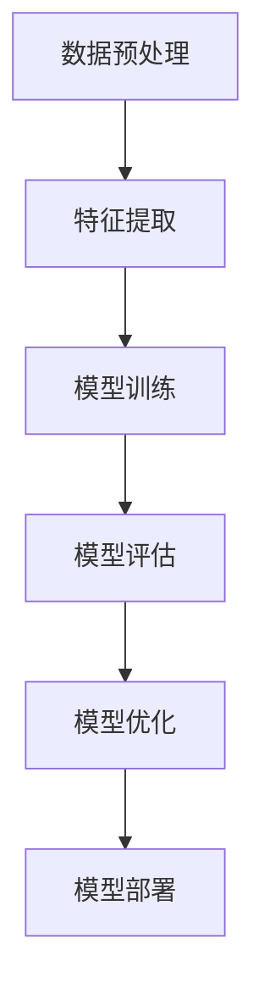
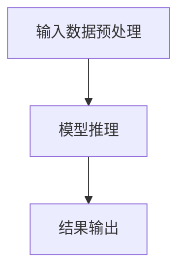
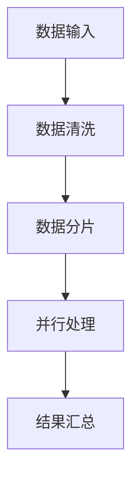
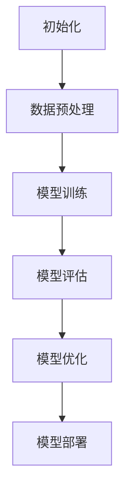

                 

### 引言

#### 第1章: 引言

##### 1.1 问题背景

随着人工智能技术的迅猛发展，传统机器学习模型在处理大量数据、实现复杂任务方面已经取得了显著成果。然而，在现实应用中，许多问题仍然面临严峻挑战。一方面，现有的机器学习模型通常需要大量的标注数据进行训练，这在数据稀缺或者获取成本高昂的情况下显得尤为不利。另一方面，传统模型在面对未知或者罕见任务时，往往表现不佳，需要重新进行训练，这极大地限制了其应用场景的广泛性。

在这种背景下，Zero-Shot CoT（零样本可转移学习）作为一种新兴的AI学习与推理范式，逐渐引起了广泛关注。Zero-Shot CoT旨在通过少量的样本或者无样本的情况下，实现对未知任务的快速适应和高效推理。这种范式具有如下几个显著特点：

1. **零样本学习**：能够处理从未见过的类别或者任务，无需进行重新训练。
2. **可转移学习**：通过迁移学习机制，将已有知识应用于新任务中，提高学习效率和泛化能力。
3. **适应性**：能够在不断变化的现实环境中，迅速适应新的任务和场景。

这些特点使得Zero-Shot CoT在自动驾驶、医疗诊断、自然语言处理等领域具有广阔的应用前景。然而，实现这一目标并非易事，它涉及到复杂的算法设计、大规模数据处理和高效推理技术等多个方面。

##### 1.2 问题描述

传统AI模型在面对以下问题时表现欠佳：

1. **数据稀缺**：许多实际应用场景中，获取大量标注数据非常困难，传统模型无法有效利用有限的数据进行训练。
2. **稀疏任务**：现实任务往往具有多样性，传统模型需要针对每个具体任务进行专门训练，这极大地限制了其应用范围。
3. **数据不均衡**：在某些领域，数据分布可能非常不均衡，导致模型在训练过程中无法充分学习到所有类别。

这些问题的存在，使得传统AI模型在处理未知或者罕见任务时，往往无法达到预期的效果。而Zero-Shot CoT则试图通过以下几个关键点来解决这些问题：

1. **利用已有知识**：通过迁移学习机制，将已有模型的知识应用于新任务中，提高学习效率和泛化能力。
2. **少量样本学习**：利用零样本学习技术，在仅有少量样本或者无样本的情况下，实现对未知任务的快速适应。
3. **自适应推理**：通过自适应推理技术，使得模型能够在动态变化的场景中，迅速适应新的任务和需求。

##### 1.3 问题解决

Zero-Shot CoT在解决上述问题方面具有显著优势，具体体现在以下几点：

1. **零样本学习**：通过迁移学习和少量样本学习，使得模型能够快速适应未知任务，无需重新训练。
2. **可转移学习**：将已有知识应用于新任务中，提高学习效率和泛化能力，降低数据获取和标注成本。
3. **自适应推理**：通过自适应推理技术，使得模型能够在动态变化的场景中，迅速适应新的任务和需求。

为实现这些目标，Zero-Shot CoT涉及以下核心技术：

1. **数据预处理**：通过数据清洗、数据增强等技术，提高数据质量，为后续学习提供可靠的基础。
2. **模型训练**：采用先进的机器学习算法，如深度学习、强化学习等，构建高效的学习模型。
3. **模型评估**：通过交叉验证、超参数调优等技术，评估模型性能，确保模型在实际应用中的有效性。
4. **模型优化**：针对具体应用场景，对模型进行优化，提高其在未知任务上的表现。
5. **模型部署**：将训练好的模型部署到实际应用中，实现实时推理和快速响应。

##### 1.4 边界与外延

尽管Zero-Shot CoT具有诸多优势，但它仍然存在一些边界和局限性：

1. **数据依赖**：尽管零样本学习可以减少对标注数据的依赖，但仍然需要一定的先验知识或相关领域的训练数据。
2. **任务适应性**：Zero-Shot CoT在不同任务上的适应性可能存在差异，需要根据具体任务进行调整和优化。
3. **推理效率**：在处理高维数据和复杂任务时，Zero-Shot CoT的推理效率可能受到影响，需要进一步优化算法。

此外，Zero-Shot CoT与其他AI技术如迁移学习、生成对抗网络（GAN）等存在一定的区别和联系。迁移学习主要关注如何将已有模型的知识应用于新任务中，而Zero-Shot CoT则更注重在少量样本或者无样本的情况下，实现快速适应和高效推理。生成对抗网络（GAN）则侧重于生成高逼真的数据，以辅助模型训练。这些技术的结合，有望进一步提升AI系统的整体性能和应用效果。

##### 1.5 概念结构与核心要素组成

Zero-Shot CoT的核心要素主要包括以下几个方面：

1. **AI即时学习**：通过实时学习机制，使得模型能够快速适应新任务和变化环境。
2. **AI推理技术**：采用高效推理算法，实现快速、准确的实时推理。
3. **大规模数据处理**：利用分布式计算和并行处理技术，高效处理海量数据。

这些核心要素相互关联，共同构成了Zero-Shot CoT的技术体系。通过这一体系，AI系统能够在多样化、动态变化的场景中，实现高效、可靠的智能推理和决策。

##### 1.6 本章小结

本章介绍了Zero-Shot CoT的背景、问题和解决方法，探讨了其核心概念、关键技术及其应用边界。通过对传统AI模型局限性的分析，我们明确了Zero-Shot CoT在零样本学习、可转移学习和自适应推理等方面的优势。在后续章节中，我们将进一步深入探讨Zero-Shot CoT的核心概念与联系，以及其具体的算法原理和实现方法。希望读者能够通过本章的介绍，对Zero-Shot CoT有一个全面而深入的认识。

### 核心概念与联系

#### 第2章: 核心概念与联系

##### 2.1 AI即时学习原理

##### 2.1.1 算法原理

AI即时学习（Instant Learning）是一种能够在短时间内快速适应新环境和任务的机器学习技术。其核心思想是通过实时学习机制，将新获取的知识迅速融入到已有模型中，从而提高模型在未知任务上的表现。以下是AI即时学习的基本算法原理：

1. **数据预处理**：首先，对收集到的数据进行清洗、预处理，确保数据的质量和一致性。这通常包括去除噪声、填补缺失值、归一化等操作。

2. **特征提取**：从预处理后的数据中提取关键特征，这些特征应能够有效表示数据的信息，为后续的学习过程提供支持。

3. **模型训练**：利用已有的模型架构，结合提取出的特征，进行模型训练。即时学习算法通常采用动态调整模型参数的方式，以适应新的数据和学习任务。

4. **模型评估**：通过交叉验证、性能指标评估等方法，评估模型在训练数据上的表现，以及在新任务上的适应性。

5. **模型优化**：根据评估结果，对模型进行优化调整，提高模型在未知任务上的表现。这可能包括调整模型结构、优化训练算法等。

6. **模型部署**：将训练好的模型部署到实际应用场景中，实现实时推理和快速响应。

以下是一个使用Mermaid绘制的AI即时学习算法流程图：



##### 2.1.2 概念属性特征对比表格

| 概念      | 特征                                  |
|-----------|-------------------------------------|
| 即时学习  | 快速适应新环境、实时响应             |
| 传统学习  | 需要长时间训练、适应能力较弱         |

##### 2.1.3 AI即时学习的数学模型和公式

AI即时学习的核心在于动态调整模型参数，使其能够更好地适应新的数据和任务。以下是即时学习的数学模型和公式：

$$
Y = f(X; \theta)
$$

其中，$Y$ 表示输出结果，$X$ 表示输入数据，$\theta$ 表示模型参数，$f$ 表示激活函数。在即时学习中，$\theta$ 会根据新数据实时调整，以优化模型性能。

##### 2.2 AI推理技术

##### 2.2.1 算法原理

AI推理技术（AI Inference）是指将训练好的模型应用于新的输入数据，以预测输出结果的过程。它是机器学习应用中至关重要的一环，决定了模型在实际场景中的性能和效率。以下是AI推理技术的基本算法原理：

1. **输入数据预处理**：将新的输入数据进行预处理，使其符合模型输入要求。这通常包括数据归一化、特征提取等操作。

2. **模型推理**：将预处理后的数据输入到训练好的模型中，通过模型的参数和架构进行推理计算，生成预测结果。

3. **结果输出**：将模型推理的结果输出，包括分类结果、概率分布等。这些结果可以用于实际决策和任务执行。

4. **性能评估**：对推理结果进行评估，包括准确性、召回率、F1分数等指标，以评估模型在未知任务上的表现。

以下是一个使用Mermaid绘制的AI推理技术算法流程图：



##### 2.2.2 概念属性特征对比表格

| 概念      | 特征                                  |
|-----------|-------------------------------------|
| 推理      | 高效、准确、实时响应                 |
| 实例学习  | 需要大量训练数据、适应能力有限       |

##### 2.2.3 AI推理技术的数学模型和公式

在AI推理技术中，常见的数学模型和公式如下：

$$
P(Y|X) = \frac{e^{f(X; \theta)}}{\sum_{i=1}^{n} e^{f(X_i; \theta)}}
$$

其中，$P(Y|X)$ 表示在输入数据$X$下输出结果$Y$的概率，$f$ 表示激活函数，$\theta$ 表示模型参数。这个公式用于计算模型对输入数据的分类概率，是推理过程中常用的指标。

##### 2.3 大规模数据处理

##### 2.3.1 算法原理

大规模数据处理（Big Data Processing）是指对海量数据进行高效处理的计算技术和方法。在人工智能领域，大规模数据处理尤为重要，因为机器学习模型的训练和推理通常需要处理大量数据。以下是大规模数据处理的基本算法原理：

1. **数据输入**：将大量数据输入到系统中，这通常涉及数据的存储、读取和加载等操作。

2. **数据清洗**：对输入的数据进行清洗，去除噪声、填补缺失值、标准化等操作，以提高数据质量。

3. **数据分片**：将大规模数据分成多个小片，以便在多台机器上进行并行处理。

4. **并行处理**：利用分布式计算框架（如Hadoop、Spark等），将数据分片并行处理，提高处理速度。

5. **结果汇总**：将并行处理的结果进行汇总，得到最终的输出结果。

以下是一个使用Mermaid绘制的并行处理算法流程图：



##### 2.3.2 概念属性特征对比表格

| 概念      | 特征                                  |
|-----------|-------------------------------------|
| 大规模数据处理 | 高效、可靠、可扩展                   |
| 传统数据处理 | 低效、易出错、难以扩展               |

##### 2.3.3 大规模数据处理的数学模型和公式

大规模数据处理的数学模型和公式通常涉及到分布式计算框架中的Map-Reduce模型，其基本公式如下：

$$
\text{Map-Reduce} = \{ \text{Map}(\text{key}, \text{value}) \rightarrow \text{intermediate key}, \text{value} \}, \text{Reduce}(\text{intermediate key}, \text{list of values}) \rightarrow \text{output key}, \text{value} \}
$$

其中，Map函数负责将输入数据映射为中间键值对，Reduce函数负责对中间键值对进行聚合和计算，以生成最终的输出结果。这个模型是分布式计算框架的核心，能够高效处理大规模数据。

##### 2.4 本章小结

本章介绍了AI即时学习、AI推理技术和大规模数据处理三个核心概念及其算法原理。通过对这些核心概念的深入探讨，我们了解了即时学习如何在短时间内快速适应新任务，推理技术如何高效准确地预测结果，以及大规模数据处理如何高效处理海量数据。这些核心概念相互联系，共同构成了Zero-Shot CoT的技术体系，为AI系统在未知任务上的快速适应和高效推理提供了有力支持。在后续章节中，我们将进一步探讨这些核心概念的实现方法和应用场景。

### 算法原理讲解

#### 第3章: 算法原理讲解

##### 3.1 AI即时学习算法原理

AI即时学习（Instant Learning）是一种能够在短时间内快速适应新环境和任务的机器学习技术。其核心在于通过动态调整模型参数，实现快速学习与更新。以下是AI即时学习的详细算法原理：

##### 3.1.1 算法流程图

首先，我们使用Mermaid绘制AI即时学习的算法流程图：



在算法流程图中，各个步骤的具体含义如下：

1. **初始化**：初始化模型参数，包括权重、偏置等。
2. **数据预处理**：对输入数据执行清洗、归一化等操作，确保数据质量。
3. **模型训练**：使用预处理后的数据训练模型，动态调整模型参数。
4. **模型评估**：通过评估指标（如损失函数、准确率等）评估模型性能。
5. **模型优化**：根据评估结果对模型进行优化，调整参数以提高性能。
6. **模型部署**：将优化后的模型部署到实际应用场景中，实现实时推理。

##### 3.1.2 Python源代码实现

下面，我们通过Python代码实现AI即时学习算法的基本流程：

```python
import numpy as np

# 初始化模型参数
weights = np.random.randn(n_features, n_classes)
bias = np.random.randn(n_classes)

# 数据预处理
def preprocess_data(data):
    # 实现数据清洗、归一化等操作
    return normalized_data

# 模型训练
def train_model(data, labels):
    # 实现模型训练过程
    # 使用梯度下降算法调整参数
    gradients = compute_gradients(data, labels, weights, bias)
    weights -= learning_rate * gradients[0]
    bias -= learning_rate * gradients[1]

# 模型评估
def evaluate_model(data, labels):
    # 实现模型评估过程
    predictions = model_predict(data, weights, bias)
    accuracy = compute_accuracy(predictions, labels)
    return accuracy

# 模型优化
def optimize_model(data, labels):
    # 实现模型优化过程
    accuracy = evaluate_model(data, labels)
    if accuracy < desired_accuracy:
        train_model(data, labels)
    else:
        print("模型已优化")

# 模型部署
def deploy_model(data):
    # 实现模型部署过程
    predictions = model_predict(data, weights, bias)
    return predictions
```

在这个示例中，`compute_gradients`、`model_predict`和`compute_accuracy`是辅助函数，用于计算梯度、生成预测结果和评估准确率。

##### 3.1.3 数学模型和公式

AI即时学习的核心在于动态调整模型参数，使其适应新数据和任务。以下是相关的数学模型和公式：

$$
Y = f(X; \theta)
$$

其中，$Y$ 表示输出结果，$X$ 表示输入数据，$\theta$ 表示模型参数，$f$ 表示激活函数。在即时学习中，$\theta$ 会根据新数据实时调整。

为了优化模型参数，通常使用梯度下降算法：

$$
\theta_{\text{new}} = \theta_{\text{old}} - \alpha \cdot \nabla_{\theta} L(\theta)
$$

其中，$\alpha$ 是学习率，$L(\theta)$ 是损失函数，$\nabla_{\theta} L(\theta)$ 表示损失函数关于参数$\theta$的梯度。

##### 3.1.4 举例说明

假设我们有一个简单的线性回归模型，输入特征是$x_1$和$x_2$，输出目标是$y$。我们希望通过少量的训练样本来调整模型的参数。

1. **初始化参数**：设$w_1 = 0.1$，$w_2 = 0.2$，$b = 0.3$。
2. **输入数据**：$\text{data} = \{ (x_1, x_2), (x_1', x_2') \}$，$\text{labels} = \{ y, y' \}$。
3. **模型训练**：使用梯度下降算法，每次迭代更新参数。

假设迭代次数为100次，学习率为0.01，损失函数为均方误差（MSE）。

每次迭代的更新公式如下：

$$
w_1 = w_1 - \alpha \cdot \frac{1}{n} \sum_{i=1}^{n} (y_i - (w_1 \cdot x_{1i} + w_2 \cdot x_{2i} + b))^2 \cdot x_{1i}
$$

$$
w_2 = w_2 - \alpha \cdot \frac{1}{n} \sum_{i=1}^{n} (y_i - (w_1 \cdot x_{1i} + w_2 \cdot x_{2i} + b))^2 \cdot x_{2i}
$$

$$
b = b - \alpha \cdot \frac{1}{n} \sum_{i=1}^{n} (y_i - (w_1 \cdot x_{1i} + w_2 \cdot x_{2i} + b))
$$

经过多次迭代后，模型参数会逐渐收敛，达到最小损失。

##### 3.1.5 本章小结

本章详细介绍了AI即时学习的算法原理，包括初始化、数据预处理、模型训练、模型评估、模型优化和模型部署等步骤。通过Python源代码实现和数学公式解释，我们了解了即时学习的具体实现方法。举例说明部分展示了如何通过少量的训练样本来调整模型参数，实现快速适应新任务。在后续章节中，我们将继续探讨AI推理技术和大规模数据处理的算法原理。希望读者能够通过本章的内容，对AI即时学习有一个全面而深入的理解。

