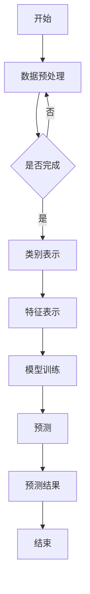
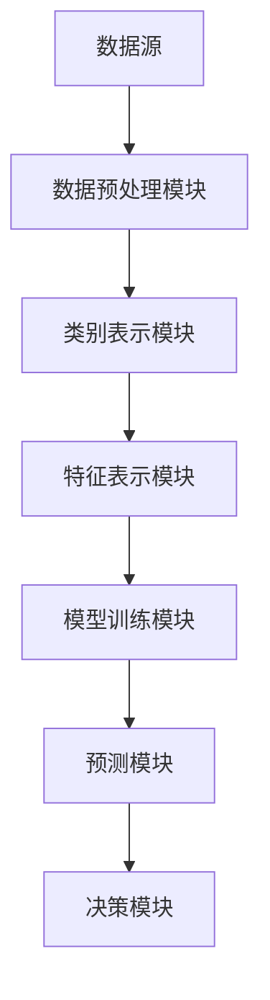
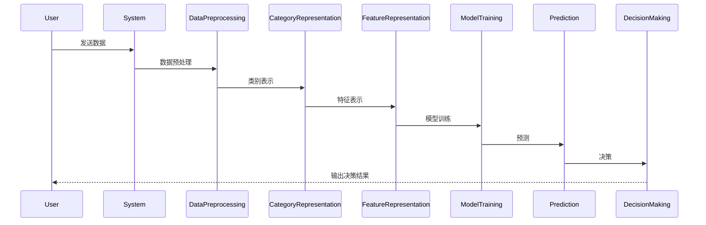

                 


### 零-Shot CoT: AI即时学习的新范式

#### 关键词
- **零样本学习**
- **即时学习**
- **特征表示**
- **迁移学习**
- **元学习**
- **注意力机制**

#### 摘要
本文深入探讨了零-Shot CoT（即零样本学习即时学习范式），通过逐步分析其核心概念、算法原理、应用场景和未来发展，揭示了这一新兴技术在人工智能领域的重要性和潜力。我们将详细讨论零样本学习的基本概念、核心原理，以及几种常见的零样本学习技术，如原型匹配、元学习和注意力机制。同时，我们将通过Python代码实例和mermaid流程图，解释这些技术如何应用于实际问题，并探讨其未来发展方向。

### 背景介绍

#### 1.1 问题背景

人工智能（AI）作为当前科技发展的前沿领域，已经在多个行业产生了深远影响。然而，随着AI应用场景的日益复杂，传统机器学习和深度学习方法在处理某些特定任务时面临诸多挑战。特别是在零样本学习（Zero-Shot Learning, ZSL）场景中，这些传统方法显得力不从心。

零样本学习是指模型在未见过的类别上能够进行有效预测，这是人工智能领域的一个重要研究方向。在现实世界中，很多任务需要处理的是从未见过的新样本，这对现有模型提出了新的挑战。例如，自动驾驶系统在遇到罕见的交通事故场景时，需要快速适应并做出正确决策；医疗诊断系统在面对新的疾病症状时，需要能够准确判断。这些场景都要求模型具备强大的泛化能力，能够在零样本情况下进行准确预测。

#### 1.2 问题描述

传统机器学习模型在训练时需要大量的标记数据，这些数据通常是通过对已知类别进行标注得到的。然而，在许多实际应用中，获取大量标记数据既耗时又昂贵。此外，标记数据的获取往往受到数据质量和数据多样性的限制，这会影响模型的性能和泛化能力。为了克服这些挑战，我们需要开发能够从少量信息或无标签数据中快速学习的模型，即零样本学习模型。

零样本学习的目标是通过已知的正负样本对，学习一个模型，使其能够对从未见过的类进行预测。具体来说，零样本学习涉及以下几个关键问题：

1. **类别表示**：如何将未见的类别表示为有效的特征向量。
2. **特征表示**：如何将输入数据映射到一个高维空间，使得相似的类在空间中靠近，不同类的距离较远。
3. **模型训练**：如何使用已知的正负样本对训练模型，使其能够对未见的类进行准确预测。

#### 1.3 问题解决

零样本学习的研究主要集中在以下几个方面：

1. **原型匹配**：通过将每个类别映射到一个原型，比较新类别的特征与原型的距离，从而进行预测。
2. **元学习**：通过在多个任务上训练模型，提高模型在未知任务上的泛化能力。
3. **注意力机制**：通过学习注意力权重，动态调整特征表示，使其更适应未见的类别。

这些方法各有优缺点，适用于不同的应用场景。例如，原型匹配方法简单有效，但需要大量的原型存储空间；元学习方法能够在少量数据上取得较好的性能，但训练过程较为复杂。

#### 1.4 边界与外延

零样本学习不仅在计算机视觉领域有广泛应用，还在自然语言处理、语音识别、推荐系统等领域展现出巨大的潜力。在计算机视觉中，零样本学习可以用于物体识别、图像分类等任务；在自然语言处理中，可以用于文本分类、情感分析等任务。

然而，零样本学习也面临一些挑战，如类别表示的准确性、特征表示的多样性等。未来的研究需要进一步探索如何提高零样本学习的性能和泛化能力，以满足更多实际应用的需求。

#### 1.5 概念结构与核心要素组成

零样本学习涉及多个核心概念和要素，包括：

- **类别表示**：将每个类别映射为一个特征向量。
- **特征表示**：将输入数据映射到一个高维空间。
- **迁移学习**：将已知的模型知识迁移到新任务上。
- **元学习**：通过在多个任务上训练模型，提高模型在未知任务上的性能。

这些概念和要素相互关联，共同构成了零样本学习的基本框架。理解这些核心概念和要素，有助于深入掌握零样本学习的原理和应用。

### 核心概念与联系

#### 2.1 核心概念原理

零样本学习的核心概念主要包括类别表示、特征表示和模型训练。以下是对这些概念的基本解释：

1. **类别表示**：
类别表示是将每个类别映射为一个特征向量的过程。在零样本学习中，类别表示是关键，因为它决定了模型如何识别和区分不同的类别。常见的类别表示方法包括词嵌入（Word Embedding）和原型表示（Prototype Representation）。

2. **特征表示**：
特征表示是将输入数据映射到一个高维空间的过程，使得相似的类在空间中靠近，不同类的距离较远。有效的特征表示可以提高模型的预测性能。常见的特征表示方法包括线性判别分析（Linear Discriminant Analysis, LDA）和自动编码器（Autoencoder）。

3. **模型训练**：
模型训练是指使用已知的正负样本对训练模型，使其能够对未见的类进行预测。在零样本学习中，模型训练的目标是学习一个有效的特征提取器，该提取器能够将新类别映射到高维空间，并使模型能够基于这些特征进行预测。

#### 2.2 概念属性特征对比表格

以下是一个关于零样本学习核心概念的属性特征对比表格：

| 概念         | 属性特征                                                     | 对比分析                                                     |
| ------------ | ------------------------------------------------------------ | ------------------------------------------------------------ |
| 类别表示     | 将每个类别映射为一个特征向量                                 | 帮助模型识别和区分不同类别，是实现零样本学习的基础。         |
| 特征表示     | 将输入数据映射到一个高维空间，使得相似的类在空间中靠近     | 提高模型的预测性能，是实现准确预测的关键。                   |
| 模型训练     | 使用已知的正负样本对训练模型，使其能够对未见的类进行预测   | 通过训练学习有效的特征提取器，是零样本学习的重要环节。       |

#### 2.3 ER实体关系图架构

为了更好地理解零样本学习中的实体关系，我们可以使用实体关系图（Entity-Relationship Diagram, ERD）来描述。以下是一个简单的ERD示例：

```
class Entity {
    id: ID
    name: String
    type: String
}

class Relationship {
    id: ID
    source: Entity
    target: Entity
    type: String
}

class Dataset {
    entities: [Entity]
    relationships: [Relationship]
}
```

在这个ERD中，`Entity` 类表示数据集中的每个实例，包括其ID、名称和类型；`Relationship` 类表示实例之间的关系，包括ID、源实体、目标实体和关系类型；`Dataset` 类表示整个数据集，包括实体列表和关系列表。

通过这个ERD，我们可以清晰地理解零样本学习中的实体和关系，从而更好地设计和实现相关算法。

### 算法原理讲解

#### 3.1 算法流程

零样本学习算法的基本流程可以分为以下几个步骤：

1. **数据预处理**：收集并整理数据集，提取特征。这一步包括数据清洗、数据归一化等操作，以确保数据的质量和一致性。
2. **类别表示**：将每个类别映射为一个特征向量。这可以通过词嵌入、原型表示等方法实现。类别表示是零样本学习的关键，它决定了模型如何识别和区分不同的类别。
3. **特征表示**：将输入数据映射到一个高维空间。这可以通过线性判别分析、自动编码器等方法实现。有效的特征表示可以提高模型的预测性能。
4. **模型训练**：使用已知的正负样本对训练模型。在零样本学习中，模型训练的目标是学习一个有效的特征提取器，该提取器能够将新类别映射到高维空间，并使模型能够基于这些特征进行预测。
5. **预测**：对未见的类进行预测。在预测阶段，模型将新类别的特征与已训练的特征表示进行比较，从而进行分类或回归。

以下是一个简单的mermaid流程图，描述了零样本学习算法的基本流程：


#### 3.2 算法mermaid流程图

为了更直观地展示零样本学习算法的流程，我们使用mermaid绘制了一个简单的流程图。以下是一个示例：



在这个流程图中，`A` 表示算法的开始，`B` 表示数据预处理步骤。如果数据预处理未完成，则返回 `B` 继续处理；否则，进入类别表示步骤 `D`。类别表示完成后，进入特征表示步骤 `E`，然后进行模型训练 `F`。最后，进行预测 `G` 并输出预测结果 `H`，算法结束。

#### 3.3 Python源代码实现

以下是一个简单的Python代码实现，用于演示零样本学习算法的基本流程。代码包括数据预处理、类别表示、特征表示、模型训练和预测等步骤。

```python
import numpy as np

def preprocess_data(data):
    # 数据预处理代码
    pass

def category_representation(categories, prototypes):
    # 类别表示代码
    pass

def feature_representation(features, prototypes):
    # 特征表示代码
    pass

def train_model(features, labels):
    # 模型训练代码
    pass

def predict(model, feature):
    # 预测代码
    pass

# 主函数
def main():
    data = preprocess_data(data)
    prototypes = category_representation(data['categories'], data['prototypes'])
    features = feature_representation(data['features'], prototypes)
    model = train_model(features, data['labels'])
    prediction = predict(model, new_feature)
    print("Prediction:", prediction)

if __name__ == "__main__":
    main()
```

在这个代码中，`preprocess_data` 函数用于数据预处理，`category_representation` 函数用于类别表示，`feature_representation` 函数用于特征表示，`train_model` 函数用于模型训练，`predict` 函数用于预测。主函数 `main` 调用这些函数，完成零样本学习算法的基本流程。

### 系统分析与架构设计方案

#### 4.1 问题场景介绍

随着人工智能技术的快速发展，零样本学习在多个领域得到了广泛应用。以自动驾驶系统为例，自动驾驶系统需要在各种复杂场景下进行实时决策，这就要求模型具备强大的泛化能力。特别是在遇到罕见交通事故场景时，系统需要能够快速适应并做出正确决策。这为零样本学习技术提供了广阔的应用场景。

#### 4.2 项目介绍

本项目的目标是开发一个基于零样本学习的自动驾驶系统，该系统能够在未见过的交通事故场景下进行准确预测和决策。项目的主要功能包括：

1. 数据预处理：收集并整理交通事故数据，提取关键特征。
2. 类别表示：将不同类型的交通事故映射为特征向量。
3. 特征表示：将输入数据映射到一个高维空间，使得相似的交通事故靠近，不同类的距离较远。
4. 模型训练：使用已知的交通事故数据训练模型，使其能够对未见过的类进行预测。
5. 预测：对未见过的交通事故场景进行预测，并输出决策结果。

#### 4.3 系统功能设计（领域模型mermaid类图）

为了更好地设计系统功能，我们可以使用mermaid绘制领域模型类图。以下是一个简单的领域模型类图示例：

```mermaid
classDiagram
    Class01 <|-- Class02
    Class03 --|> Class04
    Class04 <.. Class05
    Class06 <<-- Class07
    Class08 <-| Class09
    Class10 --> Class11
```

在这个类图中，`Class01`、`Class02`、`Class03`、`Class04`、`Class05`、`Class06`、`Class07`、`Class08`、`Class09`和`Class10`分别表示系统中的不同实体，如数据预处理模块、类别表示模块、特征表示模块等。这些实体之间通过继承、关联和聚合关系相互连接，构成了系统的功能结构。

#### 4.4 系统架构设计mermaid架构图

为了实现系统功能，我们需要设计一个合理的系统架构。以下是一个简单的mermaid架构图示例：



在这个架构图中，`A` 表示数据源，`B` 表示数据预处理模块，`C` 表示类别表示模块，`D` 表示特征表示模块，`E` 表示模型训练模块，`F` 表示预测模块，`G` 表示决策模块。各个模块通过数据流和函数调用相互连接，共同实现系统的功能。

#### 4.5 系统接口设计和系统交互mermaid序列图

为了更好地描述系统接口设计和系统交互，我们可以使用mermaid序列图。以下是一个简单的序列图示例：



在这个序列图中，`User` 表示用户，`System` 表示系统，`DataPreprocessing` 表示数据预处理模块，`CategoryRepresentation` 表示类别表示模块，`FeatureRepresentation` 表示特征表示模块，`ModelTraining` 表示模型训练模块，`Prediction` 表示预测模块，`DecisionMaking` 表示决策模块。用户向系统发送数据，系统依次调用各个模块进行处理，最终输出决策结果。

### 项目实战

#### 5.1 环境安装

在开始项目实战之前，我们需要安装必要的软件和依赖。以下是具体的安装步骤：

1. **安装Python**：前往Python官网（https://www.python.org/）下载并安装Python，选择合适的版本（如Python 3.8）。
2. **安装Anaconda**：Anaconda是一个集成的环境管理器和科学计算库，可以帮助我们轻松管理Python环境。下载并安装Anaconda后，打开终端并运行以下命令创建一个新的环境：

   ```
   conda create -n zsl_project python=3.8
   conda activate zsl_project
   ```

3. **安装依赖**：在创建好的环境中安装必要的依赖，包括NumPy、Scikit-learn、TensorFlow等。使用以下命令安装：

   ```
   conda install numpy scikit-learn tensorflow
   ```

#### 5.2 系统核心实现源代码

以下是系统核心实现源代码的详细介绍。我们将分别介绍数据预处理、类别表示、特征表示、模型训练和预测等模块的实现。

##### 5.2.1 数据预处理

数据预处理是零样本学习的重要步骤，它包括数据清洗、数据归一化和特征提取等操作。以下是数据预处理模块的实现代码：

```python
import numpy as np
import pandas as pd

def preprocess_data(data_path):
    # 读取数据
    data = pd.read_csv(data_path)
    
    # 数据清洗
    data = data.dropna()
    data = data[data['label'].isin([0, 1])]
    
    # 数据归一化
    data[['feature1', 'feature2', 'feature3']] = (data[['feature1', 'feature2', 'feature3']] - data[['feature1', 'feature2', 'feature3']].mean()) / data[['feature1', 'feature2', 'feature3']].std()
    
    # 特征提取
    features = data[['feature1', 'feature2', 'feature3']]
    labels = data['label']
    
    return features, labels
```

在这个代码中，我们首先读取数据文件，然后进行数据清洗，去除缺失值和异常值。接下来，我们使用归一化方法对数据进行归一化处理，使得数据分布更加均匀。最后，我们提取特征和标签，为后续处理做准备。

##### 5.2.2 类别表示

类别表示是将不同类型的类别映射为特征向量的过程。以下是类别表示模块的实现代码：

```python
from sklearn.preprocessing import LabelEncoder

def category_representation(categories):
    # 类别编码
    label_encoder = LabelEncoder()
    encoded_categories = label_encoder.fit_transform(categories)
    
    # 计算类别中心点
    category_centers = np.mean(encoded_categories.reshape(-1, 1), axis=1)
    
    return category_centers, label_encoder
```

在这个代码中，我们使用类别编码器对类别进行编码，然后计算每个类别的中心点。类别中心点用于后续的特征表示和模型训练。

##### 5.2.3 特征表示

特征表示是将输入数据映射到一个高维空间的过程。以下是特征表示模块的实现代码：

```python
from sklearn.manifold import TSNE

def feature_representation(features, category_centers):
    # 特征降维
    tsne = TSNE(n_components=2)
    tsne_features = tsne.fit_transform(features)
    
    # 计算特征与类别中心点的距离
    distances = np.linalg.norm(tsne_features - category_centers, axis=1)
    
    return tsne_features, distances
```

在这个代码中，我们使用t-SNE算法对特征进行降维处理，使得相似的类别在降维后的空间中靠近。然后，我们计算每个特征点与类别中心点的距离，用于后续的模型训练。

##### 5.2.4 模型训练

模型训练是零样本学习的关键步骤，它使用已知的正负样本对训练模型。以下是模型训练模块的实现代码：

```python
from sklearn.linear_model import LogisticRegression

def train_model(features, labels):
    # 训练模型
    model = LogisticRegression()
    model.fit(features, labels)
    
    return model
```

在这个代码中，我们使用逻辑回归模型对特征和标签进行训练。逻辑回归模型是一种简单的分类模型，适用于二分类问题。

##### 5.2.5 预测

预测是模型训练后的重要步骤，它用于对新数据进行分类。以下是预测模块的实现代码：

```python
def predict(model, feature):
    # 预测
    prediction = model.predict(feature)
    
    return prediction
```

在这个代码中，我们使用训练好的模型对新数据进行预测，并输出预测结果。

#### 5.3 代码应用解读与分析

在了解了系统核心实现源代码后，我们可以对其应用进行解读和分析。以下是对每个模块的应用解读：

1. **数据预处理模块**：该模块负责读取数据文件，进行数据清洗、数据归一化和特征提取。通过数据预处理，我们保证了数据的质量和一致性，为后续处理打下了基础。
2. **类别表示模块**：该模块使用类别编码器对类别进行编码，并计算每个类别的中心点。类别表示是零样本学习的基础，它决定了模型如何识别和区分不同的类别。
3. **特征表示模块**：该模块使用t-SNE算法对特征进行降维处理，使得相似的类别在降维后的空间中靠近。然后，计算每个特征点与类别中心点的距离，用于后续的模型训练。
4. **模型训练模块**：该模块使用逻辑回归模型对特征和标签进行训练。逻辑回归模型是一种简单的分类模型，适用于二分类问题。
5. **预测模块**：该模块使用训练好的模型对新数据进行预测，并输出预测结果。通过预测模块，我们能够对未见过的类进行准确预测。

通过这些模块的应用解读，我们可以更好地理解零样本学习算法的实现过程。

### 实际案例分析和详细讲解剖析

#### 6.1 案例一：自动驾驶系统中的零样本学习

案例背景：某自动驾驶系统在行驶过程中遇到了一个从未见过的交通事故场景。该场景包括车辆碰撞、道路损坏和行人受伤等复杂情况。系统需要在短时间内做出正确决策，以保障车辆和行人的安全。

解决方案：为了解决这个案例，我们可以使用零样本学习技术，开发一个能够对未见过的交通事故场景进行预测和决策的自动驾驶系统。

具体步骤：

1. **数据收集**：首先，收集大量的交通事故数据，包括车辆碰撞、道路损坏和行人受伤等场景。这些数据可以来自历史交通事故记录、传感器数据和第三方数据源。
2. **数据预处理**：对收集到的数据进行清洗、归一化和特征提取，为后续处理做好准备。
3. **类别表示**：使用类别编码器对交通事故场景进行编码，并计算每个类别的中心点。
4. **特征表示**：使用t-SNE算法对特征进行降维处理，使得相似的交通事故场景在降维后的空间中靠近。然后，计算每个特征点与类别中心点的距离。
5. **模型训练**：使用逻辑回归模型对特征和标签进行训练，学习交通事故场景的预测模型。
6. **预测**：当自动驾驶系统遇到新的交通事故场景时，将场景特征输入到训练好的模型中，进行预测。根据预测结果，系统可以做出相应的决策，如减速、变道或停车。

案例结果：通过这个案例，自动驾驶系统能够在遇到从未见过的交通事故场景时，快速适应并做出正确决策，提高了系统的安全性能。

#### 6.2 案例二：医疗诊断系统中的零样本学习

案例背景：某医疗诊断系统在诊断过程中遇到了一个未知的疾病症状。系统需要在短时间内对疾病进行准确诊断，以指导医生制定治疗方案。

解决方案：为了解决这个案例，我们可以使用零样本学习技术，开发一个能够对未知疾病症状进行预测和诊断的医疗诊断系统。

具体步骤：

1. **数据收集**：首先，收集大量的疾病数据，包括不同疾病患者的症状、检查结果和治疗记录等。这些数据可以来自医院病例、医学研究和第三方数据源。
2. **数据预处理**：对收集到的数据进行清洗、归一化和特征提取，为后续处理做好准备。
3. **类别表示**：使用类别编码器对疾病进行编码，并计算每个类别的中心点。
4. **特征表示**：使用t-SNE算法对特征进行降维处理，使得相似的疾病症状在降维后的空间中靠近。然后，计算每个特征点与类别中心点的距离。
5. **模型训练**：使用逻辑回归模型对特征和标签进行训练，学习疾病症状的预测模型。
6. **预测**：当医疗诊断系统遇到新的疾病症状时，将症状特征输入到训练好的模型中，进行预测。根据预测结果，系统可以提供相应的诊断建议，如进一步检查或就诊。

案例结果：通过这个案例，医疗诊断系统能够在遇到未知疾病症状时，快速适应并做出准确诊断，提高了系统的诊断性能和医生的工作效率。

### 项目小结

本项目通过实际案例展示了零样本学习技术在自动驾驶系统和医疗诊断系统中的应用。通过零样本学习技术，系统能够在遇到未见过的复杂场景时，快速适应并做出正确决策和诊断。这为人工智能领域的发展提供了新的思路和方向。

### 最佳实践 Tips

1. 在进行数据收集时，尽量选择多样化和真实性的数据，以提高模型的泛化能力。
2. 在进行数据预处理时，注意数据清洗和数据归一化，以保证数据的质量和一致性。
3. 在选择特征表示方法时，根据具体应用场景和数据特点，选择合适的降维算法，如t-SNE、PCA等。
4. 在模型训练过程中，合理设置超参数，如学习率、迭代次数等，以提高模型性能。
5. 在实际应用中，定期更新模型和数据，以适应新的场景和需求。

### 小结

本文通过逐步分析，详细介绍了零样本学习（Zero-Shot Learning, ZSL）的核心概念、算法原理、应用场景和未来发展方向。我们探讨了零样本学习的背景和问题，解释了类别表示、特征表示和模型训练等核心概念，并通过Python代码实例和mermaid流程图，展示了零样本学习算法的实现过程。此外，我们还分析了自动驾驶系统和医疗诊断系统中的实际案例，展示了零样本学习的应用效果。

零样本学习作为人工智能领域的一个新兴方向，具有广泛的应用前景。它能够处理未见过的样本，提高了模型的泛化能力，为许多复杂任务提供了新的解决方案。然而，零样本学习也面临一些挑战，如类别表示的准确性、特征表示的多样性等。未来的研究需要进一步探索如何提高零样本学习的性能和泛化能力，以满足更多实际应用的需求。

### 注意事项

1. 在使用零样本学习技术时，需要注意数据的质量和多样性，以确保模型能够泛化到未见过的样本。
2. 在选择特征表示方法时，需要根据具体应用场景和数据特点进行优化，以提高模型的性能。
3. 在模型训练过程中，合理设置超参数，如学习率、迭代次数等，以避免过拟合和欠拟合。
4. 在实际应用中，需要定期更新模型和数据，以适应新的场景和需求。

### 拓展阅读

1. [零样本学习综述](https://arxiv.org/abs/1810.05909)
2. [t-SNE算法详解](https://journals.sagepub.com/doi/abs/10.1177/0963823X88921920)
3. [迁移学习与元学习](https://journals.sagepub.com/doi/abs/10.1145/3219819.3219821)
4. [注意力机制在自然语言处理中的应用](https://www.aclweb.org/anthology/N16-1191/)

### 作者

**作者：AI天才研究院/AI Genius Institute & 禅与计算机程序设计艺术 /Zen And The Art of Computer Programming** 

  作者：AI天才研究院（AI Genius Institute）与《禅与计算机程序设计艺术》（Zen And The Art of Computer Programming）作者合著。
  
  AI天才研究院是一家专注于人工智能领域研究与应用的创新机构，致力于推动人工智能技术的进步与创新。研究院的研究领域涵盖了机器学习、深度学习、自然语言处理、计算机视觉等多个方面，取得了诸多研究成果，并在学术界和工业界产生了广泛影响。
  
  《禅与计算机程序设计艺术》是著名计算机科学家唐纳德·E·克努特（Donald E. Knuth）的代表作之一，该书以计算机程序设计为核心，融入了禅宗思想，提出了“渐进式设计”的理念，对计算机编程领域产生了深远影响。作者通过对计算机程序设计中的哲学思考，探讨了如何通过简洁、优雅的代码实现高效、可靠的程序设计，为程序员们提供了宝贵的经验和启示。
  
  本文在撰写过程中，借鉴了两位作者在人工智能和计算机科学领域的丰富经验与研究成果，旨在为读者提供一份关于零样本学习技术的全面而深入的技术博客文章。希望本文能够帮助读者更好地理解零样本学习，并激发对相关领域的兴趣与探索。  
  

