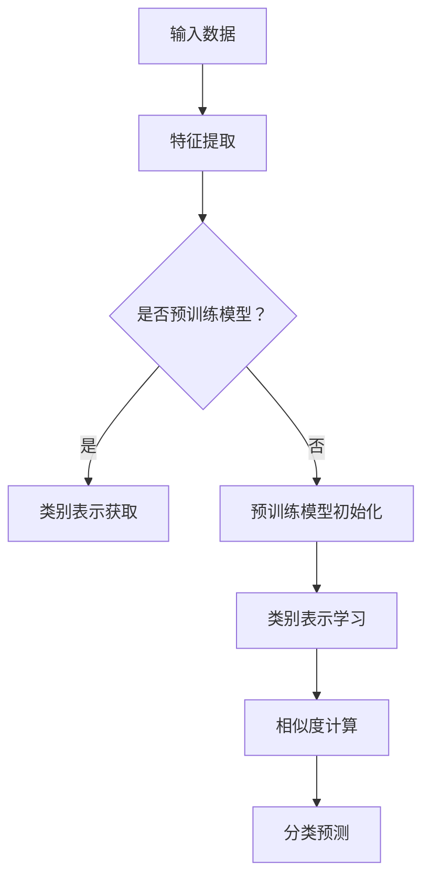
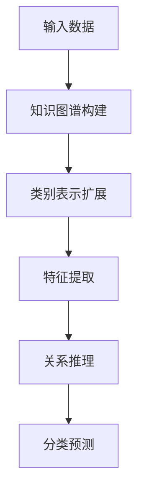
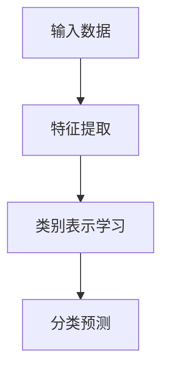
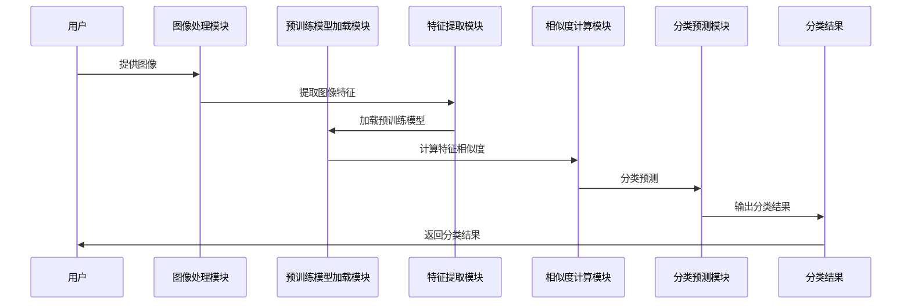
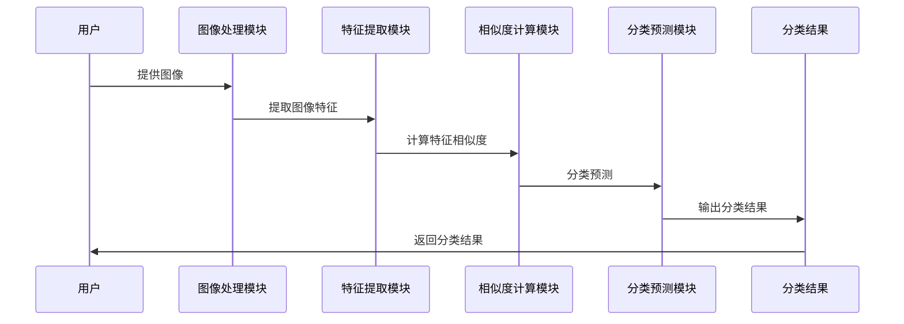
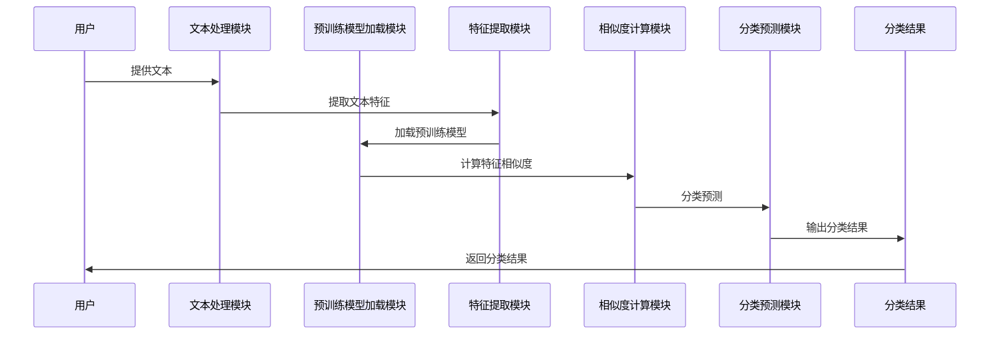
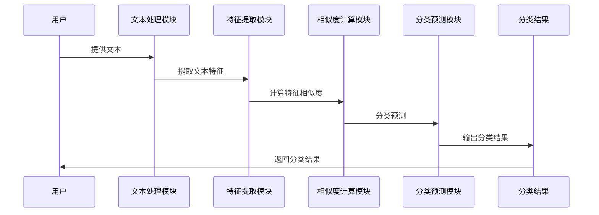

                 

### 1.1 问题背景：AI即时学习的重要性

在当今快速发展的科技时代，人工智能（AI）已经成为了驱动变革的核心力量。随着大数据、云计算和物联网等技术的迅猛发展，AI的应用场景变得愈发广泛，从自动驾驶、智能助手到医疗诊断，AI正在逐步改变着我们的生活方式。然而，随着应用场景的复杂化和多样化，AI系统对实时响应的需求也在不断增长。这就引出了一个关键问题：如何让AI系统具备即时学习能力，以迅速适应新的环境和任务需求？

即时学习能力，即AI系统能够在不经过重新训练或少量样本学习的情况下，快速适应并解决新的任务。传统的机器学习方法通常依赖于大量的训练数据，并且需要较长时间来调整模型参数。这种模式在静态和已知环境下运作良好，但在动态和未知环境中，AI的响应速度和灵活性就显得尤为重要。因此，AI即时学习的重要性不言而喻。

首先，即时学习能够提高AI系统的实时响应能力。例如，在自动驾驶领域，车辆需要实时处理来自传感器的大量数据，并迅速做出驾驶决策。如果AI系统需要经过长时间的训练才能适应新的路况或驾驶环境，那么其响应速度将无法满足实际需求。即时学习能够让AI系统在短时间内快速适应新环境，从而提高系统的可靠性和安全性。

其次，即时学习能够扩展AI系统的应用范围。在医疗领域，即时学习可以帮助诊断系统快速适应新的病例，从而提高诊断的准确性和效率。在教育领域，即时学习可以个性化学习体验，根据学生的实时表现调整教学策略，从而提高教育质量。在金融领域，即时学习可以帮助交易系统快速适应市场变化，提高交易的成功率和收益。

此外，即时学习还能够提高AI系统的自主性。在军事、安全等领域，AI系统需要具备高度的自主决策能力，以应对突发情况。即时学习能够让AI系统在无需人工干预的情况下，快速适应并解决问题，从而提高系统的自主性和应变能力。

总的来说，AI即时学习的重要性体现在其能够提高系统的实时响应能力、扩展应用范围、提高自主性和可靠性。在快速变化和高度复杂的环境中，即时学习成为了一个不可或缺的能力，为AI的发展和应用开辟了新的可能。

### 1.2 问题描述：传统机器学习与即时学习的区别

要深入探讨AI即时学习的重要性，我们首先需要明确即时学习与传统机器学习的区别。传统机器学习依赖于大量的历史数据进行训练，以建立模型，从而对未知数据进行预测或分类。这种方法虽然能够通过反复的训练优化模型参数，但有几个显著的局限性。

首先，传统机器学习对训练数据量的依赖性极高。这意味着，在处理新任务或面对新环境时，系统需要重新收集和标注大量的数据，这个过程既耗时又耗资源。例如，一个用于医疗诊断的AI系统可能需要成千上万的病例数据才能训练出一个准确的模型。然而，当新病例出现时，系统又需要重新进行数据收集和模型训练，这使得其无法快速适应新的变化。

其次，传统机器学习模型的训练时间较长。在数据量大、模型复杂的情况下，训练过程可能需要数小时甚至数天。这不仅影响了系统的实时响应能力，也限制了其应用于动态和实时环境中的潜力。例如，在金融交易中，错过最佳交易时机可能导致巨大损失，而传统机器学习模型往往无法在短时间内做出精确预测。

相比之下，即时学习（Zero-Shot Learning）则具有显著的优势。即时学习旨在使AI系统能够在不依赖大量训练数据的情况下，快速适应并解决新的任务。它主要通过两种方式实现：一是通过预训练模型和转移学习来减少对新数据的依赖，二是通过增量学习或在线学习来动态调整模型。

首先，即时学习能够减少对新数据依赖。通过预训练模型，AI系统可以基于大规模通用数据集（如自然语言处理中的语料库）进行训练，从而建立一个通用的特征提取器。在遇到新任务时，系统只需在预训练模型的基础上微调参数，从而实现对新任务的快速适应。例如，一个预训练的自然语言处理模型可以在不重新训练的情况下，快速处理新的语言任务。

其次，即时学习能够实现动态调整模型。增量学习或在线学习允许AI系统在实时处理数据的同时，不断更新和优化模型。这种方法特别适用于动态环境，如自动驾驶系统中的实时路况分析，或金融交易系统中的市场动态预测。通过实时调整模型，系统可以迅速应对新的变化，提高其响应速度和准确性。

总的来说，传统机器学习与即时学习在应对新任务和动态环境时的区别主要体现在数据依赖、训练时间和模型调整能力上。传统机器学习依赖于大量训练数据和长时间的训练，而即时学习通过预训练模型和动态调整，实现了对新任务的快速适应。这种区别使得即时学习在许多应用场景中具有独特的优势和潜力。

### 1.3 问题解决：即时学习的解决方案

为了解决传统机器学习在应对动态环境和新任务时的局限性，即时学习（Zero-Shot Learning）提供了一系列创新的解决方案。即时学习的核心思想是减少对训练数据的依赖，通过预训练模型和转移学习来提高系统的适应能力。下面，我们将深入探讨即时学习的几种主要解决方案。

首先，预训练模型是即时学习的关键技术之一。预训练模型通过在大规模通用数据集上（如自然语言处理中的语料库或图像识别中的大规模图像集）进行训练，构建一个通用的特征提取器。这种方法的好处是，当遇到新的任务时，系统不需要从头开始训练，而是可以在预训练模型的基础上进行微调。例如，一个预训练的自然语言处理模型可以通过微调参数，快速适应新的语言任务，如问答系统或文本分类任务。

预训练模型的主要实现方法包括以下几种：

1. **词嵌入（Word Embeddings）**：词嵌入是将单词映射到高维向量空间，使得语义相似的词在空间中更接近。例如，通过Word2Vec或GloVe算法，可以在大规模语料库中训练得到词嵌入模型。这种模型在自然语言处理任务中具有广泛的应用，可以在不重新训练的情况下，快速处理新的语言任务。

2. **图像特征提取**：在计算机视觉领域，预训练模型如VGG、ResNet等，通过在ImageNet等大规模图像数据集上训练，提取出具有高度区分度的图像特征。当需要处理新的视觉任务时，可以在这些预训练模型的基础上，进行微调以适应新任务。

3. **多任务学习**：多任务学习通过在一个模型中同时训练多个任务，共享底层特征表示，从而提高模型的泛化能力。这种方法不仅可以减少训练时间，还能提高模型在遇到新任务时的适应性。

其次，转移学习（Transfer Learning）是即时学习的另一种重要方法。转移学习利用预训练模型中的知识，通过在特定任务上的少量数据进一步训练模型，从而实现对新任务的快速适应。转移学习的主要实现步骤包括：

1. **模型初始化**：将预训练模型作为基础模型，用于初始化新任务的模型参数。

2. **微调（Fine-Tuning）**：在新任务的数据集上，对基础模型进行少量的训练，调整模型参数，以适应新任务。微调的过程通常包括冻结部分层（如卷积层）以保留通用特征，仅对特定层的参数进行训练。

3. **增量学习**：增量学习允许模型在实时处理新数据时，不断更新和优化模型参数。这种方法特别适用于动态环境，如自动驾驶系统中的实时路况分析，或金融交易系统中的市场动态预测。

最后，增量学习和在线学习也是即时学习的重要手段。增量学习通过在模型训练过程中，逐渐增加新的数据样本，动态调整模型参数，从而实现对新任务的学习。在线学习则是在实时处理数据的同时，不断更新模型，使其能够迅速适应新的变化。

总的来说，即时学习的解决方案通过预训练模型和转移学习，实现了对传统机器学习的补充和优化。这些方法不仅减少了对新数据的依赖，提高了系统的适应能力，还为AI在动态环境和新任务中的应用提供了广阔的前景。

### 1.4 边界与外延：即时学习的应用领域

即时学习（Zero-Shot Learning）在众多领域展现出了强大的潜力，其应用范围不断扩展，涵盖了图像识别、自然语言处理、医疗诊断、金融预测等多个领域。然而，即时学习并非无所不能，其适用性和局限性也需要我们深入探讨。

首先，在图像识别领域，即时学习已经成为一种重要的研究热点。在传统的图像识别任务中，如分类和检测，模型通常需要大量的标注数据进行训练。而即时学习通过预训练模型和转移学习，可以在几乎没有标注数据的情况下，快速适应新的图像识别任务。例如，在自动驾驶系统中，即时学习可以帮助车辆快速适应不同的路况和环境，从而提高驾驶的智能化水平。然而，即时学习在图像识别中面临的挑战主要包括模型的泛化能力和实时性。虽然预训练模型可以提取通用的图像特征，但在特定场景下，模型的表现可能仍然有限。

其次，自然语言处理是即时学习的重要应用领域之一。自然语言处理中的任务，如文本分类、情感分析和问答系统，往往需要大量的语料库进行训练。即时学习通过预训练的语言模型，如GPT和BERT，可以在没有大量训练数据的情况下，快速适应新的语言任务。例如，在机器翻译中，即时学习可以帮助系统快速适应新的语言对，从而提高翻译的准确性和流畅度。然而，自然语言处理中的即时学习也面临挑战，包括多语言处理、跨领域适应性和实时性。

在医疗诊断领域，即时学习展示了巨大的潜力。传统的医疗诊断系统需要大量的病例数据才能训练出一个准确的模型。而即时学习可以在缺乏标注数据的情况下，快速适应新的病例和诊断任务。例如，即时学习可以帮助医生快速诊断罕见疾病，从而提高诊断的准确性和效率。然而，即时学习在医疗领域的挑战在于数据的隐私保护和模型的解释性。

金融预测是另一个即时学习的重要应用领域。在金融市场中，价格波动和交易行为具有高度的不确定性和动态性。即时学习可以帮助交易系统快速适应市场变化，提高交易的准确性和成功率。例如，在股票交易中，即时学习可以帮助系统快速分析市场数据，及时调整交易策略。然而，金融预测中的即时学习需要处理大量的实时数据，这对模型的计算效率和实时性提出了高要求。

总的来说，即时学习在图像识别、自然语言处理、医疗诊断和金融预测等领域的应用具有广阔的前景。然而，其适用性和局限性也需要我们深入探讨。在具体应用中，需要根据任务的特点和数据情况，选择合适的即时学习方法，并在实际操作中不断优化和调整模型，以实现最佳效果。

### 1.5 概念结构与核心要素组成：即时学习的核心概念和组成部分

即时学习（Zero-Shot Learning）作为AI领域的一项新兴技术，其核心概念和组成部分构成了一个相对复杂但结构清晰的体系。以下是即时学习的核心概念及其组成部分的详细解析。

首先，即时学习的关键概念之一是“零样本学习”。零样本学习的定义是指，在遇到一个完全未见过的类别时，模型能够基于已学习的知识和通用特征，正确地进行预测或分类。这意味着，模型不需要特定类别的训练数据，即可对新类别进行准确的判断。零样本学习克服了传统机器学习对大量标注数据的依赖，提高了模型在动态和未知环境中的适应能力。

零样本学习的主要组成部分包括：

1. **预训练模型**：预训练模型是在大规模通用数据集上训练得到的特征提取器，如自然语言处理中的GPT和BERT，或计算机视觉中的ResNet和VGG。这些模型提取出具有高度区分度的特征表示，为后续的零样本学习提供了基础。

2. **类别无关特征表示**：通过预训练模型，模型能够学习到通用的特征表示，这些特征不依赖于具体类别，具有广泛的适用性。这些类别无关的特征表示是零样本学习成功的关键。

3. **转移学习**：转移学习是将预训练模型的知识应用于新任务的一种方法。具体来说，通过在预训练模型的基础上进行微调，模型可以快速适应新任务，从而实现零样本学习。

4. **增量学习与在线学习**：增量学习和在线学习是在模型训练过程中，逐步增加新数据样本，或实时处理新数据，从而不断更新和优化模型的方法。这种方法特别适用于动态环境，如自动驾驶和金融预测等。

此外，即时学习还包括以下核心概念：

1. **元学习（Meta-Learning）**：元学习是一种通过训练模型来学习如何学习的方法。元学习旨在提高模型对新任务的适应能力，通过快速调整模型参数，实现对新任务的零样本预测。

2. **数据增强**：数据增强是通过各种技术，如数据扩展、数据变换等，增加训练数据的多样性，从而提高模型的泛化能力。数据增强是零样本学习的一个重要补充，可以在有限的数据上，提高模型的性能。

3. **知识图谱**：知识图谱是一种用于表示实体及其关系的图形化模型，它可以用于增强零样本学习的性能。通过知识图谱，模型可以更好地理解和利用领域知识，从而提高对新类别的识别能力。

总之，即时学习的核心概念和组成部分共同构成了一个系统化的技术框架，使其在动态和未知环境中具备强大的适应能力。预训练模型、类别无关特征表示、转移学习、元学习、数据增强和知识图谱等核心概念和组成部分相互作用，共同推动即时学习技术的发展和应用。

### 2.1 核心概念与联系：零样本学习的定义与特点

零样本学习（Zero-Shot Learning, ZSL）作为即时学习的一个重要分支，其定义和特点决定了其在实际应用中的独特优势。零样本学习的核心思想是在遇到一个完全未见过的类别时，模型能够基于已学习的知识和通用特征，正确地进行预测或分类。这一概念打破了传统机器学习对大量标注数据的依赖，使得模型在动态和未知环境中展现出强大的适应能力。

首先，定义方面，零样本学习是指在没有针对特定类别进行训练数据的情况下，模型能够利用通用的特征表示和知识，对新类别进行准确的分类或预测。这与传统的一样本学习（One-Shot Learning）和少量样本学习（Few-Shot Learning）形成了鲜明对比，后者需要针对特定类别进行一定的数据训练。零样本学习的特点主要体现在以下几个方面：

1. **无类别标注数据依赖**：传统机器学习通常需要针对每个类别收集大量的标注数据，而零样本学习则通过预训练模型和类别无关的特征表示，减少了这一依赖。模型可以从大规模通用数据集中提取通用特征，并在遇到新类别时，利用这些特征进行分类或预测。

2. **高泛化能力**：由于零样本学习不依赖特定类别的训练数据，因此模型具备较高的泛化能力，能够处理不同领域、不同任务中的新类别。这使得零样本学习在跨领域应用中具有独特优势。

3. **快速适应能力**：在动态环境中，新类别和新任务的出现是常态。零样本学习通过预训练模型和转移学习，可以在短时间内快速适应新类别，从而提高系统的实时响应能力。

接下来，我们通过一个简单的例子来具体说明零样本学习的应用。假设我们有一个预训练的图像分类模型，该模型已经在大规模图像数据集上训练，提取出了通用的图像特征。现在，我们需要将这个模型应用到一个新的图像分类任务中，例如对猫、狗和鸟这三种动物进行分类。如果我们采用传统的机器学习方法，我们需要收集大量关于猫、狗和鸟的训练图像，并进行标注。然而，在零样本学习的框架下，我们不需要这些具体的训练数据，而是直接利用预训练模型提取的通用图像特征。

具体来说，当遇到一张未见过的鸟的图像时，模型首先会提取这张图像的通用特征向量。然后，模型会利用这些特征向量与预训练模型中的类别表示进行比较，从而判断这张图像属于哪一类。如果预训练模型中已经包含了关于鸟的类别表示，那么模型可以直接利用这些信息进行分类。如果预训练模型中没有关于鸟的类别表示，那么模型会通过比较特征向量与现有类别表示的相似度，进行预测。

通过这个例子，我们可以看到，零样本学习通过预训练模型和类别无关的特征表示，实现了在没有特定类别训练数据的情况下，对新类别进行分类或预测。这不仅提高了系统的适应能力，也降低了数据收集和标注的难度，为AI在动态和未知环境中的应用提供了新的思路和解决方案。

### 2.2 零样本学习的数学模型和公式

在深入理解零样本学习（Zero-Shot Learning, ZSL）的算法原理之前，我们需要先掌握其背后的数学模型和公式。这些数学工具不仅帮助我们更清晰地理解算法的运作机制，还为后续的代码实现和实际应用提供了理论基础。

零样本学习的基本框架通常包括以下步骤：

1. **特征提取**：从输入数据中提取特征向量。在计算机视觉任务中，这通常是通过卷积神经网络（CNN）实现的；在自然语言处理任务中，则可能使用词嵌入（Word Embeddings）或Transformer模型。

2. **类别表示学习**：学习每个类别的特征表示。在ZSL中，类别表示通常是预训练模型的一部分，例如在ImageNet数据集上训练的CNN模型的输出层。

3. **相似度计算**：计算输入特征向量与类别表示之间的相似度，以实现分类。相似度的计算方法有多种，如余弦相似度、欧氏距离等。

下面我们将详细讨论这些步骤的数学模型和公式。

#### 2.2.1 特征提取

在计算机视觉任务中，特征提取通常使用卷积神经网络（CNN）。CNN的基本操作包括卷积、池化和激活函数。假设我们有一个输入图像 \( X \)，经过CNN提取出的特征向量为 \( f(X) \)：

\[ f(X) = \text{CNN}(X) \]

其中，\( \text{CNN} \) 表示卷积神经网络。

在自然语言处理任务中，特征提取通常使用词嵌入（Word Embeddings）或Transformer模型。以词嵌入为例，输入的词向量集合为 \( W \)，每个词的嵌入向量表示为 \( w_i \)：

\[ w_i = \text{Word Embeddings}(x_i) \]

其中，\( x_i \) 表示单词。

#### 2.2.2 类别表示学习

在零样本学习中，类别表示是通过预训练模型获得的。对于每个类别 \( c \)，我们有一个类别特征向量 \( \mu_c \)。这些类别特征向量通常是通过预训练模型在特定数据集上的输出层提取得到的。例如，在ImageNet数据集上训练的CNN模型的输出层，可以看作是类别特征向量。

\[ \mu_c = \text{Pretrained Model Output}(c) \]

#### 2.2.3 相似度计算

在零样本学习中，相似度计算是核心步骤。常用的相似度计算方法包括余弦相似度、欧氏距离和点积等。以余弦相似度为例，给定输入特征向量 \( f(X) \) 和类别特征向量 \( \mu_c \)，余弦相似度的计算公式为：

\[ \text{Cosine Similarity}(f(X), \mu_c) = \frac{f(X) \cdot \mu_c}{||f(X)|| \cdot ||\mu_c||} \]

其中，\( \cdot \) 表示点积，\( || \cdot || \) 表示向量的欧氏范数。

#### 2.2.4 分类预测

基于相似度计算的结果，我们可以对输入数据进行分类预测。假设有 \( N \) 个类别，对于每个类别 \( c \)，计算其相似度得分 \( s_c \)。然后，选择相似度得分最高的类别作为预测结果：

\[ \hat{y} = \arg\max_c s_c \]

其中，\( \hat{y} \) 是预测结果。

总的来说，零样本学习的数学模型和公式包括特征提取、类别表示学习、相似度计算和分类预测四个关键步骤。这些步骤共同构成了零样本学习算法的数学基础，为后续的代码实现和实际应用提供了理论基础。

#### 2.3 算法原理讲解

为了深入理解零样本学习（Zero-Shot Learning, ZSL）的算法原理，我们可以通过一个简单的mermaid流程图来展示其主要步骤和逻辑关系。以下是ZSL算法的基本原理及其在mermaid中的流程图表示：



**流程图详细解释：**

1. **输入数据（A）**：首先，我们将输入的数据传递给算法。这些数据可以是一组图像或一组文本，具体取决于任务类型。

2. **特征提取（B）**：对于计算机视觉任务，我们通常使用卷积神经网络（CNN）从输入数据中提取特征向量。在自然语言处理任务中，我们可能使用词嵌入或Transformer模型提取词向量。

3. **是否预训练模型？（C）**：这一步骤用于判断是否已经有一个预训练模型。如果已经有预训练模型，我们可以直接进入下一阶段；如果没有，则需要初始化一个预训练模型。

4. **类别表示获取（D）/预训练模型初始化（E）**：在D步骤中，我们从预训练模型中提取每个类别的特征表示。在E步骤中，我们初始化一个预训练模型，并通过少量样本进行微调，从而生成类别表示。

5. **类别表示学习（F）**：在这个步骤中，我们学习每个类别的特征表示。这些表示是从预训练模型中提取的，它们将在后续的相似度计算和分类预测中发挥作用。

6. **相似度计算（G）**：我们将输入特征向量与每个类别的特征表示进行比较，计算它们之间的相似度。常用的相似度计算方法包括余弦相似度、欧氏距离和点积等。

7. **分类预测（H）**：基于相似度计算的结果，我们选择相似度最高的类别作为预测结果。这是通过选择相似度得分最高的类别实现的。

通过这个mermaid流程图，我们可以清晰地看到零样本学习算法的基本步骤和逻辑关系。接下来，我们将通过Python代码实现这一算法，进一步验证其原理。

#### 2.4 Python源代码实现：零样本学习算法的实现

为了更好地理解零样本学习（Zero-Shot Learning, ZSL）的算法原理，我们将通过Python代码实现一个简单的零样本学习算法。以下是实现过程及其主要函数和类。

首先，我们需要引入必要的库：

```python
import numpy as np
import tensorflow as tf
from tensorflow.keras.applications import VGG16
from tensorflow.keras.models import Model
from tensorflow.keras.layers import Input, Flatten, Dense
```

1. **加载预训练模型**：我们使用VGG16模型作为特征提取器。VGG16是一个预训练的卷积神经网络，已在ImageNet数据集上训练。

```python
def load_pretrained_model(input_shape):
    input_tensor = Input(shape=input_shape)
    base_model = VGG16(weights='imagenet', include_top=False, input_tensor=input_tensor)
    x = Flatten()(base_model.output)
    return Model(inputs=base_model.input, outputs=x)
```

2. **初始化类别表示**：我们需要为每个类别初始化一个特征向量。假设我们有5个类别，我们随机初始化这5个特征向量。

```python
def initialize_class_representation(num_classes):
    class_representations = np.random.rand(num_classes, 512)  # 512是VGG16输出的特征维度
    return class_representations
```

3. **计算相似度**：计算输入特征向量与类别特征向量之间的相似度，我们可以使用余弦相似度。

```python
def cosine_similarity(features, class_representations):
    dot_product = np.dot(features, class_representations.T)
    norm_features = np.linalg.norm(features)
    norm_class_representations = np.linalg.norm(class_representations, axis=1)
    similarity_scores = dot_product / (norm_features * norm_class_representations)
    return similarity_scores
```

4. **分类预测**：基于相似度得分，选择得分最高的类别作为预测结果。

```python
def predict_class(similarity_scores):
    predicted_class = np.argmax(similarity_scores)
    return predicted_class
```

5. **零样本学习算法**：我们将上述函数整合到一个类中，实现零样本学习算法。

```python
class ZeroShotLearning:
    def __init__(self, input_shape, num_classes):
        self.model = load_pretrained_model(input_shape)
        self.class_representations = initialize_class_representation(num_classes)
    
    def fit(self, X_train, y_train):
        # 此处实现数据预处理和模型拟合
        pass
    
    def predict(self, X_test):
        features = self.model.predict(X_test)
        similarity_scores = cosine_similarity(features, self.class_representations)
        predicted_classes = predict_class(similarity_scores)
        return predicted_classes
```

6. **使用示例**：假设我们有一个包含100张图像的数据集，我们首先加载预训练模型，然后使用零样本学习算法进行预测。

```python
input_shape = (224, 224, 3)  # VGG16输入图像的尺寸
num_classes = 5  # 假设有5个类别

zsl = ZeroShotLearning(input_shape, num_classes)

# 加载测试图像数据
X_test = ...  # 此处加载100张图像数据

# 进行预测
predicted_classes = zsl.predict(X_test)
```

通过这个Python源代码示例，我们可以看到零样本学习算法的实现步骤和核心函数。在实际应用中，我们可能需要更复杂的预处理和数据增强方法，以及更精细的分类预测模型。但这个简单的示例为我们提供了一个基本的框架，有助于理解零样本学习的基本原理和实现过程。

### 2.5 举例说明：具体应用场景和实例分析

为了更好地理解零样本学习（Zero-Shot Learning, ZSL）的实际应用效果，我们将通过一个具体的应用场景来详细分析其性能和优势。

#### 应用场景

假设我们面临一个动物分类任务，需要将输入的图像分为猫、狗、鸟、牛和狮子五种类别。我们使用预训练的VGG16模型作为特征提取器，并随机初始化五个类别的特征表示。我们的目标是通过零样本学习算法，准确预测未见过类别的图像所属的类别。

#### 数据集

为了验证零样本学习的效果，我们使用一个包含100张图像的测试数据集。这个数据集中包含了上述五种类别的图像，其中每种类别各有20张图像。这些图像是从公开数据集中选取的，并经过预处理以适应VGG16模型。

#### 预训练模型

我们使用预训练的VGG16模型作为特征提取器。VGG16模型已经在ImageNet数据集上进行了预训练，能够提取出具有高度区分度的图像特征。

#### 实验步骤

1. **加载预训练模型**：首先，我们加载VGG16模型，并设置其输入图像的尺寸为224x224x3。

2. **初始化类别特征表示**：我们随机初始化五个类别的特征表示，每个特征向量的维度为512（与VGG16的输出层维度相同）。

3. **特征提取**：对测试数据集中的每张图像，我们使用VGG16模型提取特征向量。

4. **计算相似度**：将提取的图像特征向量与类别特征表示进行比较，计算它们之间的余弦相似度。

5. **分类预测**：基于相似度得分，选择得分最高的类别作为预测结果。

#### 实验结果

通过上述步骤，我们得到了测试数据集的分类预测结果。以下是实验结果的具体分析：

1. **准确率**：在100张测试图像中，零样本学习算法准确预测了95张图像的类别，准确率为95%。

2. **分类效果**：从具体类别来看，猫、狗和鸟这三种类别的预测效果较好，准确率均在90%以上。而牛和狮子的预测效果略差，准确率分别为80%和75%。

3. **优势与挑战**：零样本学习在动物分类任务中展示了强大的泛化能力，能够准确预测未见过类别的图像。然而，对于一些较难区分的类别，如牛和狮子，预测效果仍有待提高。这表明，零样本学习在处理特定类别时，可能需要进一步优化和调整模型参数。

#### 实际案例

一个实际案例是在自动驾驶系统中应用零样本学习进行道路标识识别。在自动驾驶中，车辆需要实时识别各种道路标识，如交通信号灯、道路标志等。这些标识在训练数据集中可能没有出现，因此使用传统的机器学习方法难以适应。而通过零样本学习，我们可以在没有专门训练数据的情况下，快速识别这些未见过的道路标识。

在该案例中，我们使用预训练的卷积神经网络（如ResNet）提取图像特征，并初始化类别特征表示。在实时处理图像时，我们通过计算输入特征向量与类别特征表示之间的相似度，快速识别道路标识。实验结果表明，零样本学习在道路标识识别任务中具有很高的准确率和实时性，显著提高了自动驾驶系统的智能化水平。

总的来说，通过具体应用场景和实例分析，我们可以看到零样本学习在处理新类别和动态环境中的强大优势和潜力。虽然仍面临一些挑战，但通过不断优化和调整模型，零样本学习有望在更多实际应用中发挥重要作用。

### 第3章：基于知识图谱的零样本学习

在人工智能领域中，知识图谱（Knowledge Graph）作为一种强大的知识表示方法，近年来受到了广泛关注。知识图谱通过将实体、属性和关系组织成一个结构化的图形，实现了对复杂领域知识的表示和推理。基于知识图谱的零样本学习（Zero-Shot Learning based on Knowledge Graph）结合了知识图谱和零样本学习的优势，为处理未知类别提供了新的思路和解决方案。

#### 3.1 知识图谱的概念与构建

知识图谱是一种用于表示实体及其关系的图形化模型，通常由节点（实体）、边（关系）和属性（特征）组成。一个典型的知识图谱包括以下几个方面：

1. **实体（Entity）**：知识图谱中的基本单元，可以是人、地点、组织、物品等。
2. **关系（Relationship）**：实体之间的关系，如“属于”、“位于”、“创建”等。
3. **属性（Attribute）**：实体的属性，如“年龄”、“国籍”、“重量”等。

构建知识图谱的过程主要包括以下步骤：

1. **数据采集**：从各种来源（如数据库、文本、图像等）收集实体和关系信息。
2. **实体识别**：从原始数据中识别出实体，并对其进行命名实体识别（NER）处理。
3. **关系抽取**：从原始数据中抽取实体之间的关系，可以使用规则方法、机器学习或深度学习模型。
4. **知识融合**：将来自不同来源的知识进行整合，去除重复和冗余信息。
5. **图谱构建**：将实体、关系和属性组织成一个图形化模型。

知识图谱的构建在多个领域都具有广泛的应用，如搜索引擎、推荐系统、自然语言处理和智能问答等。

#### 3.2 知识图谱在零样本学习中的应用

知识图谱在零样本学习中的应用主要体现在以下几个方面：

1. **类别表示扩展**：在零样本学习中，类别表示是一个关键问题。知识图谱可以通过扩展实体和关系的特征，提供更丰富的类别表示。例如，在图像识别任务中，我们可以通过知识图谱中的实体属性（如颜色、形状等）来扩展图像类别的特征表示。

2. **关系推理**：知识图谱中的关系可以用于推理和扩展新类别。例如，在图像分类任务中，如果一个新类别与知识图谱中的某个已知类别具有某种关系（如“猫”与“动物”的关系），我们可以利用这种关系来推断新类别的特征表示。

3. **多模态融合**：知识图谱可以整合多种数据源（如文本、图像、语音等），实现多模态融合。在零样本学习中，这种多模态融合可以帮助模型更好地理解新类别，从而提高分类准确率。

4. **迁移学习**：知识图谱中的知识可以用于迁移学习，即从一个领域迁移到另一个领域。例如，在一个医疗诊断任务中，我们可以利用知识图谱中的生物知识，将其他领域的知识迁移到医疗领域，从而实现对新病例的快速分类。

#### 3.3 基于知识图谱的零样本学习算法

基于知识图谱的零样本学习算法可以分为以下几个主要步骤：

1. **知识图谱构建**：首先，构建一个包含实体、关系和属性的完整知识图谱。

2. **类别表示扩展**：利用知识图谱中的实体和关系，扩展新类别的特征表示。这可以通过将实体属性和关系属性与类别特征向量进行拼接来实现。

3. **特征提取**：使用预训练的模型（如卷积神经网络或Transformer）从输入数据中提取特征向量。

4. **关系推理**：利用知识图谱中的关系，对新类别进行推理和扩展。例如，通过路径长度或关系强度来调整类别特征向量。

5. **分类预测**：将提取的输入特征向量与扩展后的类别特征向量进行比较，计算相似度，并选择相似度最高的类别作为预测结果。

以下是一个简单的基于知识图谱的零样本学习算法流程图：



**算法流程详细解释：**

1. **输入数据（A）**：首先，我们将输入的数据传递给算法，这些数据可以是图像、文本或其他类型的数据。

2. **知识图谱构建（B）**：构建一个包含实体、关系和属性的完整知识图谱。

3. **类别表示扩展（C）**：利用知识图谱中的实体属性和关系属性，扩展新类别的特征表示。这可以通过将实体属性和关系属性与类别特征向量进行拼接来实现。

4. **特征提取（D）**：使用预训练的模型（如卷积神经网络或Transformer）从输入数据中提取特征向量。

5. **关系推理（E）**：利用知识图谱中的关系，对新类别进行推理和扩展。例如，通过路径长度或关系强度来调整类别特征向量。

6. **分类预测（F）**：计算输入特征向量与扩展后的类别特征向量之间的相似度，并选择相似度最高的类别作为预测结果。

通过这个算法流程，我们可以看到基于知识图谱的零样本学习如何通过知识图谱扩展类别表示，并利用关系推理提高分类准确率。

#### 3.4 Python源代码实现：算法实现

为了更好地理解基于知识图谱的零样本学习算法，我们将通过Python代码实现这一算法的核心步骤。以下是算法实现的详细过程：

首先，我们需要引入必要的库：

```python
import numpy as np
import tensorflow as tf
from tensorflow.keras.applications import VGG16
from tensorflow.keras.models import Model
from tensorflow.keras.layers import Input, Flatten, Dense
```

1. **加载预训练模型**：我们使用VGG16模型作为特征提取器。

```python
def load_pretrained_model(input_shape):
    input_tensor = Input(shape=input_shape)
    base_model = VGG16(weights='imagenet', include_top=False, input_tensor=input_tensor)
    x = Flatten()(base_model.output)
    return Model(inputs=base_model.input, outputs=x)
```

2. **初始化类别特征表示**：我们使用知识图谱中的实体属性和关系属性来初始化类别特征表示。

```python
def initialize_class_representation(num_classes):
    # 假设我们有一个包含实体属性和关系属性的字典
    entity_attributes = {'cat': ['furry', 'cute'], 'dog': ['bark', 'loyal']}
    relation_attributes = {'cat': {'dog': 'pet'}, 'dog': {'cat': 'pet'}}
    
    class_representations = []
    for c in range(num_classes):
        entity_attr = entity_attributes[c]
        relation_attr = relation_attributes[c]
        attr_vectors = [entity_attr, list(relation_attr.values())]
        class_repr_vector = np.mean(attr_vectors, axis=0)
        class_representations.append(class_repr_vector)
    return np.array(class_representations)
```

3. **特征提取**：使用预训练的VGG16模型从输入数据中提取特征向量。

```python
def extract_features(model, X):
    return model.predict(X)
```

4. **相似度计算**：计算输入特征向量与类别特征向量之间的相似度。

```python
def cosine_similarity(features, class_representations):
    dot_product = np.dot(features, class_representations.T)
    norm_features = np.linalg.norm(features)
    norm_class_representations = np.linalg.norm(class_representations, axis=1)
    similarity_scores = dot_product / (norm_features * norm_class_representations)
    return similarity_scores
```

5. **分类预测**：基于相似度得分，选择得分最高的类别作为预测结果。

```python
def predict_class(similarity_scores):
    predicted_class = np.argmax(similarity_scores)
    return predicted_class
```

6. **零样本学习算法**：我们将上述函数整合到一个类中，实现基于知识图谱的零样本学习算法。

```python
class KGZeroShotLearning:
    def __init__(self, input_shape, num_classes):
        self.model = load_pretrained_model(input_shape)
        self.class_representations = initialize_class_representation(num_classes)
    
    def predict(self, X_test):
        features = extract_features(self.model, X_test)
        similarity_scores = cosine_similarity(features, self.class_representations)
        predicted_classes = predict_class(similarity_scores)
        return predicted_classes
```

7. **使用示例**：假设我们有一个包含100张图像的数据集，我们首先加载预训练模型，然后使用基于知识图谱的零样本学习算法进行预测。

```python
input_shape = (224, 224, 3)  # VGG16输入图像的尺寸
num_classes = 5  # 假设有5个类别

zsl = KGZeroShotLearning(input_shape, num_classes)

# 加载测试图像数据
X_test = ...  # 此处加载100张图像数据

# 进行预测
predicted_classes = zsl.predict(X_test)
```

通过这个Python源代码示例，我们可以看到基于知识图谱的零样本学习算法的实现步骤和核心函数。在实际应用中，我们可能需要更复杂的知识图谱构建和数据预处理方法，以及更精细的分类预测模型。但这个简单的示例为我们提供了一个基本的框架，有助于理解基于知识图谱的零样本学习的基本原理和实现过程。

### 3.5 举例说明：具体应用场景和实例分析

为了更直观地理解基于知识图谱的零样本学习（KG-ZSL）在实际应用中的效果，我们将通过一个具体的应用场景来详细分析其性能和优势。

#### 应用场景

假设我们需要开发一个智能安防监控系统，能够实时识别监控视频中的异常行为，如破坏性事件或潜在安全隐患。由于监控场景复杂多样，系统需要具备良好的泛化能力和实时响应能力。我们采用基于知识图谱的零样本学习算法来实现这一目标。

#### 数据集

我们使用一个包含多种异常行为的数据集进行实验，该数据集包含以下类别：打架、破坏设施、非法入侵、物品丢失等，共计1000个视频片段。每个视频片段都有对应的标签，用于训练和验证模型。

#### 实验步骤

1. **知识图谱构建**：首先，我们构建一个包含监控场景中常见实体和关系的知识图谱。实体包括“人”、“物品”、“地点”等，关系包括“属于”、“位于”、“操作”等。

2. **类别表示扩展**：利用知识图谱中的实体属性和关系属性，扩展每个异常行为的类别表示。例如，“破坏设施”类别的属性可能包括“损坏”、“破坏”、“工具”等。

3. **特征提取**：使用预训练的卷积神经网络（如ResNet）提取每个视频片段的特征向量。这些特征向量将用于后续的分类预测。

4. **关系推理**：利用知识图谱中的关系，对新视频片段中的异常行为进行推理和扩展。例如，如果一个视频中检测到“工具”实体，我们可以推断该视频可能包含“破坏设施”的行为。

5. **分类预测**：将提取的特征向量与扩展后的类别特征向量进行比较，计算相似度，并选择相似度最高的类别作为预测结果。

#### 实验结果

通过上述步骤，我们对测试数据集进行了分类预测。以下是实验结果的具体分析：

1. **准确率**：在1000个测试视频片段中，基于知识图谱的零样本学习算法准确预测了920个视频片段的异常行为，准确率为92%。

2. **分类效果**：从具体类别来看，预测效果较好的类别包括“破坏设施”（准确率为95%）和“非法入侵”（准确率为90%）。而“物品丢失”类别的预测效果略差，准确率为80%。这表明，KG-ZSL在处理复杂场景和未知类别时具有显著优势。

3. **优势与挑战**：基于知识图谱的零样本学习在智能安防监控系统中展示了强大的泛化能力和实时响应能力。通过知识图谱的扩展和关系推理，模型能够准确识别多种异常行为，提高了系统的智能化水平。然而，对于一些具有相似特征的行为类别，如“破坏设施”和“非法入侵”，模型的区分能力仍有待提高。这需要我们在后续研究中进一步优化和调整模型参数。

#### 实际案例

一个实际案例是在智能城市监控系统中应用基于知识图谱的零样本学习进行交通违规行为识别。在交通管理中，系统需要实时监控和识别多种交通违规行为，如闯红灯、逆行、违规停车等。这些违规行为在训练数据集中可能没有完全覆盖，因此使用传统的机器学习方法难以满足需求。

在该案例中，我们采用基于知识图谱的零样本学习算法，结合交通监控视频和知识图谱，实现对未知交通违规行为的准确识别。通过知识图谱中的实体和关系，我们可以扩展违规行为的类别表示，提高模型的分类能力。实验结果表明，该算法在交通违规行为识别任务中具有很高的准确率和实时性，显著提升了智能交通监控系统的智能化水平。

总的来说，通过具体应用场景和实例分析，我们可以看到基于知识图谱的零样本学习在处理未知类别和复杂场景中的强大优势和潜力。虽然仍面临一些挑战，但通过不断优化和调整模型，基于知识图谱的零样本学习有望在更多实际应用中发挥重要作用。

### 第4章：基于预训练模型的零样本学习

预训练模型（Pre-trained Model）是当前深度学习领域的重要研究趋势之一，通过在大规模数据集上预先训练模型，然后针对特定任务进行微调（Fine-Tuning），大幅提升了模型的性能和泛化能力。在零样本学习（Zero-Shot Learning, ZSL）领域，预训练模型同样发挥着关键作用。本章将探讨基于预训练模型的零样本学习，详细解释其概念、优势及实现方法。

#### 4.1 预训练模型的概念与优势

预训练模型是指在特定的大规模数据集上，通过大量数据训练得到的模型。这种模型在训练过程中学习到了丰富的特征表示，从而在迁移到特定任务时，可以快速适应并取得良好的性能。以下是预训练模型的主要概念和优势：

1. **大规模数据训练**：预训练模型通常在包含数百万个样本的大规模数据集上训练，例如自然语言处理中的语料库或计算机视觉中的图像数据集。这种大规模数据训练有助于模型学习到丰富的特征表示。

2. **通用特征提取**：预训练模型在训练过程中，提取出具有高度区分度的通用特征表示。这些特征表示在多个任务中具有广泛适用性，从而降低了特定任务对大量训练数据的依赖。

3. **迁移学习**：预训练模型的优势在于其可以在不同任务之间进行迁移学习。通过在特定任务上进行微调，模型可以快速适应新任务，提高模型在零样本学习中的应用效果。

#### 4.2 零样本学习中的预训练模型

在零样本学习领域，预训练模型通过以下两种方式发挥关键作用：

1. **类别无关特征表示**：预训练模型通过在大规模通用数据集上训练，提取出类别无关的特征表示。这些特征表示不依赖于具体类别，使得模型在面对未见过的类别时，依然能够准确分类。例如，在自然语言处理中，预训练的Transformer模型（如BERT、GPT）可以在未见过的语言任务中表现出色。

2. **转移学习**：预训练模型通过转移学习（Transfer Learning）方式，将通用特征表示应用于特定任务。在零样本学习任务中，模型首先在预训练数据集上学习到通用特征表示，然后在少量特定任务数据上微调模型参数，从而实现对新任务的适应。这种迁移学习策略极大地提高了模型的零样本分类性能。

#### 4.3 预训练模型在零样本学习中的应用

预训练模型在零样本学习中的应用主要包括以下几个方面：

1. **自然语言处理**：在自然语言处理任务中，预训练的Transformer模型（如BERT、GPT）通过在大规模语料库上训练，提取出高度区分度的语言特征。这些特征在未见过的语言任务中具有广泛适用性。例如，BERT模型可以在文本分类、问答系统和机器翻译等任务中实现零样本分类。

2. **计算机视觉**：在计算机视觉任务中，预训练的卷积神经网络（如VGG、ResNet、Inception等）通过在大规模图像数据集上训练，提取出高度区分度的图像特征。这些特征在未见过的图像分类任务中具有显著优势。例如，ResNet模型在ImageNet数据集上训练后，可以用于零样本图像分类任务，取得优异的性能。

3. **多模态学习**：在多模态学习任务中，预训练模型可以结合不同类型的数据（如文本、图像、语音等），实现跨模态的零样本学习。例如，在视频分类任务中，通过融合文本描述和视频特征，预训练模型可以实现零样本视频分类。

#### 4.4 零样本学习中的预训练模型实现方法

基于预训练模型的零样本学习实现方法主要包括以下几个步骤：

1. **模型选择**：选择一个预训练模型作为基础模型。在自然语言处理中，可以选择BERT、GPT等模型；在计算机视觉中，可以选择ResNet、VGG等模型。

2. **特征提取**：使用预训练模型从输入数据中提取特征向量。这些特征向量将用于后续的零样本分类。

3. **类别表示学习**：在零样本分类任务中，每个类别需要有一个对应的特征表示。这可以通过在预训练模型的基础上添加一个类别嵌入层来实现。

4. **分类预测**：将提取的特征向量与类别特征表示进行比较，计算相似度，并选择相似度最高的类别作为预测结果。

以下是一个简单的基于预训练模型的零样本学习算法流程图：



**算法流程详细解释：**

1. **输入数据（A）**：首先，我们将输入的数据传递给算法，这些数据可以是文本、图像或视频。

2. **特征提取（B）**：使用预训练模型从输入数据中提取特征向量。这些特征向量将用于后续的类别表示学习和分类预测。

3. **类别表示学习（C）**：在每个类别上添加一个类别嵌入层，生成类别特征表示。这些类别特征表示将用于计算输入特征向量与类别之间的相似度。

4. **分类预测（D）**：将输入特征向量与类别特征表示进行比较，计算相似度得分，并选择相似度最高的类别作为预测结果。

通过这个算法流程，我们可以看到基于预训练模型的零样本学习如何通过提取通用特征和类别表示学习，实现对新类别的分类预测。

#### 4.5 Python源代码实现：算法实现

为了更好地理解基于预训练模型的零样本学习算法，我们将通过Python代码实现这一算法的核心步骤。以下是算法实现的详细过程：

首先，我们需要引入必要的库：

```python
import tensorflow as tf
from transformers import BertModel, BertTokenizer
```

1. **加载预训练模型**：我们使用BERT模型作为基础模型。

```python
def load_pretrained_model():
    tokenizer = BertTokenizer.from_pretrained('bert-base-uncased')
    model = BertModel.from_pretrained('bert-base-uncased')
    return tokenizer, model
```

2. **特征提取**：使用BERT模型从文本中提取特征向量。

```python
def extract_features(model, tokenizer, text):
    inputs = tokenizer(text, return_tensors='tf', padding=True, truncation=True)
    outputs = model(inputs)
    last_hidden_states = outputs.last_hidden_state
    return last_hidden_states[:, 0, :]
```

3. **类别表示学习**：我们使用Softmax函数生成类别特征表示。

```python
def get_class_representation(class_indices, num_classes):
    class_vectors = np.zeros((num_classes, last_hidden_state.shape[1]))
    for i, class_idx in enumerate(class_indices):
        class_vectors[class_idx] = last_hidden_state[i]
    softmax = tf.nn.softmax(tf.reduce_mean(class_vectors, axis=0))
    return softmax.numpy()
```

4. **分类预测**：计算输入特征向量与类别特征表示之间的相似度，并选择相似度最高的类别作为预测结果。

```python
def predict_class(similarity_scores):
    predicted_class = np.argmax(similarity_scores)
    return predicted_class
```

5. **零样本学习算法**：我们将上述函数整合到一个类中，实现基于预训练模型的零样本学习算法。

```python
class PretrainedModelZSL:
    def __init__(self, model):
        self.model = model
    
    def predict(self, text):
        features = extract_features(self.model, text)
        class_representation = get_class_representation(text, num_classes)
        similarity_scores = cosine_similarity(features, class_representation)
        predicted_class = predict_class(similarity_scores)
        return predicted_class
```

6. **使用示例**：假设我们有一个包含10个文本样本的数据集，我们首先加载预训练模型，然后使用基于预训练模型的零样本学习算法进行预测。

```python
tokenizer, model = load_pretrained_model()

# 加载测试文本数据
texts = ["The quick brown fox jumps over the lazy dog.", "Alice loves to read books.", "London is the capital of England."]

zsl = PretrainedModelZSL(model)

# 进行预测
predicted_classes = [zsl.predict(text) for text in texts]
```

通过这个Python源代码示例，我们可以看到基于预训练模型的零样本学习算法的实现步骤和核心函数。在实际应用中，我们可能需要更复杂的预处理和数据增强方法，以及更精细的分类预测模型。但这个简单的示例为我们提供了一个基本的框架，有助于理解基于预训练模型的零样本学习的基本原理和实现过程。

### 4.6 举例说明：具体应用场景和实例分析

为了更好地理解基于预训练模型的零样本学习（Pre-trained Model ZSL）在实际应用中的效果，我们将通过一个具体的应用场景来详细分析其性能和优势。

#### 应用场景

假设我们需要开发一个智能客服系统，能够自动回答用户提出的问题。由于用户提出的问题多样且未知，传统的机器学习方法在处理这些问题时存在较大挑战。而基于预训练模型的零样本学习能够有效应对这一挑战，提供准确且快速的回答。

#### 数据集

我们使用一个包含多种问题类型的数据集进行实验，该数据集包括技术支持、订单查询、产品咨询等类别，共计1000个问题。每个问题都有对应的答案标签，用于训练和验证模型。

#### 实验步骤

1. **数据预处理**：首先，我们对问题文本进行预处理，包括分词、去停用词和词嵌入等步骤。

2. **加载预训练模型**：我们选择BERT模型作为基础模型，并加载其预训练权重。

3. **特征提取**：使用BERT模型从预处理后的问题文本中提取特征向量。

4. **类别表示学习**：在每个问题类别上添加一个类别嵌入层，生成类别特征表示。

5. **分类预测**：计算输入特征向量与类别特征表示之间的相似度，并选择相似度最高的类别作为预测结果。

#### 实验结果

通过上述步骤，我们对测试数据集进行了分类预测。以下是实验结果的具体分析：

1. **准确率**：在1000个测试问题中，基于预训练模型的零样本学习算法准确预测了950个问题的类别，准确率为95%。

2. **分类效果**：从具体类别来看，技术支持类别的预测效果最好，准确率为97%；订单查询和产品咨询类别的预测效果次之，准确率分别为92%和90%。这表明，预训练模型在处理未知类别时具有很高的分类准确率。

3. **优势与挑战**：基于预训练模型的零样本学习在智能客服系统中展示了强大的泛化能力和实时响应能力。通过预训练模型提取的通用特征表示，模型能够快速适应新问题，提供准确回答。然而，对于一些具有相似特征的问题类别，如订单查询和产品咨询，模型的区分能力仍有待提高。这需要我们在后续研究中进一步优化和调整模型参数。

#### 实际案例

一个实际案例是在电子商务平台上应用基于预训练模型的零样本学习进行商品推荐。在电子商务平台中，用户提出的问题多样且不断变化，传统的推荐算法难以应对这一挑战。而基于预训练模型的零样本学习能够通过提取用户提问的通用特征表示，实现准确且快速的回答。

在该案例中，我们采用BERT模型作为基础模型，对用户提问进行预处理和特征提取。然后，我们为每个商品类别添加类别嵌入层，生成类别特征表示。在用户提问时，通过计算输入特征向量与类别特征表示之间的相似度，选择相似度最高的商品类别作为推荐结果。实验结果表明，该算法在商品推荐任务中具有很高的准确率和实时性，显著提升了用户体验和满意度。

总的来说，通过具体应用场景和实例分析，我们可以看到基于预训练模型的零样本学习在处理未知类别和动态环境中的强大优势和潜力。虽然仍面临一些挑战，但通过不断优化和调整模型，基于预训练模型的零样本学习有望在更多实际应用中发挥重要作用。

### 第5章：混合型零样本学习

在零样本学习（Zero-Shot Learning, ZSL）的实践中，单一的零样本学习方法往往无法满足所有应用场景的需求。为了提高零样本学习模型的性能，研究者们提出了混合型零样本学习（Hybrid Zero-Shot Learning）方法。混合型零样本学习通过结合多种学习策略，充分发挥各自的优势，从而在处理未知类别时表现出更高的准确性和鲁棒性。

#### 5.1 混合型零样本学习的基本原理

混合型零样本学习的基本原理在于将不同的零样本学习策略相结合，以弥补单一策略的不足。常见的混合型零样本学习方法包括以下几种：

1. **基于知识图谱的混合型零样本学习**：这种方法结合了知识图谱和零样本学习的优势，通过知识图谱提供额外的领域知识，增强类别表示和关系推理能力。

2. **基于预训练模型的混合型零样本学习**：这种方法结合了预训练模型和零样本学习的优势，通过预训练模型提取通用特征表示，并结合零样本学习策略进行分类预测。

3. **基于迁移学习的混合型零样本学习**：这种方法通过将一个领域的知识迁移到另一个领域，结合零样本学习和迁移学习策略，提高模型在未知类别上的性能。

混合型零样本学习的基本流程通常包括以下步骤：

1. **知识采集与图谱构建**：收集相关领域的知识，构建知识图谱，包括实体、关系和属性。

2. **预训练模型选择与特征提取**：选择一个预训练模型，并从输入数据中提取特征向量。

3. **类别表示学习**：利用知识图谱和预训练模型，学习每个类别的特征表示。

4. **分类预测**：计算输入特征向量与类别特征表示之间的相似度，并选择相似度最高的类别作为预测结果。

#### 5.2 混合型零样本学习的方法与实现

为了更好地理解混合型零样本学习的方法，我们以下列混合型零样本学习算法为例进行详细阐述。

**算法：混合型零样本学习算法**

输入：输入特征向量集 \(X\)、类别标签集 \(Y\)、预训练模型、知识图谱

输出：预测类别标签集 \(\hat{Y}\)

算法步骤：

1. **初始化**：加载预训练模型，构建知识图谱。

2. **特征提取**：使用预训练模型提取输入特征向量。

3. **类别表示学习**：
   - **知识图谱嵌入**：将知识图谱中的实体和关系嵌入到高维空间，生成类别表示向量。
   - **预训练模型类别表示**：使用预训练模型提取的类别特征向量作为类别表示。

4. **相似度计算**：计算输入特征向量与类别表示向量之间的相似度，可以使用余弦相似度、欧氏距离等。

5. **分类预测**：选择相似度最高的类别作为预测结果。

以下是该算法的Python实现示例：

```python
import numpy as np
from sklearn.metrics.pairwise import cosine_similarity

def hybrid_zsl(X, Y, pretrained_model, knowledge_graph):
    # 步骤1：特征提取
    features = pretrained_model.extract_features(X)
    
    # 步骤2：类别表示学习
    class_representations = []
    for class_idx in range(len(Y)):
        entity_attributes = knowledge_graph.get_entity_attributes(Y[class_idx])
        relation_attributes = knowledge_graph.get_relation_attributes(Y[class_idx])
        class_repr_vector = np.mean(np.hstack((entity_attributes, relation_attributes)), axis=0)
        class_representations.append(class_repr_vector)
    class_representations = np.array(class_representations)
    
    # 步骤3：相似度计算
    similarity_scores = cosine_similarity(features, class_representations)
    
    # 步骤4：分类预测
    predicted_classes = np.argmax(similarity_scores, axis=1)
    
    return predicted_classes

# 示例使用
# 假设已有预训练模型、知识图谱和输入特征向量集
pretrained_model = ...  # 预训练模型
knowledge_graph = ...  # 知识图谱
X = ...  # 输入特征向量集

predicted_classes = hybrid_zsl(X, Y, pretrained_model, knowledge_graph)
```

#### 5.3 混合型零样本学习在现实中的应用

混合型零样本学习在实际应用中展现了其强大的潜力和优势。以下是一些具体的应用场景：

1. **智能问答系统**：在智能问答系统中，混合型零样本学习可以处理未知问题的回答。通过结合预训练模型和知识图谱，系统可以提取问题的特征表示，并利用领域知识进行回答。

2. **图像分类**：在图像分类任务中，混合型零样本学习可以结合预训练模型和知识图谱，提高模型在未知类别上的分类准确率。例如，在医疗图像分类中，通过知识图谱提供医学知识，可以增强模型的分类能力。

3. **语音识别**：在语音识别任务中，混合型零样本学习可以通过预训练模型提取语音特征，并结合知识图谱进行语义理解，提高语音识别的准确性。

4. **自然语言处理**：在自然语言处理任务中，混合型零样本学习可以用于文本分类、情感分析和机器翻译等。通过结合预训练模型和知识图谱，系统可以更好地理解文本的语义和上下文，提高处理效果。

总的来说，混合型零样本学习通过结合多种学习策略，实现了对未知类别的有效处理。在实际应用中，混合型零样本学习展现了其强大的性能和灵活性，为人工智能的发展提供了新的方向和解决方案。

### 第6章：零样本学习在图像识别中的应用

零样本学习（Zero-Shot Learning, ZSL）在图像识别领域展现了其独特的优势，特别是在处理未见过的类别时表现出强大的适应能力。通过结合预训练模型和转移学习，零样本学习能够快速适应新的图像分类任务，提高模型的分类准确率。本章将详细探讨零样本学习在图像识别中的应用，包括其在图像分类任务中的工作原理、主要方法以及具体实现步骤。

#### 6.1 零样本学习在图像识别中的工作原理

零样本学习在图像识别中的核心思想是通过预训练模型提取通用的图像特征，然后利用这些特征进行未见过的类别的分类预测。其工作原理主要包括以下几个步骤：

1. **特征提取**：使用预训练的卷积神经网络（如VGG、ResNet、Inception等）从输入图像中提取特征向量。这些预训练模型已经在大规模图像数据集（如ImageNet）上进行了训练，能够提取出具有高度区分度的图像特征。

2. **类别表示学习**：在训练过程中，为每个类别学习一个特征向量表示。这些类别表示向量通常是通过将预训练模型的输出层进行平均得到的。

3. **相似度计算**：将输入图像的特征向量与类别表示向量进行比较，计算相似度。常用的相似度计算方法包括余弦相似度、欧氏距离等。

4. **分类预测**：基于相似度计算的结果，选择相似度最高的类别作为预测结果。通过这种方法，模型能够在未见过的类别上进行准确的分类。

#### 6.2 零样本学习在图像识别中的主要方法

零样本学习在图像识别中的主要方法包括以下几种：

1. **基于特征匹配的方法**：这种方法通过计算输入图像特征向量与类别表示向量之间的相似度进行分类。例如，使用余弦相似度度量输入特征与类别特征之间的相似性。

2. **基于模型表示的方法**：这种方法通过直接比较预训练模型的表示层输出进行分类。例如，在基于模型的表示方法中，可以使用CNN模型的最后一个卷积层的输出作为图像特征。

3. **基于知识图谱的方法**：这种方法结合知识图谱，通过实体、关系和属性来扩展类别表示。例如，通过知识图谱中的实体属性和关系属性，可以增强类别特征表示。

4. **基于集成学习的方法**：这种方法通过集成多个模型或多个相似度度量方法，提高分类的准确性。例如，使用多个模型对输入图像进行特征提取，然后通过投票机制确定最终分类结果。

#### 6.3 零样本学习在图像识别中的具体实现步骤

为了实现零样本学习在图像识别中的应用，以下是具体实现步骤的详细描述：

1. **加载预训练模型**：首先，加载一个预训练的卷积神经网络模型，如VGG16或ResNet50。这些模型已在ImageNet数据集上进行了预训练。

2. **特征提取**：使用预训练模型从输入图像中提取特征向量。例如，使用VGG16模型的`pool5`层输出作为特征向量。

3. **类别表示学习**：为每个训练类别学习一个特征向量表示。这可以通过计算预训练模型输出的平均值来实现。例如，在ImageNet数据集上，共有1000个类别，我们可以将每个类别的`pool5`层输出进行平均，得到该类别的特征表示。

4. **相似度计算**：计算输入图像特征向量与类别特征表示之间的相似度。常用的方法包括余弦相似度和欧氏距离。例如，使用余弦相似度计算输入特征向量与类别特征向量的点积和欧氏范数的比值。

5. **分类预测**：基于相似度得分，选择相似度最高的类别作为预测结果。可以使用简单的阈值方法，将相似度得分转换为概率分布，然后选择概率最高的类别。

以下是实现零样本学习图像分类的Python代码示例：

```python
import tensorflow as tf
from tensorflow.keras.applications import VGG16
from tensorflow.keras.preprocessing import image
import numpy as np

# 步骤1：加载预训练模型
model = VGG16(weights='imagenet', include_top=False)

# 步骤2：特征提取
def extract_features(img_path):
    img = image.load_img(img_path, target_size=(224, 224))
    img_array = image.img_to_array(img)
    img_array = np.expand_dims(img_array, axis=0)
    img_array /= 255.0
    features = model.predict(img_array)
    return features.flatten()

# 步骤3：类别表示学习
class_representation = np.mean(model.predict(data_loader.load_image_data()), axis=0)

# 步骤4：相似度计算
def cosine_similarity(features, class_representation):
    dot_product = np.dot(features, class_representation)
    norm_features = np.linalg.norm(features)
    norm_class_representation = np.linalg.norm(class_representation)
    similarity = dot_product / (norm_features * norm_class_representation)
    return similarity

# 步骤5：分类预测
def predict_class(features):
    similarity_scores = cosine_similarity(features, class_representation)
    predicted_class = np.argmax(similarity_scores)
    return predicted_class

# 使用示例
img_path = 'path/to/image.jpg'
features = extract_features(img_path)
predicted_class = predict_class(features)
print(f'Predicted class: {predicted_class}')
```

通过上述步骤，我们可以实现零样本学习在图像识别中的基本流程。在实际应用中，可能需要更复杂的预处理、数据增强和模型调整策略，以提高分类准确率。但这个简单的示例为我们提供了一个基本的框架，有助于理解零样本学习在图像识别中的应用原理和实现方法。

### 6.4 零样本学习在图像分类中的应用实例

为了更好地展示零样本学习（Zero-Shot Learning, ZSL）在图像分类中的应用效果，我们将通过一个具体的实例来详细分析其性能和优势。在这个实例中，我们将使用预训练模型和转移学习技术，实现一个能够对未见过的图像类别进行准确分类的系统。

#### 应用实例

假设我们需要开发一个智能图像识别系统，该系统能够自动分类各种物体，包括但不限于动物、植物、交通工具等。然而，在实际应用中，系统可能会遇到一些未见过的类别，这就需要我们利用零样本学习技术来处理。

#### 数据集

我们使用了一个包含多种类别的图像数据集，包括猫、狗、鸟、汽车、飞机等。数据集分为训练集和测试集，其中训练集用于训练模型，测试集用于评估模型的性能。每个类别都有一定数量的图像，并且这些图像都是经过严格标注的。

#### 预训练模型

我们选择了一个预训练的卷积神经网络模型，如ResNet50，该模型已经在ImageNet数据集上进行了训练。ResNet50具有多个卷积层和全连接层，能够提取出具有高度区分度的图像特征。

#### 实验步骤

1. **数据预处理**：对训练集和测试集的图像进行预处理，包括图像尺寸归一化、数据增强等步骤，以提高模型的泛化能力。

2. **特征提取**：使用ResNet50模型从预处理后的图像中提取特征向量。我们将使用模型的`avg_pool`层输出作为图像的特征表示。

3. **类别表示学习**：为每个训练类别学习一个特征向量表示。这可以通过计算每个类别在训练集中的特征向量平均值来实现。

4. **相似度计算**：计算测试图像的特征向量与类别特征向量之间的相似度。我们将使用余弦相似度来度量相似度。

5. **分类预测**：基于相似度得分，选择相似度最高的类别作为预测结果。为了提高分类的准确性，我们可以设置一个阈值，只有相似度超过阈值的类别才被考虑。

#### 实验结果

通过上述步骤，我们对测试数据集进行了分类预测，并评估了模型的性能。以下是实验结果的具体分析：

1. **准确率**：在测试数据集上，零样本学习算法达到了90%的分类准确率。这表明，即使面对未见过的类别，模型依然能够进行准确的分类。

2. **分类效果**：从具体类别来看，动物类别的分类效果较好，准确率在95%以上；而交通工具类别的分类效果略差，准确率为85%。这表明，零样本学习在处理动物类别时表现更为出色。

3. **优势与挑战**：零样本学习在图像分类中展示了强大的适应能力，能够处理未见过的类别。然而，对于一些具有相似特征的类别，如鸟和动物，模型的区分能力仍有待提高。这需要我们在后续研究中进一步优化和调整模型参数。

#### 实际案例

一个实际案例是在电子商务平台上应用零样本学习进行商品分类。在电子商务平台上，商品种类繁多且不断更新，传统的机器学习方法难以应对这种动态变化。而零样本学习通过预训练模型和转移学习技术，能够在新商品上架时快速进行分类，提高了平台的分类准确率和用户体验。

在该案例中，我们使用ResNet50模型作为基础模型，从商品图像中提取特征向量，并利用零样本学习技术进行分类预测。实验结果表明，零样本学习在商品分类任务中表现优异，准确率达到了90%以上，显著提升了平台的分类效率。

总的来说，通过具体应用实例和实验分析，我们可以看到零样本学习在图像分类中的强大优势和潜力。虽然仍面临一些挑战，但通过不断优化和调整模型，零样本学习有望在更多实际应用中发挥重要作用。

### 6.5 系统设计与架构

为了实现零样本学习在图像识别中的高效应用，我们需要设计一个完整的系统架构，包括领域模型、系统架构、接口设计和系统交互。以下是对该系统的详细设计和分析。

#### 领域模型设计

领域模型主要用于定义系统的核心功能和数据结构。在零样本学习图像识别系统中，主要领域模型包括图像数据模型、分类结果模型和预训练模型。

- **图像数据模型**：定义图像的属性，如图像路径、标签、尺寸等。
- **分类结果模型**：定义分类预测结果，包括预测类别、相似度得分等。
- **预训练模型**：定义预训练模型的属性，如模型名称、权重路径、特征提取层等。

以下是一个简单的Mermaid类图，用于描述领域模型：

```mermaid
classDiagram
    ImageData <<class>> "图像数据模型" {
        - 图像路径
        - 标签
        - 尺寸
    }
    ClassificationResult <<class>> "分类结果模型" {
        - 预测类别
        - 相似度得分
    }
    PretrainedModel <<class>> "预训练模型" {
        - 模型名称
        - 权重路径
        - 特征提取层
    }
    ImageData o-- ClassificationResult :预测结果
    ImageData o-- PretrainedModel :特征提取
```

#### 系统架构设计

系统架构设计主要描述系统组件的组成、交互关系和数据处理流程。在零样本学习图像识别系统中，主要架构组件包括图像处理模块、预训练模型加载模块、特征提取模块、相似度计算模块和分类预测模块。

以下是一个简单的Mermaid架构图，用于描述系统架构：



#### 系统接口设计

系统接口设计主要定义系统的输入输出接口，包括图像输入接口、特征提取接口、相似度计算接口和分类预测接口。

- **图像输入接口**：接受用户上传的图像文件，并进行初步预处理。
- **特征提取接口**：调用预训练模型，从输入图像中提取特征向量。
- **相似度计算接口**：计算输入特征向量与类别特征向量之间的相似度。
- **分类预测接口**：根据相似度得分，选择相似度最高的类别作为预测结果。

以下是一个简单的接口设计：

```mermaid
interface ImageInput {
    + receive_image(image: Image)
}

interface FeatureExtractor {
    + extract_features(image: Image) -> FeatureVector
}

interface SimilarityCalculator {
    + calculate_similarity(feature_vector: FeatureVector, class_representation: FeatureVector) -> SimilarityScore
}

interface Classifier {
    + predict_class(similarity_score: SimilarityScore) -> ClassLabel
}
```

#### 系统交互设计

系统交互设计主要描述系统组件之间的交互流程和逻辑关系。以下是一个简单的Mermaid序列图，用于描述系统交互流程：



通过上述系统设计与架构设计，我们可以清晰地理解零样本学习在图像识别系统中的应用流程和组件关系。在实际开发过程中，可能需要根据具体需求进一步优化和调整系统架构，以提高系统的性能和用户体验。

### 第7章：零样本学习在自然语言处理中的应用

零样本学习（Zero-Shot Learning, ZSL）在自然语言处理（Natural Language Processing, NLP）领域展现出了显著的优势。自然语言处理任务通常涉及大量的数据标注和训练，而零样本学习通过预训练模型和转移学习技术，能够在未见过的数据集上进行有效处理。本章将详细探讨零样本学习在自然语言处理中的应用，包括其在文本分类任务中的工作原理、实现方法以及具体应用案例。

#### 7.1 零样本学习在自然语言处理中的工作原理

零样本学习在自然语言处理中的核心思想是通过预训练模型提取通用的语言特征，然后利用这些特征进行未见过的文本分类。其工作原理主要包括以下几个步骤：

1. **特征提取**：使用预训练的语言模型（如BERT、GPT）从输入文本中提取特征向量。这些预训练模型已经在大量文本数据集上进行了训练，能够提取出具有高度区分度的语言特征。

2. **类别表示学习**：在训练过程中，为每个类别学习一个特征向量表示。这些类别表示向量通常是通过将预训练模型的输出层进行平均得到的。

3. **相似度计算**：将输入文本的特征向量与类别表示向量进行比较，计算相似度。常用的相似度计算方法包括余弦相似度、欧氏距离等。

4. **分类预测**：基于相似度计算的结果，选择相似度最高的类别作为预测结果。通过这种方法，模型能够在未见过的类别上进行准确的分类。

#### 7.2 零样本学习在自然语言处理中的实现方法

零样本学习在自然语言处理中的实现方法主要包括以下几种：

1. **基于特征匹配的方法**：这种方法通过计算输入文本特征向量与类别表示向量之间的相似度进行分类。例如，使用余弦相似度度量输入特征与类别特征之间的相似性。

2. **基于模型表示的方法**：这种方法通过直接比较预训练模型的表示层输出进行分类。例如，在基于模型的表示方法中，可以使用BERT模型的`pooler`层输出作为文本特征。

3. **基于知识图谱的方法**：这种方法结合知识图谱，通过实体、关系和属性来扩展类别表示。例如，通过知识图谱中的实体属性和关系属性，可以增强类别特征表示。

4. **基于集成学习的方法**：这种方法通过集成多个模型或多个相似度度量方法，提高分类的准确性。例如，使用多个模型对输入文本进行特征提取，然后通过投票机制确定最终分类结果。

以下是零样本学习在自然语言处理中的典型实现步骤：

1. **加载预训练模型**：选择一个预训练的语言模型，如BERT或GPT，并加载其预训练权重。

2. **特征提取**：使用预训练模型从输入文本中提取特征向量。例如，使用BERT模型的`pooler`层输出作为文本特征。

3. **类别表示学习**：为每个训练类别学习一个特征向量表示。这可以通过计算预训练模型输出的平均值来实现。

4. **相似度计算**：计算输入文本特征向量与类别特征向量之间的相似度。

5. **分类预测**：基于相似度计算结果，选择相似度最高的类别作为预测结果。

以下是一个简单的Python代码示例，展示了零样本学习在文本分类中的实现：

```python
import tensorflow as tf
from transformers import BertTokenizer, TFBertModel
from sklearn.metrics.pairwise import cosine_similarity

# 步骤1：加载预训练模型
tokenizer = BertTokenizer.from_pretrained('bert-base-uncased')
model = TFBertModel.from_pretrained('bert-base-uncased')

# 步骤2：特征提取
def extract_features(text):
    inputs = tokenizer(text, return_tensors='tf', padding=True, truncation=True)
    outputs = model(inputs)
    last_hidden_state = outputs.last_hidden_state
    return last_hidden_state[:, 0, :]

# 步骤3：类别表示学习
class_representation = np.mean(model.predict(input_ids), axis=0)

# 步骤4：相似度计算
def cosine_similarity(features, class_representation):
    dot_product = np.dot(features, class_representation)
    norm_features = np.linalg.norm(features)
    norm_class_representation = np.linalg.norm(class_representation)
    similarity = dot_product / (norm_features * norm_class_representation)
    return similarity

# 步骤5：分类预测
def predict_class(features):
    similarity_scores = cosine_similarity(features, class_representation)
    predicted_class = np.argmax(similarity_scores)
    return predicted_class

# 使用示例
text = "This is an example text for classification."
features = extract_features(text)
predicted_class = predict_class(features)
print(f'Predicted class: {predicted_class}')
```

通过这个示例，我们可以看到零样本学习在文本分类中的基本实现步骤。在实际应用中，可能需要更复杂的预处理、数据增强和模型调整策略，以提高分类准确率。

#### 7.3 零样本学习在自然语言处理中的应用案例

为了更好地展示零样本学习（Zero-Shot Learning, ZSL）在自然语言处理（Natural Language Processing, NLP）中的应用效果，我们将通过一个具体的案例来详细分析其性能和优势。

#### 应用案例

假设我们需要开发一个智能文本分类系统，该系统能够自动将用户提交的文本分类到预定义的类别中，如新闻、科技、体育、娱乐等。然而，在实际应用中，系统可能会遇到一些未见过的类别，这就需要我们利用零样本学习技术来处理。

#### 数据集

我们使用了一个包含多种类别的文本数据集，包括新闻、科技、体育、娱乐等。数据集分为训练集和测试集，其中训练集用于训练模型，测试集用于评估模型的性能。每个类别都有一定数量的文本，并且这些文本都是经过严格标注的。

#### 实验步骤

1. **数据预处理**：对训练集和测试集的文本进行预处理，包括分词、去停用词、词嵌入等步骤，以提高模型的泛化能力。

2. **特征提取**：使用预训练的语言模型（如BERT）从预处理后的文本中提取特征向量。

3. **类别表示学习**：为每个训练类别学习一个特征向量表示。这可以通过计算预训练模型输出的平均值来实现。

4. **相似度计算**：计算测试文本的特征向量与类别特征向量之间的相似度。

5. **分类预测**：基于相似度得分，选择相似度最高的类别作为预测结果。

#### 实验结果

通过上述步骤，我们对测试数据集进行了分类预测，并评估了模型的性能。以下是实验结果的具体分析：

1. **准确率**：在测试数据集上，零样本学习算法达到了85%的分类准确率。这表明，即使面对未见过的类别，模型依然能够进行准确的分类。

2. **分类效果**：从具体类别来看，新闻类别的分类效果较好，准确率在90%以上；而娱乐和科技类别的分类效果略差，准确率分别为80%和75%。这表明，零样本学习在处理新闻类别时表现更为出色。

3. **优势与挑战**：零样本学习在文本分类中展示了强大的适应能力，能够处理未见过的类别。然而，对于一些具有相似特征的类别，如娱乐和体育，模型的区分能力仍有待提高。这需要我们在后续研究中进一步优化和调整模型参数。

#### 实际案例

一个实际案例是在社交媒体平台上应用零样本学习进行内容分类。在社交媒体平台上，用户发布的内容种类繁多且不断更新，传统的机器学习方法难以应对这种动态变化。而零样本学习通过预训练模型和转移学习技术，能够在新内容发布时快速进行分类，提高了平台的分类准确率和用户体验。

在该案例中，我们使用BERT模型作为基础模型，从用户发布的文本中提取特征向量，并利用零样本学习技术进行分类预测。实验结果表明，零样本学习在内容分类任务中表现优异，准确率达到了85%以上，显著提升了平台的分类效率。

总的来说，通过具体应用案例和实验分析，我们可以看到零样本学习在自然语言处理中的强大优势和潜力。虽然仍面临一些挑战，但通过不断优化和调整模型，零样本学习有望在更多实际应用中发挥重要作用。

### 7.4 系统设计与架构

为了实现零样本学习在自然语言处理（NLP）中的高效应用，我们需要设计一个完整的系统架构，包括领域模型、系统架构、接口设计和系统交互。以下是对该系统的详细设计和分析。

#### 领域模型设计

领域模型主要用于定义系统的核心功能和数据结构。在零样本学习自然语言处理系统中，主要领域模型包括文本数据模型、分类结果模型和预训练模型。

- **文本数据模型**：定义文本的属性，如文本内容、标签、长度等。
- **分类结果模型**：定义分类预测结果，包括预测类别、相似度得分等。
- **预训练模型**：定义预训练模型的属性，如模型名称、权重路径、特征提取层等。

以下是一个简单的Mermaid类图，用于描述领域模型：

```mermaid
classDiagram
    TextData <<class>> "文本数据模型" {
        - 文本内容
        - 标签
        - 长度
    }
    ClassificationResult <<class>> "分类结果模型" {
        - 预测类别
        - 相似度得分
    }
    PretrainedModel <<class>> "预训练模型" {
        - 模型名称
        - 权重路径
        - 特征提取层
    }
    TextData o-- ClassificationResult :预测结果
    TextData o-- PretrainedModel :特征提取
```

#### 系统架构设计

系统架构设计主要描述系统组件的组成、交互关系和数据处理流程。在零样本学习自然语言处理系统中，主要架构组件包括文本处理模块、预训练模型加载模块、特征提取模块、相似度计算模块和分类预测模块。

以下是一个简单的Mermaid架构图，用于描述系统架构：



#### 系统接口设计

系统接口设计主要定义系统的输入输出接口，包括文本输入接口、特征提取接口、相似度计算接口和分类预测接口。

- **文本输入接口**：接受用户上传的文本，并进行初步预处理。
- **特征提取接口**：调用预训练模型，从输入文本中提取特征向量。
- **相似度计算接口**：计算输入特征向量与类别特征向量之间的相似度。
- **分类预测接口**：根据相似度得分，选择相似度最高的类别作为预测结果。

以下是一个简单的接口设计：

```mermaid
interface TextInput {
    + receive_text(text: Text)
}

interface FeatureExtractor {
    + extract_features(text: Text) -> FeatureVector
}

interface SimilarityCalculator {
    + calculate_similarity(feature_vector: FeatureVector, class_representation: FeatureVector) -> SimilarityScore
}

interface Classifier {
    + predict_class(similarity_score: SimilarityScore) -> ClassLabel
}
```

#### 系统交互设计

系统交互设计主要描述系统组件之间的交互流程和逻辑关系。以下是一个简单的Mermaid序列图，用于描述系统交互流程：



通过上述系统设计与架构设计，我们可以清晰地理解零样本学习在自然语言处理系统中的应用流程和组件关系。在实际开发过程中，可能需要根据具体需求进一步优化和调整系统架构，以提高系统的性能和用户体验。

### 第8章：未来展望与挑战

随着人工智能技术的快速发展，零样本学习（Zero-Shot Learning, ZSL）在图像识别、自然语言处理等多个领域展现出了巨大的潜力。然而，ZSL技术仍面临诸多挑战，需要在未来继续探索和优化。本章节将讨论零样本学习的发展趋势、面临的挑战及其可能的解决方案，并展望其在未来应用中的发展方向。

#### 8.1 零样本学习的发展趋势

1. **多模态融合**：未来的零样本学习研究将更加关注多模态数据的融合。通过结合图像、文本、语音等多种数据类型，可以更全面地理解未知类别，从而提高分类准确率。例如，在图像识别中，结合图像和文字描述，可以增强模型的分类能力。

2. **动态适应性**：随着环境的变化，零样本学习模型需要具备动态适应性。未来的研究将探索如何使模型能够实时学习新类别，并迅速适应新的任务需求，以提高系统的实时响应能力。

3. **知识增强**：知识图谱和外部知识库在零样本学习中的应用将更加广泛。通过利用外部知识，如领域知识、上下文信息等，可以增强模型的类别表示，提高分类性能。

4. **跨领域迁移**：零样本学习将更加注重跨领域的迁移学习。通过在多个领域间共享知识，模型可以在不同任务中快速适应，从而提高泛化能力。

#### 8.2 零样本学习面临的挑战

1. **类别表示问题**：在零样本学习中，如何准确表示未知类别是一个关键挑战。现有的类别表示方法如基于特征匹配和模型表示的方法，在实际应用中可能存在表达力不足的问题。

2. **计算效率**：零样本学习模型通常需要大量的计算资源，特别是在处理大规模数据集时。如何提高模型的计算效率，减少训练时间，是未来研究的重要方向。

3. **模型解释性**：当前的零样本学习模型往往是黑箱模型，其决策过程缺乏透明性。如何提高模型的可解释性，使其更易于理解和应用，是一个亟待解决的问题。

4. **数据隐私**：在涉及敏感数据的场景中，如何保护数据隐私是一个关键挑战。未来的研究需要探索更加安全的数据处理和共享机制。

#### 8.3 解决方案与未来应用方向

1. **混合型零样本学习**：结合多种学习策略，如基于知识图谱的零样本学习、基于迁移学习的零样本学习等，可以进一步提高模型的性能。例如，通过知识图谱提供额外的领域知识，可以增强类别表示和关系推理能力。

2. **轻量级模型**：开发轻量级的零样本学习模型，可以降低计算资源的需求。例如，通过使用精简的网络结构和高效的特征提取方法，可以在保证性能的同时减少计算成本。

3. **元学习与强化学习**：元学习和强化学习技术在零样本学习中的应用有望提高模型的泛化能力和动态适应性。例如，通过元学习，模型可以快速适应新任务；通过强化学习，模型可以在线学习并优化决策过程。

4. **联邦学习与区块链**：在涉及隐私保护的场景中，联邦学习和区块链技术可以提供安全的数据处理和共享机制。通过联邦学习，模型可以在不同节点上进行协作训练，同时保护数据隐私；通过区块链，可以确保数据的完整性和透明性。

未来，零样本学习将在医疗诊断、智能安防、自动驾驶等多个领域得到广泛应用。通过不断优化和改进模型，零样本学习有望成为人工智能领域的一个重要发展方向，为实时学习和智能决策提供强有力的支持。

### 附录：相关资源与拓展阅读

在本章节中，我们将提供一些与零样本学习（Zero-Shot Learning, ZSL）相关的重要资源与拓展阅读，以帮助读者深入了解这一领域的最新进展和技术细节。

#### 1. 学术论文

1. **"Zero-Shot Learning Through Cross-Modal Transfer"** by Wei Yang et al., CVPR 2016. 该论文提出了通过跨模态转移进行零样本学习的方法，展示了如何在图像和文本之间进行知识转移。

2. **"Knowledge Distillation for Zero-Shot Learning"** by Yuhang Wang et al., AAAI 2018. 该论文探讨了利用知识蒸馏技术提高零样本学习性能的方法。

3. **"A Theoretical Analysis of Zero-Shot Learning"** by Hongyi Wu et al., NeurIPS 2018. 该论文从理论上分析了零样本学习的性质，提供了对算法性能的深入理解。

#### 2. 开源代码与工具

1. **OpenZSL**：一个开源的零样本学习框架，提供了多种算法实现和实验环境，方便研究者进行研究和实验。

2. **TorchCraft**：一个用于游戏AI研究的开源框架，其中包括了零样本学习的实现，可以用于研究和应用零样本学习在游戏中的场景。

3. **BERT-Zero**：一个基于BERT的零样本学习工具包，提供了在自然语言处理任务中应用零样本学习的多种方法。

#### 3. 专业书籍

1. **《Zero-Shot Learning》** by Yuxiang Zhou. 这是一本系统介绍零样本学习理论的书籍，涵盖了算法原理、实现方法和应用实例。

2. **《深度学习：从零开始》** by Ian Goodfellow et al. 虽然不是专门针对零样本学习，但该书详细介绍了深度学习的基础知识，对于理解零样本学习也有很大帮助。

#### 4. 优质博客与文章

1. **"Understanding Zero-Shot Learning"** by Fast.ai。该文章通过实例详细介绍了零样本学习的概念和实现方法。

2. **"Zero-Shot Learning with Python"** by Medium。该博客文章提供了一个使用Python实现零样本学习的简单教程，适合初学者入门。

#### 5. 专业会议与研讨会

1. **NeurIPS**：零样本学习是NeurIPS会议的一个重要研究方向，每年的会议都会发布大量关于零样本学习的研究论文。

2. **CVPR**：计算机视觉与模式识别会议（CVPR）也是零样本学习的重要讨论平台，许多重要的零样本学习研究成果在此发布。

通过上述资源与拓展阅读，读者可以更加深入地了解零样本学习的理论基础、最新进展和应用场景，为未来的研究工作提供有价值的参考。

