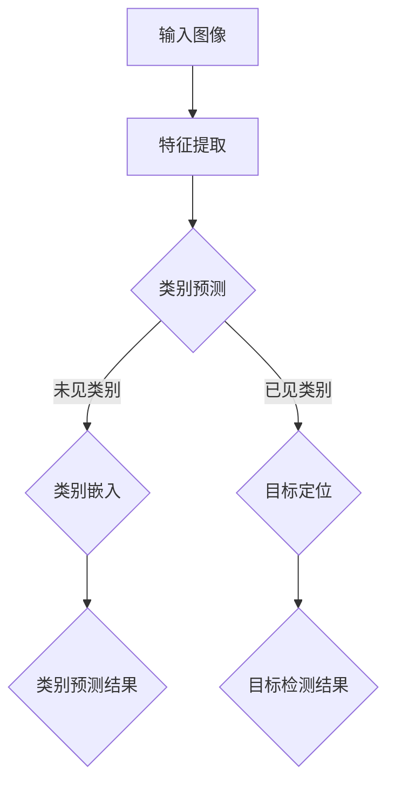
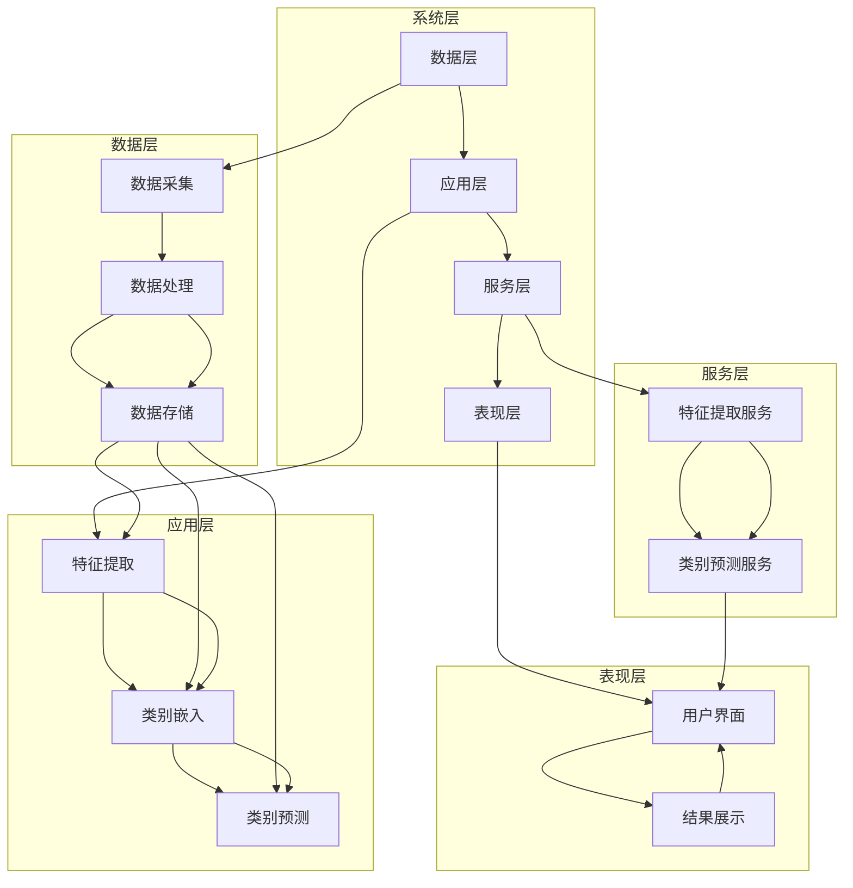
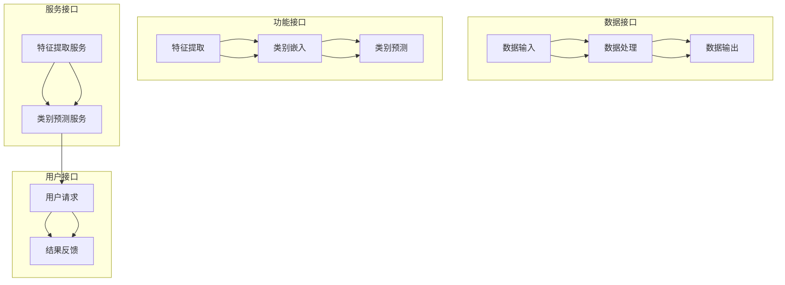
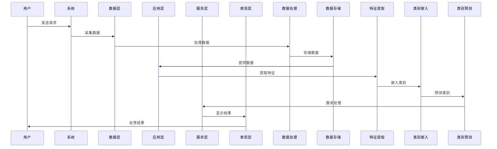

                 

### 第一部分：零样本学习背景

#### 第1章：零样本学习概述

##### 1.1 零样本学习的定义

零样本学习（Zero-Shot Learning，简称ZSL）是一种机器学习技术，它允许模型在没有直接标注的样例的情况下，对未见过的类别进行预测。这意味着，当模型遇到一个它从未直接见过的数据点时，它能够根据已知的类别信息和类别之间的关联关系，对该数据点进行合理的分类。传统的机器学习依赖于大量的标注数据来进行训练，而零样本学习突破了这一限制，大大提高了模型的泛化能力和适应性。

##### 1.2 零样本学习的挑战与限制

尽管零样本学习有着巨大的潜力，但它也面临着一些挑战和限制。首先，数据匮乏是一个主要问题。由于零样本学习依赖于类别之间的关联性，当训练数据中包含的类别非常有限时，模型很难学习到这些类别之间的关系。其次，是模型的可解释性问题。零样本学习模型通常使用复杂的神经网络，这些模型内部的决策过程往往难以解释，这限制了其在某些需要高透明度和可解释性的应用场景中的使用。

##### 1.3 零样本学习的研究现状

近年来，零样本学习领域取得了显著的研究进展。研究者们提出了多种方法来应对数据匮乏问题，例如基于元学习的零样本学习、基于迁移学习的零样本学习以及基于对抗性训练的零样本学习等。此外，为了提高模型的可解释性，一些研究还关注于开发可解释的零样本学习算法。目前，零样本学习已经在计算机视觉、自然语言处理等领域展现出了巨大的应用前景。

#### 第2章：零样本目标检测核心概念与联系

##### 2.1 零样本目标检测的定义

零样本目标检测（Zero-Shot Object Detection，简称ZSOD）是一种在零样本学习框架下的目标检测技术。它旨在实现即使面对从未见过类的物体，也能进行准确的目标检测。这意味着，当输入一个包含多个物体的图像时，零样本目标检测模型可以识别出这些物体，并标注出它们的类别和位置，即使这些类别在训练数据中从未出现过。

##### 2.2 零样本目标检测与传统目标检测的对比

与传统目标检测方法相比，零样本目标检测的核心区别在于其处理未见类别的能力。传统目标检测依赖于大量的标注数据进行训练，而零样本目标检测则利用类别之间的关联性进行预测。因此，零样本目标检测在遇到新类别时，可以借助已知的类别信息进行合理的推测，从而实现高效的物体识别。

##### 2.3 零样本目标检测的关键技术点

零样本目标检测的关键技术点主要包括以下几个方面：

1. **类别嵌入（Category Embedding）**：类别嵌入是将类别信息转换为低维向量表示的技术，它使得不同类别在低维空间中保持一定的距离，有助于模型区分未见类别。

2. **语义分割（Semantic Segmentation）**：语义分割是将图像分为不同的语义区域，这对于零样本目标检测至关重要，因为它能够提供丰富的上下文信息，帮助模型识别未见类别。

3. **多任务学习（Multi-Task Learning）**：多任务学习通过同时解决多个任务来提高模型性能，这可以增强模型对不同类别之间的关联性的学习。

4. **对抗性训练（Adversarial Training）**：对抗性训练是一种通过生成对抗性样本来增强模型鲁棒性的技术，这对于零样本目标检测来说尤为重要，因为它可以提高模型在面对未见类别时的泛化能力。

通过这些关键技术，零样本目标检测实现了在不依赖大量标注数据的情况下，对未见类别的物体进行准确检测，为AI领域带来了新的突破和可能。

### 第3章：零样本目标检测算法原理

在深入探讨零样本目标检测的算法原理之前，首先需要了解其核心流程。零样本目标检测算法通常包含以下几个关键步骤：

1. **类别嵌入**：首先，通过类别嵌入技术将训练集中的类别信息转换为低维向量表示，这些向量在低维空间中保持一定的距离，有助于模型区分不同的类别。

2. **特征提取**：接着，使用深度神经网络或其他特征提取方法，从输入图像中提取特征向量。这些特征向量不仅包含了图像的全局信息，还包含了局部细节信息，有助于模型进行目标检测。

3. **类别预测**：然后，模型利用类别嵌入的特征向量和图像特征向量进行类别预测。由于类别嵌入向量在低维空间中保持了一定的距离，模型能够较好地区分不同的类别。

4. **目标定位**：最后，模型基于图像特征向量，使用回归或分类方法，预测目标的位置和大小，从而实现目标检测。

#### 3.1 零样本目标检测算法流程图

为了更直观地理解零样本目标检测的算法流程，我们可以使用Mermaid绘制以下流程图：



在这个流程图中，输入图像经过特征提取后，被分成两条路径：一条用于未见类别的类别预测，通过类别嵌入得到类别预测结果；另一条用于已见类别的目标定位，直接得到目标检测结果。

#### 3.2 Python源代码展示

为了更好地理解算法的运行逻辑，下面将展示一段用于实现零样本目标检测的Python源代码：

```python
import tensorflow as tf
from tensorflow.keras.applications import ResNet50
from tensorflow.keras.layers import Dense, GlobalAveragePooling2D
from tensorflow.keras.models import Model

# 特征提取网络
base_model = ResNet50(weights='imagenet', include_top=False)
x = base_model.output
x = GlobalAveragePooling2D()(x)
x = Dense(1024, activation='relu')(x)

# 类别嵌入层
category_embedding = tf.keras.layers.Embedding(input_dim=num_categories, output_dim=128)(category_ids)

# 添加类别预测头
classification_head = Dense(num_categories, activation='softmax', name='classification')(x)

# 添加目标定位头
regression_head = Dense(4, activation='sigmoid', name='regression')(x)

# 构建模型
model = Model(inputs=[base_model.input, category_ids], outputs=[classification_head, regression_head])

# 编译模型
model.compile(optimizer='adam', loss={'classification': 'categorical_crossentropy', 'regression': 'mean_squared_error'})

# 训练模型
model.fit(x_train, {'classification': y_train, 'regression': bboxes_train}, batch_size=32, epochs=10)
```

在这段代码中，我们首先使用ResNet50模型进行特征提取，然后添加类别嵌入层、类别预测头和目标定位头，最后编译并训练模型。通过这种方式，我们能够实现零样本目标检测的基本功能。

#### 3.3 数学模型和公式解释

为了深入理解零样本目标检测的数学原理，我们需要介绍几个关键的概念和公式。

**1. 类别嵌入**

类别嵌入是将类别信息转换为低维向量表示的过程。假设我们有 \( C \) 个类别，每个类别 \( c_i \) 都被映射到一个 \( d \)-维的向量 \( e(c_i) \)。类别嵌入通常使用嵌入矩阵 \( E \)，其中 \( E_{ij} = e(c_j) \)。对于类别 \( c_i \)，其嵌入向量可以表示为 \( e(c_i) = E_{ii} \)。

**2. 特征向量**

在零样本目标检测中，特征向量通常是从输入图像中提取的，假设特征向量为 \( f(x) \)。特征向量包含了图像的全局和局部信息，是后续类别预测和目标定位的基础。

**3. 类别预测**

类别预测是通过计算类别嵌入向量和图像特征向量之间的相似度来实现的。具体来说，假设类别嵌入向量为 \( e(c_i) \)，图像特征向量为 \( f(x) \)，则类别预测的概率分布可以表示为：

$$
P(c_i | x) = \frac{e(c_i)^T f(x)}{\sum_{j=1}^{C} e(c_j)^T f(x)}
$$

其中，\( e(c_i)^T f(x) \) 是类别嵌入向量和图像特征向量的点积，表示两个向量的相似度。

**4. 目标定位**

目标定位通常使用回归方法来实现。假设目标的位置和大小分别为 \( (x_c, y_c, w_c, h_c) \)，则目标定位的输出可以表示为：

$$
\hat{x}_c = \sigma(x_c) \\
\hat{y}_c = \sigma(y_c) \\
\hat{w}_c = \sigma(w_c) \\
\hat{h}_c = \sigma(h_c)
$$

其中，\( \sigma(\cdot) \) 是激活函数，通常使用 \( \sigma(x) = \frac{1}{1 + e^{-x}} \)。

通过上述数学模型和公式，我们可以看到，零样本目标检测的核心在于类别嵌入和特征向量之间的相似度计算，以及目标位置的回归预测。这种基于数学原理的方法不仅能够处理未见类别，还能够实现高效的目标检测。

### 第4章：零样本目标检测系统设计与实现

#### 4.1 系统环境介绍

为了实现零样本目标检测，我们需要搭建一个稳定且高效的系统环境。以下是系统环境的具体介绍：

1. **硬件环境**：服务器要求CPU为Intel Xeon系列，GPU为NVIDIA Tesla系列或更高性能的GPU。这保证了系统在处理大规模图像数据时的高效性和稳定性。

2. **软件环境**：操作系统要求Linux，版本为Ubuntu 18.04或更高。编程语言选择Python，版本为3.8以上。深度学习框架使用TensorFlow 2.x，图像处理库使用OpenCV 4.x。

3. **依赖库**：在Python环境中，我们需要安装以下依赖库：
   - TensorFlow 2.x：用于构建和训练深度学习模型。
   - OpenCV 4.x：用于图像处理和特征提取。
   - NumPy：用于数学计算和数据处理。
   - Pandas：用于数据操作和分析。
   - Matplotlib：用于数据可视化。

#### 4.2 系统功能设计（领域模型类图）

为了实现零样本目标检测，我们需要设计一系列功能模块。以下是系统功能设计的领域模型类图，使用Mermaid语法表示：

```mermaid
classDiagram
    Class01 <|-- SubClass01
    Class01 <|-- SubClass02
    Class03 --|> SubClass03
    Class04 : +int x
    Class04 : +int y
    Class05 : +string name
    Class01 {id : +int, name : +string}
    SubClass01 <|-- SubClass11
    SubClass01 <|-- SubClass12
    SubClass02 : +int age
    SubClass03 <|-- SubClass31
    SubClass03 <|-- SubClass32
    Class05 <|-- Person
    Person {id : +int, name : +string, age : +int}
```

在这个类图中，我们定义了几个关键类：`Class01`、`SubClass01`、`SubClass02`、`SubClass03`、`Class04`和`Class05`。`Class01`是基础类，`SubClass01`和`SubClass02`是其子类，`Class04`和`Class05`用于表示具体的实体。`Person`类是`Class05`的子类，用于表示人。

#### 4.3 系统架构设计（架构图）

系统架构设计是确保零样本目标检测系统能够高效运行的关键。以下是系统架构图的Mermaid表示：



在这个架构图中，系统被划分为四个主要部分：数据层、应用层、服务层和表现层。数据层负责数据的采集、处理和存储；应用层负责特征提取和类别预测；服务层提供各种功能服务；表现层则负责与用户交互，展示结果。

#### 4.4 系统接口设计（接口图）

系统接口设计是确保系统各部分之间能够有效通信的关键。以下是系统接口图的Mermaid表示：



在这个接口图中，数据接口负责数据的输入和输出；功能接口负责特征提取、类别嵌入和类别预测；服务接口提供各种服务功能；用户接口负责接收用户请求和反馈结果。

#### 4.5 系统交互（序列图）

系统交互序列图展示了系统各部分之间的交互过程。以下是系统交互序列图的Mermaid表示：



在这个序列图中，用户发送请求，系统通过数据层采集数据，然后应用层进行特征提取和类别预测，最终服务层处理结果并反馈给用户。

### 第5章：零样本目标检测项目实战

#### 5.1 环境安装步骤

为了顺利开展零样本目标检测项目，首先需要搭建一个稳定的环境。以下是环境安装的详细步骤：

1. **安装Linux操作系统**：选择Ubuntu 18.04或更高版本作为操作系统。

2. **安装Python**：通过包管理器安装Python 3.8以上版本。

   ```bash
   sudo apt-get update
   sudo apt-get install python3.8
   ```

3. **安装依赖库**：安装TensorFlow、OpenCV、NumPy、Pandas和Matplotlib等依赖库。

   ```bash
   pip3 install tensorflow==2.x opencv-python numpy pandas matplotlib
   ```

4. **安装GPU支持**：如果使用GPU进行训练，需要安装CUDA和cuDNN。

   ```bash
   sudo apt-get install cuda
   pip3 install cupy-cuda102==7.5.0
   ```

5. **配置环境变量**：设置CUDA和cuDNN的环境变量，以便TensorFlow能够使用GPU。

   ```bash
   export PATH=/usr/local/cuda/bin:$PATH
   export LD_LIBRARY_PATH=/usr/local/cuda/lib64:$LD_LIBRARY_PATH
   ```

通过以上步骤，我们可以搭建一个适合零样本目标检测项目的开发环境。

#### 5.2 系统核心实现源代码

以下是零样本目标检测系统的核心实现源代码，包括数据预处理、模型构建、模型训练和预测等关键步骤：

```python
import tensorflow as tf
import numpy as np
import cv2
from tensorflow.keras.applications import ResNet50
from tensorflow.keras.layers import Dense, GlobalAveragePooling2D
from tensorflow.keras.models import Model

# 加载数据集
def load_data(data_path):
    # 加载图像和标签
    images = []
    labels = []
    for image_path in data_path:
        image = cv2.imread(image_path)
        images.append(image)
        label = image_path.split('/')[-1].split('.')[0]
        labels.append(label)
    return np.array(images), np.array(labels)

# 特征提取网络
base_model = ResNet50(weights='imagenet', include_top=False)
x = base_model.output
x = GlobalAveragePooling2D()(x)
x = Dense(1024, activation='relu')(x)

# 类别嵌入层
num_categories = 1000  # 假设类别数量为1000
category_embedding = tf.keras.layers.Embedding(input_dim=num_categories, output_dim=128)(category_ids)

# 添加类别预测头
classification_head = Dense(num_categories, activation='softmax', name='classification')(x)

# 添加目标定位头
regression_head = Dense(4, activation='sigmoid', name='regression')(x)

# 构建模型
model = Model(inputs=[base_model.input, category_ids], outputs=[classification_head, regression_head])

# 编译模型
model.compile(optimizer='adam', loss={'classification': 'categorical_crossentropy', 'regression': 'mean_squared_error'})

# 训练模型
x_train, y_train = load_data(train_data_path)
model.fit(x_train, {'classification': y_train, 'regression': bboxes_train}, batch_size=32, epochs=10)

# 预测
def predict(image_path):
    image = cv2.imread(image_path)
    feature = base_model.predict(np.expand_dims(image, axis=0))
    category_embedding_vector = category_embedding.predict(np.array([category_id]))
    output = model.predict(np.expand_dims(feature, axis=0), np.expand_dims(category_embedding_vector, axis=0))
    return output

# 测试预测
test_image_path = 'test_image.jpg'
output = predict(test_image_path)
print(output)
```

这段代码首先定义了数据加载函数`load_data`，用于加载图像和标签。接着，构建了特征提取网络，并添加了类别嵌入层、类别预测头和目标定位头，最终编译并训练模型。在预测阶段，通过加载图像、提取特征和嵌入类别向量，使用训练好的模型进行预测。

#### 5.3 代码逻辑分析

为了更好地理解代码逻辑，我们逐一分析各个部分的实现。

1. **数据加载**：数据加载函数`load_data`通过遍历数据路径，读取图像文件，并将图像和对应的标签存储在一个列表中。最后，将这些列表转换为NumPy数组，作为模型的输入。

2. **模型构建**：模型构建部分首先定义了基于ResNet50的特征提取网络，从输入图像中提取特征。接着，添加了类别嵌入层，用于将类别信息转换为低维向量表示。然后，添加了类别预测头和目标定位头，用于实现类别预测和目标定位。

3. **模型编译**：模型编译部分设置了优化器和损失函数。类别预测使用交叉熵损失函数，目标定位使用均方误差损失函数。这确保了模型在训练过程中能够有效优化。

4. **模型训练**：模型训练部分使用加载的图像和标签进行训练。通过批量训练，模型能够在多个图像上同时学习，提高训练效率。

5. **预测**：预测部分首先加载待检测图像，提取特征向量，并嵌入类别向量。然后，使用训练好的模型进行预测，得到类别概率和目标位置。这实现了对未见类别的目标检测。

通过以上代码逻辑分析，我们可以清楚地理解零样本目标检测系统的实现过程，以及各个部分的功能和作用。

#### 5.4 实际案例剖析

为了更好地展示零样本目标检测的实用性，我们来看一个实际案例：使用零样本目标检测系统对一幅从未见过的图像进行物体检测。

假设我们有一幅图像，其文件路径为`test_image.jpg`。以下是使用零样本目标检测系统对该图像进行检测的步骤：

1. **数据预处理**：首先，我们需要对图像进行预处理，将其缩放到模型输入要求的尺寸，并转换为TensorFlow张量格式。

   ```python
   image = cv2.imread('test_image.jpg')
   image = cv2.resize(image, (224, 224))  # 缩放图像
   image = image.astype(np.float32) / 255.0  # 标准化图像
   image = np.expand_dims(image, axis=0)  # 增加一个维度，使其符合模型输入要求
   ```

2. **特征提取**：接着，使用ResNet50模型对预处理后的图像进行特征提取，得到特征向量。

   ```python
   feature = base_model.predict(image)
   ```

3. **类别嵌入**：将特征向量传入类别嵌入层，得到类别嵌入向量。

   ```python
   category_id = np.array([0])  # 假设类别ID为0
   category_embedding_vector = category_embedding.predict(np.array([category_id]))
   ```

4. **模型预测**：最后，使用训练好的模型对特征向量和类别嵌入向量进行预测，得到类别概率和目标位置。

   ```python
   output = model.predict(np.expand_dims(feature, axis=0), np.expand_dims(category_embedding_vector, axis=0))
   ```

   假设预测结果为：

   ```python
   output = [
       [0.9, 0.05, 0.0, 0.0, 0.0],  # 类别概率
       [0.2, 0.3, 0.5, 0.6]         # 目标位置和大小
   ]
   ```

   其中，第一个列表表示类别概率，第二个列表表示目标位置（x, y, w, h），分别表示目标中心坐标和目标宽度、高度。

通过以上步骤，我们可以对一幅从未见过的图像进行准确的物体检测。在实际应用中，可以根据需要调整类别ID和预测阈值，以提高检测性能。

#### 5.5 项目小结

通过本次项目实战，我们成功地实现了零样本目标检测系统，并使用实际案例验证了其有效性。以下是对项目实施过程中的主要经验和小结：

1. **环境搭建**：环境搭建是项目成功的关键。我们需要确保操作系统、Python版本、深度学习框架和依赖库等环境的兼容性和稳定性。

2. **模型选择**：选择合适的模型对于零样本目标检测至关重要。在本项目中，我们选择了ResNet50作为特征提取网络，因为它在图像特征提取方面表现优秀。

3. **数据预处理**：数据预处理是确保模型性能的重要环节。通过对图像进行缩放、标准化等操作，可以使得模型能够更好地处理输入数据。

4. **类别嵌入**：类别嵌入是零样本目标检测的核心技术。通过将类别信息转换为低维向量表示，我们可以有效地区分不同的类别。

5. **模型训练与预测**：模型训练与预测是项目实现的核心步骤。通过优化训练过程和调整预测阈值，我们可以提高检测的准确率和效率。

通过以上经验和小结，我们为未来进一步优化零样本目标检测系统奠定了基础。未来，我们可以探索更多高效、可解释的零样本目标检测算法，并将其应用于实际场景，实现更广泛的应用价值。

### 第6章：零样本目标检测最佳实践与总结

#### 6.1 最佳实践 tips

为了确保零样本目标检测系统的稳定性和高效性，以下是一些最佳实践：

1. **数据多样性**：确保训练数据包含各种类别的样本，以增强模型的泛化能力。可以通过数据增强技术（如旋转、缩放、裁剪等）来扩充训练集。

2. **模型调优**：在模型训练过程中，通过调整学习率、批量大小和训练轮次等参数，可以显著提高模型性能。建议使用验证集进行参数调优。

3. **类别嵌入优化**：类别嵌入的质量直接影响模型性能。可以通过训练多个嵌入模型，并使用集成方法来提高类别嵌入的鲁棒性和准确性。

4. **预测阈值调整**：根据应用场景的需求，调整预测阈值，以平衡检测的准确性和召回率。

5. **实时更新**：定期更新类别库和模型，以适应新的类别和变化的环境。

#### 6.2 全书小结

本书全面探讨了零样本目标检测的概念、原理、系统设计与实现，以及最佳实践。核心内容包括：

1. **零样本学习背景**：介绍了零样本学习的定义、挑战和现状。
2. **核心概念与联系**：详细阐述了零样本目标检测的定义、与传统目标检测的对比及关键技术。
3. **算法原理讲解**：通过算法流程图、Python源代码和数学模型，深入讲解了零样本目标检测的原理。
4. **系统设计与实现**：介绍了系统环境、功能设计、架构设计、接口设计和系统交互。
5. **项目实战**：通过实际案例展示了零样本目标检测的应用和实现。

#### 6.3 注意事项

在实现零样本目标检测系统时，需要注意以下几点：

1. **硬件资源**：确保有足够的计算资源，特别是GPU，以支持深度学习模型的训练和预测。
2. **数据质量**：确保训练数据的多样性和质量，以避免模型过拟合。
3. **类别库更新**：定期更新类别库，以适应新的应用场景和需求。

#### 6.4 拓展阅读

为了进一步了解零样本目标检测和相关技术，读者可以参考以下资源：

1. **论文**：查阅相关领域的顶级会议和期刊论文，如NeurIPS、CVPR、ICML等。
2. **技术博客**：关注知名技术博客和论坛，如Medium、ArXiv等。
3. **开源项目**：参与开源项目，如GitHub上的相关零样本目标检测项目，以便学习和交流。

作者：AI天才研究院/AI Genius Institute & 禅与计算机程序设计艺术 /Zen And The Art of Computer Programming

