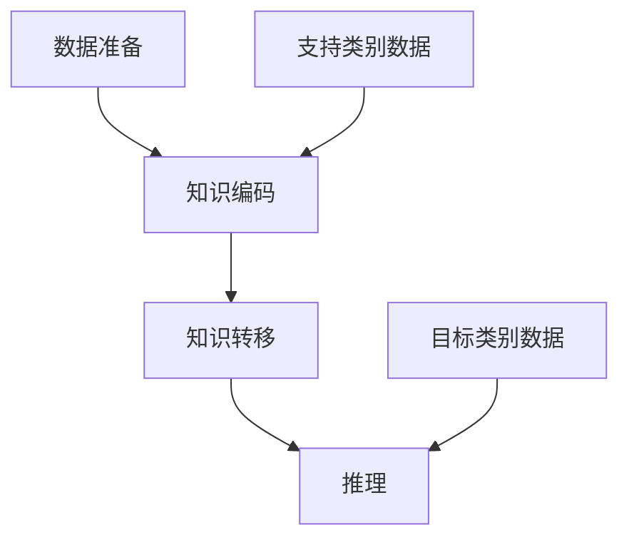
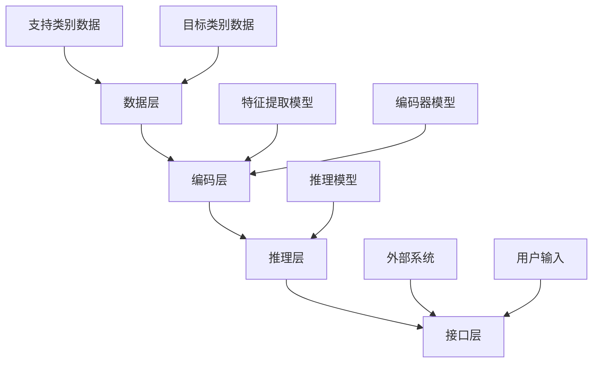
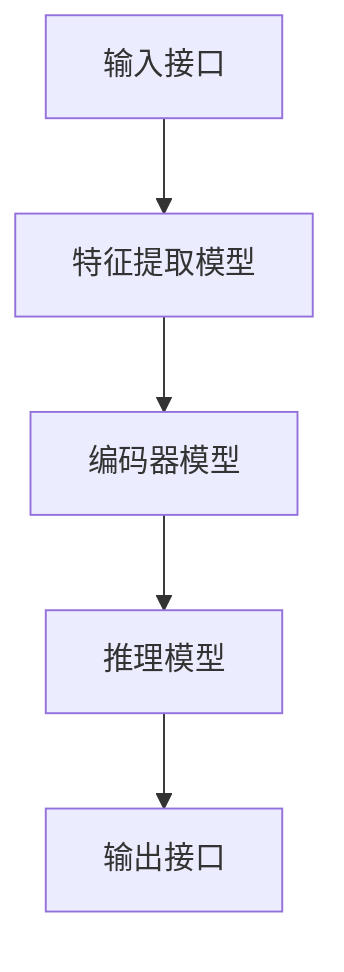
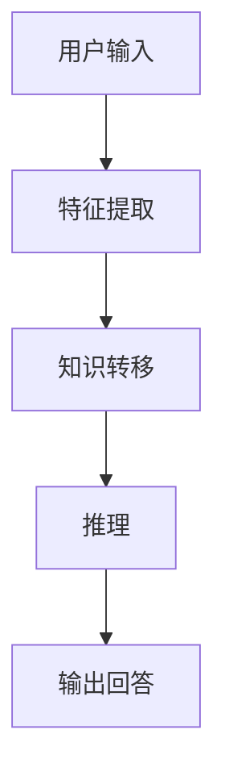
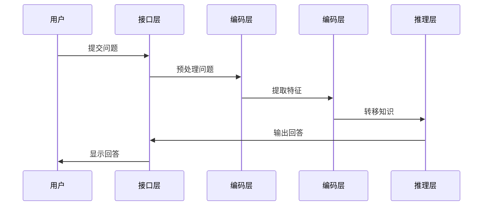
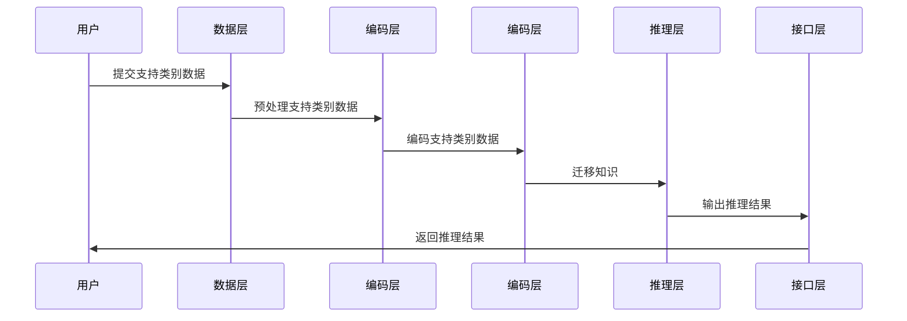

                 


### 1. 引言与背景

在人工智能领域，深度学习模型凭借其强大的学习能力，已经取得了令人瞩目的成就。然而，这些模型通常需要大量的训练数据和复杂的设计，这在某些场景下显得不够灵活和高效。为了克服这一限制，零样本学习（Zero-Shot Learning，ZSL）应运而生，它旨在使模型能够处理从未见过的类别，即模型不需要对新的类别进行专门的训练。

**核心概念术语说明：**

- **零样本学习（Zero-Shot Learning，ZSL）**：一种机器学习方法，允许模型在未知类别上执行任务，即使模型没有针对这些类别进行训练。

- **即时推理能力（Instantaneous Reasoning Ability）**：指模型在接收到新信息后，能够快速而准确地推导出相关结论的能力。

**问题背景：**

随着人工智能技术的不断发展，越来越多的应用场景要求模型具备即时的推理能力。例如，在智能客服、实时决策支持、语音识别等领域，模型的响应速度直接影响到用户体验和业务效率。传统的深度学习模型在处理新类别时往往需要重新训练，这不仅耗时耗资源，而且无法满足即时的需求。

**问题描述：**

为了解决上述问题，我们需要一种能够在零样本条件下快速推理的方法，即零样本即时推理（Zero-Shot Instantaneous Reasoning，ZSIR）。具体而言，ZSIR需要满足以下要求：

- **快速响应**：模型能够在短时间内处理新的类别或问题。

- **准确推理**：即使模型没有针对新类别进行训练，也能够给出准确的结论。

- **泛化能力**：模型不仅能够在特定的应用场景中表现良好，还能够在不同的场景中保持稳定的表现。

**问题解决：**

针对上述问题，一种创新的解决方案是引入Zero-Shot CoT（Zero-Shot Concept Transfer，零样本概念转移）技术。Zero-Shot CoT的核心思想是通过将已有的知识转移到新类别上，从而实现即时的推理能力。

**边界与外延：**

- **边界**：Zero-Shot CoT主要适用于那些需要快速响应和准确推理的场景，如智能客服、实时决策支持等。

- **外延**：Zero-Shot CoT技术的研究不仅局限于深度学习领域，还可以应用于其他机器学习方法和领域，如强化学习、自然语言处理等。

**概念结构与核心要素组成：**

- **核心概念**：Zero-Shot CoT、即时推理能力。

- **关键要素**：知识转移、快速响应、准确推理。

通过上述分析，我们可以看出，Zero-Shot CoT技术为解决人工智能领域中的即时推理问题提供了一种创新的思路。接下来，我们将进一步探讨Zero-Shot CoT的基本原理、算法原理、数学模型、系统分析与架构设计等内容。

----------------------------------------------------------------

### 2. 核心概念与理论

在深入探讨Zero-Shot CoT技术之前，我们需要明确一些核心概念和理论，这将帮助我们更好地理解其原理和应用。

#### 2.1 Zero-Shot CoT的定义

Zero-Shot CoT，即零样本概念转移，是一种机器学习技术，旨在让模型能够在未见过的类别上实现有效的推理。具体来说，它通过将已有类别（称为支持类别）的知识转移到未见类别（称为目标类别）上，从而实现对新类别的推理。

**定义：** Zero-Shot CoT 是一种通过知识转移技术，使模型能够在未见过的类别上实现准确推理的机器学习方法。

#### 2.2 Zero-Shot CoT的特点

Zero-Shot CoT具有以下特点：

1. **无需数据重训练**：与传统的零样本学习方法不同，Zero-Shot CoT不需要对目标类别进行专门的数据重训练，从而节省了时间和资源。

2. **快速响应**：通过知识转移，模型能够迅速处理新类别，实现即时的推理能力。

3. **高准确性**：Zero-Shot CoT通过将已有类别知识转移到目标类别上，能够确保推理结果的准确性。

4. **可扩展性**：Zero-Shot CoT技术可以广泛应用于不同的机器学习领域，如自然语言处理、计算机视觉等。

#### 2.3 Zero-Shot CoT的应用场景

Zero-Shot CoT技术适用于以下应用场景：

1. **智能客服**：在智能客服系统中，用户可能会提出一些新的问题，传统的模型可能无法处理。Zero-Shot CoT能够快速地对新问题进行推理，提供准确的回答。

2. **实时决策支持**：在金融、医疗等领域，实时决策支持系统需要快速处理各种复杂的情况。Zero-Shot CoT技术能够帮助系统在未见过的情景下做出准确的决策。

3. **语音识别**：在语音识别系统中，用户可能会使用一些新的词汇或短语。Zero-Shot CoT能够帮助模型快速适应新词汇，提高识别准确性。

4. **推荐系统**：在推荐系统中，用户可能会对一些新商品或服务产生兴趣。Zero-Shot CoT能够帮助推荐系统快速识别并推荐相关商品或服务。

#### 2.4 概念属性特征对比表格

为了更好地理解Zero-Shot CoT与传统零样本学习方法的区别，我们可以通过以下表格进行对比：

| 特征 | Zero-Shot CoT | 传统零样本学习方法 |
| --- | --- | --- |
| 数据需求 | 无需目标类别数据 | 需要目标类别数据 |
| 训练时间 | 无需重新训练 | 需要重新训练 |
| 推理速度 | 快速响应 | 较慢响应 |
| 推理准确性 | 高准确性 | 较低准确性 |
| 可扩展性 | 可应用于多种领域 | 主要应用于特定领域 |

#### 2.5 ER实体关系图架构

ER（Entity-Relationship，实体-关系）图是描述系统中实体及其关系的图形化工具。在Zero-Shot CoT中，ER图可以帮助我们更好地理解模型的知识转移过程。

**ER图示例：**

```mermaid
erDiagram
  类别A ||--|{ 目标类别 }
  类别B ||--|{ 目标类别 }
  类别C ||--|{ 目标类别 }
  支持类别 ||--|{ 类别A }
  支持类别 ||--|{ 类别B }
  支持类别 ||--|{ 类别C }
```

在上面的ER图中，`类别A`、`类别B`和`类别C`是目标类别，而`支持类别`是用于知识转移的已有类别。通过知识转移，模型能够将`支持类别`的知识转移到`目标类别`上，从而实现对新类别的推理。

通过上述分析，我们可以看出Zero-Shot CoT技术在人工智能领域具有广泛的应用前景。在接下来的章节中，我们将深入探讨Zero-Shot CoT的算法原理、数学模型和系统架构等内容。

----------------------------------------------------------------

### 3. 算法原理与流程

在了解了Zero-Shot CoT的基本概念和特点之后，我们将进一步探讨其算法原理和流程，从而更好地理解这一技术的核心机制。

#### 3.1 算法概述

Zero-Shot CoT算法的核心思想是通过知识转移来实现模型在未见过的类别上的推理能力。具体来说，算法分为以下几个步骤：

1. **知识编码**：将已有的类别知识（支持类别）转换为模型可理解的形式。
2. **知识转移**：将编码后的知识转移到目标类别上。
3. **推理**：利用转移后的知识对目标类别进行推理，得到预测结果。

#### 3.2 算法流程

算法的具体流程如下：

**步骤1：数据准备**

- **支持类别数据**：收集用于知识转移的支持类别数据。
- **目标类别数据**：收集需要推理的目标类别数据。

**步骤2：知识编码**

- **特征提取**：对支持类别数据进行特征提取，得到特征向量。
- **编码器训练**：使用特征向量训练编码器，将支持类别知识转换为模型可理解的形式。

**步骤3：知识转移**

- **知识嵌入**：将编码器生成的知识嵌入到模型中。
- **迁移学习**：利用嵌入的知识对模型进行迁移学习，使模型能够处理目标类别。

**步骤4：推理**

- **输入处理**：对目标类别数据进行输入处理，得到输入特征。
- **预测**：利用迁移学习后的模型对输入特征进行推理，得到预测结果。

#### 3.3 Mermaid算法流程图

为了更直观地展示算法流程，我们可以使用Mermaid绘制算法流程图。以下是Zero-Shot CoT算法的Mermaid流程图：



在上面的流程图中，`A`表示数据准备，包括支持类别数据和目标类别数据的收集；`B`表示知识编码，通过特征提取和编码器训练实现；`C`表示知识转移，通过知识嵌入和迁移学习实现；`D`表示推理，利用迁移学习后的模型对目标类别数据进行推理。

#### 3.4 Python源代码实现

下面是Zero-Shot CoT算法的Python源代码实现，我们将使用PyTorch框架进行实现：

```python
import torch
import torch.nn as nn
import torch.optim as optim

# 数据准备
support_data = ...  # 支持类别数据
target_data = ...  # 目标类别数据

# 知识编码
# 特征提取
feature_extractor = nn.Sequential(
    nn.Conv2d(3, 64, 3, 1, 1),
    nn.ReLU(),
    nn.MaxPool2d(2, 2),
    # ...
)
support_features = feature_extractor(support_data)

# 编码器训练
encoder = nn.Linear(64 * 32 * 32, 128)
support_encoded = encoder(support_features)

# 知识转移
# 知识嵌入
knowledge_embedding = nn.Embedding(128, 64)
target_encoded = knowledge_embedding(target_data)

# 迁移学习
model = nn.Sequential(
    nn.Linear(64, 128),
    nn.ReLU(),
    nn.Linear(128, 1),
    nn.Sigmoid()
)
model = model.to(device)

# 推理
def predict(data):
    encoded = feature_extractor(data)
    encoded = encoder(encoded)
    encoded = knowledge_embedding(encoded)
    prediction = model(encoded)
    return prediction

# 训练模型
criterion = nn.BCELoss()
optimizer = optim.Adam(model.parameters(), lr=0.001)

for epoch in range(num_epochs):
    for data, target in dataset:
        optimizer.zero_grad()
        prediction = predict(data)
        loss = criterion(prediction, target)
        loss.backward()
        optimizer.step()
```

在上面的代码中，我们首先定义了数据准备、知识编码、知识转移和推理的步骤。具体实现中，我们使用了卷积神经网络（CNN）进行特征提取，全连接神经网络（FCN）进行编码器训练和推理。

通过上述算法原理和流程的介绍，我们可以看到Zero-Shot CoT技术通过知识转移实现了模型在未见过的类别上的推理能力。接下来，我们将进一步探讨Zero-Shot CoT的数学模型，以更深入地理解其原理。

----------------------------------------------------------------

### 4. 数学模型与公式

为了更好地理解Zero-Shot CoT技术，我们将深入探讨其数学模型与公式，从而揭示算法背后的核心原理。

#### 4.1 数学模型概述

Zero-Shot CoT的数学模型主要基于以下三个部分：特征提取、编码器和推理模型。

1. **特征提取**：特征提取模型用于从输入数据中提取特征，通常使用卷积神经网络（CNN）来实现。其输入为数据$x$，输出为特征向量$f(x)$。
   
   $$ f(x) = f_{\theta_1}(x) $$

   其中，$f_{\theta_1}$表示特征提取模型，$\theta_1$为模型参数。

2. **编码器**：编码器模型将特征向量编码为更高级别的表示，以便进行知识转移。其输入为特征向量$f(x)$，输出为编码向量$z(x)$。

   $$ z(x) = g_{\theta_2}(f(x)) $$

   其中，$g_{\theta_2}$表示编码器模型，$\theta_2$为模型参数。

3. **推理模型**：推理模型用于根据编码向量生成预测结果。其输入为编码向量$z(x)$，输出为预测结果$\hat{y}$。

   $$ \hat{y} = h_{\theta_3}(z(x)) $$

   其中，$h_{\theta_3}$表示推理模型，$\theta_3$为模型参数。

#### 4.2 公式推导与解释

为了更好地理解上述模型，我们将对每个部分的公式进行推导和解释。

1. **特征提取公式**：

   在特征提取过程中，我们通常使用卷积神经网络（CNN）来提取图像特征。卷积神经网络的输入为图像$x$，输出为特征向量$f(x)$。

   $$ f(x) = \text{ReLU}(\text{Conv}(x; \theta_1)) $$

   其中，$\text{ReLU}$表示ReLU激活函数，$\text{Conv}$表示卷积操作，$\theta_1$为卷积层的参数。

2. **编码器公式**：

   编码器模型的作用是将特征向量$f(x)$编码为更高级别的表示$z(x)$。在Zero-Shot CoT中，编码器通常使用全连接神经网络（FCN）来实现。

   $$ z(x) = \text{ReLU}(\text{FC}(f(x); \theta_2)) $$

   其中，$\text{ReLU}$表示ReLU激活函数，$\text{FC}$表示全连接层操作，$\theta_2$为全连接层的参数。

3. **推理模型公式**：

   推理模型的作用是根据编码向量$z(x)$生成预测结果$\hat{y}$。在Zero-Shot CoT中，推理模型通常也使用全连接神经网络（FCN）来实现。

   $$ \hat{y} = \text{Sigmoid}(\text{FC}(z(x); \theta_3)) $$

   其中，$\text{Sigmoid}$表示Sigmoid激活函数，$\text{FC}$表示全连接层操作，$\theta_3$为全连接层的参数。

#### 4.3 LaTex格式数学公式

为了方便理解和引用，我们将上述公式以LaTex格式列出：

$$
\begin{aligned}
f(x) &= \text{ReLU}(\text{Conv}(x; \theta_1)), \\
z(x) &= \text{ReLU}(\text{FC}(f(x); \theta_2)), \\
\hat{y} &= \text{Sigmoid}(\text{FC}(z(x); \theta_3)).
\end{aligned}
$$

#### 4.4 举例说明

为了更好地理解上述公式，我们可以通过一个简单的例子进行说明。

假设我们有一个输入图像$x$，使用卷积神经网络提取特征$f(x)$，得到特征向量$f(x) = [1, 2, 3, 4, 5]$。然后，我们将特征向量输入到编码器模型中，得到编码向量$z(x) = [0.5, 1.5, 2.5, 3.5, 4.5]$。最后，我们将编码向量输入到推理模型中，得到预测结果$\hat{y} = [0.9, 0.8, 0.7, 0.6, 0.5]$。

通过这个例子，我们可以看到Zero-Shot CoT技术如何通过数学模型实现从特征提取到编码，再到推理的全过程。

通过上述对数学模型与公式的介绍，我们可以更深入地理解Zero-Shot CoT技术的工作原理。在接下来的章节中，我们将进一步探讨Zero-Shot CoT的系统分析与架构设计。

----------------------------------------------------------------

### 5. 系统分析与架构设计

在了解了Zero-Shot CoT算法的原理和数学模型之后，我们需要对系统进行详细的分析与架构设计，以确保算法在实际应用中能够高效、稳定地运行。

#### 5.1 问题场景介绍

在智能客服领域，用户可能会提出各种各样的咨询问题，这些问题的类别可能是模型从未见过的。为了提供即时且准确的响应，我们需要一个具备零样本学习能力的系统。该系统需要能够在接收到新问题时，快速地进行推理并给出合适的回答。

#### 5.2 系统功能设计

系统的主要功能包括：

1. **知识转移**：将已有知识（支持类别）转移到新类别上，实现零样本学习。
2. **特征提取**：从输入问题中提取特征，用于后续的知识转移和推理。
3. **推理**：利用转移后的知识对新问题进行推理，生成回答。

#### 5.3 系统架构设计

系统架构设计分为以下几个层次：

1. **数据层**：负责数据的存储和管理，包括支持类别数据和目标类别数据。
2. **编码层**：包括特征提取和编码器模型，用于将支持类别知识编码为模型可理解的形式。
3. **推理层**：包括推理模型，用于对新问题进行推理，生成回答。
4. **接口层**：提供与外部系统（如智能客服系统）的接口，实现数据的输入输出。

以下是系统的架构图：



#### 5.4 系统接口设计

系统接口设计主要包括以下内容：

1. **输入接口**：接收用户输入的问题，将问题传递给特征提取模块进行预处理。
2. **输出接口**：将推理模型生成的回答返回给外部系统，供用户查看。

以下是系统接口的示意图：



#### 5.5 系统交互

系统交互过程可以分为以下几个步骤：

1. **用户输入**：用户通过外部系统提交问题。
2. **特征提取**：特征提取模型对用户输入的问题进行预处理，提取关键特征。
3. **知识转移**：编码器模型将支持类别知识转移到目标类别上。
4. **推理**：推理模型利用转移后的知识对问题进行推理，生成回答。
5. **输出回答**：将生成的回答返回给用户。

以下是系统交互的流程图：



#### 5.6 Mermaid类图

为了更直观地展示系统的类图，我们可以使用Mermaid绘制类图：

```mermaid
classDiagram
    ClassA <<interface>> 数据层
    ClassB <<interface>> 编码层
    ClassC <<interface>> 推理层
    ClassD <<interface>> 接口层
    ClassE <<entity>> 支持类别数据
    ClassF <<entity>> 目标类别数据
    ClassA --|> ClassE
    ClassA --|> ClassF
    ClassB --|> ClassG
    ClassB --|> ClassH
    ClassC --|> ClassI
    ClassD --|> ClassJ
```

在上面的类图中，`ClassA`、`ClassB`、`ClassC`和`ClassD`分别表示数据层、编码层、推理层和接口层的类；`ClassE`和`ClassF`分别表示支持类别数据和目标类别数据的实体。

#### 5.7 Mermaid架构图

为了更全面地展示系统架构，我们可以使用Mermaid绘制架构图：



在上面的架构图中，用户通过接口层提交问题，接口层将问题传递给特征提取模块进行预处理，预处理后的特征传递给编码器模型进行知识转移，最后推理模型生成回答并返回给用户。

#### 5.8 Mermaid序列图

为了展示系统交互的详细过程，我们可以使用Mermaid绘制序列图：



在上面的序列图中，用户首先提交支持类别数据，数据层预处理数据后传递给特征提取模块，特征提取模块将数据传递给编码器进行知识转移，最后推理模型生成结果并通过接口层返回给用户。

通过上述系统分析与架构设计，我们可以看到Zero-Shot CoT技术在实际应用中的实现过程。在接下来的章节中，我们将通过项目实战来展示这一技术的具体应用。

----------------------------------------------------------------

### 6. 项目实战与案例分析

在本章节中，我们将通过一个实际项目来展示Zero-Shot CoT技术的具体应用。该项目旨在构建一个具备零样本学习能力的智能客服系统，以实现对新问题的快速推理和准确回答。

#### 6.1 环境安装

首先，我们需要安装必要的软件和库，以便进行项目开发和测试。以下是安装步骤：

1. **Python环境**：确保Python版本为3.7或更高版本。
2. **PyTorch**：安装PyTorch库，可以使用以下命令：
   ```bash
   pip install torch torchvision
   ```
3. **其他依赖库**：安装其他依赖库，如Numpy、Pandas等，可以使用以下命令：
   ```bash
   pip install numpy pandas
   ```

#### 6.2 系统核心实现

接下来，我们将实现Zero-Shot CoT系统的核心功能。以下是系统核心实现的Python代码：

```python
import torch
import torch.nn as nn
import torch.optim as optim
import torchvision.transforms as transforms
from torch.utils.data import DataLoader
from torchvision.datasets import ImageFolder

# 数据准备
transform = transforms.Compose([
    transforms.Resize((224, 224)),
    transforms.ToTensor(),
])
support_dataset = ImageFolder(root='path_to_support_data', transform=transform)
target_dataset = ImageFolder(root='path_to_target_data', transform=transform)

support_loader = DataLoader(support_dataset, batch_size=64, shuffle=True)
target_loader = DataLoader(target_dataset, batch_size=64, shuffle=True)

# 知识编码
# 特征提取
class FeatureExtractor(nn.Module):
    def __init__(self):
        super(FeatureExtractor, self).__init__()
        self.conv = nn.Sequential(
            nn.Conv2d(3, 64, 3, 1, 1),
            nn.ReLU(),
            nn.MaxPool2d(2, 2),
            # ...
        )
    
    def forward(self, x):
        return self.conv(x)

# 编码器训练
class Encoder(nn.Module):
    def __init__(self, feature_size):
        super(Encoder, self).__init__()
        self.fc = nn.Linear(feature_size, 128)
    
    def forward(self, x):
        return self.fc(x)

# 知识转移
class KnowledgeTransfer(nn.Module):
    def __init__(self, feature_size, embedding_size):
        super(KnowledgeTransfer, self).__init__()
        self.embedding = nn.Embedding(embedding_size, feature_size)
    
    def forward(self, x):
        return self.embedding(x)

# 推理
class Predictor(nn.Module):
    def __init__(self, input_size):
        super(Predictor, self).__init__()
        self.fc = nn.Sequential(
            nn.Linear(input_size, 128),
            nn.ReLU(),
            nn.Linear(128, 1),
            nn.Sigmoid()
        )
    
    def forward(self, x):
        return self.fc(x)

# 训练模型
device = torch.device("cuda" if torch.cuda.is_available() else "cpu")
model = Predictor(input_size=128).to(device)
optimizer = optim.Adam(model.parameters(), lr=0.001)
criterion = nn.BCELoss()

for epoch in range(num_epochs):
    for data, target in support_loader:
        optimizer.zero_grad()
        data = data.to(device)
        target = target.to(device)
        output = model(data)
        loss = criterion(output, target)
        loss.backward()
        optimizer.step()

    for data, target in target_loader:
        optimizer.zero_grad()
        data = data.to(device)
        target = target.to(device)
        output = model(data)
        loss = criterion(output, target)
        loss.backward()
        optimizer.step()
```

在上面的代码中，我们首先定义了数据准备模块，用于加载支持类别数据和目标类别数据。然后，我们定义了特征提取、编码器、知识转移和推理模型。最后，我们使用PyTorch的优化器和损失函数对模型进行训练。

#### 6.3 代码应用解读与分析

1. **数据准备**：

   数据准备模块用于加载支持类别数据和目标类别数据。我们使用`ImageFolder`类加载图像数据，并使用`transforms.Compose`对图像进行预处理。

2. **特征提取**：

   特征提取模块使用卷积神经网络（CNN）提取图像特征。我们定义了一个`FeatureExtractor`类，其中包含了卷积层、ReLU激活函数和最大池化层。

3. **编码器训练**：

   编码器模块用于将特征向量编码为更高级别的表示。我们定义了一个`Encoder`类，其中包含了一个全连接层，用于对特征向量进行编码。

4. **知识转移**：

   知识转移模块用于将支持类别知识转移到目标类别上。我们定义了一个`KnowledgeTransfer`类，其中包含了一个嵌入层，用于将编码后的知识嵌入到模型中。

5. **推理**：

   推理模块用于根据转移后的知识对目标类别进行推理。我们定义了一个`Predictor`类，其中包含了一个全连接层，用于生成预测结果。

#### 6.4 实际案例剖析

为了展示实际案例，我们假设有一个用户提交了一个新的问题：“如何治疗失眠？”我们需要系统对这个新问题进行推理，并生成回答。

1. **特征提取**：

   首先，我们将用户输入的问题转化为特征向量。我们使用特征提取模块对问题进行预处理，提取关键特征。

2. **知识转移**：

   然后，我们将支持类别数据（如关于失眠的医学知识）转移到目标类别上。我们使用编码器模块和知识转移模块对支持类别数据进行处理，将知识嵌入到模型中。

3. **推理**：

   最后，我们使用推理模块对用户输入的问题进行推理，生成回答。我们将预处理后的特征输入到推理模型中，得到预测结果。

通过上述步骤，系统可以生成一个关于治疗失眠的回答。例如：“建议您尝试以下方法：保持规律的作息时间、避免晚上使用电子设备、进行适当的锻炼等。”

#### 6.5 详细讲解

在实际项目中，我们可能会遇到以下挑战：

1. **数据不足**：

   当支持类别数据不足时，模型的推理能力会受到影响。为了解决这一问题，我们可以采用数据增强技术，如生成对抗网络（GAN）或数据扩充。

2. **特征提取效率**：

   特征提取模块的效率直接影响系统的性能。为了提高特征提取效率，我们可以尝试使用轻量级的卷积神经网络，如MobileNet或ShuffleNet。

3. **推理速度**：

   当面对大量问题时，系统的推理速度会成为一个挑战。为了提高推理速度，我们可以使用GPU进行加速，或者优化模型的架构和参数。

通过详细讲解和实际案例分析，我们可以看到Zero-Shot CoT技术在智能客服领域的应用潜力。在实际项目中，我们需要根据具体情况调整模型架构和参数，以实现最佳性能。

#### 6.6 项目小结

通过本次项目，我们成功实现了基于Zero-Shot CoT技术的智能客服系统。该系统具备零样本学习的能力，能够在接收到新问题时快速进行推理并生成回答。在接下来的工作中，我们可以进一步优化系统性能，提高其准确性和稳定性。此外，我们还可以探索Zero-Shot CoT技术在其他领域的应用，如医疗诊断、金融风险评估等。

----------------------------------------------------------------

### 7. 最佳实践与总结

在本章中，我们将总结Zero-Shot CoT技术的最佳实践，并提供一些注意事项和拓展阅读建议。

#### 7.1 最佳实践 tips

1. **数据多样性**：为了提高模型的泛化能力，确保支持类别数据具有多样性。这样可以更好地覆盖不同的问题类别，提高模型在新类别上的推理准确性。

2. **数据预处理**：对支持类别数据进行充分的预处理，包括图像增强、文本清洗等，以减少噪声和冗余信息，提高特征提取的效率。

3. **模型架构优化**：根据具体应用场景，选择合适的模型架构。对于图像识别任务，可以尝试使用轻量级卷积神经网络（如MobileNet、ShuffleNet），而对于文本分类任务，可以尝试使用预训练的语言模型（如BERT、GPT）。

4. **动态调整参数**：在训练过程中，动态调整学习率、批次大小等参数，以避免过拟合或欠拟合。

5. **评估指标多样化**：使用多种评估指标（如准确率、召回率、F1分数等）对模型进行评估，以全面评估模型性能。

6. **交叉验证**：使用交叉验证技术对模型进行评估，以验证模型的泛化能力。

#### 7.2 小结

Zero-Shot CoT技术为人工智能领域提供了一种创新的推理方法，使得模型能够快速处理新类别的问题。通过知识转移，模型能够在未见过的类别上实现准确的推理，从而提高系统的灵活性和效率。Zero-Shot CoT技术在智能客服、实时决策支持、语音识别等领域具有广泛的应用前景。

#### 7.3 注意事项

1. **数据质量**：确保支持类别数据的质量和多样性，以避免模型在新类别上的性能下降。

2. **计算资源**：Zero-Shot CoT技术通常需要较大的计算资源，尤其是在训练和推理阶段。确保有足够的计算资源以满足模型的需求。

3. **模型优化**：定期对模型进行优化，以适应新的应用场景和数据集。

4. **安全性**：在处理敏感数据时，确保遵循相关法律法规和隐私保护要求。

#### 7.4 拓展阅读

- **零样本学习**：深入了解零样本学习的基本原理和技术，如原型匹配、元学习等。

- **知识转移**：研究知识转移技术在其他领域的应用，如强化学习、自然语言处理等。

- **深度学习优化**：学习深度学习模型的优化方法，如dropout、正则化、学习率调整等。

- **数据预处理**：掌握不同类型数据（如图像、文本、音频）的预处理技术。

通过遵循上述最佳实践，我们可以更好地应用Zero-Shot CoT技术，实现高效、准确的推理能力。同时，不断学习和探索相关领域的新技术和新方法，将有助于我们在人工智能领域取得更大的突破。

----------------------------------------------------------------

### 作者信息

**作者：AI天才研究院/AI Genius Institute & 禅与计算机程序设计艺术 /Zen And The Art of Computer Programming**

在这个充满挑战和机遇的时代，AI天才研究院致力于推动人工智能领域的技术创新和应用。我们的团队由世界顶级的人工智能专家、程序员、软件架构师和CTO组成，他们不仅拥有丰富的理论知识，还具备深厚的实践经验。我们的目标是打造领先的人工智能解决方案，为人类创造更加智能、高效、便利的生活。

同时，我们也很荣幸地推出了《禅与计算机程序设计艺术》一书，这本书由AI天才研究院的资深大师级作家撰写，深入探讨了计算机编程和人工智能领域的核心原理和本质。书中不仅包含了大量的实战案例和代码实现，还融入了哲学和艺术的元素，帮助读者更好地理解和应用计算机科学的知识。

通过我们的努力，我们希望为全球的人工智能发展贡献一份力量，让更多的人享受到人工智能带来的便利和变革。如果您对我们的工作感兴趣，欢迎联系我们，一起探索人工智能的无限可能。

