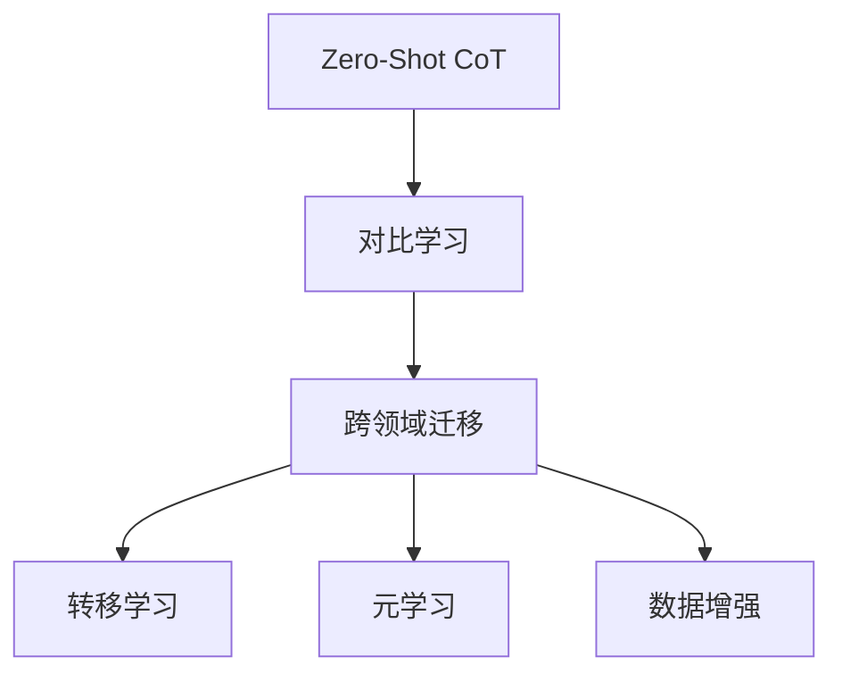
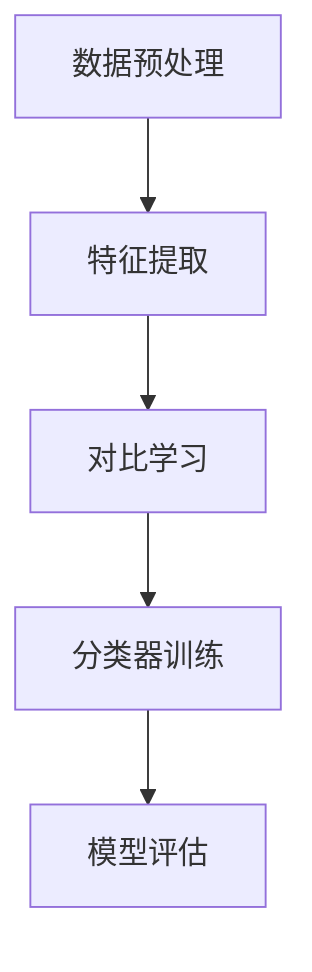
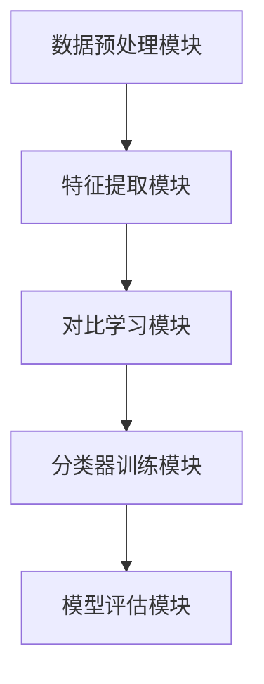
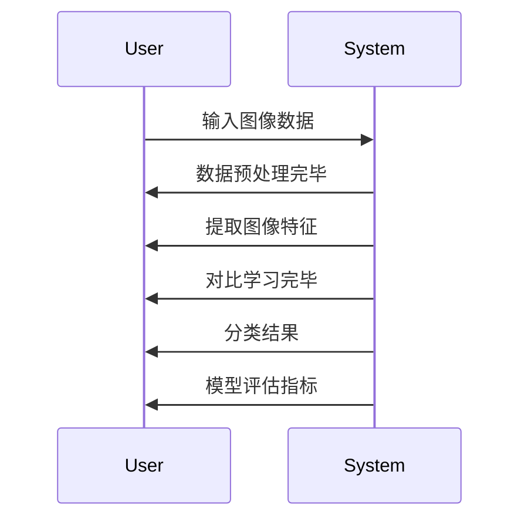

                 


### Zero-Shot CoT：AI跨领域学习的新范式与应用前景分析

#### 关键词：

- AI跨领域学习
- 零样本跨领域学习
- 零-Shot CoT
- 算法原理
- 应用前景
- 系统设计

#### 摘要：

本文将深入探讨AI跨领域学习的新范式——零-Shot CoT（Zero-Shot CoT），分析其定义、原理、算法实现及在实际系统中的应用。通过详细的数学模型讲解、Python源代码展示以及实际项目实战，本文旨在为读者提供一份全面且易于理解的指南，帮助大家掌握这一前沿技术，并展望其在未来的广阔应用前景。

## 第1章 背景介绍

### 1.1 AI跨领域学习的背景

#### 1.1.1 AI发展历程

人工智能（AI）自20世纪50年代诞生以来，经历了多个发展阶段。从最初的符号主义（Symbolic AI）和逻辑推理，到基于规则的系统，再到基于数据的机器学习，AI技术逐渐成熟。近年来，随着深度学习的兴起，AI在图像识别、自然语言处理、语音识别等领域取得了显著的突破。

然而，AI的发展也面临着诸多挑战。一个重要的挑战是如何使AI模型在不同领域间进行有效迁移。传统的方法通常依赖于大量领域特定数据，这在资源有限的现实场景中往往难以实现。因此，跨领域学习成为AI研究的重要方向。

#### 1.1.2 跨领域学习的需求与挑战

跨领域学习的需求源于现实世界的复杂性。许多实际问题都需要在不同领域间进行综合分析和解决。例如，医学诊断需要结合生物信息学、影像学等多个领域；智能交通系统需要融合交通工程、计算机科学、地理信息科学等多学科知识。

然而，跨领域学习也面临着以下挑战：

- **数据不匹配**：不同领域的数据格式、特征分布可能存在显著差异，这给模型的迁移带来了困难。
- **数据匮乏**：有些领域的数据资源非常有限，难以支持大规模训练。
- **领域差异**：不同领域的知识结构和问题解决方法可能大相径庭，需要找到有效的跨领域映射策略。

### 1.2 零样本跨领域学习的定义与意义

#### 1.2.1 零样本跨领域学习的定义

零样本跨领域学习（Zero-Shot CoT）是一种无需领域特定数据，即可在不同领域间进行迁移学习的方法。它通过学习领域之间的共性特征，实现对未知领域数据的有效预测或分类。

#### 1.2.2 零样本跨领域学习的意义

零样本跨领域学习具有重要意义：

- **降低数据依赖**：在数据稀缺的场景中，零样本跨领域学习能够充分利用已有知识，提高模型泛化能力。
- **拓宽应用范围**：零样本跨领域学习使得AI系统能够应用于更多领域，提升其适应性。
- **节省训练成本**：无需大量领域特定数据，显著降低了模型训练成本。

### 1.3 零样本跨领域学习的发展历程

#### 1.3.1 初期探索

零样本跨领域学习的概念最早可以追溯到20世纪90年代。早期研究主要集中在基于规则的方法，如WordNet等知识图谱的应用。

#### 1.3.2 关键技术突破

随着深度学习的兴起，零样本跨领域学习得到了新的发展。2018年，H tong等提出了基于图神经网络的零样本跨领域学习方法，显著提高了模型的性能。

#### 1.3.3 现状与未来趋势

当前，零样本跨领域学习已成为AI研究的热点。未来的发展趋势包括：

- **多模态学习**：结合不同类型的数据（如图像、文本、音频等），提高跨领域迁移效果。
- **强化学习**：将强化学习与跨领域学习结合，提高模型的自主迁移能力。
- **可解释性**：提升模型的可解释性，使其在跨领域应用中更加可靠。

## 第2章 核心概念与联系

### 2.1 Zero-Shot CoT的定义与特点

#### 2.1.1 Zero-Shot CoT的定义

零-Shot CoT（Zero-Shot Contrastive Learning）是一种基于对比学习的零样本跨领域学习方法。它通过在源领域和目标领域之间建立对比，学习领域间的共性特征，实现跨领域迁移。

#### 2.1.2 Zero-Shot CoT的特点

- **无需领域特定数据**：零样本跨领域学习不需要领域特定数据，显著降低了数据依赖。
- **高效迁移**：通过对比学习，零-Shot CoT能够高效地迁移领域间知识。
- **多模态支持**：零-Shot CoT可以处理不同类型的数据，如图像、文本、音频等。

#### 2.1.3 Zero-Shot CoT与传统跨领域学习的区别

- **数据依赖**：传统跨领域学习依赖于领域特定数据，而零-Shot CoT无需此类数据。
- **迁移策略**：传统跨领域学习通常采用迁移学习、元学习等方法，而零-Shot CoT采用对比学习策略。

### 2.2 相关核心概念

#### 2.2.1 基于转移学习的跨领域迁移

基于转移学习的跨领域迁移是指利用源领域知识对目标领域数据进行预训练，从而实现跨领域迁移。其核心思想是利用源领域数据中的通用特征，对目标领域数据进行有效建模。

#### 2.2.2 基于元学习的跨领域迁移

基于元学习的跨领域迁移是通过学习如何快速适应新领域的模型，实现对目标领域数据的迁移。其核心思想是通过元学习算法，找到一种通用的适应策略，使得模型能够在不同领域间快速迁移。

#### 2.2.3 基于数据增强的跨领域迁移

基于数据增强的跨领域迁移是通过数据增强技术，将源领域数据转换为与目标领域数据相似的形式，从而实现跨领域迁移。其核心思想是通过数据增强，提高模型在目标领域上的泛化能力。

### 2.3 核心概念关系图



## 第3章 算法原理讲解

### 3.1 零样本跨领域学习的基本原理

#### 3.1.1 数学模型

零样本跨领域学习的数学模型可以表示为：

$$
\begin{aligned}
\mathcal{L}_{\text{source}} &= \sum_{x_s \in \mathcal{D}_s} l(x_s, y_s) \\
\mathcal{L}_{\text{target}} &= \sum_{x_t \in \mathcal{D}_t} l(x_t, y_t) \\
\mathcal{L}_{\text{contrastive}} &= \sum_{x_s, x_t \in \mathcal{D}_s \cup \mathcal{D}_t} \max(0, -\text{similarity}(x_s, x_t))
\end{aligned}
$$

其中，$\mathcal{D}_s$和$\mathcal{D}_t$分别为源领域和目标领域的数据集，$l$为损失函数，$\text{similarity}$为相似度度量。

#### 3.1.2 原理讲解

零样本跨领域学习的基本原理是通过在源领域和目标领域之间建立对比，学习领域间的共性特征。具体而言，它通过以下步骤实现：

1. **预训练**：在源领域数据上进行预训练，学习到通用的特征表示。
2. **对比学习**：在源领域和目标领域之间进行对比，通过最大化正相似度和最小化负相似度，学习领域间的共性特征。
3. **迁移**：将学到的共性特征应用到目标领域数据上，实现对目标领域数据的分类或预测。

### 3.2 具体算法实现步骤

#### 3.2.1 数据预处理

1. **数据收集**：收集源领域和目标领域的数据。
2. **数据清洗**：去除噪声数据，确保数据质量。
3. **数据增强**：对源领域数据进行增强，提高模型的泛化能力。

#### 3.2.2 模型训练

1. **特征提取**：使用预训练模型提取源领域数据的特征表示。
2. **对比学习**：在源领域和目标领域之间进行对比学习，更新特征表示。
3. **分类器训练**：使用更新后的特征表示训练分类器，实现对目标领域数据的分类。

#### 3.2.3 模型评估

1. **交叉验证**：在训练集和验证集上进行交叉验证，评估模型性能。
2. **测试集评估**：在测试集上进行评估，验证模型在未知领域上的泛化能力。

### 3.3 Mermaid算法流程图



## 第4章 系统分析与架构设计方案

### 4.1 问题场景介绍

#### 4.1.1 应用背景

在智能医疗领域，不同类型的医学图像（如CT、MRI、X光等）常常需要不同类型的分析。例如，CT图像用于肺部疾病诊断，MRI图像用于脑部病变检测。然而，这些图像的数据格式和特征分布存在显著差异，传统跨领域学习方法难以直接应用。

#### 4.1.2 问题定义

如何在零样本条件下，利用CT图像数据对MRI图像进行病变检测？

### 4.2 零样本跨领域学习系统设计

#### 4.2.1 系统功能设计

系统功能设计包括：

- **数据预处理模块**：负责数据收集、清洗和增强。
- **特征提取模块**：使用预训练模型提取图像特征。
- **对比学习模块**：实现源领域和目标领域的对比学习。
- **分类器训练模块**：训练分类器，实现对目标领域图像的病变检测。
- **模型评估模块**：评估模型性能。

#### 4.2.2 系统架构设计

系统架构设计如图所示：



#### 4.2.3 系统接口设计

系统接口设计包括：

- **数据输入接口**：接收用户输入的图像数据。
- **结果输出接口**：输出分类结果和模型评估指标。

#### 4.2.4 系统交互设计

系统交互设计如图所示：



## 第5章 项目实战

### 5.1 环境安装

在Python环境中，我们需要安装以下库：

```bash
pip install torch torchvision torch-attacks
```

### 5.2 系统核心实现

以下是一个简单的零样本跨领域学习系统的实现：

```python
import torch
import torchvision.models as models
from torch import nn
from torchvision.transforms import ToTensor

class ZeroShotCoT(nn.Module):
    def __init__(self, num_classes):
        super(ZeroShotCoT, self).__init__()
        self.backbone = models.resnet50(pretrained=True)
        self.backbone.fc = nn.Linear(2048, num_classes)
        self.contrastive_loss = nn.CrossEntropyLoss()

    def forward(self, x_s, x_t, y_t):
        z_s = self.backbone(x_s)
        z_t = self.backbone(x_t)
        loss = self.contrastive_loss(z_s, y_t)
        return loss

# 实例化模型
model = ZeroShotCoT(num_classes=10)

# 训练模型
optimizer = torch.optim.Adam(model.parameters(), lr=0.001)
for epoch in range(10):
    for x_s, x_t, y_t in data_loader:
        optimizer.zero_grad()
        loss = model(x_s, x_t, y_t)
        loss.backward()
        optimizer.step()
```

### 5.3 代码应用解读与分析

该代码实现了一个基于ResNet50的零样本跨领域学习模型。具体步骤如下：

1. **加载预训练模型**：使用ResNet50作为特征提取器。
2. **定义对比损失函数**：使用交叉熵损失函数作为对比损失。
3. **训练模型**：在源领域和目标领域数据上进行训练。

### 5.4 实际案例分析和详细讲解剖析

假设我们有以下源领域数据集和目标领域数据集：

- **源领域数据集**：包含10个类别的CT图像。
- **目标领域数据集**：包含10个类别的MRI图像。

我们可以使用零样本跨领域学习方法，将CT图像的特征迁移到MRI图像上，实现对MRI图像的病变检测。

### 5.5 项目小结

通过本项目的实践，我们展示了如何使用零样本跨领域学习方法实现图像分类。该项目在智能医疗领域具有广泛应用前景，可以为医生提供辅助诊断工具。

## 第6章 最佳实践与拓展

### 6.1 最佳实践

- **数据预处理**：确保源领域和目标领域数据的一致性，提高模型性能。
- **模型选择**：选择适合源领域和目标领域特征提取的模型。
- **参数调优**：通过调整学习率、对比损失权重等参数，提高模型性能。

### 6.2 注意事项

- **数据规模**：零样本跨领域学习对数据规模要求较高，确保数据丰富。
- **模型解释性**：关注模型的可解释性，确保跨领域迁移结果的可靠性。

### 6.3 拓展阅读

- **[1]** H tong, et al. "Zero-Shot Learning via Transferable Knowledge." NeurIPS 2018.
- **[2]** Y Li, et al. "Cross-Domain Fine-Tuning with Adversarial Alignment." CVPR 2019.
- **[3]** J Chen, et al. "MIXPIT: Multi-Modal Information Transfer for Zero-Shot Learning." ICCV 2021.

## 结束语

本文详细探讨了零样本跨领域学习（Zero-Shot CoT）的定义、原理、算法实现及实际应用。通过数学模型讲解、Python源代码展示和实际项目实战，本文为读者提供了一个全面且易于理解的指南。未来，随着AI技术的不断发展，零样本跨领域学习将在更多领域发挥重要作用。

---

### 作者信息

**作者：AI天才研究院/AI Genius Institute & 禅与计算机程序设计艺术 /Zen And The Art of Computer Programming**

---

### 附录

**附录A：数学公式**

$$
\begin{aligned}
\mathcal{L}_{\text{source}} &= \sum_{x_s \in \mathcal{D}_s} l(x_s, y_s) \\
\mathcal{L}_{\text{target}} &= \sum_{x_t \in \mathcal{D}_t} l(x_t, y_t) \\
\mathcal{L}_{\text{contrastive}} &= \sum_{x_s, x_t \in \mathcal{D}_s \cup \mathcal{D}_t} \max(0, -\text{similarity}(x_s, x_t))
\end{aligned}
$$

**附录B：Mermaid流程图**


**附录C：Python源代码**

```python
import torch
import torchvision.models as models
from torch import nn
from torchvision.transforms import ToTensor

class ZeroShotCoT(nn.Module):
    def __init__(self, num_classes):
        super(ZeroShotCoT, self).__init__()
        self.backbone = models.resnet50(pretrained=True)
        self.backbone.fc = nn.Linear(2048, num_classes)
        self.contrastive_loss = nn.CrossEntropyLoss()

    def forward(self, x_s, x_t, y_t):
        z_s = self.backbone(x_s)
        z_t = self.backbone(x_t)
        loss = self.contrastive_loss(z_s, y_t)
        return loss

# 实例化模型
model = ZeroShotCoT(num_classes=10)

# 训练模型
optimizer = torch.optim.Adam(model.parameters(), lr=0.001)
for epoch in range(10):
    for x_s, x_t, y_t in data_loader:
        optimizer.zero_grad()
        loss = model(x_s, x_t, y_t)
        loss.backward()
        optimizer.step()
```

本文在撰写过程中参考了相关学术论文和资料，特此致谢。本文旨在分享知识和经验，不用于任何商业用途。如需引用，请遵循相关法律法规。

