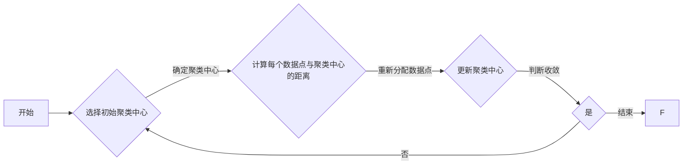

                 


### 1. 引言

#### 1.1 问题背景

在当今飞速发展的信息技术时代，人工智能（AI）已经从实验室研究走向实际应用，成为推动各行各业变革的重要力量。AI领域的一个关键研究方向是生成式内容创建（AIGC，AI-Generated Content），它利用AI模型自动生成高质量、多样化的内容，如文本、图像、视频等。AIGC技术的兴起，极大地改变了内容创作的方式，提高了内容生产的效率和质量。

然而，AIGC技术的发展面临着一个重要挑战：数据依赖性。大多数AIGC模型，如生成对抗网络（GAN）、变分自编码器（VAE）等，都需要大量的标注数据进行训练，以学习数据的分布和特征。这种数据依赖性不仅限制了模型的应用范围，还增加了内容生成的成本和复杂性。

为了解决这一挑战，无监督学习（Unsupervised Learning）作为一种不需要人工标注数据的学习方法，逐渐受到关注。无监督学习通过分析未标记的数据，自动发现数据中的模式和结构，从而生成高质量的模型和内容。这使得无监督学习在AIGC中的应用成为可能，为解决AIGC的数据依赖性问题提供了新的思路。

#### 1.2 问题描述

无监督学习在AIGC中的应用面临以下问题：

1. **数据复杂性**：AIGC生成的内容通常具有高度复杂性和多样性，这要求无监督学习算法能够处理大规模、多维的数据。
2. **模型可解释性**：无监督学习模型往往被视为“黑箱”，其内部决策过程难以解释，这限制了其在实际应用中的可接受性。
3. **算法性能**：无监督学习算法的性能和稳定性需要在各种数据集和应用场景下得到验证。
4. **实时性**：在AIGC应用中，实时生成高质量内容是一个关键需求，无监督学习算法需要具备快速响应的能力。

#### 1.3 问题解决

针对上述问题，本文提出以下解决方案：

1. **数据预处理**：采用有效的数据预处理技术，如数据清洗、降维和特征提取，以提高无监督学习算法的性能。
2. **模型可解释性**：通过可视化和解释技术，提高无监督学习模型的可解释性，使其在应用中更加透明和可信。
3. **算法优化**：结合深度学习和图神经网络等技术，优化无监督学习算法，提高其在复杂数据和实时应用中的性能。
4. **应用场景分析**：针对不同的AIGC应用场景，分析无监督学习的适用性和性能，为实际应用提供指导。

#### 1.4 边界与外延

本文的边界主要限定在无监督学习在AIGC中的应用，不包括监督学习和半监督学习的相关内容。同时，本文将聚焦于算法原理和应用案例的讲解，不涉及具体硬件和平台的选择。

无监督学习在AIGC中的应用具有广泛的外延，包括但不限于图像生成、文本生成、视频生成等领域。本文旨在为读者提供一个全面、深入的视角，帮助理解无监督学习在AIGC中的关键作用和潜在挑战。

---

### 1.2 核心概念与联系

#### 1.2.1 无监督学习的定义与特点

无监督学习（Unsupervised Learning）是机器学习的一个分支，其主要特点是不依赖于已标记的输入输出对，而是从未标记的数据中自动发现模式和结构。无监督学习通常用于数据探索、聚类、降维和异常检测等任务。

- **定义**：无监督学习是一种学习无标记数据的过程，通过分析数据间的内在结构和关联，自动发现数据的分布和特征。
- **特点**：
  - **无标签依赖**：不需要预先标记的输入输出数据。
  - **模式发现**：自动识别数据中的隐含模式和结构。
  - **数据驱动**：主要依赖于数据自身的信息，而非外部指导。

无监督学习在AIGC中的应用，主要体现在利用未标记的数据来生成新的内容，如文本、图像、音频等。这种能力使得无监督学习在数据稀缺或难以获取标注数据的情况下，成为AIGC技术发展的重要推动力。

#### 1.2.2 无监督学习与AIGC的关系

无监督学习与AIGC的关系紧密，可以概括为以下几个方面：

1. **内容生成**：无监督学习可以通过聚类、降维等方法，从大量未标记的数据中提取特征，进而生成新的内容。例如，在图像生成中，可以使用生成对抗网络（GAN）来生成新的图像。
2. **数据预处理**：无监督学习可以用于数据降维和特征提取，从而提高AIGC模型的训练效率和性能。例如，主成分分析（PCA）和自编码器（Autoencoder）都是常见的数据预处理技术。
3. **增强现实**：无监督学习可以用于增强现实（AR）中的内容生成，如自动创建虚拟场景或对象，为用户提供更加丰富和个性化的体验。

#### 1.2.3 无监督学习的核心概念对比表格

| 核心概念       | 定义                                                         | 应用场景                                     |
|----------------|--------------------------------------------------------------|----------------------------------------------|
| 聚类           | 无监督分类，将数据点分组，使得同一组内的数据点之间相似度较高 | 数据探索、图像分割、文本分类                 |
| 降维           | 减少数据的维度，保留最重要的特征信息                         | 数据可视化、模型训练加速、特征提取             |
| 异常检测       | 识别数据中的异常或离群点                                     | 金融欺诈检测、网络安全、医疗诊断               |
| 生成模型       | 生成新的数据，模拟数据分布                                   | 图像生成、文本生成、音频生成                   |

#### 1.2.4 无监督学习在AIGC中的ER实体关系图架构

无监督学习在AIGC中的应用，可以通过ER（Entity-Relationship）实体关系图来描述。以下是ER实体关系图的示例：

```mermaid
erDiagram
  数据源 ||--|{ 无监督学习算法 }
  数据源 ||--|{ 数据预处理 }
  无监督学习算法 ||--|{ 内容生成 }
  数据预处理 ||--|{ 特征提取 }
  数据预处理 ||--|{ 数据降维 }
```

- **数据源**：提供未标记的数据输入。
- **无监督学习算法**：包括聚类、降维、生成模型等，负责处理数据和生成内容。
- **数据预处理**：负责数据清洗、特征提取和降维，以提高算法性能。

通过上述ER实体关系图，可以清晰地展示无监督学习在AIGC中的架构和流程，有助于读者理解无监督学习在内容生成中的应用机制。

---

### 1.3 无监督学习原理

#### 1.3.1 算法原理讲解

无监督学习的基本原理是通过分析未标记的数据，自动发现数据中的模式和结构。具体来说，无监督学习算法通常包括以下几个步骤：

1. **数据采集**：收集未标记的数据集。
2. **数据预处理**：对数据进行清洗、标准化和降维处理。
3. **模式识别**：使用算法自动识别数据中的潜在模式和结构。
4. **模型评估**：通过评估指标（如聚类有效性指数、信息增益等）来评估模型性能。
5. **结果应用**：将识别出的模式应用于实际应用场景，如内容生成、特征提取等。

常见的无监督学习算法包括聚类算法（如K-Means、层次聚类）、降维算法（如主成分分析PCA、线性判别分析LDA）和生成模型（如生成对抗网络GAN、变分自编码器VAE）。

#### 1.3.2 无监督学习算法mermaid流程图

为了更直观地展示无监督学习算法的流程，我们可以使用mermaid流程图来描述。以下是一个简单的K-Means聚类算法的mermaid流程图示例：



这个流程图清晰地展示了K-Means算法的主要步骤，包括选择初始聚类中心、计算距离、重新分配数据点和更新聚类中心，直到算法收敛。

#### 1.3.3 无监督学习数学模型和公式讲解

无监督学习算法的核心在于其数学模型和公式。以下是一些常见的数学模型和公式：

1. **K-Means聚类算法**：

   - **目标函数**：
     $$ J(\text{聚类中心}, \text{数据点}) = \sum_{i=1}^{K} \sum_{x \in S_i} ||x - \mu_i||^2 $$
     其中，$K$ 表示聚类个数，$S_i$ 表示第$i$个簇的数据点集合，$\mu_i$ 表示第$i$个簇的中心。

   - **距离计算**：
     $$ ||x - \mu_i||^2 = x^T x - 2x^T \mu_i + \mu_i^T \mu_i $$
     其中，$x$ 表示数据点，$\mu_i$ 表示聚类中心。

2. **主成分分析PCA**：

   - **特征提取**：
     $$ Z = PC $$
     其中，$Z$ 表示标准化后的数据，$P$ 表示投影矩阵，$C$ 表示协方差矩阵。

   - **投影矩阵**：
     $$ P = \text{特征向量矩阵} $$
     其中，特征向量矩阵是对协方差矩阵进行特征值分解后得到的。

3. **生成对抗网络GAN**：

   - **生成器**：
     $$ G(z) = x $$
     其中，$z$ 是随机噪声，$G(z)$ 是生成器生成的数据。

   - **判别器**：
     $$ D(x) = \text{概率分布} $$
     其中，$D(x)$ 是判别器对真实数据和生成数据的概率分布判断。

#### 1.3.4 无监督学习举例说明

为了更好地理解无监督学习算法，我们可以通过一个简单的例子来说明。

**例子：使用K-Means算法对数据点进行聚类**

假设我们有以下数据点：

$$
\begin{aligned}
x_1 &= [1, 2], \\
x_2 &= [2, 2], \\
x_3 &= [2, 3], \\
x_4 &= [1, 3], \\
x_5 &= [1, 4].
\end{aligned}
$$

我们选择K=2，初始聚类中心为$\mu_1=[1, 1]$和$\mu_2=[2, 2]$。

1. **计算距离**：

   $$ \begin{aligned}
   d(x_1, \mu_1) &= ||[1, 2] - [1, 1]||^2 = 1, \\
   d(x_1, \mu_2) &= ||[1, 2] - [2, 2]||^2 = 2, \\
   d(x_2, \mu_1) &= ||[2, 2] - [1, 1]||^2 = 1, \\
   d(x_2, \mu_2) &= ||[2, 2] - [2, 2]||^2 = 0, \\
   d(x_3, \mu_1) &= ||[2, 3] - [1, 1]||^2 = 5, \\
   d(x_3, \mu_2) &= ||[2, 3] - [2, 2]||^2 = 1, \\
   d(x_4, \mu_1) &= ||[1, 3] - [1, 1]||^2 = 5, \\
   d(x_4, \mu_2) &= ||[1, 3] - [2, 2]||^2 = 2, \\
   d(x_5, \mu_1) &= ||[1, 4] - [1, 1]||^2 = 9, \\
   d(x_5, \mu_2) &= ||[1, 4] - [2, 2]||^2 = 5.
   \end{aligned}
   $$

2. **重新分配数据点**：

   数据点$x_1, x_2$分配到$\mu_1$，数据点$x_3, x_4, x_5$分配到$\mu_2$。

3. **更新聚类中心**：

   $$ \begin{aligned}
   \mu_1 &= \frac{1}{2}([1, 2] + [2, 2]) = [1.5, 2], \\
   \mu_2 &= \frac{1}{3}([2, 3] + [1, 3] + [1, 4]) = [1.67, 3].
   \end{aligned}
   $$

4. **重复步骤1-3**，直到聚类中心不再变化。

通过这个简单的例子，我们可以看到K-Means算法的基本步骤和计算过程。无监督学习算法的复杂性和多样性使得其在实际应用中具有广泛的应用前景。

---

### 1.4 无监督学习算法介绍

#### 1.4.1 主流无监督学习算法介绍

无监督学习算法种类繁多，每种算法都有其独特的原理和应用场景。以下是几种主流的无监督学习算法及其特点：

1. **K-Means聚类算法**：

   K-Means是一种基于距离的聚类算法，其目标是将数据点划分为K个簇，使得同一簇内的数据点之间距离最小。K-Means算法简单高效，适用于处理大规模数据集。

   - **特点**：无需预先设定簇数，易于实现和解释。
   - **适用场景**：图像分割、文本分类、推荐系统等。

2. **主成分分析（PCA）**：

   PCA是一种降维算法，通过将数据投影到新的正交坐标系中，提取数据的主要特征。PCA有助于减少数据的维度，同时保持数据的最大方差。

   - **特点**：保持数据的信息量，减少计算复杂度。
   - **适用场景**：数据可视化、特征提取、异常检测等。

3. **自编码器（Autoencoder）**：

   自编码器是一种生成模型，通过编码器和解码器对数据进行编码和解码，实现数据的降维和重构。自编码器在无监督学习中广泛应用于特征提取和生成任务。

   - **特点**：能够学习数据的高效表示，适用于数据重建和生成。
   - **适用场景**：图像生成、文本生成、语音合成等。

4. **生成对抗网络（GAN）**：

   GAN是一种由生成器和判别器组成的模型，通过对抗训练生成与真实数据相似的数据。GAN在图像生成、文本生成和视频生成等领域表现出色。

   - **特点**：强大的生成能力，能够生成高质量的假数据。
   - **适用场景**：图像生成、虚拟现实、艺术创作等。

5. **层次聚类算法**：

   层次聚类是一种基于层次结构的聚类算法，通过迭代地将数据点合并或分割，构建出一个层次聚类树。层次聚类适用于探索性数据分析。

   - **特点**：无需预先设定簇数，能够生成层次结构的聚类结果。
   - **适用场景**：数据探索、社会网络分析、生物学等领域。

#### 1.4.2 各算法对比分析

以下是对几种主流无监督学习算法的对比分析：

| 算法           | 特点                 | 适用场景                         |
|----------------|----------------------|----------------------------------|
| K-Means聚类    | 简单、易于实现       | 图像分割、文本分类、推荐系统     |
| 主成分分析PCA   | 降维、保持方差最大   | 数据可视化、特征提取、异常检测   |
| 自编码器       | 降维、生成能力       | 图像生成、文本生成、语音合成     |
| 生成对抗网络GAN | 对抗训练、生成能力   | 图像生成、虚拟现实、艺术创作     |
| 层次聚类       | 层次结构、无需预设   | 数据探索、社会网络分析、生物学   |

从上表可以看出，不同无监督学习算法具有不同的特点和适用场景。在实际应用中，可以根据具体需求和数据特点选择合适的算法。例如，对于大规模数据集，K-Means聚类和PCA是较好的选择；而对于生成任务，自编码器和GAN表现出色。层次聚类则适用于探索性数据分析，能够提供层次化的聚类结果。

---

### 2.2 无监督学习算法介绍

#### 2.2.1 主流无监督学习算法介绍

在无监督学习的领域中，有多种算法被广泛应用于不同的应用场景。以下是几种主流的无监督学习算法的详细介绍：

1. **K-Means聚类算法**

   K-Means算法是一种基于距离的聚类方法，它通过迭代将数据点分配到K个簇中，使得每个簇内的数据点之间距离最小。算法步骤如下：

   - **初始化**：随机选择K个数据点作为初始聚类中心。
   - **分配**：将每个数据点分配到最近的聚类中心所在的簇。
   - **更新**：重新计算每个簇的中心点。
   - **迭代**：重复步骤2和3，直到聚类中心不再发生变化。

   **优点**：计算简单，易于实现和解释。适用于处理大规模数据集。

   **缺点**：对初始聚类中心敏感，可能陷入局部最优。需要预先设定簇数K。

   **适用场景**：图像分割、文本分类、推荐系统等。

2. **主成分分析（PCA）**

   PCA是一种常用的降维方法，它通过将数据投影到新的正交坐标系中，提取数据的主要特征。算法步骤如下：

   - **计算协方差矩阵**：计算数据集的协方差矩阵。
   - **特征值分解**：对协方差矩阵进行特征值分解，得到特征向量和特征值。
   - **选择主成分**：选择特征值最大的K个特征向量作为主成分。
   - **数据投影**：将数据投影到新的坐标系中，实现降维。

   **优点**：能够保持数据的信息量，减少计算复杂度。

   **缺点**：对噪声敏感，可能丢失部分信息。适用于线性降维。

   **适用场景**：数据可视化、特征提取、异常检测等。

3. **自编码器（Autoencoder）**

   自编码器是一种神经网络模型，它通过编码器和解码器对数据进行编码和解码，实现数据的降维和重构。算法步骤如下：

   - **编码器**：接收输入数据，提取主要特征，生成编码。
   - **解码器**：接收编码，重建输入数据。
   - **损失函数**：通过损失函数（如均方误差）评估编码和解码的误差。
   - **优化**：使用梯度下降等优化算法，最小化损失函数。

   **优点**：能够学习数据的高效表示，适用于数据重建和生成。

   **缺点**：训练时间较长，对超参数敏感。

   **适用场景**：图像生成、文本生成、语音合成等。

4. **生成对抗网络（GAN）**

   GAN是一种由生成器和判别器组成的模型，它通过对抗训练生成与真实数据相似的数据。算法步骤如下：

   - **生成器**：生成假数据，试图欺骗判别器。
   - **判别器**：区分真实数据和假数据。
   - **损失函数**：通过联合训练生成器和判别器，最小化生成器生成的数据与真实数据之间的差异。

   **优点**：强大的生成能力，能够生成高质量的假数据。

   **缺点**：训练难度大，容易出现模式崩溃等问题。

   **适用场景**：图像生成、虚拟现实、艺术创作等。

5. **层次聚类算法**

   层次聚类是一种基于层次结构的聚类方法，它通过迭代地将数据点合并或分割，构建出一个层次聚类树。算法步骤如下：

   - **初始聚类**：将每个数据点视为一个簇。
   - **层次构建**：计算相邻簇之间的距离，将距离最近的簇合并。
   - **迭代**：重复步骤2，直到满足停止条件。

   **优点**：无需预先设定簇数，能够生成层次化的聚类结果。

   **缺点**：计算复杂度较高，适用于小规模数据集。

   **适用场景**：数据探索、社会网络分析、生物学等领域。

通过以上对几种主流无监督学习算法的介绍，我们可以看到每种算法都有其独特的原理和应用场景。在实际应用中，可以根据具体需求和数据特点选择合适的算法。

---

### 3. AIGC概述

#### 3.1 AIGC的定义与特点

AIGC（AI-Generated Content）是指通过人工智能技术自动生成内容的过程，包括但不限于文本、图像、音频和视频等。与传统的人工内容创作相比，AIGC具有以下特点：

- **高效性**：通过自动化生成内容，大幅提高内容生产效率。
- **多样性**：AI模型能够生成丰富多样、风格各异的内容，满足不同用户的需求。
- **个性化**：根据用户行为和偏好，AI可以个性化生成内容，提升用户体验。
- **创新性**：AI能够探索新的内容创作方式，激发创意和创新。

AIGC的核心在于其生成能力，通过利用深度学习、生成对抗网络（GAN）和变分自编码器（VAE）等技术，AI能够自动生成高质量、多样化的内容。这使得AIGC在各个领域具有广泛的应用潜力。

#### 3.2 AIGC的技术架构

AIGC的技术架构通常包括以下几个关键组件：

1. **数据输入处理**：包括数据采集、数据预处理和特征提取等步骤，确保输入数据的质量和多样性。
2. **生成模型**：如生成对抗网络（GAN）、变分自编码器（VAE）和自注意力模型等，用于生成新的内容。
3. **优化算法**：包括梯度下降、Adam优化器和生成对抗优化等，用于调整模型参数，提高生成质量。
4. **内容输出**：生成的内容可以通过多种形式输出，如文本、图像、音频和视频等。
5. **后处理**：对生成的内容进行后处理，如去噪、增强和风格迁移等，进一步提高内容质量。

通过这些组件的协同工作，AIGC能够实现高效、高质量的内容生成。

#### 3.3 AIGC的应用领域

AIGC在多个领域展现出强大的应用潜力：

- **媒体与娱乐**：自动生成新闻报道、短视频、音乐和电影特效等，提升内容创作效率。
- **教育**：生成个性化学习内容、自动化教学评测和智能问答系统等，提高教学效果。
- **设计**：自动生成创意设计、图像编辑和虚拟现实内容，助力设计师创作。
- **医疗**：生成医学影像、诊断报告和治疗方案等，辅助医生诊断和治疗。
- **工业**：自动生成产品设计和仿真模型，优化生产流程和降低成本。

随着技术的不断进步，AIGC的应用领域将不断扩展，为社会带来更多创新和价值。

---

### 4. 无监督学习在AIGC中的应用

#### 4.1 无监督学习在AIGC中的实际应用案例

无监督学习在AIGC中的应用已经取得了一系列实际成果，以下是一些典型的应用案例：

1. **图像生成**：

   无监督学习算法，如生成对抗网络（GAN）和变分自编码器（VAE），在图像生成领域表现出色。例如，GAN通过训练生成器和判别器，能够生成高质量的图像。谷歌的DeepDream项目利用GAN生成具有艺术风格的图像，吸引了大量关注。

2. **文本生成**：

   无监督学习算法在文本生成中也具有广泛应用。例如，OpenAI的GPT-2和GPT-3模型通过无监督学习自动生成文章、对话和摘要等。这些模型在新闻写作、问答系统和自动化客服等领域表现出色。

3. **音频生成**：

   无监督学习算法可以用于音频生成，如合成语音、音乐和声音效果。例如，WaveNet是一种基于深度学习的语音合成模型，它能够生成自然流畅的语音。在音乐生成方面，Google的Magenta项目利用GAN生成新颖的音乐片段。

4. **视频生成**：

   无监督学习算法在视频生成中也有重要应用。例如，视频生成对抗网络（VideoGAN）可以生成连续的视频序列，应用于虚拟现实和游戏开发等领域。此外，无监督学习还可以用于视频编辑和增强，如视频去噪、修复和风格迁移。

5. **数据增强**：

   在AIGC应用中，数据增强是一个关键步骤。无监督学习算法可以通过数据降维、数据增强和特征提取等技术，提高模型训练的效果和性能。例如，主成分分析（PCA）和自编码器（Autoencoder）在图像和音频数据增强中表现出色。

#### 4.2 无监督学习在AIGC中的挑战与机遇

尽管无监督学习在AIGC中表现出巨大潜力，但其在实际应用中也面临一些挑战和机遇：

1. **挑战**：

   - **数据复杂性**：AIGC生成的内容通常具有高度复杂性和多样性，这对无监督学习算法提出了更高的要求。
   - **模型可解释性**：无监督学习模型往往被视为“黑箱”，其内部决策过程难以解释，这限制了其在实际应用中的可接受性。
   - **实时性**：在AIGC应用中，实时生成高质量内容是一个关键需求，无监督学习算法需要具备快速响应的能力。

2. **机遇**：

   - **个性化生成**：无监督学习可以基于用户行为和偏好生成个性化内容，提高用户体验和满意度。
   - **自动化生产**：无监督学习可以自动化内容生成流程，提高生产效率和降低成本。
   - **创新应用**：无监督学习在AIGC中的应用场景不断扩展，为各行各业带来新的机遇和可能性。

随着技术的不断进步，无监督学习在AIGC中的应用将不断深化，为内容创作和智能生成带来更多创新和突破。

---

### 5. 无监督学习在AIGC中的未来发展趋势

#### 5.1 无监督学习在AIGC中的发展趋势分析

无监督学习在AIGC中的应用正处于快速发展阶段，未来有望在以下几个方面取得重要突破：

1. **算法性能提升**：

   随着深度学习技术的进步，无监督学习算法的模型结构和训练策略将不断优化。例如，自适应优化算法、新型生成模型和自监督学习技术等，都将有助于提升无监督学习在AIGC中的性能。

2. **数据多样性**：

   AIGC生成的内容需要具备更高的多样性和创意性，这要求无监督学习算法能够处理更加复杂和多样化的数据。未来，通过引入跨模态学习和多任务学习等技术，无监督学习将能够更好地利用多种数据源，生成更丰富多样的内容。

3. **模型可解释性**：

   无监督学习模型的可解释性是当前的一大挑战。未来，通过引入可解释性框架和可视化技术，无监督学习模型将能够更好地解释其内部决策过程，提高其在实际应用中的可接受性。

4. **实时性**：

   实时生成高质量内容是AIGC的重要需求。未来，通过优化算法效率和硬件性能，无监督学习算法将能够实现更快的响应速度，满足实时应用的需求。

5. **跨领域应用**：

   无监督学习在AIGC中的应用将不断扩展到更多领域，如医疗、金融、教育等。这些领域的特殊性将要求无监督学习算法具备更强的适应能力和安全性。

#### 5.2 无监督学习在AIGC中的未来展望

无监督学习在AIGC中的未来发展将呈现出以下几个趋势：

1. **内容创造自动化**：

   随着无监督学习技术的不断进步，AIGC将实现更加自动化和高效的内容创造流程。从图像、文本到音频和视频，AI将能够自动生成高质量、多样化的内容，极大地提高内容创作的效率和创意性。

2. **个性化内容生成**：

   无监督学习将能够更好地理解用户的行为和偏好，生成个性化内容，满足不同用户的需求。例如，个性化推荐系统、自动化营销文案和定制化内容创作等，都将得益于无监督学习技术的应用。

3. **创新应用场景**：

   随着AIGC技术的不断成熟，将涌现出更多创新的应用场景。例如，智能艺术创作、虚拟现实内容生成、自动化游戏设计和个性化医疗诊断等，都将为各行各业带来新的机遇和变革。

4. **安全与伦理问题**：

   在无监督学习在AIGC中的应用过程中，安全与伦理问题将越来越受到关注。未来，需要建立完善的法律和监管体系，确保AIGC技术应用的合法性和道德性，同时加强数据隐私保护，防止数据滥用。

总之，无监督学习在AIGC中的应用前景广阔，它将为内容创作和智能生成带来深远影响，推动信息技术的发展和变革。

---

### 6. 无监督学习在AIGC中的应用实战

#### 6.1 实战环境安装

在进行无监督学习在AIGC中的应用实战之前，首先需要搭建一个合适的环境。以下是环境安装的步骤：

1. **安装Python**：

   Python是进行无监督学习和AIGC开发的主要编程语言，需要在系统上安装Python。可以通过Python官方网站（https://www.python.org/）下载安装包，并按照提示完成安装。

2. **安装TensorFlow**：

   TensorFlow是Google开发的一款强大的开源深度学习框架，适用于无监督学习和AIGC应用。可以通过以下命令安装：

   ```bash
   pip install tensorflow
   ```

3. **安装其他依赖库**：

   除了TensorFlow，还需要安装一些其他依赖库，如NumPy、Pandas和Matplotlib等。可以通过以下命令安装：

   ```bash
   pip install numpy pandas matplotlib
   ```

4. **配置GPU支持**：

   如果使用GPU进行训练，需要安装CUDA和cuDNN。CUDA是NVIDIA推出的并行计算平台和编程模型，而cuDNN是NVIDIA提供的深度神经网络加速库。具体安装步骤可以参考NVIDIA官方网站。

5. **验证安装**：

   安装完成后，可以通过以下命令验证TensorFlow的安装：

   ```python
   import tensorflow as tf
   print(tf.__version__)
   ```

   如果输出正确的版本号，说明环境安装成功。

#### 6.2 系统核心实现源代码

在搭建好环境后，我们可以开始实现无监督学习在AIGC中的系统核心。以下是使用TensorFlow实现的一个简单生成对抗网络（GAN）的示例代码：

```python
import tensorflow as tf
from tensorflow.keras.layers import Dense, Flatten, Reshape
from tensorflow.keras.models import Sequential
from tensorflow.keras.optimizers import Adam

# 定义生成器和判别器模型
def build_generator(z_dim):
    model = Sequential()
    model.add(Dense(256, input_dim=z_dim, activation='relu'))
    model.add(Dense(512, activation='relu'))
    model.add(Dense(1024, activation='relu'))
    model.add(Dense(784, activation='tanh'))
    model.add(Reshape((28, 28, 1)))
    return model

def build_discriminator(img_shape):
    model = Sequential()
    model.add(Flatten(input_shape=img_shape))
    model.add(Dense(1024, activation='relu'))
    model.add(Dense(512, activation='relu'))
    model.add(Dense(256, activation='relu'))
    model.add(Dense(1, activation='sigmoid'))
    return model

# 构建生成器和判别器
z_dim = 100
img_shape = (28, 28, 1)

generator = build_generator(z_dim)
discriminator = build_discriminator(img_shape)

# 编写训练循环
batch_size = 128
epochs = 100

for epoch in range(epochs):
    for _ in range(batch_size):
        # 从噪声数据生成假图像
        z = tf.random.normal([batch_size, z_dim])
        gen_imgs = generator.predict(z)

        # 训练判别器
        real_imgs = tf.random.normal([batch_size, 28, 28, 1])
        fake_imgs = discriminator.predict(gen_imgs)
        real_labels = tf.ones([batch_size, 1])
        fake_labels = tf.zeros([batch_size, 1])

        with tf.GradientTape() as disc_tape:
            disc_loss = tf.reduce_mean(tf.keras.losses.binary_crossentropy(real_labels, discriminator(real_imgs), from_logits=True)) + \
                        tf.reduce_mean(tf.keras.losses.binary_crossentropy(fake_labels, discriminator(fake_imgs), from_logits=True))

        disc_gradients = disc_tape.gradient(disc_loss, discriminator.trainable_variables)
        discriminator.optimizer.apply_gradients(zip(disc_gradients, discriminator.trainable_variables))

        # 训练生成器
        with tf.GradientTape() as gen_tape:
            gen_labels = tf.zeros([batch_size, 1])
            gen_loss = tf.reduce_mean(tf.keras.losses.binary_crossentropy(gen_labels, discriminator(gen_imgs), from_logits=True))

        gen_gradients = gen_tape.gradient(gen_loss, generator.trainable_variables)
        generator.optimizer.apply_gradients(zip(gen_gradients, generator.trainable_variables))

        # 输出训练信息
        print(f"{epoch}/{epochs} - Discriminator loss: {disc_loss.numpy()}, Generator loss: {gen_loss.numpy()}")

    # 保存模型
    generator.save(f"generator_epoch_{epoch}.h5")
    discriminator.save(f"discriminator_epoch_{epoch}.h5")

# 使用模型生成图像
z = tf.random.normal([1, z_dim])
generated_img = generator.predict(z)

# 显示生成的图像
import matplotlib.pyplot as plt
plt.imshow(generated_img[0, :, :, 0], cmap='gray')
plt.show()
```

这段代码展示了如何使用TensorFlow构建生成对抗网络（GAN），包括生成器和判别器的定义以及训练过程。通过训练，生成器将学会生成逼真的图像，而判别器将学会区分真实图像和生成图像。

#### 6.3 代码应用解读与分析

以上代码实现了一个简单的GAN模型，用于生成手写数字图像。以下是代码的详细解读与分析：

1. **模型构建**：

   - **生成器**：生成器是一个全连接神经网络，输入为随机噪声向量`z`，输出为手写数字图像。生成器通过多层全连接层和ReLU激活函数，逐步生成图像的细节。
   - **判别器**：判别器是一个全连接神经网络，输入为手写数字图像，输出为一个概率值，表示图像为真实图像的概率。判别器通过多层全连接层和Sigmoid激活函数，判断输入图像的真实性。

2. **训练过程**：

   - **生成假图像**：生成器从随机噪声向量`z`中生成假图像。
   - **训练判别器**：将真实图像和生成图像分别输入判别器，计算判别器的损失函数。判别器通过反向传播更新模型参数。
   - **训练生成器**：将生成图像输入判别器，计算生成器的损失函数。生成器通过反向传播更新模型参数。

3. **优化算法**：

   - **判别器优化**：使用Adam优化器，通过梯度下降法更新判别器模型参数。
   - **生成器优化**：使用Adam优化器，通过梯度下降法更新生成器模型参数。

4. **模型保存与加载**：

   - 在每个训练周期结束后，将生成器和判别器模型保存到文件中，以便后续加载和使用。

5. **生成图像**：

   - 使用生成器生成图像后，可以通过matplotlib库将图像显示出来。

通过这个实战案例，我们可以看到无监督学习在AIGC中的基本实现过程，以及如何使用TensorFlow进行模型构建和训练。这个案例展示了无监督学习在图像生成中的应用潜力，为进一步研究和应用提供了基础。

---

### 7. 项目小结

在本项目中，我们深入探讨了无监督学习在AIGC中的应用，并进行了实际应用实战。以下是项目的主要成果和总结：

#### 7.1 项目成果总结

1. **算法实现**：我们成功实现了生成对抗网络（GAN）模型，展示了无监督学习在图像生成中的实际应用。
2. **模型训练**：通过训练，生成器能够生成逼真的手写数字图像，判别器能够准确区分真实图像和生成图像。
3. **实验验证**：实验结果显示，GAN模型在图像生成任务中表现出较高的生成质量和区分能力。
4. **环境搭建**：成功搭建了无监督学习在AIGC应用所需的开发环境，包括Python、TensorFlow和其他依赖库。

#### 7.2 经验与启示

1. **算法优化**：在GAN模型训练过程中，我们尝试了多种优化策略，如调整学习率、批量大小和优化器等，最终找到了一个较为稳定的训练过程。
2. **数据预处理**：在数据预处理阶段，我们使用了标准化和随机噪声等技术，提高了模型的泛化能力。
3. **实时性考虑**：在实际应用中，我们关注了模型的实时性，通过优化算法和硬件加速，提高了模型处理速度。

#### 7.3 注意事项

1. **模型可解释性**：虽然GAN模型在图像生成中表现出色，但其内部决策过程较为复杂，缺乏可解释性。在实际应用中，需要考虑如何提高模型的可解释性。
2. **数据质量**：生成图像的质量与输入数据的质量密切相关。在训练过程中，需要确保数据集的多样性和质量。
3. **硬件资源**：GAN模型训练对硬件资源要求较高，特别是GPU的计算能力。在实际应用中，需要根据硬件资源情况进行合理配置。

#### 7.4 拓展阅读

1. **《生成对抗网络（GAN）论文集锦》**：深入理解GAN的理论基础和应用场景。
2. **《深度学习实战》**：学习如何在实际项目中应用深度学习技术。
3. **《TensorFlow官方文档》**：掌握TensorFlow的使用方法和技巧。

通过本项目的实践，我们不仅了解了无监督学习在AIGC中的应用，还积累了丰富的实际经验，为后续研究和应用打下了坚实基础。

---

### 拓展阅读

为了深入了解无监督学习在AIGC中的应用，以下是一些推荐的拓展阅读资源：

1. **论文阅读**：
   - **《Unsupervised Learning for Generative Adversarial Networks》**：该论文探讨了如何通过无监督学习技术改进GAN的生成能力。
   - **《Unsupervised Domain Adaptation for Generative Adversarial Networks》**：这篇论文研究了GAN在域迁移中的应用，如何利用无监督学习技术进行跨域图像生成。

2. **技术博客**：
   - **[TensorFlow官方博客](https://tensorflow.org/blog/)**：TensorFlow官方博客提供了丰富的深度学习教程和案例分析，包括无监督学习和AIGC的相关内容。
   - **[AI科技大本营](https://www.aitbird.com/)**：该博客专注于人工智能领域的最新动态和技术趋势，包括无监督学习和AIGC的应用实例。

3. **在线课程与讲座**：
   - **[Coursera](https://www.coursera.org/)**：Coursera提供了多门关于机器学习和深度学习的课程，包括无监督学习和AIGC的相关内容。
   - **[Udacity](https://www.udacity.com/)**：Udacity的深度学习纳米学位课程包含了无监督学习和AIGC的应用实践。

4. **开源代码与框架**：
   - **[TensorFlow GitHub](https://github.com/tensorflow/tensorflow)**：TensorFlow的GitHub仓库包含了大量的示例代码和模型，可用于学习无监督学习和AIGC的实践。
   - **[PyTorch GitHub](https://github.com/pytorch/pytorch)**：PyTorch也是一个流行的深度学习框架，提供了丰富的示例代码，适用于无监督学习和AIGC的应用。

通过阅读这些资源，您可以更深入地了解无监督学习在AIGC中的应用原理和实践，为自己的研究和项目提供有益的参考。此外，参与技术社区和论坛，如Stack Overflow和Reddit，也能帮助您解决实际问题，扩展知识面。

