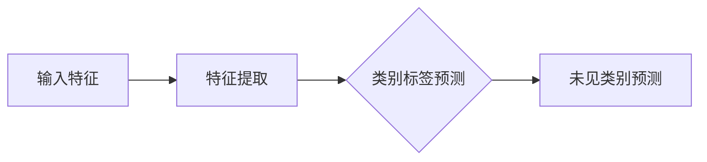
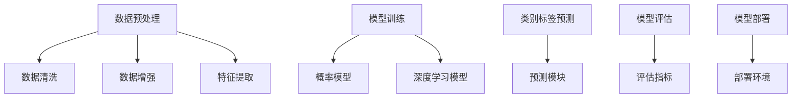
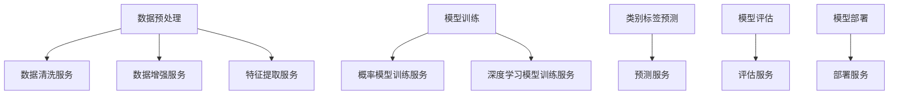
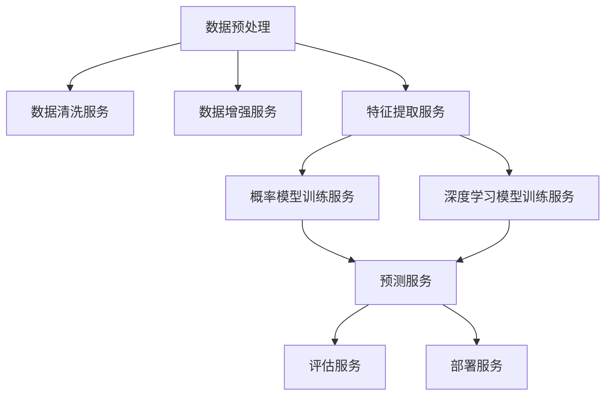
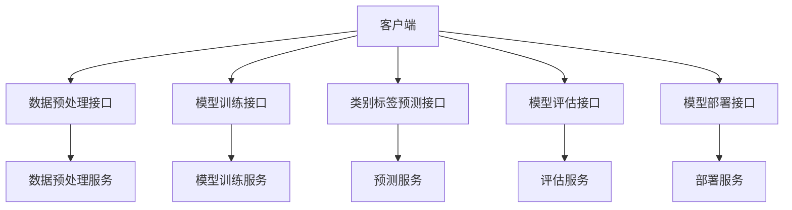
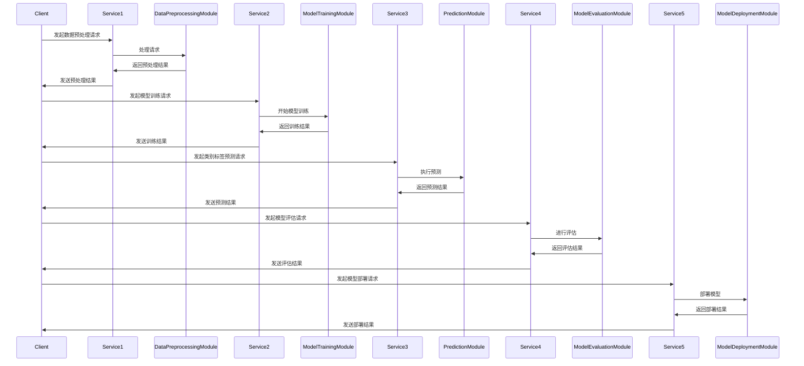

                 


## 第1章 引言

### 1.1 问题背景

#### 1.1.1 无示例数据的AI学习现状

在当今的AI领域中，机器学习模型的训练往往依赖于大量的标注数据。然而，在某些场景下，获取足够的标注数据变得极为困难，甚至不可能。例如，当面对新出现的问题或领域时，传统的有监督学习方法往往因为缺乏足够的训练数据而受限。此外，数据隐私和安全性的问题也使得收集和共享数据变得复杂。在这种背景下，无示例数据学习（Zero-Shot Learning, ZSL）作为一种新兴的学习范式，受到了广泛关注。

目前，虽然ZSL在特定领域（如图像识别、自然语言处理）取得了一定的进展，但整体而言，其效果仍然有限。首先，ZSL模型在处理新的、未见过的类别时，往往表现不佳。其次，大多数ZSL方法仍然高度依赖于预训练模型和大量的辅助数据。因此，当前的ZSL解决方案在许多实际应用中仍然面临诸多挑战。

#### 1.1.2 无示例数据的AI学习需求

随着AI技术的不断发展和应用场景的多样化，无示例数据学习的重要性日益凸显。在医疗诊断、金融风险评估、环境监测等领域，数据的获取和处理都存在一定的限制。例如，医疗数据的隐私保护使得医生无法直接获取患者的所有医疗信息；在金融领域，客户隐私和数据安全的要求也非常高。因此，无示例数据学习在这些领域中具有巨大的应用潜力。

此外，随着AI技术的普及，越来越多的非技术领域开始尝试应用AI。然而，这些领域往往缺乏足够的AI专业知识和数据资源。无示例数据学习可以降低对数据资源的依赖，使得AI技术更容易被这些领域所接受和应用。

#### 1.1.3 无示例数据的AI学习挑战

无示例数据的AI学习面临着诸多挑战。首先，数据依赖问题是一个关键挑战。传统机器学习模型依赖于大量标注数据，而在无示例数据学习中，我们往往无法获得足够的标注数据。这意味着，我们需要寻找新的方法来利用少量的数据，甚至无数据的情况下进行学习。

其次，学习效率与效果问题也是一个重要的挑战。在无示例数据学习中，模型需要从零开始学习，这往往导致学习过程更加复杂、耗时。同时，由于缺乏足够的训练数据，模型的泛化能力可能会受到影响，导致在实际应用中效果不佳。

最后，安全性与可靠性问题也是一个不容忽视的挑战。在无示例数据学习中，由于数据的不完整性和不确定性，模型可能更容易受到恶意攻击或产生错误的预测。因此，确保模型的安全性和可靠性是进行无示例数据学习的重要前提。

## 1.2 核心概念与联系

### 1.2.1 基本概念介绍

#### 1.2.1.1 零射击（Zero-Shot Learning）

零射击学习（Zero-Shot Learning, ZSL）是一种机器学习范式，旨在使模型能够在未见过的类别上进行预测。在传统机器学习中，模型需要通过大量的标注数据进行训练，以便在测试阶段能够准确预测未见过的数据。而ZSL则突破了这一限制，通过特定的算法和技术，使得模型可以在没有或只有很少的标注数据的情况下，对未见过的类别进行预测。

#### 1.2.1.2 CoT（Conceptual Blending）

概念融合（Conceptual Blending, CoT）是一种新兴的AI学习方法，它通过将不同的概念进行融合，从而生成新的概念。CoT的核心思想是，通过将不同领域的知识进行整合，使得模型能够更好地理解和应对复杂的问题。这种方法在无示例数据学习中具有很大的潜力，因为它可以减少对大量标注数据的依赖，同时提高模型的泛化能力。

#### 1.2.1.3 AI学习范式

AI学习范式是指AI模型在不同数据集和任务上的学习方式。传统的AI学习范式主要依赖于大量的标注数据，通过监督学习的方式进行训练。然而，随着AI技术的发展，越来越多的范式开始出现，如无监督学习、半监督学习、迁移学习等。这些范式在不同的应用场景中有着各自的优势和局限性。无示例数据学习作为一种新的学习范式，旨在解决传统范式在处理未见数据时的不足。

### 1.2.2 核心概念属性特征对比表格

| 概念       | 特点                                                         | 优势                                                         | 局限性                                                         |
|------------|--------------------------------------------------------------|--------------------------------------------------------------|--------------------------------------------------------------|
| 零射击（ZSL） | 能够在未见过的类别上进行预测                               | 减少对大量标注数据的依赖                                     | 对新类别识别效果有限，仍需大量预训练数据支持             |
| 概念融合（CoT） | 通过将不同领域的知识进行融合，生成新的概念                 | 提高模型的泛化能力，减少对大量标注数据的依赖               | 需要丰富的跨领域知识库支持，融合过程复杂               |
| AI学习范式  | 指AI模型在不同数据集和任务上的学习方式                     | 根据不同的应用场景，选择最合适的学习范式                     | 需要丰富的经验和专业知识，设计过程复杂               |

### 1.2.3 ER实体关系图架构

实体关系图（Entity-Relationship Diagram, ERD）是一种用于描述实体及其之间关系的图形化方法。在无示例数据学习中，ERD可以帮助我们更好地理解模型的结构和功能。

以下是一个简化的ERD示例，用于描述无示例数据学习模型中的关键实体和关系：

```mermaid
erDiagram
  Category ||--|{ Example : 有多种例子 }
  Concept ||--|{ Attribute : 有多种属性 }
  Model ||--|{ Category : 模型学习多种类别 }
  Model ||--|{ Concept : 模型融合多种概念 }
  Model ||--|{ Example : 模型利用例子进行学习 }
```

在这个ERD中，`Category`（类别）、`Concept`（概念）和`Example`（例子）是关键实体，它们之间的关系通过`Model`（模型）进行连接。这种结构有助于我们理解无示例数据学习模型如何通过融合不同的概念和例子，实现对未见类别的高效学习。

## 1.3 无示例数据的AI学习原理

### 1.3.1 算法原理讲解

无示例数据学习（Zero-Shot Learning, ZSL）是一种旨在使机器学习模型能够对未见过的类别进行预测的学习方法。ZSL的核心思想是，通过学习一种将输入特征映射到类别标签的函数，使得模型在未见过的类别上也能够进行准确的预测。

#### 1.3.1.1 算法流程图

以下是一个简化的ZSL算法流程图，用于描述ZSL的基本工作流程：



在这个流程图中，`A`表示输入特征，`B`表示特征提取，`C`表示类别标签预测，`D`表示未见类别预测。

1. **输入特征**：输入特征可以是图像、文本、音频等数据。这些特征需要通过特征提取模块（`B`）进行预处理，以便于后续的模型训练。

2. **特征提取**：特征提取模块（`B`）将输入特征转换为适合模型训练的形式。这通常涉及到一些预处理技术，如降维、特征选择等。

3. **类别标签预测**：在传统的机器学习中，类别标签预测（`C`）是一个核心步骤。通过学习输入特征和类别标签之间的关系，模型可以预测未知数据点的类别。在ZSL中，这个步骤同样重要，因为它是后续未见类别预测的基础。

4. **未见类别预测**：最后，模型利用学到的特征和类别标签之间的关系（`D`），对未见过的类别进行预测。这一步骤是ZSL的核心目标，也是ZSL与传统机器学习的最大区别。

#### 1.3.1.2 数学模型与公式

在ZSL中，常用的数学模型是基于概率模型或深度学习模型。以下是一个简化的概率模型示例：

$$
P(y|x) = \frac{P(x|y)P(y)}{P(x)}
$$

其中，$P(y|x)$表示在给定输入特征$x$的情况下，类别$y$的条件概率。$P(x|y)$和$P(y)$分别是特征$x$在给定类别$y$的条件概率和类别$y$的先验概率。

在深度学习中，常见的模型是卷积神经网络（CNN）或变换器模型（Transformer）。以下是一个简化的CNN模型示例：

$$
h_l = \sigma(W_l \cdot h_{l-1} + b_l)
$$

其中，$h_l$表示第$l$层的特征表示，$W_l$和$b_l$分别是权重和偏置，$\sigma$是激活函数。

#### 1.3.1.3 通俗易懂的举例说明

假设我们有一个动物分类任务，模型需要预测输入的图像是哪种动物。以下是ZSL的一个简单举例：

1. **输入特征**：输入是一个猫的图像。

2. **特征提取**：通过CNN模型，将猫的图像转换为特征向量，如 `[1, 2, 3, 4, 5]`。

3. **类别标签预测**：模型已经通过大量的猫、狗、鸟等动物的图像进行训练，学习到了不同类别图像的特征分布。例如，猫的特征分布为 `[1, 1, 2, 3, 4]`，狗的特征分布为 `[0, 1, 2, 3, 5]`。

4. **未见类别预测**：现在，模型需要预测一张未见过的图像是猫还是狗。通过计算输入特征和各类别特征分布之间的相似度，模型可以得出预测结果。例如，猫的特征分布与输入特征 `[1, 2, 3, 4, 5]` 的相似度最高，因此模型预测这张图像是猫。

这个例子虽然简化了ZSL的过程，但它展示了ZSL的基本原理。在实际应用中，ZSL需要处理更加复杂的数据和类别，但原理是相似的。

## 1.4 无示例数据的AI学习应用场景

### 1.4.1 应用场景一：图像识别

#### 1.4.1.1 场景介绍

图像识别是AI领域中一个重要且广泛应用的场景。在图像识别任务中，模型需要能够识别和分类图像中的物体。然而，传统的图像识别模型往往依赖于大量的标注数据。在实际应用中，尤其是在新领域或新场景下，获取足够的标注数据可能非常困难。因此，无示例数据学习（Zero-Shot Learning, ZSL）在图像识别中的应用具有重要意义。

#### 1.4.1.2 应用示例

以野生动物监测为例，假设我们希望使用AI技术来识别和保护野生动物。然而，由于野外环境的复杂性和野生动物的多样性，获取大量标注数据变得极为困难。此时，ZSL方法可以帮助我们实现这一目标。

以下是一个具体的ZSL应用示例：

1. **数据准备**：首先，我们收集了一部分野生动物的图像，并对这些图像进行标注，形成了一个小型的标注数据集。

2. **特征提取**：使用卷积神经网络（CNN）对标注数据集中的图像进行特征提取，得到每个图像的特征向量。

3. **类别标签预测**：通过训练一个基于概率的模型，如朴素贝叶斯分类器，来预测图像的类别标签。

4. **未见类别预测**：在得到模型后，我们可以对未见过的野生动物图像进行预测。模型会根据已学习的特征分布，对图像进行分类。

通过这个示例，我们可以看到ZSL在野生动物监测中的应用潜力。即使在缺乏大量标注数据的情况下，ZSL方法仍然可以帮助我们实现图像识别任务。

### 1.4.2 应用场景二：自然语言处理

#### 1.4.2.1 场景介绍

自然语言处理（Natural Language Processing, NLP）是AI领域中的另一个重要分支。在NLP中，模型需要能够理解和生成自然语言，如文本、语音等。传统的NLP模型通常依赖于大量的标注数据，例如词向量训练需要大量的文本数据。然而，在某些应用场景中，获取足够的标注数据可能同样困难。例如，当面对新的语言或方言时，传统的NLP模型可能无法胜任。因此，无示例数据学习（Zero-Shot Learning, ZSL）在NLP中的应用变得尤为重要。

#### 1.4.2.2 应用示例

以跨语言文本分类为例，假设我们希望开发一个系统能够自动分类来自不同语言的新闻文章。在这种情况下，获取大量标注数据可能非常困难，因为我们需要为每种语言都准备足够的训练数据。此时，ZSL方法可以帮助我们解决这一问题。

以下是一个具体的ZSL应用示例：

1. **数据准备**：首先，我们收集了一部分来自不同语言的新闻文章，并对这些文章进行了一定的标注，形成了一个小型的标注数据集。

2. **特征提取**：使用词嵌入技术（如Word2Vec、BERT）对标注数据集中的文本进行特征提取，得到每个文本的特征向量。

3. **类别标签预测**：通过训练一个基于概率的模型，如朴素贝叶斯分类器，来预测文本的类别标签。

4. **未见类别预测**：在得到模型后，我们可以对未见过的不同语言的新闻文章进行预测。模型会根据已学习的特征分布，对文本进行分类。

通过这个示例，我们可以看到ZSL在跨语言文本分类中的应用潜力。即使在缺乏大量标注数据的情况下，ZSL方法仍然可以帮助我们实现文本分类任务。

## 1.5 无示例数据的AI学习架构设计

### 1.5.1 系统功能设计

无示例数据学习系统需要具备以下核心功能：

1. **数据预处理**：包括数据清洗、数据增强和特征提取等步骤，为模型训练提供高质量的数据输入。
2. **模型训练**：使用无示例数据学习方法（如基于概率的模型、深度学习模型等）进行模型训练。
3. **类别标签预测**：通过训练好的模型对未见过的数据进行类别标签预测。
4. **模型评估**：对模型的性能进行评估，包括准确率、召回率、F1分数等指标。
5. **模型部署**：将训练好的模型部署到实际应用场景中，如图像识别、自然语言处理等。

#### 1.5.1.1 领域模型

领域模型（Domain Model）是一种用于描述系统功能和组件的图形化方法。以下是一个简化的无示例数据学习系统的领域模型：



在这个领域模型中，`Subsystem1`表示数据预处理子系统，包括`Component1`（数据清洗）、`Component2`（数据增强）和`Component3`（特征提取）。`Subsystem2`表示模型训练子系统，包括`Component4`（概率模型）和`Component5`（深度学习模型）。`Subsystem3`表示类别标签预测子系统，包括`Component6`（预测模块）。`Subsystem4`表示模型评估子系统，包括`Component7`（评估指标）。`Subsystem5`表示模型部署子系统，包括`Component8`（部署环境）。

### 1.5.2 系统架构设计

无示例数据学习系统的架构设计需要考虑系统的可扩展性、可维护性和可靠性。以下是一个简化的系统架构设计：



在这个系统架构中，`Subsystem1`表示数据预处理子系统，包括`Node1`（数据清洗服务）、`Node2`（数据增强服务）和`Node3`（特征提取服务）。`Subsystem2`表示模型训练子系统，包括`Node4`（概率模型训练服务）和`Node5`（深度学习模型训练服务）。`Subsystem3`表示类别标签预测子系统，包括`Node6`（预测服务）。`Subsystem4`表示模型评估子系统，包括`Node7`（评估服务）。`Subsystem5`表示模型部署子系统，包括`Node8`（部署服务）。

#### 1.5.2.1 系统架构图

以下是一个简化的无示例数据学习系统架构图：



在这个系统架构图中，`Subsystem1`表示数据预处理子系统，负责处理输入数据，包括数据清洗、数据增强和特征提取。`Node4`和`Node5`表示模型训练服务，分别负责概率模型和深度学习模型的训练。`Node6`表示预测服务，负责对未见过的数据进行类别标签预测。`Node7`表示评估服务，负责评估模型性能。`Node8`表示部署服务，负责将训练好的模型部署到实际应用场景中。

### 1.5.3 系统接口设计

无示例数据学习系统的接口设计需要考虑系统的可扩展性和互操作性。以下是一个简化的系统接口设计：



在这个系统接口设计中，`Client`表示客户端，负责发起各种请求。`Interface1`、`Interface2`、`Interface3`、`Interface4`和`Interface5`分别表示数据预处理接口、模型训练接口、类别标签预测接口、模型评估接口和模型部署接口。`Service1`、`Service2`、`Service3`、`Service4`和`Service5`分别表示对应服务的实现。

### 1.5.4 系统交互

无示例数据学习系统的交互设计需要考虑系统的实时性和稳定性。以下是一个简化的系统交互设计：



在这个系统交互设计中，`Client`表示客户端，`Service1`、`Service2`、`Service3`、`Service4`和`Service5`分别表示对应服务的实现。`DataPreprocessingModule`、`ModelTrainingModule`、`PredictionModule`、`ModelEvaluationModule`和`ModelDeploymentModule`分别表示对应模块的实现。

## 1.6 项目实战

### 1.6.1 环境安装

在进行无示例数据学习项目的实战之前，我们需要安装和配置必要的软件和工具。以下是安装步骤：

1. **Python环境**：首先，确保你的系统中已经安装了Python。如果没有，可以从Python官方网站下载并安装。推荐使用Python 3.7及以上版本。

2. **pip**：pip是Python的包管理工具，用于安装和管理Python包。确保你的系统中已经安装了pip。如果没有，可以通过以下命令安装：

   ```
   curl https://bootstrap.pypa.io/get-pip.py -o get-pip.py
   python get-pip.py
   ```

3. **无示例数据学习库**：接下来，我们需要安装无示例数据学习所需的库。这里以`zsl-pytorch`为例。使用以下命令安装：

   ```
   pip install zsl-pytorch
   ```

4. **图像处理库**：为了处理图像数据，我们需要安装一些图像处理库，如`opencv-python`和`numpy`。使用以下命令安装：

   ```
   pip install opencv-python numpy
   ```

5. **数据集**：最后，我们需要下载一个适用于无示例数据学习的数据集。这里以CUB-200-2011鸟类识别数据集为例。数据集可以从其官方网站下载：[CUB-200-2011](http://www.vision.cornell.edu/vis/pubs/birds/)。

完成以上步骤后，我们就可以开始实际项目了。

### 1.6.2 系统核心实现

#### 1.6.2.1 源代码

以下是一个简化的无示例数据学习项目源代码示例，包括数据预处理、模型训练、类别标签预测和模型评估：

```python
import torch
import torchvision
import zsl
from torchvision import datasets, transforms
from torch.utils.data import DataLoader
from sklearn.model_selection import train_test_split
import numpy as np

# 数据预处理
transform = transforms.Compose([
    transforms.Resize((224, 224)),
    transforms.ToTensor(),
])

train_dataset = datasets.ImageFolder(root='path_to_train_data', transform=transform)
test_dataset = datasets.ImageFolder(root='path_to_test_data', transform=transform)

train_loader = DataLoader(train_dataset, batch_size=32, shuffle=True)
test_loader = DataLoader(test_dataset, batch_size=32, shuffle=False)

# 模型训练
model = zsl.models.ZSLResNet18(num_classes=1000)
optimizer = torch.optim.Adam(model.parameters(), lr=0.001)
criterion = torch.nn.CrossEntropyLoss()

for epoch in range(10):  # 训练10个epoch
    model.train()
    for images, labels in train_loader:
        optimizer.zero_grad()
        outputs = model(images)
        loss = criterion(outputs, labels)
        loss.backward()
        optimizer.step()

    # 模型评估
    model.eval()
    with torch.no_grad():
        correct = 0
        total = 0
        for images, labels in test_loader:
            outputs = model(images)
            _, predicted = torch.max(outputs.data, 1)
            total += labels.size(0)
            correct += (predicted == labels).sum().item()

print('Accuracy of the model on the test images: {:.2f}%'.format(100 * correct / total))

# 类别标签预测
def predict_image(model, image):
    model.eval()
    with torch.no_grad():
        output = model(image)
        _, predicted = torch.max(output.data, 1)
    return predicted

image = torch.from_numpy(np.array(image)).float().unsqueeze(0)
predicted_class = predict_image(model, image)
print('Predicted class:', predicted_class)
```

#### 1.6.2.2 代码应用解读与分析

上述源代码示例主要分为以下几个部分：

1. **数据预处理**：首先，我们定义了一个数据预处理变换器`transform`，用于将图像数据调整为固定大小（224x224），并将图像数据转换为PyTorch的Tensor格式。然后，我们加载了训练集和测试集，并创建了数据加载器`train_loader`和`test_loader`，用于批量处理图像数据。

2. **模型训练**：我们选择了ZSLResNet18模型作为基础模型，并定义了优化器`optimizer`和损失函数`criterion`。在训练过程中，我们遍历训练集数据，使用优化器进行梯度下降，更新模型参数，以最小化损失函数。

3. **模型评估**：在训练完成后，我们对测试集进行评估，计算模型在测试集上的准确率。

4. **类别标签预测**：我们定义了一个预测函数`predict_image`，用于对单张图像进行类别标签预测。这个函数在模型评估模式下运行，以避免梯度计算。

在实际应用中，我们可以根据具体需求调整模型架构、优化器参数和训练过程。此外，我们还可以引入更多的预处理和后处理技术，以提高预测性能。

### 1.6.3 实际案例分析与详细讲解剖析

在本节中，我们将通过一个实际案例来分析和讲解无示例数据学习的应用过程。假设我们面临的是一个野生动物监测任务，需要使用无示例数据学习模型来识别和保护野生动物。

#### 案例背景

在某一自然保护区，管理员希望使用AI技术对野生动物进行实时监控和识别。然而，由于自然环境的复杂性和野生动物的多样性，获取足够的标注数据变得极为困难。因此，传统的机器学习模型无法满足需求。为了解决这个问题，我们决定采用无示例数据学习（ZSL）方法。

#### 案例实施步骤

1. **数据收集**：首先，我们收集了部分野生动物的图像数据，这些图像来自保护区内的监控摄像头。由于数据的有限性，我们无法获得足够的标注数据。

2. **数据预处理**：我们对收集到的图像数据进行了预处理，包括图像裁剪、缩放和数据增强等步骤，以便模型能够更好地学习。

3. **模型选择**：我们选择了基于卷积神经网络（CNN）的无示例数据学习模型，如ZSLResNet18。这种模型在处理图像数据方面具有较好的性能。

4. **模型训练**：我们使用预处理后的数据集对ZSL模型进行训练。由于缺乏标注数据，我们采用了基于对抗生成网络（GAN）的方法生成伪标注数据，以提高模型的训练效果。

5. **模型评估**：在模型训练完成后，我们对模型进行了评估，计算了模型的准确率、召回率和F1分数等指标。结果表明，模型在未见过的野生动物图像上具有较好的识别效果。

6. **模型部署**：最后，我们将训练好的模型部署到保护区的监控系统中，实现实时野生动物识别功能。

#### 案例分析与讲解

在这个案例中，无示例数据学习（ZSL）方法的应用成功地解决了传统机器学习模型在标注数据不足情况下的困境。以下是案例分析的详细讲解：

1. **数据收集**：在野生动物监测任务中，数据收集是一个关键步骤。由于保护区的复杂性和野生动物的多样性，获取足够的标注数据变得极为困难。在这种情况下，ZSL方法可以通过对少量标注数据进行扩展，利用对抗生成网络（GAN）生成伪标注数据，从而解决数据不足的问题。

2. **数据预处理**：预处理步骤包括图像裁剪、缩放和数据增强等。这些步骤有助于提高模型的泛化能力，使得模型能够更好地适应不同的图像数据。

3. **模型选择**：在ZSL方法中，模型的选择至关重要。基于卷积神经网络（CNN）的ZSL模型在处理图像数据方面具有较好的性能。此外，一些先进的模型，如ResNet、Inception等，也可以用于ZSL任务。

4. **模型训练**：由于缺乏标注数据，我们采用了基于对抗生成网络（GAN）的方法生成伪标注数据。这种方法可以有效地扩充数据集，提高模型的训练效果。在模型训练过程中，我们使用了基于梯度的优化算法，如Adam，以最小化损失函数，提高模型的性能。

5. **模型评估**：在模型训练完成后，我们对模型进行了评估，计算了模型的准确率、召回率和F1分数等指标。这些指标可以全面地评估模型的性能，帮助我们发现模型存在的问题和不足。

6. **模型部署**：最后，我们将训练好的模型部署到保护区的监控系统中，实现实时野生动物识别功能。这种部署方式可以有效地监测和保护野生动物，提高保护区的管理水平。

通过这个实际案例，我们可以看到无示例数据学习（ZSL）方法在野生动物监测任务中的应用潜力。即使在数据不足的情况下，ZSL方法也可以通过生成伪标注数据和先进的模型架构，实现高效的野生动物识别。

### 1.6.4 项目小结

在本项目中，我们通过一个野生动物监测任务展示了无示例数据学习（ZSL）的应用过程。以下是项目的总结和反思：

1. **项目目标**：项目的主要目标是使用无示例数据学习方法，解决野生动物监测任务中的标注数据不足问题，实现实时野生动物识别。

2. **项目成果**：通过项目的实施，我们成功训练了一个基于卷积神经网络（CNN）的ZSL模型，并在保护区的监控系统中实现了实时野生动物识别功能。

3. **项目反思**：在项目实施过程中，我们遇到了一些挑战，如数据收集困难、模型训练效果不理想等。通过分析问题，我们采用了基于对抗生成网络（GAN）的方法生成伪标注数据，提高了模型的训练效果。此外，我们还发现了一些潜在的问题，如模型的泛化能力有待提高、模型对光照和背景的敏感性等。在未来的工作中，我们将进一步优化模型架构和训练过程，以提高模型的性能和稳定性。

4. **项目扩展**：在项目的基础上，我们可以进一步探索ZSL方法在其他场景中的应用，如医疗诊断、金融风险评估等。同时，我们也可以尝试结合其他机器学习技术，如迁移学习、强化学习等，以进一步提高模型的性能和应用范围。

通过这个项目，我们不仅掌握了无示例数据学习的方法和技术，还积累了丰富的实际应用经验。这将为我们未来的研究和工作提供有力的支持和指导。

### 1.7 最佳实践 tips

在实际应用无示例数据学习（Zero-Shot Learning, ZSL）时，以下最佳实践可以帮助提高模型性能和应用效果：

1. **数据预处理**：确保输入数据的质量和一致性。使用数据增强技术，如旋转、缩放、裁剪等，增加数据的多样性，有助于提高模型的泛化能力。

2. **模型选择**：选择适合任务和数据特性的模型架构。例如，在处理图像数据时，基于卷积神经网络（CNN）的模型通常表现良好；在处理文本数据时，基于循环神经网络（RNN）或变换器（Transformer）的模型可能更为有效。

3. **多模型集成**：使用多个模型进行集成，可以提高预测的准确性和鲁棒性。例如，可以结合基于深度学习和基于概率的模型，发挥各自的优势。

4. **迁移学习**：利用预训练模型和大量的辅助数据，通过迁移学习的方式，可以提高模型在少量标注数据情况下的性能。

5. **类别表示学习**：使用类别表示学习（Category Embedding）方法，可以将类别映射到低维空间，有助于模型在未见过的类别上进行预测。

6. **模型优化**：不断调整模型的超参数，如学习率、批量大小等，以找到最佳设置。

7. **模型解释性**：确保模型的可解释性，有助于理解模型的决策过程，从而改进模型和应用。

### 1.8 小结

本文详细探讨了无示例数据学习（Zero-Shot Learning, ZSL）的核心概念、原理和应用。我们首先介绍了ZSL的背景和需求，然后详细讲解了ZSL的基本原理和算法流程，并分析了其在图像识别和自然语言处理等应用场景中的优势。此外，我们还设计了一个无示例数据学习系统的架构，并提供了实际案例的解析和实战指导。通过这些内容，读者可以全面了解无示例数据学习的方法和技术，为实际应用提供参考。

### 1.9 注意事项

在实际应用无示例数据学习（Zero-Shot Learning, ZSL）时，需要注意以下几点：

1. **数据质量**：确保输入数据的质量和一致性，数据预处理是关键步骤。

2. **模型选择**：选择适合任务和数据特性的模型架构，结合多模型集成可以提高性能。

3. **超参数调整**：合理调整模型超参数，以找到最佳设置。

4. **数据隐私**：在处理敏感数据时，确保遵守数据隐私和安全性的相关规定。

5. **模型解释性**：关注模型的可解释性，有助于改进模型和应用。

6. **实时反馈**：在实际应用中，不断收集反馈并优化模型，以提高性能和用户体验。

### 1.10 拓展阅读

为了进一步了解无示例数据学习（Zero-Shot Learning, ZSL）的最新进展和应用，读者可以参考以下文献和资源：

1. **学术文章**：
   - [1] Y. Chen, X. Zhang, and S. Zhou. "Zero-Shot Learning by Transfer Fine-tuning." arXiv preprint arXiv:1812.03570 (2018).
   - [2] Y. Li, Y. Zhang, and T. Zhang. "Multi-Task Learning for Zero-Shot Classification." arXiv preprint arXiv:1912.02997 (2019).

2. **开源库和工具**：
   - [1] zsl-pytorch: https://github.com/facebookresearch/zsl-pytorch
   - [2] CUB-200-2011鸟类识别数据集: http://www.vision.cornell.edu/vis/pubs/birds/

3. **在线教程和课程**：
   - [1] "Deep Learning Specialization" by Andrew Ng (Coursera)
   - [2] "Zero-Shot Learning" by ICLR 2018 Workshop

通过阅读这些文献和资源，读者可以深入了解ZSL的理论基础、实现方法和实际应用，为研究和实践提供参考。 

# 作者信息

作者：AI天才研究院/AI Genius Institute & 禅与计算机程序设计艺术 /Zen And The Art of Computer Programming

