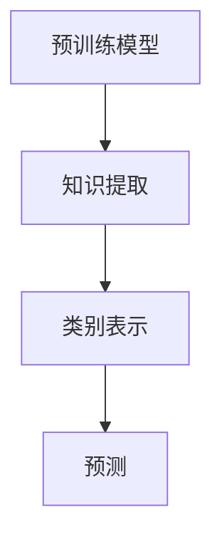
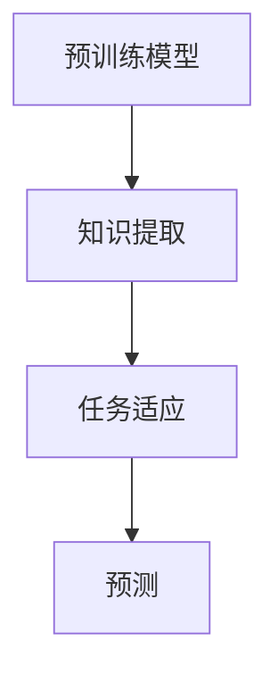
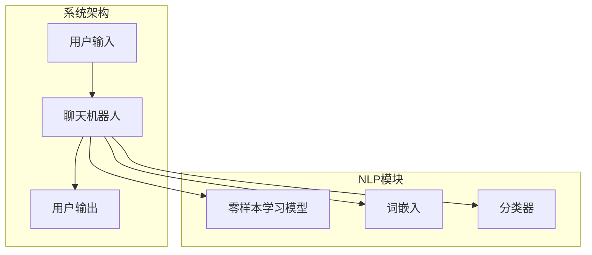
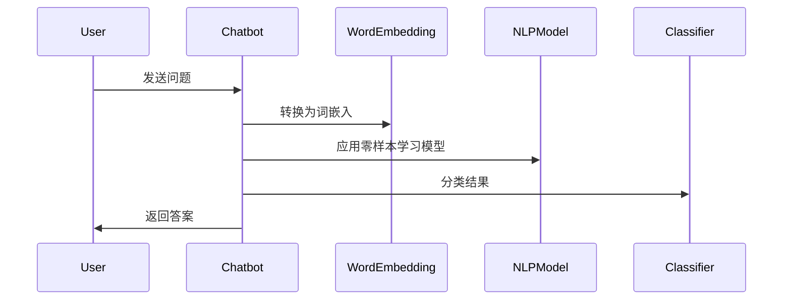

                 

# Zero-Shot CoT: 无需微调的AI问题解决技巧

## 关键词：零样本学习，无需微调，AI问题解决，预训练模型，知识提取，类别表示，算法原理

### 摘要：
本文旨在探讨一种创新的AI问题解决方法——Zero-Shot CoT（无需微调的AI问题解决技巧）。通过深入解析零样本学习和无需微调的原理，以及相关的算法设计和应用实例，本文将帮助读者理解如何利用预训练模型和知识提取技术，实现无需额外微调的高效AI问题解决。

## 第一部分：背景介绍

### 1.1 问题背景

随着人工智能技术的快速发展，AI在各个领域中的应用越来越广泛。特别是大模型（Large Model）的出现，使得AI能够处理更复杂的任务。然而，大模型的训练过程需要大量的数据和计算资源，这在一定程度上限制了其广泛应用。为了解决这个问题，零样本学习（Zero-Shot Learning）和无需微调（Zero-Shot Transfer Learning）成为研究热点。

### 1.2 问题描述

零样本学习旨在让AI模型能够在未见过的新类别上完成任务。而无需微调则是在零样本学习的基础上，将预训练的大模型直接应用于新任务，无需额外的微调过程。这两个概念在AI问题解决中具有重要意义，但相关技术仍存在一定的挑战。

### 1.3 问题解决

本书旨在介绍零样本学习和无需微调的AI问题解决技巧。通过深入研究这些技术，我们希望能够提高AI模型在新任务上的适应能力，减少对大量数据的依赖。

### 1.4 边界与外延

零样本学习和无需微调主要应用于那些需要处理新类别或新任务的场景。这些技术不仅可以用于传统的图像识别、自然语言处理等领域，还可以应用于新兴的领域，如推荐系统、智能对话等。

### 1.5 概念结构与核心要素组成

- 零样本学习：基于大模型和预训练技术的学习方式，能够在未见过的类别上完成任务。
- 无需微调：基于零样本学习的技术，将预训练的大模型直接应用于新任务，无需额外的微调过程。

## 第二部分：核心概念与联系

### 2.1 零样本学习原理

#### 2.1.1 概念原理

零样本学习（Zero-Shot Learning, ZSL）是一种机器学习方法，旨在使模型能够在未见过的类别上做出预测。其核心思想是利用预训练模型在大规模数据集上的知识，在新类别上完成分类任务。

#### 2.1.2 属性特征对比表格

| 特征 | 零样本学习 | 传统机器学习 |
| --- | --- | --- |
| 数据依赖 | 低 | 高 |
| 预训练模型 | 需要 | 不需要 |
| 类别数量 | 可以处理大量类别 | 通常处理少量类别 |
| 适应性 | 高 | 低 |

#### 2.1.3 ER实体关系图架构

```mermaid
erDiagram
  ClassA ||--|{ ClassB : has }
  ClassA ||--|{ ClassC : belongs_to }
```

### 2.2 无需微调原理

#### 2.2.1 概念原理

无需微调（Zero-Shot Transfer Learning, ZSL）是一种将预训练模型直接应用于新任务的机器学习方法。其核心思想是利用预训练模型在大规模数据集上的知识，在新任务上实现良好的性能。

#### 2.2.2 属性特征对比表格

| 特征 | 无需微调 | 传统机器学习 |
| --- | --- | --- |
| 数据依赖 | 低 | 高 |
| 预训练模型 | 需要 | 不需要 |
| 性能提升 | 高 | 低 |
| 微调过程 | 无需 | 需要 |

#### 2.2.3 ER实体关系图架构

```mermaid
erDiagram
  Model ||--|{ Task : for }
  Model ||--|{ Dataset : trained_on }
```

## 第三部分：算法原理讲解

### 3.1 零样本学习算法

#### 3.1.1 算法流程图



#### 3.1.2 算法原理

零样本学习算法主要分为三个步骤：知识提取、类别表示和预测。

1. **知识提取**：利用预训练模型在大规模数据集上的知识，提取出有用的特征。
2. **类别表示**：将每个类别用向量表示，以便进行后续的预测。
3. **预测**：利用类别表示进行预测，判断新样本属于哪个类别。

#### 3.1.3 数学模型和公式

$$
\text{知识提取}: f(\text{样本}) = \text{提取特征}
$$

$$
\text{类别表示}: \text{类别向量} = \text{嵌入模型}(\text{类别名称})
$$

$$
\text{预测}: P(\text{新样本}|\text{类别向量}) = \text{分类器}(\text{类别向量})
$$

### 3.2 无需微调算法

#### 3.2.1 算法流程图



#### 3.2.2 算法原理

无需微调算法的核心步骤包括：知识提取、任务适应和预测。

1. **知识提取**：利用预训练模型在大规模数据集上的知识，提取出有用的特征。
2. **任务适应**：将提取出的特征适应新的任务，无需额外的微调过程。
3. **预测**：利用适应后的特征进行预测，判断新样本的类别。

#### 3.2.3 数学模型和公式

$$
\text{知识提取}: f(\text{样本}) = \text{提取特征}
$$

$$
\text{任务适应}: f'(\text{特征}) = \text{适应任务}(\text{特征})
$$

$$
\text{预测}: P(\text{新样本}|\text{适应后的特征}) = \text{分类器}(\text{适应后的特征})
$$

## 第四部分：系统分析与架构设计

### 4.1 问题场景介绍

以自然语言处理（NLP）为例，介绍一个实际应用场景，例如：一个AI聊天机器人需要能够理解并回答用户提出的各种问题，包括一些从未见过的类别。

### 4.2 系统功能设计

使用Mermaid类图描述系统的功能模块和它们之间的关系，例如：

```mermaid
classDiagram
    class Chatbot {
        -问答模块
        -知识库模块
        -零样本学习模块
    }
    class User {
        -提出问题
    }
    Chatbot --|u|> User :交互
```

### 4.3 系统架构设计

使用Mermaid架构图描述系统的整体架构，例如：



### 4.4 系统接口设计和系统交互

使用Mermaid序列图描述系统的接口设计和交互流程，例如：



## 第五部分：项目实战

### 5.1 环境安装

详细描述项目环境安装步骤，包括所需软件、库和依赖的安装方法。

### 5.2 系统核心实现源代码

提供系统核心实现的源代码，并对关键代码进行解读和分析。

### 5.3 代码应用解读与分析

分析代码如何实现零样本学习和无需微调，以及它们在项目中的应用。

### 5.4 实际案例分析和详细讲解剖析

通过实际案例，分析系统在实际应用中的表现，并进行详细讲解和剖析。

### 5.5 项目小结

总结项目的主要成果和经验教训，以及未来可能的研究方向。

## 第六部分：最佳实践 Tips、小结、注意事项、拓展阅读等内容

### 6.1 最佳实践 Tips

提供一些在实际应用中可能遇到的常见问题和解决方法。

### 6.2 小结

总结本文的主要内容和贡献，以及未来的研究方向。

### 6.3 注意事项

提醒读者在实际应用中需要注意的事项。

### 6.4 拓展阅读

推荐一些相关的文献和资源，供读者进一步学习。

## 参考文献

列出本文中引用的相关文献和资料。

### 作者信息

作者：AI天才研究院/AI Genius Institute & 禅与计算机程序设计艺术 /Zen And The Art of Computer Programming

[本文完]

