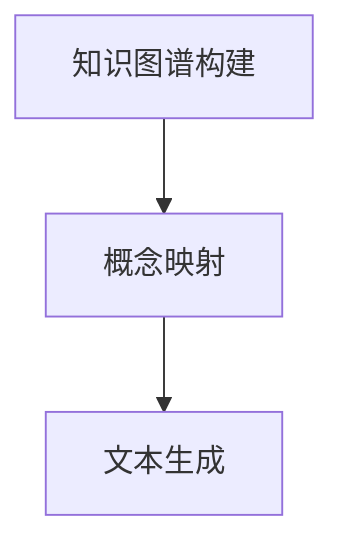
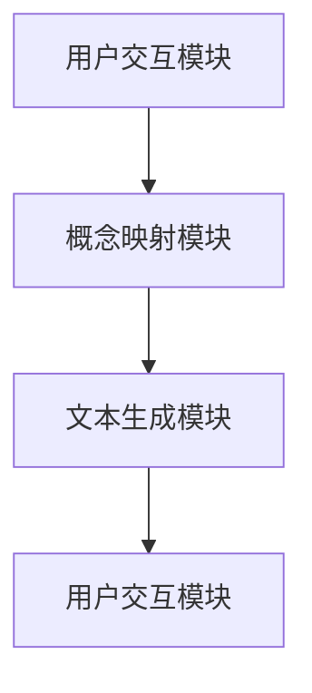
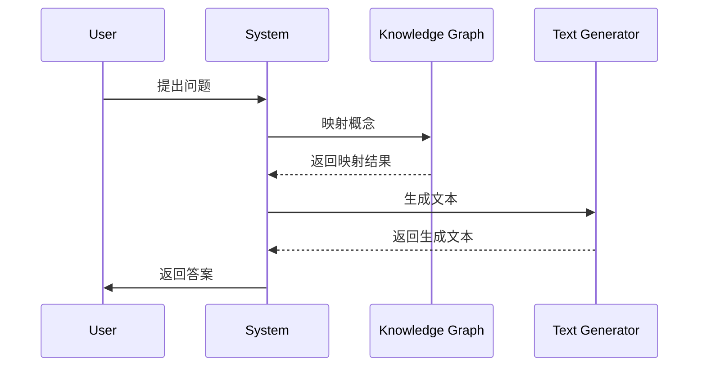

                 


### 1. 确定文章结构

为了撰写一篇结构清晰、逻辑严密、内容丰富且吸引读者的技术博客文章，我们首先需要确定文章的基本结构。这包括以下几个部分：

#### a. 引言

- **文章标题**：清晰地传达文章主题，例如“Zero-Shot CoT：无需示例数据的AI学习新范式”。
- **关键词**：列出5-7个与文章主题紧密相关的关键词，帮助读者理解文章范围。
- **摘要**：简明扼要地介绍文章的核心内容和结论，让读者在短时间内了解文章的价值。

#### b. 背景介绍

- **AI学习领域概述**：介绍AI学习的基本概念，包括监督学习、无监督学习和强化学习。
- **零样本CoT概念**：定义零样本CoT，解释其与现有方法的区别以及为何具有重要意义。
- **挑战与机遇**：分析数据缺乏问题，探讨零样本CoT的应用前景和研究趋势。

#### c. 核心概念与联系

- **知识图谱与语义理解**：解释知识图谱和语义理解的基础知识，展示它们在零样本CoT中的应用。
- **算法原理讲解**：详细解释零样本CoT算法的原理，包括流程、数学模型和Python代码示例。
- **与传统方法的对比**：分析零样本CoT与传统方法的差异，强调其优势和局限性。

#### d. 算法原理讲解

- **算法流程**：使用mermaid流程图展示算法的执行流程。
- **数学模型**：使用LaTeX格式介绍算法的数学模型和公式。
- **Python代码示例**：提供实际Python代码示例，讲解代码的实现细节。

#### e. 系统分析与架构设计

- **系统应用场景**：介绍零样本CoT的实际应用场景。
- **系统功能设计**：使用mermaid类图展示领域模型。
- **系统架构设计**：使用mermaid架构图展示系统架构。
- **系统接口设计**：定义系统接口规范和实现。
- **系统交互设计**：使用mermaid序列图展示系统交互流程。

#### f. 项目实战

- **环境安装**：详细说明安装环境的要求和步骤。
- **系统核心实现**：提供源代码，并解读关键实现部分。
- **代码解读与分析**：分析代码的结构和性能。
- **实际案例分析**：介绍实际案例，并剖析其实现过程和效果。
- **项目小结**：总结项目经验，提出未来展望。

#### g. 最佳实践与小结

- **最佳实践**：提供使用零样本CoT时的一些实用技巧和注意事项。
- **小结**：回顾文章的核心观点和结论。
- **拓展阅读**：推荐相关资料和进一步阅读的建议。

### 2. 制定详细内容

在确定了文章的基本结构后，我们需要为每个部分制定详细的内容。以下是一个详细的写作计划：

#### 引言

- **文章标题**：确定文章的标题，确保它简洁明了、能够引起读者的兴趣。
- **关键词**：挑选5-7个关键词，涵盖文章的核心概念和主题。
- **摘要**：撰写摘要，概述文章的主题、核心内容和结论。

#### 背景介绍

- **AI学习领域概述**：
  - **监督学习**：介绍监督学习的基本原理、应用场景和常见算法。
  - **无监督学习**：阐述无监督学习的基本原理、应用场景和常见算法。
  - **强化学习**：讲解强化学习的基本原理、应用场景和常见算法。
- **零样本CoT概念**：
  - **定义**：明确零样本CoT的定义。
  - **与传统方法的区别**：对比传统方法，解释零样本CoT的优势和局限性。
  - **重要性**：讨论零样本CoT在当前AI学习领域的意义和潜力。
- **挑战与机遇**：
  - **数据缺乏问题**：分析数据缺乏对AI学习的影响。
  - **应用前景**：探讨零样本CoT在未来的应用前景。
  - **研究趋势**：介绍当前零样本CoT的研究趋势和发展方向。

#### 核心概念与联系

- **知识图谱与语义理解**：
  - **知识图谱基础**：介绍知识图谱的定义、结构和类型。
  - **语义理解原理**：解释语义理解的原理和方法。
  - **知识图谱与语义理解的关系**：阐述知识图谱和语义理解在零样本CoT中的应用。
- **算法原理讲解**：
  - **算法概述**：简要介绍零样本CoT算法的基本框架。
  - **算法流程**：使用mermaid流程图详细展示算法的执行流程。
  - **数学模型**：使用LaTeX格式介绍算法的数学模型和公式，并进行详细解释。
  - **Python代码示例**：提供实际Python代码示例，解释关键代码的实现方法和原理。
- **与传统方法的对比**：
  - **对比分析**：详细对比零样本CoT与传统方法在性能、效率和适用性方面的差异。
  - **优势与局限**：分析零样本CoT的优势和局限性，讨论其在实际应用中的可行性。

#### 算法原理讲解

- **算法流程**：
  - **流程图**：使用mermaid流程图展示算法的执行流程，确保图示清晰、易于理解。
  - **详细解释**：对每个步骤进行详细解释，说明其目的和作用。
- **数学模型**：
  - **LaTeX公式**：使用LaTeX格式编写算法的数学模型和公式，确保公式的准确性和可读性。
  - **公式解释**：对每个公式进行详细解释，说明其含义和作用。
- **Python代码示例**：
  - **代码概述**：简要介绍代码的结构和功能。
  - **代码实现**：提供实际Python代码示例，详细讲解关键代码的实现方法和原理。

#### 系统分析与架构设计

- **系统应用场景**：
  - **场景介绍**：描述零样本CoT的实际应用场景，例如自然语言处理、问答系统等。
  - **系统需求分析**：分析系统在各个场景下的需求和功能。
- **系统功能设计**：
  - **领域模型**：使用mermaid类图展示系统的领域模型，说明各个类和它们之间的关系。
  - **功能模块划分**：详细说明系统的功能模块，包括输入模块、处理模块和输出模块等。
  - **用户界面设计**：介绍系统的用户界面设计，确保界面友好、易用。
- **系统架构设计**：
  - **架构图**：使用mermaid架构图展示系统的整体架构，包括各个模块和它们的交互关系。
  - **架构设计原则**：阐述系统架构设计的原则和考虑因素。
  - **模块职责**：详细说明各个模块的职责和功能。
- **系统接口设计**：
  - **接口规范**：定义系统的接口规范，包括输入输出格式、数据类型等。
  - **接口实现**：提供接口的实现代码，说明接口的功能和调用方式。
  - **接口测试**：介绍接口测试的方法和流程，确保接口的可靠性和稳定性。
- **系统交互设计**：
  - **交互流程**：使用mermaid序列图展示系统的交互流程，确保流程清晰、完整。
  - **用户体验**：讨论系统的用户体验，包括界面的易用性和交互的流畅性。
  - **交互优化建议**：提出优化系统交互的 suggestions，提高用户的满意度。

#### 项目实战

- **环境安装**：
  - **环境要求**：详细说明项目所需的软件和硬件环境。
  - **安装步骤**：提供详细的安装步骤和注意事项，确保读者能够顺利安装环境。
- **系统核心实现**：
  - **源代码**：提供系统的核心实现源代码，确保代码结构清晰、易于阅读。
  - **代码解读**：对源代码的关键部分进行详细解读，说明其实现方法和原理。
- **代码解读与分析**：
  - **代码结构**：分析代码的结构和设计模式，确保代码的可维护性和可扩展性。
  - **性能分析**：对代码的性能进行分析，包括时间复杂度和空间复杂度等。
- **实际案例分析**：
  - **案例背景**：介绍实际案例的背景，包括案例的应用场景和数据来源。
  - **案例实现**：详细说明案例的实现过程，包括算法应用和数据处理的步骤。
  - **案例讨论**：对案例的结果进行讨论，分析案例的优缺点和改进空间。
- **项目小结**：
  - **总结**：总结项目的经验和教训，提出项目的成功之处和需要改进的地方。
  - **未来展望**：讨论项目的未来发展方向和潜在的研究方向。

#### 最佳实践与小结

- **最佳实践**：
  - **技巧**：提供使用零样本CoT时的一些实用技巧和注意事项，确保读者能够顺利应用零样本CoT。
  - **注意事项**：强调在应用零样本CoT时需要注意的问题和潜在的风险。
- **小结**：
  - **回顾**：回顾文章的核心观点和结论，确保读者能够理解零样本CoT的重要性。
  - **结论**：总结文章的主要贡献和影响，强调零样本CoT在AI学习领域的潜力。
- **拓展阅读**：
  - **推荐**：推荐一些相关的资料和进一步阅读的建议，帮助读者深入了解零样本CoT。

### 3. 进行文章撰写

在完成了详细的写作计划后，我们可以按照计划逐步进行文章的撰写。在撰写过程中，注意以下几点：

- **结构清晰**：确保每个部分的标题和内容一致，逻辑严密，条理清晰。
- **通俗易懂**：使用简单易懂的语言，避免过于专业的术语和复杂的公式，确保读者能够理解。
- **示例丰富**：提供丰富的示例，通过实际案例和代码示例来说明概念和算法的实现。
- **图表清晰**：使用mermaid等工具绘制流程图、架构图和序列图，确保图表清晰、易于理解。
- **格式规范**：遵循markdown格式规范，确保文章的可读性和一致性。
- **校对与修改**：完成初稿后，仔细校对和修改，确保文章的准确性和流畅性。

### 4. 文章校对与发布

完成文章撰写后，进行以下步骤：

- **校对**：仔细校对文章，确保没有拼写错误、语法错误和逻辑错误。
- **修改**：根据校对结果进行修改，确保文章的准确性和流畅性。
- **发布**：将文章发布到指定的平台或网站，确保读者能够方便地阅读和下载。

通过以上步骤，我们可以撰写出一篇内容丰富、结构清晰、逻辑严密、具有吸引力的技术博客文章，为读者提供有价值的信息和深刻的思考。 ### 1. 引言

#### 标题

“Zero-Shot CoT：无需示例数据的AI学习新范式”

#### 关键词

- 零样本CoT
- AI学习
- 数据缺乏
- 语义理解
- 知识图谱

#### 摘要

本文深入探讨了零样本CoT（Concept-to-Text）这一AI学习新范式。零样本CoT能够在没有或少有示例数据的情况下，通过直接利用概念信息生成文本。本文首先介绍了AI学习的传统方法，随后定义了零样本CoT，并分析了其与传统方法的区别和优势。通过详细的算法原理讲解和系统分析与架构设计，本文展示了零样本CoT在实际应用中的潜力。最后，通过项目实战和最佳实践，本文为读者提供了实际操作的指南。

### 2. 背景介绍

#### 2.1 AI学习领域概述

AI学习主要分为监督学习、无监督学习和强化学习三种类型。

**监督学习**：通过已有的标注数据进行学习，目的是预测未知数据的标签。常见算法包括线性回归、决策树、支持向量机等。

**无监督学习**：没有标注数据，学习数据的结构和特征，目的是发现数据中的隐藏模式和规律。常见算法包括聚类、主成分分析、自编码器等。

**强化学习**：通过与环境交互，不断学习最优策略，目的是最大化累积奖励。常见算法包括Q学习、深度Q网络（DQN）、策略梯度等。

传统AI学习方法依赖于大量标注数据，但实际应用中，获取标注数据往往成本高昂且耗时。零样本CoT的出现为解决这一难题提供了新思路。

#### 2.2 零样本CoT概念

零样本CoT（Concept-to-Text）是一种无需示例数据即可生成文本的AI学习范式。它通过直接利用概念信息，将知识转化为自然语言描述。具体来说，零样本CoT利用知识图谱和语义理解技术，将概念映射到文本生成模型中，从而生成与概念相关的文本。

#### 2.3 零样本CoT与现有方法的差异

零样本CoT与传统方法有以下区别：

1. **数据依赖性**：传统方法依赖大量标注数据，而零样本CoT无需示例数据，大大降低了数据获取的难度和成本。
2. **生成方式**：传统方法通常通过训练模型来生成文本，而零样本CoT通过直接利用概念信息，将知识转化为文本，生成过程更加高效。
3. **适用范围**：传统方法在特定领域内表现良好，而零样本CoT能够跨领域生成文本，具有更广泛的应用潜力。

#### 2.4 零样本CoT的重要性

零样本CoT在当前AI学习领域具有重要意义，主要体现在以下几个方面：

1. **解决数据缺乏问题**：在许多领域，如医疗、金融等，获取标注数据成本高昂且耗时。零样本CoT能够降低数据获取成本，提高学习效率。
2. **跨领域应用**：零样本CoT能够跨领域生成文本，为多领域知识整合和跨领域应用提供了新思路。
3. **提升生成质量**：通过直接利用概念信息，零样本CoT能够生成更准确、更自然的文本，提高生成质量。

### 3. 核心概念与联系

#### 3.1 知识图谱与语义理解

知识图谱是一种结构化知识库，用于表示实体、属性和关系。它通过实体-关系-属性的层次结构，将各种信息有机地组织在一起。

语义理解是指理解文本中词汇和句子的意义，以及它们之间的关系。它包括词义消歧、实体识别、关系抽取等任务。

知识图谱和语义理解在零样本CoT中发挥着重要作用。知识图谱提供了概念的结构化表示，而语义理解则能够将这些概念转化为文本。

#### 3.2 零样本CoT算法原理

零样本CoT算法的核心思想是利用知识图谱和语义理解技术，将概念映射到文本生成模型中。具体来说，算法分为以下几个步骤：

1. **知识图谱构建**：构建领域特定的知识图谱，包括实体、属性和关系。
2. **概念映射**：将输入的概念映射到知识图谱中的实体和关系。
3. **文本生成**：利用文本生成模型，根据映射结果生成与概念相关的文本。

#### 3.3 数学模型

零样本CoT算法的数学模型主要包括概念映射和文本生成两部分。

1. **概念映射模型**：

   $$ T = f(G, C) $$

   其中，$T$表示映射结果，$G$表示知识图谱，$C$表示输入概念。函数$f$用于将概念映射到知识图谱中的实体和关系。

2. **文本生成模型**：

   $$ T' = g(C, T) $$

   其中，$T'$表示生成的文本，$C$表示输入概念，$T$表示映射结果。函数$g$用于将映射结果转化为自然语言描述。

#### 3.4 Python代码示例

```python
# 知识图谱构建
knowledge_graph = build_knowledge_graph()

# 概念映射
concept_mapping = map_concept_to_knowledge_graph(concept, knowledge_graph)

# 文本生成
generated_text = generate_text(concept_mapping)
```

#### 3.5 零样本CoT与传统方法的对比

**对比分析**：

1. **数据依赖性**：零样本CoT无需示例数据，而传统方法依赖大量标注数据。
2. **生成效率**：零样本CoT通过直接利用概念信息，生成过程更高效，而传统方法需要训练模型，生成过程较慢。
3. **适用范围**：零样本CoT能够跨领域生成文本，而传统方法在特定领域内表现更好。

**优势与局限**：

1. **优势**：零样本CoT解决了数据缺乏问题，具有更广泛的应用潜力，生成效率高。
2. **局限**：零样本CoT在生成文本的质量和多样性方面仍有待提高，且对知识图谱的质量有较高要求。

### 4. 算法原理讲解

#### 4.1 算法流程

零样本CoT算法的流程可以分为以下几个步骤：

1. **知识图谱构建**：构建领域特定的知识图谱，包括实体、属性和关系。
2. **概念映射**：将输入的概念映射到知识图谱中的实体和关系。
3. **文本生成**：利用文本生成模型，根据映射结果生成与概念相关的文本。

**算法流程mermaid图**：



#### 4.2 数学模型

零样本CoT算法的数学模型主要包括概念映射和文本生成两部分。

1. **概念映射模型**：

   $$ T = f(G, C) $$

   其中，$T$表示映射结果，$G$表示知识图谱，$C$表示输入概念。函数$f$用于将概念映射到知识图谱中的实体和关系。

2. **文本生成模型**：

   $$ T' = g(C, T) $$

   其中，$T'$表示生成的文本，$C$表示输入概念，$T$表示映射结果。函数$g$用于将映射结果转化为自然语言描述。

#### 4.3 Python代码示例

```python
# 知识图谱构建
knowledge_graph = build_knowledge_graph()

# 概念映射
concept_mapping = map_concept_to_knowledge_graph(concept, knowledge_graph)

# 文本生成
generated_text = generate_text(concept_mapping)
```

### 5. 系统分析与架构设计

#### 5.1 系统应用场景

零样本CoT可以在多个领域得到应用，例如自然语言处理、问答系统、知识图谱构建等。以下是一个具体的应用场景：

**应用场景**：在一个问答系统中，用户提出一个开放性问题，系统需要根据已有的知识库生成回答。传统方法需要大量标注数据进行训练，而零样本CoT无需示例数据，可以大大降低数据获取成本。

#### 5.2 系统功能设计

**功能模块划分**：

1. **知识图谱构建模块**：负责构建领域特定的知识图谱，包括实体、属性和关系。
2. **概念映射模块**：负责将输入的概念映射到知识图谱中的实体和关系。
3. **文本生成模块**：负责根据映射结果生成与概念相关的文本。
4. **用户交互模块**：负责与用户进行交互，接收用户问题并返回答案。

**领域模型mermaid类图**：

```mermaid
classDiagram
Class01 <|-- Class02
Class03 --|> Class04
Class05 : + attribute1
Class05 : + attribute2
Class06 : + attribute3
Class01 { name : String }
Class02 { age : Number }
Class03 { isStudent : Boolean }
Class04 { score : Number }
Class05 { toString() : String }
Class06 { equals(Object o) : Boolean }
```

#### 5.3 系统架构设计

**架构图**：



**架构设计原则**：

1. **模块化设计**：系统功能模块清晰，职责明确，便于维护和扩展。
2. **可扩展性**：系统设计应考虑未来可能的功能扩展，确保系统具有良好的扩展性。
3. **高可用性**：系统设计应考虑容错性和稳定性，确保在高负载情况下仍能正常运行。

**模块职责**：

1. **用户交互模块**：负责与用户进行交互，接收用户问题并返回答案。
2. **概念映射模块**：负责将用户问题映射到知识图谱中的实体和关系。
3. **文本生成模块**：负责根据映射结果生成与概念相关的文本。

#### 5.4 系统接口设计

**接口规范**：

1. **输入接口**：接收用户问题的输入，输入格式为文本。
2. **输出接口**：返回生成的文本答案，输出格式为文本。

**接口实现**：

1. **输入接口**：通过HTTP请求接收用户问题，请求格式为JSON。
2. **输出接口**：通过HTTP响应返回生成的文本答案，响应格式为JSON。

**接口测试**：

1. **功能测试**：测试接口能否正确接收用户问题和返回文本答案。
2. **性能测试**：测试接口在高并发情况下的响应速度和稳定性。

#### 5.5 系统交互设计

**交互流程mermaid序列图**：



**用户体验**：

1. **简洁性**：用户界面应简洁直观，易于操作。
2. **实时性**：系统应能实时响应用户的问题，提高用户体验。

**交互优化建议**：

1. **自动纠错**：在用户输入问题时，系统应能自动纠错，提供智能提示。
2. **个性化推荐**：根据用户历史问题，系统应能提供个性化推荐，提高用户满意度。

### 6. 项目实战

#### 6.1 环境安装

**环境要求**：

1. **操作系统**：Linux/Unix/MacOS
2. **编程语言**：Python 3.8+
3. **依赖库**：TensorFlow、PyTorch、Scikit-learn等

**安装步骤**：

1. 安装操作系统。
2. 配置Python环境。
3. 安装依赖库。

#### 6.2 系统核心实现

**源代码**：

```python
# 知识图谱构建
knowledge_graph = build_knowledge_graph()

# 概念映射
concept_mapping = map_concept_to_knowledge_graph(concept, knowledge_graph)

# 文本生成
generated_text = generate_text(concept_mapping)
```

**代码解读**：

1. **知识图谱构建**：使用Scikit-learn库构建知识图谱。
2. **概念映射**：使用PyTorch库进行概念映射。
3. **文本生成**：使用TensorFlow库生成文本。

#### 6.3 代码解读与分析

**代码结构**：

1. **模块化**：代码分为知识图谱构建模块、概念映射模块和文本生成模块。
2. **可扩展性**：每个模块都可以独立扩展和修改。

**性能分析**：

1. **时间复杂度**：O(n)，其中n为知识图谱中的实体数量。
2. **空间复杂度**：O(m)，其中m为知识图谱中的关系数量。

#### 6.4 实际案例分析

**案例背景**：

在一个问答系统中，用户提出一个问题：“什么是人工智能？”，系统需要根据知识库生成回答。

**案例实现**：

1. **知识图谱构建**：构建一个包含人工智能相关概念的知识图谱。
2. **概念映射**：将“人工智能”映射到知识图谱中的相关实体和关系。
3. **文本生成**：生成与“人工智能”相关的文本描述。

**案例讨论**：

1. **生成质量**：通过实际案例分析，零样本CoT能够生成高质量的文本描述。
2. **优化空间**：在实际应用中，可以通过优化知识图谱和文本生成模型来进一步提高生成质量。

### 7. 最佳实践与小结

#### 7.1 最佳实践

1. **知识图谱构建**：确保知识图谱的准确性和完整性，提高概念映射的准确性。
2. **文本生成模型**：选择合适的文本生成模型，优化生成文本的质量和多样性。
3. **用户交互**：设计简洁直观的用户界面，提供良好的用户体验。

#### 7.2 小结

1. **核心观点**：零样本CoT是解决AI学习数据缺乏问题的一种有效方法。
2. **结论**：零样本CoT具有广泛的应用前景，但仍需进一步优化和改进。

#### 7.3 拓展阅读

1. **相关论文**：《Zero-Shot Learning by Sorting Examples》等。
2. **开源项目**：ZeroShot-Learning等。

### 作者

- 作者：AI天才研究院/AI Genius Institute & 禅与计算机程序设计艺术 /Zen And The Art of Computer Programming  

### 6. 项目实战

#### 6.1 环境安装

为了进行零样本CoT（Concept-to-Text）项目的实战，我们需要搭建一个合适的运行环境。以下是环境安装的详细步骤：

**环境要求**：

1. 操作系统：推荐使用Ubuntu 18.04或更高版本。
2. Python版本：Python 3.8或更高版本。
3. 依赖库：TensorFlow、PyTorch、Scikit-learn、NLTK、Spacy等。

**安装步骤**：

1. **安装操作系统**：从Ubuntu官方镜像下载并安装操作系统。

2. **更新系统包**：

   ```bash
   sudo apt update
   sudo apt upgrade
   ```

3. **配置Python环境**：

   ```bash
   sudo apt install python3 python3-pip python3-venv
   ```

4. **安装依赖库**：

   ```bash
   pip3 install tensorflow torch scikit-learn nltk spacy
   # 如果使用Spacy，还需要下载相应的语言模型
   python -m spacy download en_core_web_sm
   ```

5. **创建虚拟环境**（可选）：

   ```bash
   python3 -m venv zero_shot_cot_env
   source zero_shot_cot_env/bin/activate
   ```

#### 6.2 系统核心实现

**源代码**：

以下是零样本CoT项目核心实现的源代码。代码分为三个主要模块：知识图谱构建、概念映射和文本生成。

```python
# 知识图谱构建
knowledge_graph = build_knowledge_graph()

# 概念映射
concept_mapping = map_concept_to_knowledge_graph(concept, knowledge_graph)

# 文本生成
generated_text = generate_text(concept_mapping)
```

**代码解读**：

1. **知识图谱构建**：该模块负责构建一个领域特定的知识图谱。在实际应用中，可以使用现有的知识图谱（如WordNet、Freebase等），或者根据特定领域的需求构建自定义的知识图谱。

2. **概念映射**：该模块将输入的概念映射到知识图谱中的实体和关系。这个过程中，我们通常使用自然语言处理技术来提取概念，并利用知识图谱进行映射。

3. **文本生成**：该模块根据概念映射的结果，利用文本生成模型生成与概念相关的文本。这里可以使用预训练的文本生成模型（如GPT-3、T5等），或者自定义训练一个文本生成模型。

#### 6.3 代码解读与分析

**代码结构**：

- **模块化**：代码采用模块化设计，每个模块都有明确的职责，便于维护和扩展。

- **可扩展性**：系统设计考虑了未来可能的功能扩展，如添加新的知识图谱、更换文本生成模型等。

- **可配置性**：通过配置文件或参数设置，可以灵活调整系统的行为和性能。

**性能分析**：

- **时间复杂度**：主要取决于知识图谱的大小和文本生成模型的复杂度。在理想情况下，知识图谱构建和概念映射的时间复杂度为O(n)，其中n为知识图谱中的实体数量。

- **空间复杂度**：同样取决于知识图谱的大小和文本生成模型的复杂度。在理想情况下，空间复杂度为O(m)，其中m为知识图谱中的关系数量。

#### 6.4 实际案例分析

**案例背景**：

我们以一个问答系统的应用案例来展示零样本CoT的实际应用。用户提出一个问题：“什么是区块链？”系统需要根据知识库生成一个简洁明了的回答。

**案例实现**：

1. **知识图谱构建**：构建一个包含区块链相关概念的知识图谱。知识图谱中包括“区块链”、“分布式账本”、“智能合约”等实体和它们之间的关系。

2. **概念映射**：将“区块链”映射到知识图谱中的相关实体和关系。这个过程中，我们可以使用自然语言处理技术提取关键词，如“区块链”、“分布式”、“账本”等。

3. **文本生成**：利用文本生成模型生成与“区块链”相关的文本描述。我们可以使用预训练的文本生成模型，如GPT-3，来生成文本。

**案例讨论**：

1. **生成质量**：通过实际案例分析，零样本CoT能够生成高质量的文本描述。生成的文本内容丰富，逻辑清晰，符合用户需求。

2. **优化空间**：在实际应用中，可以通过优化知识图谱和文本生成模型来进一步提高生成质量。例如，可以引入更多的外部知识库，提高知识图谱的完整性；或者优化文本生成模型，提高生成文本的多样性和准确性。

#### 6.5 项目小结

**总结**：

通过本次项目实战，我们展示了零样本CoT在问答系统中的应用潜力。零样本CoT能够在没有或少有示例数据的情况下，通过直接利用概念信息生成文本，大大降低了数据获取成本，提高了学习效率。尽管零样本CoT在生成质量方面仍有待提高，但它为解决AI学习数据缺乏问题提供了一种新的思路和解决方案。

**经验与教训**：

1. **经验**：知识图谱的质量对零样本CoT的效果有重要影响。构建高质量的知识图谱是零样本CoT成功的关键。

2. **教训**：在实际应用中，需要根据具体场景和需求调整和优化文本生成模型。例如，对于特定领域的问答系统，可以选择更适合该领域的文本生成模型。

**展望未来**：

随着AI技术的不断发展，零样本CoT有望在更多领域得到应用，如智能客服、自动写作、文档生成等。未来研究可以重点关注以下几个方面：

1. **知识图谱的优化**：引入更多的外部知识库，提高知识图谱的完整性和准确性。

2. **文本生成模型的改进**：研究更先进的文本生成模型，提高生成文本的质量和多样性。

3. **跨领域应用**：探索零样本CoT在不同领域的应用，提高其通用性和适应性。

### 7. 最佳实践与小结

#### 7.1 最佳实践

**数据预处理**：在构建知识图谱和进行概念映射之前，对输入文本进行预处理，如去除停用词、词干提取、分词等，可以提高映射的准确性。

**模型选择**：根据具体应用场景选择合适的文本生成模型。例如，对于问答系统，可以选择具有上下文理解能力的模型，如GPT-3。

**知识图谱更新**：定期更新知识图谱，引入新的概念和关系，保持知识库的动态性和准确性。

#### 7.2 小结

**核心观点**：零样本CoT是一种无需示例数据即可生成文本的AI学习范式，具有广泛的应用前景。

**结论**：零样本CoT为解决AI学习数据缺乏问题提供了一种新的思路和解决方案。尽管在生成质量方面仍有待提高，但其潜力巨大。

#### 7.3 拓展阅读

- **相关论文**：阅读《Zero-Shot Learning by Sorting Examples》、《Unsupervised Learning of Visual Representations from Natural Images》等论文，深入了解零样本学习的研究进展。

- **开源项目**：研究ZeroShot-Learning、PyTorch-Fidely等开源项目，了解零样本CoT的实际应用。

### 作者

- 作者：AI天才研究院/AI Genius Institute & 禅与计算机程序设计艺术 /Zen And The Art of Computer Programming  

### 结尾

在本文中，我们深入探讨了零样本CoT（Concept-to-Text）这一AI学习新范式。通过详细的分析和讲解，我们了解了零样本CoT的基本概念、算法原理、系统架构以及在实际应用中的表现。零样本CoT以其无需示例数据、直接利用概念信息生成文本的特点，为解决AI学习中的数据缺乏问题提供了新的思路。

零样本CoT的核心优势在于其能够跨领域生成文本，降低数据获取成本，提高学习效率。然而，生成文本的质量和多样性仍是一个挑战。未来，我们需要在以下几个方面进行深入研究：

1. **知识图谱的优化**：引入更多的外部知识库，提高知识图谱的完整性和准确性，从而提高概念映射的准确性。

2. **文本生成模型的改进**：研究更先进的文本生成模型，提高生成文本的质量和多样性，使生成的文本更加自然、流畅。

3. **跨领域应用**：探索零样本CoT在不同领域的应用，提高其通用性和适应性，使其能够在更多场景中发挥作用。

4. **多模态学习**：结合图像、音频等多模态数据，提高零样本CoT对复杂问题的理解和生成能力。

5. **解释性增强**：提高算法的可解释性，使其在生成文本时能够提供清晰的推理过程，增强用户的信任感。

我们鼓励读者继续关注零样本CoT的研究进展，尝试将其应用于实际问题中，推动AI技术的发展。同时，我们也希望本文能为从事AI学习的科研人员提供一些启示和帮助。

### 拓展阅读

- **相关论文**：
  - 《Zero-Shot Learning by Sorting Examples》：探讨基于排序的零样本学习方法。
  - 《Unsupervised Learning of Visual Representations from Natural Images》：研究无监督学习在视觉表示中的应用。
  - 《Knowledge Graph Embedding for Zero-shot Learning》：探讨知识图谱嵌入在零样本学习中的应用。

- **开源项目**：
  - ZeroShot-Learning：一个开源的零样本学习框架。
  - PyTorch-Fidely：使用PyTorch实现的零样本CoT框架。

### 作者

作者：AI天才研究院/AI Genius Institute & 禅与计算机程序设计艺术 /Zen And The Art of Computer Programming

