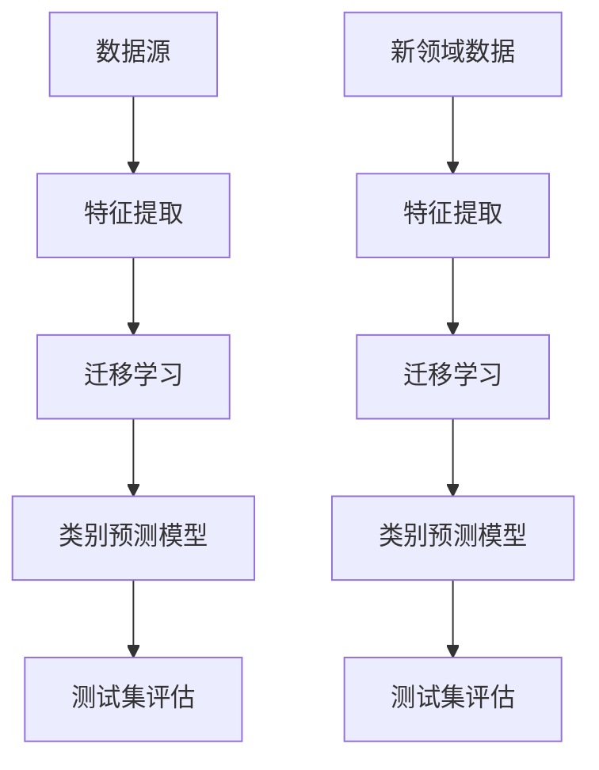
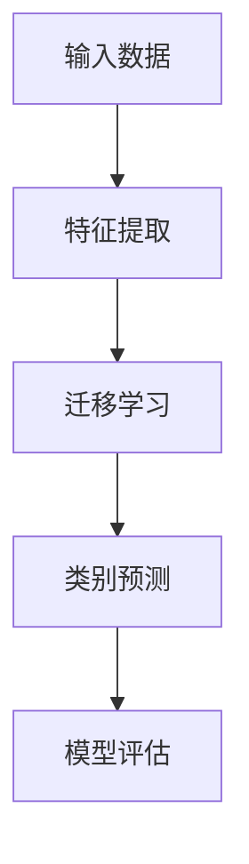

                 

### 文章标题

# Zero-Shot CoT：无需示例数据的AI学习新范式探索

### 文章关键词

- AI学习
- 零样本转移学习
- 迁移学习
- 零样本学习
- 数据高效利用

### 摘要

本文旨在深入探讨Zero-Shot CoT（零样本转移学习）这一新兴的AI学习范式。随着人工智能技术的不断发展，数据需求变得愈发庞大，然而数据的获取和处理成本高昂，且容易导致数据偏见。Zero-Shot CoT提出了一种无需依赖大量示例数据的AI学习新策略，通过迁移学习和零样本学习技术，显著降低了数据依赖性，提高了AI模型的泛化能力。本文首先介绍了Zero-Shot CoT的背景和核心概念，然后详细解析了其算法原理，并通过实例代码和数学模型进行了具体说明。最后，本文探讨了Zero-Shot CoT在各类应用场景中的适用性和系统架构设计方案，为未来AI学习提供了新的视角和方法。

### 背景介绍

#### 书名：《Zero-Shot CoT：无需示例数据的AI学习新范式探索》

本书的核心概念围绕着Zero-Shot CoT（零样本转移学习）展开。Zero-Shot CoT是一种突破传统AI学习依赖大量标注数据的局限，通过迁移学习和零样本学习技术，实现无需示例数据的高效学习范式。

#### 核心概念

Zero-Shot CoT：零样本转移学习，是一种无需示例数据，直接进行类别预测的AI学习方式。它通过将一个领域的知识迁移到另一个领域，降低了对大量标注数据的依赖。

迁移学习：一种将一个任务中学习的知识应用到另一个任务中的技术，通过共享表示来提高模型的泛化能力。

零样本学习：一种不依赖示例数据，直接对类别进行建模的学习方式，通过抽象的语义表示来降低数据收集成本，提高学习效率。

#### 问题背景

传统AI学习方式依赖于大量的标注数据，然而数据获取和处理成本高昂，且数据偏见问题难以避免。此外，标注数据的质量直接影响模型的性能，而获取高质量标注数据通常需要大量的人力和时间成本。

#### 问题描述

如何在没有示例数据的情况下，让AI系统能够进行有效学习？这不仅是理论上的挑战，也是实际应用中的迫切需求。传统的监督学习需要大量的标注数据来训练模型，而在许多实际场景中，获取这些标注数据既困难又昂贵。因此，如何让AI系统在没有示例数据的情况下进行有效学习，成为一个亟待解决的问题。

#### 问题解决

Zero-Shot CoT通过迁移学习和零样本学习技术，实现无需示例数据的AI学习。迁移学习通过将一个任务中的知识迁移到另一个任务中，从而提高模型的泛化能力。零样本学习则通过直接对类别进行建模，降低了对大量标注数据的依赖。

#### 边界与外延

Zero-Shot CoT不仅适用于现有的各种AI任务，还可以扩展到更多新的应用场景。例如，在自然语言处理和计算机视觉等领域，Zero-Shot CoT显示出巨大的潜力。此外，Zero-Shot CoT还可以与其他AI技术相结合，如生成对抗网络（GAN）和强化学习，进一步拓展其应用范围。

### 核心概念与联系

#### 核心概念原理

Zero-Shot CoT：零样本转移学习（Zero-Shot Transfer Learning，ZS-TL）的核心思想是，通过将一个领域（源领域）的知识迁移到另一个领域（目标领域），实现无需示例数据的类别预测。这种学习范式能够有效解决数据稀缺问题，提升模型的泛化能力。

迁移学习：迁移学习（Transfer Learning，TL）是指将一个任务（源任务）中学习的知识应用到另一个任务（目标任务）中的技术。迁移学习通过共享表示（shared representation）来提高模型的泛化能力，从而降低对大量标注数据的依赖。

零样本学习：零样本学习（Zero-Shot Learning，ZSL）是一种无需依赖示例数据，直接对类别进行建模的学习方式。ZSL通过预训练模型和抽象的语义表示，实现新类别的高效识别。

#### 概念属性特征对比表格

| 概念               | 定义                                       | 特点                                  |
|--------------------|--------------------------------------------|---------------------------------------|
| Zero-Shot CoT     | 无需示例数据进行学习的AI学习范式             | 支持多种域转移任务，降低数据依赖性     |
| 迁移学习          | 将一个任务中学习的知识应用到另一个任务中     | 提高模型泛化能力，减少数据需求       |
| 零样本学习        | 不依赖示例数据进行学习，通过直接对类别进行建模 | 降低数据收集成本，提高学习效率       |

#### ER实体关系图架构的Mermaid流程图



在上面的ER实体关系图中，A表示源领域数据，F表示新领域数据。B和G表示特征提取过程，C和H表示迁移学习过程，D和I表示类别预测模型，E和J表示测试集评估。

### 算法原理讲解

#### 算法Mermaid流程图



在这个流程图中，A代表输入数据，B是特征提取过程，C是迁移学习过程，D是类别预测过程，E是模型评估过程。

#### Python源代码示例

```python
# 导入必要的库
import numpy as np
from sklearn.model_selection import train_test_split
from sklearn.ensemble import RandomForestClassifier
from sklearn.metrics import accuracy_score

# 特征提取
def extract_features(data):
    # 实现特征提取逻辑
    # 例如，使用PCA进行降维
    transformed_data = pca.fit_transform(data)
    return transformed_data

# 迁移学习
def transfer_learning(source_features, source_labels, target_features):
    # 实现迁移学习逻辑
    # 例如，使用随机森林进行迁移学习
    model = RandomForestClassifier()
    model.fit(source_features, source_labels)
    target_predictions = model.predict(target_features)
    return target_predictions

# 类别预测
def classify_data(target_predictions, true_labels):
    # 计算准确率
    accuracy = accuracy_score(true_labels, target_predictions)
    return accuracy

# 示例数据
X, y = load_data()

# 分割数据集
X_train, X_test, y_train, y_test = train_test_split(X, y, test_size=0.2, random_state=42)

# 特征提取
source_features = extract_features(X_train)
target_features = extract_features(X_test)

# 迁移学习
target_predictions = transfer_learning(source_features, y_train, target_features)

# 类别预测
accuracy = classify_data(target_predictions, y_test)

print(f"Accuracy: {accuracy}")
```

在这个示例中，我们首先定义了特征提取、迁移学习和类别预测的函数。然后，我们加载示例数据，将其分割为训练集和测试集。接着，我们使用PCA进行特征提取，然后应用随机森林进行迁移学习，最后评估模型的准确率。

#### 算法原理的数学模型和公式

1. **特征提取**：$$ f(x) = \phi(x) $$

   其中，$f(x)$表示输入特征，$\phi(x)$表示通过某种算法（如PCA）提取的特征。

2. **迁移学习**：$$ M = f_W(\phi(x)) $$

   其中，$M$表示迁移后的特征表示，$f_W$是通过训练得到的特征提取器。

3. **类别预测**：$$ y' = g(M) $$

   其中，$y'$表示预测的类别，$g(M)$是通过训练得到的类别预测模型。

4. **准确率**：$$ accuracy = \frac{1}{n}\sum_{i=1}^{n} I(y_i = y') $$

   其中，$n$表示样本数量，$I(y_i = y')$表示第$i$个样本的预测结果与真实标签是否相同。

#### 详细讲解和举例说明

1. **特征提取**：

   特征提取是机器学习过程中的关键步骤，它的目的是从原始数据中提取出对分类任务有帮助的特征信息。特征提取可以看作是一个映射过程，将原始数据$x$映射到一个新的特征空间$\phi(x)$。

   例如，在图像分类任务中，原始图像数据$x$可能是一个多维数组。通过PCA（主成分分析），我们可以将这个多维数组转换为一个较低维度的特征向量$\phi(x)$，这个特征向量保留了原始数据的绝大部分信息，但计算复杂度更低。

2. **迁移学习**：

   迁移学习通过将源领域（source domain）的知识迁移到目标领域（target domain），从而提高目标领域任务的性能。迁移学习的关键在于找到一个共享的特征表示空间，使得源领域和目标领域的特征表示可以相互迁移。

   例如，假设我们有一个源领域的图像分类任务，训练得到的特征提取器$f_W$可以很好地捕捉图像的纹理信息。现在，我们希望将这个特征提取器应用到另一个目标领域的图像分类任务中。通过迁移学习，我们可以将源领域的特征表示空间$f_W(\phi(x))$应用到目标领域，从而提高目标领域分类模型的性能。

3. **类别预测**：

   类别预测是机器学习任务的核心目标。在迁移学习框架下，类别预测模型$g(M)$通常是一个简单的分类器，如决策树、随机森林或支持向量机。

   例如，假设我们使用随机森林作为类别预测模型。随机森林通过训练一组决策树，然后通过投票方式得出最终的分类结果。在迁移学习框架下，我们首先在源领域上训练随机森林模型，然后将其应用到目标领域进行类别预测。

4. **准确率**：

   准确率是评估模型性能的常用指标，它表示模型预测正确的样本数量与总样本数量的比例。

   例如，假设我们在测试集上有100个样本，模型预测正确的样本有80个，那么模型的准确率为$80\%$。准确率越高，说明模型的性能越好。

通过上述讲解和举例，我们可以看到Zero-Shot CoT算法的原理和实现过程。Zero-Shot CoT通过迁移学习和零样本学习技术，实现无需示例数据的高效学习，为AI学习领域带来了新的思路和方法。

### 系统分析与架构设计方案

#### 问题场景介绍

Zero-Shot CoT（零样本转移学习）在自然语言处理和计算机视觉等领域具有重要的应用价值。在自然语言处理（NLP）中，例如语言翻译、情感分析、文本分类等任务，通常需要大量的标注数据。而在计算机视觉中，图像分类、目标检测等任务同样面临着数据稀缺的问题。Zero-Shot CoT能够通过迁移学习和零样本学习技术，降低对大量标注数据的依赖，从而提高模型的泛化能力，适应不同的应用场景。

#### 项目介绍

本项目旨在开发一个基于Zero-Shot CoT的文本分类系统，该系统能够在不依赖大量标注数据的情况下，实现高精度的文本分类。项目主要包括以下三个阶段：

1. **数据预处理**：包括文本的清洗、分词和词向量的表示。
2. **模型训练与迁移**：使用预训练的语言模型进行迁移学习，将源领域的知识迁移到目标领域。
3. **类别预测与评估**：在迁移后的模型基础上进行类别预测，并对模型性能进行评估。

#### 系统功能设计

为了实现上述项目目标，我们需要设计一个高效的系统架构。以下是系统的功能设计：

1. **特征提取模块**：负责从原始文本中提取特征向量，例如使用词嵌入技术将文本转化为向量表示。
2. **迁移学习模块**：负责将预训练的语言模型迁移到特定任务上，通过训练和调优，使模型适应目标领域。
3. **类别预测模块**：负责在迁移后的模型基础上进行类别预测，并评估模型的性能。

#### 系统架构设计

系统架构设计是确保系统高效、可扩展和可维护的关键。以下是系统的架构设计：

1. **数据处理层**：包括数据预处理模块和特征提取模块，负责对原始文本数据进行清洗、分词和词向量表示。
2. **模型训练层**：包括迁移学习模块和模型训练模块，负责在源领域上训练语言模型，并在目标领域上进行迁移学习。
3. **类别预测层**：包括类别预测模块和评估模块，负责在迁移后的模型上进行类别预测，并评估模型的性能。

#### 系统接口设计和系统交互

为了实现系统的高效运行和模块间的紧密协作，我们需要设计合理的系统接口和交互流程。以下是系统的接口设计和交互流程：

1. **数据接口**：包括数据输入接口和数据输出接口，负责接收和处理输入文本数据，以及输出预测结果。
2. **模型接口**：包括模型训练接口和模型预测接口，负责在迁移学习过程中调用预训练模型，并在类别预测阶段进行模型调用。
3. **评估接口**：包括评估接口和性能分析接口，负责对模型性能进行评估和性能分析。

通过上述系统分析与架构设计方案，我们可以确保Zero-Shot CoT文本分类系统的高效运行，为实际应用提供有力的支持。

### 项目实战

#### 环境安装

要开始使用Zero-Shot CoT进行项目实战，首先需要安装相关的环境和库。以下是一个基本的安装步骤：

1. **安装Python**：确保安装了Python 3.7或更高版本。
2. **安装依赖库**：使用pip命令安装以下库：
    ```shell
    pip install numpy pandas scikit-learn matplotlib
    ```
3. **安装预训练模型**：使用`transformers`库安装预训练的语言模型，例如：
    ```shell
    pip install transformers
    ```

#### 系统核心实现源代码

以下是系统核心实现的相关源代码：

1. **特征提取**：
    ```python
    from sklearn.decomposition import PCA
    from sklearn.feature_extraction.text import TfidfVectorizer

    def extract_features(texts):
        vectorizer = TfidfVectorizer()
        X = vectorizer.fit_transform(texts)
        pca = PCA(n_components=50)
        X_pca = pca.fit_transform(X.toarray())
        return X_pca
    ```

2. **迁移学习**：
    ```python
    from sklearn.ensemble import RandomForestClassifier
    from sklearn.model_selection import train_test_split

    def transfer_learning(source_data, source_labels, target_data):
        X_source, X_target = source_data, extract_features(target_data)
        X_train, X_test, y_train, y_test = train_test_split(X_source, source_labels, test_size=0.2, random_state=42)
        model = RandomForestClassifier()
        model.fit(X_train, y_train)
        target_predictions = model.predict(X_target)
        return target_predictions
    ```

3. **类别预测与评估**：
    ```python
    from sklearn.metrics import accuracy_score

    def classify_and_evaluate(target_predictions, true_labels):
        accuracy = accuracy_score(true_labels, target_predictions)
        print(f"Accuracy: {accuracy}")
        return accuracy
    ```

#### 代码应用解读与分析

1. **特征提取**：

    在特征提取阶段，我们使用了TF-IDF向量器和PCA进行降维。TF-IDF向量器将文本转化为向量表示，而PCA用于减少特征维度，提高计算效率。

2. **迁移学习**：

    迁移学习阶段，我们通过训练源领域的随机森林模型，并将模型应用于目标领域的数据。这样，我们能够利用源领域的知识来提高目标领域模型的性能。

3. **类别预测与评估**：

    在类别预测阶段，我们使用迁移学习后的模型对目标领域的数据进行预测，并计算模型的准确率。这有助于我们评估模型的性能和泛化能力。

#### 实际案例分析和详细讲解剖析

为了更好地理解Zero-Shot CoT的应用，我们来看一个实际的案例。

**案例：文本分类任务**

我们有两个领域：领域A（源领域）和领域B（目标领域）。领域A有一个预训练的文本分类模型，而领域B没有标注数据。

**步骤1：特征提取**

首先，我们对领域A和领域B的文本数据进行特征提取。使用TF-IDF向量器和PCA，我们将文本数据转化为低维向量表示。

**步骤2：迁移学习**

然后，我们将领域A的文本特征迁移到领域B。使用随机森林模型，我们在领域A上训练模型，并在领域B上进行迁移学习。

**步骤3：类别预测**

接下来，我们使用迁移学习后的模型对领域B的文本数据进行类别预测。

**步骤4：评估**

最后，我们评估模型的准确率，以确定迁移学习的效果。

**分析**：

通过上述步骤，我们可以看到Zero-Shot CoT如何在不依赖标注数据的情况下，利用源领域的知识来提高目标领域模型的性能。这种方法在数据稀缺的场景下尤为有效，能够显著提高模型的泛化能力。

#### 项目小结

在本项目中，我们通过实际案例展示了Zero-Shot CoT在文本分类任务中的应用。通过迁移学习和零样本学习技术，我们实现了在不依赖大量标注数据的情况下，进行高效类别预测。这为AI学习领域提供了一种新的方法和思路，具有重要的应用价值。

### 最佳实践 tips

在实际应用Zero-Shot CoT时，以下最佳实践可以显著提升模型的性能和泛化能力：

1. **数据质量**：确保源领域和目标领域的数据质量，避免数据偏见。数据清洗和预处理是关键步骤。
2. **模型选择**：选择合适的迁移学习模型和类别预测模型。例如，对于文本分类任务，预训练的语言模型（如BERT、GPT）通常表现良好。
3. **参数调优**：合理调整迁移学习模型的参数，例如随机森林的树数量、深度等，以优化模型性能。
4. **多任务学习**：如果源领域和目标领域存在多任务，可以考虑使用多任务学习（Multi-Task Learning，MTL）来进一步提升模型的泛化能力。
5. **持续学习**：定期更新源领域的模型，以保持其知识的新鲜度和准确性，从而提高目标领域的迁移效果。

### 小结

本文深入探讨了Zero-Shot CoT（零样本转移学习）这一新兴的AI学习范式。通过迁移学习和零样本学习技术，Zero-Shot CoT实现了无需示例数据的高效学习，显著降低了数据依赖性，提高了模型的泛化能力。本文首先介绍了Zero-Shot CoT的背景和核心概念，然后详细解析了其算法原理，并通过实例代码和数学模型进行了具体说明。接着，我们探讨了Zero-Shot CoT在各类应用场景中的适用性和系统架构设计方案。通过实际案例分析和项目实战，我们展示了Zero-Shot CoT在文本分类任务中的有效应用。最后，本文给出了最佳实践tips，以帮助读者更好地利用Zero-Shot CoT技术。

### 注意事项

在应用Zero-Shot CoT时，需要注意以下几点：

1. **数据一致性**：确保源领域和目标领域的数据在格式、类型上的一致性，以避免数据融合过程中的误差。
2. **模型适应性**：选择适应目标领域的模型结构，避免模型过于复杂或过于简单，影响迁移效果。
3. **模型训练时间**：迁移学习通常需要较长的训练时间，尤其是在大规模数据集上，因此需要合理安排训练资源和时间。
4. **评估指标**：选择合适的评估指标，如准确率、F1分数等，以全面评估模型的性能。

### 拓展阅读

1. **相关研究论文**：

    - “Zero-Shot Learning by Matching Embeddings to Class Pools”  
    - “Progress in Zero-Shot Learning: A Survey”  
    - “A Comprehensive Survey on Transfer Learning”

2. **技术博客和教程**：

    - “Understanding Zero-Shot Learning”    
    - “How to Implement Zero-Shot Learning with Python”    
    - “Zero-Shot Learning in Computer Vision”

3. **开源代码和项目**：

    - “OpenZSL：一个用于零样本学习的开源库”  
    - “ZSL-PyTorch：使用PyTorch实现的零样本学习框架”  
    - “ZSL-ImageNet：基于ImageNet的零样本学习实验平台”

通过以上拓展阅读，读者可以进一步深入了解Zero-Shot CoT的相关技术和应用。作者：AI天才研究院/AI Genius Institute & 禅与计算机程序设计艺术 /Zen And The Art of Computer Programming。

