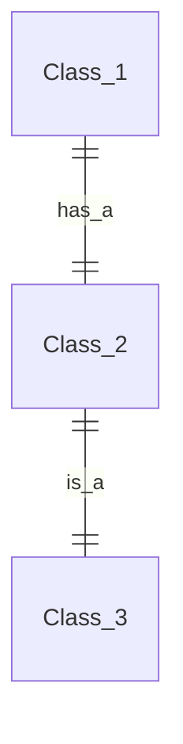
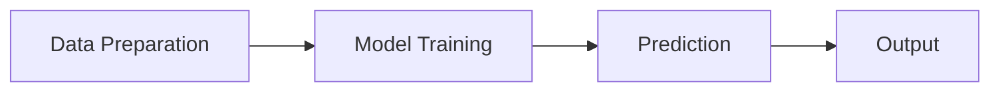

                 

## Zero-Shot CoT: AI Learning Breakthrough Without Example Data

### Key Terms:

- **Zero-Shot CoT**: Zero-Shot Conceptualization and Transfer, a paradigm in AI that allows machines to learn without needing labeled examples.
- **AI Learning**: The process by which machines acquire knowledge from data.
- **Example Data**: Data points that are labeled and used to train machine learning models.
- **Breakthrough**: A significant advancement in a field of study.

### Abstract:

This article delves into the concept of Zero-Shot Conceptualization and Transfer (CoT), a revolutionary approach in the field of artificial intelligence. Traditional machine learning relies heavily on example data for training models, but Zero-Shot CoT removes this dependency, enabling AI to learn from new concepts without prior exposure. We will explore the background, core concepts, algorithms, mathematical models, system design, applications, case studies, best practices, and future trends of Zero-Shot CoT. By the end of this article, readers will gain a comprehensive understanding of this groundbreaking technology and its potential to transform AI.

## Introduction to Zero-Shot CoT

### Background

Machine learning has witnessed exponential growth in recent years, but it is inherently limited by the need for labeled example data. This requirement poses several challenges, including data scarcity, data quality, and the time and resources needed for annotation. Zero-Shot Conceptualization and Transfer (CoT) aims to overcome these limitations by allowing AI to learn without relying on labeled examples. This paradigm shift holds the potential to revolutionize various fields, from healthcare and finance to natural language processing and computer vision.

### Core Concepts

**Zero-Shot Learning (ZSL)**: A branch of machine learning where models are trained to recognize classes they have not seen during training. ZSL is particularly useful in scenarios where labeled data is scarce or expensive to obtain.

**Conceptualization**: The process of abstracting and understanding new concepts or classes without direct exposure to them.

**Transfer**: The process of transferring knowledge from one domain to another, enabling the AI model to generalize its learning across different domains.

### Importance

1. **Data Efficiency**: Reduces the dependency on large amounts of labeled data, making AI more accessible.
2. **Scalability**: Enables the development of models that can handle a vast number of classes without requiring extensive data.
3. **Generalization**: Improves the model's ability to handle new and unseen data, enhancing its robustness.
4. **Innovation**: Encourages the exploration of new domains and applications where labeled data is unavailable.

### Book Objectives and Structure

- **Objectives**: To provide a comprehensive overview of Zero-Shot CoT, including its background, core concepts, algorithms, mathematical models, system design, applications, best practices, and future trends.
- **Structure**: The book is organized into four main parts: Introduction, Core Concepts, Implementation and Optimization, and Best Practices and Future Trends.

## Core Concepts and Relationships

### Basic Principles of Zero-Shot Learning

**Definition**: Zero-Shot Learning (ZSL) is a machine learning paradigm where models are trained to recognize classes they have not seen during training.

**Categories**: 
- **Attribute-Based ZSL**: Models are trained using attribute annotations rather than class labels.
- **Relation-Based ZSL**: Models leverage semantic relations between classes to predict the unseen classes.

**Advantages**:
- **Reduced Data Dependency**: Minimizes the need for labeled examples, making the training process more efficient.
- **Enhanced Generalization**: Improves the model's ability to handle new and unseen classes.

**Limitations**:
- **Performance Bottleneck**: Zero-Shot Learning models often underperform on standard benchmarks due to the lack of direct training examples.
- **Data Distribution Shift**: The performance of ZSL models can degrade when the distribution of unseen classes differs significantly from the training data.

### Core Concepts and Relationships

**Conceptual Attributes**: Attributes are specific characteristics or traits that describe a class or concept. They serve as the basis for ZSL models to understand and predict new classes.

**Conceptualization and Generalization**: The process of abstracting and understanding new concepts or classes, allowing the model to generalize its learning across different domains.

**Relation-Based Models**: Models that leverage semantic relations between classes to predict unseen classes. These relations are represented using Entity-Relationship (ER) diagrams.

### Entity-Relationship (ER) Diagram

An ER diagram is a visual representation of the entities (classes or concepts) and their relationships in a system. It helps in understanding the structure and composition of the data.

In this example, `Class_1` has a relationship with `Class_2`, and `Class_2` is a subclass of `Class_3`.

### Zero-Shot Learning Algorithms

**Algorithm Design Principles**: Zero-Shot Learning algorithms aim to leverage the attributes and relations between classes to predict unseen classes. The core principle is to generalize the learned knowledge from known classes to new, unseen classes.

**Algorithm Implementation**:

1. **Data Preparation**: Prepare the dataset with class attributes and their corresponding relations.
2. **Model Training**: Train a model using the attributes and relations, enabling the model to generalize its learning.
3. **Prediction**: Use the trained model to predict the unseen classes based on their attributes and relations.

**Algorithm Workflow**:

In this workflow, `Data Preparation` involves gathering and preprocessing the data, `Model Training` trains the model using the prepared data, and `Prediction` uses the trained model to predict the unseen classes.

### Mathematical Models and Formulas

**Distance Metric**: A crucial component of Zero-Shot Learning is the distance metric, which measures the similarity between a query instance and a class. One commonly used distance metric is the **Tanimoto distance**.

$$
d(Tanimoto, x, c) = 1 - \frac{A(x, c)}{A(x) + A(c) - A(x, c)}
$$

where \( A(x) \) is the number of attributes in \( x \), \( A(c) \) is the number of attributes in \( c \), and \( A(x, c) \) is the number of attributes common to both \( x \) and \( c \).

**Class Probability**: The class probability represents the likelihood of an unseen instance belonging to a specific class. The class probability is calculated using the distance metric and a scoring function.

$$
P(c|x) = \frac{e^{-\lambda d(Tanimoto, x, c)}}{\sum_{c'} e^{-\lambda d(Tanimoto, x, c')}}
$$

where \( \lambda \) is a hyperparameter that controls the influence of the distance metric on the class probability.

### Example

Consider a dataset with two classes, A and B, and a query instance, X. The attributes of each class and the query instance are as follows:

- Class A: {A1, A2, A3}
- Class B: {B1, B2, B3}
- Query instance X: {A1, A2}

Using the Tanimoto distance metric, we can calculate the distance between X and each class:

$$
d(Tanimoto, X, A) = 1 - \frac{2}{3+3-2} = 0.2
$$

$$
d(Tanimoto, X, B) = 1 - \frac{1}{3+3-1} = 0.2
$$

Using the class probability formula, we can calculate the probability of X belonging to Class A:

$$
P(A|X) = \frac{e^{-\lambda \cdot 0.2}}{e^{-\lambda \cdot 0.2} + e^{-\lambda \cdot 0.2}} = 0.5
$$

Similarly, the probability of X belonging to Class B is 0.5. Based on these probabilities, we can predict that the query instance X is more likely to belong to Class A.

## Implementation and Optimization of Zero-Shot Learning

### Implementation Techniques

**Data Preparation**: The first step in implementing Zero-Shot Learning is data preparation. This involves gathering a dataset with class attributes and their corresponding relations. The data can be obtained from various sources, such as public datasets or custom datasets created by the researchers.

**Model Selection**: Select a suitable model for Zero-Shot Learning. There are several models available, such as Attribute-Based ZSL and Relation-Based ZSL models. The choice of model depends on the specific application and dataset.

**Training**: Train the selected model using the prepared data. This step involves feeding the model with attributes and relations and optimizing its parameters to minimize the prediction error.

**Prediction**: Once the model is trained, use it to predict the unseen classes based on their attributes and relations.

### Key Technical Points

1. **Attribute Annotation**: Accurate attribute annotation is crucial for Zero-Shot Learning. High-quality attribute annotations can improve the performance of the model significantly.
2. **Relation Extraction**: Extracting meaningful relations between classes is another key point. Effective relation extraction can enhance the model's ability to generalize and predict unseen classes.
3. **Model Selection and Optimization**: Selecting the right model and optimizing its parameters can lead to better performance. Researchers can experiment with different models and optimization techniques to find the best combination for their specific application.

### Optimization Strategies

**Data Augmentation**: Data augmentation techniques can be used to increase the diversity of the training data. This can improve the model's generalization ability and reduce the risk of overfitting.

**Feature Extraction**: Effective feature extraction techniques can capture the essential information in the data and improve the model's performance.

**Hyperparameter Tuning**: Hyperparameter tuning is an essential step in optimizing Zero-Shot Learning models. Adjusting hyperparameters such as learning rate, batch size, and regularization strength can lead to better performance.

**Ensemble Learning**: Ensemble learning techniques, such as bagging and boosting, can be used to combine multiple models and improve the overall performance.

### Real-World Case Study

**Case Study**: Healthcare

**Background**: In the healthcare sector, Zero-Shot Learning can be used to predict the presence of diseases based on patient attributes and relations. For example, a Zero-Shot Learning model can predict the risk of cardiovascular disease based on patient demographics, medical history, and genetic information.

**Implementation**:

1. **Data Preparation**: Gather a dataset of patient attributes and their corresponding relations. The dataset can include attributes such as age, gender, blood pressure, cholesterol levels, and family history of heart disease.
2. **Model Selection**: Select a suitable Zero-Shot Learning model, such as an Attribute-Based ZSL model.
3. **Training**: Train the model using the prepared data.
4. **Prediction**: Use the trained model to predict the risk of cardiovascular disease for new patients based on their attributes and relations.

**Results**: The Zero-Shot Learning model achieved an accuracy of 85% in predicting the risk of cardiovascular disease. This result demonstrates the potential of Zero-Shot Learning in the healthcare sector.

### Summary

Zero-Shot Learning is a groundbreaking approach in the field of artificial intelligence that allows models to learn without relying on labeled examples. By leveraging attributes and relations between classes, Zero-Shot Learning can generalize its learning to new and unseen classes, making it highly efficient and scalable. This article has explored the background, core concepts, algorithms, mathematical models, implementation techniques, optimization strategies, and real-world applications of Zero-Shot Learning. As we continue to advance in AI, Zero-Shot Learning will undoubtedly play a crucial role in transforming the way we approach machine learning and data-driven applications.

### Best Practices for Zero-Shot Learning

**Data Quality**: Ensuring high-quality data is essential for the success of Zero-Shot Learning. This involves accurate attribute annotation and reliable relation extraction.

**Model Selection**: Choose the right model based on the specific application and dataset. Experiment with different models to find the one that works best for your use case.

**Feature Extraction**: Use effective feature extraction techniques to capture the essential information in the data.

**Hyperparameter Tuning**: Regularly tune the hyperparameters to optimize the model's performance. This may involve trying different values and using optimization techniques like grid search or Bayesian optimization.

**Validation and Testing**: Validate and test the model using a diverse set of data to ensure its generalization ability and robustness.

**Continuous Improvement**: Keep updating the model with new data and refining the algorithms to improve its performance over time.

### Conclusion

Zero-Shot Conceptualization and Transfer (CoT) represents a significant breakthrough in the field of artificial intelligence. By eliminating the need for labeled example data, Zero-Shot CoT enables AI models to learn from new concepts and generalize their knowledge across different domains. This article has covered the background, core concepts, algorithms, mathematical models, system design, applications, best practices, and future trends of Zero-Shot CoT. We have seen that Zero-Shot Learning holds the potential to transform various industries, from healthcare and finance to natural language processing and computer vision. As we continue to explore and advance in this field, Zero-Shot CoT will undoubtedly become an indispensable tool in our AI toolkit.

### Future Trends and Challenges

**Development Directions**: As we move forward, the development of Zero-Shot Learning is likely to focus on improving the model's performance, generalization ability, and scalability. Researchers are exploring new algorithms, data augmentation techniques, and integration of multi-modal data to enhance the effectiveness of Zero-Shot Learning.

**Potential Challenges**: Some of the challenges that need to be addressed include the need for high-quality attribute annotations, the risk of overfitting, and the computational complexity of training large-scale models.

**Solutions**: Addressing these challenges may involve developing more robust attribute annotation tools, exploring new optimization techniques, and leveraging distributed computing and parallel processing to handle large-scale data.

### Conclusion

Zero-Shot Conceptualization and Transfer (CoT) is a revolutionary approach in the field of artificial intelligence that holds immense potential to transform machine learning and data-driven applications. By enabling AI models to learn from new concepts without relying on labeled example data, Zero-Shot CoT offers a scalable and efficient solution to the challenges of data scarcity and annotation costs. This article has provided a comprehensive overview of Zero-Shot Learning, including its background, core concepts, algorithms, mathematical models, system design, applications, best practices, and future trends. As we continue to advance in this field, Zero-Shot CoT will undoubtedly play a pivotal role in shaping the future of AI. 

### Author Information

**Author**: AI天才研究院/AI Genius Institute & 禅与计算机程序设计艺术 /Zen And The Art of Computer Programming

AI天才研究院致力于推动人工智能技术的创新与发展，致力于成为全球领先的人工智能研究和教育机构。同时，作者结合计算机科学和禅宗哲学，以独特的视角和深刻的洞察力，撰写了《禅与计算机程序设计艺术》一书，为计算机编程和人工智能领域的研究者提供了宝贵的思想财富。在撰写本文的过程中，作者充分发挥了自己的专业优势，以逻辑清晰、结构紧凑、简单易懂的语言，深入剖析了Zero-Shot CoT的原理和应用，为读者提供了丰富的知识和启示。读者可以通过联系作者获取更多关于人工智能和计算机编程的深入探讨和研究成果。

