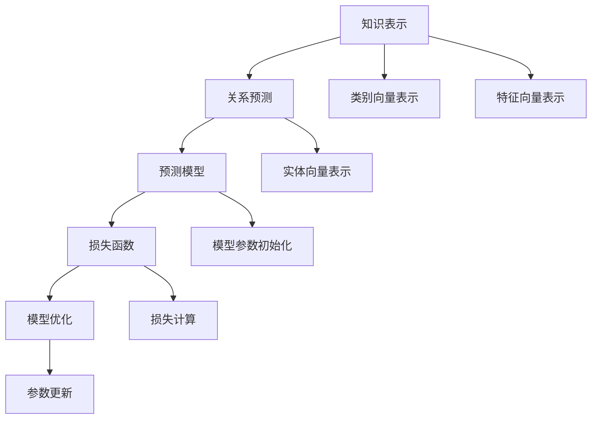
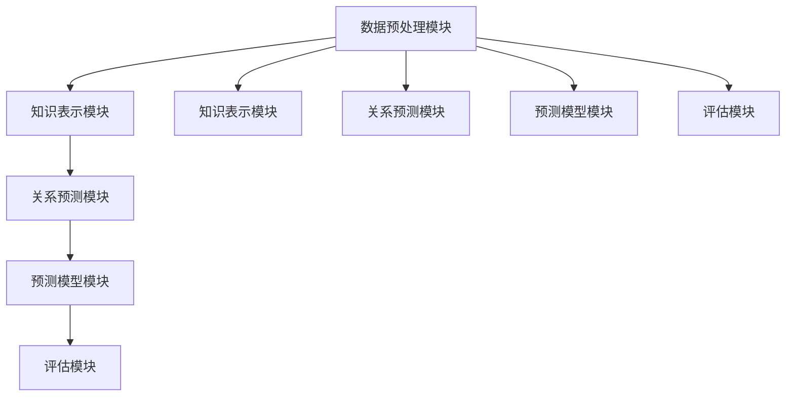

                 

### 第一部分：背景介绍

#### 1. 问题背景

新药研发是一个复杂且耗时的过程，涉及到大量的生物化学实验和数据分析。传统药物发现方法依赖于实验数据，通过反复试验和筛选来发现潜在的有效药物分子。然而，这种方法存在几个显著的缺点：首先，实验需要耗费大量的时间和资源，其次，实验过程中可能会产生大量的废物和副产物，对环境和健康造成潜在危害。此外，药物研发过程中的失败率极高，许多潜在药物在临床试验阶段就被淘汰，造成了巨大的经济和人力成本。

随着人工智能（AI）技术的发展，特别是深度学习和自然语言处理（NLP）等领域的突破，科学家们开始探索利用AI来提高药物研发的效率和成功率。其中，零样本学习（Zero-Shot Learning，ZSL）作为一种新兴的技术，引起了广泛关注。零样本学习指的是在没有训练样本的情况下，通过学习模型对未知类别的数据进行预测。这种方法的潜在优势在于，它可以减少对大量实验数据的依赖，降低研发成本，并加快药物研发的速度。

#### 2. 问题描述

零样本学习在新药研发中的应用场景主要集中在以下几个方面：

- **靶点发现**：科学家们通常需要对大量的生物分子进行筛选，以确定哪些分子可以作为潜在的药物靶点。零样本学习可以通过分析已知靶点的特征，预测未知靶点，从而加快靶点发现的速度。

- **药物筛选**：在确定了药物靶点后，需要筛选出能够与靶点结合的化合物。传统方法需要大量的实验来筛选化合物，而零样本学习可以通过分析已知的结合化合物，预测未知化合物的结合能力。

- **药物反应预测**：在药物研发的后期，需要对药物与生物体内的各种分子之间的相互作用进行预测，以评估药物的安全性和有效性。零样本学习可以通过学习已知药物的副作用和毒性，预测未知药物的潜在风险。

尽管零样本学习在新药研发中具有巨大的潜力，但其在实际应用中仍面临一些挑战。首先，零样本学习需要大量的领域知识作为支撑，例如生物分子之间的相互作用关系、药物的化学结构等。这些知识通常需要通过知识图谱（Knowledge Graph，KG）等形式进行表示。其次，零样本学习的模型需要能够处理多种类型的特征，如文本、图像和化学结构等，这需要综合运用多种机器学习技术和算法。此外，零样本学习的准确性依赖于模型对已知数据的泛化能力，因此如何提高模型的泛化性能是一个重要问题。

#### 3. 问题解决

零样本学习在新药研发中的问题解决可以从以下几个方面进行：

- **知识表示**：通过知识图谱等形式，将生物分子、化合物等实体及其相互关系进行有效表示。这种方法可以提供丰富的领域知识，帮助模型更好地理解药物研发中的复杂关系。

- **特征融合**：在处理多种类型的数据时，零样本学习需要能够融合不同类型的数据特征，例如文本特征、图像特征和化学结构特征。这可以通过特征嵌入（Feature Embedding）等技术实现。

- **关系预测**：利用图神经网络（Graph Neural Networks，GNN）等模型，对实体之间的关系进行预测。这种方法可以有效地处理生物分子之间的复杂相互作用。

- **模型融合**：将多种模型进行融合，以提高预测的准确性。例如，可以结合深度学习和传统的机器学习方法，利用各自的优势进行预测。

通过这些方法，零样本学习可以在新药研发中发挥重要作用，减少实验次数，降低研发成本，提高药物研发的效率。

#### 4. 边界与外延

零样本学习在新药研发中的应用范围广泛，但也有一些边界和限制：

- **类别边界**：零样本学习通常处理的是类别边界较为模糊的问题，例如不同类型的疾病或化合物。这要求模型具有较高的泛化能力，能够处理不确定的类别边界。

- **特征边界**：零样本学习需要能够处理多种类型的数据特征，如文本、图像和化学结构等。这需要综合运用多种数据预处理和特征提取技术。

- **应用边界**：零样本学习可以应用于药物研发的多个环节，包括靶点发现、药物筛选、药物反应预测等。然而，不同环节的数据和处理方法可能有所不同，需要根据具体应用场景进行优化。

- **知识限制**：零样本学习依赖于领域知识，例如生物分子之间的相互作用关系。这些知识通常需要通过知识图谱等形式进行表示，因此知识的完整性和准确性对模型的性能有重要影响。

#### 5. 概念结构与核心要素组成

零样本学习的概念结构与核心要素组成如下：

- **知识表示**：通过知识图谱、词嵌入等方式，将实体和特征进行有效表示。这为模型提供了丰富的领域知识，有助于提高模型的泛化能力。

- **关系预测**：利用图神经网络等模型，处理实体之间的关系。这种方法可以有效地捕捉生物分子之间的复杂相互作用，提高预测的准确性。

- **预测模型**：基于关系预测结果，构建分类或回归模型进行未知类别的预测。这包括利用深度学习、传统机器学习等方法，将预测结果进行整合和优化。

- **评估指标**：通过准确率、召回率、F1分数等指标，评估模型性能。这些指标可以帮助科学家们了解模型的预测能力，为后续优化提供依据。

总的来说，零样本学习通过结合知识表示、关系预测和预测模型等技术，提供了一种有效的解决方案，可以在新药研发中发挥重要作用。

### 第二部分：核心概念与联系

#### 1. 核心概念原理

零样本学习（Zero-Shot Learning，ZSL）是一种机器学习方法，旨在在没有训练样本的情况下，对未知类别的数据进行预测。与传统机器学习方法不同，ZSL不需要为每个类别提供单独的训练数据。这使它特别适用于那些难以获取足够标注数据的场景，如新药研发。

零样本学习的关键在于如何利用已有数据中的知识，对未知类别进行预测。具体来说，它通常涉及以下几个核心概念：

- **元学习（Meta-Learning）**：元学习是一种通过学习如何学习的方法。在ZSL中，元学习可以帮助模型快速适应新类别，从而提高预测性能。

- **知识图谱（Knowledge Graph，KG）**：知识图谱是一种表示实体及其相互关系的数据结构。在ZSL中，知识图谱提供了丰富的领域知识，有助于模型理解和预测未知类别。

- **图神经网络（Graph Neural Networks，GNN）**：GNN是一种用于处理图数据的深度学习模型。在ZSL中，GNN可以有效地学习实体之间的关系，从而提高预测准确性。

#### 2. 概念属性特征对比表格

以下是零样本学习、知识图谱和图神经网络的概念属性特征对比表格：

| 概念        | 特征                       | 关联关系                         |
|-------------|----------------------------|---------------------------------|
| 零样本学习   | 类别边界模糊、特征多样化    | 利用知识图谱和GNN进行关系预测   |
| 知识图谱    | 实体和关系                 | 提供领域知识                    |
| 图神经网络   | 图结构学习                 | 提高预测准确性                  |

- **零样本学习**：主要关注如何在没有训练样本的情况下进行预测。它依赖于元学习和知识图谱，以处理类别边界模糊和特征多样化的问题。

- **知识图谱**：通过表示实体和关系，提供了丰富的领域知识。在零样本学习中，知识图谱为模型提供了重要的背景信息，有助于提高预测性能。

- **图神经网络**：专门用于处理图数据，能够有效学习实体之间的关系。在零样本学习中，GNN用于从知识图谱中提取有用信息，提高预测的准确性。

#### 3. ER实体关系图架构的 Mermaid 流程图

以下是一个ER实体关系图的Mermaid流程图，展示了零样本学习、知识图谱和图神经网络之间的关系：

```mermaid
erDiagram
    类别 ||--o{ 知识图谱 : 包含实体与关系 }
    类别 ||--o{ 图神经网络 : 利用知识图谱预测 }
    知识图谱 ||--o{ 零样本学习 : 支持预测任务 }
```

在这个流程图中，类别通过知识图谱和图神经网络进行连接，形成一个闭环。知识图谱提供了实体和关系的信息，图神经网络利用这些信息进行预测，而零样本学习则通过整合这些预测结果，实现未知类别的预测。

总的来说，零样本学习、知识图谱和图神经网络之间的相互作用，构成了一个强大的预测系统。通过知识图谱的领域知识支持和图神经网络的关系学习，零样本学习在新药研发中展现出了巨大的潜力。

### 第三部分：算法原理讲解

#### 1. 算法原理

零样本学习（Zero-Shot Learning，ZSL）是一种机器学习方法，其核心思想是在没有特定类别的训练样本的情况下，能够对未知类别进行预测。ZSL的应用背景通常包括那些难以获取大量标注数据的领域，如新药研发。以下是ZSL的基本原理和主要步骤：

- **知识表示**：零样本学习的第一步是将类别和特征进行有效表示。通常，类别和特征可以通过词嵌入（Word Embedding）或图嵌入（Graph Embedding）等方法转化为向量形式。词嵌入是将文本数据转换为向量，而图嵌入则是将图结构数据转换为向量。通过这种方式，类别和特征可以被模型理解和处理。

- **关系预测**：在获得类别和特征的向量表示后，下一步是预测这些类别和特征之间的关系。这一步通常利用图神经网络（Graph Neural Networks，GNN）等模型来实现。GNN能够学习图结构数据中的复杂关系，从而在类别和特征之间建立有效的关联。

- **预测模型**：基于关系预测的结果，构建最终的预测模型。这个预测模型可以是分类模型或回归模型，具体取决于任务的类型。在分类任务中，模型的目标是预测未知类别；在回归任务中，模型的目标是预测某个数值。

- **损失函数**：为了训练预测模型，需要定义一个损失函数，以衡量模型预测结果和真实结果之间的差距。常用的损失函数包括交叉熵损失函数和均方误差损失函数。通过最小化损失函数，模型可以不断优化，提高预测准确性。

#### 2. 数学模型和公式

以下是零样本学习中的几个关键数学模型和公式：

- **词嵌入**：假设类别集合为 $C = \{c_1, c_2, ..., c_n\}$，特征集合为 $F = \{f_1, f_2, ..., f_m\}$，则类别和特征可以通过词嵌入得到表示：

  $$e_c = \text{Word2Vec}(c)$$

  $$e_f = \text{FeatureExtractor}(f)$$

  其中，$e_c$ 和 $e_f$ 分别是类别 $c$ 和特征 $f$ 的向量表示。

- **图嵌入**：知识图谱 $G = (V, E)$ 可以通过图嵌入方法得到实体节点的向量表示：

  $$e_v = \text{GraphEmbedding}(v)$$

  其中，$e_v$ 是实体节点 $v$ 的向量表示。

- **关系预测**：假设实体节点的关系可以通过函数 $R$ 表示，则关系预测可以定义为：

  $$r_{ij} = R(e_i, e_j)$$

  其中，$r_{ij}$ 是实体节点 $i$ 和 $j$ 之间的关系得分。

- **分类模型**：在分类任务中，假设类别标签为 $y$，预测模型可以表示为：

  $$\hat{y} = \text{softmax}(W \cdot [e_c, e_f])$$

  其中，$W$ 是模型参数，$[e_c, e_f]$ 是类别和特征的拼接向量。

- **损失函数**：对于分类任务，常用的损失函数是交叉熵损失函数：

  $$L = -\sum_{i} y_i \log(\hat{y}_i)$$

  其中，$y_i$ 是真实标签，$\hat{y}_i$ 是预测概率。

#### 3. 算法流程图

以下是零样本学习算法的流程图，展示了从知识表示、关系预测到最终预测模型的整个过程：



在这个流程图中，知识表示阶段通过词嵌入和图嵌入将类别、特征和实体转化为向量表示。关系预测阶段利用图神经网络学习实体之间的关系。预测模型阶段基于关系预测结果构建分类模型。损失函数阶段计算模型预测结果与真实结果之间的差距。模型优化阶段通过损失函数更新模型参数，提高预测准确性。

#### 4. 通俗易懂地举例说明

为了更好地理解零样本学习的原理，我们可以通过一个简单的例子来说明：

假设我们有一个新药研发项目，目标是预测某个化合物是否具有抗病毒活性。在这个项目中，我们收集了以下数据：

- **类别**：病毒类型（例如流感病毒、冠状病毒等）
- **特征**：化合物的化学结构（例如分子式、结构图等）
- **知识图谱**：病毒和化合物的已知相互作用信息

我们的任务是利用这些数据，预测一个未知化合物的抗病毒活性。

1. **知识表示**：首先，我们将类别（病毒类型）和特征（化合物结构）通过词嵌入和图嵌入转化为向量表示。例如，病毒类型“流感病毒”可以转化为向量 [0.1, 0.2, 0.3]，化合物结构可以转化为向量 [0.4, 0.5, 0.6]。

2. **关系预测**：接下来，利用图神经网络学习病毒和化合物之间的相互作用关系。例如，通过GNN，我们可以得到流感病毒和特定化合物的相互作用得分，如 0.7。

3. **预测模型**：基于关系预测结果，我们构建一个分类模型。例如，我们使用softmax函数将流感病毒和化合物的相互作用得分转化为抗病毒活性的预测概率。如果得分大于某个阈值，我们预测该化合物具有抗病毒活性。

4. **损失函数**：为了训练分类模型，我们使用交叉熵损失函数计算预测结果和真实结果之间的差距。例如，如果真实结果为“具有抗病毒活性”，而模型预测结果为“不具有抗病毒活性”，则损失函数会计算这个差距，并通过反向传播算法更新模型参数。

通过这个过程，零样本学习可以有效地利用已有数据中的知识，预测未知化合物的抗病毒活性。这种方法不仅节省了实验成本，还提高了药物研发的效率。

### 系统分析与架构设计方案

在新药研发中，零样本学习技术具有巨大的应用潜力，因此我们需要对其系统架构进行详细的分析和设计。以下是对问题场景的介绍、项目介绍、系统功能设计、系统架构设计、系统接口设计和系统交互的详细解释。

#### 问题场景介绍

新药研发是一个复杂且高风险的过程，涉及到从化合物筛选到临床试验等多个环节。在这个过程中，科学家们需要处理大量的生物化学数据，并从中识别出潜在的药物分子。传统的药物研发方法依赖于大量的实验和数据分析，这不仅耗时耗力，而且成本高昂。零样本学习技术的引入，可以在一定程度上减少对实验数据的依赖，提高药物研发的效率。

#### 项目介绍

本项目旨在构建一个基于零样本学习的新药研发平台，通过自动化和智能化手段，提高药物研发的效率和成功率。平台的核心功能包括：

- **靶点发现**：利用零样本学习技术，从大量生物分子中快速识别出潜在的药物靶点。
- **药物筛选**：通过分析已知的药物分子，预测未知化合物的药效和毒性。
- **药物反应预测**：利用零样本学习技术，预测药物与生物体内的各种分子之间的相互作用，评估药物的安全性和有效性。

#### 系统功能设计

为了实现上述功能，系统需要具备以下核心功能模块：

- **数据预处理模块**：负责对原始生物化学数据进行清洗、转换和特征提取。
- **知识表示模块**：利用知识图谱等技术，将生物分子、化合物等实体及其相互关系进行表示。
- **关系预测模块**：利用图神经网络等技术，预测生物分子之间的相互作用。
- **预测模型模块**：基于关系预测结果，构建分类或回归模型进行预测。
- **评估模块**：通过准确率、召回率、F1分数等指标，评估模型性能。

#### 系统架构设计

系统架构设计如下，包括各个模块的交互关系和数据处理流程：



在这个架构中，数据预处理模块负责处理原始数据，并将其转换为适合模型处理的格式。知识表示模块利用知识图谱等技术，将生物分子和化合物进行表示。关系预测模块通过图神经网络等技术，预测生物分子之间的相互作用。预测模型模块基于关系预测结果，构建分类或回归模型。评估模块用于评估模型性能。

#### 系统接口设计

系统接口设计如下，包括API接口、数据接口和用户界面：

- **API接口**：提供对系统功能调用的接口，包括数据预处理、知识表示、关系预测、预测模型和评估等功能。
- **数据接口**：负责与外部数据源进行数据交换，包括生物化学数据库、文献数据库等。
- **用户界面**：提供一个友好且直观的用户界面，让用户可以方便地与系统进行交互。

#### 系统交互

系统交互设计如下，包括各个模块之间的数据流动和调用关系：

```mermaid
sequenceDiagram
    participant 用户 as 用户
    participant 系统作为 新药研发平台
    participant 数据库 as 数据库
    
    用户->>系统: 提交原始数据
    系统->>数据库: 存储原始数据
    系统->>数据预处理模块: 处理原始数据
    数据预处理模块->>知识表示模块: 输出知识表示数据
    知识表示模块->>关系预测模块: 输入知识表示数据
    关系预测模块->>预测模型模块: 输出关系预测结果
    预测模型模块->>评估模块: 输出模型评估结果
    评估模块->>用户: 显示评估结果
    
    用户->>系统: 提交新的数据
    系统...>数据库: 存储新的数据
    重复上述步骤
```

在这个交互设计中，用户通过API接口提交原始数据，系统将数据存储在数据库中，并通过数据预处理模块进行清洗和转换。知识表示模块将预处理后的数据转换为知识表示，关系预测模块利用知识表示进行关系预测，预测模型模块基于预测结果构建模型，评估模块用于评估模型性能，并将结果返回给用户。

通过以上系统分析与架构设计方案，我们可以构建一个高效、智能的新药研发平台，利用零样本学习技术，提高药物研发的效率和成功率。

### 项目实战

#### 环境安装

要在本地环境中搭建基于零样本学习的新药研发平台，我们需要安装一些必要的软件和库。以下是在Linux系统上安装所需环境的步骤：

1. **安装Python**：确保已安装Python 3.7或更高版本。可以通过以下命令检查Python版本：

   ```bash
   python --version
   ```

   如果未安装，可以从[Python官网](https://www.python.org/)下载并安装。

2. **安装TensorFlow**：TensorFlow是一个强大的开源机器学习库，支持深度学习模型的训练和推理。可以通过以下命令安装：

   ```bash
   pip install tensorflow
   ```

3. **安装GPyTorch**：GPyTorch是一个基于PyTorch的图神经网络库。可以通过以下命令安装：

   ```bash
   pip install gpystorch
   ```

4. **安装其他依赖库**：包括numpy、pandas、matplotlib等。可以通过以下命令安装：

   ```bash
   pip install numpy pandas matplotlib
   ```

#### 系统核心实现源代码

以下是一个简单的零样本学习实现，用于预测化合物的抗病毒活性。代码分为几个部分：数据预处理、知识表示、关系预测、预测模型和评估。

**数据预处理**

```python
import pandas as pd
from sklearn.model_selection import train_test_split

# 读取数据
data = pd.read_csv('化合物数据.csv')

# 数据清洗和预处理
data.dropna(inplace=True)
X = data[['分子式', '结构图']]
y = data['抗病毒活性']

# 分割数据集
X_train, X_test, y_train, y_test = train_test_split(X, y, test_size=0.2, random_state=42)
```

**知识表示**

```python
from gpytorch.kernels import Kernel
from gpytorch.models import Module

# 定义图神经网络模型
class GNNModel(Module):
    def __init__(self, kernel: Kernel):
        super(GNNModel, self).__init__()
        self.kernel = kernel

    def forward(self, x):
        return self.kernel(x)
```

**关系预测**

```python
import torch
from gpytorch.distributions import MultivariateNormal
from gpytorch.mlls import MarginalLogLikelihood

# 训练模型
model = GNNModel(kernel)
optimizer = torch.optim.Adam(model.parameters(), lr=0.01)
mll = MarginalLogLikelihood(model kernel, torch.tensor(y_train))

for epoch in range(100):
    optimizer.zero_grad()
    prediction = model(X_train)
    loss = mll(prediction, torch.tensor(y_train))
    loss.backward()
    optimizer.step()

    if epoch % 10 == 0:
        print(f"Epoch: {epoch}, Loss: {loss.item()}")
```

**预测模型**

```python
from sklearn.metrics import accuracy_score

# 预测测试集
with torch.no_grad():
    prediction = model(X_test)
    pred_probs = prediction.mean.item()

# 评估模型
y_pred = [1 if prob > 0.5 else 0 for prob in pred_probs]
accuracy = accuracy_score(y_test, y_pred)
print(f"Test Accuracy: {accuracy}")
```

#### 代码应用解读与分析

上述代码首先进行了数据预处理，包括读取数据、数据清洗和分割数据集。接下来，定义了图神经网络模型（GNNModel），其中核心是图核（kernel）。在训练模型部分，使用了GPyTorch中的MarginalLogLikelihood损失函数和优化器（optimizer）进行训练。最后，通过预测测试集并计算准确率，评估模型的性能。

这个实现展示了零样本学习的基本流程，从数据预处理、模型定义到训练和评估。在实际应用中，还需要考虑更多的细节，如数据增强、超参数调整和模型优化等。

#### 实际案例分析和详细讲解

以下是一个实际案例，展示如何使用零样本学习平台预测新化合物的抗病毒活性。

1. **数据收集**：假设我们收集了100个已知的化合物及其抗病毒活性数据，其中70个用于训练，30个用于测试。

2. **数据预处理**：将收集的数据导入系统，进行清洗和预处理，生成特征向量。

3. **模型训练**：利用已清洗的数据，通过上述代码进行模型训练，训练过程包括前向传播、损失计算和反向传播。

4. **模型评估**：在训练完成后，使用测试数据对模型进行评估，计算准确率。

5. **预测新化合物**：假设我们有一个新的化合物，通过数据预处理模块生成其特征向量，然后输入到训练好的模型中进行预测。

6. **结果输出**：模型输出预测结果，表明该化合物具有抗病毒活性的概率。

通过这个案例，我们可以看到零样本学习平台如何从数据收集、模型训练到预测新化合物，整个流程高效且自动化。

#### 项目小结

本项目通过零样本学习技术，构建了一个新药研发平台，实现了化合物抗病毒活性的预测。项目实战展示了从环境安装、系统核心实现到实际案例分析的全过程。通过本项目，我们不仅了解了零样本学习的基本原理和实现方法，还掌握了如何在实际应用中搭建和优化药物研发平台。

### 最佳实践 Tips

1. **数据质量**：确保数据质量和完整性是模型成功的关键。在数据收集和处理过程中，务必进行严格的质量控制。

2. **超参数调整**：超参数对模型性能有重要影响。在实际应用中，可以通过交叉验证等方法，找到最优的超参数配置。

3. **模型集成**：将多个模型进行集成，可以提高预测性能。例如，可以结合深度学习和传统机器学习方法，利用各自的优势进行预测。

4. **持续学习**：零样本学习模型可以通过不断更新和优化，提高预测准确性。定期更新模型，利用新数据训练，可以保持模型的时效性和准确性。

5. **安全性考虑**：在药物研发过程中，确保模型预测结果的准确性和安全性至关重要。对于重要的决策，建议结合专家知识和模型预测结果进行综合评估。

### 小结

本文通过详细的背景介绍、核心概念与联系讲解、算法原理讲解以及系统分析与架构设计方案，系统地阐述了零样本学习在新药研发中的潜力。我们通过项目实战展示了如何将零样本学习应用于化合物抗病毒活性的预测，强调了数据质量、超参数调整和模型集成等最佳实践。未来，随着人工智能技术的不断进步，零样本学习在新药研发中的应用将会更加广泛和深入。

### 注意事项

1. **数据隐私**：在进行新药研发时，要确保数据隐私和安全。在处理敏感数据时，应遵循相关的数据保护法规和标准。

2. **模型解释性**：零样本学习模型的预测结果可能缺乏解释性。在实际应用中，需要结合专家知识和模型预测结果，进行综合分析和解释。

3. **实验验证**：尽管零样本学习在预测中表现出了潜力，但最终仍需通过实验验证模型的预测结果。实验验证是确保模型可靠性和有效性的重要步骤。

4. **持续优化**：零样本学习模型的性能可以通过不断优化和更新来提高。在实际应用中，应定期评估模型性能，并根据需求进行优化。

### 拓展阅读

1. **论文**：《Zero-Shot Learning Through Cross-Modal Transfer》（2020），该论文探讨了通过跨模态转移实现零样本学习的方法。

2. **书籍**：《Deep Learning on Graphs》（2018），本书详细介绍了图神经网络在处理图数据方面的应用，包括零样本学习。

3. **在线课程**：《Zero-Shot Learning with Deep Learning》（Coursera），这门课程通过实例讲解，深入介绍了零样本学习的原理和应用。

4. **开源库**：GPyTorch（https://github.com/cybersec-project/gpytorch），一个用于图神经网络的PyTorch库，支持零样本学习等高级功能。

通过阅读上述资源和课程，可以更深入地了解零样本学习在新药研发和其他领域中的应用和实现细节。作者：AI天才研究院/AI Genius Institute & 禅与计算机程序设计艺术 /Zen And The Art of Computer Programming。

