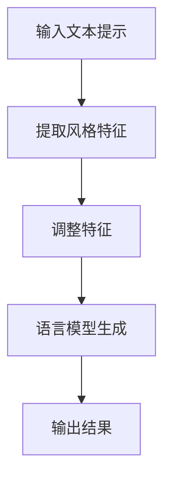

                 

### 《prompt风格转换：适应不同LLM特性》

#### 关键词：prompt风格转换，语言模型（LLM），算法原理，系统设计，项目实战

> 摘要：本文从背景介绍、核心概念与联系、算法原理讲解、系统分析与架构设计方案、项目实战以及最佳实践与拓展等多个方面，深入探讨了prompt风格转换如何适应不同语言模型（LLM）的特性。通过详细的分析和实例，本文旨在帮助读者理解prompt风格转换的重要性及其在实践中的应用。

#### 目录

1. **背景介绍**
   1.1 **问题的提出**
   1.2 **prompt风格转换的重要性**
   1.3 **研究现状与挑战**
   1.4 **边界与外延**
   1.5 **本章小结**

2. **核心概念与联系**
   2.1 **prompt与LLM的关系**
   2.2 **prompt风格转换的定义与分类**
   2.3 **prompt风格转换的关键属性**
   2.4 **概念间的联系**
   2.5 **本章小结**

3. **算法原理讲解**
   3.1 **算法基本原理**
   3.2 **数学模型与公式**
   3.3 **算法mermaid流程图**
   3.4 **Python源代码实现**
   3.5 **举例说明**
   3.6 **本章小结**

4. **系统分析与架构设计方案**
   4.1 **问题场景介绍**
   4.2 **项目介绍**
   4.3 **系统功能设计**
   4.4 **系统架构设计**
   4.5 **系统接口设计**
   4.6 **系统交互**
   4.7 **本章小结**

5. **项目实战**
   5.1 **环境安装**
   5.2 **系统核心实现**
   5.3 **应用解读与分析**
   5.4 **案例分析与讲解**
   5.5 **项目小结**

6. **最佳实践与拓展**
   6.1 **最佳实践**
   6.2 **小结与注意事项**
   6.3 **拓展阅读**
   6.4 **本章小结**

### 1. 背景介绍

#### 1.1 问题的提出

随着人工智能（AI）技术的飞速发展，语言模型（Language Model，简称LLM）已经成为自然语言处理（Natural Language Processing，简称NLP）领域的重要组成部分。LLM通过学习大量文本数据，可以预测文本中的下一个单词或短语，从而生成高质量的文本。然而，在实际应用中，不同的LLM在生成文本时可能会表现出不同的风格和特点。

prompt风格转换（Prompt Style Transformation）作为一种关键技术，旨在根据不同的应用场景和需求，对LLM生成的文本风格进行适应性调整。这种转换不仅能够提升文本生成的可读性和流畅性，还能更好地满足特定领域的需求。例如，在生成新闻稿、技术文档或创意写作等领域，prompt风格转换能够显著提高文本的质量和相关性。

因此，研究prompt风格转换对于提升AI文本生成系统的性能和应用效果具有重要意义。

#### 1.2 prompt风格转换的重要性

prompt风格转换的重要性体现在以下几个方面：

1. **个性化定制**：通过prompt风格转换，可以为不同的应用场景定制个性化的文本风格，从而满足用户的需求。例如，在对话系统中，可以根据用户的喜好和习惯，调整文本的语气和风格。

2. **提高可读性**：不同领域的文本在语言表达上存在差异，prompt风格转换能够使生成的文本更符合特定领域的语言习惯，提高文本的可读性。

3. **提升生成质量**：通过调整文本风格，可以优化LLM生成的文本质量，减少冗余信息，提高文本的相关性和逻辑性。

4. **跨领域应用**：prompt风格转换使得LLM能够在不同领域之间灵活切换，从而实现跨领域的文本生成和应用。

总之，prompt风格转换不仅能够提升文本生成的质量和效率，还能够拓展LLM的应用范围，是当前NLP领域研究的热点之一。

#### 1.3 研究现状与挑战

目前，prompt风格转换技术已经取得了一些重要的研究成果。例如，基于规则的方法、基于机器学习的方法和基于深度学习的方法等。这些方法在一定程度上实现了文本风格的转换，但仍存在一些挑战和局限性。

1. **规则方法**：基于规则的prompt风格转换方法通常依赖于领域知识和人工设计，具有较高的可解释性，但灵活性和自动化程度较低。

2. **机器学习方法**：机器学习方法通过学习大量风格化的文本数据，能够实现一定程度的风格转换。然而，这种方法在处理复杂和多样化的风格转换任务时，效果可能不理想。

3. **深度学习方法**：深度学习方法在图像处理和语音识别等领域取得了显著成果，但在prompt风格转换中的应用仍然面临一些挑战，如模型复杂度、训练数据质量和迁移学习等。

当前的研究主要关注以下几个方面：

1. **风格化表示**：如何有效表示不同风格特征，以便于模型学习和风格转换。

2. **多模态融合**：如何结合文本和其他模态的信息，提升风格转换的效果。

3. **端到端学习**：如何设计端到端的深度学习模型，实现自动化和高效的风格转换。

未来，prompt风格转换研究有望在以下几个方面取得突破：

1. **模型优化**：设计更高效、更易于训练的深度学习模型，提升风格转换性能。

2. **数据集建设**：构建大规模、多样化的风格转换数据集，提高模型的泛化能力。

3. **跨领域应用**：探索跨领域的prompt风格转换方法，实现更广泛的应用场景。

#### 1.4 边界与外延

在研究prompt风格转换时，需要明确其边界和范围。首先，prompt风格转换主要关注文本风格的变化，不涉及文本内容的核心修改。其次，prompt风格转换适用于有明确风格要求的应用场景，如文本生成、对话系统和内容审核等。最后，prompt风格转换的研究可以拓展到其他NLP任务，如文本摘要、问答系统和机器翻译等。

此外，prompt风格转换与其他相关领域存在一定的关联与拓展。例如，与文本生成模型（如GPT、BERT等）的结合，可以进一步提升文本生成的质量和多样性。与对话系统的集成，可以实现更具个性和互动性的对话体验。在内容审核领域，prompt风格转换有助于提高文本审核的准确性和效率。

#### 1.5 本章小结

本章从背景介绍、问题提出、重要性、研究现状与挑战以及边界与外延等方面，全面探讨了prompt风格转换的研究背景和意义。通过本章的内容，读者可以初步了解prompt风格转换的基本概念、研究现状和应用前景。在接下来的章节中，我们将进一步深入探讨prompt风格转换的核心概念、算法原理、系统设计与项目实战等内容。

### 2. 核心概念与联系

在深入探讨prompt风格转换之前，我们需要明确一些核心概念，并了解它们之间的相互联系。以下将介绍prompt与语言模型（LLM）的关系、prompt风格转换的定义与分类，以及关键属性的分析和概念间的联系。

#### 2.1 prompt与LLM的关系

prompt，即提示，是触发语言模型（LLM）生成文本的关键输入。一个优秀的prompt能够引导LLM生成符合预期风格的文本。prompt与LLM的关系如下：

1. **prompt引导**：prompt为LLM提供了生成文本的初步方向和约束条件，使生成过程更具目的性。

2. **LLM生成**：LLM根据prompt进行文本生成，通过其内部机制预测和组合可能的文本序列。

3. **风格多样性**：不同的prompt可以引导LLM生成具有不同风格和特性的文本。

不同类型的prompt对LLM的影响如下：

- **通用prompt**：适用于广泛场景，如“请写一篇关于人工智能的文章。”
- **领域特定prompt**：针对特定领域，如“请用技术语言描述深度学习的工作原理。”

通过合理设计和选择prompt，可以显著提升LLM生成的文本质量和风格适应性。

#### 2.2 prompt风格转换的定义与分类

prompt风格转换是指将一种风格的文本转换为另一种风格的文本的过程。风格转换的方法可以大致分为以下几类：

1. **基于规则的转换方法**：
   - **规则定义**：根据领域知识和语言规则，定义文本转换的规则。
   - **优势**：可解释性强，适用于简单和规则明确的风格转换。
   - **局限**：灵活性差，难以处理复杂和多变的风格转换。

2. **基于机器学习方法**：
   - **模型学习**：通过大量风格化文本数据训练模型，学习风格特征。
   - **优势**：能够自动发现和适应不同的风格特征。
   - **局限**：对训练数据依赖较大，泛化能力有限。

3. **基于深度学习方法**：
   - **深度神经网络**：利用深度学习模型，如循环神经网络（RNN）、变换器（Transformer）等，进行风格转换。
   - **优势**：能够处理复杂和多变的风格转换任务。
   - **局限**：模型复杂度较高，训练过程耗时较长。

#### 2.3 prompt风格转换的关键属性

prompt风格转换的关键属性包括：

1. **风格特征表示**：如何表示和提取文本中的风格特征，是风格转换的关键。常见的表示方法有词嵌入、句嵌入等。

2. **转换规则**：风格转换的规则，包括词汇替换、句式调整、语气变化等。

3. **训练数据**：风格转换的效果很大程度上取决于训练数据的质量和多样性。高质量和多样化的训练数据有助于模型学习到更多的风格特征。

4. **模型泛化能力**：模型在不同风格转换任务上的表现，反映了其泛化能力。一个优秀的风格转换模型应具备良好的泛化能力。

#### 2.4 概念间的联系

为了更好地理解prompt风格转换的核心概念，我们可以通过ER（实体-关系）图和Mermaid流程图来展示概念间的联系。

1. **ER实体关系图**：

   ```mermaid
   graph TB
   A[Prompt] --> B[Style Feature]
   A --> C[LLM]
   B --> D[Rule]
   C --> E[Text Generation]
   C --> F[Style Transformation]
   D --> G[Model]
   F --> H[Text]
   ```

   在这个图中，prompt与风格特征和LLM密切相关，而风格转换规则和模型则是实现风格转换的关键要素。

2. **Mermaid流程图**：

   ```mermaid
   graph TD
   A[Input Prompt] --> B[Extract Style Features]
   B --> C[Define Transformation Rules]
   C --> D[Apply Model]
   D --> E[Generate Text]
   E --> F[Output]
   ```

   这个流程图展示了从输入prompt到生成输出文本的整个风格转换过程，包括提取风格特征、定义转换规则、应用模型和生成文本等步骤。

通过以上核心概念和联系的分析，我们可以更好地理解prompt风格转换的基本原理和应用。在接下来的章节中，我们将进一步探讨prompt风格转换的算法原理和系统设计。

#### 2.5 本章小结

本章首先介绍了prompt与LLM的关系，阐述了prompt在引导LLM生成文本中的关键作用。接着，我们详细探讨了prompt风格转换的定义与分类，包括基于规则的方法、机器学习方法以及深度学习方法。此外，我们还分析了prompt风格转换的关键属性，如风格特征表示、转换规则和模型泛化能力。最后，通过ER实体关系图和Mermaid流程图，我们展示了概念间的联系。本章的内容为后续深入探讨prompt风格转换的算法原理和系统设计奠定了基础。

### 3. 算法原理讲解

在深入探讨prompt风格转换的算法原理之前，我们需要理解一些基本概念，如算法基本原理、数学模型与公式、算法mermaid流程图以及Python源代码实现。通过这些内容的详细讲解，我们将帮助读者更好地理解prompt风格转换的核心机制。

#### 3.1 算法基本原理

prompt风格转换的核心思想是通过调整prompt的内容和形式，使得语言模型（LLM）生成的文本风格与预期目标风格相匹配。具体来说，算法的基本原理包括以下几个步骤：

1. **输入提示**：用户提供原始的文本提示，这些提示定义了文本生成的基本内容和风格要求。

2. **风格特征提取**：算法从原始提示中提取与风格相关的特征，如词汇、句式、语气等。

3. **风格特征调整**：根据提取的特征，对原始提示进行适应性调整，使其更符合目标风格。

4. **文本生成**：调整后的提示被输入到LLM中，通过模型生成符合预期风格的新文本。

5. **输出结果**：生成的文本经过检查和优化后输出，作为最终的结果。

这些步骤通过一个迭代过程不断优化，直到生成的文本风格满足用户的要求。

#### 3.2 数学模型与公式

在prompt风格转换中，数学模型与公式用于描述算法的核心机制。以下是一个简化的数学模型：

$$
P_{\text{output}} = f(P_{\text{input}}, S_{\text{style}})
$$

其中，$P_{\text{input}}$表示原始的文本提示，$S_{\text{style}}$表示目标风格特征，$f$表示风格转换函数。

风格转换函数$f$的具体实现可能包括以下部分：

1. **特征提取**：
   $$
   S_{\text{style}} = \phi(P_{\text{input}})
   $$

   其中，$\phi$表示特征提取函数，它将原始文本转换为风格特征向量。

2. **特征调整**：
   $$
   P_{\text{adjusted}} = g(S_{\text{style}}, P_{\text{input}})
   $$

   其中，$g$表示特征调整函数，它根据风格特征向量调整原始文本的词汇和句式。

3. **文本生成**：
   $$
   P_{\text{output}} = \text{LLM}(P_{\text{adjusted}})
   $$

   其中，$\text{LLM}$表示语言模型，它根据调整后的提示生成新的文本。

这些数学模型和公式为算法的实现提供了理论基础，有助于我们理解和优化风格转换过程。

#### 3.3 算法mermaid流程图

为了更好地展示算法的实现过程，我们使用Mermaid流程图来描述整个风格转换算法的流程。以下是一个简化的算法mermaid流程图：



在这个流程图中，每个步骤都是一个关键环节，它们共同构成了完整的风格转换过程。

- **A：输入文本提示**：这是算法的起点，用户输入的文本提示将成为后续处理的基础。
- **B：提取风格特征**：这一步通过特征提取函数从原始文本中提取与风格相关的特征。
- **C：调整特征**：根据提取的特征，调整原始文本的词汇和句式，使其更符合目标风格。
- **D：语言模型生成**：调整后的文本提示被输入到语言模型中，生成符合预期风格的新文本。
- **E：输出结果**：最终生成的文本输出，作为结果展示给用户。

#### 3.4 Python源代码实现

以下是一个简化的Python源代码实现，用于演示prompt风格转换的基本过程。这个代码包括特征提取、特征调整和文本生成三个部分。

```python
import spacy
from transformers import pipeline

# 初始化NLP模型和风格转换模型
nlp = spacy.load("en_core_web_sm")
style_transformation_model = pipeline("text2text-generation", model="t5-small")

# 输入文本提示
input_prompt = "请写一篇关于人工智能的发展趋势的文章。"

# 提取风格特征
def extract_style_features(text):
    doc = nlp(text)
    features = []
    for token in doc:
        features.append(token.text)
    return " ".join(features)

# 调整特征
def adjust_features(features, style):
    # 根据风格特征进行词汇替换和句式调整（这里简化处理）
    adjusted_features = features.replace("人工智能", style)
    return adjusted_features

# 文本生成
def generate_text(adjusted_features):
    return style_transformation_model(adjusted_features, max_length=100)[0]['generated_text']

# 执行流程
style = "未来科技"
adjusted_prompt = adjust_features(extract_style_features(input_prompt), style)
output_text = generate_text(adjusted_prompt)

# 输出结果
print(output_text)
```

在这个代码中，我们首先初始化了NLP模型和风格转换模型。然后，通过`extract_style_features`函数提取原始文本提示中的风格特征。接着，通过`adjust_features`函数根据风格特征调整原始文本。最后，使用语言模型生成调整后的文本。

#### 3.5 举例说明

为了更好地理解算法的应用，我们通过一个具体例子来说明prompt风格转换的过程。

**例子**：将一篇关于人工智能的通用文章转换为一篇关于人工智能技术的未来发展趋势的文章。

1. **输入文本提示**：
   ```plaintext
   人工智能是一种通过模拟人类智能行为来实现自动化的技术。目前，人工智能在许多领域取得了显著进展，如医疗、金融和制造业。
   ```

2. **提取风格特征**：
   - 词汇：人工智能、自动化、显著进展、医疗、金融、制造业
   - 句式：主语 + 谓语 + 宾语从句

3. **调整特征**：
   - 替换词汇：将“人工智能”替换为“人工智能技术”。
   - 句式调整：调整句子结构，使其更具描述性。

   调整后的文本提示：
   ```plaintext
   人工智能技术是一种通过模拟人类智能行为来实现自动化的技术。目前，人工智能技术在许多领域取得了显著进展，如医疗、金融和制造业。
   ```

4. **文本生成**：
   使用语言模型生成调整后的文本：
   ```plaintext
   未来，人工智能技术预计将在更多领域取得突破性进展。例如，在医疗领域，人工智能技术可以辅助医生进行诊断和治疗，提高医疗效率。在金融领域，人工智能技术可以优化投资策略，降低风险。在制造业，人工智能技术可以自动化生产线，提高生产效率。
   ```

通过这个例子，我们可以看到prompt风格转换如何通过调整提示内容，使得生成的文本更加符合目标风格。这个过程不仅提高了文本的质量和相关性，还使文本更具可读性和实用性。

#### 3.6 本章小结

本章详细介绍了prompt风格转换的算法原理，包括基本原理、数学模型与公式、mermaid流程图以及Python源代码实现。通过这些内容的讲解，读者可以更好地理解prompt风格转换的核心机制和应用方法。在接下来的章节中，我们将进一步探讨prompt风格转换的系统设计与项目实战，帮助读者将理论知识应用于实际项目中。

