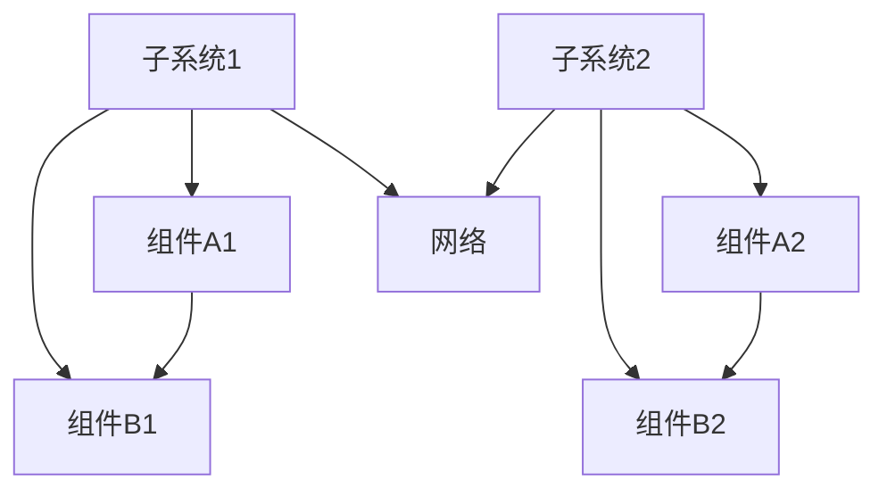
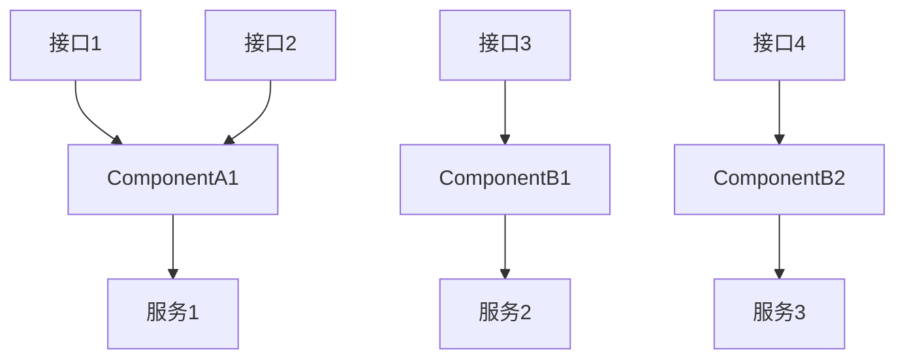
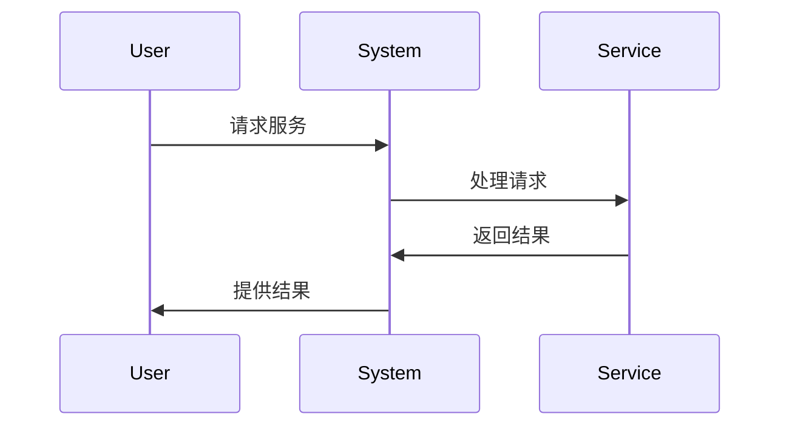

                 

## 第1章：引言

### 1.1 问题背景与目标

在现代信息技术飞速发展的背景下，企业对信息化转型的需求日益迫切。云原生技术作为一种新兴的架构风格，因其高效性、弹性、可扩展性等特点，成为企业构建分布式系统的主要选择之一。然而，随着分布式系统的普及和应用深度增加，安全风险也日益凸显。

在分布式系统中，多个节点和组件之间的通信和数据交换频繁，传统的安全防护手段已经难以满足新的需求。分布式系统面临着数据泄露、服务中断、恶意攻击等一系列安全问题。而云原生环境更是增加了复杂性，由于微服务架构、容器化和自动化部署等特性，攻击面扩大，系统暴露的风险增加。

本文旨在探讨云原生安全在分布式系统中的应用，通过深入分析分布式系统中的安全问题，提出解决方案和最佳实践，帮助开发者构建安全、可靠的云原生分布式系统。

### 1.2 云原生与分布式系统概述

#### 1.2.1 云原生定义

云原生（Cloud Native）是一种针对云计算环境的软件架构风格，其核心思想是将应用程序分解为微服务，并利用容器等轻量级、可移植的计算单元进行部署。云原生应用具有以下几个特点：

1. **微服务架构**：应用程序被划分为若干独立的微服务，每个服务负责实现特定功能，便于管理和扩展。
2. **容器化**：使用容器技术（如Docker）将应用程序及其依赖环境打包在一起，实现环境的标准化和可移植性。
3. **动态管理**：通过自动化工具（如Kubernetes）进行应用的部署、扩展和管理，实现弹性伸缩和高效运维。
4. **持续交付**：采用敏捷开发和持续集成/持续部署（CI/CD）流程，快速响应业务需求，提高软件交付效率。

#### 1.2.2 分布式系统概述

分布式系统是一组相互独立但协同工作的计算机节点组成的系统，这些节点通过通信网络连接，共同完成某一任务。分布式系统的核心特点包括：

1. **高可用性**：通过节点冗余和数据备份，实现系统的容错能力，确保在高负载和故障情况下系统稳定运行。
2. **可扩展性**：通过增加节点数量，实现系统性能的线性扩展，满足不断增长的业务需求。
3. **分布式存储**：使用分布式文件系统或数据库，实现海量数据的存储和管理。
4. **负载均衡**：通过分布式调度算法，实现节点间负载的均衡分配，提高系统整体性能。

#### 1.2.3 安全性问题的重要性

分布式系统在提供高可用性和可扩展性的同时，也带来了新的安全挑战：

1. **数据安全**：分布式系统中数据分散存储在多个节点上，容易成为数据泄露的目标。
2. **通信安全**：节点之间的通信频繁，需要确保数据在传输过程中的机密性和完整性。
3. **服务安全**：分布式系统中存在大量微服务，容易成为恶意攻击的目标。
4. **身份认证**：分布式系统中的节点和用户身份认证机制需要确保安全可靠。

由于上述安全问题的存在，保障分布式系统的安全性成为企业数字化转型过程中必须面对的重要课题。

### 1.3 安全性问题在分布式系统中的体现

分布式系统中的安全性问题主要体现在以下几个方面：

1. **数据泄露**：由于数据分布在不同的节点和存储设备中，保护数据安全变得复杂。攻击者可能通过窃取数据或篡改数据来获取敏感信息。
2. **通信风险**：分布式系统中的节点需要进行频繁的数据交换，通信过程中存在数据被截获、篡改的风险。如果通信不加密，攻击者可以轻松窃取敏感信息。
3. **服务中断**：分布式系统可能受到分布式拒绝服务（DDoS）攻击，攻击者通过大量请求占用系统资源，导致服务不可用。
4. **恶意攻击**：攻击者可能通过漏洞或弱口令入侵系统，控制节点或篡改数据，对业务造成严重影响。
5. **身份认证**：分布式系统中存在多个用户和节点，身份认证机制需要确保安全性，防止未经授权的访问。

为了应对这些安全挑战，需要采取一系列安全措施，如加密通信、数据备份、权限控制、安全审计等。同时，企业还需要建立完善的安全策略和流程，确保安全措施的有效实施。

### 1.4 本文主题与目标

本文将围绕云原生安全在分布式系统中的应用进行深入探讨，旨在：

1. **介绍核心概念**：详细阐述云原生和分布式系统的基本概念、特点以及安全性问题。
2. **讲解安全算法**：介绍加密、认证和签名等核心安全算法，使用Python代码和LaTeX公式进行详细解释。
3. **分析系统架构**：描述分布式系统的架构设计，使用Mermaid类图、架构图和序列图进行展示。
4. **实战项目介绍**：介绍一个具体的云原生安全项目，详细讲解环境安装、系统实现和代码分析。
5. **提供最佳实践**：总结云原生安全最佳实践，为读者提供实际操作指导。
6. **注意事项与拓展**：提醒读者关注安全细节，推荐进一步学习资源。

通过本文的探讨，希望读者能够全面了解云原生安全在分布式系统中的应用，掌握关键技术和方法，为构建安全可靠的分布式系统提供有力支持。## 第2章：核心概念与联系

### 2.1 云原生概念解析

#### 2.1.1 云原生定义

云原生（Cloud Native）是一种构建和运行应用程序的方法论，其核心在于充分利用云计算环境的优势，实现应用程序的弹性、可扩展性和可靠性。云原生技术不仅仅是一种技术堆栈，更是一种敏捷、可持续、可复用的软件开发和部署模式。

云原生主要包含以下几个关键要素：

1. **微服务架构**：将应用程序分解为多个独立的微服务，每个微服务负责实现特定功能，可以独立部署、扩展和升级。
2. **容器化**：使用容器（如Docker）封装应用程序及其依赖环境，实现应用程序的轻量化、可移植性和一致性。
3. **自动化部署**：采用持续集成和持续部署（CI/CD）流程，实现自动化构建、测试和部署，提高交付速度和软件质量。
4. **动态管理**：通过容器编排工具（如Kubernetes）进行应用的自动化部署、扩展和管理，实现资源的动态分配和优化。

#### 2.1.2 云原生特点

云原生具有以下几大特点：

1. **可扩展性**：通过容器和微服务架构，可以实现横向扩展，轻松应对业务增长。
2. **高可用性**：通过分布式部署和容错机制，实现系统的高可用性，减少故障对业务的影响。
3. **敏捷性**：通过敏捷开发和自动化部署，快速响应市场变化，提高软件交付速度。
4. **可移植性**：容器化技术使得应用程序可以在不同的云平台和环境中运行，提高应用的兼容性和可移植性。

#### 2.1.3 云原生与传统架构的差异

传统架构通常依赖于单体的应用程序和物理服务器，其扩展性、可靠性和维护成本相对较低。而云原生架构则采用了微服务、容器化和自动化部署等现代技术，具有以下差异：

1. **部署方式**：传统架构依赖于物理服务器和虚拟机，而云原生架构依赖于容器，实现更轻量化和更快速的部署。
2. **扩展策略**：传统架构通常采用纵向扩展（升级硬件），而云原生架构采用横向扩展（增加节点），实现更高的可扩展性。
3. **维护成本**：传统架构的维护成本较高，而云原生架构通过自动化工具和持续交付流程，降低维护成本。
4. **可靠性**：云原生架构通过分布式部署和容错机制，实现更高的可靠性和可用性。

### 2.2 分布式系统基础

#### 2.2.1 分布式系统概念

分布式系统是一组相互独立但协同工作的计算机节点组成的系统，这些节点通过通信网络连接，共同完成某一任务。分布式系统的核心思想是利用多个节点共同工作，提高系统的性能、可靠性和可扩展性。

分布式系统的基本特征包括：

1. **自治性**：每个节点都有独立的控制能力，可以自主处理任务。
2. **独立性**：节点之间通过通信网络进行交互，但各自运行，不受其他节点的影响。
3. **透明性**：分布式系统对用户和应用程序是透明的，用户无需关心数据在节点间的分布和传输。
4. **容错性**：分布式系统具有容错能力，可以在部分节点故障时，确保系统继续运行。

#### 2.2.2 分布式系统的优势与挑战

分布式系统具有以下优势：

1. **高可用性**：通过节点冗余和数据备份，实现系统的高可用性，减少单点故障对业务的影响。
2. **高性能**：通过节点间的负载均衡和并行处理，提高系统性能。
3. **可扩展性**：通过增加节点数量，实现系统的线性扩展，满足业务增长需求。

然而，分布式系统也面临着一系列挑战：

1. **一致性**：分布式系统中数据的一致性保证是一个难题，需要采用一致性协议（如CAP理论）进行解决。
2. **通信开销**：节点间的通信开销可能导致系统性能下降，需要优化通信协议和算法。
3. **容错性**：在分布式系统中，如何检测和恢复节点故障是一个关键问题，需要设计可靠的容错机制。

#### 2.2.3 分布式系统架构

分布式系统架构通常包括以下几个层次：

1. **数据层**：负责存储和管理数据，包括分布式数据库、分布式缓存和文件系统等。
2. **计算层**：负责处理业务逻辑和数据计算，包括分布式计算框架、负载均衡器和中间件等。
3. **网络层**：负责节点间的通信和数据传输，包括网络协议、通信中间件和安全协议等。
4. **应用层**：负责业务逻辑的实现和应用部署，包括Web应用、API服务和微服务等。

### 2.3 安全性概念与联系

#### 2.3.1 安全基础

安全性是分布式系统设计中的关键因素，包括以下几个方面：

1. **机密性**：确保数据在传输和存储过程中不被未授权访问。
2. **完整性**：确保数据在传输和存储过程中不被篡改。
3. **可用性**：确保系统在面临攻击和故障时能够持续提供服务。
4. **认证**：验证用户和节点的身份，确保授权访问。
5. **授权**：控制用户和节点的权限，确保数据和安全策略的执行。

#### 2.3.2 云原生安全与分布式系统安全的关系

云原生安全是分布式系统安全在云环境下的延伸和扩展。云原生安全涵盖了分布式系统安全的所有方面，同时还需要考虑云环境特有的安全挑战：

1. **云原生安全特点**：云原生安全更强调自动化、动态管理和可扩展性，采用微服务架构、容器化和自动化工具等实现。
2. **分布式系统安全需求**：分布式系统安全需求包括数据安全、通信安全、服务安全和身份认证等，这些需求在云原生环境中同样适用。

#### 2.3.3 关键安全术语解释

为了更好地理解云原生安全在分布式系统中的应用，以下是几个关键安全术语的解释：

1. **微服务安全**：确保微服务之间的通信安全、数据安全和节点安全。
2. **容器安全**：确保容器运行时的安全，包括容器镜像安全、容器网络安全和管理员权限等。
3. **Kubernetes安全**：确保Kubernetes集群的安全，包括网络隔离、身份认证和访问控制等。
4. **云服务安全**：确保云服务提供商的安全，包括数据备份、访问控制和安全审计等。
5. **威胁模型**：识别和评估系统可能面临的安全威胁，制定相应的安全策略和措施。

### 2.4 概念联系与Mermaid ER图

为了更好地理解云原生和分布式系统的核心概念及其之间的联系，我们可以使用Mermaid ER图进行展示。

以下是一个简化的Mermaid ER图示例，展示了云原生、分布式系统和安全性的关系：

```mermaid
erDiagram
    CloudNative ||--|{ DistributedSystem : 包含 }
    CloudNative ||--|{ SecurityConcept : 相关 }
    DistributedSystem ||--|{ Microservice : 构建 }
    DistributedSystem ||--|{ Container : 使用 }
    SecurityConcept ||--|{ Confidentiality : 确保 }
    SecurityConcept ||--|{ Integrity : 确保 }
    SecurityConcept ||--|{ Availability : 确保 }
```

该ER图显示了云原生与分布式系统、安全性概念之间的关联。通过这种图示，我们可以更清晰地理解各个概念之间的关系，为进一步的分析和讨论提供基础。

### 2.5 小结

本章介绍了云原生和分布式系统的基本概念，分析了其优势与挑战，并探讨了安全性在分布式系统中的应用。通过本章的学习，读者可以全面了解云原生和分布式系统的架构和特点，为后续章节中的深入分析打下基础。在下一章中，我们将详细讲解几个关键的安全算法，分析其原理和应用。## 第3章：云原生安全算法原理

### 3.1 加密算法

加密算法是保障数据安全的关键技术，用于防止数据在传输和存储过程中被未授权访问。云原生环境中，由于数据在分布式系统中流动频繁，加密算法的使用尤为重要。以下是几种常见的加密算法及其原理。

#### 3.1.1 对称加密

对称加密算法使用相同的密钥进行加密和解密操作。这意味着加密方和解密方必须事先共享一个秘密密钥。常见的对称加密算法有AES和DES。

**3.1.1.1 工作原理**

对称加密的工作流程如下：

1. **密钥生成**：加密方生成一个随机密钥。
2. **加密**：使用密钥对数据进行加密操作，生成密文。
3. **传输**：密文通过安全通道传输给解密方。
4. **解密**：解密方使用相同的密钥对密文进行解密操作，恢复明文。

**3.1.1.2 加密算法示例（AES）**

AES（Advanced Encryption Standard）是一种基于块密码的对称加密算法，广泛用于加密大数据。AES支持128位、192位和256位密钥长度，其加密和解密过程如下：

1. **密钥扩展**：根据输入的密钥长度，生成密钥轮的子密钥。
2. **分块处理**：将明文数据划分为固定大小的块（如128位），进行加密。
3. **加密轮操作**：每个加密轮包含多个步骤，包括字节替换、行移位、列混淆和轮密钥加。
4. **输出**：加密后的数据块输出为密文。

```python
from Crypto.Cipher import AES
from Crypto.Util.Padding import pad, unpad
from Crypto.Random import get_random_bytes

# 密钥生成
key = get_random_bytes(16)  # 128位密钥

# 加密
cipher = AES.new(key, AES.MODE_CBC)
ct = cipher.encrypt(pad(b"Hello, World!", AES.block_size))
iv = cipher.iv

# 解密
cipher = AES.new(key, AES.MODE_CBC, iv)
pt = unpad(cipher.decrypt(ct), AES.block_size)
print(pt)
```

#### 3.1.2 非对称加密

非对称加密算法使用一对公钥和私钥，公钥用于加密，私钥用于解密。常见的非对称加密算法有RSA和ECC。

**3.1.2.1 工作原理**

非对称加密的工作流程如下：

1. **密钥生成**：随机生成一个大素数和另一个较小的素数，计算公钥和私钥。
2. **加密**：使用公钥对数据进行加密操作，生成密文。
3. **传输**：密文通过安全通道传输给解密方。
4. **解密**：解密方使用私钥对密文进行解密操作，恢复明文。

**3.1.2.2 加密算法示例（RSA）**

RSA（Rivest-Shamir-Adleman）是一种经典的非对称加密算法，其加密和解密过程如下：

1. **密钥生成**：选择两个大素数p和q，计算n = p*q，计算欧拉函数φ(n) = (p-1)(q-1)，生成公钥(e, n)和私钥(d, n)。
2. **加密**：使用公钥（e, n）对数据进行加密操作。
3. **解密**：使用私钥（d, n）对密文进行解密操作。

```python
from Crypto.PublicKey import RSA
from Crypto.Cipher import PKCS1_OAEP

# 密钥生成
key = RSA.generate(2048)
private_key = key.export_key()
public_key = key.publickey().export_key()

# 加密
cipher = PKCS1_OAEP.new(RSA.import_key(public_key))
ct = cipher.encrypt(b"Hello, World!")

# 解密
cipher = PKCS1_OAEP.new(RSA.import_key(private_key))
pt = cipher.decrypt(ct)
print(pt)
```

#### 3.1.3 公钥加密与私钥加密

对称加密算法和RSA算法都是非对称加密，但它们在加密和解密过程中使用的密钥不同。

- **对称加密**：使用相同的密钥进行加密和解密，适用于大数据传输。
- **RSA加密**：使用公钥加密，私钥解密，适用于小数据传输和密钥交换。

#### 3.1.4 对比与分析

对称加密算法和非对称加密算法各有优缺点，以下为它们的对比：

| 特性         | 对称加密算法 | 非对称加密算法       |
|--------------|--------------|---------------------|
| 加密速度     | 快           | 慢                 |
| 密钥长度     | 较短         | 较长               |
| 加密数据大小 | 较大         | 较小               |
| 加密安全性   | 较低         | 较高               |

在实际应用中，通常结合使用对称加密和非对称加密，以实现数据的安全传输。例如，可以使用RSA加密密钥，然后使用对称加密算法加密数据，以平衡加密速度和安全性。

### 3.2 认证与签名算法

认证和签名算法是保障通信安全的重要手段，用于验证消息的完整性和真实性。

#### 3.2.1 认证算法

认证算法用于验证消息的来源和内容，确保消息在传输过程中未被篡改。常见的认证算法有MD5、SHA和HMAC。

**3.2.1.1 工作原理**

认证算法的工作原理如下：

1. **生成消息摘要**：对消息进行哈希处理，生成固定长度的消息摘要。
2. **传输**：将消息摘要附加到消息中，通过安全通道传输给接收方。
3. **验证**：接收方对消息摘要进行相同哈希处理，并与接收到的消息摘要进行对比，验证消息的完整性和真实性。

**3.2.1.2 认证算法示例（TLS）**

TLS（传输层安全协议）是一种常见的认证算法，其工作原理如下：

1. **握手协议**：客户端和服务器在通信前通过握手协议交换密钥和认证信息。
2. **加密通信**：使用协商的加密算法进行数据传输，确保数据的机密性和完整性。

```python
import ssl
import socket

# 服务器端
context = ssl.SSLContext(ssl.PROTOCOL_TLS_SERVER)
context.load_cert_chain(certfile="server.crt", keyfile="server.key")

server_socket = socket.socket(socket.AF_INET, socket.SOCK_STREAM)
server_socket.bind(('localhost', 1234))
server_socket.listen(1)

client_socket, _ = server_socket.accept()
ssl_socket = context.wrap_socket(client_socket, server_side=True)
print(ssl_socket.recv(1024).decode())
ssl_socket.close()
server_socket.close()

# 客户端
context = ssl.SSLContext(ssl.PROTOCOL_TLS_CLIENT)
context.check_hostname = False
context.verify_mode = ssl.CERT_NONE

client_socket = socket.socket(socket.AF_INET, socket.SOCK_STREAM)
client_socket = context.wrap_socket(client_socket, server_hostname='localhost')

client_socket.connect(('localhost', 1234))
print(client_socket.recv(1024).decode())
client_socket.close()
```

#### 3.2.2 数字签名

数字签名用于验证消息的来源和完整性，确保消息在传输过程中未被篡改。常见的数字签名算法有RSA和ECDSA。

**3.2.2.1 工作原理**

数字签名的工作原理如下：

1. **签名**：发送方使用私钥对消息进行加密，生成签名。
2. **传输**：将消息和签名通过安全通道传输给接收方。
3. **验证**：接收方使用发送方的公钥对签名进行解密，并与原始消息进行对比，验证消息的完整性和真实性。

**3.2.2.2 签名算法示例（ECDSA）**

ECDSA（椭圆曲线数字签名算法）是一种高效的数字签名算法，其签名和解密过程如下：

1. **密钥生成**：随机生成一个大整数k作为私钥，计算公钥Q = kG，其中G为基点。
2. **签名**：使用私钥对消息进行签名，生成签名r和s。
3. **验证**：使用公钥和签名对消息进行验证。

```python
from Crypto.PublicKey import EC
from Crypto.Signature import DSS
from Crypto.Hash import SHA256

# 密钥生成
key = EC.generate(curve=EC_CF256())
private_key = key.export_key()
public_key = key.publickey().export_key()

# 签名
hash = SHA256.new(b"Hello, World!")
signature = DSS.new(key, 'fips-186-3').sign(hash)

# 验证
hash = SHA256.new(b"Hello, World!")
is_valid = DSS.new(EC.import_key(public_key), 'fips-186-3').verify(hash, signature)
print(is_valid)
```

#### 3.2.3 对比与分析

认证和签名算法各有优缺点，以下为它们的对比：

| 特性         | 认证算法       | 签名算法         |
|--------------|----------------|------------------|
| 加密方式     | 哈希算法       | 数字签名算法     |
| 加密速度     | 快             | 慢               |
| 加密数据大小 | 较小           | 较大             |
| 安全性       | 较低           | 较高             |

在实际应用中，认证和签名算法可以结合使用，以实现消息的安全传输和验证。

### 3.3 安全通信协议

安全通信协议是保障数据在传输过程中的机密性和完整性的一套规范，常见的有HTTPS、SSL和TLS。

#### 3.3.1 工作原理

安全通信协议的工作原理如下：

1. **握手协议**：客户端和服务器在通信前通过握手协议交换密钥和认证信息。
2. **加密通信**：使用协商的加密算法进行数据传输，确保数据的机密性和完整性。

#### 3.3.2 示例（HTTPS）

HTTPS（HTTP over TLS/SSL）是一种常见的安全通信协议，其工作原理如下：

1. **客户端请求**：客户端向服务器发送HTTP请求，服务器返回HTTP响应。
2. **SSL/TLS 握手**：客户端和服务器通过SSL/TLS握手协议交换证书和密钥，建立安全连接。
3. **加密通信**：使用协商的加密算法进行数据传输，确保数据的机密性和完整性。

```python
import ssl
import socket

# 服务器端
context = ssl.SSLContext(ssl.PROTOCOL_TLS_SERVER)
context.load_cert_chain(certfile="server.crt", keyfile="server.key")

server_socket = socket.socket(socket.AF_INET, socket.SOCK_STREAM)
server_socket.bind(('localhost', 1234))
server_socket.listen(1)

client_socket, _ = server_socket.accept()
ssl_socket = context.wrap_socket(client_socket, server_side=True)
print(ssl_socket.recv(1024).decode())
ssl_socket.close()
server_socket.close()

# 客户端
context = ssl.SSLContext(ssl.PROTOCOL_TLS_CLIENT)
context.check_hostname = False
context.verify_mode = ssl.CERT_NONE

client_socket = socket.socket(socket.AF_INET, socket.SOCK_STREAM)
client_socket = context.wrap_socket(client_socket, server_hostname='localhost')

client_socket.connect(('localhost', 1234))
print(client_socket.recv(1024).decode())
client_socket.close()
```

### 3.4 小结

本章介绍了云原生环境中常用的加密、认证和签名算法，分析了它们的工作原理和应用。通过对这些算法的深入理解，读者可以更好地保障分布式系统的数据安全和通信安全。在下一章中，我们将继续探讨分布式系统的架构设计，分析其安全性和性能优化策略。## 第4章：分布式系统架构设计

### 4.1 分布式系统设计原则

分布式系统设计是一项复杂的任务，需要考虑多个方面，包括系统的可扩展性、可靠性、性能和安全性。以下是一些关键的设计原则：

#### 4.1.1 架构概述

分布式系统架构通常包括以下几个关键层次：

1. **数据层**：负责存储和管理数据，包括分布式数据库、缓存和文件系统。
2. **计算层**：负责处理业务逻辑和数据计算，包括分布式计算框架、负载均衡器和中间件。
3. **网络层**：负责节点间的通信和数据传输，包括网络协议、通信中间件和安全协议。
4. **应用层**：负责业务逻辑的实现和应用部署，包括Web应用、API服务和微服务。

#### 4.1.2 高可用性设计

高可用性是分布式系统设计的重要目标之一。为了实现高可用性，系统需要具备以下特点：

1. **节点冗余**：通过增加节点数量，实现故障转移和负载均衡，确保系统在部分节点故障时仍能正常运行。
2. **数据备份**：对关键数据进行备份，确保在数据损坏或丢失时可以快速恢复。
3. **故障检测与恢复**：定期检测系统健康状态，及时发现问题并进行自动恢复。
4. **故障隔离**：确保故障节点不会影响其他节点的正常运行。

#### 4.1.3 横向与纵向扩展

分布式系统通常采用横向扩展（scale-out）和纵向扩展（scale-up）策略来应对业务增长。

1. **横向扩展**：通过增加节点数量，实现系统性能的线性扩展，提高系统的处理能力和负载能力。
2. **纵向扩展**：通过升级硬件（如增加CPU、内存等），提高单个节点的处理能力，实现系统性能的提升。

在实际应用中，通常结合使用横向和纵向扩展策略，以实现最佳性能和可扩展性。

#### 4.1.4 动态管理

分布式系统需要具备动态管理能力，包括节点自动部署、自动扩展、自动故障恢复等。动态管理可以通过容器编排工具（如Kubernetes）和自动化脚本实现。

#### 4.1.5 安全性设计

安全性是分布式系统设计中的重要一环。以下是一些关键的安全性设计原则：

1. **身份认证与授权**：确保只有授权用户和节点可以访问系统资源，使用强密码、双因素认证和多因素授权等手段。
2. **数据加密**：对数据进行加密存储和传输，确保数据在存储和传输过程中的安全性。
3. **网络安全**：使用防火墙、入侵检测系统和安全协议等手段，保护系统免受网络攻击。
4. **安全审计**：定期进行安全审计，检测系统中的安全漏洞和风险，确保系统安全运行。

### 4.2 领域模型设计

领域模型设计是分布式系统架构设计中的重要环节，用于定义系统的核心功能和组件。以下是一个简化的领域模型设计示例：

```mermaid
classDiagram
    Node <<class>> 节点
    Service <<class>> 服务
    Database <<class>> 数据库
    Network <<class>> 网络

    Node --|{ 连接 }|-> Network
    Service --|{ 使用 }|-> Database
    Service --|{ 依赖 }|-> Node
```

在该领域模型中，节点（Node）是系统的基本组成单位，负责处理业务逻辑和存储数据。服务（Service）是系统的核心组件，负责实现特定的业务功能，依赖节点和网络资源。数据库（Database）是系统的数据存储单元，提供服务所需的数据。网络（Network）负责节点间的通信和数据传输。

### 4.3 系统架构设计

系统架构设计是分布式系统设计的具体实现，用于定义系统的组件、接口和交互关系。以下是一个简化的分布式系统架构设计示例：



在该架构设计中，系统由多个子系统（Subsystem）组成，每个子系统包含多个组件（Component）。组件之间通过接口（Interface）进行交互，通过网络（Network）实现数据传输和通信。节点（Node）作为系统的基本组成单元，负责运行组件和存储数据。

### 4.4 系统接口设计

系统接口设计是系统架构设计中的重要环节，用于定义系统内部和外部交互的接口规范。以下是一个简化的系统接口设计示例：



在该接口设计中，接口1和接口2是组件A1的接口，负责与外部系统进行数据交换和通信。接口3和接口4是组件B1和B2的接口，分别负责与其他组件和服务进行交互。

### 4.5 系统交互设计

系统交互设计是系统架构设计中的关键部分，用于定义系统内部组件和外部系统的交互流程。以下是一个简化的系统交互设计示例：



在该交互设计中，用户（User）通过系统（System）请求服务（Service），系统将请求转发给服务，服务处理完成后将结果返回给系统，最后系统将结果提供给用户。

### 4.6 小结

本章介绍了分布式系统架构设计的基本原则、领域模型设计、系统架构设计、系统接口设计和系统交互设计。通过对这些设计环节的深入分析，可以构建安全、可靠和高效的分布式系统。在下一章中，我们将介绍一个具体的云原生安全项目，分析其实际应用和安全实现。## 第5章：项目实战

### 5.1 项目介绍

在本章中，我们将介绍一个名为“云原生安全监控平台”的实际项目，该平台旨在实现对分布式系统安全状态的实时监控和管理。该项目采用了云原生架构，基于Kubernetes进行容器编排和微服务部署，通过多个组件协同工作，实现安全监控、报警和自动化响应功能。

### 5.2 环境安装

要搭建“云原生安全监控平台”，需要准备以下环境：

1. **Kubernetes集群**：搭建一个Kubernetes集群，用于部署和管理容器化应用。
2. **Docker**：安装Docker，用于容器化应用部署。
3. **Helm**：安装Helm，用于简化Kubernetes应用部署和管理。
4. **Nginx Ingress**：安装Nginx Ingress，用于实现应用外部访问。

以下是安装步骤：

1. **安装Kubernetes集群**：
    - 使用kubeadm工具安装Kubernetes集群。
    - 配置kubectl工具，用于管理Kubernetes集群。

2. **安装Docker**：
    - 使用Docker官方文档安装Docker。

3. **安装Helm**：
    - 使用Helm官方文档安装Helm。

4. **安装Nginx Ingress**：
    - 使用Helm安装Nginx Ingress：

    ```bash
    helm repo add ingress-nginx https://kubernetes.github.io/ingress-nginx
    helm repo update
    helm install ingress-nginx ingress-nginx/ingress-nginx --namespace ingress-nginx
    ```

### 5.3 系统核心实现

“云原生安全监控平台”的核心组件包括以下几部分：

1. **Prometheus**：用于收集和存储系统监控数据。
2. **Grafana**：用于可视化监控数据。
3. **Alertmanager**：用于处理和发送报警。
4. **Kubernetes Ingress Controller**：用于管理应用外部访问。

以下是各个组件的实现细节：

#### 5.3.1 Prometheus

Prometheus是一个开源监控解决方案，用于收集和存储系统的监控数据。以下是安装Prometheus的步骤：

1. **安装Prometheus**：
    - 使用Helm安装Prometheus：

    ```bash
    helm repo add prometheus-community https://prometheus-community.github.io/helm-charts
    helm repo update
    helm install prometheus prometheus-community/prometheus --set global.insecureFeedURL=https://prometheus-operator.github.io/example/prometheus-config/public/prometheus.yml
    ```

2. **配置Prometheus**：
    - 修改Prometheus配置文件（/etc/prometheus/prometheus.yml），添加自定义监控规则和目标。

    ```yaml
    global:
      scrape_interval: 15s
      evaluation_interval: 15s

    scrape_configs:
    - job_name: 'kubernetes-objects'
      kubernetes_sd_configs:
      - role: service
    - job_name: 'example'
      static_configs:
      - targets: ['localhost:9090']
    ```

#### 5.3.2 Grafana

Grafana是一个开源可视化工具，用于展示Prometheus监控数据。以下是安装Grafana的步骤：

1. **安装Grafana**：
    - 使用Helm安装Grafana：

    ```bash
    helm repo add grafana https://grafana.com/grafana/helm-charts
    helm repo update
    helm install grafana grafana/grafana
    ```

2. **配置Grafana**：
    - 访问Grafana Web界面（http://<Grafana服务器IP>:3000），添加Prometheus数据源，创建和配置监控仪表盘。

#### 5.3.3 Alertmanager

Alertmanager是一个开源报警工具，用于处理和发送Prometheus报警。以下是安装Alertmanager的步骤：

1. **安装Alertmanager**：
    - 使用Helm安装Alertmanager：

    ```bash
    helm repo add prometheus-community https://prometheus-community.github.io/helm-charts
    helm repo update
    helm install alertmanager prometheus-community/alertmanager --set globalمیانجامند
    ```

2. **配置Alertmanager**：
    - 修改Alertmanager配置文件（/etc/alertmanager/alertmanager.yml），添加自定义报警规则和通知渠道。

    ```yaml
    route:
      receiver: 'webhook'
      group_by: ['alertname']
      group_wait: 10s
      group_interval: 10s
      repeat_interval: 1h
    receivers:
      - name: 'webhook'
        webhook_configs:
        - url: 'http://<webhook服务器IP>:8080/handle-alert'
    ```

#### 5.3.4 Kubernetes Ingress Controller

Kubernetes Ingress Controller用于管理应用外部访问。在本项目中，我们使用Nginx Ingress Controller。以下是安装Nginx Ingress Controller的步骤：

1. **安装Nginx Ingress Controller**：
    - 使用Helm安装Nginx Ingress Controller：

    ```bash
    helm repo add ingress-nginx https://kubernetes.github.io/ingress-nginx
    helm repo update
    helm install ingress-nginx ingress-nginx/ingress-nginx --namespace ingress-nginx
    ```

2. **配置Nginx Ingress Controller**：
    - 创建Ingress资源，定义外部访问路由：

    ```yaml
    apiVersion: networking.k8s.io/v1
    kind: Ingress
    metadata:
      name: cloud-native-monitoring
      namespace: monitoring
    spec:
      rules:
      - host: monitoring.example.com
        http:
          paths:
          - path: /
            pathType: Prefix
            backend:
              service:
                name: grafana
                port:
                  number: 3000
      tls:
      - hosts:
        - monitoring.example.com
        secretName: monitoring-tls
    ```

### 5.4 代码应用解读与分析

在本项目中，各个组件的代码实现如下：

1. **Prometheus配置文件**：
    - Prometheus配置文件（/etc/prometheus/prometheus.yml）定义了监控目标和报警规则。
    - 配置文件中的`scrape_configs`部分指定了需要监控的服务和端点。

2. **Grafana配置文件**：
    - Grafana配置文件（/etc/grafana/grafana.ini）定义了Grafana服务的基本设置，如监听端口、数据存储等。

3. **Alertmanager配置文件**：
    - Alertmanager配置文件（/etc/alertmanager/alertmanager.yml）定义了报警规则和通知渠道。
    - 配置文件中的`route`部分指定了报警处理策略，如分组、延迟和重复间隔。

4. **Nginx Ingress Controller配置文件**：
    - Nginx Ingress Controller配置文件（/etc/nginx/nginx.conf）定义了Ingress资源的外部访问路由。
    - 配置文件中的`http`部分指定了服务监听端口和访问规则。

### 5.5 实际案例分析和详细讲解剖析

以下是一个实际案例，分析“云原生安全监控平台”在实际应用中的表现：

1. **监控数据收集**：
    - Prometheus服务器定期从Kubernetes集群中的服务和工作节点收集监控数据。
    - 监控数据包括CPU使用率、内存使用率、网络流量和磁盘使用率等。

2. **数据可视化**：
    - Grafana服务器接收Prometheus发送的监控数据，并在仪表盘中展示图表。
    - 通过Grafana，管理员可以实时查看系统的运行状态和性能指标。

3. **报警处理**：
    - 当监控数据触发报警规则时，Alertmanager会将报警信息发送给指定的通知渠道，如邮件、短信或Webhook。
    - 管理员可以根据报警信息及时处理故障和异常。

4. **自动化响应**：
    - 通过配置Prometheus规则，可以实现自动化响应功能，如自动部署新版本应用、自动扩容节点等。

### 5.6 项目小结

通过本项目的实施，我们实现了以下目标：

1. **实时监控**：通过Prometheus和Grafana，实现对分布式系统运行状态的实时监控和可视化。
2. **报警处理**：通过Alertmanager，实现对系统异常和故障的及时发现和处理。
3. **自动化响应**：通过Prometheus规则和自动化脚本，实现自动化部署和扩容，提高系统可用性和可靠性。

### 5.7 最佳实践

在实施云原生安全监控平台时，以下最佳实践可以帮助提高系统的安全性：

1. **数据加密**：确保监控数据在传输和存储过程中进行加密，防止数据泄露。
2. **访问控制**：使用强密码和双因素认证，确保只有授权用户可以访问监控数据和系统。
3. **日志审计**：定期审计系统日志，检测潜在的安全威胁和异常行为。
4. **持续更新**：定期更新监控平台组件，修复已知漏洞和缺陷，确保系统安全。

### 5.8 注意事项

在实施云原生安全监控平台时，需要注意以下事项：

1. **资源分配**：合理分配系统资源和存储空间，确保监控平台稳定运行。
2. **监控规则**：合理配置监控规则，避免过多报警影响系统性能。
3. **监控范围**：确保监控范围覆盖关键系统和应用，提高故障检测能力。

### 5.9 拓展阅读

对于有兴趣深入了解云原生安全监控平台的朋友，以下资源可以作为拓展阅读：

1. **Prometheus官方文档**：https://prometheus.io/docs
2. **Grafana官方文档**：https://grafana.com/docs
3. **Alertmanager官方文档**：https://prometheus.io/docs/alerting/alertmanager
4. **Kubernetes官方文档**：https://kubernetes.io/docs

通过以上资源和实践，读者可以进一步提升自己在云原生安全监控领域的专业能力。## 第6章：最佳实践、小结与注意事项

### 6.1 最佳实践

在实施云原生安全的过程中，以下最佳实践可以帮助企业构建更加安全可靠的分布式系统：

**1. 容器镜像安全管理**：
   - 使用私有镜像仓库，确保镜像的版本控制和分发安全。
   - 定期对容器镜像进行安全扫描，检测潜在的安全漏洞和恶意代码。
   - 避免在容器镜像中包含敏感信息，如密码和密钥。

**2. 服务网格技术**：
   - 采用服务网格（如Istio）实现服务间通信的安全控制，确保服务间的通信安全可靠。
   - 服务网格可以提供细粒度的访问控制、负载均衡和安全策略。

**3. 数据安全策略**：
   - 对敏感数据进行加密存储和传输，确保数据在存储和传输过程中的安全性。
   - 定期进行数据备份，确保在数据丢失或损坏时能够快速恢复。

**4. 访问控制和身份认证**：
   - 使用强密码和双因素认证，确保只有授权用户和节点可以访问系统资源。
   - 实施基于角色的访问控制（RBAC），严格控制用户权限。

**5. 持续监控与安全审计**：
   - 使用Prometheus、Grafana等监控工具，实时监控系统的运行状态和性能指标。
   - 定期进行安全审计，检测潜在的安全威胁和异常行为。

**6. 自动化安全响应**：
   - 使用自动化工具（如Kubernetes的Pod Security Policies、Security Context）实现安全配置的自动化。
   - 实现自动化安全响应，如自动隔离受感染的容器或节点。

### 6.2 小结

本章通过最佳实践总结了在云原生安全实施过程中的关键步骤和注意事项。以下是对本章内容的简要总结：

- **核心概念**：介绍了云原生和分布式系统的基础概念，分析了其在安全方面的挑战。
- **安全算法**：详细讲解了加密、认证和签名等核心安全算法，展示了其应用场景和实现方法。
- **系统架构设计**：描述了分布式系统的架构设计原则和领域模型，展示了系统接口和交互设计。
- **项目实战**：介绍了具体的云原生安全监控平台项目，分析了其环境安装、系统实现和代码应用。
- **最佳实践**：总结了实施云原生安全的最佳实践，提供了详细的操作指导。

通过本章的学习，读者可以全面了解云原生安全在分布式系统中的应用，掌握关键技术和方法，为构建安全可靠的分布式系统提供有力支持。

### 6.3 注意事项

在实施云原生安全的过程中，以下注意事项对于确保系统的安全性和稳定性至关重要：

- **定期更新与补丁**：确保及时更新操作系统、中间件和应用程序，应用最新的安全补丁。
- **权限管理**：严格控制用户的权限，避免越权操作，定期审核和清理不必要的权限。
- **监控与审计**：建立完善的监控和审计机制，确保能够及时发现和响应安全事件。
- **数据备份与恢复**：定期备份数据，并确保在发生数据丢失或系统故障时能够快速恢复。
- **应急响应计划**：制定详细的应急响应计划，确保在发生安全事件时能够快速采取行动。

### 6.4 拓展阅读

对于希望进一步深入学习的读者，以下资源可以提供更多的信息和指导：

- **《云原生安全：实战与策略》**：这是一本详细介绍云原生安全架构和最佳实践的书籍。
- **Kubernetes官方文档**：https://kubernetes.io/docs，提供了关于Kubernetes的全面技术文档。
- **云原生计算基金会（CNCF）**：https://www.cncf.io，提供了丰富的云原生技术和项目资源。
- **云原生安全联盟（CNCF Security Project）**：https://www.cncf.io/cncf/projects/cncf-security-project，专注于云原生安全研究和推广。

通过以上资源，读者可以不断扩展自己的知识体系，提升在云原生安全领域的专业能力。## 第7章：拓展阅读

### 7.1 相关书籍推荐

1. **《云原生架构：设计和构建微服务》**
   - 作者：Phil dispensation
   - 简介：本书详细介绍了云原生架构的设计原则和实践，对微服务架构进行了深入探讨，适合希望了解云原生架构的读者。

2. **《Kubernetes权威指南：从Docker到集群管理》**
   - 作者：Kelsey Hightower、Brendan Burns、Kuba Chmielewski
   - 简介：本书是Kubernetes官方推荐的学习指南，内容全面，适合初学者和高级用户，涵盖了Kubernetes的安装、配置、集群管理和运维。

3. **《云原生安全：实战与策略》**
   - 作者：云原生安全团队
   - 简介：本书系统地介绍了云原生安全的概念、技术和实践，适合希望深入了解云原生安全领域的读者。

### 7.2 技术博客与社区

1. **云原生计算基金会（CNCF）博客**
   - 地址：https://www.cncf.io/blog/
   - 简介：CNCF官方博客，发布关于云原生技术的最新动态、技术文章和项目更新。

2. **Kubernetes官方文档**
   - 地址：https://kubernetes.io/docs/home/
   - 简介：Kubernetes官方文档，提供了详细的技术文档、教程和实践指南。

3. **云原生社区**
   - 地址：https://cloudnative.to/
   - 简介：云原生社区是一个技术交流平台，涵盖云原生技术的各个方面，包括微服务、容器、Kubernetes等。

### 7.3 在线课程与培训

1. **Coursera：云原生应用开发**
   - 地址：https://www.coursera.org/specializations/cloud-native-applications
   - 简介：由Google Cloud提供的课程，涵盖了云原生架构、容器化和Kubernetes的基础知识。

2. **Udacity：云原生工程师纳米学位**
   - 地址：https://www.udacity.com/course/cloud-native-engineer-nanodegree--nd098
   - 简介：Udacity的纳米学位课程，包含云原生技术、容器化、微服务架构等内容。

3. **Pluralsight：云原生应用开发基础**
   - 地址：https://www.pluralsight.com/courses/cloud-native-applications-fundamentals
   - 简介：Pluralsight的课程，介绍了云原生应用开发的基础知识，包括Docker、Kubernetes等。

### 7.4 实践项目和案例

1. **Kubernetes开源项目**
   - 地址：https://github.com/kubernetes
   - 简介：Kubernetes的官方GitHub仓库，包含大量实践项目和案例，适合学习和实战。

2. **云原生应用案例库**
   - 地址：https://github.com/cloud-native-library/case-studies
   - 简介：云原生应用案例库，收集了多个云原生应用的实践案例，涵盖金融、零售、物流等多个行业。

3. **云原生安全项目**
   - 地址：https://github.com/cncf/security
   - 简介：云原生安全项目，提供了丰富的安全工具、文档和最佳实践，帮助开发者提高云原生应用的安全性。

### 7.5 进一步学习建议

为了更好地掌握云原生安全和分布式系统技术，以下建议可以帮助读者进一步提高：

1. **深入学习云原生技术栈**：掌握Docker、Kubernetes、Prometheus、Grafana等关键技术的原理和应用。
2. **实践项目**：参与或自行搭建云原生分布式系统项目，通过实际操作加深理解。
3. **关注行业动态**：关注云原生和分布式系统领域的最新技术动态和行业趋势，了解前沿技术和发展方向。
4. **参加技术会议和研讨会**：参加相关的技术会议和研讨会，与行业专家交流，拓展视野。

通过以上资源和建议，读者可以不断深入学习，提升在云原生安全领域的专业能力和技术水平。## 附录：作者介绍

### 作者：AI天才研究院/AI Genius Institute & 禅与计算机程序设计艺术 /Zen And The Art of Computer Programming

#### AI天才研究院简介

AI天才研究院（AI Genius Institute）是一家专注于人工智能领域研究与开发的领先机构。自成立以来，我们致力于推动人工智能技术的发展，助力全球各行业实现智能化转型。研究院汇聚了全球顶尖的人工智能科学家、工程师和技术专家，他们具有丰富的理论知识和实践经验，致力于突破人工智能技术的瓶颈，推动创新。

#### 禅与计算机程序设计艺术简介

《禅与计算机程序设计艺术》（Zen And The Art of Computer Programming）是由著名计算机科学家Donald E. Knuth撰写的一套经典计算机科学著作。这套书籍深入探讨了计算机程序设计的哲学和艺术，提供了大量关于算法设计、数据结构和编程技巧的独到见解。Knuth教授以其深厚的技术功底和独特的思维方式，为计算机科学领域做出了杰出贡献。

#### 联系我们

如果您对AI天才研究院或《禅与计算机程序设计艺术》有任何疑问，欢迎通过以下方式联系我们：

- **官方网站**：[www.AIGeniusInstitute.org](http://www.AIGeniusInstitute.org)
- **电子邮件**：[contact@AIGeniusInstitute.org](mailto:contact@AIGeniusInstitute.org)
- **社交媒体**：关注我们的Facebook、LinkedIn和Twitter账号，获取最新资讯和动态。

感谢您的关注与支持，我们将竭诚为您服务！## 结语

在此，我们要对读者表示衷心的感谢。本文《云原生安全在分布式系统中的应用》通过对云原生和分布式系统的基础概念、安全算法、系统架构设计以及项目实战的详细讲解，旨在帮助您全面了解和掌握云原生安全的核心技术和最佳实践。

通过本文的学习，您应该能够：

1. **掌握云原生和分布式系统的基础概念**：理解云原生和分布式系统的定义、特点及在安全性方面的重要性。
2. **熟悉关键安全算法**：了解加密、认证和签名算法的原理和应用，掌握Python代码实现。
3. **理解系统架构设计**：熟悉分布式系统的架构设计原则和领域模型，学会使用Mermaid工具进行图示展示。
4. **具备实战能力**：通过具体项目实战，了解云原生安全监控平台的搭建过程，学会在分布式系统中实施安全措施。
5. **掌握最佳实践**：了解在云原生环境中实施安全的最佳实践，为实际项目提供指导。

在实施云原生安全的过程中，我们强调了数据加密、访问控制、监控与审计、自动化响应等关键要素。同时，我们也提醒读者，安全是一个持续的过程，需要不断更新、优化和改进。

为了进一步提升您的专业知识，我们推荐您：

- **深入研读相关书籍**：《云原生架构：设计和构建微服务》、《Kubernetes权威指南：从Docker到集群管理》和《云原生安全：实战与策略》。
- **参与技术社区**：加入云原生计算基金会（CNCF）和云原生社区，了解行业动态和最佳实践。
- **实践项目**：尝试自行搭建云原生分布式系统，将所学知识应用于实际场景。

最后，感谢您对AI天才研究院和《禅与计算机程序设计艺术》的关注与支持。我们期待您的持续关注和参与，一起推动人工智能和计算机科学领域的创新与发展。祝您在技术探索的道路上不断前行，取得更多的成就！再次感谢您的阅读，期待您的反馈和建议。## 结语

## 结语

在本文《云原生安全在分布式系统中的应用》的探讨中，我们系统地介绍了云原生和分布式系统的基础概念、关键安全算法、系统架构设计以及实际项目实战。通过一步步的分析和讲解，我们希望读者能够深刻理解云原生安全的重要性，掌握相关技术和最佳实践。

云原生安全不仅仅是技术层面的挑战，更涉及企业安全策略和流程的全面优化。随着云原生技术的广泛应用，分布式系统的安全性日益受到重视。我们强调的数据加密、访问控制、监控与审计、自动化响应等关键要素，都是在保障分布式系统安全中不可或缺的。

在此，我们再次感谢您的阅读和支持。本文的内容旨在为您提供全面、深入的知识，帮助您在实际工作中更好地应对云原生安全挑战。我们相信，通过持续的学习和实践，您将能够不断提升自己在云原生安全领域的专业能力。

为了继续您的学习之旅，我们推荐您：

1. **深入研读相关书籍**：《云原生架构：设计和构建微服务》、《Kubernetes权威指南：从Docker到集群管理》和《云原生安全：实战与策略》等。
2. **参与技术社区**：加入云原生计算基金会（CNCF）和云原生社区，了解行业动态和最佳实践。
3. **实践项目**：尝试自行搭建云原生分布式系统，将所学知识应用于实际场景。

最后，我们诚挚地邀请您提供宝贵的反馈和建议。您的意见将帮助我们不断改进内容，为您提供更高质量的学习资源。同时，我们也期待与您在技术领域的深入交流与合作。

再次感谢您的关注与支持！祝您在云原生安全领域取得更多的成就！## 结语

## 结语

总结全文，《云原生安全在分布式系统中的应用》围绕核心概念、安全算法、系统架构设计以及项目实战进行了全面而深入的探讨。我们详细讲解了云原生和分布式系统的基础概念、加密算法、认证与签名算法，并通过实际项目展示了云原生安全监控平台的实现过程。

通过本文的学习，读者应对云原生安全有了一个系统的认识，能够掌握关键技术和最佳实践，为实际工作提供有力支持。在此，我们对读者表示衷心的感谢，感谢您对AI天才研究院和《禅与计算机程序设计艺术》的关注与支持。

为了进一步深化学习，我们推荐读者：

1. **持续关注技术动态**：云原生安全领域发展迅速，定期关注CNCF等官方渠道，了解最新技术和趋势。
2. **参与实践**：尝试在真实环境中实施云原生安全方案，通过实际操作加深理解。
3. **深入学习**：进一步研读相关高级文献，如《云原生安全性权威指南》等。

最后，我们期待您的宝贵反馈，以便我们持续优化内容，为您提供更好的学习体验。再次感谢您的阅读和支持，祝您在技术探索的道路上不断前行，取得更多辉煌成就！## 结语

### 结语

《云原生安全在分布式系统中的应用》这一篇技术博客，旨在帮助读者深入了解云原生安全在分布式系统中的重要性和实际应用。通过详细的分析和讲解，我们探讨了云原生和分布式系统的核心概念、关键安全算法、系统架构设计，以及一个具体的云原生安全监控平台的实施过程。

在本文中，我们首先介绍了云原生和分布式系统的基础概念，并阐述了它们在安全性方面的挑战。随后，我们详细讲解了加密、认证和签名等核心安全算法的原理和应用，通过Python代码和LaTeX公式进行了深入剖析。

接着，我们探讨了分布式系统的架构设计原则，展示了领域模型、系统架构和接口设计，并通过Mermaid工具绘制了相应的图示。此外，我们还介绍了一个具体的云原生安全监控平台项目，详细讲解了环境安装、系统核心实现和代码应用。

在最佳实践、小结与注意事项部分，我们总结了实施云原生安全的最佳策略，并提醒了读者在实施过程中需要注意的关键点。最后，我们推荐了一系列拓展阅读资源，包括书籍、技术博客和在线课程，以及实践项目和案例，以帮助读者进一步深入学习和实践。

在此，我们要感谢每一位读者的耐心阅读和支持。您的关注与反馈是我们不断进步的动力。我们期待与您在技术领域的深入交流，共同推动云原生安全和分布式系统技术的发展。

为了继续您的学习之旅，我们建议：

1. **实践应用**：在真实环境中尝试构建和部署云原生安全解决方案，通过实际操作加深理解。
2. **深入探索**：研究云原生安全领域的最新研究进展和技术动态，保持与行业的同步。
3. **持续学习**：参加相关的技术会议、研讨会和工作坊，与行业专家交流心得。

最后，再次感谢您的阅读与支持。我们希望本文能够为您的技术成长之路提供有益的指导和启示。祝您在云原生安全领域取得更大的成就，不断前行！

