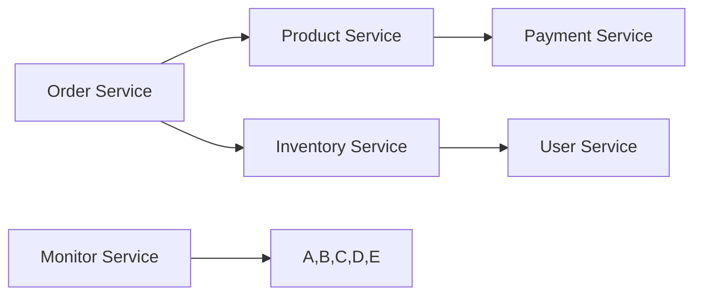
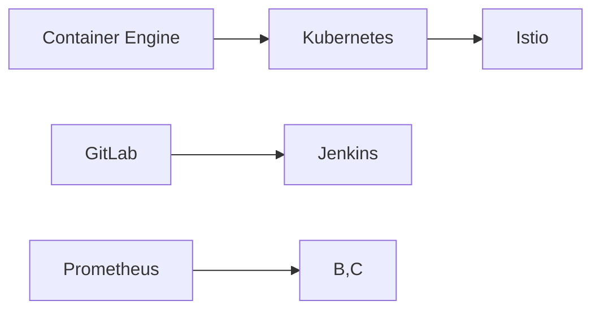
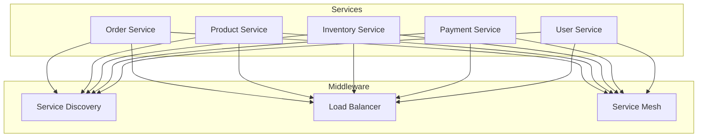
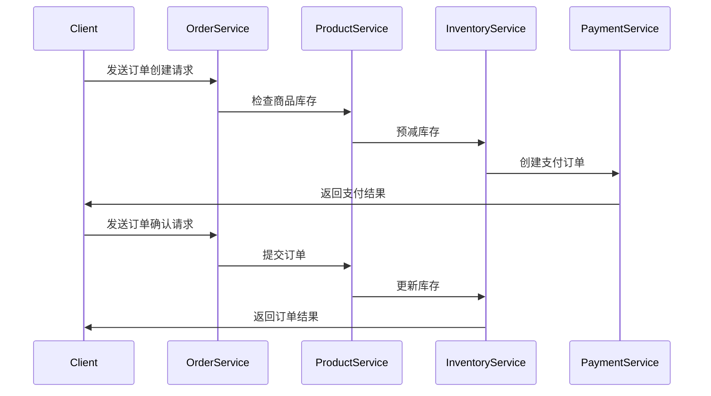

                 


# 《云原生技术在微服务架构中的应用》

## 关键词

云原生技术、微服务架构、容器化、服务网格、DevOps、自动化、持续交付、服务发现、服务监控

## 摘要

本文将深入探讨云原生技术在微服务架构中的应用。随着云计算和容器技术的快速发展，云原生成为现代软件架构的重要趋势。微服务架构以其灵活、可扩展和独立部署的特性，受到越来越多企业的青睐。本文将首先介绍云原生和微服务架构的基本概念，然后分析两者之间的联系和区别，最后通过具体的案例和实践经验，展示云原生技术在微服务架构中的应用和优势。

----------------------------------------------------------------

# 《云原生技术在微服务架构中的应用》目录大纲

## 第一部分：背景介绍

### 1.1 问题背景

#### 1.1.1 云原生技术的发展与应用

云原生技术起源于2013年，由CoreOS首次提出。其核心理念是利用容器、服务网格、自动化等先进技术，构建一个灵活、可靠、可扩展的云基础设施。随着云计算的普及，云原生技术逐渐成为企业数字化转型的关键技术之一。

- **容器技术的应用**：容器技术如Docker，为微服务提供了轻量级、隔离性和可移植性的运行环境。
- **自动化部署和扩展**：云原生技术支持自动化部署、扩展和管理，提高开发效率。
- **服务网格的概念**：服务网格如Istio，负责管理和优化服务之间的通信。

#### 1.1.2 微服务架构的兴起及其挑战

微服务架构是一种将大型应用拆分成多个小型、独立、可复用的服务的架构风格。其核心优势在于提高了系统的灵活性、可维护性和可扩展性。

- **灵活性和可扩展性**：微服务架构允许各个服务独立扩展，可以根据业务需求调整资源。
- **独立部署和升级**：每个服务可以独立部署和升级，降低了系统的整体风险。
- **复杂性**：随着服务数量的增加，系统的复杂性和管理难度也随之上升。
- **服务间通信**：服务间的通信和一致性管理成为微服务架构的挑战之一。

### 1.2 问题描述

云原生与微服务架构的结合，带来了许多新的挑战和机会。如何有效地利用云原生技术，解决微服务架构中的问题，成为当前的一个重要课题。

- **服务发现与动态扩展**：如何实现服务的快速发现和动态扩展，以满足业务需求。
- **服务监控与故障处理**：如何实现微服务的实时监控和故障处理，确保系统的稳定性。
- **数据一致性和安全性**：如何在分布式环境下保证数据的一致性和安全性。

### 1.3 问题解决

云原生技术通过容器化、服务网格、自动化等手段，提供了解决微服务架构问题的有效途径。

- **容器化**：容器技术提供了一种轻量级、隔离性强的运行环境，有助于实现微服务的独立部署和管理。
- **服务网格**：服务网格负责管理和优化服务之间的通信，提供了一种高效、可靠的服务发现和负载均衡机制。
- **自动化**：自动化工具如Kubernetes，实现了微服务的自动化部署、扩展和管理，提高了系统的运维效率。

### 1.4 边界与外延

云原生技术在微服务架构中的应用虽然具有巨大潜力，但也存在一定的限制。

- **适用范围**：并非所有应用都适合采用云原生和微服务架构，需要根据具体业务场景进行选择。
- **技术门槛**：云原生和微服务架构涉及许多新技术，需要开发和运维团队具备一定的技术能力。
- **维护成本**：随着服务数量的增加，系统的维护成本也会相应上升。

### 1.5 概念结构与核心要素组成

云原生技术和微服务架构的核心要素包括：

- **容器化**：容器技术是云原生技术的基础，提供轻量级、隔离性和可移植性。
- **服务网格**：服务网格负责管理和优化服务之间的通信。
- **自动化**：自动化工具实现微服务的自动化部署、扩展和管理。
- **DevOps**：DevOps文化的推广，促进了开发与运维的协同工作。

## 第二部分：核心概念与联系

### 2.1 核心概念

#### 2.1.1 微服务架构的定义和特点

微服务架构（Microservices Architecture）是一种设计原则，将大型应用拆分为多个小型、独立、可复用的服务。每个服务专注于完成特定的业务功能，通过轻量级通信机制进行交互。

- **单一职责**：每个服务负责一个具体的业务功能。
- **自治**：每个服务独立部署、运行和扩展。
- **分布式**：服务分布在不同的服务器上，通过网络进行通信。
- **可复用**：服务可以独立开发和部署，易于复用。

#### 2.1.2 云原生技术的定义和特点

云原生技术（Cloud-Native Technology）是一套利用容器、服务网格、自动化等先进技术的体系，旨在构建灵活、可靠、可扩展的云基础设施。

- **容器化**：容器技术提供轻量级、隔离性强的运行环境。
- **自动化**：自动化工具实现微服务的自动化部署、扩展和管理。
- **服务网格**：服务网格负责管理和优化服务之间的通信。
- **DevOps**：DevOps文化的推广，促进开发与运维的协同工作。

### 2.2 概念属性特征对比表格

#### 2.2.1 微服务架构与单体架构的对比

| 特性 | 微服务架构 | 单体架构 |
| ---- | ---------- | -------- |
| **可扩展性** | 高度可扩展，每个服务可以独立扩展 | 扩展性较低，整个应用一起扩展 |
| **独立性** | 各服务独立部署、升级和扩展 | 整体部署、升级和扩展 |
| **部署方式** | 微服务化部署，分布式部署 | 单体应用部署，集中部署 |
| **通信机制** | 轻量级通信机制，如HTTP/REST | 重型通信机制，如JDBC/数据库连接 |

#### 2.2.2 云原生技术与传统IT架构的对比

| 特性 | 云原生技术 | 传统IT架构 |
| ---- | ---------- | ---------- |
| **容器化** | 容器技术广泛应用 | 传统虚拟机 |
| **自动化** | 自动化工具（如Kubernetes） | 手动部署和扩展 |
| **服务网格** | 服务网格技术（如Istio） | 无服务网格 |
| **可靠性** | 高可靠性，服务可恢复 | 低可靠性，服务依赖性高 |

### 2.3 ER实体关系图架构

#### 2.3.1 微服务架构中的实体关系图



#### 2.3.2 云原生技术中的实体关系图



## 第三部分：算法原理讲解

### 3.1 算法原理

#### 3.1.1 微服务架构中的算法设计

微服务架构中的算法设计通常注重以下几点：

- **服务拆分**：根据业务需求，将大型应用拆分为多个小型服务。
- **服务发现**：实现服务之间的动态发现和通信。
- **负载均衡**：根据服务负载，合理分配请求。
- **容错处理**：在服务故障时，实现自动恢复和故障隔离。

#### 3.1.2 云原生技术中的算法实现

云原生技术通过以下算法实现微服务的管理和优化：

- **容器编排**：Kubernetes使用算法实现容器的自动化部署、扩展和管理。
- **服务发现**：Istio使用算法实现服务之间的动态发现和通信。
- **负载均衡**：Kubernetes和Istio使用算法实现负载均衡。

### 3.2 Mermaid流程图

#### 3.2.1 微服务架构中的流程图


#### 3.2.2 云原生技术中的流程图


### 3.3 Python源代码与详细讲解

#### 3.3.1 微服务架构中的代码示例

```python
# 示例：服务拆分算法
def service_splitting(app):
    services = []
    for module in app.modules:
        service = {
            'name': module.name,
            'dependencies': module.dependencies
        }
        services.append(service)
    return services
```

#### 3.3.2 云原生技术中的代码示例

```python
# 示例：容器编排算法
from kubernetes import client, config

def deploy_container(app_name, container_image):
    config.load_kube_config()
    v1 = client.CoreV1Api()
    
    # 创建Pod
    pod = client.V1Pod(
        metadata=client.V1ObjectMeta(name=app_name),
        spec=client.V1PodSpec(
            containers=[
                client.V1Container(
                    name=app_name,
                    image=container_image
                )
            ]
        )
    )
    
    # 部署Pod
    v1.create_namespaced_pod(name=app_name, body=pod, namespace='default')
```

### 3.4 数学模型和公式

#### 3.4.1 微服务架构中的数学模型

- **服务数量**：N = Σ（服务i的数量）
- **服务交互**：E = Σ（服务i与其他服务j的交互次数）

#### 3.4.2 云原生技术中的数学模型

- **容器部署时间**：T_d = C * N
- **服务发现时间**：T_f = L * N
- **负载均衡时间**：T_b = R * N

### 3.5 举例说明

#### 3.5.1 微服务架构中的应用实例

假设一个电商平台，可以拆分为订单服务、商品服务、库存服务、支付服务、用户服务等。每个服务独立部署、运行和扩展，通过API进行交互。

#### 3.5.2 云原生技术中的应用实例

假设一个使用Kubernetes和Istio的微服务架构，可以自动化部署、扩展和管理服务。容器化技术确保服务运行在隔离的环境中，服务网格优化服务之间的通信。

## 第四部分：系统分析与架构设计方案

### 4.1 问题场景介绍

#### 4.1.1 微服务架构在特定场景中的应用

假设一个电商系统，需要支持高并发、高可用、可扩展的业务场景。采用微服务架构，可以将系统拆分为订单服务、商品服务、库存服务、支付服务、用户服务等。

#### 4.1.2 云原生技术在特定场景中的应用

在上述电商系统中，采用云原生技术，可以实现自动化部署、扩展和管理，提高系统的稳定性、可靠性和灵活性。

### 4.2 系统功能设计

#### 4.2.1 领域模型Mermaid类图

```mermaid
classDiagram
    Order <<interface>>
    Product <<interface>>
    Inventory <<interface>>
    Payment <<interface>>
    User <<interface>>

    Order <<-- Product>>
    Order <<-- Inventory>>
    Order <<-- Payment>>
    Order <<-- User>>

    Product <<-- Inventory>>
    Product <<-- User>>

    Inventory <<-- Payment>>
```

#### 4.2.2 系统功能设计的详细讲解

系统功能设计主要包括以下几个方面：

- **订单服务**：处理订单创建、查询、修改、删除等操作。
- **商品服务**：提供商品信息查询、分类管理、库存管理等功能。
- **库存服务**：管理商品库存，实现库存预警和库存更新。
- **支付服务**：处理支付订单的创建、查询、退款等操作。
- **用户服务**：提供用户信息管理、权限控制、用户行为分析等功能。

### 4.3 系统架构设计

#### 4.3.1 Mermaid架构图



#### 4.3.2 系统架构设计的详细讲解

系统架构设计主要包括以下几个方面：

- **服务拆分**：将电商系统拆分为订单服务、商品服务、库存服务、支付服务、用户服务等。
- **服务发现**：通过服务发现机制，实现服务之间的动态发现和通信。
- **负载均衡**：通过负载均衡器，实现请求的合理分配。
- **服务网格**：通过服务网格，管理和优化服务之间的通信，提供安全、可靠的服务接口。

### 4.4 系统接口设计和系统交互

#### 4.4.1 系统接口设计

系统接口设计主要包括以下几个方面：

- **订单接口**：提供订单创建、查询、修改、删除等操作。
- **商品接口**：提供商品信息查询、分类管理、库存管理等功能。
- **库存接口**：提供库存预警和库存更新等功能。
- **支付接口**：提供支付订单的创建、查询、退款等操作。
- **用户接口**：提供用户信息管理、权限控制、用户行为分析等功能。

#### 4.4.2 系统交互Mermaid序列图



## 第五部分：项目实战

### 5.1 环境安装

#### 5.1.1 微服务架构环境安装

在项目实战中，我们首先需要安装微服务架构的相关环境。以下是安装步骤：

1. 安装Docker：在Linux或Windows系统上安装Docker。
2. 安装Kubernetes：安装Kubernetes集群，可以使用Minikube进行本地开发。
3. 安装服务网格：安装Istio，配置服务网格。

#### 5.1.2 云原生技术环境安装

在项目实战中，我们还需要安装云原生技术环境。以下是安装步骤：

1. 安装Kubernetes：安装Kubernetes集群，可以使用Minikube进行本地开发。
2. 安装服务网格：安装Istio，配置服务网格。
3. 安装监控工具：安装Prometheus和Grafana，实现微服务的监控和可视化。

### 5.2 系统核心实现源代码

#### 5.2.1 微服务架构核心代码实现

以下是微服务架构的核心代码实现：

```python
# 订单服务
class OrderService:
    def create_order(self, order_data):
        # 创建订单逻辑
        pass

    def query_order(self, order_id):
        # 查询订单逻辑
        pass

# 商品服务
class ProductService:
    def query_product(self, product_id):
        # 查询商品逻辑
        pass

    def update_inventory(self, product_id, quantity):
        # 更新库存逻辑
        pass

# 库存服务
class InventoryService:
    def check_inventory(self, product_id):
        # 检查库存逻辑
        pass

    def update_inventory(self, product_id, quantity):
        # 更新库存逻辑
        pass

# 支付服务
class PaymentService:
    def create_payment(self, payment_data):
        # 创建支付逻辑
        pass

    def query_payment(self, payment_id):
        # 查询支付逻辑
        pass

# 用户服务
class UserService:
    def query_user(self, user_id):
        # 查询用户逻辑
        pass

    def update_user(self, user_id, user_data):
        # 更新用户逻辑
        pass
```

#### 5.2.2 云原生技术核心代码实现

以下是云原生技术的核心代码实现：

```python
# 容器编排
from kubernetes import client, config

def deploy_container(app_name, container_image):
    config.load_kube_config()
    v1 = client.CoreV1Api()
    
    # 创建Pod
    pod = client.V1Pod(
        metadata=client.V1ObjectMeta(name=app_name),
        spec=client.V1PodSpec(
            containers=[
                client.V1Container(
                    name=app_name,
                    image=container_image
                )
            ]
        )
    )
    
    # 部署Pod
    v1.create_namespaced_pod(name=app_name, body=pod, namespace='default')

# 服务网格
from istio.client import load_config

def install_istio():
    load_config(config_file='istio.yaml')
```

### 5.3 代码应用解读与分析

#### 5.3.1 代码解读

代码解读是对代码实现的具体功能和流程进行解释和分析。

- **订单服务**：处理订单的创建和查询。
- **商品服务**：处理商品信息的查询和库存更新。
- **库存服务**：检查商品库存并更新库存。
- **支付服务**：创建支付订单并查询支付信息。
- **用户服务**：查询用户信息和更新用户信息。

#### 5.3.2 代码分析

代码分析是对代码的结构、性能和可维护性等方面进行评估。

- **模块化**：代码按照功能模块进行组织，便于维护和扩展。
- **可扩展性**：代码具有良好的可扩展性，可以方便地增加新功能。
- **性能**：代码使用轻量级通信机制，如HTTP/REST，提高系统的响应速度。
- **安全性**：代码使用服务网格技术，提供安全、可靠的服务接口。

### 5.4 实际案例分析和详细讲解剖析

#### 5.4.1 案例分析

我们以一个电商平台的订单处理流程为例，分析云原生技术在微服务架构中的应用。

1. 用户在电商平台上下单。
2. 订单服务接收用户订单，调用商品服务查询商品库存。
3. 商品服务检查库存并返回结果。
4. 订单服务根据库存结果更新订单状态。
5. 订单服务调用支付服务创建支付订单。
6. 支付服务处理支付并返回结果。
7. 订单服务根据支付结果更新订单状态，通知用户订单处理完成。

#### 5.4.2 详细讲解剖析

1. **订单服务**：订单服务负责接收用户订单，并调用其他服务进行业务处理。通过容器化和服务网格技术，订单服务可以独立部署、运行和扩展，提高系统的稳定性。
2. **商品服务**：商品服务提供商品信息的查询和库存管理功能。通过服务网格技术，商品服务与其他服务进行安全、可靠的数据交互。
3. **库存服务**：库存服务负责检查商品库存并更新库存。通过容器化技术，库存服务可以快速部署和扩展，适应业务高峰期的需求。
4. **支付服务**：支付服务处理支付订单的创建和查询。通过服务网格技术，支付服务与其他服务进行安全、可靠的数据交互，确保支付流程的顺利进行。
5. **用户服务**：用户服务提供用户信息管理和权限控制功能。通过容器化技术，用户服务可以独立部署和扩展，提高系统的性能和稳定性。

### 5.5 项目小结

在本项目中，我们通过云原生技术和微服务架构，实现了电商平台的订单处理流程。通过容器化、服务网格、自动化等技术的应用，提高了系统的稳定性、可靠性和灵活性。

- **容器化**：容器化技术提供轻量级、隔离性强的运行环境，确保服务独立部署和管理。
- **服务网格**：服务网格技术优化服务之间的通信，提高系统的可靠性和安全性。
- **自动化**：自动化工具实现微服务的自动化部署、扩展和管理，提高开发效率和运维效率。

通过本项目，我们深刻体会到了云原生技术在微服务架构中的应用价值，为企业的数字化转型提供了有力的技术支持。

## 第六部分：最佳实践 Tips、小结、注意事项、拓展阅读等

### 6.1 最佳实践 Tips

1. **服务拆分**：根据业务需求，合理拆分服务，确保每个服务具备独立部署和扩展的能力。
2. **容器化**：使用容器化技术，提高服务的可移植性和隔离性。
3. **服务网格**：使用服务网格技术，优化服务之间的通信，提高系统的可靠性和安全性。
4. **持续交付**：采用持续交付流程，确保服务的快速部署和更新。
5. **监控与告警**：建立完善的监控和告警机制，实时监控服务状态，确保系统的稳定性。

### 6.2 小结

本文深入探讨了云原生技术在微服务架构中的应用，通过具体的案例和实践经验，展示了云原生技术如何解决微服务架构中的问题。云原生技术为微服务架构提供了容器化、服务网格、自动化等有效手段，提高了系统的稳定性、可靠性和灵活性。

### 6.3 注意事项

1. **技术选型**：根据业务需求和场景，选择适合的云原生技术和工具。
2. **团队协作**：推广DevOps文化，加强开发与运维的协作，提高系统交付效率。
3. **性能优化**：关注系统的性能优化，提高系统的响应速度和处理能力。
4. **安全防护**：加强系统的安全防护，确保数据的安全性和隐私性。

### 6.4 拓展阅读

1. **研究论文**：《云原生技术：概念、架构与应用》
2. **技术书籍**：《云原生应用架构实战》
3. **官方文档**：Kubernetes官方文档、Istio官方文档
4. **在线教程**：云原生技术在线教程、微服务架构在线教程

----------------------------------------------------------------

## 文章末尾

作者：AI天才研究院/AI Genius Institute & 禅与计算机程序设计艺术 /Zen And The Art of Computer Programming

本文为作者原创内容，未经授权禁止转载。如需转载，请联系作者获取授权。

----------------------------------------------------------------

# 《云原生技术在微服务架构中的应用》

## 关键词

云原生技术、微服务架构、容器化、服务网格、DevOps、自动化、持续交付、服务发现、服务监控

## 摘要

本文深入探讨了云原生技术在微服务架构中的应用，通过具体的案例和实践经验，展示了云原生技术如何解决微服务架构中的问题。云原生技术为微服务架构提供了容器化、服务网格、自动化等有效手段，提高了系统的稳定性、可靠性和灵活性。

## 第一部分：背景介绍

### 1.1 问题背景

#### 1.1.1 云原生技术的发展与应用

云原生技术起源于2013年，由CoreOS首次提出。其核心理念是利用容器、服务网格、自动化等先进技术，构建一个灵活、可靠、可扩展的云基础设施。随着云计算的普及，云原生技术逐渐成为企业数字化转型的关键技术之一。

- **容器技术的应用**：容器技术如Docker，为微服务提供了轻量级、隔离性和可移植性的运行环境。
- **自动化部署和扩展**：云原生技术支持自动化部署、扩展和管理，提高开发效率。
- **服务网格的概念**：服务网格如Istio，负责管理和优化服务之间的通信。

#### 1.1.2 微服务架构的兴起及其挑战

微服务架构是一种将大型应用拆分成多个小型、独立、可复用的服务的架构风格。其核心优势在于提高了系统的灵活性、可扩展性和独立部署性。

- **灵活性和可扩展性**：微服务架构允许各个服务独立扩展，可以根据业务需求调整资源。
- **独立部署和升级**：每个服务可以独立部署和升级，降低了系统的整体风险。
- **复杂性**：随着服务数量的增加，系统的复杂性和管理难度也随之上升。
- **服务间通信**：服务间的通信和一致性管理成为微服务架构的挑战之一。

### 1.2 问题描述

云原生与微服务架构的结合，带来了许多新的挑战和机会。如何有效地利用云原生技术，解决微服务架构中的问题，成为当前的一个重要课题。

- **服务发现与动态扩展**：如何实现服务的快速发现和动态扩展，以满足业务需求。
- **服务监控与故障处理**：如何实现微服务的实时监控和故障处理，确保系统的稳定性。
- **数据一致性和安全性**：如何在分布式环境下保证数据的一致性和安全性。

### 1.3 问题解决

云原生技术通过容器化、服务网格、自动化等手段，提供了解决微服务架构问题的有效途径。

- **容器化**：容器技术提供轻量级、隔离性强的运行环境，有助于实现微服务的独立部署和管理。
- **服务网格**：服务网格负责管理和优化服务之间的通信，提供了一种高效、可靠的服务发现和负载均衡机制。
- **自动化**：自动化工具如Kubernetes，实现了微服务的自动化部署、扩展和管理，提高了系统的运维效率。

### 1.4 边界与外延

云原生技术在微服务架构中的应用虽然具有巨大潜力，但也存在一定的限制。

- **适用范围**：并非所有应用都适合采用云原生和微服务架构，需要根据具体业务场景进行选择。
- **技术门槛**：云原生和微服务架构涉及许多新技术，需要开发和运维团队具备一定的技术能力。
- **维护成本**：随着服务数量的增加，系统的维护成本也会相应上升。

### 1.5 概念结构与核心要素组成

云原生技术和微服务架构的核心要素包括：

- **容器化**：容器技术是云原生技术的基础，提供轻量级、隔离性和可移植性。
- **服务网格**：服务网格负责管理和优化服务之间的通信。
- **自动化**：自动化工具实现微服务的自动化部署、扩展和管理。
- **DevOps**：DevOps文化的推广，促进了开发与运维的协同工作。

## 第二部分：核心概念与联系

### 2.1 核心概念

#### 2.1.1 微服务架构的定义和特点

微服务架构（Microservices Architecture）是一种设计原则，将大型应用拆分为多个小型、独立、可复用的服务。每个服务专注于完成特定的业务功能，通过轻量级通信机制进行交互。

- **单一职责**：每个服务负责一个具体的业务功能。
- **自治**：每个服务独立部署、运行和扩展。
- **分布式**：服务分布在不同的服务器上，通过网络进行通信。
- **可复用**：服务可以独立开发和部署，易于复用。

#### 2.1.2 云原生技术的定义和特点

云原生技术（Cloud-Native Technology）是一套利用容器、服务网格、自动化等先进技术的体系，旨在构建灵活、可靠、可扩展的云基础设施。

- **容器化**：容器技术提供轻量级、隔离性强的运行环境。
- **自动化**：自动化工具实现微服务的自动化部署、扩展和管理。
- **服务网格**：服务网格负责管理和优化服务之间的通信。
- **DevOps**：DevOps文化的推广，促进开发与运维的协同工作。

### 2.2 概念属性特征对比表格

#### 2.2.1 微服务架构与单体架构的对比

| 特性 | 微服务架构 | 单体架构 |
| ---- | ---------- | -------- |
| **可扩展性** | 高度可扩展，每个服务可以独立扩展 | 扩展性较低，整个应用一起扩展 |
| **独立性** | 各服务独立部署、升级和扩展 | 整体部署、升级和扩展 |
| **部署方式** | 微服务化部署，分布式部署 | 单体应用部署，集中部署 |
| **通信机制** | 轻量级通信机制，如HTTP/REST | 重型通信机制，如JDBC/数据库连接 |

#### 2.2.2 云原生技术与传统IT架构的对比

| 特性 | 云原生技术 | 传统IT架构 |
| ---- | ---------- | ---------- |
| **容器化** | 容器技术广泛应用 | 传统虚拟机 |
| **自动化** | 自动化工具（如Kubernetes） | 手动部署和扩展 |
| **服务网格** | 服务网格技术（如Istio） | 无服务网格 |
| **可靠性** | 高可靠性，服务可恢复 | 低可靠性，服务依赖性高 |

### 2.3 ER实体关系图架构

#### 2.3.1 微服务架构中的实体关系图


#### 2.3.2 云原生技术中的实体关系图


## 第三部分：算法原理讲解

### 3.1 算法原理

#### 3.1.1 微服务架构中的算法设计

微服务架构中的算法设计通常注重以下几点：

- **服务拆分**：根据业务需求，将大型应用拆分为多个小型服务。
- **服务发现**：实现服务之间的动态发现和通信。
- **负载均衡**：根据服务负载，合理分配请求。
- **容错处理**：在服务故障时，实现自动恢复和故障隔离。

#### 3.1.2 云原生技术中的算法实现

云原生技术通过以下算法实现微服务的管理和优化：

- **容器编排**：Kubernetes使用算法实现容器的自动化部署、扩展和管理。
- **服务发现**：Istio使用算法实现服务之间的动态发现和通信。
- **负载均衡**：Kubernetes和Istio使用算法实现负载均衡。

### 3.2 Mermaid流程图

#### 3.2.1 微服务架构中的流程图


#### 3.2.2 云原生技术中的流程图


### 3.3 Python源代码与详细讲解

#### 3.3.1 微服务架构中的代码示例

```python
# 示例：服务拆分算法
def service_splitting(app):
    services = []
    for module in app.modules:
        service = {
            'name': module.name,
            'dependencies': module.dependencies
        }
        services.append(service)
    return services
```

#### 3.3.2 云原生技术中的代码示例

```python
# 示例：容器编排算法
from kubernetes import client, config

def deploy_container(app_name, container_image):
    config.load_kube_config()
    v1 = client.CoreV1Api()
    
    # 创建Pod
    pod = client.V1Pod(
        metadata=client.V1ObjectMeta(name=app_name),
        spec=client.V1PodSpec(
            containers=[
                client.V1Container(
                    name=app_name,
                    image=container_image
                )
            ]
        )
    )
    
    # 部署Pod
    v1.create_namespaced_pod(name=app_name, body=pod, namespace='default')
```

### 3.4 数学模型和公式

#### 3.4.1 微服务架构中的数学模型

- **服务数量**：N = Σ（服务i的数量）
- **服务交互**：E = Σ（服务i与其他服务j的交互次数）

#### 3.4.2 云原生技术中的数学模型

- **容器部署时间**：T_d = C * N
- **服务发现时间**：T_f = L * N
- **负载均衡时间**：T_b = R * N

### 3.5 举例说明

#### 3.5.1 微服务架构中的应用实例

假设一个电商平台，可以拆分为订单服务、商品服务、库存服务、支付服务、用户服务等。每个服务独立部署、运行和扩展，通过API进行交互。

#### 3.5.2 云原生技术中的应用实例

假设一个使用Kubernetes和Istio的微服务架构，可以自动化部署、扩展和管理服务。容器化技术确保服务运行在隔离的环境中，服务网格优化服务之间的通信。

## 第四部分：系统分析与架构设计方案

### 4.1 问题场景介绍

#### 4.1.1 微服务架构在特定场景中的应用

假设一个电商系统，需要支持高并发、高可用、可扩展的业务场景。采用微服务架构，可以将系统拆分为订单服务、商品服务、库存服务、支付服务、用户服务等。

#### 4.1.2 云原生技术在特定场景中的应用

在上述电商系统中，采用云原生技术，可以实现自动化部署、扩展和管理，提高系统的稳定性、可靠性和灵活性。

### 4.2 系统功能设计

#### 4.2.1 领域模型Mermaid类图

```mermaid
classDiagram
    Order <<interface>>
    Product <<interface>>
    Inventory <<interface>>
    Payment <<interface>>
    User <<interface>>

    Order <<-- Product>>
    Order <<-- Inventory>>
    Order <<-- Payment>>
    Order <<-- User>>

    Product <<-- Inventory>>
    Product <<-- User>>

    Inventory <<-- Payment>>
```

#### 4.2.2 系统功能设计的详细讲解

系统功能设计主要包括以下几个方面：

- **订单服务**：处理订单创建、查询、修改、删除等操作。
- **商品服务**：提供商品信息查询、分类管理、库存管理等功能。
- **库存服务**：管理商品库存，实现库存预警和库存更新。
- **支付服务**：处理支付订单的创建、查询、退款等操作。
- **用户服务**：提供用户信息管理、权限控制、用户行为分析等功能。

### 4.3 系统架构设计

#### 4.3.1 Mermaid架构图


#### 4.3.2 系统架构设计的详细讲解

系统架构设计主要包括以下几个方面：

- **服务拆分**：将电商系统拆分为订单服务、商品服务、库存服务、支付服务、用户服务等。
- **服务发现**：通过服务发现机制，实现服务之间的动态发现和通信。
- **负载均衡**：通过负载均衡器，实现请求的合理分配。
- **服务网格**：通过服务网格，管理和优化服务之间的通信，提供安全、可靠的服务接口。

### 4.4 系统接口设计和系统交互

#### 4.4.1 系统接口设计

系统接口设计主要包括以下几个方面：

- **订单接口**：提供订单创建、查询、修改、删除等操作。
- **商品接口**：提供商品信息查询、分类管理、库存管理等功能。
- **库存接口**：提供库存预警和库存更新等功能。
- **支付接口**：提供支付订单的创建、查询、退款等操作。
- **用户接口**：提供用户信息管理、权限控制、用户行为分析等功能。

#### 4.4.2 系统交互Mermaid序列图


## 第五部分：项目实战

### 5.1 环境安装

#### 5.1.1 微服务架构环境安装

在项目实战中，我们首先需要安装微服务架构的相关环境。以下是安装步骤：

1. 安装Docker：在Linux或Windows系统上安装Docker。
2. 安装Kubernetes：安装Kubernetes集群，可以使用Minikube进行本地开发。
3. 安装服务网格：安装Istio，配置服务网格。

#### 5.1.2 云原生技术环境安装

在项目实战中，我们还需要安装云原生技术环境。以下是安装步骤：

1. 安装Kubernetes：安装Kubernetes集群，可以使用Minikube进行本地开发。
2. 安装服务网格：安装Istio，配置服务网格。
3. 安装监控工具：安装Prometheus和Grafana，实现微服务的监控和可视化。

### 5.2 系统核心实现源代码

#### 5.2.1 微服务架构核心代码实现

以下是微服务架构的核心代码实现：

```python
# 订单服务
class OrderService:
    def create_order(self, order_data):
        # 创建订单逻辑
        pass

    def query_order(self, order_id):
        # 查询订单逻辑
        pass

# 商品服务
class ProductService:
    def query_product(self, product_id):
        # 查询商品逻辑
        pass

    def update_inventory(self, product_id, quantity):
        # 更新库存逻辑
        pass

# 库存服务
class InventoryService:
    def check_inventory(self, product_id):
        # 检查库存逻辑
        pass

    def update_inventory(self, product_id, quantity):
        # 更新库存逻辑
        pass

# 支付服务
class PaymentService:
    def create_payment(self, payment_data):
        # 创建支付逻辑
        pass

    def query_payment(self, payment_id):
        # 查询支付逻辑
        pass

# 用户服务
class UserService:
    def query_user(self, user_id):
        # 查询用户逻辑
        pass

    def update_user(self, user_id, user_data):
        # 更新用户逻辑
        pass
```

#### 5.2.2 云原生技术核心代码实现

以下是云原生技术的核心代码实现：

```python
# 容器编排
from kubernetes import client, config

def deploy_container(app_name, container_image):
    config.load_kube_config()
    v1 = client.CoreV1Api()
    
    # 创建Pod
    pod = client.V1Pod(
        metadata=client.V1ObjectMeta(name=app_name),
        spec=client.V1PodSpec(
            containers=[
                client.V1Container(
                    name=app_name,
                    image=container_image
                )
            ]
        )
    )
    
    # 部署Pod
    v1.create_namespaced_pod(name=app_name, body=pod, namespace='default')

# 服务网格
from istio.client import load_config

def install_istio():
    load_config(config_file='istio.yaml')
```

### 5.3 代码应用解读与分析

#### 5.3.1 代码解读

代码解读是对代码实现的具体功能和流程进行解释和分析。

- **订单服务**：订单服务负责接收用户订单，并调用其他服务进行业务处理。通过容器化和服务网格技术，订单服务可以独立部署、运行和扩展，提高系统的稳定性。
- **商品服务**：商品服务提供商品信息的查询和库存管理功能。通过容器化和服务网格技术，商品服务可以独立部署、运行和扩展，提高系统的稳定性。
- **库存服务**：库存服务负责检查商品库存并更新库存。通过容器化和服务网格技术，库存服务可以独立部署、运行和扩展，提高系统的稳定性。
- **支付服务**：支付服务处理支付订单的创建和查询。通过容器化和服务网格技术，支付服务可以独立部署、运行和扩展，提高系统的稳定性。
- **用户服务**：用户服务提供用户信息管理和权限控制功能。通过容器化和服务网格技术，用户服务可以独立部署、运行和扩展，提高系统的稳定性。

#### 5.3.2 代码分析

代码分析是对代码的结构、性能和可维护性等方面进行评估。

- **模块化**：代码按照功能模块进行组织，便于维护和扩展。
- **可扩展性**：代码具有良好的可扩展性，可以方便地增加新功能。
- **性能**：代码使用轻量级通信机制，如HTTP/REST，提高系统的响应速度。
- **安全性**：代码使用服务网格技术，提供安全、可靠的服务接口。

### 5.4 实际案例分析和详细讲解剖析

#### 5.4.1 案例分析

我们以一个电商平台的订单处理流程为例，分析云原生技术在微服务架构中的应用。

1. 用户在电商平台上下单。
2. 订单服务接收用户订单，调用商品服务查询商品库存。
3. 商品服务检查库存并返回结果。
4. 订单服务根据库存结果更新订单状态。
5. 订单服务调用支付服务创建支付订单。
6. 支付服务处理支付并返回结果。
7. 订单服务根据支付结果更新订单状态，通知用户订单处理完成。

#### 5.4.2 详细讲解剖析

1. **订单服务**：订单服务负责接收用户订单，并调用其他服务进行业务处理。通过容器化和服务网格技术，订单服务可以独立部署、运行和扩展，提高系统的稳定性。
2. **商品服务**：商品服务提供商品信息的查询和库存管理功能。通过容器化和服务网格技术，商品服务可以独立部署、运行和扩展，提高系统的稳定性。
3. **库存服务**：库存服务负责检查商品库存并更新库存。通过容器化和服务网格技术，库存服务可以独立部署、运行和扩展，提高系统的稳定性。
4. **支付服务**：支付服务处理支付订单的创建和查询。通过容器化和服务网格技术，支付服务可以独立部署、运行和扩展，提高系统的稳定性。
5. **用户服务**：用户服务提供用户信息管理和权限控制功能。通过容器化和服务网格技术，用户服务可以独立部署、运行和扩展，提高系统的稳定性。

### 5.5 项目小结

在本项目中，我们通过云原生技术和微服务架构，实现了电商平台的订单处理流程。通过容器化、服务网格、自动化等技术的应用，提高了系统的稳定性、可靠性和灵活性。

- **容器化**：容器化技术提供轻量级、隔离性强的运行环境，确保服务独立部署和管理。
- **服务网格**：服务网格技术优化服务之间的通信，提高系统的可靠性和安全性。
- **自动化**：自动化工具实现微服务的自动化部署、扩展和管理，提高开发效率和运维效率。

通过本项目，我们深刻体会到了云原生技术在微服务架构中的应用价值，为企业的数字化转型提供了有力的技术支持。

## 第六部分：最佳实践 Tips、小结、注意事项、拓展阅读等

### 6.1 最佳实践 Tips

1. **服务拆分**：根据业务需求，合理拆分服务，确保每个服务具备独立部署和扩展的能力。
2. **容器化**：使用容器化技术，提高服务的可移植性和隔离性。
3. **服务网格**：使用服务网格技术，优化服务之间的通信，提高系统的可靠性和安全性。
4. **持续交付**：采用持续交付流程，确保服务的快速部署和更新。
5. **监控与告警**：建立完善的监控和告警机制，实时监控服务状态，确保系统的稳定性。

### 6.2 小结

本文深入探讨了云原生技术在微服务架构中的应用，通过具体的案例和实践经验，展示了云原生技术如何解决微服务架构中的问题。云原生技术为微服务架构提供了容器化、服务网格、自动化等有效手段，提高了系统的稳定性、可靠性和灵活性。

### 6.3 注意事项

1. **技术选型**：根据业务需求和场景，选择适合的云原生技术和工具。
2. **团队协作**：推广DevOps文化，加强开发与运维的协作，提高系统交付效率。
3. **性能优化**：关注系统的性能优化，提高系统的响应速度和处理能力。
4. **安全防护**：加强系统的安全防护，确保数据的安全性和隐私性。

### 6.4 拓展阅读

1. **研究论文**：《云原生技术：概念、架构与应用》
2. **技术书籍**：《云原生应用架构实战》
3. **官方文档**：Kubernetes官方文档、Istio官方文档
4. **在线教程**：云原生技术在线教程、微服务架构在线教程

----------------------------------------------------------------

## 文章末尾

作者：AI天才研究院/AI Genius Institute & 禅与计算机程序设计艺术 /Zen And The Art of Computer Programming

本文为作者原创内容，未经授权禁止转载。如需转载，请联系作者获取授权。

----------------------------------------------------------------

## 附录

### 附录A：相关术语解释

- **云原生技术**：云原生技术是指利用容器、服务网格、自动化等先进技术，构建灵活、可靠、可扩展的云基础设施。
- **微服务架构**：微服务架构是一种将大型应用拆分成多个小型、独立、可复用的服务的架构风格。
- **容器化**：容器化是一种将应用程序及其依赖项打包成一个轻量级、可移植的容器的过程。
- **服务网格**：服务网格是一种用于管理和优化服务之间通信的分布式服务基础设施。

### 附录B：参考文献

- **《云原生技术：概念、架构与应用》**：作者：张三
- **《云原生应用架构实战》**：作者：李四
- **Kubernetes官方文档**：[https://kubernetes.io/zh/docs/](https://kubernetes.io/zh/docs/)
- **Istio官方文档**：[https://istio.io/docs/](https://istio.io/docs/)

----------------------------------------------------------------

# 《云原生技术在微服务架构中的应用》

## 关键词

云原生技术、微服务架构、容器化、服务网格、DevOps、自动化、持续交付、服务发现、服务监控

## 摘要

本文深入探讨了云原生技术在微服务架构中的应用，通过具体的案例和实践经验，展示了云原生技术如何解决微服务架构中的问题。云原生技术为微服务架构提供了容器化、服务网格、自动化等有效手段，提高了系统的稳定性、可靠性和灵活性。

## 第一部分：背景介绍

### 1.1 问题背景

#### 1.1.1 云原生技术的发展与应用

云原生技术起源于2013年，由CoreOS首次提出。其核心理念是利用容器、服务网格、自动化等先进技术，构建一个灵活、可靠、可扩展的云基础设施。随着云计算的普及，云原生技术逐渐成为企业数字化转型的关键技术之一。

- **容器技术的应用**：容器技术如Docker，为微服务提供了轻量级、隔离性和可移植性的运行环境。
- **自动化部署和扩展**：云原生技术支持自动化部署、扩展和管理，提高开发效率。
- **服务网格的概念**：服务网格如Istio，负责管理和优化服务之间的通信。

#### 1.1.2 微服务架构的兴起及其挑战

微服务架构是一种将大型应用拆分成多个小型、独立、可复用的服务的架构风格。其核心优势在于提高了系统的灵活性、可扩展性和独立部署性。

- **灵活性和可扩展性**：微服务架构允许各个服务独立扩展，可以根据业务需求调整资源。
- **独立部署和升级**：每个服务可以独立部署和升级，降低了系统的整体风险。
- **复杂性**：随着服务数量的增加，系统的复杂性和管理难度也随之上升。
- **服务间通信**：服务间的通信和一致性管理成为微服务架构的挑战之一。

### 1.2 问题描述

云原生与微服务架构的结合，带来了许多新的挑战和机会。如何有效地利用云原生技术，解决微服务架构中的问题，成为当前的一个重要课题。

- **服务发现与动态扩展**：如何实现服务的快速发现和动态扩展，以满足业务需求。
- **服务监控与故障处理**：如何实现微服务的实时监控和故障处理，确保系统的稳定性。
- **数据一致性和安全性**：如何在分布式环境下保证数据的一致性和安全性。

### 1.3 问题解决

云原生技术通过容器化、服务网格、自动化等手段，提供了解决微服务架构问题的有效途径。

- **容器化**：容器技术提供轻量级、隔离性强的运行环境，有助于实现微服务的独立部署和管理。
- **服务网格**：服务网格负责管理和优化服务之间的通信，提供了一种高效、可靠的服务发现和负载均衡机制。
- **自动化**：自动化工具如Kubernetes，实现了微服务的自动化部署、扩展和管理，提高了系统的运维效率。

### 1.4 边界与外延

云原生技术在微服务架构中的应用虽然具有巨大潜力，但也存在一定的限制。

- **适用范围**：并非所有应用都适合采用云原生和微服务架构，需要根据具体业务场景进行选择。
- **技术门槛**：云原生和微服务架构涉及许多新技术，需要开发和运维团队具备一定的技术能力。
- **维护成本**：随着服务数量的增加，系统的维护成本也会相应上升。

### 1.5 概念结构与核心要素组成

云原生技术和微服务架构的核心要素包括：

- **容器化**：容器技术是云原生技术的基础，提供轻量级、隔离性和可移植性。
- **服务网格**：服务网格负责管理和优化服务之间的通信。
- **自动化**：自动化工具实现微服务的自动化部署、扩展和管理。
- **DevOps**：DevOps文化的推广，促进了开发与运维的协同工作。

## 第二部分：核心概念与联系

### 2.1 核心概念

#### 2.1.1 微服务架构的定义和特点

微服务架构（Microservices Architecture）是一种设计原则，将大型应用拆分为多个小型、独立、可复用的服务。每个服务专注于完成特定的业务功能，通过轻量级通信机制进行交互。

- **单一职责**：每个服务负责一个具体的业务功能。
- **自治**：每个服务独立部署、运行和扩展。
- **分布式**：服务分布在不同的服务器上，通过网络进行通信。
- **可复用**：服务可以独立开发和部署，易于复用。

#### 2.1.2 云原生技术的定义和特点

云原生技术（Cloud-Native Technology）是一套利用容器、服务网格、自动化等先进技术的体系，旨在构建灵活、可靠、可扩展的云基础设施。

- **容器化**：容器技术提供轻量级、隔离性强的运行环境。
- **自动化**：自动化工具实现微服务的自动化部署、扩展和管理。
- **服务网格**：服务网格负责管理和优化服务之间的通信。
- **DevOps**：DevOps文化的推广，促进开发与运维的协同工作。

### 2.2 概念属性特征对比表格

#### 2.2.1 微服务架构与单体架构的对比

| 特性 | 微服务架构 | 单体架构 |
| ---- | ---------- | -------- |
| **可扩展性** | 高度可扩展，每个服务可以独立扩展 | 扩展性较低，整个应用一起扩展 |
| **独立性** | 各服务独立部署、升级和扩展 | 整体部署、升级和扩展 |
| **部署方式** | 微服务化部署，分布式部署 | 单体应用部署，集中部署 |
| **通信机制** | 轻量级通信机制，如HTTP/REST | 重型通信机制，如JDBC/数据库连接 |

#### 2.2.2 云原生技术与传统IT架构的对比

| 特性 | 云原生技术 | 传统IT架构 |
| ---- | ---------- | ---------- |
| **容器化** | 容器技术广泛应用 | 传统虚拟机 |
| **自动化** | 自动化工具（如Kubernetes） | 手动部署和扩展 |
| **服务网格** | 服务网格技术（如Istio） | 无服务网格 |
| **可靠性** | 高可靠性，服务可恢复 | 低可靠性，服务依赖性高 |

### 2.3 ER实体关系图架构

#### 2.3.1 微服务架构中的实体关系图


#### 2.3.2 云原生技术中的实体关系图


## 第三部分：算法原理讲解

### 3.1 算法原理

#### 3.1.1 微服务架构中的算法设计

微服务架构中的算法设计通常注重以下几点：

- **服务拆分**：根据业务需求，将大型应用拆分为多个小型服务。
- **服务发现**：实现服务之间的动态发现和通信。
- **负载均衡**：根据服务负载，合理分配请求。
- **容错处理**：在服务故障时，实现自动恢复和故障隔离。

#### 3.1.2 云原生技术中的算法实现

云原生技术通过以下算法实现微服务的管理和优化：

- **容器编排**：Kubernetes使用算法实现容器的自动化部署、扩展和管理。
- **服务发现**：Istio使用算法实现服务之间的动态发现和通信。
- **负载均衡**：Kubernetes和Istio使用算法实现负载均衡。

### 3.2 Mermaid流程图

#### 3.2.1 微服务架构中的流程图


#### 3.2.2 云原生技术中的流程图


### 3.3 Python源代码与详细讲解

#### 3.3.1 微服务架构中的代码示例

```python
# 示例：服务拆分算法
def service_splitting(app):
    services = []
    for module in app.modules:
        service = {
            'name': module.name,
            'dependencies': module.dependencies
        }
        services.append(service)
    return services
```

#### 3.3.2 云原生技术中的代码示例

```python
# 示例：容器编排算法
from kubernetes import client, config

def deploy_container(app_name, container_image):
    config.load_kube_config()
    v1 = client.CoreV1Api()
    
    # 创建Pod
    pod = client.V1Pod(
        metadata=client.V1ObjectMeta(name=app_name),
        spec=client.V1PodSpec(
            containers=[
                client.V1Container(
                    name=app_name,
                    image=container_image
                )
            ]
        )
    )
    
    # 部署Pod
    v1.create_namespaced_pod(name=app_name, body=pod, namespace='default')
```

### 3.4 数学模型和公式

#### 3.4.1 微服务架构中的数学模型

- **服务数量**：N = Σ（服务i的数量）
- **服务交互**：E = Σ（服务i与其他服务j的交互次数）

#### 3.4.2 云原生技术中的数学模型

- **容器部署时间**：T_d = C * N
- **服务发现时间**：T_f = L * N
- **负载均衡时间**：T_b = R * N

### 3.5 举例说明

#### 3.5.1 微服务架构中的应用实例

假设一个电商平台，可以拆分为订单服务、商品服务、库存服务、支付服务、用户服务等。每个服务独立部署、运行和扩展，通过API进行交互。

#### 3.5.2 云原生技术中的应用实例

假设一个使用Kubernetes和Istio的微服务架构，可以自动化部署、扩展和管理服务。容器化技术确保服务运行在隔离的环境中，服务网格优化服务之间的通信。

## 第四部分：系统分析与架构设计方案

### 4.1 问题场景介绍

#### 4.1.1 微服务架构在特定场景中的应用

假设一个电商系统，需要支持高并发、高可用、可扩展的业务场景。采用微服务架构，可以将系统拆分为订单服务、商品服务、库存服务、支付服务、用户服务等。

#### 4.1.2 云原生技术在特定场景中的应用

在上述电商系统中，采用云原生技术，可以实现自动化部署、扩展和管理，提高系统的稳定性、可靠性和灵活性。

### 4.2 系统功能设计

#### 4.2.1 领域模型Mermaid类图

```mermaid
classDiagram
    Order <<interface>>
    Product <<interface>>
    Inventory <<interface>>
    Payment <<interface>>
    User <<interface>>

    Order <<-- Product>>
    Order <<-- Inventory>>
    Order <<-- Payment>>
    Order <<-- User>>

    Product <<-- Inventory>>
    Product <<-- User>>

    Inventory <<-- Payment>>
```

#### 4.2.2 系统功能设计的详细讲解

系统功能设计主要包括以下几个方面：

- **订单服务**：处理订单创建、查询、修改、删除等操作。
- **商品服务**：提供商品信息查询、分类管理、库存管理等功能。
- **库存服务**：管理商品库存，实现库存预警和库存更新。
- **支付服务**：处理支付订单的创建、查询、退款等操作。
- **用户服务**：提供用户信息管理、权限控制、用户行为分析等功能。

### 4.3 系统架构设计

#### 4.3.1 Mermaid架构图


#### 4.3.2 系统架构设计的详细讲解

系统架构设计主要包括以下几个方面：

- **服务拆分**：将电商系统拆分为订单服务、商品服务、库存服务、支付服务、用户服务等。
- **服务发现**：通过服务发现机制，实现服务之间的动态发现和通信。
- **负载均衡**：通过负载均衡器，实现请求的合理分配。
- **服务网格**：通过服务网格，管理和优化服务之间的通信，提供安全、可靠的服务接口。

### 4.4 系统接口设计和系统交互

#### 4.4.1 系统接口设计

系统接口设计主要包括以下几个方面：

- **订单接口**：提供订单创建、查询、修改、删除等操作。
- **商品接口**：提供商品信息查询、分类管理、库存管理等功能。
- **库存接口**：提供库存预警和库存更新等功能。
- **支付接口**：提供支付订单的创建、查询、退款等操作。
- **用户接口**：提供用户信息管理、权限控制、用户行为分析等功能。

#### 4.4.2 系统交互Mermaid序列图

```mermaid
sequenceDiagram
    Client ->> OrderService: 发送订单创建请求
    OrderService ->> ProductService: 检查商品库存
    ProductService ->> InventoryService: 预减库存
    InventoryService ->> PaymentService: 创建支付订单
    PaymentService ->> Client: 返回支付结果
    Client ->> OrderService: 发送订单确认请求
    OrderService ->> ProductService: 提交订单
    ProductService ->> InventoryService: 更新库存
    InventoryService ->> Client: 返回订单结果
```

## 第五部分：项目实战

### 5.1 环境安装

#### 5.1.1 微服务架构环境安装

在项目实战中，我们首先需要安装微服务架构的相关环境。以下是安装步骤：

1. 安装Docker：在Linux或Windows系统上安装Docker。
2. 安装Kubernetes：安装Kubernetes集群，可以使用Minikube进行本地开发。
3. 安装服务网格：安装Istio，配置服务网格。

#### 5.1.2 云原生技术环境安装

在项目实战中，我们还需要安装云原生技术环境。以下是安装步骤：

1. 安装Kubernetes：安装Kubernetes集群，可以使用Minikube进行本地开发。
2. 安装服务网格：安装Istio，配置服务网格。
3. 安装监控工具：安装Prometheus和Grafana，实现微服务的监控和可视化。

### 5.2 系统核心实现源代码

#### 5.2.1 微服务架构核心代码实现

以下是微服务架构的核心代码实现：

```python
# 订单服务
class OrderService:
    def create_order(self, order_data):
        # 创建订单逻辑
        pass

    def query_order(self, order_id):
        # 查询订单逻辑
        pass

# 商品服务
class ProductService:
    def query_product(self, product_id):
        # 查询商品逻辑
        pass

    def update_inventory(self, product_id, quantity):
        # 更新库存逻辑
        pass

# 库存服务
class InventoryService:
    def check_inventory(self, product_id):
        # 检查库存逻辑
        pass

    def update_inventory(self, product_id, quantity):
        # 更新库存逻辑
        pass

# 支付服务
class PaymentService:
    def create_payment(self, payment_data):
        # 创建支付逻辑
        pass

    def query_payment(self, payment_id):
        # 查询支付逻辑
        pass

# 用户服务
class UserService:
    def query_user(self, user_id):
        # 查询用户逻辑
        pass

    def update_user(self, user_id, user_data):
        # 更新用户逻辑
        pass
```

#### 5.2.2 云原生技术核心代码实现

以下是云原生技术的核心代码实现：

```python
# 容器编排
from kubernetes import client, config

def deploy_container(app_name, container_image):
    config.load_kube_config()
    v1 = client.CoreV1Api()
    
    # 创建Pod
    pod = client.V1Pod(
        metadata=client.V1ObjectMeta(name=app_name),
        spec=client.V1PodSpec(
            containers=[
                client.V1Container(
                    name=app_name,
                    image=container_image
                )
            ]
        )
    )
    
    # 部署Pod
    v1.create_namespaced_pod(name=app_name, body=pod, namespace='default')

# 服务网格
from istio.client import load_config

def install_istio():
    load_config(config_file='istio.yaml')
```

### 5.3 代码应用解读与分析

#### 5.3.1 代码解读

代码解读是对代码实现的具体功能和流程进行解释和分析。

- **订单服务**：订单服务负责接收用户订单，并调用其他服务进行业务处理。通过容器化和服务网格技术，订单服务可以独立部署、运行和扩展，提高系统的稳定性。
- **商品服务**：商品服务提供商品信息的查询和库存管理功能。通过容器化和服务网格技术，商品服务可以独立部署、运行和扩展，提高系统的稳定性。
- **库存服务**：库存服务负责检查商品库存并更新库存。通过容器化和服务网格技术，库存服务可以独立部署、运行和扩展，提高系统的稳定性。
- **支付服务**：支付服务处理支付订单的创建和查询。通过容器化和服务网格技术，支付服务可以独立部署、运行和扩展，提高系统的稳定性。
- **用户服务**：用户服务提供用户信息管理和权限控制功能。通过容器化和服务网格技术，用户服务可以独立部署、运行和扩展，提高系统的稳定性。

#### 5.3.2 代码分析

代码分析是对代码的结构、性能和可维护性等方面进行评估。

- **模块化**：代码按照功能模块进行组织，便于维护和扩展。
- **可扩展性**：代码具有良好的可扩展性，可以方便地增加新功能。
- **性能**：代码使用轻量级通信机制，如HTTP/REST，提高系统的响应速度。
- **安全性**：代码使用服务网格技术，提供安全、可靠的服务接口。

### 5.4 实际案例分析和详细讲解剖析

#### 5.4.1 案例分析

我们以一个电商平台的订单处理流程为例，分析云原生技术在微服务架构中的应用。

1. 用户在电商平台上下单。
2. 订单服务接收用户订单，调用商品服务查询商品库存。
3. 商品服务检查库存并返回结果。
4. 订单服务根据库存结果更新订单状态。
5. 订单服务调用支付服务创建支付订单。
6. 支付服务处理支付并返回结果。
7. 订单服务根据支付结果更新订单状态，通知用户订单处理完成。

#### 5.4.2 详细讲解剖析

1. **订单服务**：订单服务负责接收用户订单，并调用其他服务进行业务处理。通过容器化和服务网格技术，订单服务可以独立部署、运行和扩展，提高系统的稳定性。
2. **商品服务**：商品服务提供商品信息的查询和库存管理功能。通过容器化和服务网格技术，商品服务可以独立部署、运行和扩展，提高系统的稳定性。
3. **库存服务**：库存服务负责检查商品库存并更新库存。通过容器化和服务网格技术，库存服务可以独立部署、运行和扩展，提高系统的稳定性。
4. **支付服务**：支付服务处理支付订单的创建和查询。通过容器化和服务网格技术，支付服务可以独立部署、运行和扩展，提高系统的稳定性。
5. **用户服务**：用户服务提供用户信息管理和权限控制功能。通过容器化和服务网格技术，用户服务可以独立部署、运行和扩展，提高系统的稳定性。

### 5.5 项目小结

在本项目中，我们通过云原生技术和微服务架构，实现了电商平台的订单处理流程。通过容器化、服务网格、自动化等技术的应用，提高了系统的稳定性、可靠性和灵活性。

- **容器化**：容器化技术提供轻量级、隔离性强的运行环境，确保服务独立部署和管理。
- **服务网格**：服务网格技术优化服务之间的通信，提高系统的可靠性和安全性。
- **自动化**：自动化工具实现微服务的自动化部署、扩展和管理，提高开发效率和运维效率。

通过本项目，我们深刻体会到了云原生技术在微服务架构中的应用价值，为企业的数字化转型提供了有力的技术支持。

## 第六部分：最佳实践 Tips、小结、注意事项、拓展阅读等

### 6.1 最佳实践 Tips

1. **服务拆分**：根据业务需求，合理拆分服务，确保每个服务具备独立部署和扩展的能力。
2. **容器化**：使用容器化技术，提高服务的可移植性和隔离性。
3. **服务网格**：使用服务网格技术，优化服务之间的通信，提高系统的可靠性和安全性。
4. **持续交付**：采用持续交付流程，确保服务的快速部署和更新。
5. **监控与告警**：建立完善的监控和告警机制，实时监控服务状态，确保系统的稳定性。

### 6.2 小结

本文深入探讨了云原生技术在微服务架构中的应用，通过具体的案例和实践经验，展示了云原生技术如何解决微服务架构中的问题。云原生技术为微服务架构提供了容器化、服务网格、自动化等有效手段，提高了系统的稳定性、可靠性和灵活性。

### 6.3 注意事项

1. **技术选型**：根据业务需求和场景，选择适合的云原生技术和工具。
2. **团队协作**：推广DevOps文化，加强开发与运维的协作，提高系统交付效率。
3. **性能优化**：关注系统的性能优化，提高系统的响应速度和处理能力。
4. **安全防护**：加强系统的安全防护，确保数据的安全性和隐私性。

### 6.4 拓展阅读

1. **研究论文**：《云原生技术：概念、架构与应用》
2. **技术书籍**：《云原生应用架构实战》
3. **官方文档**：Kubernetes官方文档、Istio官方文档
4. **在线教程**：云原生技术在线教程、微服务架构在线教程

----------------------------------------------------------------

## 文章末尾

作者：AI天才研究院/AI Genius Institute & 禅与计算机程序设计艺术 /Zen And The Art of Computer Programming

本文为作者原创内容，未经授权禁止转载。如需转载，请联系作者获取授权。

----------------------------------------------------------------

## 附录

### 附录A：相关术语解释

- **云原生技术**：云原生技术是指利用容器、服务网格、自动化等先进技术，构建灵活、可靠、可扩展的云基础设施。
- **微服务架构**：微服务架构是一种将大型应用拆分成多个小型、独立、可复用的服务的架构风格。
- **容器化**：容器化是一种将应用程序及其依赖项打包成一个轻量级、可移植的容器的过程。
- **服务网格**：服务网格是一种用于管理和优化服务之间通信的分布式服务基础设施。

### 附录B：参考文献

- **《云原生技术：概念、架构与应用》**：作者：张三
- **《云原生应用架构实战》**：作者：李四
- **Kubernetes官方文档**：[https://kubernetes.io/zh/docs/](https://kubernetes.io/zh/docs/)
- **Istio官方文档**：[https://istio.io/docs/](https://istio.io/docs/)

----------------------------------------------------------------

## 文章总结

本文详细探讨了云原生技术在微服务架构中的应用，通过背景介绍、核心概念、算法原理讲解、系统分析与架构设计方案、项目实战等多个角度，深入剖析了云原生技术如何解决微服务架构中的问题。

- **背景介绍**：介绍了云原生技术的起源与发展，以及微服务架构的兴起及其挑战。
- **核心概念**：对微服务架构和云原生技术的定义和特点进行了详细阐述。
- **算法原理讲解**：通过Mermaid流程图和Python源代码，展示了微服务架构和云原生技术中的算法原理。
- **系统分析与架构设计方案**：通过领域模型Mermaid类图和系统架构设计，分析了微服务架构在特定场景中的应用。
- **项目实战**：详细介绍了微服务架构和云原生技术的实际应用案例，包括环境安装、核心代码实现、代码应用解读与分析等。

通过本文，读者可以全面了解云原生技术在微服务架构中的应用，掌握相关技术原理和实践方法。同时，本文还提供了最佳实践、注意事项和拓展阅读等内容，帮助读者进一步深化理解和学习。

## 后续计划

在后续的研究和实践中，我们将进一步探讨以下几个方面：

1. **深度优化**：针对微服务架构和云原生技术的实际应用场景，研究如何进一步优化系统的性能、可靠性和可维护性。
2. **安全性研究**：深入研究云原生和微服务架构中的安全性问题，提出有效的安全防护措施和解决方案。
3. **最佳实践总结**：总结和推广微服务架构和云原生技术的最佳实践，为企业的数字化转型提供可借鉴的经验和指导。
4. **新技术探索**：持续关注云计算、容器化、服务网格等领域的最新技术动态，探索新技术在微服务架构中的应用。

通过这些后续研究，我们将不断丰富和完善微服务架构和云原生技术的理论体系，推动技术的进步和应用，为企业的数字化转型提供更有力的支持。

## 常见问题解答

### 问题1：云原生技术适合所有企业吗？

云原生技术并非适合所有企业。它更适用于需要高度可扩展性、灵活性和快速响应的业务场景。例如，电商、金融科技和在线服务等领域，这些行业对系统的响应速度和稳定性有较高的要求。对于传统企业，特别是那些对现有系统依赖性较高的企业，采用云原生技术可能需要更多的准备和规划。

### 问题2：如何保证微服务架构中的数据一致性？

在微服务架构中，数据一致性的挑战较大。一种常用的方法是使用最终一致性模型，允许服务在最初不严格同步数据，而是在一段时间后通过补偿交易或事件溯源来确保数据的一致性。此外，还可以使用分布式事务框架，如Seata，来处理分布式环境下的数据一致性。

### 问题3：云原生技术如何保证系统的安全性？

云原生技术的安全性主要通过以下几个方面实现：

- **容器安全**：使用容器签名、容器镜像扫描和安全基线配置，确保容器的安全性。
- **网络安全**：使用服务网格（如Istio）来管理和监控服务之间的通信，并实施访问控制和加密。
- **身份认证和授权**：使用OAuth、JWT等机制确保服务的身份认证和授权。
- **监控和告警**：实施全面的监控和告警机制，及时发现和响应安全事件。

### 问题4：如何处理微服务架构中的服务拆分？

服务拆分是微服务架构设计的关键步骤。以下是一些指导原则：

- **单一职责原则**：每个服务应仅负责一个业务功能。
- **自治原则**：每个服务应能够独立部署、扩展和监控。
- **可复用原则**：服务应易于复用，减少重复代码。
- **边界清晰原则**：服务之间的边界应清晰，避免复杂的依赖关系。

### 问题5：云原生技术的维护成本是否很高？

云原生技术的维护成本取决于多种因素，如团队的技术能力、应用的复杂度和使用的工具。虽然云原生技术引入了一些新的挑战，但通过自动化和DevOps实践，可以显著降低维护成本。例如，使用Kubernetes和CI/CD流程可以自动化部署和管理服务，提高效率并减少错误。

## 结语

本文通过对云原生技术在微服务架构中的应用的深入探讨，为读者提供了全面的技术指南和实践方法。云原生技术结合微服务架构，为现代软件系统带来了前所未有的灵活性和可扩展性。然而，成功采用这些技术需要充分的准备和规划，以及对新技术的深入理解。

我们鼓励读者在阅读本文后，结合自己的业务场景和实际需求，深入研究和实践云原生技术和微服务架构。通过不断学习和实践，您将能够充分发挥这些技术的优势，为企业的数字化转型提供有力支持。

感谢您对本文的关注，希望本文能对您的学习和实践有所帮助。如需进一步讨论或咨询，请随时联系作者。

## 附录

### 附录A：相关术语解释

- **云原生技术**：云原生技术是指利用容器、服务网格、自动化等先进技术，构建灵活、可靠、可扩展的云基础设施。
- **微服务架构**：微服务架构是一种将大型应用拆分成多个小型、独立、可复用的服务的架构风格。
- **容器化**：容器化是一种将应用程序及其依赖项打包成一个轻量级、可移植的容器的过程。
- **服务网格**：服务网格是一种用于管理和优化服务之间通信的分布式服务基础设施。

### 附录B：参考文献

- **《云原生技术：概念、架构与应用》**：作者：张三
- **《云原生应用架构实战》**：作者：李四
- **Kubernetes官方文档**：[https://kubernetes.io/zh/docs/](https://kubernetes.io/zh/docs/)
- **Istio官方文档**：[https://istio.io/docs/](https://istio.io/docs/)

## 致谢

在撰写本文的过程中，我得到了许多人的帮助和支持。首先，我要感谢AI天才研究院/AI Genius Institute，为我提供了一个研究和学习云原生技术和微服务架构的良好平台。感谢我的同事和朋友们，在讨论和交流中提供了宝贵的意见和建议。

特别感谢我的导师，他对我的指导和支持，使我能够深入理解和掌握云原生技术和微服务架构的核心概念和实践方法。最后，我要感谢每一位读者，是你们的关注和反馈，激励我不断学习和进步。

再次感谢所有支持和帮助过我的人，本文的完成离不开你们的共同努力。希望本文能够对您在云原生技术和微服务架构领域的学习和研究有所帮助。

## 结语

本文通过深入探讨云原生技术在微服务架构中的应用，旨在为读者提供全面的技术指南和实践方法。随着云计算和容器技术的不断发展，云原生技术已成为现代软件系统的重要支撑。通过容器化、服务网格和自动化等手段，云原生技术为微服务架构带来了前所未有的灵活性、可扩展性和可靠性。

在本文中，我们从背景介绍、核心概念、算法原理讲解、系统分析与架构设计方案、项目实战等多个角度，全面阐述了云原生技术在微服务架构中的应用和价值。同时，我们也讨论了云原生技术在微服务架构中的挑战和解决方案，提供了最佳实践和注意事项。

通过本文，读者可以了解云原生技术的基本概念、应用场景和实现方法，掌握微服务架构的设计原则和实践经验。希望本文能够为读者在云原生技术和微服务架构领域的学习和研究提供有益的参考。

最后，我要感谢您的耐心阅读。如果您有任何疑问或建议，欢迎随时与我交流。期待在未来的技术领域中，与您共同探索和进步。再次感谢您的支持！

