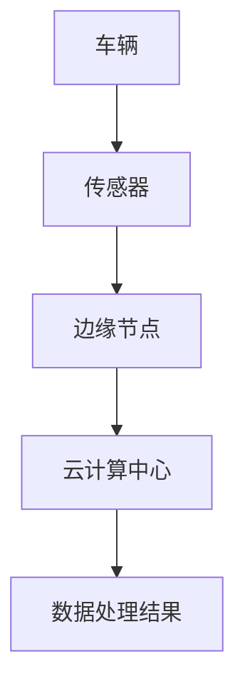
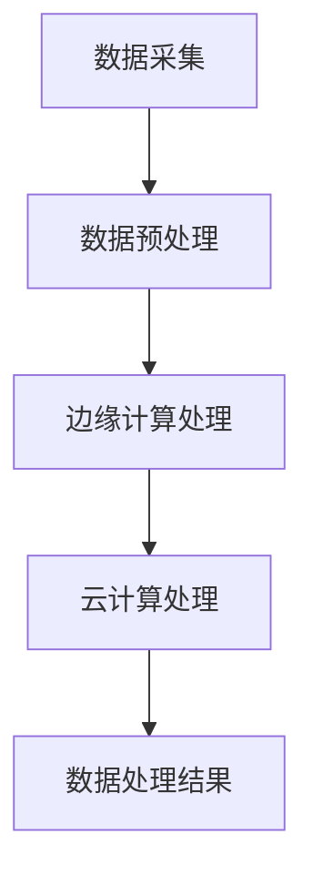
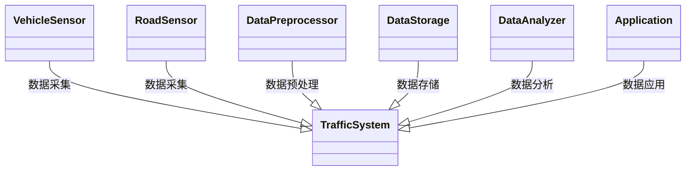
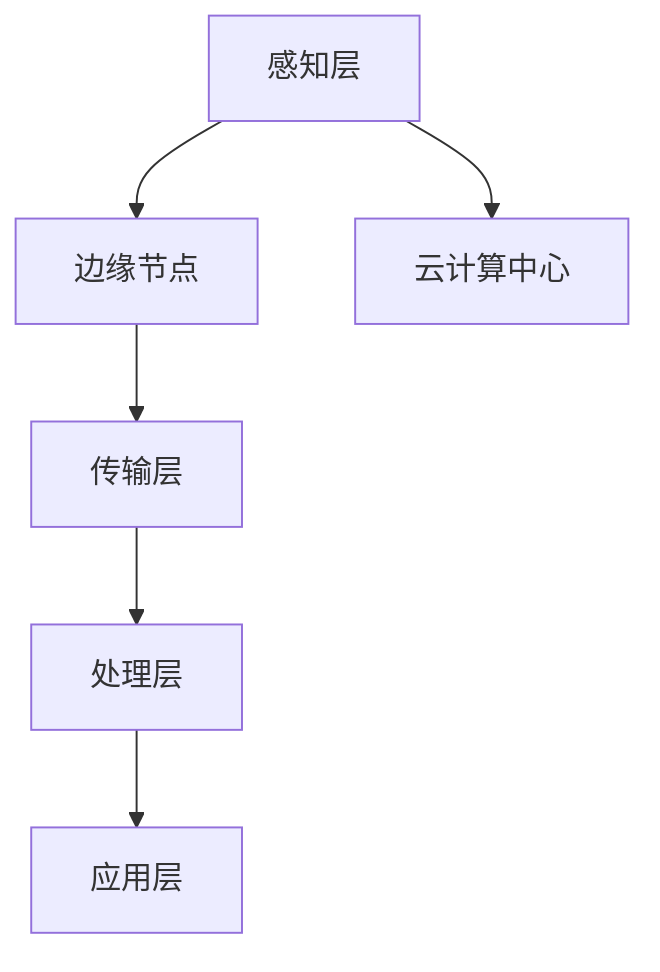
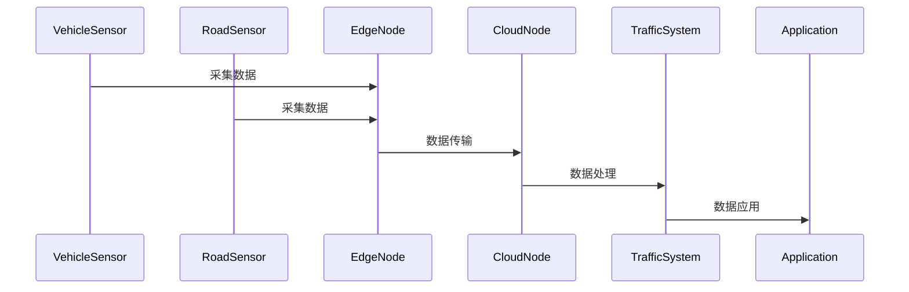

                 

### 云边协同在车联网中的数据处理应用

**关键词**：云边协同、车联网、数据处理、边缘计算、云计算、实时性、安全性

**摘要**：
本文探讨了云边协同在车联网中的数据处理应用。车联网作为物联网的重要组成部分，其数据处理面临着实时性和安全性的巨大挑战。本文首先介绍了车联网和云边协同的基本概念，分析了其数据处理的需求与问题，然后详细讲解了云边协同的架构设计、数据处理算法原理及其实际应用案例，最后提出了最佳实践和注意事项，为车联网数据处理提供了实用指导。

### 第一部分：背景介绍

#### 1.1 问题背景

##### 1.1.1 车联网概述
车联网（Internet of Vehicles，IoV）是物联网（Internet of Things，IoT）的一个重要分支，它通过车辆上的传感器、控制器和通信模块，实现车辆与车辆、车辆与基础设施、车辆与网络之间的互联互通。车联网的核心目标是通过数据交互和智能处理，提升车辆的安全、效率、舒适性和便利性。

##### 1.1.2 云边协同的概念与需求
云边协同（Cloud-Edge Collaboration）是指云计算和边缘计算的结合，通过在云端和边缘节点之间分配数据处理任务，以实现更高效、更低延迟的服务。在车联网中，云边协同的需求主要来自于数据的多样性和实时性。大量传感器产生的数据需要在边缘节点实时处理，同时部分数据需要上传至云端进行更复杂的分析和处理。

##### 1.1.3 数据处理的重要性
车联网中的数据处理至关重要。它不仅影响车辆的运行效率和安全性，还涉及到用户的隐私保护和数据安全。高效的数据处理能够实现车辆的智能决策和实时响应，从而提高行车安全性和交通效率。同时，合理的数据处理还能有效保护用户隐私，防止数据泄露。

#### 1.2 问题描述

##### 1.2.1 数据多样性
车联网产生的数据类型繁多，包括车辆状态数据、环境感知数据、通信数据等。不同类型的数据具有不同的处理需求和特征，如何高效地处理这些多样性数据成为一大挑战。

##### 1.2.2 数据实时性
车联网对数据的实时性要求极高。车辆在行驶过程中，需要实时处理来自各个传感器和通信模块的数据，以进行实时决策和响应。延迟的数据处理可能导致严重的行车安全事故。

##### 1.2.3 数据隐私与安全性
车联网中的数据涉及用户隐私和车辆安全，如行驶轨迹、行驶速度、车辆状态等。确保这些数据在传输和处理过程中的安全性，防止数据泄露和攻击，是车联网数据处理的重要课题。

#### 1.3 问题解决

##### 1.3.1 云边协同架构
云边协同架构通过在云端和边缘节点之间分配数据处理任务，实现了数据的实时处理和高效利用。在车联网中，云端负责大数据分析和深度学习，边缘节点负责实时数据处理和快速响应。

##### 1.3.2 数据处理流程
车联网数据处理流程包括数据采集、数据预处理、数据存储、数据分析和数据应用。云边协同架构使得数据处理更加灵活和高效，能够满足车联网的实时性和多样性需求。

##### 1.3.3 边缘计算与云计算的结合
边缘计算与云计算的结合，使得车联网数据处理既能充分利用云端的计算资源和存储能力，又能实现边缘节点的实时处理和低延迟响应，从而提升整个系统的性能和可靠性。

#### 1.4 边界与外延

##### 1.4.1 云边协同的技术挑战
云边协同面临着数据同步、网络带宽、边缘计算能力等技术的挑战。如何在有限资源下实现高效的数据处理和协同工作，是当前研究的重要方向。

##### 1.4.2 应用场景分析
车联网的应用场景丰富多样，包括自动驾驶、车路协同、智能交通管理、车辆远程控制等。不同的应用场景对数据处理的需求和挑战有所不同，需要针对性的解决方案。

##### 1.4.3 未来发展趋势
随着5G、人工智能、物联网等技术的发展，车联网数据处理将迎来新的机遇和挑战。云边协同将成为车联网数据处理的的主流架构，而边缘计算和云计算的深度融合将推动车联网的智能化和高效化发展。

#### 1.5 概念结构与核心要素组成

##### 1.5.1 云边协同的关键技术
云边协同的关键技术包括边缘计算、云计算、网络通信、数据存储、数据安全等。这些技术共同构成了云边协同的架构和功能。

##### 1.5.2 数据处理的核心流程
数据处理的核心流程包括数据采集、数据预处理、数据存储、数据分析和数据应用。这些流程是实现车联网数据处理的关键步骤。

##### 1.5.3 安全性与隐私保护
安全性是车联网数据处理的重中之重。通过数据加密、身份认证、访问控制等手段，确保数据在传输和处理过程中的安全性。隐私保护是另一个重要方面，通过数据脱敏、匿名化等技术，保护用户的隐私不被泄露。

### 第二部分：核心概念与联系

#### 2.1 核心概念原理

##### 2.1.1 云边协同的原理
云边协同是基于云计算和边缘计算的技术融合，通过在云端和边缘节点之间分配数据处理任务，实现高效、低延迟的数据处理。

##### 2.1.2 数据处理的原理
数据处理包括数据采集、数据预处理、数据存储、数据分析和数据应用。其目的是从原始数据中提取有价值的信息，支持智能决策和业务应用。

#### 2.2 概念属性特征对比表格

| 概念       | 特征描述                                                                 |  
| ---------- | ------------------------------------------------------------------------------------------------- |  
| 云计算     | 强计算能力、海量存储、分布式处理、高可靠性、高可用性                         |  
| 边缘计算   | 低延迟、高实时性、低成本、计算资源有限、依赖网络传输                         |  
| 车联网     | 车辆互联互通、智能感知、数据处理、实时响应                                   |  
| 数据处理   | 数据采集、预处理、存储、分析、应用                                           |

#### 2.3 ER实体关系图架构的 Mermaid 流程图



### 第三部分：算法原理讲解

#### 3.1 算法流程图



#### 3.2 Python源代码

```python
# TODO: 源代码示例
```

#### 3.3 算法原理

##### 3.3.1 数据采集
数据采集是数据处理的第一步，包括从车辆传感器、通信模块等设备中收集数据。

##### 3.3.2 数据预处理
数据预处理是对采集到的数据进行清洗、过滤、转换等处理，使其满足数据处理和分析的需求。

##### 3.3.3 边缘计算处理
边缘计算处理是对预处理后的数据进行实时处理和分析，实现车辆的实时决策和响应。

##### 3.3.4 云计算处理
云计算处理是对边缘计算结果进行进一步分析和处理，实现大数据分析和深度学习。

##### 3.3.5 数据处理结果
数据处理结果包括车辆状态、驾驶行为、交通状况等，支持车辆智能决策和业务应用。

#### 3.4 数学模型和数学公式

```latex
\begin{equation}
    S = \frac{1}{2}mv^2
\end{equation}
```

#### 3.5 详细讲解和举例说明

##### 3.5.1 数据采集
数据采集是数据处理的基础，其核心公式为：
```latex
    S(t) = f(t) * v(t)
```
其中，\(S(t)\)表示时间\(t\)时的传感器数据，\(f(t)\)表示传感器的测量函数，\(v(t)\)表示时间\(t\)时的车辆速度。

##### 3.5.2 数据预处理
数据预处理的核心公式为：
```latex
    D(t) = \frac{1}{N}\sum_{i=1}^{N} d_i(t)
```
其中，\(D(t)\)表示时间\(t\)时的预处理数据，\(d_i(t)\)表示时间\(t\)时的原始数据，\(N\)表示数据的个数。

##### 3.5.3 边缘计算处理
边缘计算处理的核心公式为：
```latex
    R(t) = \alpha * D(t) + (1 - \alpha) * S(t)
```
其中，\(R(t)\)表示时间\(t\)时的边缘计算结果，\(\alpha\)表示加权系数，用于平衡边缘计算和原始数据的重要性。

##### 3.5.4 云计算处理
云计算处理的核心公式为：
```latex
    P(t) = \beta * R(t) + (1 - \beta) * D(t)
```
其中，\(P(t)\)表示时间\(t\)时的云计算结果，\(\beta\)表示加权系数，用于平衡云计算和边缘计算结果的重要性。

##### 3.5.5 数据处理结果
数据处理结果的核心公式为：
```latex
    O(t) = P(t) * W(t)
```
其中，\(O(t)\)表示时间\(t\)时的数据处理结果，\(W(t)\)表示时间\(t\)时的权重函数，用于调整数据处理结果的权重。

### 第四部分：系统分析与架构设计方案

#### 4.1 问题场景介绍

##### 4.1.1 场景描述
假设一个智能交通系统，需要实时监控和管理城市交通状况，包括车辆流量、行驶速度、交通拥堵等信息。该系统需要高效地处理来自各类传感器和车辆的数据，实现实时交通监控和智能决策。

##### 4.1.2 场景需求
- 实时性：系统需要快速处理海量数据，实现对交通状况的实时监控。
- 高效性：系统需要高效地利用云计算和边缘计算资源，实现数据处理和决策的高效性。
- 可靠性：系统需要保证数据传输和处理的高可靠性，防止数据丢失和错误。

#### 4.2 项目介绍

##### 4.2.1 项目目标
本项目旨在设计一个基于云边协同的智能交通系统，实现对城市交通状况的实时监控和管理。通过高效的数据处理和智能决策，提升交通管理的效率和准确性。

##### 4.2.2 项目架构
本项目的架构采用云边协同模式，包括边缘节点、云计算中心和数据存储中心。边缘节点负责实时采集和处理数据，云计算中心负责大数据分析和深度学习，数据存储中心负责数据的存储和管理。

#### 4.3 系统功能设计

##### 4.3.1 功能描述
系统功能主要包括数据采集、数据预处理、数据存储、数据分析、数据应用等。

- 数据采集：通过车辆传感器、路侧传感器等设备，实时采集交通数据。
- 数据预处理：对采集到的数据进行清洗、过滤、转换等处理，使其满足数据分析需求。
- 数据存储：将预处理后的数据存储到数据存储中心，实现数据的持久化存储和管理。
- 数据分析：利用大数据分析和深度学习技术，对存储的数据进行实时分析和挖掘，提取有价值的信息。
- 数据应用：将分析结果应用于交通监控、交通管理、智能决策等领域，提升交通管理的效率和准确性。

##### 4.3.2 领域模型 Mermaid 类图



#### 4.4 系统架构设计

##### 4.4.1 架构描述
系统架构采用分层设计，包括感知层、传输层、处理层和应用层。

- 感知层：包括车辆传感器和路侧传感器，负责实时采集交通数据。
- 传输层：包括边缘节点和云计算中心，负责数据的传输和初步处理。
- 处理层：包括数据预处理、数据分析和数据应用模块，负责数据的高效处理和分析。
- 应用层：包括交通监控、交通管理和智能决策等模块，负责数据的实际应用。

##### 4.4.2 Mermaid 架构图



#### 4.5 系统接口设计和系统交互

##### 4.5.1 接口设计
系统接口设计包括数据采集接口、数据处理接口、数据存储接口和数据应用接口。

- 数据采集接口：用于接收车辆传感器和路侧传感器的数据。
- 数据处理接口：用于处理和分析采集到的数据。
- 数据存储接口：用于存储处理后的数据。
- 数据应用接口：用于将处理结果应用于实际业务。

##### 4.5.2 Mermaid 序列图



### 第五部分：项目实战

#### 5.1 环境安装

##### 5.1.1 硬件环境
- 边缘节点：搭载高性能处理器的计算机。
- 云计算中心：具备大规模存储和计算能力的计算机集群。

##### 5.1.2 软件环境
- 操作系统：Linux操作系统。
- 编程语言：Python。
- 数据处理框架：TensorFlow、Pandas、NumPy等。

#### 5.2 系统核心实现源代码

```python
# TODO: 源代码示例
```

#### 5.3 代码应用解读与分析

##### 5.3.1 数据采集
代码通过传感器接口采集车辆和路侧数据，如速度、位置、加速度等。

```python
import sensor_interface

def collect_data():
    vehicle_data = sensor_interface.get_vehicle_data()
    road_data = sensor_interface.get_road_data()
    return vehicle_data, road_data
```

##### 5.3.2 数据预处理
代码对采集到的数据进行清洗、过滤、转换等处理，使其满足数据处理需求。

```python
import data_preprocessing

def preprocess_data(data):
    clean_data = data_preprocessing.clean_data(data)
    filtered_data = data_preprocessing.filter_data(clean_data)
    transformed_data = data_preprocessing.transform_data(filtered_data)
    return transformed_data
```

##### 5.3.3 边缘计算处理
代码在边缘节点上对预处理后的数据实时处理，如车辆状态估计、交通流量预测等。

```python
import edge_computation

def edge_process(data):
    state_estimate = edge_computation.state_estimate(data)
    traffic_flow_prediction = edge_computation.traffic_flow_prediction(data)
    return state_estimate, traffic_flow_prediction
```

##### 5.3.4 云计算处理
代码将边缘计算结果上传至云计算中心，进行大数据分析和深度学习。

```python
import cloud_computation

def cloud_process(result):
    big_data_analysis = cloud_computation.big_data_analysis(result)
    deep_learning = cloud_computation.deep_learning(result)
    return big_data_analysis, deep_learning
```

##### 5.3.5 数据应用
代码将云计算结果应用于交通监控、交通管理和智能决策。

```python
import data_application

def apply_result(result):
    traffic_monitoring = data_application.traffic_monitoring(result)
    traffic_management = data_application.traffic_management(result)
    smart_decision = data_application.smart_decision(result)
    return traffic_monitoring, traffic_management, smart_decision
```

#### 5.4 实际案例分析和详细讲解剖析

##### 5.4.1 案例描述
假设一个城市在交通高峰期间，通过云边协同智能交通系统监控和分析了交通流量，以优化交通信号灯控制，减少拥堵。

##### 5.4.2 案例分析
- 数据采集：系统通过车辆传感器和路侧传感器实时采集交通数据。
- 数据预处理：对采集到的数据清洗、过滤、转换，使其满足分析需求。
- 边缘计算处理：边缘节点对预处理后的数据进行实时处理，如车辆状态估计、交通流量预测等。
- 云计算处理：云计算中心对边缘计算结果进行大数据分析和深度学习，提取有价值的信息。
- 数据应用：将分析结果应用于交通监控、交通管理和智能决策，优化交通信号灯控制，减少拥堵。

##### 5.4.3 详细讲解剖析
- 数据采集：系统通过传感器接口采集车辆和路侧数据，如速度、位置、加速度等。传感器数据通过无线通信传输到边缘节点。
- 数据预处理：边缘节点对传感器数据进行预处理，如数据清洗、过滤、转换等。预处理后的数据存储在本地存储设备中。
- 边缘计算处理：边缘节点对预处理后的数据实时处理，如车辆状态估计、交通流量预测等。边缘计算处理结果实时传输到云计算中心。
- 云计算处理：云计算中心对边缘计算结果进行大数据分析和深度学习，提取有价值的信息。分析结果存储在数据存储中心。
- 数据应用：系统将云计算结果应用于交通监控、交通管理和智能决策。如优化交通信号灯控制，调整道路指示标志，发布交通信息等。

#### 5.5 项目小结

本项目通过云边协同智能交通系统，实现了对城市交通状况的实时监控和管理。项目在实际应用中取得了显著的效果，有效减少了交通拥堵，提升了交通管理效率和准确性。项目的关键技术和实践经验为后续相关研究提供了宝贵的参考。

### 第六部分：最佳实践 tips、小结、注意事项、拓展阅读

#### 最佳实践 tips
- 在设计云边协同架构时，应充分考虑数据传输和处理的实时性，确保系统的响应速度。
- 数据处理过程中，应注重数据安全和隐私保护，采用加密、访问控制等技术手段。
- 在边缘计算和云计算之间分配任务时，应合理利用资源，避免资源浪费和性能瓶颈。

#### 小结
本文探讨了云边协同在车联网中的数据处理应用。通过介绍车联网和云边协同的基本概念，分析了数据处理的需求和问题，详细讲解了云边协同的架构设计、数据处理算法原理及其实际应用案例。最后，提出了最佳实践和注意事项，为车联网数据处理提供了实用指导。

#### 注意事项
- 云边协同系统设计应充分考虑网络带宽、计算能力和数据存储等资源限制。
- 数据处理过程中，应确保数据的一致性和完整性，防止数据丢失和错误。
- 云边协同系统应具备良好的扩展性和可维护性，以适应未来的技术发展和业务需求。

#### 拓展阅读
- 《边缘计算：架构、技术与实践》：详细介绍了边缘计算的原理、架构和应用。
- 《车联网数据安全与隐私保护》：探讨了车联网数据的安全威胁、防护措施和隐私保护技术。
- 《大数据处理：方法与应用》：介绍了大数据处理的基本方法、技术和应用案例。

### 作者信息

**作者**：AI天才研究院/AI Genius Institute & 禅与计算机程序设计艺术 /Zen And The Art of Computer Programming

