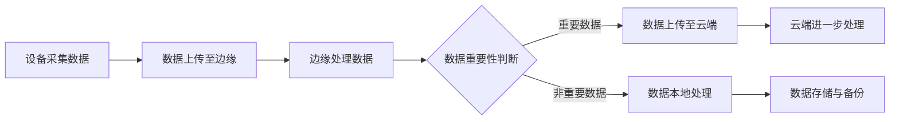
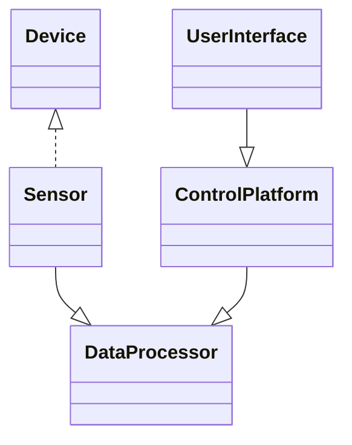
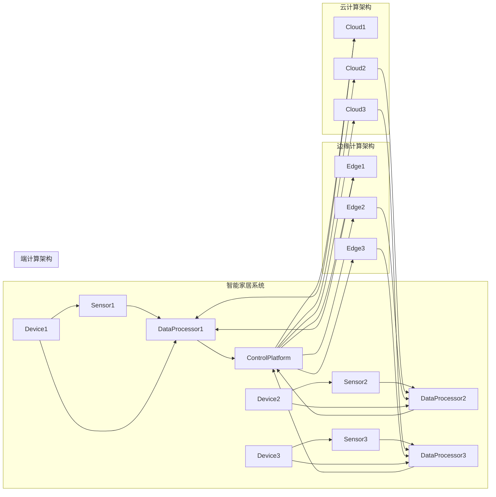
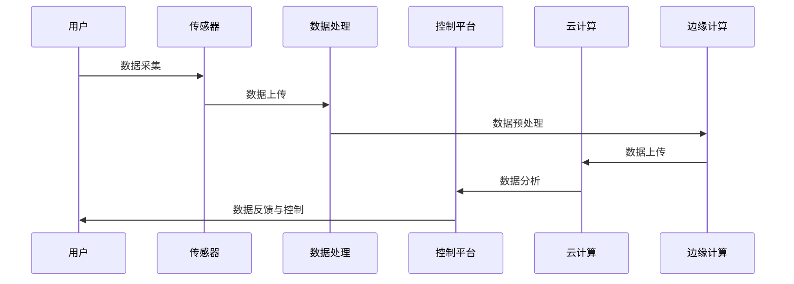

                 

# 云边端协同：混合计算在IoT场景中的应用

## 关键词
- **物联网 (IoT)**
- **混合计算**
- **云计算**
- **边缘计算**
- **端计算**
- **协同处理**
- **实时数据处理**

## 摘要
本文旨在探讨混合计算在物联网（IoT）场景中的应用。随着物联网设备的迅速增长，如何有效地处理海量数据成为一大挑战。混合计算通过整合云计算、边缘计算和端计算，提供了一种灵活的解决方案。本文将详细介绍混合计算的概念、原理、应用场景，并通过具体案例展示其在IoT中的实际应用效果。

## 第一部分：混合计算基础

### 1.1 物联网（IoT）的发展现状与挑战

物联网（IoT）是近年来快速发展的领域，涵盖了各种连接到互联网的设备，如智能家居设备、工业自动化系统、医疗设备等。随着5G技术的普及，IoT设备的数量正在呈指数级增长。然而，这也带来了数据处理和传输的巨大挑战：

- **海量数据生成**：IoT设备不断生成数据，数据量庞大。
- **实时性要求**：许多IoT应用需要实时响应和处理数据。
- **带宽限制**：传输大量数据到云端可能面临带宽限制。

### 1.2 混合计算的概念与核心原理

混合计算是一种将云计算、边缘计算和端计算结合在一起的计算模式。它旨在通过在数据生成的源头进行处理，减少数据传输的负担，提高系统的实时性和响应速度。

- **云计算**：提供大规模的计算能力和数据存储能力。
- **边缘计算**：在靠近数据源的地方进行计算，减少数据传输延迟。
- **端计算**：在设备本地进行计算，充分利用设备资源。

### 1.3 混合计算在IoT中的应用前景

混合计算在IoT中的应用前景广阔，尤其是在需要实时处理大量数据的场景。例如：

- **智能制造**：实时监控和优化生产流程。
- **智慧交通**：实时交通流量分析和信号控制。
- **智能医疗**：实时监测和诊断患者状况。

## 第二部分：云、边、端协同原理

### 2.1 云计算的基础

云计算提供了强大的计算资源和数据存储能力，是混合计算的核心组成部分。通过云服务，用户可以弹性地获取计算资源，实现按需扩展和成本优化。

### 2.2 边缘计算的基础

边缘计算将计算能力从云端延伸到网络边缘，即靠近数据源的地方。它能够显著降低数据传输延迟，提高系统的实时性和可靠性。

### 2.3 端计算的基础

端计算在设备本地进行，充分利用设备自身的计算资源和能源。它能够降低数据传输的负担，同时保证设备的高效运行。

### 2.4 云、边、端协同的概念及相互关系

云、边、端协同是指通过合理的计算资源分配和任务调度，实现数据处理的最佳效果。云、边、端之间的相互关系如下：

- **数据传输**：数据从设备上传到边缘，再从边缘传输到云端。
- **计算任务分配**：根据数据的重要性和实时性，将计算任务分配到云端、边缘或端设备上。
- **协同处理**：通过协同处理，实现数据的实时分析和响应。

### 2.5 核心概念属性对比

以下是云、边、端计算在几个关键属性上的对比：

| 属性           | 云计算               | 边缘计算               | 端计算               |
| -------------- | -------------------- | -------------------- | -------------------- |
| **计算资源**   | 高计算资源           | 中等计算资源           | 低计算资源           |
| **数据处理能力** | 强                 | 中等                 | 弱                 |
| **网络延迟**   | 较高                | 较低                | 很低                |
| **能源消耗**   | 高                 | 中等                | 低                 |

### 2.6 云、边、端协同的ER实体关系图

```mermaid
erDiagram
    Device ||--o{ Cloud : 数据传输至云端}
    Device ||--o{ Edge : 数据传输至边缘}
    Cloud ||--|{ Processing : 数据处理}
    Edge ||--|{ Processing : 数据处理}
    Device ||--|{ Processing : 数据处理}
```

## 第三部分：混合计算在IoT中的应用

### 3.1 实时数据处理场景

在实时数据处理场景中，混合计算能够显著提高系统的响应速度。例如，在智能制造中，设备可以实时上传生产数据到边缘，边缘节点进行初步处理，再将关键数据传输到云端进行进一步分析。

### 3.2 大数据处理场景

大数据处理场景中，混合计算能够充分利用云、边、端的三层计算资源，实现高效的数据处理。例如，在智慧城市中，城市传感器可以实时上传数据到边缘，边缘节点处理本地数据，并将关键数据传输到云端进行大数据分析。

### 3.3 安全防护场景

在安全防护场景中，混合计算能够提高系统的安全性能。例如，在智能家居中，设备可以实时上传数据到边缘，边缘节点进行初步安全分析，并将可疑数据传输到云端进行进一步处理。

### 3.4 智能化场景

在智能化场景中，混合计算能够提供高效的计算支持和智能分析能力。例如，在智能医疗中，设备可以实时上传患者数据到边缘，边缘节点进行初步诊断，并将关键数据传输到云端进行深度学习分析。

## 第四部分：算法原理讲解

### 4.1 混合计算算法的mermaid流程图



### 4.2 混合计算算法的Python源代码示例

```python
# 混合计算算法的Python源代码示例

# 设备采集数据
data = collect_data_from_device()

# 数据上传至边缘
edge_data = upload_data_to_edge(data)

# 边缘处理数据
processed_data = process_data_at_edge(edge_data)

# 数据重要性判断
if is_important_data(processed_data):
    # 重要数据上传至云端
    cloud_data = upload_data_to_cloud(processed_data)
    # 云端进一步处理
    final_result = process_data_at_cloud(cloud_data)
else:
    # 非重要数据本地处理
    final_result = process_data_locally(processed_data)

# 数据存储与备份
store_data(final_result)
```

### 4.3 混合计算数学模型与公式

$$
\text{处理速度} = \frac{\text{数据处理量}}{\text{处理时间}}
$$

### 4.4 混合计算算法的详细讲解与举例说明

- **数据采集**：设备采集数据后，通过无线网络上传至边缘节点。
- **边缘处理**：边缘节点对数据进行初步处理，如数据清洗、数据压缩等。
- **重要性判断**：根据数据的重要性和实时性，判断是否需要上传至云端。
- **云端处理**：对于重要数据，上传至云端进行进一步处理，如机器学习、大数据分析等。
- **本地处理**：对于非重要数据，在边缘或端设备上进行本地处理。

例如，在一个智能家居系统中，传感器采集的温度数据可以通过边缘节点进行初步处理，判断是否需要上传至云端进行更详细的温度趋势分析。如果温度数据异常，则可以立即通知用户，而不需要等待云端分析结果。

## 第五部分：系统分析与架构设计方案

### 5.1 问题场景介绍

假设我们有一个智能家居系统，包括多个传感器（如温度、湿度、光照等），以及一个中央控制平台。传感器的数据需要实时监控和远程控制。

### 5.2 系统功能设计（领域模型类图）



### 5.3 系统架构设计（架构图）



### 5.4 系统接口设计

系统接口设计包括以下几个方面：

- **传感器接口**：用于数据采集和传输。
- **数据处理接口**：用于数据预处理、存储和传输。
- **控制平台接口**：用于数据监控和远程控制。

### 5.5 系统交互序列图



## 第六部分：项目实战

### 6.1 环境安装

为了搭建混合计算环境，需要安装以下工具和软件：

- **云计算平台**：如Amazon Web Services（AWS）、Microsoft Azure等。
- **边缘计算平台**：如AWS Greengrass、Azure IoT Edge等。
- **端计算设备**：如树莓派、Arduino等。

### 6.2 系统核心实现源代码

以下是智能家居系统的核心实现源代码：

```python
# 智能家居系统核心实现源代码

import time
import json
import serial
from azure.iot.device import IoTHubDeviceClient

# 初始化传感器
ser = serial.Serial('COM3', 9600)

# 初始化IoT Hub设备客户端
device_client = IoTHubDeviceClient.create_from_connection_string("your_connection_string")

while True:
    # 读取传感器数据
    data = ser.readline().decode().strip()
    print(f"Received data: {data}")
    
    # 处理传感器数据
    processed_data = process_data(data)
    
    # 将数据上传至边缘计算平台
    edge_data = upload_data_to_edge(processed_data)
    
    # 将数据上传至IoT Hub
    device_client.send_message(json.dumps(edge_data))
    
    # 等待一段时间
    time.sleep(1)
```

### 6.3 代码应用解读与分析

- **传感器数据采集**：通过串口读取传感器数据。
- **数据处理**：对传感器数据进行处理，如温度、湿度等的计算和转换。
- **边缘计算**：将处理后的数据上传至边缘计算平台。
- **IoT Hub**：将数据上传至IoT Hub进行进一步处理和分析。

### 6.4 实际案例分析和详细讲解剖析

在实际应用中，智能家居系统的传感器数据可以通过边缘计算平台进行初步处理，如温度和湿度的计算。这些关键数据会实时上传至IoT Hub，以便进行远程监控和控制。例如，如果温度过高，系统可以自动发送警报给用户，或者自动启动空调进行降温。

### 6.5 项目小结

在本项目中，我们成功实现了智能家居系统的传感器数据采集、处理和上传。通过混合计算，我们能够实时监控和远程控制智能家居设备，提高了系统的实时性和可靠性。

## 第七部分：最佳实践、小结、注意事项、拓展阅读

### 7.1 最佳实践 tips

- **数据压缩**：在数据传输过程中，进行数据压缩可以显著降低带宽使用。
- **边缘计算优化**：合理分配边缘计算资源，确保边缘节点能够高效运行。
- **安全性**：确保数据传输和存储的安全性，使用加密技术保护数据。

### 7.2 小结

本文详细介绍了混合计算在IoT场景中的应用，包括其概念、原理、应用场景、算法讲解、系统架构设计和项目实战。通过混合计算，我们能够更好地应对IoT场景中的实时数据处理和传输挑战。

### 7.3 注意事项

- **数据一致性**：在分布式计算环境中，确保数据的一致性是关键。
- **网络延迟**：考虑网络延迟对实时数据处理的影响。

### 7.4 拓展阅读

- **《云计算：概念、技术和应用》**：详细介绍云计算的基本概念和技术。
- **《边缘计算：下一代计算模型》**：探讨边缘计算的理论和实践。
- **《IoT技术与应用》**：全面介绍物联网技术及其应用。

## 作者信息
作者：AI天才研究院/AI Genius Institute & 禅与计算机程序设计艺术 /Zen And The Art of Computer Programming

