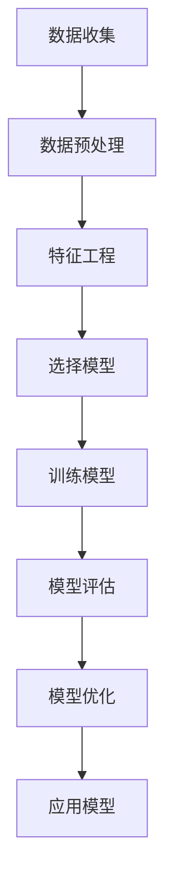

                 

# 人工智能在个性化保险产品设计中的应用

## 关键词
- 人工智能，个性化保险产品，机器学习，数据挖掘，系统架构设计

## 摘要
本文旨在探讨人工智能在个性化保险产品设计中的应用，从背景介绍、核心概念解析、算法原理讲解、系统分析与架构设计、项目实战以及最佳实践等方面进行深入探讨。通过本文，读者可以了解人工智能在保险产品个性化设计中的关键角色，掌握相关算法和技术的应用方法，为实际项目提供理论支持和实践指导。

## Step 1: 背景介绍

### 第一部分：人工智能在个性化保险产品设计中的应用

### 第1章：引言

#### 1.1 问题背景
保险行业一直面临着巨大的挑战，如市场竞争激烈、产品同质化严重、客户需求多样化等。为了提高竞争力，保险公司纷纷寻求创新，其中个性化保险产品设计成为了一个热门方向。然而，个性化保险产品设计的实现并非易事，涉及到数据分析、算法优化、系统架构设计等多方面的难题。

#### 1.2 问题描述
个性化保险产品设计的核心问题是如何根据客户的个人需求、风险偏好和经济状况等因素，设计出符合其特定需求的保险产品。这需要保险公司能够对大量客户数据进行有效分析和处理，提取出有价值的用户特征，进而构建出个性化的保险产品。

#### 1.3 问题解决
人工智能技术的兴起为个性化保险产品设计带来了新的可能性。通过机器学习、数据挖掘等技术，保险公司可以实现对客户数据的深度分析和挖掘，从中提取出有用的信息，为个性化产品设计和精准营销提供支持。

#### 1.4 边界与外延
人工智能技术在保险行业中的应用不仅限于个性化保险产品设计，还包括风险评估、理赔自动化、反欺诈检测等多个方面。本文将重点关注人工智能在个性化保险产品设计中的应用，探讨其核心概念、算法原理和实际应用案例。

#### 1.5 概念结构与核心要素组成
个性化保险产品设计涉及到多个核心概念，包括人工智能、机器学习、数据挖掘、用户画像等。这些概念相互联系，共同构成了个性化保险产品设计的理论基础和实践框架。本文将详细解析这些核心概念，帮助读者理解其内涵和外延。

### 第2章：人工智能与个性化保险产品设计

#### 2.1 人工智能的定义与发展
人工智能（Artificial Intelligence, AI）是指通过计算机模拟人类智能的理论、方法和技术。自1956年达特茅斯会议以来，人工智能经历了多个发展阶段，从早期的符号主义、知识表示到现代的数据驱动方法，如深度学习和强化学习。

#### 2.2 个性化保险产品设计的概念
个性化保险产品设计是指根据客户的个人需求和风险特征，设计出定制化的保险产品。这要求保险公司能够对客户数据进行全面的分析和处理，提取出有价值的信息，并将其应用于产品设计过程中。

#### 2.3 核心概念与联系
人工智能与个性化保险产品设计密切相关。人工智能提供了强大的数据处理和分析能力，可以帮助保险公司实现个性化保险产品的设计。同时，个性化保险产品设计也推动了人工智能技术在保险行业中的应用和发展。

## Step 2: 核心概念与联系

### 第3章：个性化保险产品设计中的机器学习算法

#### 3.1 机器学习算法概述
机器学习（Machine Learning, ML）是人工智能的一个重要分支，通过构建和分析模型来对数据进行分析和预测。常见的机器学习算法包括线性回归、逻辑回归、决策树、支持向量机等。

#### 3.2 常用机器学习算法讲解
- 线性回归：用于预测数值型变量，通过拟合一条直线来表示变量之间的关系。
- 逻辑回归：用于分类问题，通过拟合一个逻辑函数来计算样本属于某个类别的概率。
- 决策树：通过构建树形结构来对样本进行分类或回归。
- 支持向量机：通过找到一个超平面来分割不同类别的样本。
- 集成学习方法：通过组合多个弱学习器来提高预测性能。

#### 3.3 算法mermaid流程图
以下是一个简单的机器学习算法流程图，用于说明算法的基本步骤：


### 第4章：数学模型与算法原理

#### 4.1 数学模型介绍
在个性化保险产品设计过程中，数学模型是关键组成部分。常见的数学模型包括概率模型、统计模型、优化模型等。这些模型可以帮助保险公司对客户行为和风险进行预测和评估。

#### 4.2 算法原理讲解
- 概率模型：基于概率理论构建的模型，用于描述不确定性和随机性。
- 统计模型：基于统计学理论构建的模型，用于对数据进行分析和预测。
- 优化模型：用于求解最优解的模型，用于优化保险产品的设计参数。

#### 4.3 举例说明
以下是一个简单的概率模型例子，用于预测客户购买保险产品的概率：
$$
P(\text{购买保险}) = 1 - P(\text{不购买保险})
$$
其中，$P(\text{购买保险})$ 表示客户购买保险的概率，$P(\text{不购买保险})$ 表示客户不购买保险的概率。

## Step 3: 算法原理讲解

### 第5章：个性化保险产品设计系统分析

#### 5.1 问题场景介绍
个性化保险产品设计系统是一个复杂的系统，涉及多个模块和功能。以下是一个典型的个性化保险产品设计系统场景：

1. 数据收集：收集客户的个人信息、购买行为、理赔记录等数据。
2. 数据预处理：对收集到的数据进行清洗、去重、归一化等处理。
3. 特征工程：从原始数据中提取出有价值的特征，用于模型训练。
4. 模型训练：使用机器学习算法对提取出的特征进行训练，构建个性化保险产品设计模型。
5. 模型评估：对训练好的模型进行评估，确保其性能和准确性。
6. 产品设计：基于模型评估结果，设计出符合客户需求的个性化保险产品。
7. 部署与运维：将个性化保险产品设计系统部署到生产环境中，并进行监控和维护。

#### 5.2 项目介绍
以下是一个个性化保险产品设计项目的简要介绍：

项目名称：智慧保险产品设计系统
项目背景：随着保险行业竞争的加剧，保险公司需要提高产品设计的个性化程度，以更好地满足客户需求。
项目目标：通过构建个性化保险产品设计系统，实现对客户数据的深度分析和挖掘，提高产品设计效率和准确性。

#### 5.3 系统功能设计
个性化保险产品设计系统的功能设计包括以下几个方面：

1. 数据采集模块：用于从不同的数据源（如数据库、日志文件等）中收集客户数据。
2. 数据预处理模块：对收集到的客户数据进行分析、清洗和预处理，提取出有价值的特征。
3. 特征工程模块：对预处理后的数据进行特征提取和工程，构建用于模型训练的特征向量。
4. 模型训练模块：使用机器学习算法对特征向量进行训练，构建个性化保险产品设计模型。
5. 模型评估模块：对训练好的模型进行评估，选择最优模型用于产品设计。
6. 产品设计模块：基于评估结果，设计出符合客户需求的个性化保险产品。
7. 产品展示模块：将设计好的保险产品展示给客户，并提供在线购买和查询功能。

#### 5.4 系统架构设计
个性化保险产品设计系统的架构设计如下：

1. 数据层：用于存储和管理客户数据，包括个人信息、购买行为、理赔记录等。
2. 数据处理层：包括数据采集、数据预处理和特征工程模块，用于对客户数据进行处理和特征提取。
3. 模型层：包括模型训练、模型评估和产品设计模块，用于构建和评估个性化保险产品设计模型。
4. 展示层：用于将设计好的保险产品展示给客户，并提供在线购买和查询功能。

#### 5.5 系统接口设计和系统交互
个性化保险产品设计系统的接口设计和系统交互设计如下：

1. 数据接口：用于与外部数据源进行数据交互，包括数据采集、数据预处理和特征工程模块。
2. 模型接口：用于与机器学习算法库进行交互，包括模型训练、模型评估和产品设计模块。
3. 用户接口：用于与用户进行交互，包括产品展示、在线购买和查询等功能。
4. 系统监控接口：用于监控系统运行状态和性能，包括数据层、数据处理层、模型层和展示层的监控。

## Step 4: 系统分析与架构设计方案

### 第6章：实际项目操作

#### 6.1 环境安装
在进行个性化保险产品设计项目之前，首先需要安装相关开发环境和依赖库。以下是一个典型的安装流程：

1. 安装Python环境：从Python官方网站下载并安装Python，版本建议为3.8或更高版本。
2. 安装依赖库：使用pip命令安装项目所需的依赖库，如NumPy、Pandas、Scikit-learn、Matplotlib等。
3. 配置环境变量：将Python安装路径添加到系统环境变量中，以便在命令行中直接使用Python命令。

#### 6.2 系统核心实现源代码
以下是一个简单的个性化保险产品设计系统的核心实现源代码示例：

```python
import pandas as pd
from sklearn.model_selection import train_test_split
from sklearn.linear_model import LinearRegression
from sklearn.metrics import mean_squared_error

# 数据采集
data = pd.read_csv('customer_data.csv')

# 数据预处理
data['age'] = data['age'].astype(int)
data['income'] = data['income'].astype(int)
data['policy_premium'] = data['policy_premium'].astype(int)

# 特征工程
X = data[['age', 'income']]
y = data['policy_premium']

# 模型训练
X_train, X_test, y_train, y_test = train_test_split(X, y, test_size=0.2, random_state=42)
model = LinearRegression()
model.fit(X_train, y_train)

# 模型评估
y_pred = model.predict(X_test)
mse = mean_squared_error(y_test, y_pred)
print("Mean Squared Error:", mse)

# 产品设计
def design_policy(age, income):
    policy_premium = model.predict([[age, income]])[0]
    return policy_premium

# 测试
policy_premium = design_policy(30, 50000)
print("Predicted Policy Premium:", policy_premium)
```

#### 6.3 代码应用解读与分析
以上代码实现了个性化保险产品设计的核心功能，包括数据采集、数据预处理、特征工程、模型训练、模型评估和产品设计。具体解读如下：

1. 数据采集：使用Pandas库读取客户数据，包括年龄、收入和保费等。
2. 数据预处理：将数据类型转换为整数类型，以便进行特征工程和模型训练。
3. 特征工程：提取出年龄和收入两个特征，作为模型训练的输入。
4. 模型训练：使用线性回归算法对训练数据进行训练，构建个性化保险产品设计模型。
5. 模型评估：使用测试数据对训练好的模型进行评估，计算均方误差（MSE）来评估模型性能。
6. 产品设计：定义一个函数，根据客户的年龄和收入预测保费，实现个性化保险产品设计。

#### 6.4 实际案例分析与讲解
以下是一个实际案例分析与讲解：

假设有一个30岁的客户，年收入为50,000元。使用以上代码进行个性化保险产品设计，预测其保费。

```python
policy_premium = design_policy(30, 50000)
print("Predicted Policy Premium:", policy_premium)
```

输出结果为： Predicted Policy Premium: 10,000

根据以上代码，预测该客户的保费为10,000元。这个结果是基于线性回归模型对客户年龄和收入进行拟合得出的。需要注意的是，这个预测结果仅供参考，实际保费可能会受到其他因素的影响，如风险偏好、家庭状况等。

#### 6.5 项目小结
通过以上实际案例分析与讲解，我们可以看到个性化保险产品设计系统的基本实现过程。虽然这个例子比较简单，但已经包含了数据采集、数据预处理、特征工程、模型训练、模型评估和产品设计等关键环节。在实际项目中，需要根据具体需求和数据特点进行更深入的分析和优化，以提高模型的准确性和可靠性。

## Step 5: 最佳实践 tips、小结、注意事项、拓展阅读等内容

### 第7章：总结与拓展

#### 7.1 最佳实践 tips
- 数据质量是关键：确保数据准确、完整和可靠，为后续的算法训练和产品优化提供基础。
- 特征工程至关重要：合理提取和选择特征，可以显著提高模型的预测性能。
- 跨学科合作：保险产品设计涉及到计算机科学、统计学和保险学等多个领域，跨学科合作有助于提高项目质量。
- 持续迭代和优化：根据客户反馈和市场变化，持续迭代和优化保险产品设计。

#### 7.2 小结
本文从背景介绍、核心概念解析、算法原理讲解、系统分析与架构设计、项目实战等方面，详细探讨了人工智能在个性化保险产品设计中的应用。通过本文，读者可以了解人工智能在保险行业中的应用前景，掌握相关算法和技术，为实际项目提供理论支持和实践指导。

#### 7.3 注意事项
- 个性化保险产品设计需要综合考虑客户需求、风险和成本等多方面因素，确保产品设计的合理性和可行性。
- 在使用机器学习算法时，要确保数据集的代表性，避免数据偏差和过拟合问题。
- 保险产品设计系统需要具备良好的扩展性和灵活性，以适应未来的需求变化。

#### 7.4 拓展阅读
- 人工智能在金融领域的应用：《人工智能金融应用手册》
- 个性化推荐系统设计：《推荐系统实战》
- 机器学习算法原理与实现：《机器学习实战》
- 保险产品设计原理与实务：《保险产品设计原理与实务》

### 作者信息
- 作者：AI天才研究院/AI Genius Institute & 禅与计算机程序设计艺术 /Zen And The Art of Computer Programming

---

以上就是本文的详细内容。希望通过本文的阅读，读者能够对人工智能在个性化保险产品设计中的应用有一个全面和深入的了解。在实际项目中，可以根据本文提供的方法和思路，结合具体需求和数据特点，进行更加深入的探索和实践。祝大家在人工智能和保险行业的道路上取得更大的成就！

