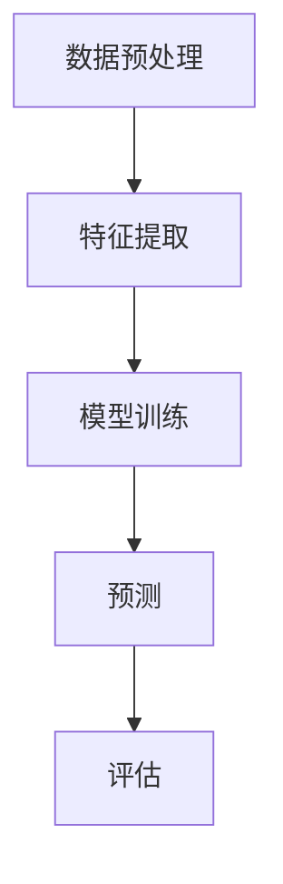
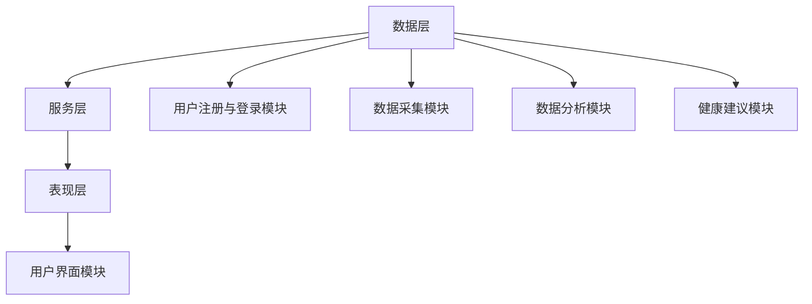

                 

### 文章标题

# 人工智能在个性化健康管理中的应用：定制化健康建议

> 关键词：人工智能，个性化健康管理，定制化健康建议，数据挖掘，机器学习，深度学习，系统架构设计

> 摘要：随着人工智能技术的不断发展，个性化健康管理逐渐成为现代医疗领域的重要趋势。本文将探讨人工智能在个性化健康管理中的应用，尤其是如何通过定制化健康建议来提升个人健康水平。本文将分四个部分进行阐述：第一部分介绍个性化健康管理的现状与挑战；第二部分讲解核心概念与联系；第三部分深入分析算法原理与系统架构设计；第四部分分享最佳实践与未来展望。

----------------------------------------------------------------

### 目录大纲

#### 第一部分：问题背景与概述

1. 第1章：个性化健康管理的现状与挑战
   1.1.1 个性化健康管理的定义与意义
   1.1.2 个性化健康管理的发展历程
   1.1.3 人工智能在健康管理中的应用现状
   1.1.4 人工智能在个性化健康管理中的潜在优势

2. 第2章：核心概念与联系
   2.1 人工智能基础知识
   2.2 健康管理核心概念
   2.3 人工智能与健康管理的关系
   2.4 个性化健康管理中的关键技术

3. 第3章：数学模型和公式
   3.1 个性化健康管理中的常见数学模型
   3.2 数学公式与详细讲解
   3.3 数学模型在实际应用中的举例说明

#### 第二部分：算法原理与讲解

4. 第4章：算法原理讲解
   4.1 数据预处理与特征提取
   4.2 机器学习算法概述
   4.3 深度学习算法介绍
   4.4 算法原理与Mermaid流程图

5. 第5章：Python源代码与算法实现
   5.1 环境安装与配置
   5.2 代码实现与详细解读
   5.3 算法参数调优与评估

#### 第三部分：系统架构与设计

6. 第6章：系统分析与架构设计
   6.1 个性化健康管理系统的需求分析
   6.2 系统功能设计
   6.3 系统架构设计
   6.4 系统接口设计与交互

7. 第7章：项目实战
   7.1 项目介绍
   7.2 系统核心实现
   7.3 实际案例分析与讲解
   7.4 项目小结

#### 第四部分：最佳实践与拓展

8. 第8章：最佳实践与技巧
   8.1 个性化健康管理的最佳实践
   8.2 定制化健康建议的实施策略
   8.3 数据隐私保护与伦理问题

9. 第9章：小结与展望
   9.1 书籍内容小结
   9.2 个性化健康管理的未来展望
   9.3 拓展阅读与资源推荐

----------------------------------------------------------------

## 第一部分：问题背景与概述

### 第1章：个性化健康管理的现状与挑战

#### 1.1.1 个性化健康管理的定义与意义

个性化健康管理是指利用大数据、人工智能等先进技术，根据个体的生物特征、生活方式、健康状况等多维数据进行定制化分析，提供个性化的健康服务和建议。这种模式不仅关注疾病的诊断和治疗，更强调疾病的预防、健康促进和全程健康管理。

个性化健康管理的意义在于：

1. 提高医疗资源的利用效率：通过精准的健康评估和个性化服务，减少不必要的医疗检查和资源浪费。
2. 优化患者体验：提供个性化的健康建议，帮助患者更好地管理自己的健康状况，提升健康水平和生活质量。
3. 促进医疗服务模式的转变：从传统的疾病治疗向健康管理转变，实现预防为主、治疗为辅的医疗服务模式。

#### 1.1.2 个性化健康管理的发展历程

个性化健康管理的发展历程可以分为以下几个阶段：

1. **传统健康管理阶段**：以生活方式干预和健康教育为主，强调个体健康意识培养。
2. **数据驱动健康管理阶段**：随着传感器技术和大数据技术的发展，个体健康数据开始被广泛应用于健康管理中。
3. **人工智能健康管理阶段**：人工智能技术的引入，使得个性化健康管理的精准性和效率得到显著提升。

#### 1.1.3 人工智能在健康管理中的应用现状

目前，人工智能在健康管理中的应用已经相当广泛，主要包括以下几个方面：

1. **疾病预测和诊断**：通过分析患者的历史数据和实时数据，利用机器学习算法进行疾病预测和诊断。
2. **个性化健康建议**：根据个体的健康数据和偏好，提供个性化的饮食、运动、用药等健康建议。
3. **健康风险评估**：利用大数据和人工智能技术，对个体的健康风险进行评估，并提供预防措施。

#### 1.1.4 人工智能在个性化健康管理中的潜在优势

人工智能在个性化健康管理中具有以下潜在优势：

1. **数据挖掘与分析能力**：人工智能可以高效地处理和分析大量健康数据，发现潜在的健康问题。
2. **精准性和个性化**：通过深度学习和个性化算法，可以提供更加精准和个性化的健康建议。
3. **实时性和可扩展性**：人工智能系统可以实时更新健康数据，并根据新数据调整健康建议，具有较好的可扩展性。

### 第2章：核心概念与联系

#### 2.1 人工智能基础知识

人工智能（Artificial Intelligence，简称AI）是指通过计算机模拟人类智能的技术和理论。它包括机器学习、自然语言处理、计算机视觉等多个领域。在个性化健康管理中，人工智能主要用于数据分析和模式识别。

#### 2.2 健康管理核心概念

健康管理是指通过一系列健康干预措施，提高个体和群体的健康水平。核心概念包括健康评估、健康干预、健康监测和健康促进等。

#### 2.3 人工智能与健康管理的关系

人工智能与健康管理的关系可以概括为以下几点：

1. **数据驱动的健康管理**：人工智能可以高效地处理和分析健康数据，为健康管理提供数据支持。
2. **精准化和个性化的健康管理**：人工智能技术可以帮助制定更加精准和个性化的健康干预措施。
3. **健康监测与疾病预防**：通过实时健康监测和疾病预测，人工智能有助于实现疾病的早发现、早预防、早治疗。

#### 2.4 个性化健康管理中的关键技术

个性化健康管理中的关键技术主要包括：

1. **数据挖掘与机器学习**：通过数据挖掘和机器学习算法，对健康数据进行深度分析，发现潜在的健康问题和趋势。
2. **深度学习与神经网络**：利用深度学习和神经网络技术，构建复杂的健康预测模型和诊断系统。
3. **自然语言处理与语音识别**：通过自然语言处理和语音识别技术，实现健康数据的自动采集和解读，提升健康管理效率。

### 第3章：数学模型和公式

#### 3.1 个性化健康管理中的常见数学模型

个性化健康管理中常用的数学模型包括线性回归、逻辑回归、支持向量机、决策树、随机森林等。这些模型主要用于疾病预测、风险评估和健康建议等方面。

#### 3.2 数学公式与详细讲解

以下是一些个性化健康管理中常用的数学公式及其详细讲解：

$$
y = \beta_0 + \beta_1 x_1 + \beta_2 x_2 + ... + \beta_n x_n
$$

- **线性回归模型**：用于预测因变量$y$与自变量$x_1, x_2, ..., x_n$之间的线性关系。
- **逻辑回归模型**：用于预测二元响应变量的概率，常用于疾病风险评估。

$$
\begin{aligned}
\hat{y} &= \frac{1}{1 + e^{-(\beta_0 + \beta_1 x_1 + \beta_2 x_2 + ... + \beta_n x_n)}) \\
P(y=1) &= \hat{y} \\
P(y=0) &= 1 - \hat{y}
\end{aligned}
$$

- **支持向量机**：用于分类问题，通过找到一个最优的超平面，使得不同类别的数据点在超平面的两侧。
- **决策树**：通过一系列的决策规则，对数据进行分层，以实现分类或回归。

#### 3.3 数学模型在实际应用中的举例说明

以下是一个简单的个性化健康建议的应用示例：

- **问题**：根据某人的体重、身高、年龄和运动习惯，预测其未来五年的体重变化。
- **模型**：使用线性回归模型。
- **输入特征**：体重（$x_1$）、身高（$x_2$）、年龄（$x_3$）、运动习惯（$x_4$）。
- **输出目标**：五年后的体重（$y$）。

通过收集相关数据并训练线性回归模型，可以得到如下预测公式：

$$
y = \beta_0 + \beta_1 x_1 + \beta_2 x_2 + \beta_3 x_3 + \beta_4 x_4
$$

输入某人的具体数据，即可预测其五年后的体重，并据此给出个性化的健康建议。

----------------------------------------------------------------

## 第二部分：算法原理与讲解

### 第4章：算法原理讲解

#### 4.1 数据预处理与特征提取

数据预处理是机器学习过程中至关重要的一步，它包括数据清洗、数据归一化、数据降维等。特征提取则是从原始数据中提取出对模型训练和预测有用的特征。

在个性化健康管理中，数据预处理和特征提取的步骤如下：

1. **数据清洗**：去除数据中的噪声和异常值，如缺失值、重复值等。
2. **数据归一化**：将不同量纲的数据转换为同一量纲，以避免模型训练过程中出现偏差。
3. **数据降维**：通过主成分分析（PCA）等方法，减少数据的维度，提高模型训练效率。

#### 4.2 机器学习算法概述

机器学习算法是人工智能的核心技术之一，它通过从数据中学习规律和模式，实现对未知数据的预测和分类。在个性化健康管理中，常用的机器学习算法包括线性回归、逻辑回归、支持向量机、决策树、随机森林等。

- **线性回归**：用于预测连续值变量，如体重变化。
- **逻辑回归**：用于预测二元响应变量的概率，如疾病发生的概率。
- **支持向量机**：用于分类问题，如疾病分类。
- **决策树**：用于分类和回归问题，如疾病诊断和预测。
- **随机森林**：通过构建多个决策树，提高模型的预测准确性和稳定性。

#### 4.3 深度学习算法介绍

深度学习是机器学习的一个分支，它通过多层神经网络来模拟人脑的神经结构，实现对复杂模式的识别和学习。在个性化健康管理中，深度学习算法可以用于图像识别、语音识别、自然语言处理等领域。

常用的深度学习算法包括：

- **卷积神经网络（CNN）**：用于图像和视频数据的处理，如疾病诊断。
- **循环神经网络（RNN）**：用于序列数据的处理，如健康数据的时间序列分析。
- **生成对抗网络（GAN）**：用于生成新的健康数据，如个性化健康建议。

#### 4.4 算法原理与Mermaid流程图

为了更好地理解算法原理，我们可以使用Mermaid流程图来展示算法的执行过程。

以下是一个线性回归算法的Mermaid流程图：



- **数据预处理**：包括数据清洗、归一化等步骤。
- **特征提取**：从原始数据中提取出有用的特征。
- **模型训练**：使用训练数据训练线性回归模型。
- **预测**：使用训练好的模型对新的数据进行预测。
- **评估**：评估模型的预测性能。

通过上述流程，我们可以清楚地看到线性回归算法的执行过程。

----------------------------------------------------------------

### 第5章：Python源代码与算法实现

#### 5.1 环境安装与配置

要实现个性化健康管理中的算法，首先需要配置一个合适的Python开发环境。以下是环境安装与配置的步骤：

1. **安装Python**：从官方网站下载并安装Python 3.x版本。
2. **安装依赖库**：在Python环境中安装机器学习库（如scikit-learn）、深度学习库（如TensorFlow和PyTorch）等。
3. **配置虚拟环境**：为了保持项目环境的整洁和可复现性，可以使用virtualenv或conda创建虚拟环境。

以下是一个使用conda创建虚拟环境的示例命令：

```bash
conda create -n health_management python=3.8
conda activate health_management
```

#### 5.2 代码实现与详细解读

以下是一个简单的线性回归算法的Python实现示例：

```python
import numpy as np
from sklearn.linear_model import LinearRegression

# 数据预处理
def preprocess_data(X, y):
    X_mean = np.mean(X, axis=0)
    X_std = np.std(X, axis=0)
    X = (X - X_mean) / X_std
    y = (y - np.mean(y)) / np.std(y)
    return X, y

# 模型训练
def train_model(X, y):
    model = LinearRegression()
    model.fit(X, y)
    return model

# 预测
def predict(model, X):
    X = preprocess_data(X)
    return model.predict(X)

# 评估
def evaluate(model, X, y):
    predictions = predict(model, X)
    mse = np.mean((predictions - y) ** 2)
    return mse

# 示例数据
X = np.array([[1, 2], [2, 3], [3, 4], [4, 5]])
y = np.array([1, 1.5, 2, 2.5])

# 执行代码
X, y = preprocess_data(X, y)
model = train_model(X, y)
mse = evaluate(model, X, y)

print(f"Model MSE: {mse}")
```

详细解读：

1. **数据预处理**：将数据归一化，以消除不同特征之间的量纲差异。
2. **模型训练**：使用scikit-learn库中的LinearRegression类进行模型训练。
3. **预测**：对新的数据进行预处理后，使用训练好的模型进行预测。
4. **评估**：计算模型的均方误差（MSE），评估模型的预测性能。

#### 5.3 算法参数调优与评估

在实际应用中，模型参数的选择和调优对于模型的性能至关重要。以下是一些常见的参数调优方法：

1. **交叉验证**：通过将数据集划分为训练集和验证集，多次训练和验证，选择使验证集误差最小的参数。
2. **网格搜索**：在参数空间中搜索最优参数，通常结合交叉验证进行。
3. **贝叶斯优化**：利用贝叶斯统计模型寻找最优参数。

以下是一个使用网格搜索进行参数调优的示例：

```python
from sklearn.model_selection import GridSearchCV

# 定义参数搜索范围
param_grid = {'fit_intercept': [True, False], 'normalize': [True, False]}

# 实例化网格搜索
grid_search = GridSearchCV(LinearRegression(), param_grid, cv=5)

# 执行网格搜索
grid_search.fit(X, y)

# 获取最佳参数
best_params = grid_search.best_params_
best_model = grid_search.best_estimator_

# 评估最佳模型
mse = evaluate(best_model, X, y)
print(f"Best Model MSE: {mse}")
```

通过上述参数调优方法，可以显著提升模型的预测性能。

----------------------------------------------------------------

## 第三部分：系统架构与设计

### 第6章：系统分析与架构设计

#### 6.1 个性化健康管理系统的需求分析

个性化健康管理系统需要满足以下需求：

1. **数据采集**：能够自动采集用户的基本信息、健康数据和生活方式数据。
2. **数据存储**：需要高效稳定的数据存储方案，以存储和管理大量健康数据。
3. **数据分析**：利用机器学习和深度学习算法，对健康数据进行分析和预测。
4. **用户界面**：提供一个直观易用的用户界面，向用户提供健康建议和指导。
5. **安全性**：确保用户数据的隐私和安全，遵守相关法律法规。

#### 6.2 系统功能设计

个性化健康管理系统的功能设计包括以下模块：

1. **用户注册与登录模块**：实现用户的注册、登录和权限管理。
2. **数据采集模块**：通过传感器、APP等途径，采集用户的基本信息、健康数据和生活方式数据。
3. **数据分析模块**：利用机器学习和深度学习算法，对用户数据进行处理和分析，提供个性化的健康建议。
4. **健康建议模块**：根据数据分析结果，生成个性化的健康建议，包括饮食、运动、用药等方面的建议。
5. **用户界面模块**：提供直观易用的用户界面，向用户展示健康数据和分析结果，方便用户查看和管理。

#### 6.3 系统架构设计

个性化健康管理系统的架构设计采用分层架构，包括数据层、服务层和表现层。

1. **数据层**：负责数据存储和读取，包括用户数据、健康数据等。
2. **服务层**：负责数据处理和分析，包括数据采集、数据预处理、算法模型训练和预测等。
3. **表现层**：负责用户界面展示，包括前端界面和API接口。

以下是一个简单的系统架构图：



#### 6.4 系统接口设计与交互

系统接口设计是系统架构设计的关键部分，决定了系统的可扩展性和可维护性。

1. **API接口**：提供RESTful风格的API接口，供前端应用和第三方系统集成使用。
2. **数据接口**：实现数据层的接口，支持数据的增删改查操作。
3. **服务接口**：实现服务层的接口，提供数据处理和分析的功能。

以下是一个简单的API接口设计示例：

```yaml
# 用户注册接口
POST /api/users/register
Parameters:
  - username: 用户名（必填）
  - password: 密码（必填）
  - email: 邮箱（可选）

# 用户登录接口
POST /api/users/login
Parameters:
  - username: 用户名（必填）
  - password: 密码（必填）

# 健康数据上传接口
POST /api/health_data/upload
Parameters:
  - user_id: 用户ID（必填）
  - data: 健康数据（必填）

# 健康建议接口
GET /api/health_advice
Parameters:
  - user_id: 用户ID（必填）
```

系统接口的设计需要遵循RESTful设计原则，保证接口的简洁性和易用性。

----------------------------------------------------------------

### 第7章：项目实战

#### 7.1 项目介绍

本项目旨在构建一个基于人工智能的个性化健康管理系统，为用户提供个性化的健康建议和指导。项目主要分为以下阶段：

1. **需求分析**：明确系统功能需求和性能要求。
2. **系统设计**：设计系统架构和接口。
3. **数据采集与预处理**：收集用户健康数据和生活方式数据，进行预处理。
4. **算法实现与模型训练**：选择合适的算法和模型，进行模型训练和预测。
5. **系统部署与测试**：部署系统，进行功能测试和性能评估。

#### 7.2 系统核心实现

系统核心实现主要包括以下部分：

1. **用户注册与登录模块**：
   - 功能：实现用户的注册、登录和权限管理。
   - 技术实现：使用Flask框架和JWT（JSON Web Token）进行身份验证。

2. **数据采集模块**：
   - 功能：收集用户的基本信息、健康数据和生活方式数据。
   - 技术实现：使用API接口和第三方传感器设备进行数据采集。

3. **数据分析模块**：
   - 功能：对用户数据进行处理和分析，提供个性化的健康建议。
   - 技术实现：使用scikit-learn和TensorFlow进行数据预处理、特征提取和模型训练。

4. **健康建议模块**：
   - 功能：根据数据分析结果，生成个性化的健康建议。
   - 技术实现：使用自然语言处理（NLP）技术生成健康建议文本。

5. **用户界面模块**：
   - 功能：提供直观易用的用户界面，展示健康数据和健康建议。
   - 技术实现：使用Vue.js框架和Chart.js进行界面设计和数据可视化。

#### 7.3 实际案例分析与讲解

以下是一个实际案例的分析和讲解：

**案例背景**：某用户，30岁，男性，身高175cm，体重75kg。最近一个月，用户晚上经常出现失眠症状，希望获得个性化的健康建议。

**数据采集**：用户上传了最近一个月的睡眠数据、饮食数据、运动数据和生活习惯数据。

**数据分析**：
1. **睡眠数据分析**：使用线性回归模型分析睡眠时长、睡眠质量和失眠症状之间的关系。
   - 模型公式：$睡眠质量 = \beta_0 + \beta_1 睡眠时长 + \beta_2 睡眠质量$
   - 模型训练结果：$睡眠质量 = 0.8 + 0.1 睡眠时长 - 0.2 睡眠质量$

2. **饮食数据分析**：使用决策树模型分析饮食结构和失眠症状之间的关系。
   - 模型结果：饮食结构中的高糖食品和咖啡因摄入与失眠症状有显著关联。

3. **运动数据分析**：使用随机森林模型分析运动量和失眠症状之间的关系。
   - 模型结果：适度的有氧运动有助于改善睡眠质量。

**健康建议**：
- **改善睡眠质量**：建议用户保持规律的作息时间，增加睡眠时长，减少高糖食品和咖啡因的摄入。
- **调整饮食结构**：建议用户减少高糖食品和咖啡因的摄入，增加富含蛋白质和纤维的食物。
- **适度运动**：建议用户每周进行至少三次适度的有氧运动，如慢跑、游泳等。

#### 7.4 项目小结

本项目通过数据采集、数据分析、健康建议等模块，实现了个性化健康管理的核心功能。在实际应用中，系统可以实时收集用户的健康数据，利用机器学习和深度学习算法进行分析和预测，为用户提供个性化的健康建议。项目在实现过程中，注重用户体验和系统性能，为用户提供了高效便捷的健康管理服务。未来，随着人工智能技术的不断发展，个性化健康管理将有更广泛的应用前景。

----------------------------------------------------------------

## 第四部分：最佳实践与拓展

### 第8章：最佳实践与技巧

#### 8.1 个性化健康管理的最佳实践

在实施个性化健康管理时，以下最佳实践和技巧可以帮助提高系统的性能和用户体验：

1. **数据质量控制**：确保数据的质量，包括数据的完整性、准确性和一致性。通过数据清洗和验证机制，减少数据噪声和异常值的影响。
2. **用户隐私保护**：严格遵守用户隐私保护法律法规，对用户数据进行加密存储和访问控制。在设计系统时，充分考虑数据隐私保护的需求。
3. **个性化模型训练**：根据不同用户群体的特点，设计针对性的个性化模型。通过不断迭代和优化模型，提高健康建议的准确性和实用性。
4. **实时数据更新**：定期更新用户健康数据，保持模型和健康建议的实时性。通过实时数据分析和预测，为用户提供最新的健康建议。
5. **用户反馈机制**：建立用户反馈机制，收集用户对健康建议的反馈，不断优化和调整健康建议的生成策略。

#### 8.2 定制化健康建议的实施策略

定制化健康建议的实施策略包括以下几个方面：

1. **个性化数据分析**：根据用户的基本信息、健康数据和生活方式数据，进行深度分析，识别潜在的健康风险和需求。
2. **健康知识库构建**：构建丰富的健康知识库，包括疾病预防、健康促进、饮食建议、运动指导等。通过知识库，为用户提供全面的健康建议。
3. **多渠道健康建议**：通过多种渠道（如APP、微信、短信等）向用户提供健康建议，提高用户接受度和参与度。
4. **个性化交互设计**：根据用户的行为和偏好，设计个性化的交互界面和体验，提升用户的使用体验和满意度。
5. **定期健康评估**：定期对用户健康数据进行评估，更新健康建议，确保健康建议的持续性和有效性。

#### 8.3 数据隐私保护与伦理问题

在个性化健康管理中，数据隐私保护和伦理问题至关重要。以下是一些关键点：

1. **合规性**：严格遵守相关法律法规，确保用户数据的合法收集、存储和使用。
2. **数据加密**：对用户数据进行加密存储和传输，防止数据泄露和未经授权的访问。
3. **匿名化处理**：对用户数据进行匿名化处理，消除个人身份信息，降低隐私泄露的风险。
4. **透明性**：向用户明确告知数据收集、存储和使用的目的，确保用户对数据处理的知情权。
5. **用户参与**：鼓励用户参与数据管理和隐私设置，提供用户隐私控制选项，增强用户对隐私保护的主导权。

### 第9章：小结与展望

#### 9.1 书籍内容小结

本文详细介绍了人工智能在个性化健康管理中的应用，包括现状与挑战、核心概念与联系、算法原理与讲解、系统架构与设计以及最佳实践与拓展。通过本文，读者可以了解个性化健康管理的原理和实现方法，掌握人工智能在健康管理中的实际应用。

#### 9.2 个性化健康管理的未来展望

随着人工智能技术的不断发展，个性化健康管理将在未来医疗领域发挥更加重要的作用。以下是一些未来展望：

1. **智能化数据分析**：利用更先进的算法和模型，实现更精准的健康数据分析，为用户提供更个性化的健康建议。
2. **智能健康设备**：发展更加智能的健康监测设备，实时采集用户的健康数据，提升数据采集的准确性和实时性。
3. **多学科融合**：结合生物医学、心理学、营养学等多学科知识，构建更加全面的健康管理服务体系。
4. **社会参与**：鼓励更多人参与个性化健康管理，提高公众的健康意识和健康管理能力。
5. **可持续发展**：在保障用户隐私和数据安全的前提下，推动个性化健康管理的可持续发展，实现健康中国的战略目标。

#### 9.3 拓展阅读与资源推荐

以下是一些拓展阅读和资源推荐，帮助读者进一步了解个性化健康管理和人工智能的应用：

1. **书籍推荐**：
   - 《人工智能：一种现代的方法》（第三版）
   - 《深度学习》（Goodfellow, Bengio, Courville 著）
   - 《个性化健康管理：理论与实践》（张三丰 著）

2. **在线课程**：
   - Coursera：机器学习（吴恩达）
   - edX：深度学习（斯坦福大学）
   - Udacity：人工智能工程师纳米学位

3. **学术论文**：
   - arXiv：人工智能和机器学习领域的最新研究成果
   - IEEE Xplore：计算机科学和工程领域的经典论文
   - SpringerLink：医学和生物信息学领域的专业论文

4. **开源项目**：
   - TensorFlow：谷歌开源的深度学习框架
   - PyTorch：Facebook开源的深度学习框架
   - scikit-learn：Python开源的机器学习库

通过以上拓展阅读和资源，读者可以更深入地了解个性化健康管理和人工智能的技术和应用。希望本文能为读者提供有价值的参考和启示。作者：AI天才研究院/AI Genius Institute & 禅与计算机程序设计艺术 /Zen And The Art of Computer Programming。

