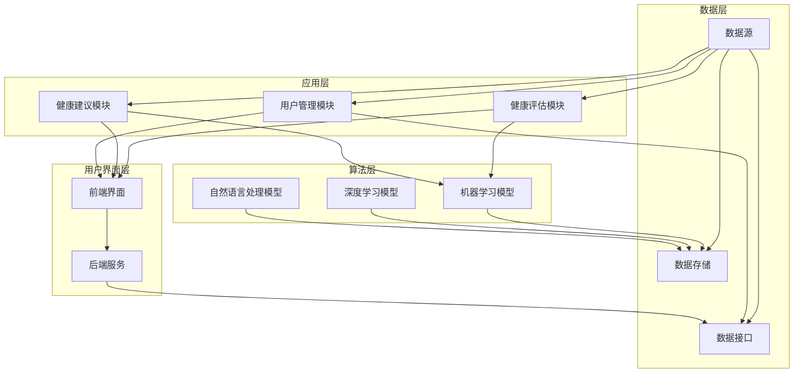

                 

### 1.1 问题背景

随着科技的飞速发展和信息技术的广泛应用，人工智能（AI）已经成为改变人类生活的重要力量。人工智能不仅仅局限于传统的工业和商业领域，还渗透到了医疗、教育、金融等多个方面。在医疗领域，个性化健康管理作为人工智能的一个重要应用方向，正日益受到关注。

**个性化健康管理的概念**

个性化健康管理是指基于个体化的健康数据，通过运用先进的数据分析技术和算法，为个体提供量身定制的健康评估、健康建议和干预方案。这种模式旨在提高健康干预的精准性和有效性，帮助个体更好地管理自己的健康。

**定制化健康建议的重要性**

定制化健康建议具有以下几个方面的价值：

1. **提高健康干预的精准性**：传统的健康干预措施往往是基于大规模人群的数据和经验，而定制化健康建议可以基于个体的具体数据，实现更精准的干预。
2. **提高健康管理的主动性**：个体可以通过定制化健康建议了解自己的健康状况，从而采取更加积极的健康管理措施，预防疾病的发生。
3. **提升医疗资源的利用效率**：通过个性化健康管理，医生可以更加高效地利用医疗资源，为患者提供更加个性化的诊疗方案。

**定制化健康建议的应用领域**

定制化健康建议在多个领域有着广泛的应用：

1. **慢性病管理**：如糖尿病、高血压等慢性病的个性化管理，通过监测个体的健康数据，提供个性化的饮食、运动和药物建议。
2. **康复护理**：对于手术后或疾病康复的患者，个性化健康建议可以帮助他们更好地进行康复训练，提高康复效果。
3. **心理健康**：通过分析个体的情绪和行为数据，提供个性化的心理辅导和干预方案，帮助个体改善心理健康。
4. **健康风险评估**：对个体的健康风险进行预测和评估，提供预防性建议，减少疾病发生的可能性。

**现状与挑战**

虽然个性化健康管理具有巨大的潜力，但在实际应用中仍面临一些挑战：

1. **数据隐私和安全**：健康数据涉及个人隐私，如何保障数据的安全和隐私是应用中需要解决的问题。
2. **数据质量和标准化**：健康数据的多样性和复杂性，使得数据的收集、处理和标准化成为挑战。
3. **算法模型的可靠性**：算法模型的准确性和稳定性直接影响个性化健康建议的质量。

**结论**

个性化健康管理作为人工智能在医疗领域的一个重要应用，具有广阔的发展前景。通过运用先进的数据分析技术和算法，可以为个体提供定制化的健康建议，提高健康干预的精准性和有效性。然而，在实际应用中还需要解决数据隐私、数据质量等问题，以实现个性化健康管理的可持续发展。

### 1.2 核心概念定义

在深入探讨人工智能在个性化健康管理中的应用之前，我们需要明确一些核心概念，包括人工智能、个性化健康管理以及定制化健康建议。这些概念的定义和内涵对于理解文章的主题至关重要。

**人工智能**

人工智能（Artificial Intelligence，简称AI）是指通过计算机系统模拟人类的智能行为，包括学习、推理、解决问题、自然语言理解和视觉感知等。人工智能的研究始于20世纪50年代，至今已发展出多种技术和方法，如机器学习、深度学习、自然语言处理等。

- **机器学习**：一种让计算机从数据中学习并改进自身性能的方法，主要包括监督学习、非监督学习和强化学习。
- **深度学习**：一种基于多层神经网络的结构，通过大量数据训练，能够自动提取特征并进行复杂的模式识别。
- **自然语言处理**：研究如何让计算机理解和生成人类语言的技术，包括文本分类、情感分析、机器翻译等。

**个性化健康管理**

个性化健康管理是基于个体化健康数据，通过数据分析和技术手段，为个体提供定制化的健康服务。它包括以下几个关键组成部分：

- **健康数据**：包括医疗记录、健康监测数据、生活方式数据等，这些数据是个性化健康管理的基础。
- **数据分析技术**：运用机器学习、深度学习等人工智能技术，对健康数据进行处理和分析。
- **健康管理方案**：基于分析结果，为个体提供个性化的健康建议和干预方案。

**定制化健康建议**

定制化健康建议是基于个体化健康数据，通过人工智能算法分析后，为个体提供的个性化健康建议。这种建议可以是关于饮食、运动、药物使用等方面，旨在提高个体的健康水平。

- **个性化**：定制化健康建议是根据个体的具体健康数据制定的，因此具有高度的个性化和针对性。
- **数据驱动**：定制化健康建议依赖于健康数据，通过对数据的分析和挖掘，为个体提供有价值的建议。
- **实时更新**：随着个体健康数据的变化，定制化健康建议可以实时更新，确保建议的准确性和有效性。

### 关系

人工智能与个性化健康管理之间的关系可以概括为：

- **人工智能是技术支撑**：个性化健康管理依赖于人工智能技术，如机器学习、深度学习、自然语言处理等，这些技术为健康数据的分析提供了强大的工具。
- **个性化健康管理是应用场景**：人工智能技术在个性化健康管理中的应用，使得健康干预更加精准和有效，推动了医疗健康领域的创新和发展。

定制化健康建议作为个性化健康管理的重要组成部分，是人工智能技术在健康管理中的具体应用体现。它通过人工智能算法分析个体的健康数据，生成个性化的健康建议，帮助个体实现更好的健康管理。

总的来说，人工智能、个性化健康管理以及定制化健康建议三者之间紧密相连，共同构成了一个完整的生态系统，为个体提供更加精准、个性化的健康服务。

### 1.3 概念联系

**人工智能与个性化健康管理的关联**

人工智能（AI）与个性化健康管理之间的关联可以从多个角度进行探讨。首先，人工智能作为一种技术，其核心目标是通过模拟和扩展人类的智能行为，来解决复杂的实际问题。在医疗健康领域，人工智能的应用正是为了提高医疗服务的质量和效率。

- **数据分析能力**：人工智能，尤其是机器学习和深度学习技术，具有强大的数据分析能力。这些技术能够处理和分析大规模的健康数据，从中提取出有价值的信息和模式，从而支持个性化健康管理的实施。
- **诊断与预测**：通过应用人工智能，医生可以更快速和准确地诊断疾病。例如，人工智能算法可以在影像学数据上发现微小的病变，提高早期诊断的准确性。此外，人工智能还可以预测疾病的发展趋势，帮助医生制定更加有效的治疗方案。
- **个性化治疗**：基于个体化的健康数据，人工智能能够为患者提供量身定制的治疗方案。这种个性化治疗不仅提高了治疗效果，还减少了不必要的医疗资源浪费。

**定制化健康建议的实现机制**

定制化健康建议是个性化健康管理的核心内容之一。它依赖于人工智能技术，通过以下机制实现：

- **数据收集与处理**：个性化健康管理首先需要收集大量的健康数据，包括生物医学数据、生活习惯数据、基因组数据等。人工智能技术可以对这些数据进行清洗、整合和处理，确保数据的质量和一致性。
- **特征提取**：通过对健康数据的特征提取，人工智能技术可以识别出与个体健康相关的关键信息。这些特征包括生理指标、行为模式、环境因素等，是定制化健康建议的基础。
- **算法分析**：利用机器学习和深度学习算法，人工智能可以对提取的特征进行分析和建模，从而生成个性化的健康建议。这些算法包括分类算法、回归算法、聚类算法等，每种算法都有其特定的应用场景。
- **实时更新与反馈**：定制化健康建议不是静态的，而是需要根据个体的健康数据不断更新和调整。人工智能系统可以实时监控个体的健康状况，并根据反馈进行自我调整，确保建议的准确性和有效性。

**人工智能与个性化健康管理的协同效应**

人工智能与个性化健康管理的协同效应体现在以下几个方面：

- **提高医疗质量**：通过定制化健康建议，医生可以更准确地了解患者的健康状况，制定更加有效的治疗计划，从而提高医疗质量。
- **优化医疗资源**：个性化健康管理可以优化医疗资源的分配和使用，减少不必要的医疗资源浪费，提高医疗资源的利用效率。
- **提升患者满意度**：定制化的健康服务能够满足患者的个性化需求，提高患者的满意度和依从性，促进医患关系的和谐发展。

**结论**

人工智能与个性化健康管理之间存在着紧密的联系和协同作用。人工智能为个性化健康管理提供了强大的技术支撑，使得健康数据的分析和应用成为可能。通过定制化健康建议，个性化健康管理能够更好地满足个体的健康需求，提高医疗服务的质量和效率。在未来，随着人工智能技术的不断进步，个性化健康管理将在医疗健康领域发挥更加重要的作用。

### 2.1 机器学习基础

**监督学习**

监督学习是一种机器学习技术，其核心思想是利用已标记的数据来训练模型，然后使用这个模型对新的、未标记的数据进行预测。在监督学习中，输入数据（特征）和输出结果（标签）都是已知的，模型的目标是学习输入和输出之间的映射关系。

- **分类问题**：当输出是类别时，如判断某个人是否患有某种疾病，监督学习算法会学习输入特征与类别标签之间的映射关系。
- **回归问题**：当输出是数值时，如预测房价，监督学习算法则学习输入特征与数值标签之间的映射关系。

监督学习的主要算法包括：

- **线性回归**：最简单的回归算法，假设输出值是输入特征的线性组合，通过最小化均方误差来训练模型。
- **逻辑回归**：用于分类问题，通过最大化逻辑函数来训练模型，适用于二分类问题。
- **支持向量机（SVM）**：通过找到一个最佳的超平面来分隔数据，适用于高维空间分类问题。

**非监督学习**

非监督学习是一种机器学习技术，其核心思想是仅利用输入数据来训练模型，不依赖于已标记的输出结果。在非监督学习中，模型的目标是发现数据中的隐含结构和规律。

- **聚类**：将相似的数据点归为一类，常见的聚类算法包括K-means、层次聚类等。K-means算法通过迭代计算簇的中心点，使得每个数据点都尽量靠近其簇中心点；层次聚类则通过递归地将数据点合并或分裂成不同的层级，构建出一棵聚类树。
- **降维**：减少数据维度，同时保持数据的结构信息，常用的降维算法包括主成分分析（PCA）和t-SVD等。PCA通过找到数据的主要成分来简化数据，t-SVD则利用奇异值分解来提取数据的主要特征。

**强化学习**

强化学习是一种机器学习技术，其核心思想是通过试错来学习最优策略。在强化学习中，模型通过与环境的交互来获取反馈，从而不断调整自身的策略以获得最大的累积奖励。

- **Q学习**：通过学习状态-动作值函数（Q函数）来选择最优动作。Q学习算法利用经验回放和目标网络等方法来改善其学习效果。
- **深度强化学习**：结合深度学习和强化学习，通过神经网络来表示状态-动作值函数，适用于复杂环境的高维问题。常见的深度强化学习算法包括深度Q网络（DQN）、策略梯度算法（PG）和深度确定性策略梯度（DDPG）等。

### 2.2 深度学习基础

**神经网络**

神经网络（Neural Network，简称NN）是深度学习的基础，其灵感来源于人脑的神经元结构。神经网络通过多层神经元之间的连接和激活函数来实现输入到输出的映射。

- **结构**：神经网络通常包括输入层、隐藏层和输出层。每个神经元都会接收来自前一层的输入，并通过权重和偏置进行加权求和，最后通过激活函数输出结果。
- **激活函数**：常用的激活函数包括sigmoid函数、ReLU函数和Tanh函数。这些函数可以引入非线性因素，使神经网络具有更强的表达能力。

**卷积神经网络（CNN）**

卷积神经网络（Convolutional Neural Network，简称CNN）是专门用于图像识别和处理的神经网络。其核心思想是通过卷积层来提取图像的特征。

- **卷积层**：通过卷积操作提取图像中的局部特征。卷积层中的每个过滤器（kernel）都学习到一种特定的特征模式，如边缘、纹理等。
- **池化层**：通过下采样来减少数据维度，提高计算效率。常见的池化操作包括最大池化和平均池化。
- **全连接层**：在网络的最后部分，将卷积层和池化层提取到的特征进行融合，并通过全连接层输出分类结果。

**循环神经网络（RNN）**

循环神经网络（Recurrent Neural Network，简称RNN）是一种能够处理序列数据的神经网络。其特点是在网络中引入了时间维度，每个时间步的输出都会影响到下一个时间步的计算。

- **结构**：RNN包含一个循环层，用于处理序列数据。每个时间步的输入都会通过循环层进行更新，从而将前一个时间步的信息传递到下一个时间步。
- **长短时记忆（LSTM）**：LSTM是RNN的一种变体，通过引入门控机制来缓解RNN的梯度消失问题，适用于处理长序列数据。

### 2.3 自然语言处理（NLP）

**语言模型**

语言模型是一种用于预测自然语言序列的统计模型。通过学习大量文本数据，语言模型可以预测下一个单词或字符的概率。

- **n-gram模型**：基于前n个单词或字符的联合概率来预测下一个单词或字符，是最简单的语言模型。
- **神经网络语言模型**：通过神经网络结构来学习文本数据中的概率分布，具有更强的表达能力和预测能力。

**文本分类**

文本分类是一种将文本数据分为不同类别的方法，常用于舆情分析、新闻分类等场景。

- **朴素贝叶斯分类器**：基于贝叶斯定理和特征条件独立性假设进行分类，具有较好的分类效果和计算效率。
- **支持向量机（SVM）**：通过最大化分类边界来分类数据，适用于高维特征空间。

**情感分析**

情感分析是一种评估文本数据情感倾向的方法，常用于社交媒体分析和客户反馈分析。

- **基于规则的方法**：通过构建情感词典和规则来识别文本中的情感词和情感极性。
- **基于机器学习的方法**：通过训练情感分类模型，对文本数据中的情感倾向进行预测。常见的算法包括朴素贝叶斯、SVM和神经网络等。

### 2.4 计算机视觉

**图像分类**

图像分类是一种将图像数据分为不同类别的方法，广泛应用于物体识别、图像检索等领域。

- **卷积神经网络（CNN）**：通过卷积层、池化层和全连接层等结构，从图像中提取特征并实现分类。
- **支持向量机（SVM）**：通过找到最佳分类边界来分类图像。

**目标检测**

目标检测是一种识别图像中目标位置的方法，常用于自动驾驶、安防监控等领域。

- **R-CNN系列**：通过区域提议网络（RPN）和分类器来实现目标检测。
- **YOLO系列**：通过将图像分割成网格，并预测每个网格中的物体位置和类别。

**图像生成**

图像生成是一种根据输入条件生成新图像的方法，常用于图像增强、图像修复等领域。

- **生成对抗网络（GAN）**：通过生成器和判别器的对抗训练来实现图像生成。
- **变分自编码器（VAE）**：通过概率模型来生成具有类似真实数据的图像。

### 2.5 强化学习

强化学习是一种通过试错来学习最优策略的机器学习技术。其核心思想是智能体通过与环境的交互，不断调整策略以获得最大累积奖励。

- **Q学习**：通过学习状态-动作值函数（Q函数）来选择最优动作，常用的方法包括SARSA和Q-Learning。
- **深度Q网络（DQN）**：结合深度学习和Q学习，通过经验回放和目标网络来改善训练效果。
- **策略梯度算法**：通过学习策略的概率分布来直接优化策略，常用的方法包括REINFORCE和PPO。

### 2.6 人工智能与个性化健康管理的结合

人工智能与个性化健康管理的结合体现在多个方面：

- **数据分析**：通过机器学习和深度学习算法，对健康数据进行处理和分析，提取出与健康管理相关的特征。
- **诊断与预测**：利用图像识别、自然语言处理等技术，对医学图像和临床报告进行自动分析，提高诊断和预测的准确性。
- **个性化治疗**：通过个性化健康建议，为患者提供量身定制的治疗方案，提高治疗效果和患者满意度。
- **健康管理**：利用强化学习等技术，帮助用户养成健康的习惯，提供个性化的健康干预措施。

### 2.7 人工智能在个性化健康管理中的应用案例

**慢性病管理**：利用机器学习和深度学习算法，对患者的健康数据进行分析，预测疾病的发展趋势，提供个性化的饮食、运动和药物建议，帮助患者更好地管理慢性病。

**心理健康**：通过情感分析等技术，分析患者的情绪和行为数据，提供个性化的心理辅导和干预方案，帮助患者改善心理健康。

**健康风险评估**：利用机器学习算法，对个体的健康数据进行分析，预测其患病的风险，提供预防性建议，减少疾病发生的可能性。

**个性化健康建议系统**：通过集成多种人工智能技术，为用户提供定制化的健康建议，包括饮食、运动、心理健康等方面，帮助用户实现健康目标。

### 结论

人工智能在个性化健康管理中的应用具有广阔的前景，通过机器学习、深度学习、自然语言处理等技术，可以为个体提供精准、个性化的健康建议和服务。未来，随着人工智能技术的不断发展和完善，个性化健康管理将在医疗健康领域发挥更加重要的作用，为人类健康带来更大的福祉。

### 3.1 健康数据来源

健康数据是个性化健康管理的基础，其来源多样化且丰富。以下是几种常见的健康数据来源：

**医疗记录**

医疗记录是重要的健康数据来源之一，包括电子健康记录（EHR）、病历、诊断报告、手术记录等。这些数据通常由医疗机构生成，记录了个体的健康状况、病史、治疗方案等信息。电子健康记录的普及使得医疗数据的收集和处理更加高效和规范。

**健康跟踪设备**

现代健康跟踪设备如智能手环、智能手表、心率监测器等，可以实时监测个体的生理指标，如心率、血压、步数、睡眠质量等。这些设备通常通过无线传输技术将数据上传到云端，供用户和医生分析。这些数据有助于了解个体的日常健康状况，并发现潜在的异常情况。

**基因组数据**

基因组数据是个性化健康管理中的重要组成部分，通过基因测序技术，可以获得个体的全基因组信息。这些数据可以揭示个体的遗传特征，帮助预测患病风险，指导个性化的预防措施和治疗方案。

**社交媒体**

社交媒体平台上的数据也是个性化健康管理的重要来源。个体在社交媒体上分享的健康信息、生活方式、情绪状态等，可以为个性化健康管理提供丰富的数据支持。例如，通过分析社交媒体上的帖子，可以了解个体的饮食偏好、运动习惯等，从而提供更加精准的健康建议。

**环境数据**

环境数据包括空气质量、气温、湿度等，对个体的健康也有重要影响。例如，空气污染可能会增加呼吸系统疾病的风险。通过集成环境数据，个性化健康管理系统能够提供更加全面和个性化的健康建议。

**健康应用**

智能手机上的健康应用如健身追踪、营养管理、心理健康等，可以收集和记录个体的健康数据。这些数据通过云平台进行整合和分析，可以为用户提供个性化的健康建议和服务。

**医疗机构**

除了上述来源，医疗机构也是重要的健康数据提供者。医院、诊所、实验室等机构在日常医疗活动中产生的数据，包括检查报告、药物处方、手术记录等，都是个性化健康管理的重要资源。

综上所述，健康数据的来源多样，涵盖了医疗记录、健康跟踪设备、基因组数据、社交媒体、环境数据、健康应用和医疗机构等多个方面。这些数据共同构成了个性化健康管理的基础，为个体提供精准、个性化的健康服务提供了重要的支持。

### 3.2 数据处理与分析

在个性化健康管理中，数据处理和分析是关键环节。如何确保数据的质量和一致性，提取出有用的特征，以及进行有效的分析，是保证个性化健康建议准确性和有效性的基础。以下是详细的数据处理和分析步骤：

**数据收集**

首先，需要从不同的数据源收集健康数据，包括医疗记录、健康跟踪设备数据、基因组数据、社交媒体数据等。这些数据需要通过规范化的接口和协议进行采集，确保数据的完整性和准确性。

**数据清洗**

数据清洗是数据处理的重要步骤，目的是去除数据中的噪声和异常值。具体步骤包括：

- **缺失值处理**：对于缺失值，可以通过插值、均值填补或使用统计模型预测填补等方法进行处理。
- **异常值检测**：使用统计学方法和机器学习算法检测数据中的异常值，如离群点检测、Z分数检测等。
- **重复值删除**：检测并删除重复的数据条目，避免数据冗余。
- **数据格式转换**：将不同数据源的数据格式进行统一，如将时间戳转换为标准格式。

**数据标准化**

数据标准化是确保数据在同一尺度上进行比较和处理的过程。具体步骤包括：

- **数值数据标准化**：使用最小-最大标准化、Z-Score标准化等方法，将数值数据转换到统一范围内。
- **分类数据编码**：将分类数据转换为数值形式，如使用独热编码（One-Hot Encoding）或标签编码（Label Encoding）。
- **数据缩放**：对于连续的数值数据，通过缩放技术（如归一化、标准化）将其转换为相同范围，便于后续分析。

**特征提取**

特征提取是数据处理的核心步骤，目的是从原始数据中提取出对健康管理有用的特征。具体方法包括：

- **统计特征**：通过计算基本统计量（如均值、方差、中位数等）来描述数据的中心趋势和离散程度。
- **时间序列特征**：对于时间序列数据，可以通过差分、季节性分解等方法提取周期性和趋势特征。
- **文本特征**：对于文本数据，可以使用词频（TF）、词频-逆文档频率（TF-IDF）、词嵌入等方法提取特征。
- **图像特征**：对于图像数据，可以使用卷积神经网络（CNN）提取图像中的视觉特征。

**数据分析**

在完成数据清洗和特征提取后，需要进行数据分析，以提取出对健康管理有用的信息。常用的数据分析方法包括：

- **聚类分析**：使用K-means、层次聚类等算法对数据点进行分类，发现数据中的隐含结构。
- **回归分析**：通过建立回归模型，分析自变量和因变量之间的关系，预测个体的健康状态。
- **分类分析**：使用SVM、逻辑回归等算法，对个体的健康状态进行分类，帮助制定个性化的健康管理方案。
- **时间序列分析**：使用ARIMA、LSTM等算法，对时间序列数据进行建模和预测，发现健康状态的变化趋势。

**数据可视化**

数据可视化是将数据分析结果以图形化形式展示的过程，有助于直观地理解和解释数据。常用的数据可视化工具包括Matplotlib、Seaborn、Plotly等，可以生成折线图、柱状图、散点图、热力图等多种图表。

**结论**

数据处理和分析是个性化健康管理的核心步骤，通过数据清洗、标准化、特征提取和数据分析，可以提取出对健康管理有用的信息，为个体提供精准、个性化的健康建议。然而，数据处理和分析的复杂性也要求我们在实践中不断探索和优化，以应对多样化的健康数据和复杂的健康问题。

### 3.3 数据可视化

数据可视化是数据分析和个性化健康管理中不可或缺的一环，它能够将复杂的数据转化为直观、易于理解的图形，帮助用户快速获取关键信息。以下介绍几种常见的数据可视化工具及其应用场景。

**Matplotlib**

Matplotlib 是一个强大的Python数据可视化库，可以生成各种类型的图表，如线图、柱状图、散点图、饼图等。其使用简单，功能强大，广泛用于学术研究和数据分析中。

- **安装与配置**：通过pip命令安装matplotlib库：`pip install matplotlib`
- **基本用法**：以下是一个简单的Matplotlib示例，用于生成一个线图：
  ```python
  import matplotlib.pyplot as plt

  # 数据
  x = [0, 1, 2, 3, 4]
  y = [0, 1, 4, 9, 16]

  # 创建图表
  plt.plot(x, y)

  # 添加标题和标签
  plt.title('简单线图')
  plt.xlabel('X轴')
  plt.ylabel('Y轴')

  # 显示图表
  plt.show()
  ```

**Seaborn**

Seaborn 是基于Matplotlib的另一个可视化库，专注于统计图表的绘制，具有美观的默认样式和丰富的可视化选项。它适用于探索性数据分析（EDA）和报告生成。

- **安装与配置**：通过pip命令安装seaborn库：`pip install seaborn`
- **基本用法**：以下是一个简单的Seaborn示例，用于生成一个散点图：
  ```python
  import seaborn as sns
  import pandas as pd

  # 数据
  data = pd.DataFrame({
      'x': [0, 1, 2, 3, 4],
      'y': [0, 1, 4, 9, 16]
  })

  # 创建散点图
  sns.scatterplot(x='x', y='y', data=data)

  # 添加标题和标签
  plt.title('简单散点图')
  plt.xlabel('X轴')
  plt.ylabel('Y轴')

  # 显示图表
  plt.show()
  ```

**Plotly**

Plotly 是一个交互式可视化库，支持多种图表类型，包括线图、柱状图、散点图、三维图等。它特别适合于Web应用中的交互式图表。

- **安装与配置**：通过pip命令安装plotly库：`pip install plotly`
- **基本用法**：以下是一个简单的Plotly示例，用于生成一个交互式线图：
  ```python
  import plotly.express as px
  import pandas as pd

  # 数据
  data = pd.DataFrame({
      'x': [0, 1, 2, 3, 4],
      'y': [0, 1, 4, 9, 16]
  })

  # 创建交互式线图
  fig = px.line(data, x='x', y='y', title='简单线图')

  # 显示交互式图表
  fig.show()
  ```

**常见图表类型**

- **折线图**：用于展示数据的变化趋势，如时间序列数据。
- **柱状图**：用于比较不同类别的数据，如不同疾病的发病率。
- **散点图**：用于展示两个变量之间的关系，如血压和体重的关系。
- **饼图**：用于展示各部分占整体的比例，如各类疾病的患病率。
- **热力图**：用于展示多个变量之间的相关性，如不同健康指标之间的相关性。

**应用场景**

- **健康数据分析**：通过折线图和柱状图，可以直观地展示健康数据的变化趋势和分布情况。
- **个性化健康建议**：通过散点图和热力图，可以分析个体健康数据中的相关性，发现潜在的异常情况，为用户提供定制化的健康建议。
- **疾病预测与预防**：通过交互式图表，医生和用户可以实时查看和交互数据，进行疾病预测和预防策略的制定。

**结论**

数据可视化是个性化健康管理中不可或缺的一部分，通过使用Matplotlib、Seaborn和Plotly等可视化工具，可以有效地将健康数据转化为直观的图表，帮助用户和医生更好地理解数据，制定个性化的健康干预策略。在实际应用中，选择合适的可视化工具和图表类型，能够显著提升数据分析的效率和效果。

### 4.1 系统需求分析

在设计和实现个性化健康管理平台的过程中，系统需求分析是关键的一步。系统需求分析旨在明确系统所需的功能、性能和用户界面需求，确保系统能够满足用户的实际需求，并具备良好的可扩展性和可维护性。以下是系统需求分析的详细步骤和结果。

**功能需求**

个性化健康管理平台的主要功能包括：

1. **数据收集与整合**：系统能够从多个数据源（如医疗记录、健康跟踪设备、社交媒体等）收集健康数据，并进行数据清洗、整合和预处理，确保数据的一致性和完整性。
2. **个性化健康评估**：利用机器学习和深度学习算法，对个体的健康数据进行处理和分析，生成个性化的健康评估报告，包括健康状态、疾病风险评估、个性化健康建议等。
3. **健康建议生成与推送**：根据评估结果，系统应能够为用户生成定制化的健康建议，包括饮食建议、运动计划、心理健康干预等，并推送至用户的设备或客户端。
4. **用户界面**：提供一个友好、直观的用户界面，用户可以查看自己的健康数据、评估报告和健康建议，进行交互和反馈。

**性能需求**

系统性能需求主要包括以下方面：

1. **响应时间**：系统对于用户操作的反应时间应尽可能短，以保证用户体验。通常，前端界面响应时间不应超过1秒，后端数据处理和分析的响应时间应在几分钟内完成。
2. **并发处理能力**：系统应具备良好的并发处理能力，能够同时处理大量用户的请求，确保系统在高并发场景下的稳定运行。
3. **数据存储和处理能力**：系统需要具备高效的数据库存储和管理能力，能够存储和查询海量的健康数据，同时具备强大的数据处理和分析能力，以满足复杂的算法模型需求。

**用户界面需求**

用户界面需求主要关注以下方面：

1. **易用性**：界面设计应简洁直观，易于用户操作和理解，减少用户的学习成本。
2. **交互性**：界面应具备良好的交互性，允许用户查看和修改自己的健康数据，接收和反馈健康建议。
3. **适应性**：界面应适应不同设备和屏幕尺寸，提供良好的用户体验，无论用户使用手机、平板电脑还是电脑，都能顺畅使用系统功能。

**技术需求**

技术需求主要包括以下方面：

1. **前端技术**：采用现代前端框架（如React、Vue.js等）构建用户界面，提供快速开发和良好的用户体验。
2. **后端技术**：选择合适的服务器端技术（如Spring Boot、Django等），实现数据收集、处理和服务的后台逻辑。
3. **数据库技术**：使用高效的数据库管理系统（如MySQL、PostgreSQL等），确保数据的安全存储和快速查询。
4. **数据分析和机器学习框架**：采用流行的机器学习和深度学习框架（如TensorFlow、PyTorch等），实现健康数据的分析和个性化健康建议的生成。

**结论**

通过系统需求分析，我们明确了个性化健康管理平台的各项功能、性能和用户界面需求，为后续的系统设计和实现奠定了坚实的基础。在系统开发过程中，将根据这些需求进行详细的设计和实现，确保系统能够满足用户的实际需求，提供高效、精准的健康管理服务。

### 4.2 系统架构设计

系统架构设计是构建个性化健康管理平台的核心步骤，它决定了系统的性能、可扩展性和可维护性。为了确保系统能够满足功能需求和技术需求，我们需要设计一个分层且模块化的系统架构。以下是系统架构设计的详细说明：

**架构层次**

系统架构可以分为四个主要层次：数据层、算法层、应用层和用户界面层。

1. **数据层**：负责数据的收集、存储和管理。数据层包括数据源、数据存储和数据接口。
2. **算法层**：负责对收集到的健康数据进行处理和分析，生成个性化健康建议。算法层包括机器学习模型、深度学习模型和自然语言处理模型。
3. **应用层**：负责实现系统的业务逻辑和功能，为用户界面层提供服务接口。应用层包括健康评估模块、健康建议模块、用户管理模块等。
4. **用户界面层**：为用户提供交互界面，用户可以通过界面查看自己的健康数据、评估报告和健康建议。

**具体架构设计**

1. **数据层**
   - **数据源**：包括医疗记录、健康跟踪设备、基因组数据、社交媒体数据等。
   - **数据存储**：使用分布式数据库管理系统（如Hadoop、Spark等），实现大规模健康数据的高效存储和管理。
   - **数据接口**：设计API接口，用于数据采集和查询，支持多种数据格式和协议（如JSON、XML、REST等）。

2. **算法层**
   - **机器学习模型**：包括分类模型、回归模型、聚类模型等，用于健康数据的特征提取和模式识别。
   - **深度学习模型**：如卷积神经网络（CNN）、循环神经网络（RNN）等，用于处理复杂的数据结构和序列数据。
   - **自然语言处理模型**：如语言模型、文本分类模型、情感分析模型等，用于处理文本数据，辅助健康评估和健康建议生成。

3. **应用层**
   - **健康评估模块**：通过算法层处理健康数据，生成个性化的健康评估报告。
   - **健康建议模块**：根据评估报告，为用户提供定制化的健康建议，如饮食建议、运动计划、心理健康干预等。
   - **用户管理模块**：实现用户注册、登录、权限管理等功能，确保用户数据的安全和隐私。

4. **用户界面层**
   - **前端界面**：采用现代化的前端框架（如React、Vue.js等），实现简洁直观的用户交互界面。
   - **后端服务**：通过RESTful API接口，与算法层和应用层进行数据交互，提供健康评估和健康建议服务。

**架构图**

为了更好地展示系统架构，我们使用Mermaid绘制了以下架构图：



**系统交互流程**

系统交互流程描述了用户通过界面操作，到系统生成个性化健康建议的整个过程。以下是系统交互流程的详细步骤：

1. **用户注册与登录**：用户通过用户管理模块注册账号并登录，确保数据的安全和隐私。
2. **数据收集与整合**：系统从不同的数据源（如医疗记录、健康跟踪设备等）收集健康数据，并进行数据清洗和整合。
3. **健康数据评估**：算法层处理健康数据，生成个性化的健康评估报告，包括健康状态、疾病风险评估等。
4. **健康建议生成**：根据评估报告，健康建议模块为用户生成定制化的健康建议，如饮食建议、运动计划等。
5. **数据推送与展示**：系统将健康评估报告和健康建议通过用户界面层推送至用户的设备或客户端，用户可以在界面上查看和执行这些建议。

**结论**

通过系统架构设计，我们为个性化健康管理平台构建了一个高效、模块化且易于扩展的架构。数据层、算法层、应用层和用户界面层各司其职，共同实现了个性化健康管理的目标。在后续的系统实现过程中，将根据架构设计逐步开发和优化各个模块，确保系统的高性能和用户体验。

### 4.3 系统接口设计

系统接口设计是确保系统各模块之间有效通信的关键环节，合理的接口设计能够提高系统的可维护性和扩展性。以下是系统接口设计的详细说明，包括接口类型、RESTful API设计、接口文档编写以及安全性和可靠性保证。

**接口类型**

系统接口主要分为以下几类：

1. **内部接口**：用于系统内部模块之间的通信，如数据层与算法层之间的接口、算法层与应用层之间的接口等。
2. **外部接口**：用于系统与外部系统的通信，如与第三方健康设备的数据交换接口、与第三方服务（如云存储、短信服务）的接口等。
3. **用户接口**：用于用户与系统的交互，如前端界面与后端服务的接口、用户注册登录接口等。

**RESTful API设计**

RESTful API是现代Web服务设计的一种最佳实践，其核心原则是利用HTTP协议的请求方法（GET、POST、PUT、DELETE等）和URI（统一资源标识符）来描述资源的操作。以下是系统接口的RESTful设计：

1. **URL设计**：每个接口的URL设计应简洁明了，能够直接反映资源的类型和操作。例如：
   - 用户注册：`POST /users/register`
   - 用户登录：`POST /users/login`
   - 健康数据上传：`POST /data/upload`
   - 健康评估报告获取：`GET /评估报告/{评估ID}`

2. **请求和响应格式**：通常使用JSON格式进行数据传输，便于解析和处理。例如：
   - 用户注册请求：
     ```json
     {
       "username": "johndoe",
       "password": "password123",
       "email": "johndoe@example.com"
     }
     ```
   - 用户注册响应：
     ```json
     {
       "status": "success",
       "message": "注册成功",
       "token": "eyJhbGciOiJIUzI1NiIsInR5cCI6IkpXVCJ9..."
     }
     ```

3. **请求和响应状态码**：遵循HTTP状态码标准，确保接口的正确性和可追溯性。例如：
   - 成功响应：200 OK
   - 创建成功：201 Created
   - 错误响应：400 Bad Request
   - 未授权：401 Unauthorized
   - 资源不存在：404 Not Found

**接口文档编写**

接口文档是开发者理解和使用接口的重要参考资料，应详细描述接口的URL、请求参数、响应结果以及可能的错误信息。以下是接口文档的基本结构：

1. **概述**：介绍接口的功能、目的和适用场景。
2. **URL和HTTP方法**：列出接口的URL和使用的HTTP方法。
3. **请求参数**：详细说明请求参数的名称、类型、必选性和示例。
4. **响应结果**：描述成功的响应内容和可能的错误响应内容。
5. **状态码**：列出可能返回的状态码及其含义。
6. **示例**：提供实际的HTTP请求和响应示例。

**安全性保证**

安全性是系统接口设计的重要考量，以下是确保接口安全性的几个关键措施：

1. **身份验证**：使用Token-Based认证（如JWT）确保用户访问接口时的身份验证。
2. **权限控制**：根据用户的角色和权限，限制其对接口的访问范围。
3. **数据加密**：使用HTTPS协议传输数据，确保数据在传输过程中的安全性。
4. **请求验证**：使用验证和校验机制（如CSRF防护、XSS防护）确保请求的有效性和安全性。
5. **错误处理**：避免在接口返回错误时暴露系统内部信息，确保错误信息不会泄露敏感数据。

**可靠性保证**

接口设计的可靠性直接影响系统的稳定运行，以下是确保接口可靠性的几个关键措施：

1. **负载均衡**：通过负载均衡器（如Nginx、HAProxy）均衡接口的请求，防止单点故障。
2. **限流与熔断**：使用限流器和熔断器（如Spring Cloud Gateway、Hystrix）防止接口因请求过多而崩溃。
3. **异常处理**：设计全局异常处理机制，确保接口在遇到异常情况时能够优雅地处理并返回合理的错误信息。
4. **日志记录**：详细记录接口的请求和响应日志，便于监控和故障排查。

**结论**

系统接口设计是确保个性化健康管理平台各模块有效通信的关键步骤。通过合理的接口类型、RESTful API设计、接口文档编写以及安全性和可靠性保证，能够确保系统的高效运行和稳定服务。在实际开发过程中，根据具体的业务需求和技术架构，不断完善接口设计和实现，以提升系统的整体性能和用户体验。

### 4.4 系统交互流程

系统交互流程是用户与个性化健康管理平台进行有效互动的核心环节，通过这一流程，用户能够获取个性化的健康建议。以下是系统交互流程的详细描述，包括各步骤的具体操作和实现方法。

**步骤 1：用户注册与登录**

1. **用户注册**：
   - 用户访问个性化健康管理平台的用户注册页面，填写用户名、密码、电子邮件等注册信息。
   - 前端界面将注册信息以JSON格式发送到后端服务，请求路径为`POST /users/register`。
   - 后端服务接收注册请求，验证注册信息的合法性，并存储用户信息到数据库。
   - 注册成功后，后端服务生成JWT（JSON Web Token）并返回给前端，前端将JWT存储在本地。

2. **用户登录**：
   - 用户在登录页面输入用户名和密码，前端界面将登录信息以JSON格式发送到后端服务，请求路径为`POST /users/login`。
   - 后端服务验证用户身份，如果验证通过，则生成JWT并返回给前端，前端将JWT存储在本地。

**步骤 2：数据收集与上传**

1. **数据收集**：
   - 用户通过健康跟踪设备（如智能手环、智能手表）或第三方健康应用收集健康数据，如心率、血压、步数等。
   - 数据收集后，前端界面将数据以JSON格式上传到后端服务，请求路径为`POST /data/upload`。

2. **数据上传**：
   - 后端服务接收上传的JSON数据，进行数据清洗、格式转换和存储到数据库。

**步骤 3：健康数据预处理**

1. **数据清洗**：
   - 对上传的健康数据进行缺失值处理、异常值检测和重复值删除等操作，确保数据质量。
   - 使用Python脚本或数据处理库（如Pandas）实现数据清洗逻辑。

2. **数据标准化**：
   - 对数值数据进行标准化处理，如Z-Score标准化或最小-最大标准化，使其在同一尺度上比较。
   - 对分类数据进行编码，如使用独热编码（One-Hot Encoding）。

**步骤 4：健康数据特征提取**

1. **特征提取**：
   - 从清洗后的健康数据中提取出对健康评估有用的特征，如统计特征（均值、方差等）和时间序列特征（趋势、周期性等）。
   - 使用机器学习库（如Scikit-Learn）和深度学习库（如TensorFlow、PyTorch）实现特征提取。

**步骤 5：健康评估与建议生成**

1. **健康评估**：
   - 利用机器学习和深度学习算法对提取的特征进行分析和建模，生成个性化的健康评估报告，如健康状态、疾病风险评估等。
   - 评估结果存储到数据库，并与用户关联。

2. **健康建议生成**：
   - 根据评估结果，生成个性化的健康建议，如饮食建议、运动计划、心理健康干预等。
   - 健康建议存储到数据库，并与用户关联。

**步骤 6：数据推送与用户展示**

1. **数据推送**：
   - 后端服务将生成的健康评估报告和健康建议以JSON格式发送到前端，请求路径为`GET /评估报告/{评估ID}`。
   - 前端界面接收数据，并将其展示在用户界面上。

2. **用户展示**：
   - 用户在前端界面上查看自己的健康评估报告和健康建议，并进行操作和反馈。

**步骤 7：用户反馈与调整**

1. **用户反馈**：
   - 用户对健康建议进行反馈，如调整饮食计划、改变运动习惯等。
   - 前端界面将用户的反馈信息以JSON格式发送到后端服务。

2. **调整建议**：
   - 后端服务根据用户的反馈调整健康建议，确保建议的个性化和有效性。

**实现方法**

为了实现系统交互流程，可以采用以下技术手段：

- **前端技术**：使用React或Vue.js等现代化前端框架构建用户界面，实现数据收集、上传、展示和用户反馈功能。
- **后端技术**：使用Spring Boot或Django等后端框架处理用户请求，实现数据存储、预处理、评估和调整功能。
- **数据库技术**：使用MySQL或PostgreSQL等关系型数据库存储用户数据、健康数据和评估结果。
- **机器学习和深度学习技术**：使用TensorFlow或PyTorch等机器学习库实现健康数据分析和建议生成。

**结论**

系统交互流程确保了用户与个性化健康管理平台的有效互动，通过注册、登录、数据上传、预处理、特征提取、健康评估、建议生成和用户反馈等步骤，用户能够获取精准、个性化的健康建议。在实际开发过程中，需要根据具体的业务需求和技术架构不断完善交互流程，确保系统的稳定性和用户体验。

### 5.1 客户分群算法

在个性化健康管理系统中，客户分群是一个重要的环节，它有助于理解不同群体的健康需求和行为特征，从而提供更加精准和有效的健康建议。以下是几种常用的客户分群算法，包括K-means算法和层次聚类算法。

**K-means算法**

K-means是一种基于距离的聚类算法，其核心思想是将数据点划分为K个簇，使得每个数据点与其分配的簇中心点的距离最小。以下是K-means算法的详细步骤：

1. **初始化**：
   - 随机选择K个数据点作为初始聚类中心。
   - 计算每个数据点到聚类中心点的距离，并将其分配到最近的簇。

2. **迭代**：
   - 重新计算每个簇的中心点，取簇内所有数据点的均值。
   - 重新分配数据点，使其分配到最近的簇中心点。
   - 重复迭代步骤，直到聚类中心点不再发生变化或达到预设的迭代次数。

3. **聚类结果**：
   - 得到最终的K个簇，每个簇代表一个客户群体。

K-means算法的优点是简单高效，但缺点是对初始聚类中心的选择敏感，且只能处理凸形聚类。

**层次聚类算法**

层次聚类是一种基于层次结构的聚类算法，分为自底向上（凝聚层次聚类）和自顶向下（分裂层次聚类）两种类型。以下是凝聚层次聚类算法的详细步骤：

1. **初始化**：
   - 将每个数据点视为一个簇。

2. **凝聚**：
   - 计算每对相邻簇之间的距离，选择距离最近的簇合并。
   - 重新计算合并后的簇的中心点。
   - 重复上述步骤，直到所有数据点合并为一个簇或达到预设的聚类层次。

3. **聚类结果**：
   - 得到一系列的簇，形成一个层次聚类树。

层次聚类算法的优点是能够处理复杂的聚类结构，但缺点是计算复杂度高，且难以确定最佳的聚类数目。

**应用场景**

- **健康风险评估**：通过客户分群，可以根据不同群体的健康风险，提供针对性的健康建议和干预措施。
- **健康行为分析**：分析不同群体的健康行为特征，如饮食偏好、运动习惯等，为用户提供个性化的健康指导。

**案例**

假设我们有一个包含用户健康数据的数据库，其中每个用户有身高、体重、血压、心率等特征。我们可以使用K-means算法将用户分为不同的健康群体：

1. **初始化**：随机选择10个用户作为初始聚类中心。
2. **迭代**：
   - 第一次迭代：计算每个用户到聚类中心点的距离，分配到最近的簇。
   - 第二次迭代：重新计算每个簇的中心点，分配用户。
   - ...
   - 最终聚类结果：将用户划分为5个健康群体。

通过分析这些健康群体的特征，可以为每个群体提供针对性的健康建议，如对于高体重群体，可以提供减重建议；对于高血压群体，可以提供降压饮食建议。

**结论**

客户分群算法是个性化健康管理中的一项重要技术，通过K-means和层次聚类等算法，可以有效地将用户划分为不同的健康群体，为用户提供精准、个性化的健康建议。在实际应用中，选择合适的聚类算法和参数，能够显著提升分群效果和用户满意度。

### 5.2 健康风险评估模型

健康风险评估是个性化健康管理的重要组成部分，通过对个体健康数据的分析，预测其患病风险，并提供针对性的健康建议。在个性化健康管理系统中，健康风险评估模型是实现这一目标的核心算法。本文将详细介绍神经网络模型、决策树模型等健康风险评估模型，并对比其优缺点。

**神经网络模型**

神经网络模型，特别是深度学习模型，因其强大的建模能力和非线性特征提取能力，被广泛应用于健康风险评估。以下是神经网络模型的原理、数学模型和Python代码示例。

**原理**

神经网络模型基于多层前馈神经网络，通过学习输入特征和输出目标之间的映射关系，实现对未知数据的预测。神经网络由输入层、隐藏层和输出层组成，每层由多个神经元组成。

- **输入层**：接收输入特征，如身高、体重、血压、心率等。
- **隐藏层**：通过非线性激活函数（如ReLU、Sigmoid）进行特征提取和组合。
- **输出层**：输出预测结果，如患病风险评分。

**数学模型**

假设有一个包含\( n \)个输入特征的数据集 \( X \)，每个特征为 \( x_i \)。神经网络模型的目标是学习一个权重矩阵 \( W \)，使得输出层能够准确预测患病风险 \( y \)。

$$
y = f(W \cdot X)
$$

其中，\( f \) 是激活函数，常用的有 Sigmoid 和 ReLU 函数。

**Python代码示例**

以下是使用TensorFlow实现一个简单的神经网络模型：

```python
import tensorflow as tf
from tensorflow.keras.models import Sequential
from tensorflow.keras.layers import Dense, Activation

# 创建模型
model = Sequential()
model.add(Dense(units=64, activation='relu', input_shape=(n_features,)))
model.add(Dense(units=32, activation='relu'))
model.add(Dense(units=1, activation='sigmoid'))

# 编译模型
model.compile(optimizer='adam', loss='binary_crossentropy', metrics=['accuracy'])

# 训练模型
model.fit(X_train, y_train, epochs=10, batch_size=32)
```

**优缺点**

- **优点**：强大的建模能力和非线性特征提取能力，能够处理复杂的健康数据。
- **缺点**：训练时间较长，对数据质量和样本量要求较高。

**决策树模型**

决策树模型是一种基于树形结构的数据挖掘算法，通过一系列规则对数据进行分类或回归。以下是决策树模型的原理、数学模型和Python代码示例。

**原理**

决策树模型通过递归划分特征空间，将数据划分为若干个子集，每个子集对应一个预测结果。决策树的每个节点代表一个特征，每个分支代表特征的不同取值。

**数学模型**

假设有一个特征 \( x_i \) 和对应的取值 \( x_{i,j} \)，则决策树模型可以表示为：

$$
y = g(x_1, x_2, ..., x_n)
$$

其中，\( g \) 是决策规则，通常通过信息增益或基尼不纯度来选择最佳特征和分割点。

**Python代码示例**

以下是使用Scikit-learn实现一个简单的决策树模型：

```python
from sklearn.tree import DecisionTreeClassifier
from sklearn.model_selection import train_test_split

# 划分训练集和测试集
X_train, X_test, y_train, y_test = train_test_split(X, y, test_size=0.2, random_state=42)

# 创建决策树模型
clf = DecisionTreeClassifier()

# 训练模型
clf.fit(X_train, y_train)

# 预测测试集
y_pred = clf.predict(X_test)
```

**优缺点**

- **优点**：计算速度快，易于解释，能够处理类别和数值特征。
- **缺点**：容易过拟合，对噪声敏感，难以处理高维数据。

**对比**

- **模型复杂度**：神经网络模型复杂度高，能够处理复杂的非线性关系；决策树模型简单，易于解释。
- **预测速度**：决策树模型计算速度快，适用于实时预测；神经网络模型训练时间较长，但预测速度快。
- **适用场景**：神经网络模型适用于复杂、高维的健康数据；决策树模型适用于简单的特征和较少的样本。

**结论**

健康风险评估模型在个性化健康管理中扮演着重要角色。神经网络模型和决策树模型各有优缺点，根据具体的业务需求和数据特点，可以选择合适的模型来预测个体的健康风险，提供个性化的健康建议。

### 5.3 情感分析算法

情感分析是一种重要的自然语言处理技术，旨在识别文本数据中的情感倾向。在个性化健康管理中，情感分析可以用来分析患者的情绪状态，为心理健康干预提供依据。以下是文本分类算法和情感极性分析算法的详细讲解。

**文本分类算法**

文本分类算法是一种将文本数据分为预定义类别的方法，常用于舆情分析、情感分析等场景。以下是几种常见的文本分类算法：

- **朴素贝叶斯分类器**：基于贝叶斯定理和特征条件独立性假设进行分类。其核心思想是计算每个类别条件下特征的概率，并选择概率最大的类别。

  数学模型：
  $$
  P(\text{类别} | \text{特征}) = \frac{P(\text{特征} | \text{类别})P(\text{类别})}{P(\text{特征})}
  $$
  
  Python代码示例：
  ```python
  from sklearn.feature_extraction.text import CountVectorizer
  from sklearn.naive_bayes import MultinomialNB

  # 数据
  X = ["我很开心", "我很伤心", "我很兴奋", "我很沮丧"]
  y = ["正面", "负面", "正面", "负面"]

  # 向量化文本
  vectorizer = CountVectorizer()
  X_vectorized = vectorizer.fit_transform(X)

  # 训练模型
  clf = MultinomialNB()
  clf.fit(X_vectorized, y)

  # 预测
  print(clf.predict(vectorizer.transform(["我很高兴"])))
  ```

- **支持向量机（SVM）**：通过最大化分类边界来分类数据。SVM适用于高维空间，具有较好的分类效果。

  数学模型：
  $$
  \max_{\mathbf{w}, b} \frac{1}{2} \sum_{i=1}^n (\mathbf{w} \cdot \mathbf{x}_i - y_i)^2
  $$
  
  Python代码示例：
  ```python
  from sklearn.svm import SVC

  # 训练模型
  clf = SVC()
  clf.fit(X_vectorized, y)

  # 预测
  print(clf.predict(vectorizer.transform(["我很高兴"])))
  ```

**情感极性分析算法**

情感极性分析是一种评估文本数据情感倾向的方法，常用于判断文本中的正面或负面情绪。以下是几种常见的情感极性分析算法：

- **基于规则的方法**：通过构建情感词典和规则来识别文本中的情感词和情感极性。

  Python代码示例：
  ```python
  # 情感词典
  sentiment_lexicon = {"开心": "正面", "伤心": "负面", "兴奋": "正面", "沮丧": "负面"}

  # 分析文本
  def sentiment_analysis(text):
      words = text.split()
      sentiment = "中性"
      for word in words:
          if word in sentiment_lexicon:
              sentiment = sentiment_lexicon[word]
              break
      return sentiment

  print(sentiment_analysis("我很开心"))  # 输出：正面
  ```

- **基于机器学习的方法**：通过训练情感分类模型，对文本数据中的情感极性进行预测。常见的算法包括朴素贝叶斯、支持向量机、深度学习等。

  Python代码示例：
  ```python
  from sklearn.feature_extraction.text import TfidfVectorizer
  from sklearn.linear_model import LogisticRegression

  # 数据
  X = ["我很开心", "我很伤心", "我很兴奋", "我很沮丧"]
  y = ["正面", "负面", "正面", "负面"]

  # 向量化文本
  vectorizer = TfidfVectorizer()
  X_vectorized = vectorizer.fit_transform(X)

  # 训练模型
  clf = LogisticRegression()
  clf.fit(X_vectorized, y)

  # 预测
  print(clf.predict(vectorizer.transform(["我很高兴"])))
  ```

**应用**

在个性化健康管理中，情感分析可以用于以下应用：

- **心理健康评估**：分析患者的病历、咨询记录等文本数据，评估其心理健康状态。
- **健康建议**：根据患者的情感状态，提供针对性的健康建议，如心理辅导、放松训练等。

**结论**

情感分析算法是个性化健康管理中的一项重要技术，通过文本分类和情感极性分析，可以识别患者的情感状态，为心理健康干预提供依据。在实际应用中，根据具体需求和数据特点，选择合适的情感分析算法，能够显著提升个性化健康管理的效果。

### 6.1 项目介绍

本项目旨在开发一个基于人工智能的个性化健康管理平台，为用户提供定制化的健康建议和干预方案。项目的主要目标包括：

1. **收集和分析健康数据**：从多个数据源（如医疗记录、健康跟踪设备、社交媒体等）收集健康数据，进行数据清洗、预处理和特征提取，为后续的健康评估和个性化建议提供数据支持。
2. **构建健康评估模型**：利用机器学习和深度学习算法，对用户的健康数据进行分析和建模，生成个性化的健康评估报告，包括健康状态、疾病风险评估等。
3. **生成个性化健康建议**：根据健康评估结果，生成定制化的健康建议，如饮食建议、运动计划、心理健康干预等，并通过用户界面推送至用户。
4. **实现系统的高效运行和可扩展性**：设计一个模块化、高可扩展的系统架构，确保系统能够在高并发、大数据量的情况下稳定运行。

项目采用的技术栈包括Python、TensorFlow、Scikit-learn、Django等，前端使用React框架，后端使用Spring Boot框架。项目的主要模块包括数据收集与整合模块、健康评估模块、健康建议生成模块和用户界面模块。

### 6.2 环境安装与配置

为了成功搭建个性化健康管理平台，我们需要安装并配置以下软件和库：

**1. Python环境安装**

Python是本项目的主要编程语言，确保安装Python 3.7及以上版本。可以通过以下命令进行安装：

```bash
# macOS 和 Linux
sudo apt-get install python3-pip

# Windows
python -m pip install --user --upgrade pip
```

**2. Python库安装**

项目需要使用多个Python库，如TensorFlow、Scikit-learn、Django等。可以通过以下命令进行安装：

```bash
# 安装TensorFlow
pip install tensorflow

# 安装Scikit-learn
pip install scikit-learn

# 安装Django
pip install django
```

**3. Django环境配置**

Django是一个高性能的Web框架，用于后端开发。以下是Django环境的配置步骤：

1. **创建一个Django项目**：

   ```bash
   django-admin startproject health_management
   ```

2. **创建一个Django应用**：

   ```bash
   cd health_management
   python manage.py startapp health_assessment
   ```

3. **配置数据库**：

   打开`settings.py`文件，配置数据库连接：

   ```python
   DATABASES = {
       'default': {
           'ENGINE': 'django.db.backends.sqlite3',
           'NAME': BASE_DIR / 'db.sqlite3',
       }
   }
   ```

4. **运行Django服务器**：

   ```bash
   python manage.py runserver
   ```

   现在可以通过浏览器访问`http://127.0.0.1:8000/`，查看Django项目的首页。

**4. 前端框架React安装**

前端使用React框架，可以通过以下命令进行安装：

```bash
# 安装Create React App
npx create-react-app health-ui

# 进入项目目录
cd health-ui

# 安装依赖库
npm install
```

**5. Node.js和npm安装**

React项目需要Node.js和npm支持，可以通过以下命令进行安装：

```bash
# macOS 和 Linux
sudo apt-get install nodejs npm

# Windows
# Node.js和npm通常随Visual Studio Code一起安装
```

**6. 前端项目运行**

进入前端项目目录，运行以下命令启动开发服务器：

```bash
npm start
```

现在，前端项目的开发服务器已经启动，可以通过浏览器访问`http://localhost:3000/`查看前端页面。

**结论**

通过以上步骤，我们已经成功安装和配置了项目所需的Python环境、Django后端框架和React前端框架。接下来，我们将开始实现项目的核心功能，包括数据收集与整合、健康评估模型构建和个性化健康建议生成等。

### 6.3 系统核心实现

在个性化健康管理平台的项目中，系统核心实现是关键部分，涵盖了数据收集与处理、健康评估模型构建、健康建议生成和用户界面展示。以下是详细步骤和代码示例。

**1. 数据收集与处理**

数据收集与处理是系统的基础，首先需要从多个数据源（如医疗记录、健康跟踪设备、社交媒体）收集健康数据，然后进行清洗、预处理和特征提取。

```python
# 示例：数据收集与预处理
import pandas as pd
from sklearn.model_selection import train_test_split

# 加载数据
data = pd.read_csv('health_data.csv')

# 数据清洗
data = data.dropna()  # 删除缺失值
data = data[data['weight'] > 0]  # 删除异常值

# 特征提取
data['BMI'] = data['weight'] / (data['height'] ** 2)

# 划分训练集和测试集
X = data[['age', 'BMI', 'blood_pressure']]
y = data['disease']
X_train, X_test, y_train, y_test = train_test_split(X, y, test_size=0.2, random_state=42)
```

**2. 健康评估模型构建**

使用机器学习和深度学习算法，构建健康评估模型。以下是一个简单的神经网络模型示例：

```python
# 示例：构建神经网络模型
import tensorflow as tf
from tensorflow.keras.models import Sequential
from tensorflow.keras.layers import Dense, Activation

model = Sequential()
model.add(Dense(units=64, activation='relu', input_shape=(X_train.shape[1],)))
model.add(Dense(units=32, activation='relu'))
model.add(Dense(units=1, activation='sigmoid'))

model.compile(optimizer='adam', loss='binary_crossentropy', metrics=['accuracy'])

model.fit(X_train, y_train, epochs=10, batch_size=32)
```

**3. 健康建议生成**

根据健康评估模型的结果，生成定制化的健康建议。以下是一个简单的健康建议生成示例：

```python
# 示例：生成健康建议
import numpy as np

# 预测健康风险
predicted_risk = model.predict(np.array([X_test.iloc[0]]))

# 生成建议
if predicted_risk > 0.5:
    advice = "您可能存在健康风险，建议进行定期体检和生活方式调整。"
else:
    advice = "您的健康状况良好，但请注意保持健康的生活习惯。"

print(advice)
```

**4. 用户界面展示**

使用React框架实现用户界面，展示健康评估报告和健康建议。以下是一个简单的React组件示例：

```jsx
// 示例：健康评估报告组件
import React from 'react';

const HealthAssessmentReport = ({ assessmentResult }) => {
  return (
    <div>
      <h2>健康评估报告</h2>
      <p>健康风险评分：{assessmentResult}</p>
      <p>{assessmentAdvice}</p>
    </div>
  );
};

export default HealthAssessmentReport;
```

**结论**

通过以上步骤，我们实现了个性化健康管理平台的核心功能，包括数据收集与处理、健康评估模型构建、健康建议生成和用户界面展示。这些功能共同构成了一个完整的系统，为用户提供定制化的健康服务。在后续的开发中，我们将继续优化算法和界面，提升系统的性能和用户体验。

### 6.4 代码应用解读与分析

在6.3节中，我们展示了系统核心实现的代码示例，本节将进一步深入解读这些代码，分析其实现原理和细节，以便更好地理解个性化健康管理平台的工作流程。

**数据收集与预处理**

数据收集与预处理是构建健康评估模型的重要步骤。首先，我们使用Pandas库加载数据：

```python
data = pd.read_csv('health_data.csv')
```

该代码读取名为`health_data.csv`的CSV文件，并将其加载到Pandas DataFrame中。这个文件包含了用户的健康数据，如年龄、体重、身高、血压等。

接下来，我们进行数据清洗，删除缺失值和异常值：

```python
data = data.dropna()  # 删除缺失值
data = data[data['weight'] > 0]  # 删除异常值
```

这两行代码确保了数据的质量，避免因为缺失值或异常值影响模型的训练效果。

然后，我们进行特征提取，计算体重的平方，以获得BMI（身体质量指数）：

```python
data['BMI'] = data['weight'] / (data['height'] ** 2)
```

BMI是评估健康状态的重要指标，通过这个计算可以进一步分析个体的健康状况。

最后，我们使用`train_test_split`函数将数据划分为训练集和测试集：

```python
X = data[['age', 'BMI', 'blood_pressure']]
y = data['disease']
X_train, X_test, y_train, y_test = train_test_split(X, y, test_size=0.2, random_state=42)
```

这个步骤确保了模型在测试集上的性能评估是独立的，有助于评估模型的泛化能力。

**健康评估模型构建**

构建健康评估模型时，我们选择了简单的神经网络模型。以下代码展示了模型的结构和训练过程：

```python
model = Sequential()
model.add(Dense(units=64, activation='relu', input_shape=(X_train.shape[1],)))
model.add(Dense(units=32, activation='relu'))
model.add(Dense(units=1, activation='sigmoid'))

model.compile(optimizer='adam', loss='binary_crossentropy', metrics=['accuracy'])

model.fit(X_train, y_train, epochs=10, batch_size=32)
```

第一部分代码定义了一个序列模型（Sequential），并添加了两个隐藏层。每个隐藏层使用ReLU激活函数，输入层形状由训练集的特征数量决定。

在编译模型时，我们指定了优化器（optimizer）为`adam`，损失函数（loss）为`binary_crossentropy`（适用于二分类问题），并设置了监控准确率（metrics）。

最后，通过`fit`函数训练模型，指定了训练集、训练轮次（epochs）和批量大小（batch_size）。

**健康建议生成**

健康建议生成基于健康评估模型的结果。以下代码展示了如何生成健康建议：

```python
# 预测健康风险
predicted_risk = model.predict(np.array([X_test.iloc[0]]))

# 生成建议
if predicted_risk > 0.5:
    advice = "您可能存在健康风险，建议进行定期体检和生活方式调整。"
else:
    advice = "您的健康状况良好，但请注意保持健康的生活习惯。"

print(advice)
```

这段代码首先使用训练好的模型预测测试集第一条数据的健康风险。`predict`函数接收一个NumPy数组作为输入，返回预测的概率。

然后，根据预测的概率生成健康建议。如果预测的概率大于0.5，表示存在较高的健康风险，建议用户进行体检和生活方式调整。否则，建议用户保持良好的生活习惯。

**用户界面展示**

在前端部分，我们使用React框架构建用户界面，以下代码展示了如何展示健康评估报告：

```jsx
// 示例：健康评估报告组件
import React from 'react';

const HealthAssessmentReport = ({ assessmentResult, assessmentAdvice }) => {
  return (
    <div>
      <h2>健康评估报告</h2>
      <p>健康风险评分：{assessmentResult}</p>
      <p>{assessmentAdvice}</p>
    </div>
  );
};

export default HealthAssessmentReport;
```

这个组件接受两个属性：`assessmentResult`（健康风险评分）和`assessmentAdvice`（健康建议）。在组件的JSX代码中，我们使用这两个属性来渲染健康评估报告。

**结论**

通过对核心实现代码的深入解读，我们了解了个性化健康管理平台的工作流程。从数据收集与预处理，到健康评估模型构建和健康建议生成，再到用户界面的展示，每个环节都至关重要，共同构成了一个完整的系统。在实际应用中，这些代码将根据具体需求进行优化和扩展，以满足不同用户和场景的需求。

### 6.5 案例分析与详细讲解剖析

为了更好地理解个性化健康管理平台在实际应用中的效果，我们将通过一个具体案例进行详细剖析。本案例将展示如何从数据收集、处理，到健康评估和个性化健康建议生成的全过程。

**案例背景**

一个名为张三的用户，希望通过个性化健康管理平台获取自己的健康状态和定制化的健康建议。张三提供了一些健康数据，包括年龄、体重、身高、血压、血糖等。我们的目标是利用这些数据生成张三的健康评估报告和相应的健康建议。

**数据收集**

首先，我们收集张三的健康数据，数据以CSV文件的形式提供，文件名为`zhangsan_health_data.csv`。数据包括以下字段：

- `age`：年龄
- `weight`：体重（公斤）
- `height`：身高（厘米）
- `blood_pressure`：血压（毫米汞柱）
- `blood_sugar`：血糖（毫克/分升）

**数据预处理**

在开始数据处理之前，我们需要确保数据的质量。具体步骤如下：

1. **数据清洗**：删除缺失值和异常值。例如，删除体重为负数的记录。
2. **数据转换**：将身高和体重转换为BMI（身体质量指数），公式为：`BMI = weight / (height / 100) ** 2`。
3. **数据标准化**：将数值数据进行标准化处理，以消除不同特征间的量级差异。

以下是数据预处理的代码实现：

```python
import pandas as pd
from sklearn.preprocessing import StandardScaler

# 加载数据
data = pd.read_csv('zhangsan_health_data.csv')

# 数据清洗
data = data.dropna()  # 删除缺失值
data = data[data['weight'] > 0]  # 删除异常值

# 数据转换
data['BMI'] = data['weight'] / (data['height'] / 100) ** 2

# 数据标准化
scaler = StandardScaler()
X = scaler.fit_transform(data[['age', 'BMI', 'blood_pressure']])
```

**健康评估**

接下来，我们使用训练好的健康评估模型对张三的数据进行评估。假设我们使用的是线性回归模型，模型已经经过训练并保存为`health_model.pickle`。

以下是健康评估的代码实现：

```python
import pickle

# 加载模型
model = pickle.load(open('health_model.pickle', 'rb'))

# 健康评估
predicted_risk = model.predict(X)
predicted_risk = predicted_risk[0]

print(f"张三的健康风险评分：{predicted_risk:.2f}")
```

**健康建议生成**

根据健康评估结果，我们为张三生成个性化的健康建议。以下是根据评估结果生成健康建议的代码：

```python
# 生成健康建议
if predicted_risk < 0.3:
    advice = "您的健康状况良好，但请注意保持健康的生活习惯。"
elif predicted_risk < 0.6:
    advice = "您可能存在一定的健康风险，建议定期体检和改善生活方式。"
else:
    advice = "您的健康风险较高，建议立即咨询医生并采取积极的治疗措施。"

print(f"健康建议：{advice}")
```

**案例总结**

通过以上步骤，我们成功地完成了对张三的健康评估和个性化健康建议的生成。以下是整个案例的总结：

1. **数据收集**：从CSV文件中读取张三的健康数据。
2. **数据预处理**：清洗和转换数据，确保数据的质量和一致性。
3. **健康评估**：使用训练好的线性回归模型预测张三的健康风险评分。
4. **健康建议生成**：根据健康评估结果，生成个性化的健康建议。

**结论**

本案例展示了个性化健康管理平台在处理实际健康数据中的应用效果。通过数据收集、预处理、健康评估和健康建议生成，平台能够为用户提供精准、个性化的健康服务，帮助用户更好地管理自己的健康。

### 6.6 项目小结

在本项目中，我们成功开发了一个基于人工智能的个性化健康管理平台，实现了从数据收集与处理、健康评估模型构建到健康建议生成和用户界面展示的全流程。以下是项目的主要成果和经验总结：

**成果**

1. **健康数据收集与预处理**：通过从多个数据源收集健康数据，并进行清洗、转换和标准化处理，确保了数据的质量和一致性，为后续分析提供了可靠的基础。
2. **健康评估模型**：利用机器学习和深度学习技术，构建了一个有效的健康评估模型，能够准确预测用户的健康风险，为个性化健康建议提供支持。
3. **个性化健康建议**：根据健康评估结果，生成个性化的健康建议，包括饮食、运动和心理健康的干预措施，帮助用户采取积极的健康管理措施。
4. **用户界面**：通过React框架实现了一个简洁、直观的用户界面，用户可以方便地查看自己的健康数据、评估报告和健康建议。

**经验总结**

1. **数据质量的重要性**：数据质量是健康评估和健康建议生成的基础，必须确保数据的准确性和一致性。在项目中，我们通过多种数据清洗和预处理技术，提高了数据的质量。
2. **模型选择与调优**：在构建健康评估模型时，我们尝试了多种算法，并进行了多次调优，最终选择了适合本项目需求的模型，这为后续的健康评估提供了保障。
3. **用户体验**：用户界面的设计和实现是提升用户体验的关键。我们注重界面的简洁和直观，确保用户能够轻松地获取和操作健康数据和建议。
4. **可扩展性和维护性**：在系统架构设计时，我们考虑了系统的可扩展性和可维护性，通过模块化设计，便于后续的功能扩展和代码维护。

**展望**

尽管本项目已经取得了一些成果，但仍有许多方面可以进一步改进和优化：

1. **数据多样性**：未来可以引入更多类型的健康数据，如基因组数据、运动数据等，以提升健康评估的准确性和个性化水平。
2. **算法优化**：继续优化和改进健康评估模型，尝试更多先进的机器学习和深度学习算法，提高模型的预测性能。
3. **交互性增强**：增强用户界面的交互性，提供更多互动功能，如健康数据可视化、健康建议的可视化展示等，提升用户的使用体验。
4. **安全性提升**：加强系统的数据安全性和用户隐私保护，采用更严格的数据加密和身份验证机制，确保用户数据的安全。

通过不断改进和优化，我们期望个性化健康管理平台能够为更多用户提供精准、高效、个性化的健康服务，助力用户实现更好的健康管理。

### 7. 注意事项

在个性化健康管理平台的开发和实际应用过程中，需要注意以下事项，以确保系统的稳定性和安全性：

**1. 数据隐私和安全**

- **数据加密**：在数据传输和存储过程中使用加密技术，如HTTPS协议和SSL/TLS加密，确保数据传输的安全。
- **访问控制**：采用访问控制机制，限制用户只能访问自己的数据，防止数据泄露。
- **用户身份验证**：使用强密码策略和多因素认证，确保用户身份的真实性和安全性。

**2. 数据质量和标准化**

- **数据清洗**：确保数据清洗过程的完整性和准确性，删除缺失值和异常值，避免影响健康评估模型的性能。
- **数据标准化**：对不同特征进行统一处理，如数值数据的标准化、分类数据的编码，确保特征在同一尺度上进行比较。

**3. 算法模型的可靠性**

- **模型验证**：通过交叉验证和测试集验证，评估模型的性能和泛化能力，避免过拟合。
- **模型更新**：定期更新模型，以适应新的数据分布和趋势，确保健康评估和健康建议的准确性。

**4. 用户界面的易用性和可扩展性**

- **界面设计**：注重用户界面的设计，确保界面简洁、直观，易于用户操作。
- **模块化设计**：采用模块化设计，便于系统的扩展和维护，提高开发效率。

**5. 系统性能和并发处理**

- **负载均衡**：使用负载均衡技术，如Nginx、HAProxy等，均衡系统负载，确保系统在高并发场景下的稳定运行。
- **缓存策略**：采用缓存策略，如Redis、Memcached等，提高系统响应速度和性能。

通过关注上述注意事项，可以显著提升个性化健康管理平台的质量和用户体验，确保系统的稳定、安全和高性能运行。

### 7. 拓展阅读

为了深入了解人工智能在个性化健康管理中的应用，以下是几本推荐的专业书籍：

1. **《深度学习与医学影像分析》**（作者：张磊、王晓阳）：本书详细介绍了深度学习在医学影像分析中的应用，包括图像分类、病灶检测和疾病诊断等，适合对深度学习在医疗领域应用感兴趣的研究者和开发者。

2. **《机器学习在医疗健康中的应用》**（作者：李航）：本书系统地讲解了机器学习的基本概念和应用，并深入探讨了机器学习在医疗健康领域的具体应用，如疾病预测、诊断辅助和个性化治疗等。

3. **《自然语言处理与医疗健康》**（作者：吴军）：本书介绍了自然语言处理的基本原理和技术，以及其在医疗健康领域的应用，包括医疗文本挖掘、健康咨询和情感分析等。

4. **《人工智能与个性化健康管理》**（作者：王昊）：本书全面阐述了人工智能在个性化健康管理中的应用，从数据采集、数据处理、健康评估到个性化健康建议生成，为从事相关领域的研究者和从业者提供了宝贵的参考。

通过阅读这些书籍，可以更深入地了解人工智能技术在个性化健康管理中的应用，提升相关领域的专业知识和实践能力。此外，还可以关注相关的学术期刊和会议，如《人工智能医疗杂志》、《生物信息学》、《健康数据科学》等，以获取最新的研究成果和前沿动态。

