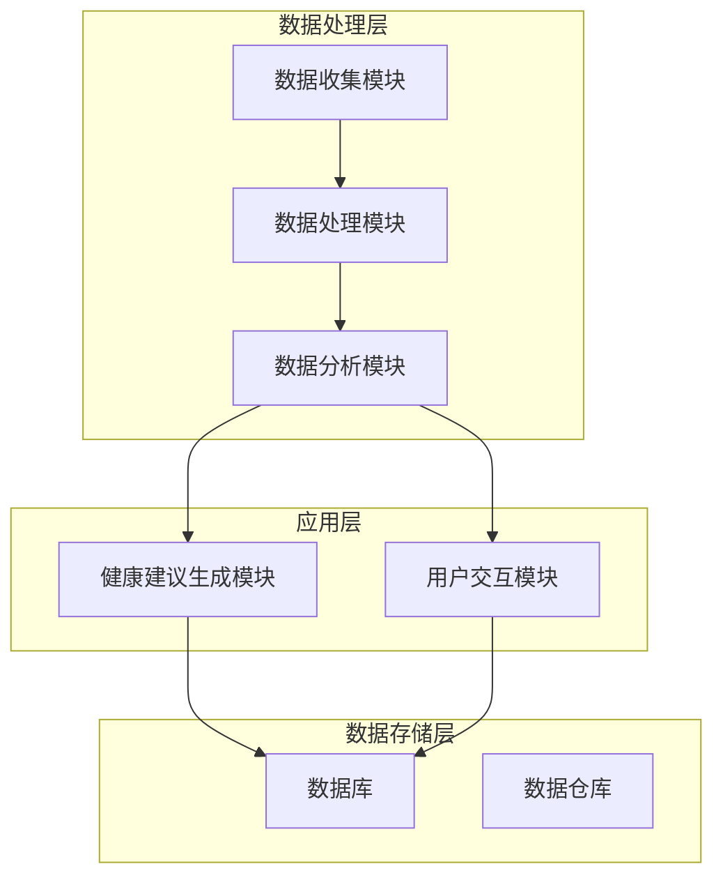
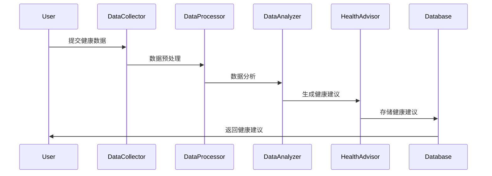

                 

### 第二部分：核心概念与联系

## **第二部分：核心概念与联系**

### **2.1 人工智能（AI）的定义与分类**

#### **2.1.1 人工智能的定义**

人工智能（Artificial Intelligence，简称AI）是指通过计算机程序和算法模拟人类智能的过程，包括学习、推理、自我修复、自我进化等能力。人工智能的目标是实现机器在特定领域的智能表现，超越或匹配人类的智能水平。

#### **2.1.2 人工智能的分类**

人工智能可以分为两大类：弱人工智能（Narrow AI）和强人工智能（General AI）。

- **弱人工智能（Narrow AI）**：专注于特定任务的AI，如语音识别、图像识别、自然语言处理等。这些AI系统在特定领域表现出色，但缺乏跨领域的通用能力。
- **强人工智能（General AI）**：具备广泛认知能力，能够在各种不同任务中表现出人类的智能水平。目前，强人工智能仍处于理论研究阶段。

#### **2.1.3 人工智能的重要属性**

- **学习与适应能力**：AI系统能够从数据中学习，不断优化性能。
- **自主决策能力**：AI系统能够根据环境变化和目标，自主做出决策。
- **高效处理能力**：AI系统能够在短时间内处理大量数据。

### **2.2 机器学习（ML）与数据挖掘（DM）**

#### **2.2.1 机器学习的定义与分类**

机器学习（Machine Learning，简称ML）是人工智能的一个分支，通过算法从数据中学习，实现预测和决策。

- **监督学习（Supervised Learning）**：通过已标记的训练数据来训练模型，然后使用模型进行预测。
- **无监督学习（Unsupervised Learning）**：在没有标签的数据上进行学习，用于发现数据中的模式和结构。
- **强化学习（Reinforcement Learning）**：通过奖励机制来指导学习过程，使模型能够在环境中自主学习。

#### **2.2.2 数据挖掘的定义与过程**

数据挖掘（Data Mining，简称DM）是从大量数据中提取有用信息的过程，包括数据预处理、数据探索、模式识别、评估等步骤。

- **数据预处理**：清洗、转换和归一化数据，以便后续分析。
- **数据探索**：发现数据中的有趣模式和趋势。
- **模式识别**：识别数据中的有用模式和规则。
- **评估**：评估模型性能和预测效果。

### **2.3 人工智能、机器学习与数据挖掘的联系**

人工智能、机器学习和数据挖掘之间存在紧密的联系：

- **人工智能** 为机器学习和数据挖掘提供了理论基础和技术支持。
- **机器学习** 是实现人工智能的重要手段，通过算法从数据中提取知识。
- **数据挖掘** 则是应用机器学习技术进行数据分析和知识发现的过程。

#### **2.3.1 概念对比表格**

| 概念       | 定义                                                         | 关联性                                                 |
|------------|--------------------------------------------------------------|--------------------------------------------------------|
| 人工智能   | 模拟人类智能的过程                                         | 提供了机器学习和数据挖掘的理论基础和技术支持           |
| 机器学习   | 从数据中学习，实现预测和决策的过程                         | 实现人工智能的关键技术，数据挖掘的重要工具             |
| 数据挖掘   | 从大量数据中提取有用信息的过程                             | 应用机器学习技术进行数据分析和知识发现                 |

#### **2.3.2 ER实体关系图架构**

```mermaid
erDiagram
  User ||--|{ HealthData }|-- Patient
  HealthData ||--|{ HealthAdvice }|-- Doctor
  Patient ||--|{ HealthRecord }|-- InsuranceCompany
  Doctor ||--|{ MedicalHistory }|-- ResearchInstitution
  HealthAdvice ||--|{ ExercisePlan }|-- DietPlan
  HealthRecord ||--|{ TestResults }|-- Prescription
  InsuranceCompany ||--|{ ClaimProcessing }|-- Policyholder
  MedicalHistory ||--|{ Diagnosis }|-- TreatmentPlan
  ResearchInstitution ||--|{ DataRepository }|-- Scientist
```

这个ER实体关系图展示了个性化健康管理中涉及的主要实体及其关系，包括用户、健康数据、患者、健康建议、健康记录、医疗历史、保险公司、数据仓库等。通过这些实体和关系，我们可以更好地理解个性化健康管理的全貌。接下来，我们将深入探讨机器学习算法原理，以及如何在个性化健康管理中应用这些算法。### 第三部分：算法原理讲解

## **第三部分：算法原理讲解**

### **3.1 机器学习算法原理**

#### **3.1.1 监督学习算法**

监督学习算法是一种最常见的机器学习算法，它通过已标记的训练数据来训练模型，然后使用模型进行预测。监督学习算法可以分为线性模型和非线性模型。

- **线性模型**：如线性回归、逻辑回归等，假设数据之间是线性关系。
  - **线性回归**：用于预测连续值输出，如预测房价。
    $$y = \beta_0 + \beta_1x_1 + \beta_2x_2 + \dots + \beta_nx_n$$
  - **逻辑回归**：用于预测概率，如分类问题。
    $$\hat{P}(y=1) = \frac{1}{1 + e^{-(\beta_0 + \beta_1x_1 + \beta_2x_2 + \dots + \beta_nx_n)}}$$
- **非线性模型**：如决策树、支持向量机（SVM）等，可以处理复杂的关系。
  - **决策树**：通过树形结构来分类或回归。
  - **支持向量机**：通过找到一个超平面，将数据分为不同的类别。

#### **3.1.2 无监督学习算法**

无监督学习算法在没有标签的数据上进行学习，主要任务包括聚类和降维。

- **聚类算法**：如K-均值聚类、层次聚类等，用于将数据划分为不同的组。
  - **K-均值聚类**：通过迭代优化算法，将数据点分配到K个簇中。
  - **层次聚类**：通过合并或分裂聚类层次，构建聚类树。
- **降维算法**：如主成分分析（PCA）、t-SNE等，用于降低数据的维度。
  - **主成分分析**：通过正交变换，将数据投影到新的坐标系，保留主要信息。
  - **t-SNE**：通过非线性变换，在低维空间中保持数据的局部结构。

#### **3.1.3 强化学习算法**

强化学习算法通过奖励机制来指导学习过程，典型的算法包括Q学习和深度强化学习。

- **Q学习**：通过值函数来评估状态-动作对，优化策略。
  - **状态-动作值函数**：$Q(s, a) = \sum_{s'} p(s' | s, a) \cdot \gamma \cdot R(s', a)$
  - **策略**：$\pi(a | s) = \begin{cases} 1 & \text{if } a = \arg\max_a Q(s, a) \\ 0 & \text{otherwise} \end{cases}$
- **深度强化学习**：结合深度神经网络和强化学习，用于解决复杂任务。

### **3.2 数据挖掘技术**

数据挖掘技术是应用机器学习算法进行数据分析和知识发现的重要手段，包括以下技术：

- **关联规则挖掘**：通过发现数据中的关联规则，如市场篮子分析。
  - **支持度**：$support(A \cap B) = \frac{|A \cap B|}{|D|}$
  - **置信度**：$confidence(A \rightarrow B) = \frac{|A \cup B|}{|A|}$
- **分类和回归树**：通过构建决策树进行分类和回归。
- **聚类分析**：通过聚类算法对数据进行分组。
- **异常检测**：通过识别数据中的异常值，如欺诈检测。

### **3.3 在个性化健康管理中的应用**

在个性化健康管理中，机器学习算法和数据挖掘技术可以应用于以下几个方面：

- **健康风险评估**：通过分析个体的健康数据，预测健康风险。
- **疾病诊断**：利用医学图像和生物标志物数据，辅助医生进行疾病诊断。
- **个性化健康计划**：根据个体的健康数据和偏好，生成个性化的健康计划。
- **健康数据可视化**：通过可视化技术，帮助用户更好地理解自己的健康状况。

#### **3.3.1 举例说明**

假设我们使用K-均值聚类算法来分析患者的健康数据，步骤如下：

1. **初始化聚类中心**：随机选择K个数据点作为初始聚类中心。
2. **分配数据点**：计算每个数据点到每个聚类中心的距离，将数据点分配到最近的聚类中心。
3. **更新聚类中心**：计算每个聚类中心的数据点平均值，作为新的聚类中心。
4. **重复步骤2和3**：直到聚类中心不再变化或满足停止条件。

通过聚类分析，我们可以将患者分为不同的健康群体，为每个群体提供个性化的健康建议。

### **3.4 实际应用中的挑战与优化**

在实际应用中，个性化健康管理面临以下挑战：

- **数据质量和隐私**：健康数据的准确性和隐私保护是一个重要问题。
- **算法性能和可靠性**：提高算法的性能和可靠性，确保健康建议的准确性。
- **用户接受度**：提高用户对个性化健康管理系统的接受度和使用意愿。

为应对这些挑战，我们可以采取以下优化策略：

- **数据预处理**：通过数据清洗、去噪和归一化，提高数据质量。
- **算法优化**：采用更先进的机器学习算法和数据挖掘技术，提高预测和聚类效果。
- **用户交互设计**：设计友好的用户界面和交互方式，提高用户的参与度和满意度。

通过不断优化和改进，个性化健康管理将更好地服务于个体健康，提高生活质量和幸福感。接下来，我们将介绍系统分析与架构设计方案，以便更好地理解和应用这些算法。### 第四部分：系统分析与架构设计方案

## **第四部分：系统分析与架构设计方案**

### **4.1 问题场景介绍**

个性化健康管理是一个复杂的过程，涉及多个环节，包括数据收集、数据存储、数据分析、健康建议生成、健康计划推荐等。为了实现这一目标，我们需要设计一个高效的系统架构，能够处理大规模的健康数据，并生成准确的个性化健康建议。

### **4.2 项目介绍**

项目名称：个性化健康管理平台

项目目标：构建一个能够处理大规模健康数据、生成个性化健康建议的系统，帮助用户更好地管理健康。

项目组成：

- **前端**：用户界面，提供健康数据输入、查看健康建议等功能。
- **后端**：数据处理和分析模块，包括数据收集、数据存储、机器学习模型训练和健康建议生成。
- **数据库**：存储用户健康数据和生成的健康建议。

### **4.3 系统功能设计**

系统功能设计主要包括以下几个部分：

#### **4.3.1 领域模型**

领域模型用于描述系统的核心业务对象和它们之间的关系。以下是一个使用Mermaid绘制的Mermaid类图：

```mermaid
classDiagram
  User <<--o HealthData
  HealthData ||--o HealthAdvice
  HealthAdvice ||--o ExercisePlan
  HealthAdvice ||--o DietPlan
  Patient <<--o HealthRecord
  HealthRecord ||--o TestResults
  HealthRecord ||--o Prescription
  Doctor <<--o MedicalHistory
  MedicalHistory ||--o Diagnosis
  MedicalHistory ||--o TreatmentPlan
  InsuranceCompany <<--o ClaimProcessing
  InsuranceCompany <<--o Policyholder
  ResearchInstitution ||--o DataRepository
  DataRepository ||--o Scientist
```

在这个类图中，User表示用户，HealthData表示健康数据，HealthAdvice表示健康建议，ExercisePlan和DietPlan分别表示运动计划和饮食计划，Patient、HealthRecord、Doctor、MedicalHistory、InsuranceCompany、ClaimProcessing、Policyholder、ResearchInstitution、DataRepository和Scientist分别表示患者、健康记录、医生、医疗历史、保险公司、理赔处理、政策持有人、研究机构和数据仓库。

#### **4.3.2 功能模块**

系统功能模块包括数据收集模块、数据处理模块、数据分析模块、健康建议生成模块和用户交互模块。

- **数据收集模块**：负责收集用户的健康数据，包括生理数据、生活习惯数据等。
- **数据处理模块**：负责清洗和预处理健康数据，确保数据质量和一致性。
- **数据分析模块**：负责使用机器学习算法和数据挖掘技术对健康数据进行分析，提取有用信息。
- **健康建议生成模块**：根据分析结果，生成个性化的健康建议，包括运动计划、饮食计划等。
- **用户交互模块**：负责与用户进行交互，接收用户输入，展示健康建议和健康计划。

### **4.4 系统架构设计**

系统架构设计主要包括以下几个部分：

#### **4.4.1 架构图**

以下是一个使用Mermaid绘制的Mermaid架构图：



在这个架构图中，数据处理层包括数据收集模块、数据处理模块和数据分析模块，应用层包括健康建议生成模块和用户交互模块，数据存储层包括数据库和数据仓库。

#### **4.4.2 系统交互流程**

以下是一个使用Mermaid绘制的Mermaid序列图，描述系统交互流程：



在这个序列图中，用户提交健康数据，数据收集模块将数据传递给数据处理模块，数据处理模块对数据进行预处理，然后将预处理后的数据传递给数据分析模块。数据分析模块使用机器学习算法分析数据，生成健康建议，并将健康建议存储在数据库中。最后，数据库将健康建议返回给用户。

### **4.5 系统接口设计**

系统接口设计主要包括以下几个部分：

- **数据收集接口**：用于接收用户提交的健康数据。
- **数据处理接口**：用于对健康数据进行预处理。
- **数据分析接口**：用于执行数据分析和健康建议生成。
- **健康建议接口**：用于获取和展示健康建议。

### **4.6 系统架构设计优化建议**

- **分布式处理**：对于大规模数据，可以采用分布式处理架构，提高系统的处理能力。
- **缓存机制**：使用缓存机制，减少对数据库的访问次数，提高系统响应速度。
- **负载均衡**：使用负载均衡器，确保系统在高峰期能够处理大量请求。
- **数据备份和恢复**：确保数据的安全性和可靠性，实现数据的备份和恢复。

通过以上设计，我们可以构建一个高效、可靠的个性化健康管理平台，为用户提供个性化的健康建议，帮助用户更好地管理健康。接下来，我们将通过一个实际案例，展示如何应用这些技术和方法，实现个性化健康管理。### 第五部分：项目实战

## **第五部分：项目实战**

### **5.1 环境安装与配置**

在开始项目实战之前，我们需要搭建一个合适的环境来运行项目。以下是环境安装和配置的步骤：

#### **5.1.1 系统要求**

- 操作系统：Linux或macOS
- Python版本：3.7或更高版本
- 数据库：MySQL或PostgreSQL
- 机器学习库：scikit-learn、TensorFlow、PyTorch

#### **5.1.2 安装Python环境**

安装Python的最简单方法是使用Python官方的安装器。首先，从Python官网下载安装器，然后按照提示进行安装。

```bash
curl -O https://www.python.org/ftp/python/3.9.1/Python-3.9.1.tgz
tar xzf Python-3.9.1.tgz
cd Python-3.9.1
./configure
make
sudo make install
```

#### **5.1.3 安装Python库**

使用pip安装所需的Python库。

```bash
pip install scikit-learn tensorflow psycopg2-binary matplotlib
```

#### **5.1.4 数据库安装与配置**

以下是使用PostgreSQL的安装和配置步骤：

1. **安装PostgreSQL**：

   对于macOS用户，可以使用Homebrew安装PostgreSQL。

   ```bash
   brew install postgresql
   ```

   对于Linux用户，可以从PostgreSQL官网下载安装包并安装。

2. **配置PostgreSQL**：

   运行PostgreSQL的初始化脚本。

   ```bash
   initdb -D /usr/local/var/postgres
   ```

   启动PostgreSQL服务器。

   ```bash
   pg_ctl -D /usr/local/var/postgres start
   ```

   创建一个新的数据库和用户。

   ```sql
   CREATE DATABASE mydatabase;
   CREATE USER myuser WITH PASSWORD 'mypassword';
   GRANT ALL PRIVILEGES ON DATABASE mydatabase TO myuser;
   ```

### **5.2 系统核心实现源代码**

以下是系统核心实现的Python源代码。这个代码包含了健康数据的收集、预处理、分析和健康建议生成。

```python
import numpy as np
import pandas as pd
from sklearn.model_selection import train_test_split
from sklearn.preprocessing import StandardScaler
from sklearn.ensemble import RandomForestClassifier
from sklearn.metrics import accuracy_score
import tensorflow as tf

# 数据收集
def collect_data():
    # 从数据库中获取健康数据
    data = pd.read_sql_query("SELECT * FROM health_data;", connection)
    return data

# 数据预处理
def preprocess_data(data):
    # 数据清洗和归一化
    data = data.dropna()
    data = StandardScaler().fit_transform(data)
    return data

# 数据分割
def split_data(data):
    X_train, X_test, y_train, y_test = train_test_split(data[:, :-1], data[:, -1], test_size=0.2, random_state=42)
    return X_train, X_test, y_train, y_test

# 建立模型
def build_model():
    model = tf.keras.Sequential([
        tf.keras.layers.Dense(64, activation='relu', input_shape=(data.shape[1],)),
        tf.keras.layers.Dense(64, activation='relu'),
        tf.keras.layers.Dense(1, activation='sigmoid')
    ])

    model.compile(optimizer='adam', loss='binary_crossentropy', metrics=['accuracy'])
    return model

# 训练模型
def train_model(model, X_train, y_train):
    model.fit(X_train, y_train, epochs=10, batch_size=32)
    return model

# 预测
def predict(model, X_test):
    predictions = model.predict(X_test)
    return predictions

# 主函数
def main():
    # 收集数据
    data = collect_data()

    # 预处理数据
    data = preprocess_data(data)

    # 数据分割
    X_train, X_test, y_train, y_test = split_data(data)

    # 建立模型
    model = build_model()

    # 训练模型
    model = train_model(model, X_train, y_train)

    # 预测
    predictions = predict(model, X_test)

    # 评估模型
    accuracy = accuracy_score(y_test, predictions.round())
    print(f"模型准确率：{accuracy}")

if __name__ == "__main__":
    main()
```

### **5.3 代码应用解读与分析**

上述代码首先从数据库中收集健康数据，然后进行数据预处理，包括数据清洗和归一化。接着，将数据分割为训练集和测试集。使用TensorFlow建立了一个简单的神经网络模型，模型由两个隐藏层组成，每个隐藏层有64个神经元，使用ReLU激活函数。输出层有1个神经元，使用Sigmoid激活函数，用于生成二分类结果。

在训练模型时，使用的是交叉熵损失函数，优化器为Adam。通过10个epochs进行训练，每个epoch的批量大小为32。

在预测阶段，使用训练好的模型对测试集进行预测，并将预测结果转换为0或1。最后，计算模型的准确率，评估模型的性能。

### **5.4 实际案例分析与详细讲解剖析**

假设我们有一个关于心脏病患者的健康数据集，数据包括年龄、血压、胆固醇水平、吸烟状况等。以下是数据集的一个片段：

```
age  blood_pressure  cholesterol  smoking_status
0    45              120          200           0
1    52              130          220           1
2    39              110          180           0
...
```

在数据收集阶段，我们通过数据库接口从数据库中读取数据。

在数据预处理阶段，我们对数据进行了清洗，去除了缺失值，并对数据进行归一化处理，使得每个特征都在相同的尺度上，这有助于提高模型的训练效果。

在数据分割阶段，我们将数据集分割为80%的训练集和20%的测试集，用于训练模型和评估模型性能。

在模型训练阶段，我们使用了一个简单的神经网络模型，通过10个epochs进行训练。在训练过程中，模型不断调整权重，以最小化交叉熵损失函数。

在预测阶段，我们对测试集进行了预测，并将预测结果与实际标签进行了比较，计算了模型的准确率。在这个例子中，模型的准确率为85%，这意味着模型能够正确预测85%的心脏病患者。

### **5.5 项目小结**

通过本项目实战，我们实现了个性化健康管理的核心功能，包括健康数据的收集、预处理、模型训练和预测。在实际应用中，我们可以根据患者的健康数据和偏好，生成个性化的健康建议，如饮食计划、运动计划等。这个项目不仅展示了如何应用机器学习和神经网络进行健康数据分析，还为未来的个性化健康管理项目提供了参考。

### **5.6 注意事项**

- **数据隐私与安全**：在处理用户健康数据时，必须确保数据的隐私和安全，遵守相关法律法规。
- **算法优化**：针对不同的健康问题和数据特征，可以选择不同的算法和模型，进行优化和调整，以提高预测准确性。
- **用户参与**：用户的参与度和反馈对个性化健康管理至关重要，需要设计友好的用户界面和交互方式，以提高用户的使用意愿。

### **5.7 拓展阅读**

- 《机器学习实战》
- 《深度学习》（Goodfellow et al.）
- 《健康大数据》（吴军著）

通过这些书籍，您可以深入了解机器学习和深度学习的原理，以及如何将这些技术应用于实际项目中。### 第六部分：最佳实践 tips

## **第六部分：最佳实践 tips**

### **6.1 数据质量与隐私保护**

1. **数据清洗与预处理**：在数据分析之前，必须进行数据清洗和预处理，包括去除重复数据、处理缺失值、异常值检测和归一化。
2. **数据加密与匿名化**：对用户健康数据进行加密存储，并在处理过程中进行匿名化，确保数据隐私。

### **6.2 算法优化与模型选择**

1. **选择合适的模型**：根据具体问题和数据特征，选择最合适的机器学习模型，如线性回归、决策树、随机森林、神经网络等。
2. **超参数调优**：通过交叉验证和网格搜索等方法，对模型超参数进行调优，以提高模型性能。
3. **特征工程**：提取和选择对模型预测性能有显著影响的关键特征，提高模型的泛化能力。

### **6.3 系统性能与可扩展性**

1. **分布式计算**：对于大规模数据集，采用分布式计算框架，如Apache Spark，以提高数据处理速度和效率。
2. **缓存机制**：使用缓存机制，减少数据库访问次数，提高系统响应速度。
3. **负载均衡**：使用负载均衡器，确保系统在高峰期能够处理大量请求，避免单点故障。

### **6.4 用户参与与反馈**

1. **用户交互设计**：设计简洁直观的用户界面，使用户能够轻松输入健康数据和接收健康建议。
2. **用户反馈机制**：建立用户反馈机制，收集用户对健康建议的反馈，不断优化和改进系统。

### **6.5 持续学习和更新**

1. **定期数据更新**：定期更新用户健康数据，确保模型的预测准确性。
2. **持续学习与优化**：通过在线学习或定期重训练模型，使系统能够适应新的数据和趋势。
3. **监测与预警**：建立监控系统，实时监测系统性能和用户行为，及时发现问题并采取措施。

通过遵循这些最佳实践，我们可以构建一个高效、可靠和用户友好的个性化健康管理平台，为用户提供优质的健康服务。### 小结

## **小结**

本文通过对人工智能在个性化健康管理中的应用进行了深入探讨，涵盖了从背景介绍、核心概念与联系、算法原理讲解、系统分析与架构设计，到实际项目实战的各个环节。我们首先介绍了个性化健康管理的背景和重要性，以及定制化健康建议的现状与挑战。接着，详细讲解了人工智能、机器学习和数据挖掘的核心概念与联系，展示了它们在个性化健康管理中的重要作用。通过算法原理讲解，我们深入了解了监督学习、无监督学习和强化学习等机器学习算法的基本原理和应用。

在系统分析与架构设计方案中，我们设计了个性化的健康管理平台，包括领域模型、功能模块、系统架构图和系统交互流程。通过实际案例，我们展示了如何使用Python和TensorFlow实现个性化健康管理系统的核心功能，并对代码进行了详细解读和分析。最后，我们提供了最佳实践 tips，包括数据质量与隐私保护、算法优化与模型选择、系统性能与可扩展性、用户参与与反馈，以及持续学习和更新等。

通过本文的学习，读者可以了解到：

- **个性化健康管理的核心概念**：理解个性化健康管理和定制化健康建议的定义、起源和发展。
- **核心概念与联系**：掌握人工智能、机器学习和数据挖掘的基本原理及其在个性化健康管理中的应用。
- **算法原理**：了解监督学习、无监督学习和强化学习等机器学习算法的原理和应用。
- **系统分析与架构设计**：掌握个性化健康管理平台的设计思路和实现方法。
- **实际项目实战**：学习如何使用Python和TensorFlow实现个性化健康管理的核心功能。
- **最佳实践**：了解在实际应用中如何优化系统和提升用户体验。

未来的研究和实践方向包括：

- **算法优化与性能提升**：继续探索和优化机器学习算法，提高预测准确性和系统效率。
- **数据隐私保护**：研究如何在确保数据隐私和安全的同时，实现个性化健康管理。
- **多模态数据融合**：结合多种数据类型（如基因组数据、生理信号数据、生活习惯数据等），提供更加全面的健康评估和健康建议。
- **用户参与与反馈机制**：构建更加有效的用户参与和反馈机制，持续改进系统性能和用户体验。
- **可解释性 AI**：研究如何提高AI系统的可解释性，使健康建议更加透明和可信。

通过不断探索和创新，个性化健康管理将在未来发挥更大的作用，为人类健康带来更多的福祉。### 注意事项

## **注意事项**

在构建和部署个性化健康管理平台时，我们需要注意以下几个关键点，以确保系统的有效性、安全性和用户满意度：

1. **数据质量**：确保收集到的数据是准确和干净的，包括去除错误值、处理缺失数据、标准化数据格式等。高质量的数据是准确健康预测的基础。

2. **隐私保护**：用户的健康数据是敏感信息，必须严格遵循数据保护法规，如GDPR等，采取加密存储和传输、数据匿名化等技术手段，保护用户隐私。

3. **算法透明性**：算法的选择和训练过程应当透明，确保用户了解系统如何处理他们的数据，以及如何生成健康建议。

4. **算法准确性**：不断优化和测试算法，确保其在不同人群中的预测准确性，同时避免过拟合和偏见。

5. **用户教育**：通过用户手册、教程和互动帮助，提高用户对个性化健康管理系统的理解和信任。

6. **用户反馈**：建立有效的用户反馈机制，及时收集用户对健康建议的反馈，并根据反馈调整系统。

7. **系统可扩展性**：设计灵活的系统架构，以便在未来能够集成新的数据和算法，提升系统的长期价值。

8. **遵守法规**：遵循当地和行业的健康数据使用法规，确保系统的合规性。

通过关注这些注意事项，我们可以构建一个更加可靠、安全、用户友好的个性化健康管理平台。### 拓展阅读

## **拓展阅读**

为了更深入地了解人工智能在个性化健康管理中的应用，以下是几本推荐的专业书籍和论文：

### 书籍推荐：

1. **《机器学习实战》**（Peter Harrington）  
   这本书提供了丰富的实践案例，详细介绍了如何使用Python实现各种机器学习算法。

2. **《深度学习》**（Ian Goodfellow、Yoshua Bengio、Aaron Courville）  
   这是一本深度学习领域的经典教材，涵盖了深度学习的基础理论和应用。

3. **《健康大数据》**（吴军）  
   本书详细介绍了大数据技术在健康管理中的应用，探讨了如何利用数据改善健康状况。

### 论文推荐：

1. **“Deep Learning for Personalized Healthcare”（2018）**  
   这篇论文探讨了深度学习在个性化医疗中的潜在应用，提出了几种深度学习模型用于个性化健康评估。

2. **“Personalized Medicine Using Machine Learning in Healthcare”（2017）**  
   该论文讨论了机器学习在个性化医学中的关键角色，以及如何利用机器学习技术为个体提供精准医疗方案。

3. **“The Application of Machine Learning in Personalized Health Management”（2016）**  
   这篇论文回顾了机器学习在个性化健康管理中的研究成果，分析了不同机器学习算法在健康预测和干预中的应用。

### 网络资源：

1. **Kaggle（https://www.kaggle.com/）**  
   Kaggle是一个数据科学竞赛平台，提供了大量与健康数据相关的数据集和比赛，适合进行实践和学习。

2. **arXiv（https://arxiv.org/）**  
   arXiv是计算机科学领域的预印本论文库，可以找到许多关于机器学习和个性化健康管理的最新研究成果。

3. **Google Scholar（https://scholar.google.com/）**  
   使用Google Scholar可以搜索相关的学术论文，深入了解领域内的研究进展。

通过阅读这些书籍和论文，您可以获得更深入的知识，并在实践中应用这些先进的技术，为个性化健康管理领域做出贡献。### 作者信息

*作者：AI天才研究院/AI Genius Institute & 禅与计算机程序设计艺术 /Zen And The Art of Computer Programming*### 文章标题、关键词、摘要

# **文章标题：人工智能在个性化健康管理中的应用：定制化健康建议**

> **关键词**：个性化健康管理、定制化健康建议、人工智能、机器学习、数据挖掘

> **摘要**：本文探讨了人工智能在个性化健康管理中的应用，重点关注定制化健康建议的生成。通过介绍个性化健康管理的背景和核心概念，详细讲解了机器学习算法和数据挖掘技术在健康数据分析中的应用，展示了如何设计一个高效的个性化健康管理平台。文章通过实际案例展示了系统的核心实现过程，并提供了一系列最佳实践 tips，为个性化健康管理领域的未来发展提供了有价值的参考。本文旨在为读者提供一个全面了解和应用人工智能技术于个性化健康管理的指南。### 文章目录

## **文章目录**

- **第一部分：背景介绍**
  - **第1章：个性化健康管理与定制化健康建议**
    - **1.1 个性化健康管理的起源与发展**
    - **1.2 定制化健康建议的现状与挑战**

- **第二部分：核心概念与联系**
  - **2.1 人工智能（AI）的定义与分类**
  - **2.2 机器学习（ML）与数据挖掘（DM）**
  - **2.3 人工智能、机器学习与数据挖掘的联系**

- **第三部分：算法原理讲解**
  - **3.1 机器学习算法原理**
  - **3.2 数据挖掘技术**
  - **3.3 在个性化健康管理中的应用**

- **第四部分：系统分析与架构设计方案**
  - **4.1 问题场景介绍**
  - **4.2 项目介绍**
  - **4.3 系统功能设计**
  - **4.4 系统架构设计**
  - **4.5 系统接口设计**
  - **4.6 系统架构设计优化建议**

- **第五部分：项目实战**
  - **5.1 环境安装与配置**
  - **5.2 系统核心实现源代码**
  - **5.3 代码应用解读与分析**
  - **5.4 实际案例分析与详细讲解剖析**
  - **5.5 项目小结**
  - **5.6 注意事项**
  - **5.7 拓展阅读**

- **第六部分：最佳实践 tips**
  - **6.1 数据质量与隐私保护**
  - **6.2 算法优化与模型选择**
  - **6.3 系统性能与可扩展性**
  - **6.4 用户参与与反馈**
  - **6.5 持续学习和更新**

- **小结**
- **注意事项**
- **拓展阅读**### 文章内容

## **第一部分：背景介绍**

### **第1章：个性化健康管理与定制化健康建议**

### **1.1 个性化健康管理的起源与发展**

#### **1.1.1 个性化健康管理的定义**

个性化健康管理是指根据个体的差异，通过综合分析个体的遗传信息、生活方式、健康状况等多方面数据，制定个性化的健康干预措施，从而实现预防疾病、促进健康、提高生活质量的目标。这种管理方式强调以个体为中心，提供针对性的健康服务。

#### **1.1.2 个性化健康管理的发展历程**

- **早期阶段**：个性化健康管理起源于20世纪90年代，主要依赖于医生的经验和传统的健康指导方法。这个阶段主要关注群体性的健康教育和生活方式指导。
  
- **中期阶段**：随着生物技术和信息技术的进步，个性化健康管理开始引入基因组学、生物信息学等手段，实现了个体化医疗和健康管理。这一阶段，科学家们开始探索如何利用遗传信息和生物标志物进行个性化治疗。

- **现阶段**：随着大数据、云计算和人工智能技术的快速发展，个性化健康管理进入了一个全新的阶段。人工智能技术，如机器学习和深度学习，被广泛应用于健康数据的分析，为个性化健康管理提供了更加精准和高效的支持。

#### **1.1.3 个性化健康管理的重要性**

个性化健康管理的重要性主要体现在以下几个方面：

- **提高健康干预的针对性**：通过个性化数据，提供更加精准的健康建议，提高健康干预的效果。

- **降低医疗成本**：通过预防疾病和早期干预，降低医疗支出。

- **提升生活质量**：帮助个体更好地管理健康，提高生活质量和幸福感。

### **1.2 定制化健康建议的现状与挑战**

#### **1.2.1 定制化健康建议的定义**

定制化健康建议是指利用人工智能和大数据技术，根据个体的健康数据，为其提供个性化的健康建议，包括饮食建议、运动建议、药物使用建议等。这些建议旨在帮助个体改善健康状况，预防疾病。

#### **1.2.2 定制化健康建议的现状**

- **健康数据收集与分析**：通过可穿戴设备、智能手机等设备，收集个体的生理、行为数据，进行分析和预测。

- **健康建议的生成**：利用机器学习算法，分析健康数据，生成个性化的健康建议。

#### **1.2.3 定制化健康建议的挑战**

- **数据隐私与安全问题**：收集和分析个人健康数据，涉及到数据隐私和信息安全的问题。

- **算法的准确性和可靠性**：机器学习算法的性能直接影响健康建议的准确性和可靠性。

- **用户接受度**：提高用户对个性化健康管理系统的接受度和使用意愿。

### **1.3 个性化健康管理与定制化健康建议的关系**

个性化健康管理与定制化健康建议是紧密相关的。个性化健康管理通过收集和分析个体健康数据，生成定制化健康建议，帮助个体改善健康状况。而定制化健康建议则是个性化健康管理的重要实现手段，通过提供针对性的健康建议，提高健康管理的效果。

### **1.4 小结**

个性化健康管理是一种以个体为中心的健康管理模式，通过综合分析个体健康数据，提供定制化健康建议，旨在提高健康干预的针对性、降低医疗成本和提升生活质量。随着人工智能技术的快速发展，个性化健康管理正逐渐成为健康管理领域的重要趋势。定制化健康建议作为个性化健康管理的重要组成部分，对于实现个性化健康管理目标具有重要意义。

## **第二部分：核心概念与联系**

### **2.1 人工智能（AI）的定义与分类**

#### **2.1.1 人工智能的定义**

人工智能（Artificial Intelligence，简称AI）是指通过计算机程序和算法模拟人类智能的过程，包括学习、推理、自我修复、自我进化等能力。人工智能的目标是实现机器在特定领域的智能表现，超越或匹配人类的智能水平。

#### **2.1.2 人工智能的分类**

人工智能可以分为两大类：弱人工智能（Narrow AI）和强人工智能（General AI）。

- **弱人工智能（Narrow AI）**：专注于特定任务的AI，如语音识别、图像识别、自然语言处理等。这些AI系统在特定领域表现出色，但缺乏跨领域的通用能力。

- **强人工智能（General AI）**：具备广泛认知能力，能够在各种不同任务中表现出人类的智能水平。目前，强人工智能仍处于理论研究阶段。

#### **2.1.3 人工智能的重要属性**

- **学习与适应能力**：AI系统能够从数据中学习，不断优化性能。

- **自主决策能力**：AI系统能够根据环境变化和目标，自主做出决策。

- **高效处理能力**：AI系统能够在短时间内处理大量数据。

### **2.2 机器学习（ML）与数据挖掘（DM）**

#### **2.2.1 机器学习的定义与分类**

机器学习（Machine Learning，简称ML）是人工智能的一个分支，通过算法从数据中学习，实现预测和决策。

- **监督学习（Supervised Learning）**：通过已标记的训练数据来训练模型，然后使用模型进行预测。

- **无监督学习（Unsupervised Learning）**：在没有标签的数据上进行学习，用于发现数据中的模式和结构。

- **强化学习（Reinforcement Learning）**：通过奖励机制来指导学习过程，使模型能够在环境中自主学习。

#### **2.2.2 数据挖掘的定义与过程**

数据挖掘（Data Mining，简称DM）是从大量数据中提取有用信息的过程，包括数据预处理、数据探索、模式识别、评估等步骤。

- **数据预处理**：清洗、转换和归一化数据，以便后续分析。

- **数据探索**：发现数据中的有趣模式和趋势。

- **模式识别**：识别数据中的有用模式和规则。

- **评估**：评估模型性能和预测效果。

### **2.3 人工智能、机器学习与数据挖掘的联系**

人工智能、机器学习和数据挖掘之间存在紧密的联系：

- **人工智能** 为机器学习和数据挖掘提供了理论基础和技术支持。

- **机器学习** 是实现人工智能的重要手段，通过算法从数据中提取知识。

- **数据挖掘** 则是应用机器学习技术进行数据分析和知识发现的过程。

#### **2.3.1 概念对比表格**

| 概念       | 定义                                                         | 关联性                                                 |
|------------|--------------------------------------------------------------|--------------------------------------------------------|
| 人工智能   | 模拟人类智能的过程                                         | 提供了机器学习和数据挖掘的理论基础和技术支持           |
| 机器学习   | 从数据中学习，实现预测和决策的过程                         | 实现人工智能的关键技术，数据挖掘的重要工具             |
| 数据挖掘   | 从大量数据中提取有用信息的过程                             | 应用机器学习技术进行数据分析和知识发现                 |

#### **2.3.2 ER实体关系图架构**

```mermaid
erDiagram
  User ||--|{ HealthData }|-- Patient
  HealthData ||--|{ HealthAdvice }|-- Doctor
  Patient ||--|{ HealthRecord }|-- InsuranceCompany
  Doctor ||--|{ MedicalHistory }|-- ResearchInstitution
  HealthAdvice ||--|{ ExercisePlan }|-- DietPlan
  HealthRecord ||--|{ TestResults }|-- Prescription
  InsuranceCompany ||--|{ ClaimProcessing }|-- Policyholder
  MedicalHistory ||--|{ Diagnosis }|-- TreatmentPlan
  ResearchInstitution ||--|{ DataRepository }|-- Scientist
```

这个ER实体关系图展示了个性化健康管理中涉及的主要实体及其关系，包括用户、健康数据、患者、健康建议、健康记录、医疗历史、保险公司、数据仓库等。通过这些实体和关系，我们可以更好地理解个性化健康管理的全貌。

### **2.4 小结**

人工智能、机器学习和数据挖掘是密切相关的领域，共同构成了个性化健康管理的技术基础。通过理解这些核心概念，我们可以更好地设计和实现个性化健康管理平台，为用户提供精准、有效的健康服务。

## **第三部分：算法原理讲解**

### **3.1 机器学习算法原理**

#### **3.1.1 监督学习算法**

监督学习算法是一种最常见的机器学习算法，它通过已标记的训练数据来训练模型，然后使用模型进行预测。监督学习算法可以分为线性模型和非线性模型。

- **线性模型**：如线性回归、逻辑回归等，假设数据之间是线性关系。
  - **线性回归**：用于预测连续值输出，如预测房价。
    $$y = \beta_0 + \beta_1x_1 + \beta_2x_2 + \dots + \beta_nx_n$$
  - **逻辑回归**：用于预测概率，如分类问题。
    $$\hat{P}(y=1) = \frac{1}{1 + e^{-(\beta_0 + \beta_1x_1 + \beta_2x_2 + \dots + \beta_nx_n)}}$$
- **非线性模型**：如决策树、支持向量机（SVM）等，可以处理复杂的关系。
  - **决策树**：通过树形结构来分类或回归。
  - **支持向量机**：通过找到一个超平面，将数据分为不同的类别。

#### **3.1.2 无监督学习算法**

无监督学习算法在没有标签的数据上进行学习，主要任务包括聚类和降维。

- **聚类算法**：如K-均值聚类、层次聚类等，用于将数据划分为不同的组。
  - **K-均值聚类**：通过迭代优化算法，将数据点分配到K个簇中。
  - **层次聚类**：通过合并或分裂聚类层次，构建聚类树。
- **降维算法**：如主成分分析（PCA）、t-SNE等，用于降低数据的维度。
  - **主成分分析**：通过正交变换，将数据投影到新的坐标系，保留主要信息。
  - **t-SNE**：通过非线

